# DATABASE ERD — MVP v1

## Media Company Operating System

---

# 1. Nguyên tắc thiết kế database

## 1.1. Multi-tenant ready

Dù hiện tại dùng nội bộ trước, hầu hết bảng chính nên có:

```sql
company_id
```

Lý do: sau này khi phát triển SaaS, mỗi công ty là một tenant riêng.

---

## 1.2. Dùng UUID cho primary key

Nên dùng:

```sql
id UUID PRIMARY KEY
```

Không nên dùng ID tăng dần nếu sau này muốn mở rộng SaaS, phân tán dữ liệu hoặc đồng bộ nhiều hệ thống.

---

## 1.3. Các cột chuẩn nên có ở hầu hết bảng

```sql
id
company_id
created_by
created_at
updated_by
updated_at
deleted_at
status
```

Trong đó:

* `deleted_at` dùng cho soft delete
* `status` dùng để quản lý trạng thái hoạt động
* `created_by`, `updated_by` phục vụ audit

---

## 1.4. Thiết kế theo module

Database MVP v1 chia thành 12 nhóm bảng:

```text
1. Company & Organization
2. User & Employee
3. Role & Permission
4. Channel & Platform Account
5. Project & Content
6. Workflow & Task
7. Approval & Revision
8. Evaluation & KPI
9. HR, Attendance & Leave
10. Payroll, Bonus & Penalty
11. Finance
12. Chat, Notification & Meeting
```

---

# 2. ERD tổng thể cấp cao

```mermaid
erDiagram
    COMPANIES ||--o{ USERS : has
    COMPANIES ||--o{ ORG_UNITS : has
    COMPANIES ||--o{ TEAMS : has
    COMPANIES ||--o{ CHANNELS : owns
    COMPANIES ||--o{ PROJECTS : owns
    COMPANIES ||--o{ WORKFLOW_TEMPLATES : defines

    USERS ||--|| EMPLOYEE_PROFILES : has
    ORG_UNITS ||--o{ EMPLOYEE_PROFILES : contains
    TEAMS ||--o{ TEAM_MEMBERS : has
    USERS ||--o{ TEAM_MEMBERS : joins

    USERS ||--o{ USER_ROLES : has
    ROLES ||--o{ USER_ROLES : assigned
    ROLES ||--o{ ROLE_PERMISSIONS : has
    PERMISSIONS ||--o{ ROLE_PERMISSIONS : included

    CHANNELS ||--o{ PROJECT_CHANNELS : linked
    PROJECTS ||--o{ PROJECT_CHANNELS : includes

    PROJECTS ||--o{ PROJECT_MEMBERS : has
    USERS ||--o{ PROJECT_MEMBERS : joins

    PROJECTS ||--o{ CONTENT_ITEMS : contains
    CHANNELS ||--o{ CONTENT_CHANNELS : publishes
    CONTENT_ITEMS ||--o{ CONTENT_CHANNELS : maps

    WORKFLOW_TEMPLATES ||--o{ WORKFLOW_STEP_TEMPLATES : has
    WORKFLOW_TEMPLATES ||--o{ WORKFLOW_INSTANCES : creates
    WORKFLOW_INSTANCES ||--o{ WORKFLOW_STEP_INSTANCES : has

    WORKFLOW_STEP_INSTANCES ||--o{ TASKS : generates
    TASKS ||--o{ APPROVAL_REQUESTS : requires
    TASKS ||--o{ DEFECTS : may_have

    TASKS ||--o{ EVALUATION_RESULTS : evaluated_by
    USERS ||--o{ KPI_RESULTS : measured

    USERS ||--o{ ATTENDANCE_RECORDS : has
    USERS ||--o{ LEAVE_REQUESTS : submits
    USERS ||--o{ PAYSLIPS : receives

    CHANNELS ||--o{ REVENUE_RECORDS : earns
    CHANNELS ||--o{ COST_RECORDS : costs
    PROJECTS ||--o{ COST_RECORDS : costs
    CONTENT_ITEMS ||--o{ COST_RECORDS : costs

    CHAT_ROOMS ||--o{ MESSAGES : contains
    USERS ||--o{ MESSAGES : sends
    USERS ||--o{ NOTIFICATIONS : receives
```

---

# 3. Module 1: Company & Organization

## 3.1. Mục tiêu

Quản lý công ty, phòng ban, khối, team, chức vụ và cấu trúc tổ chức nhiều cấp.

---

## 3.2. Bảng `companies`

Lưu thông tin công ty/workspace.

```sql
companies
- id
- name
- code
- logo_url
- timezone
- currency
- language
- status
- created_at
- updated_at
```

---

## 3.3. Bảng `org_units`

Dùng để quản lý phòng ban/khối theo dạng cây.

Ví dụ:

```text
Công ty
├── Ban lãnh đạo
├── Khối sản xuất
│   ├── Team kịch bản
│   ├── Team editor
│   └── Team QA
├── HR
└── Kế toán
```

```sql
org_units
- id
- company_id
- parent_id
- name
- code
- type
- manager_user_id
- description
- status
- created_at
- updated_at
```

`type` có thể là:

```text
division
department
unit
office
branch
```

---

## 3.4. Bảng `positions`

Quản lý chức danh công việc.

```sql
positions
- id
- company_id
- org_unit_id
- name
- code
- level
- description
- default_role_id
- status
```

Ví dụ:

```text
CEO
Trưởng phòng sản xuất
Project Manager
Channel Manager
Editor
Script Writer
SEO Staff
Accountant
HR Staff
```

---

## 3.5. Bảng `teams`

Team/ekip có thể độc lập với phòng ban.

```sql
teams
- id
- company_id
- org_unit_id
- name
- code
- type
- leader_user_id
- description
- capacity
- status
```

`type` ví dụ:

```text
production_team
script_team
editor_team
thumbnail_team
seo_team
qa_team
project_team
office_team
```

---

## 3.6. Bảng `team_members`

Một user có thể tham gia nhiều team.

```sql
team_members
- id
- company_id
- team_id
- user_id
- role_in_team
- joined_at
- left_at
- status
```

---

## 3.7. ERD Organization

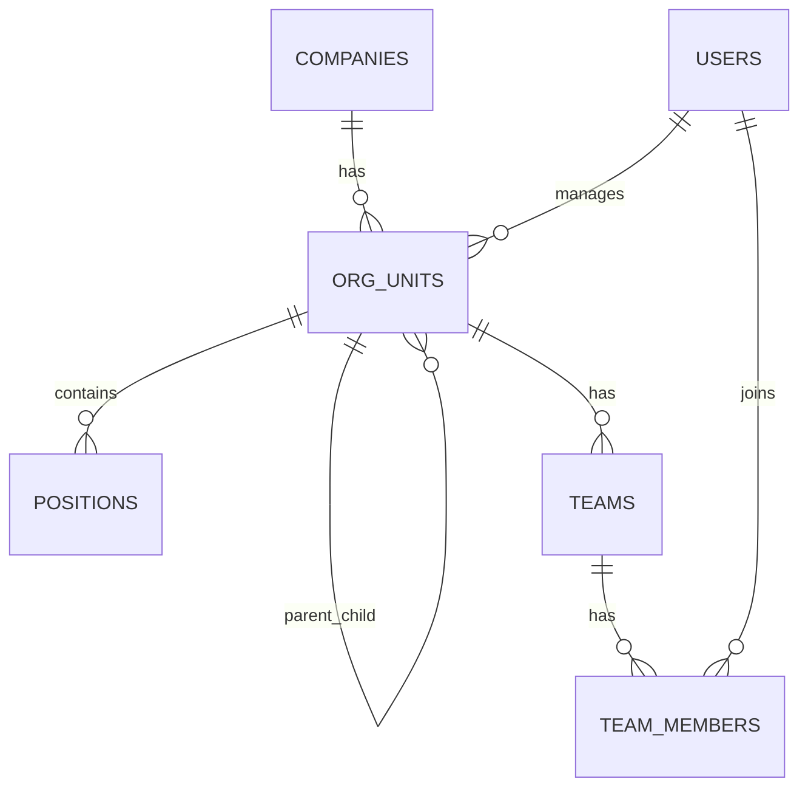

---

# 4. Module 2: User & Employee

## 4.1. Bảng `users`

Dùng cho đăng nhập và định danh người dùng.

```sql
users
- id
- company_id
- email
- phone
- password_hash
- full_name
- avatar_url
- user_type
- status
- last_login_at
- created_at
- updated_at
```

`user_type`:

```text
employee
freelancer
guest
candidate
system_admin
```

---

## 4.2. Bảng `employee_profiles`

Thông tin nhân sự chi tiết.

```sql
employee_profiles
- id
- company_id
- user_id
- employee_code
- org_unit_id
- position_id
- direct_manager_id
- work_type
- employment_type
- start_date
- end_date
- contract_type
- base_salary
- salary_type
- status
```

`work_type`:

```text
offline
remote
hybrid
```

`employment_type`:

```text
full_time
part_time
freelancer
intern
probation
```

---

## 4.3. Bảng `employee_manager_relations`

Dùng khi một nhân sự có nhiều kiểu quản lý.

Ví dụ:

* Quản lý trực tiếp
* Quản lý theo project
* Quản lý chuyên môn
* Quản lý tạm thời

```sql
employee_manager_relations
- id
- company_id
- employee_user_id
- manager_user_id
- relation_type
- scope_type
- scope_id
- start_date
- end_date
- status
```

`relation_type`:

```text
direct_manager
project_manager
professional_manager
temporary_manager
```

---

# 5. Module 3: Role & Permission

## 5.1. Mục tiêu

Hỗ trợ phân quyền theo:

```text
User + Role + Scope + Object + Action
```

---

## 5.2. Bảng `roles`

```sql
roles
- id
- company_id
- name
- code
- description
- is_system_role
- status
```

Ví dụ:

```text
company_owner
system_admin
board
department_manager
team_leader
project_manager
channel_manager
hr_manager
finance_manager
employee
freelancer
```

---

## 5.3. Bảng `permissions`

Danh sách quyền dạng atomic permission.

```sql
permissions
- id
- module
- action
- code
- description
```

Ví dụ:

```text
channel.view
channel.create
channel.edit
channel.delete
channel.view_revenue
channel.view_account
payroll.view_all
payroll.approve
workflow.create
task.assign
approval.approve
finance.export
```

---

## 5.4. Bảng `role_permissions`

```sql
role_permissions
- id
- company_id
- role_id
- permission_id
```

---

## 5.5. Bảng `user_roles`

Một user có thể có nhiều role, mỗi role có thể giới hạn theo scope.

```sql
user_roles
- id
- company_id
- user_id
- role_id
- scope_type
- scope_id
- start_date
- end_date
- status
```

`scope_type`:

```text
company
org_unit
team
project
channel
custom
```

Ví dụ:

```text
User A là Project Manager trong Project X
User B là Channel Manager của Channel Y
User C là Department Manager của Khối sản xuất
```

---

## 5.6. Bảng `object_permissions`

Dùng cho quyền đặc biệt trên từng object cụ thể.

```sql
object_permissions
- id
- company_id
- user_id
- object_type
- object_id
- permission_id
- granted_by
- expires_at
- reason
- status
```

Ví dụ:

```text
Cho User A quyền xem tài khoản đăng nhập của Channel B trong 24 giờ.
```

---

## 5.7. Bảng `audit_logs`

```sql
audit_logs
- id
- company_id
- actor_user_id
- action
- object_type
- object_id
- old_value_json
- new_value_json
- ip_address
- user_agent
- reason
- created_at
```

---

## 5.8. ERD Permission

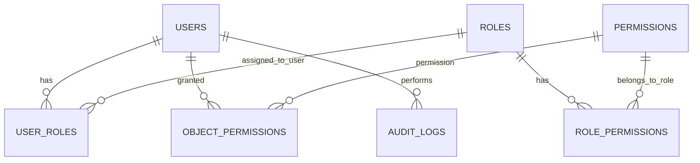

---

# 6. Module 4: Channel & Platform Account

## 6.1. Bảng `platforms`

```sql
platforms
- id
- name
- code
- type
- status
```

Ví dụ:

```text
youtube
tiktok
facebook
instagram
podcast
website
```

---

## 6.2. Bảng `channels`

```sql
channels
- id
- company_id
- platform_id
- name
- code
- url
- language
- target_country
- niche
- channel_manager_id
- primary_team_id
- status
- health_status
- health_score
- created_at
- updated_at
```

`status`:

```text
active
testing
paused
stopped
archived
```

`health_status`:

```text
healthy
watching
declining
risk
paused
stopped
```

---

## 6.3. Bảng `platform_accounts`

Lưu tài khoản nền tảng.

```sql
platform_accounts
- id
- company_id
- platform_id
- account_name
- account_email
- account_identifier
- encrypted_password
- recovery_email
- recovery_phone
- two_factor_note
- owner_user_id
- security_level
- status
```

Lưu ý:

```text
encrypted_password phải mã hóa.
Không lưu plain text password.
Mọi lần xem password phải ghi audit log.
```

---

## 6.4. Bảng `channel_accounts`

Liên kết kênh với nhiều tài khoản.

```sql
channel_accounts
- id
- company_id
- channel_id
- platform_account_id
- relation_type
- status
```

`relation_type`:

```text
main_google_account
recovery_email
adsense
analytics
youtube_channel_account
tiktok_account
facebook_page
```

---

## 6.5. Bảng `channel_members`

Ai tham gia quản lý/vận hành kênh.

```sql
channel_members
- id
- company_id
- channel_id
- user_id
- role_in_channel
- permission_level
- joined_at
- left_at
- status
```

`role_in_channel`:

```text
channel_manager
seo
uploader
content_lead
production_lead
finance_viewer
qa
```

---

## 6.6. ERD Channel

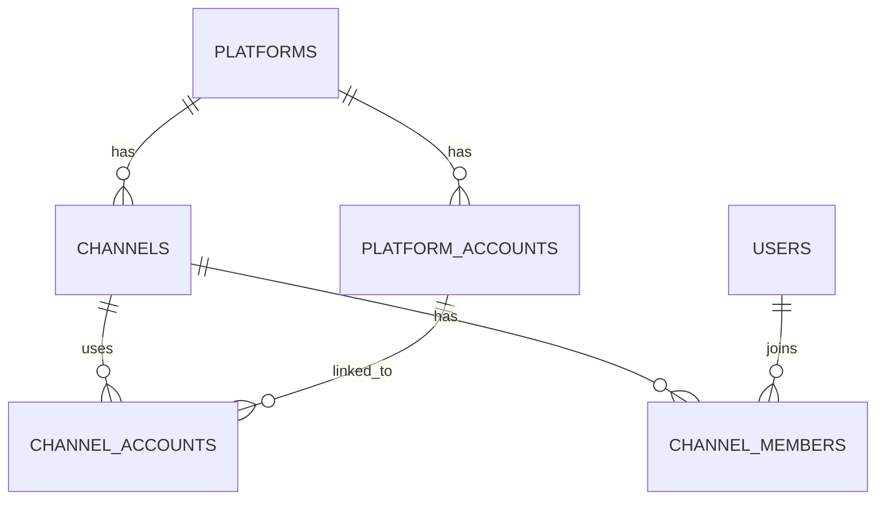

---

# 7. Module 5: Project & Content

## 7.1. Bảng `projects`

Project có thể gồm nhiều kênh, nhiều video, nhiều team.

```sql
projects
- id
- company_id
- name
- code
- project_type
- description
- owner_user_id
- project_manager_id
- start_date
- end_date
- status
- priority
- budget
- created_at
- updated_at
```

`project_type`:

```text
content_production
channel_operation
growth_campaign
recruitment
training
finance
office_internal
equipment
```

---

## 7.2. Bảng `project_channels`

Một project có thể liên quan nhiều kênh.

```sql
project_channels
- id
- company_id
- project_id
- channel_id
- role_in_project
- status
```

---

## 7.3. Bảng `project_teams`

Một project có thể có nhiều team/ekip.

```sql
project_teams
- id
- company_id
- project_id
- team_id
- role_in_project
- status
```

---

## 7.4. Bảng `project_members`

Một project có nhiều nhân sự.

```sql
project_members
- id
- company_id
- project_id
- user_id
- role_in_project
- permission_level
- workload_percent
- start_date
- end_date
- status
```

---

## 7.5. Bảng `content_types`

Quản lý thể loại nội dung.

```sql
content_types
- id
- company_id
- name
- code
- description
- default_workflow_template_id
- default_evaluation_template_id
- target_platform
- standard_duration
- status
```

Ví dụ:

```text
video_long
youtube_short
podcast_story
ai_animation
unboxing
review
social_post
livestream
```

---

## 7.6. Bảng `content_items`

Một nội dung/video cụ thể.

```sql
content_items
- id
- company_id
- project_id
- content_type_id
- title
- code
- description
- owner_user_id
- main_channel_id
- language
- status
- production_status
- planned_publish_at
- published_at
- final_url
- thumbnail_url
- script_url
- video_file_url
- priority
- created_at
- updated_at
```

`production_status`:

```text
idea
planning
in_production
waiting_review
revision
approved
scheduled
published
analyzed
cancelled
```

---

## 7.7. Bảng `content_channels`

Một content có thể đăng nhiều kênh/nhiều nền tảng.

```sql
content_channels
- id
- company_id
- content_item_id
- channel_id
- platform_id
- publish_status
- publish_url
- planned_publish_at
- published_at
```

---

## 7.8. Bảng `content_assets`

Lưu file/link liên quan đến nội dung.

```sql
content_assets
- id
- company_id
- content_item_id
- asset_type
- name
- file_url
- external_url
- version
- uploaded_by
- status
```

`asset_type`:

```text
script
voice
raw_video
edited_video
thumbnail
seo_document
reference
final_output
```

---

## 7.9. ERD Project & Content

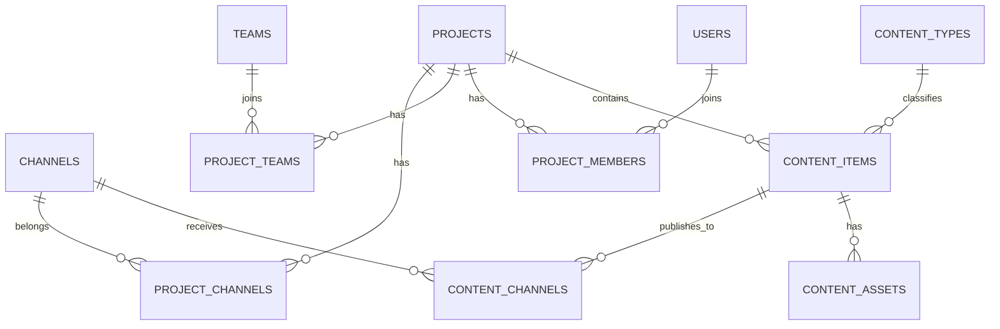

---

# 8. Module 6: Workflow & Task

## 8.1. Bảng `workflow_templates`

Quy trình mẫu.

```sql
workflow_templates
- id
- company_id
- name
- code
- workflow_type
- applies_to_type
- content_type_id
- created_by
- is_active
- status
```

`workflow_type`:

```text
production
office
hr
finance
recruitment
training
equipment
approval
```

`applies_to_type`:

```text
project
content_item
expense_request
leave_request
document
meeting
```

---

## 8.2. Bảng `workflow_step_templates`

Các bước trong workflow mẫu.

```sql
workflow_step_templates
- id
- company_id
- workflow_template_id
- name
- code
- step_order
- step_type
- default_assignee_role
- default_reviewer_role
- default_team_type
- estimated_duration_hours
- is_required
- allow_parallel
- status
```

---

## 8.3. Bảng `workflow_step_dependencies`

Bước nào phụ thuộc bước nào.

```sql
workflow_step_dependencies
- id
- company_id
- workflow_template_id
- step_template_id
- depends_on_step_template_id
- dependency_type
```

`dependency_type`:

```text
must_complete
must_approve
soft_dependency
```

---

## 8.4. Bảng `workflow_instances`

Workflow thật khi áp dụng vào project/content.

```sql
workflow_instances
- id
- company_id
- workflow_template_id
- target_type
- target_id
- project_id
- content_item_id
- started_by
- started_at
- completed_at
- status
```

`target_type`:

```text
project
content_item
expense_request
leave_request
meeting
```

---

## 8.5. Bảng `workflow_step_instances`

Bước thật trong workflow đang chạy.

```sql
workflow_step_instances
- id
- company_id
- workflow_instance_id
- step_template_id
- name
- step_order
- assigned_user_id
- assigned_team_id
- reviewer_user_id
- status
- started_at
- due_at
- completed_at
- approved_at
- locked_reason
```

`status`:

```text
not_started
in_progress
waiting_review
approved
revision
blocked
skipped
cancelled
```

---

## 8.6. Bảng `tasks`

```sql
tasks
- id
- company_id
- project_id
- content_item_id
- workflow_instance_id
- workflow_step_instance_id
- title
- description
- task_type
- assigned_to_user_id
- assigned_to_team_id
- created_by
- reviewer_user_id
- priority
- status
- due_at
- submitted_at
- completed_at
- approved_at
```

`task_type`:

```text
production
review
revision
meeting_action
office
finance
hr
```

---

## 8.7. Bảng `task_comments`

```sql
task_comments
- id
- company_id
- task_id
- user_id
- comment_text
- parent_comment_id
- created_at
```

---

## 8.8. Bảng `task_attachments`

```sql
task_attachments
- id
- company_id
- task_id
- uploaded_by
- file_url
- file_type
- version
- status
```

---

## 8.9. Bảng `checklists`

```sql
checklists
- id
- company_id
- target_type
- target_id
- name
- created_by
- status
```

---

## 8.10. Bảng `checklist_items`

```sql
checklist_items
- id
- company_id
- checklist_id
- title
- description
- is_required
- is_completed
- completed_by
- completed_at
```

---

## 8.11. ERD Workflow & Task

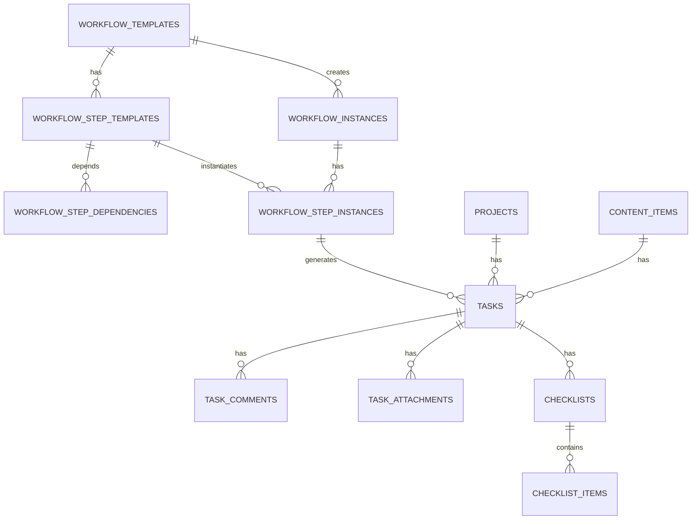

---

# 9. Module 7: Approval & Revision

## 9.1. Bảng `approval_rules`

Quy tắc duyệt.

```sql
approval_rules
- id
- company_id
- name
- applies_to_type
- applies_to_id
- condition_json
- max_level
- status
```

Ví dụ:

```text
Video quan trọng cần duyệt 3 cấp.
Chi phí trên 50 triệu cần CFO + CEO duyệt.
```

---

## 9.2. Bảng `approval_requests`

Một yêu cầu duyệt cụ thể.

```sql
approval_requests
- id
- company_id
- target_type
- target_id
- workflow_step_instance_id
- task_id
- requested_by
- current_level
- max_level
- status
- submitted_at
- completed_at
```

`status`:

```text
pending
approved
rejected
revision_requested
cancelled
```

---

## 9.3. Bảng `approval_steps`

Từng cấp duyệt trong một approval request.

```sql
approval_steps
- id
- company_id
- approval_request_id
- level
- approver_user_id
- approver_role_id
- decision
- comment
- decided_at
```

`decision`:

```text
pending
approved
rejected
revision_requested
skipped
```

---

## 9.4. Bảng `defects`

Lỗi/trả sửa.

```sql
defects
- id
- company_id
- project_id
- content_item_id
- task_id
- workflow_step_instance_id
- reported_by
- responsible_user_id
- defect_type
- severity
- title
- description
- evidence_url
- affects_kpi
- affects_bonus_penalty
- locked_scope_json
- due_at
- resolved_at
- status
```

`defect_type`:

```text
fix_required
serious
```

`severity` có thể dùng:

```text
low
medium
high
critical
```

Trong MVP v1, nghiệp vụ chỉ cần 2 loại chính:

```text
fix_required
serious
```

---

## 9.5. Bảng `defect_histories`

```sql
defect_histories
- id
- company_id
- defect_id
- action
- actor_user_id
- note
- created_at
```

---

## 9.6. ERD Approval & Revision

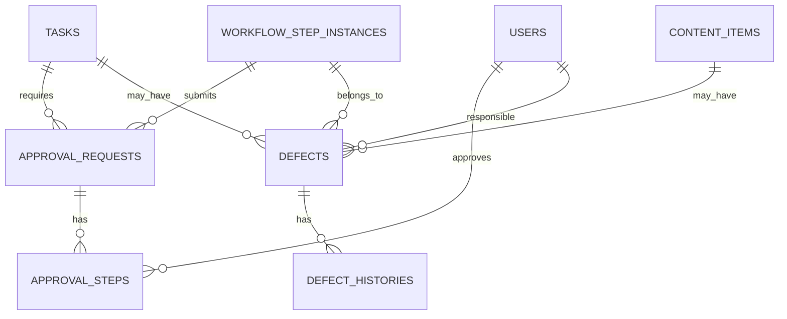

---

# 10. Module 8: Evaluation & KPI

## 10.1. Bảng `evaluation_templates`

Form đánh giá mẫu.

```sql
evaluation_templates
- id
- company_id
- name
- code
- applies_to_type
- content_type_id
- workflow_step_template_id
- role_target
- total_score
- pass_score
- affects_kpi
- status
```

---

## 10.2. Bảng `evaluation_criteria`

Tiêu chí đánh giá.

```sql
evaluation_criteria
- id
- company_id
- evaluation_template_id
- name
- description
- max_score
- weight
- criteria_type
- is_required
- order_index
```

`criteria_type`:

```text
score
pass_fail
text_comment
rating
```

---

## 10.3. Bảng `evaluation_results`

Kết quả đánh giá.

```sql
evaluation_results
- id
- company_id
- evaluation_template_id
- target_type
- target_id
- evaluated_user_id
- evaluator_user_id
- task_id
- content_item_id
- total_score
- passed
- comment
- created_at
```

---

## 10.4. Bảng `evaluation_scores`

Điểm từng tiêu chí.

```sql
evaluation_scores
- id
- company_id
- evaluation_result_id
- evaluation_criteria_id
- score
- pass_fail
- comment
```

---

## 10.5. Bảng `kpi_definitions`

Định nghĩa KPI.

```sql
kpi_definitions
- id
- company_id
- name
- code
- target_type
- formula_json
- measurement_period
- weight
- status
```

`target_type`:

```text
employee
team
department
project
channel
company
```

---

## 10.6. Bảng `kpi_results`

Kết quả KPI theo kỳ.

```sql
kpi_results
- id
- company_id
- kpi_definition_id
- target_type
- target_id
- period_start
- period_end
- value
- score
- calculated_at
- locked_at
- status
```

---

## 10.7. Bảng `performance_reviews`

Đánh giá hiệu suất tổng hợp.

```sql
performance_reviews
- id
- company_id
- employee_user_id
- reviewer_user_id
- period_start
- period_end
- total_score
- rating
- summary
- bonus_recommendation
- penalty_recommendation
- status
```

---

## 10.8. ERD Evaluation & KPI

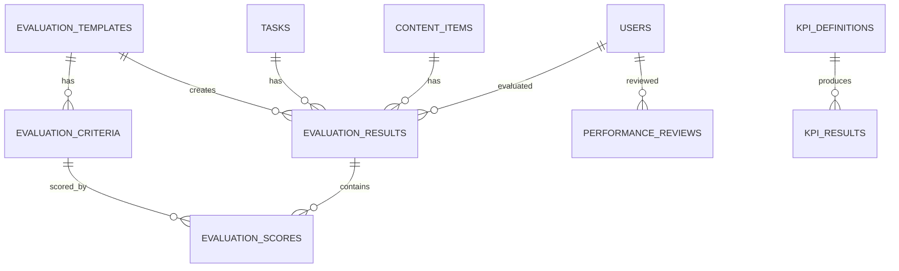

---

# 11. Module 9: HR, Attendance & Leave

## 11.1. Bảng `work_schedules`

```sql
work_schedules
- id
- company_id
- name
- work_type
- start_time
- end_time
- working_days_json
- status
```

---

## 11.2. Bảng `attendance_records`

```sql
attendance_records
- id
- company_id
- user_id
- work_date
- check_in_at
- check_out_at
- check_in_method
- check_out_method
- location_json
- status
- note
```

`status`:

```text
present
late
early_leave
absent
missing_checkin
pending_adjustment
approved_adjustment
```

---

## 11.3. Bảng `attendance_adjustment_requests`

```sql
attendance_adjustment_requests
- id
- company_id
- user_id
- attendance_record_id
- requested_check_in_at
- requested_check_out_at
- reason
- status
- approved_by
- approved_at
```

---

## 11.4. Bảng `leave_types`

```sql
leave_types
- id
- company_id
- name
- code
- paid
- annual_quota
- status
```

---

## 11.5. Bảng `leave_requests`

```sql
leave_requests
- id
- company_id
- user_id
- leave_type_id
- start_date
- end_date
- total_days
- reason
- status
- current_approval_level
- created_at
```

---

## 11.6. Bảng `leave_balances`

```sql
leave_balances
- id
- company_id
- user_id
- leave_type_id
- year
- total_days
- used_days
- remaining_days
```

---

# 12. Module 10: Payroll, Bonus & Penalty

## 12.1. Bảng `salary_profiles`

Thông tin lương mặc định của nhân sự.

```sql
salary_profiles
- id
- company_id
- user_id
- base_salary
- salary_type
- payment_cycle
- effective_from
- effective_to
- status
```

`salary_type`:

```text
fixed
hourly
task_based
video_based
kpi_based
freelancer
```

---

## 12.2. Bảng `payroll_periods`

```sql
payroll_periods
- id
- company_id
- name
- period_start
- period_end
- status
- locked_at
```

---

## 12.3. Bảng `payslips`

```sql
payslips
- id
- company_id
- payroll_period_id
- user_id
- base_salary
- attendance_amount
- kpi_amount
- bonus_amount
- penalty_amount
- allowance_amount
- deduction_amount
- gross_amount
- net_amount
- status
- approved_by
- approved_at
- confirmed_by_employee_at
```

---

## 12.4. Bảng `payslip_items`

Chi tiết từng dòng trong bảng lương.

```sql
payslip_items
- id
- company_id
- payslip_id
- item_type
- name
- amount
- reference_type
- reference_id
- note
```

`item_type`:

```text
base_salary
allowance
bonus
penalty
deduction
kpi_reward
task_payment
video_payment
```

---

## 12.5. Bảng `bonus_penalties`

```sql
bonus_penalties
- id
- company_id
- user_id
- type
- amount
- reason
- reference_type
- reference_id
- proposed_by
- approved_by
- status
```

`type`:

```text
bonus
penalty
```

---

## 12.6. ERD Payroll

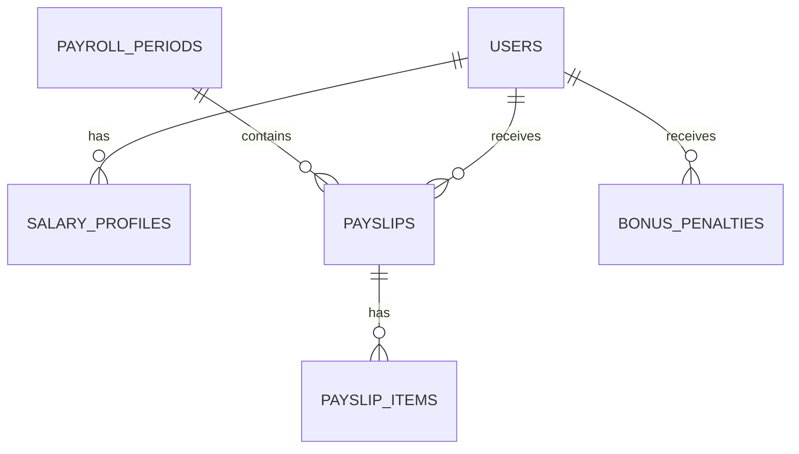

---

# 13. Module 11: Finance

## 13.1. Bảng `revenue_records`

```sql
revenue_records
- id
- company_id
- platform_id
- channel_id
- project_id
- content_item_id
- amount
- currency
- revenue_date
- period_start
- period_end
- source
- entered_by
- attachment_url
- status
```

`source`:

```text
youtube_adsense
tiktok
facebook
sponsorship
affiliate
manual
other
```

---

## 13.2. Bảng `cost_records`

```sql
cost_records
- id
- company_id
- cost_type
- amount
- currency
- cost_date
- org_unit_id
- team_id
- project_id
- channel_id
- content_item_id
- user_id
- vendor_name
- entered_by
- attachment_url
- status
```

`cost_type`:

```text
salary
freelancer
software
equipment
ads
production
training
recruitment
operation
other
```

---

## 13.3. Bảng `cost_allocations`

Phân bổ chi phí tự động.

```sql
cost_allocations
- id
- company_id
- cost_record_id
- allocation_target_type
- allocation_target_id
- allocation_method
- allocated_amount
- allocation_percent
- calculated_at
```

`allocation_target_type`:

```text
channel
project
content_item
team
org_unit
employee
```

`allocation_method`:

```text
manual_percent
by_task_count
by_video_count
by_work_hours
by_revenue_ratio
equal_split
```

---

## 13.4. Bảng `profit_snapshots`

Lưu snapshot lợi nhuận để dashboard tải nhanh.

```sql
profit_snapshots
- id
- company_id
- target_type
- target_id
- period_start
- period_end
- total_revenue
- total_cost
- profit
- profit_margin
- calculated_at
```

`target_type`:

```text
company
platform
channel
project
content_item
org_unit
team
```

---

## 13.5. Bảng `expense_requests`

Đề xuất chi.

```sql
expense_requests
- id
- company_id
- requested_by
- org_unit_id
- project_id
- channel_id
- title
- description
- amount
- currency
- expense_type
- needed_at
- status
- current_approval_level
- attachment_url
```

---

## 13.6. Bảng `expense_approvals`

```sql
expense_approvals
- id
- company_id
- expense_request_id
- approval_level
- approver_user_id
- decision
- comment
- decided_at
```

---

## 13.7. ERD Finance

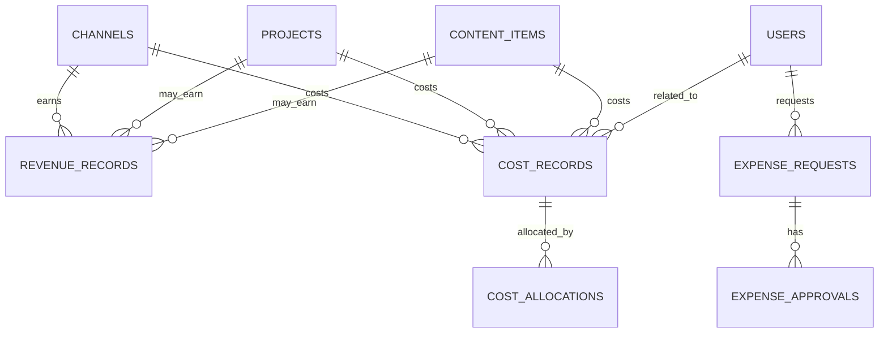

---

# 14. Module 12: Chat, Notification & Meeting

## 14.1. Bảng `chat_rooms`

```sql
chat_rooms
- id
- company_id
- name
- room_type
- related_type
- related_id
- created_by
- is_auto_created
- status
```

`room_type`:

```text
direct
group
project
channel
department
team
meeting
```

---

## 14.2. Bảng `chat_members`

```sql
chat_members
- id
- company_id
- chat_room_id
- user_id
- role_in_room
- joined_at
- left_at
- muted
- status
```

---

## 14.3. Bảng `messages`

```sql
messages
- id
- company_id
- chat_room_id
- sender_user_id
- message_type
- content
- attachment_url
- reply_to_message_id
- edited_at
- deleted_at
- created_at
```

`message_type`:

```text
text
file
image
system
task_reference
approval_reference
```

---

## 14.4. Bảng `notifications`

```sql
notifications
- id
- company_id
- user_id
- notification_type
- title
- content
- related_type
- related_id
- priority
- is_required
- read_at
- created_at
```

`priority`:

```text
low
normal
high
critical
```

---

## 14.5. Bảng `notification_rules`

```sql
notification_rules
- id
- company_id
- notification_type
- required_level
- can_mute
- default_channels_json
- status
```

`required_level`:

```text
required
partially_mutable
optional
```

---

## 14.6. Bảng `notification_preferences`

```sql
notification_preferences
- id
- company_id
- user_id
- notification_type
- web_enabled
- mobile_enabled
- email_enabled
- chat_enabled
```

Lưu ý:

```text
Nếu notification_rules.can_mute = false,
thì user không được tắt notification đó.
```

---

## 14.7. Bảng `meeting_rooms`

```sql
meeting_rooms
- id
- company_id
- name
- room_type
- location
- online_url
- capacity
- status
```

`room_type`:

```text
physical
online
hybrid
```

---

## 14.8. Bảng `meetings`

```sql
meetings
- id
- company_id
- title
- organizer_user_id
- meeting_room_id
- project_id
- channel_id
- start_at
- end_at
- agenda
- status
```

---

## 14.9. Bảng `meeting_attendees`

```sql
meeting_attendees
- id
- company_id
- meeting_id
- user_id
- attendance_status
- role_in_meeting
```

---

## 14.10. Bảng `meeting_notes`

```sql
meeting_notes
- id
- company_id
- meeting_id
- note_content
- created_by
- created_at
```

---

## 14.11. Bảng `meeting_tasks`

Liên kết meeting với task sau họp.

```sql
meeting_tasks
- id
- company_id
- meeting_id
- task_id
```

---

## 14.12. ERD Chat & Meeting

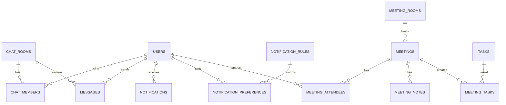

---

# 15. ERD quan trọng nhất: Project → Content → Workflow → Task → Approval → KPI

Đây là lõi vận hành sản xuất media.

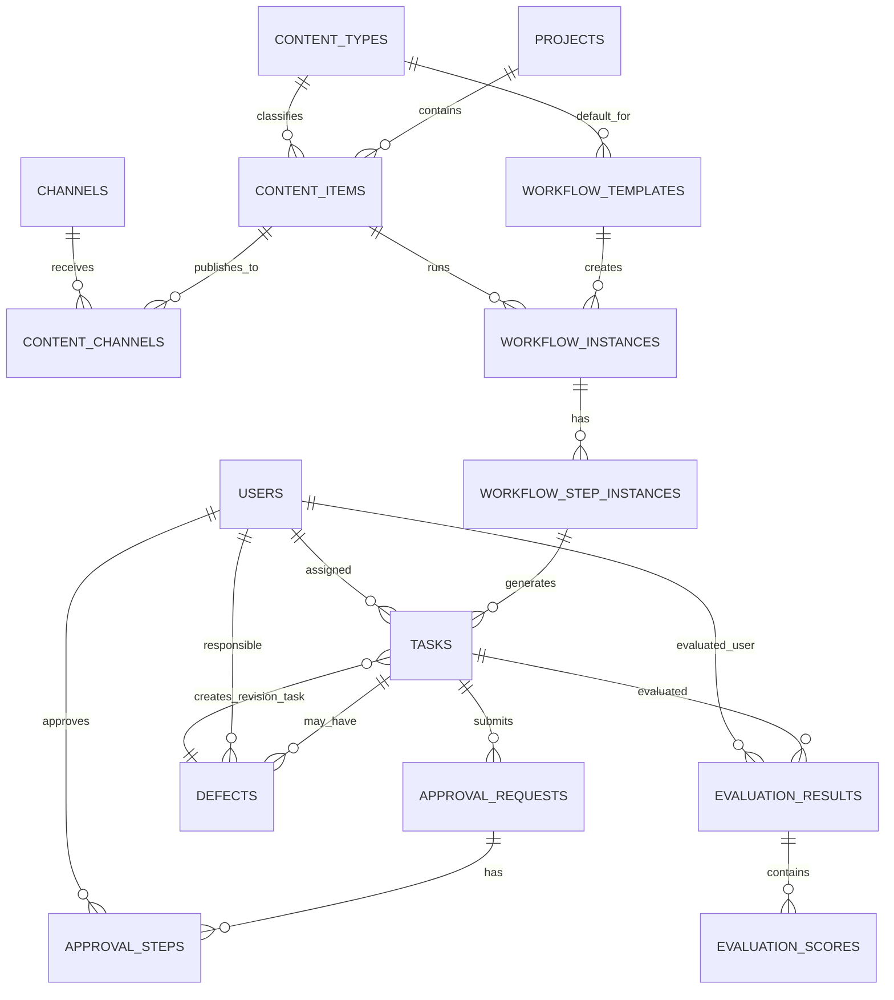

Luồng dữ liệu:

```text
Project tạo ra nhiều Content Item.
Content Item chọn Content Type.
Content Type gợi ý Workflow Template.
Workflow Template sinh Workflow Instance.
Workflow Instance sinh Step Instance.
Step Instance sinh Task.
Task được nộp và duyệt.
Nếu lỗi thì tạo Defect.
Nếu đạt thì tạo Evaluation Result.
Evaluation Result đi vào KPI.
KPI ảnh hưởng Payroll/Bonus/Penalty.
```

---

# 16. Các bảng nên ưu tiên xây dựng trong MVP v1

## Phase Database 1 — Core

```text
companies
users
employee_profiles
org_units
positions
teams
team_members
roles
permissions
role_permissions
user_roles
audit_logs
```

---

## Phase Database 2 — Media Operation

```text
platforms
channels
platform_accounts
channel_accounts
channel_members
projects
project_channels
project_teams
project_members
content_types
content_items
content_channels
content_assets
```

---

## Phase Database 3 — Workflow & Task

```text
workflow_templates
workflow_step_templates
workflow_step_dependencies
workflow_instances
workflow_step_instances
tasks
task_comments
task_attachments
checklists
checklist_items
```

---

## Phase Database 4 — Approval, Evaluation, KPI

```text
approval_rules
approval_requests
approval_steps
defects
defect_histories
evaluation_templates
evaluation_criteria
evaluation_results
evaluation_scores
kpi_definitions
kpi_results
performance_reviews
```

---

## Phase Database 5 — HR, Payroll, Finance, Communication

```text
attendance_records
attendance_adjustment_requests
leave_types
leave_requests
leave_balances
salary_profiles
payroll_periods
payslips
payslip_items
bonus_penalties

revenue_records
cost_records
cost_allocations
profit_snapshots
expense_requests
expense_approvals

chat_rooms
chat_members
messages
notifications
notification_rules
notification_preferences
meeting_rooms
meetings
meeting_attendees
meeting_notes
meeting_tasks
```

---

# 17. Index nên có

## 17.1. Index chung

Các bảng lớn nên có index:

```sql
company_id
status
created_at
updated_at
```

---

## 17.2. Index cho task

```sql
tasks(company_id, assigned_to_user_id, status)
tasks(company_id, project_id, status)
tasks(company_id, content_item_id, status)
tasks(company_id, due_at)
```

---

## 17.3. Index cho workflow

```sql
workflow_instances(company_id, target_type, target_id)
workflow_step_instances(company_id, workflow_instance_id, status)
```

---

## 17.4. Index cho project/content

```sql
projects(company_id, status)
content_items(company_id, project_id, status)
content_items(company_id, main_channel_id, production_status)
content_channels(company_id, channel_id, publish_status)
```

---

## 17.5. Index cho finance

```sql
revenue_records(company_id, channel_id, period_start, period_end)
cost_records(company_id, channel_id, cost_date)
cost_records(company_id, project_id, cost_date)
cost_allocations(company_id, allocation_target_type, allocation_target_id)
```

---

## 17.6. Index cho chat/notification

```sql
messages(company_id, chat_room_id, created_at)
notifications(company_id, user_id, read_at)
notifications(company_id, user_id, priority)
```

---

# 18. Những điểm cần lưu ý khi đội dev triển khai

## 18.1. Không hard-code phòng ban

Không tạo bảng riêng kiểu:

```text
script_department
editor_department
seo_department
```

Mà dùng:

```text
org_units
teams
positions
```

---

## 18.2. Không hard-code workflow

Không code cứng:

```text
script -> voice -> edit -> upload
```

Mà dùng:

```text
workflow_templates
workflow_step_templates
workflow_instances
workflow_step_instances
workflow_step_dependencies
```

---

## 18.3. Không hard-code quyền

Không dùng đơn giản:

```text
is_admin = true
```

Mà dùng:

```text
roles
permissions
user_roles
object_permissions
```

---

## 18.4. Không để video là project duy nhất

Vì yêu cầu của bạn là:

```text
Một project có thể có nhiều kênh, nhiều video, nhiều ekip.
```

Nên cần tách rõ:

```text
projects
content_items
content_channels
```

---

## 18.5. Dữ liệu nhạy cảm phải tách quyền

Các nhóm dữ liệu nhạy cảm:

```text
platform_accounts
salary_profiles
payslips
revenue_records
cost_records
profit_snapshots
audit_logs
```

Không cho kế thừa quyền tự động từ role thông thường.

---

# 19. Kết luận ERD MVP v1

Database MVP v1 nên được thiết kế quanh 5 trục lõi:

```text
1. Organization: công ty, phòng ban, team, nhân sự
2. Media: kênh, tài khoản, project, video/content
3. Workflow: quy trình, task, duyệt, trả sửa
4. Performance: đánh giá, KPI, lương, thưởng/phạt
5. Finance & Communication: doanh thu, chi phí, chat, thông báo, họp
```

Cấu trúc quan trọng nhất là:

```text
Company
→ Org Unit / Team / User
→ Channel
→ Project
→ Content Item
→ Workflow Instance
→ Step Instance
→ Task
→ Approval / Defect / Evaluation
→ KPI
→ Payroll / Finance / Dashboard
```

Thiết kế này đủ cho MVP nội bộ, đồng thời vẫn chuẩn bị sẵn nền móng để mở rộng thành SaaS sau này.
