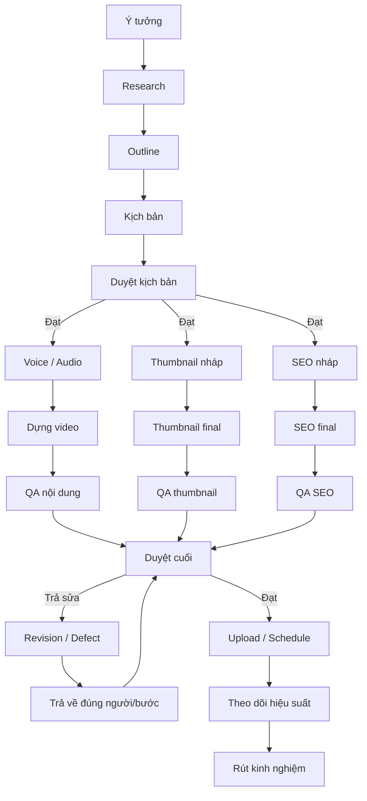
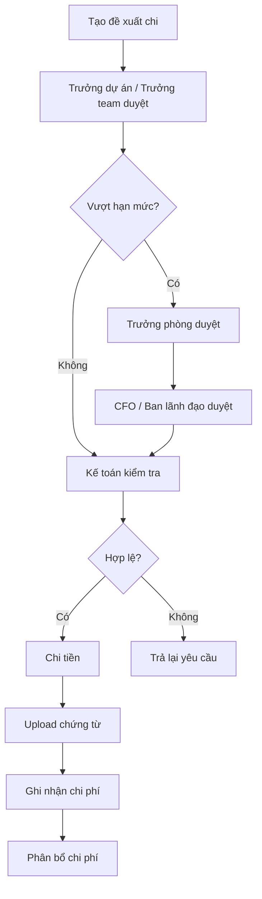
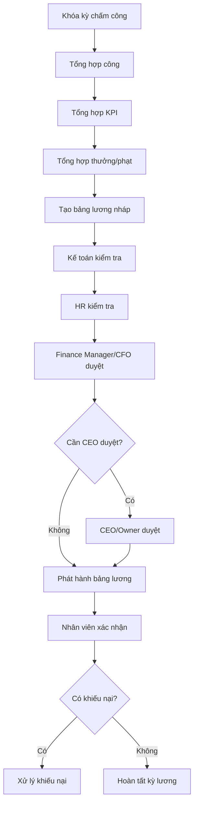

# THIẾT KẾ WORKFLOW MẪU — MVP v1

## Media Company Operating System

---

# 1. Nguyên tắc chung của Workflow Engine

Mỗi workflow trong hệ thống cần hỗ trợ:

```text
1. Bước tuần tự
2. Bước song song
3. Bước bắt buộc
4. Bước không bắt buộc
5. Duyệt 1-3 cấp
6. Trả sửa đúng người, đúng bước
7. Khóa phần liên quan khi có lỗi
8. Chấm điểm sản phẩm
9. Ghi nhận dữ liệu vào KPI
10. Liên kết task, chat, file, thông báo
```

---

# 2. Trạng thái chuẩn của workflow

## 2.1. Trạng thái workflow tổng

```text
Draft
Active
Paused
Completed
Cancelled
Archived
```

## 2.2. Trạng thái từng bước

```text
Not Started
In Progress
Waiting Review
Approved
Revision Required
Blocked
Skipped
Cancelled
Completed
```

## 2.3. Trạng thái task

```text
Chưa bắt đầu
Đang làm
Chờ duyệt
Cần sửa
Đã duyệt
Hoàn thành
Quá hạn
Hủy
```

---

# 3. Cấu trúc chuẩn của một bước workflow

Mỗi bước workflow nên có các trường sau:

```text
Tên bước
Mô tả bước
Người thực hiện mặc định
Team thực hiện mặc định
Người duyệt mặc định
Số cấp duyệt
Deadline mặc định
Checklist bắt buộc
File/link bắt buộc
Form đánh giá
Bước phụ thuộc
Bước được chạy song song
Điều kiện hoàn thành
Điều kiện khóa
Điều kiện trả sửa
Có ảnh hưởng KPI không
Có ảnh hưởng lương/thưởng/phạt không
```

---

# 4. Danh sách workflow mẫu nên có trong MVP v1

MVP v1 nên tạo sẵn các workflow sau:

```text
A. Workflow sản xuất nội dung
1. Workflow video YouTube dài tiêu chuẩn
2. Workflow video hoạt hình AI
3. Workflow YouTube Shorts / TikTok / Reels
4. Workflow podcast kể chuyện
5. Workflow unboxing / review sản phẩm
6. Workflow social post / community post

B. Workflow vận hành kênh
7. Workflow vận hành kênh hằng tháng
8. Workflow xử lý cảnh báo sức khỏe kênh

C. Workflow văn phòng
9. Workflow xin nghỉ phép
10. Workflow bổ sung/chỉnh sửa chấm công
11. Workflow đề xuất chi
12. Workflow duyệt bảng lương
13. Workflow họp và giao task sau họp
14. Workflow tuyển dụng cơ bản
15. Workflow onboarding nhân sự mới
16. Workflow mượn/trả thiết bị
```

---

# 5. Workflow 1: Video YouTube dài tiêu chuẩn

## 5.1. Mục tiêu

Dùng cho video YouTube dài thông thường: kể chuyện, giải trí, giáo dục, review, tổng hợp, phân tích.

## 5.2. Sơ đồ tổng quan

```text
Ý tưởng
→ Research
→ Outline
→ Kịch bản
→ Duyệt kịch bản
→ Voice / Audio
→ Dựng video
→ Thumbnail
→ SEO Metadata
→ QA nội dung
→ Duyệt cuối
→ Upload / Schedule
→ Theo dõi hiệu suất
→ Rút kinh nghiệm
```

## 5.3. Chi tiết từng bước

| Bước                   | Người thực hiện                | Người duyệt                       | Chạy song song                        | Ảnh hưởng KPI |
| ---------------------- | ------------------------------ | --------------------------------- | ------------------------------------- | ------------- |
| 1. Ý tưởng             | Content Planner / Researcher   | Project Manager                   | Không                                 | Có            |
| 2. Research            | Researcher                     | Team Leader                       | Không                                 | Có            |
| 3. Outline             | Script Writer                  | Script Leader                     | Không                                 | Có            |
| 4. Kịch bản            | Script Writer                  | Script Leader / Project Manager   | Không                                 | Có            |
| 5. Voice / Audio       | Voice Staff / AI Voice Staff   | QA / Project Manager              | Có thể song song sau khi script duyệt | Có            |
| 6. Dựng video          | Editor                         | Team Leader / QA                  | Không                                 | Có            |
| 7. Thumbnail           | Thumbnail Designer             | Channel Manager / Project Manager | Có thể song song                      | Có            |
| 8. SEO Metadata        | SEO Staff                      | SEO Leader / Channel Manager      | Có thể song song                      | Có            |
| 9. QA nội dung         | QA Reviewer                    | QA Manager                        | Không                                 | Có            |
| 10. Duyệt cuối         | Project Manager / Trưởng phòng | Cấp 2 hoặc 3 nếu cần              | Không                                 | Có            |
| 11. Upload             | Uploader                       | Channel Manager                   | Không                                 | Có            |
| 12. Theo dõi hiệu suất | Channel Manager / SEO          | Head of SEO                       | Sau publish                           | Có            |
| 13. Rút kinh nghiệm    | Project Manager                | Không bắt buộc                    | Sau có dữ liệu                        | Có            |

## 5.4. Rule song song

```text
Voice chỉ bắt đầu sau khi script được duyệt.
Thumbnail có thể bắt đầu sau khi có concept video.
SEO có thể chuẩn bị sau khi có title nháp.
Upload chỉ mở khi video final, thumbnail, title, description đều được duyệt.
```

## 5.5. Checklist duyệt cuối

```text
Video đúng nội dung
Không lỗi âm thanh
Không lỗi hình ảnh
Không sai chính tả
Thumbnail đúng style kênh
Title đạt chuẩn SEO
Description đầy đủ
Tag đầy đủ
Không vi phạm bản quyền
Không lộ thông tin nội bộ
Đúng lịch đăng
```

## 5.6. Quy tắc trả sửa

```text
Lỗi script → trả về Script Writer
Lỗi voice → trả về Voice Staff
Lỗi dựng → trả về Editor
Lỗi thumbnail → trả về Thumbnail Designer
Lỗi SEO → trả về SEO Staff
Lỗi upload → trả về Uploader
```

---

# 6. Workflow 2: Video hoạt hình AI

## 6.1. Mục tiêu

Dành cho video hoạt hình AI, video nhân vật 3D, video kể chuyện bằng hình ảnh AI, nội dung có nhiều cảnh và nhiều prompt.

## 6.2. Sơ đồ

```text
Ý tưởng
→ Kịch bản
→ Chia cảnh
→ Thiết kế nhân vật / style
→ Viết prompt hình ảnh
→ Tạo hình ảnh
→ QA hình ảnh
→ Tạo voice
→ Dựng video
→ QA continuity
→ Thumbnail
→ SEO
→ Duyệt cuối
→ Upload
→ Phân tích hiệu suất
```

## 6.3. Chi tiết bước

| Bước                    | Người thực hiện                | Người duyệt      | Ghi chú                          |
| ----------------------- | ------------------------------ | ---------------- | -------------------------------- |
| Ý tưởng                 | Content Planner                | Project Manager  | Chọn concept, target audience    |
| Kịch bản                | Script Writer                  | Script Leader    | Phải đúng thể loại               |
| Chia cảnh               | Script Writer / Director       | Project Manager  | Chuyển script thành shot list    |
| Thiết kế nhân vật/style | AI Art Lead / Designer         | Project Manager  | Đảm bảo nhân vật nhất quán       |
| Viết prompt hình ảnh    | Prompt Creator                 | AI Art Lead      | Theo từng cảnh                   |
| Tạo hình ảnh            | AI Image Creator               | AI Art Lead / QA | Có version ảnh                   |
| QA hình ảnh             | QA Reviewer                    | Project Manager  | Kiểm tra nhân vật, lỗi AI        |
| Tạo voice               | Voice Staff / AI Voice         | QA               | Đúng cảm xúc                     |
| Dựng video              | Editor                         | Team Leader      | Ghép ảnh, voice, nhạc, hiệu ứng  |
| QA continuity           | QA Reviewer                    | Project Manager  | Kiểm tra liền mạch nhân vật/cảnh |
| Thumbnail               | Thumbnail Designer             | Channel Manager  | Đúng style kênh                  |
| SEO                     | SEO Staff                      | SEO Leader       | Title, mô tả, tag                |
| Duyệt cuối              | Project Manager / Trưởng phòng | Cấp 2/3 nếu cần  | Final                            |
| Upload                  | Uploader                       | Channel Manager  | Schedule                         |
| Phân tích               | Channel Manager                | Head of SEO      | View, CTR, retention             |

## 6.4. Checklist QA hình ảnh AI

```text
Nhân vật đúng mô tả
Trang phục nhất quán
Màu tóc/mắt/đặc điểm không sai
Không lỗi tay/chân/khuôn mặt nghiêm trọng
Không sai bối cảnh
Không sai tỷ lệ nhân vật
Không có chữ lỗi trong hình
Không vi phạm chính sách nền tảng
```

## 6.5. Checklist QA continuity

```text
Cảnh trước và cảnh sau liên kết hợp lý
Nhân vật không đổi ngoại hình bất thường
Không lệch cảm xúc với voice
Không sai thứ tự sự kiện
Không thiếu cảnh quan trọng
Không lặp hình quá nhiều
Nhịp dựng phù hợp
```

## 6.6. Quy tắc khóa khi trả sửa

```text
Lỗi hình ảnh một cảnh → khóa cảnh đó và bước dựng liên quan
Lỗi nhân vật chính → khóa toàn bộ các cảnh dùng nhân vật đó
Lỗi voice → khóa dựng video nhưng không khóa thumbnail nếu thumbnail đã đạt
Lỗi thumbnail → chỉ khóa upload
```

---

# 7. Workflow 3: YouTube Shorts / TikTok / Reels

## 7.1. Mục tiêu

Dành cho video ngắn, tốc độ sản xuất nhanh, có thể tái sử dụng đa nền tảng.

## 7.2. Sơ đồ

```text
Chọn ý tưởng/trend
→ Viết hook
→ Script ngắn
→ Tạo/quay/dựng nhanh
→ Caption/Text overlay
→ QA nhanh
→ SEO/Hashtag
→ Duyệt
→ Đăng đa nền tảng
→ Theo dõi chỉ số 24h
```

## 7.3. Chi tiết bước

| Bước                 | Người thực hiện                   | Người duyệt          | Deadline gợi ý |
| -------------------- | --------------------------------- | -------------------- | -------------- |
| Chọn ý tưởng/trend   | Content Planner                   | Team Leader          | Trong ngày     |
| Viết hook            | Script Writer                     | Team Leader          | Trong ngày     |
| Script ngắn          | Script Writer                     | Team Leader          | Trong ngày     |
| Dựng nhanh           | Editor                            | QA / Team Leader     | 1 ngày         |
| Caption/Text overlay | Editor / SEO                      | QA                   | 1 ngày         |
| QA nhanh             | QA Reviewer                       | Team Leader          | Trong ngày     |
| SEO/Hashtag          | SEO Staff                         | SEO Leader           | Trong ngày     |
| Duyệt                | Project Manager / Channel Manager | Không bắt buộc cấp 3 | Trong ngày     |
| Đăng                 | Uploader                          | Channel Manager      | Theo lịch      |
| Theo dõi 24h         | Channel Manager                   | Head of SEO          | Sau đăng       |

## 7.4. Checklist video ngắn

```text
Hook trong 1-3 giây đầu
Không dài dòng
Text dễ đọc trên mobile
Âm thanh rõ
Nhịp nhanh
Không lỗi chính tả
Hashtag phù hợp
Không vi phạm bản quyền âm thanh/hình ảnh
```

## 7.5. Chỉ số sau đăng

```text
View 1h
View 24h
Tỷ lệ giữ chân
Tỷ lệ xem hết
Like/comment/share
Follower/subscriber tăng
```

---

# 8. Workflow 4: Podcast kể chuyện

## 8.1. Mục tiêu

Dành cho video podcast kể chuyện, chuyện cảm động, tâm lý, plot twist, ngụ ngôn, bài học cuộc sống.

## 8.2. Sơ đồ

```text
Chọn chủ đề
→ Research câu chuyện
→ Outline cảm xúc
→ Viết kịch bản
→ Duyệt kịch bản
→ Thu âm / AI Voice
→ Xử lý âm thanh
→ Tạo hình nền / visual
→ Dựng video
→ QA cảm xúc & logic
→ Thumbnail
→ SEO
→ Duyệt cuối
→ Upload
→ Phân tích retention
```

## 8.3. Tiêu chí đánh giá riêng

### Kịch bản podcast

```text
Hook mở đầu mạnh
Câu chuyện có cao trào
Cảm xúc tăng dần
Nhân vật có động cơ rõ
Plot twist hợp lý
Thông điệp cuối sâu sắc
Không quá lê thê
Phù hợp đối tượng khán giả
```

### Voice/audio

```text
Giọng rõ
Cảm xúc phù hợp
Ngắt nghỉ tốt
Không rè/noise
Không quá đều đều
Nhấn đúng đoạn cao trào
```

### Video final

```text
Hình nền không gây phân tâm
Nhạc nền phù hợp
Subtitle nếu có phải đúng
Nhịp dựng phù hợp câu chuyện
Không phá cảm xúc
```

## 8.4. Quy tắc duyệt

```text
Kịch bản cần ít nhất 2 cấp duyệt nếu là video dài/quan trọng.
Voice cần QA cảm xúc.
Final cần Project Manager duyệt.
Video chiến lược cần Trưởng phòng/Ban lãnh đạo duyệt thêm.
```

---

# 9. Workflow 5: Unboxing / Review sản phẩm

## 9.1. Mục tiêu

Dành cho kênh unboxing đồ chơi, review sản phẩm, review thiết bị, so sánh sản phẩm.

## 9.2. Sơ đồ

```text
Chọn sản phẩm
→ Duyệt sản phẩm
→ Chuẩn bị thiết bị/quay
→ Quay footage
→ Kiểm tra footage
→ Viết voice/script bổ sung
→ Dựng video
→ QA thông tin sản phẩm
→ Thumbnail
→ SEO
→ Duyệt cuối
→ Upload
→ Theo dõi hiệu suất
```

## 9.3. Chi tiết bước

| Bước                  | Người thực hiện                   | Người duyệt          |
| --------------------- | --------------------------------- | -------------------- |
| Chọn sản phẩm         | Content Planner / Channel Manager | Project Manager      |
| Duyệt sản phẩm        | Project Manager                   | Trưởng phòng nếu cần |
| Chuẩn bị thiết bị     | Equipment Staff / Producer        | Production Manager   |
| Quay footage          | Camera/Production Staff           | Production Lead      |
| Kiểm tra footage      | QA / Editor                       | Production Lead      |
| Voice/script bổ sung  | Script Writer / Voice             | Project Manager      |
| Dựng video            | Editor                            | QA                   |
| QA thông tin sản phẩm | QA / Channel Manager              | Project Manager      |
| Thumbnail             | Thumbnail Designer                | Channel Manager      |
| SEO                   | SEO Staff                         | SEO Leader           |
| Duyệt cuối            | Project Manager                   | Trưởng phòng nếu cần |
| Upload                | Uploader                          | Channel Manager      |

## 9.4. Checklist quay footage

```text
Sản phẩm rõ nét
Đủ cảnh mở hộp
Đủ cảnh chi tiết
Ánh sáng tốt
Âm thanh sạch nếu có thu trực tiếp
Không lộ thông tin không cần thiết
Không thiếu cảnh quan trọng
```

## 9.5. Checklist QA thông tin sản phẩm

```text
Tên sản phẩm đúng
Tính năng đúng
Giá/thông tin nếu có phải chính xác
Không nói quá sai sự thật
Không vi phạm chính sách quảng cáo
Không gây hiểu nhầm cho khán giả
```

---

# 10. Workflow 6: Social Post / Community Post

## 10.1. Mục tiêu

Dành cho bài đăng cộng đồng YouTube, Facebook post, Instagram post, thông báo lịch đăng, poll, teaser.

## 10.2. Sơ đồ

```text
Ý tưởng post
→ Viết nội dung
→ Thiết kế hình ảnh nếu cần
→ Duyệt nội dung
→ Lên lịch đăng
→ Đăng
→ Theo dõi tương tác
```

## 10.3. Checklist

```text
Nội dung ngắn gọn
Không sai chính tả
Đúng tone thương hiệu/kênh
Hình ảnh đúng kích thước
CTA rõ
Không vi phạm chính sách
Đúng lịch đăng
```

## 10.4. Quy tắc duyệt

```text
Post thông thường: 1 cấp duyệt
Post quan trọng: 2 cấp duyệt
Post liên quan tài chính/thông báo lớn: 3 cấp duyệt nếu cấu hình
```

---

# 11. Workflow 7: Vận hành kênh hằng tháng

## 11.1. Mục tiêu

Dùng cho Channel Manager, SEO, kế toán và quản lý kênh để theo dõi sức khỏe kênh.

## 11.2. Sơ đồ

```text
Tạo kế hoạch tháng
→ Lập lịch nội dung
→ Phân bổ project/video
→ Theo dõi tiến độ đăng
→ Nhập doanh thu
→ Nhập/kiểm tra chi phí
→ Đánh giá Channel Health
→ Báo cáo tháng
→ Đề xuất hành động tháng sau
```

## 11.3. Chi tiết bước

| Bước                   | Người thực hiện                   | Người duyệt         |
| ---------------------- | --------------------------------- | ------------------- |
| Kế hoạch tháng         | Channel Manager                   | Head of SEO / Board |
| Lịch nội dung          | Channel Manager / Project Manager | Channel Manager     |
| Phân bổ project/video  | Project Manager                   | Channel Manager     |
| Theo dõi tiến độ       | Channel Manager                   | Head of SEO         |
| Nhập doanh thu         | Kế toán / Channel Manager         | Finance Manager     |
| Kiểm tra chi phí       | Kế toán                           | Finance Manager     |
| Đánh giá sức khỏe kênh | Channel Manager                   | Head of SEO         |
| Báo cáo tháng          | Channel Manager                   | Board               |
| Đề xuất hành động      | Channel Manager                   | Board / Head of SEO |

## 11.4. Channel Health Checklist

```text
Tần suất đăng có ổn định không
View tăng hay giảm
Subscriber tăng hay giảm
CTR tốt hay xấu
Retention tốt hay xấu
Doanh thu tăng hay giảm
Chi phí có vượt không
Có cảnh báo bản quyền không
Có rủi ro tài khoản không
Team phụ trách có quá tải không
```

---

# 12. Workflow 8: Xử lý cảnh báo sức khỏe kênh

## 12.1. Mục tiêu

Dùng khi một kênh bị giảm hiệu suất, có rủi ro tài khoản, rủi ro doanh thu hoặc vấn đề vận hành.

## 12.2. Sơ đồ

```text
Phát hiện cảnh báo
→ Phân loại cảnh báo
→ Gán người xử lý
→ Phân tích nguyên nhân
→ Đề xuất giải pháp
→ Duyệt giải pháp
→ Thực hiện
→ Theo dõi kết quả
→ Đóng cảnh báo
```

## 12.3. Loại cảnh báo

```text
Giảm view
Giảm doanh thu
Giảm CTR
Giảm retention
Chậm lịch đăng
Tăng chi phí bất thường
Rủi ro bản quyền
Rủi ro tài khoản
Thiếu nhân sự phụ trách
Kênh không có kế hoạch nội dung
```

## 12.4. Quy tắc escalation

```text
Cảnh báo nhẹ → Channel Manager xử lý
Cảnh báo trung bình → Head of SEO/Production duyệt
Cảnh báo nghiêm trọng → Ban lãnh đạo nhận thông báo
```

---

# 13. Workflow 9: Xin nghỉ phép

## 13.1. Sơ đồ

```text
Nhân viên tạo đơn nghỉ
→ Team Leader duyệt
→ Trưởng phòng duyệt nếu cần
→ HR xác nhận
→ Cập nhật lịch làm việc
→ Thông báo cho team liên quan
```

## 13.2. Dữ liệu cần có

```text
Loại nghỉ
Thời gian nghỉ
Lý do
Người bàn giao việc
Task bị ảnh hưởng
File đính kèm nếu cần
```

## 13.3. Quy tắc duyệt

```text
Nghỉ ngắn: Team Leader → HR
Nghỉ dài: Team Leader → Trưởng phòng → HR
Nghỉ đặc biệt: Trưởng phòng → HR → Ban lãnh đạo
```

## 13.4. Điều kiện hệ thống cần kiểm tra

```text
Số ngày phép còn lại
Task/deadline trong thời gian nghỉ
Có người thay thế chưa
Có trùng lịch nghỉ nhiều người trong team không
```

---

# 14. Workflow 10: Bổ sung/chỉnh sửa chấm công

## 14.1. Sơ đồ

```text
Nhân viên tạo đơn bổ sung công
→ Nhập lý do
→ Team Leader xác nhận
→ HR kiểm tra
→ Duyệt hoặc từ chối
→ Cập nhật dữ liệu chấm công
→ Đồng bộ sang payroll
```

## 14.2. Loại đơn

```text
Quên check-in
Quên check-out
Sai giờ check-in
Sai giờ check-out
Làm remote
Làm ngoài giờ
Đi công tác
```

## 14.3. Quy tắc

```text
Đơn đã duyệt sẽ ảnh hưởng bảng công.
Bảng công đã khóa kỳ lương thì không được sửa nếu không có quyền đặc biệt.
Mọi chỉnh sửa công phải ghi audit log.
```

---

# 15. Workflow 11: Đề xuất chi

## 15.1. Sơ đồ

```text
Người đề xuất tạo phiếu chi
→ Trưởng team/trưởng dự án duyệt
→ Trưởng phòng duyệt nếu cần
→ Kế toán kiểm tra
→ CFO/Ban lãnh đạo duyệt nếu vượt hạn mức
→ Chi tiền
→ Upload chứng từ
→ Ghi nhận chi phí
→ Phân bổ chi phí
```

## 15.2. Dữ liệu cần có

```text
Tên khoản chi
Loại chi phí
Số tiền
Phòng ban
Kênh liên quan
Project liên quan
Video liên quan nếu có
Lý do chi
Ngày cần chi
File báo giá/hóa đơn
Người đề xuất
Người duyệt
```

## 15.3. Quy tắc duyệt theo hạn mức

```text
Chi phí nhỏ → Trưởng dự án + Kế toán
Chi phí trung bình → Trưởng phòng + Finance Manager
Chi phí lớn → CFO + CEO/Owner
```

## 15.4. Sau khi duyệt

```text
Tạo cost_record
Nếu có kênh/project/video liên quan → tạo cost_allocation
Nếu là chi phí dùng chung → phân bổ theo rule
```

---

# 16. Workflow 12: Duyệt bảng lương

## 16.1. Sơ đồ

```text
Khóa kỳ chấm công
→ Tổng hợp công
→ Tổng hợp KPI
→ Tổng hợp thưởng/phạt
→ Tạo bảng lương nháp
→ Kế toán kiểm tra
→ HR kiểm tra
→ Finance Manager/CFO duyệt
→ CEO/Owner duyệt nếu cần
→ Phát hành bảng lương
→ Nhân viên xác nhận
→ Xử lý khiếu nại nếu có
```

## 16.2. Dữ liệu đầu vào

```text
Lương cơ bản
Chấm công
Nghỉ phép
KPI
Task hoàn thành
Lỗi loại 1
Lỗi loại 2
Thưởng
Phạt
Phụ cấp
Khấu trừ
Tạm ứng
```

## 16.3. Quy tắc bảo mật

```text
Nhân viên chỉ xem bảng lương của mình.
Trưởng team không mặc định được xem lương team.
HR/Finance xem theo quyền được cấp.
Mọi lần sửa bảng lương phải ghi audit log.
```

---

# 17. Workflow 13: Họp và giao task sau họp

## 17.1. Sơ đồ

```text
Tạo lịch họp
→ Chọn phòng họp/link online
→ Mời người tham gia
→ Tạo agenda
→ Họp
→ Ghi biên bản
→ Tạo task sau họp
→ Gán người phụ trách
→ Theo dõi task
→ Đóng cuộc họp
```

## 17.2. Loại cuộc họp

```text
Họp sản xuất
Họp duyệt nội dung
Họp chiến lược kênh
Họp SEO
Họp HR
Họp tài chính
Họp ban lãnh đạo
Họp 1-1
Họp xử lý sự cố
```

## 17.3. Task sau họp

Mỗi task sau họp cần có:

```text
Tên task
Người phụ trách
Deadline
Project/kênh liên quan
Mức độ ưu tiên
Ghi chú từ biên bản họp
Trạng thái xử lý
```

---

# 18. Workflow 14: Tuyển dụng cơ bản

## 18.1. Sơ đồ

```text
Tạo nhu cầu tuyển dụng
→ Trưởng phòng duyệt nhu cầu
→ HR đăng tin
→ Nhận ứng viên
→ Lọc CV/portfolio
→ Gửi bài test
→ Chấm bài test
→ Phỏng vấn HR
→ Phỏng vấn chuyên môn
→ Duyệt offer
→ Ứng viên nhận việc
→ Chuyển sang onboarding
```

## 18.2. Trạng thái ứng viên

```text
Mới ứng tuyển
Đã xem hồ sơ
Mời test
Đã nộp test
Đạt test
Không đạt test
Mời phỏng vấn
Đạt phỏng vấn
Không đạt
Gửi offer
Nhận việc
Từ chối
```

## 18.3. Dữ liệu cần có

```text
Vị trí tuyển
Phòng ban
Người đề xuất tuyển
CV
Portfolio
Bài test
Điểm test
Ghi chú HR
Ghi chú chuyên môn
Mức lương đề xuất
Ngày có thể bắt đầu
```

---

# 19. Workflow 15: Onboarding nhân sự mới

## 19.1. Sơ đồ

```text
Tạo hồ sơ nhân sự
→ Gán phòng ban/chức vụ
→ Gán quản lý trực tiếp
→ Tạo tài khoản hệ thống
→ Gán role/permission
→ Gán khóa đào tạo bắt buộc
→ Gán tài liệu cần đọc
→ Gán thiết bị nếu cần
→ Tạo lịch onboarding
→ Hoàn thành bài test đầu vào
→ Quản lý xác nhận sẵn sàng làm việc
```

## 19.2. Checklist onboarding

```text
Có hồ sơ nhân sự
Có hợp đồng/thông tin pháp lý
Có tài khoản hệ thống
Có role/permission phù hợp
Có quản lý trực tiếp
Có team/phòng ban
Có tài liệu quy trình
Có khóa đào tạo bắt buộc
Có thiết bị nếu cần
Có task thử việc đầu tiên
```

---

# 20. Workflow 16: Mượn/trả thiết bị

## 20.1. Sơ đồ

```text
Nhân viên tạo yêu cầu mượn
→ Quản lý duyệt
→ Equipment Manager kiểm tra thiết bị
→ Bàn giao thiết bị
→ Ghi nhận ảnh/tình trạng trước khi mượn
→ Sử dụng
→ Nhắc hạn trả
→ Trả thiết bị
→ Ghi nhận ảnh/tình trạng sau khi trả
→ Xác nhận hoàn tất
→ Nếu hỏng/mất: tạo biên bản lỗi/chi phí
```

## 20.2. Dữ liệu cần có

```text
Thiết bị
Mã tài sản
Người mượn
Mục đích mượn
Project/kênh liên quan
Ngày mượn
Ngày trả dự kiến
Tình trạng trước khi mượn
Tình trạng sau khi trả
Ảnh minh chứng
Chi phí phát sinh nếu có
```

---

# 21. Workflow mẫu theo kiểu Mermaid

## 21.1. Workflow sản xuất nội dung tổng quát



---

## 21.2. Workflow đề xuất chi



---

## 21.3. Workflow lương



---

# 22. Template cấu hình workflow trong hệ thống

Khi đưa vào phần mềm, mỗi workflow template nên có cấu hình dạng sau:

```json
{
  "workflow_name": "Video YouTube dài tiêu chuẩn",
  "workflow_type": "production",
  "applies_to": "content_item",
  "max_approval_level": 3,
  "allow_parallel_steps": true,
  "steps": [
    {
      "name": "Ý tưởng",
      "order": 1,
      "assignee_role": "Content Planner",
      "reviewer_role": "Project Manager",
      "required": true,
      "affects_kpi": true
    },
    {
      "name": "Kịch bản",
      "order": 2,
      "assignee_role": "Script Writer",
      "reviewer_role": "Script Leader",
      "required": true,
      "affects_kpi": true
    },
    {
      "name": "Dựng video",
      "order": 3,
      "assignee_role": "Editor",
      "reviewer_role": "QA Reviewer",
      "required": true,
      "affects_kpi": true
    }
  ]
}
```

---

# 23. Quy tắc áp dụng workflow vào project/video

Khi tạo một video/content item:

```text
1. Người tạo chọn loại nội dung.
2. Hệ thống gợi ý workflow mặc định theo content_type.
3. Trưởng dự án có thể giữ nguyên hoặc chỉnh workflow.
4. Hệ thống tạo Workflow Instance.
5. Hệ thống tạo Step Instance.
6. Hệ thống tạo task tương ứng.
7. Gửi thông báo cho người được giao.
8. Tạo group chat project/video nếu cấu hình bật.
```

---

# 24. Quy tắc tạo task tự động

Mỗi workflow step có thể sinh ra một hoặc nhiều task.

Ví dụ bước “Dựng video” có thể sinh:

```text
Task 1: Nhận script và voice
Task 2: Dựng bản nháp
Task 3: Nộp bản dựng lần 1
Task 4: Sửa feedback nếu có
Task 5: Nộp final
```

Bước “SEO” có thể sinh:

```text
Task 1: Viết title
Task 2: Viết description
Task 3: Tạo tag
Task 4: Kiểm tra keyword
Task 5: Nộp SEO final
```

---

# 25. Quy tắc đánh giá và KPI

Mỗi bước có thể cấu hình:

```text
Có chấm điểm hay không
Form đánh giá nào
Điểm có ảnh hưởng KPI không
Lỗi có ảnh hưởng thưởng/phạt không
Trọng số điểm trong KPI tháng
```

Ví dụ:

```text
Script: 30% điểm chất lượng của biên kịch
Dựng video: 40% điểm chất lượng của editor
Thumbnail: 30% điểm chất lượng của designer
SEO: 30% điểm chất lượng của SEO staff
Đúng deadline: áp dụng cho tất cả vai trò
Lỗi nghiêm trọng: ảnh hưởng thưởng/phạt
```

---

# 26. Quy tắc thông báo trong workflow

Hệ thống phải gửi thông báo khi:

```text
Có task mới
Task sắp deadline
Task quá hạn
Sản phẩm được nộp
Có yêu cầu duyệt
Sản phẩm được duyệt
Sản phẩm bị trả sửa
Có lỗi nghiêm trọng
Bước bị khóa
Bước được mở lại
Workflow hoàn thành
Có task sau họp
Có đề xuất chi cần duyệt
Có bảng lương cần xác nhận
```

Thông báo cấp bắt buộc không cho nhân viên tắt:

```text
Task được giao
Deadline
Trả sửa
Duyệt
Lịch họp bắt buộc
Chấm công
Lương/thưởng/phạt
KPI
Bảo mật
```

---

# 27. Kết luận

Bộ workflow mẫu MVP v1 cần bao phủ 3 nhóm lớn:

```text
1. Sản xuất nội dung
2. Vận hành kênh
3. Quy trình văn phòng
```

Trong đó workflow quan trọng nhất là:

```text
Video Production Workflow
AI Animation Workflow
Short Video Workflow
Channel Monthly Operation Workflow
Expense Approval Workflow
Payroll Approval Workflow
Leave Request Workflow
Meeting Action Workflow
```

Thiết kế này giúp hệ thống không chỉ quản lý video, mà quản lý toàn bộ hoạt động của công ty media theo hướng có thể mở rộng thành SaaS sau này.
