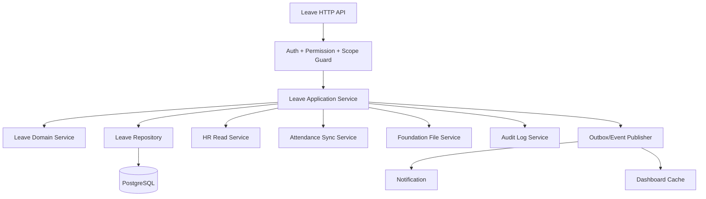
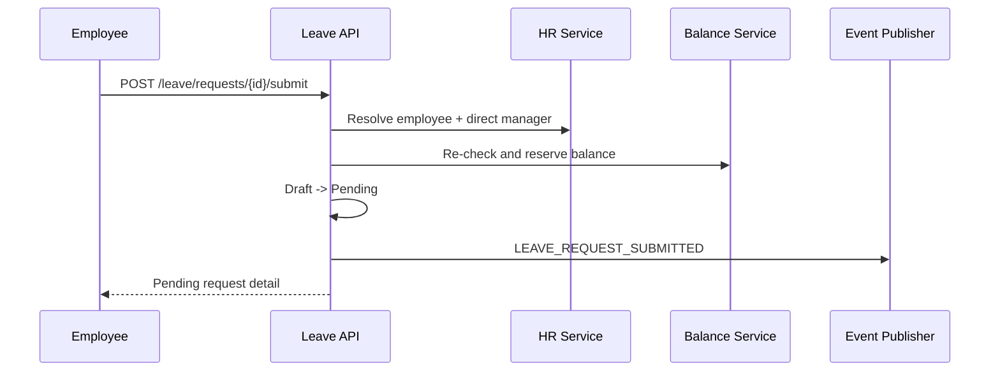
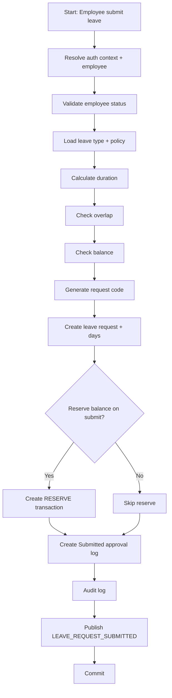
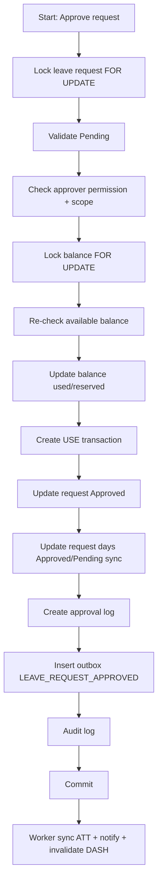
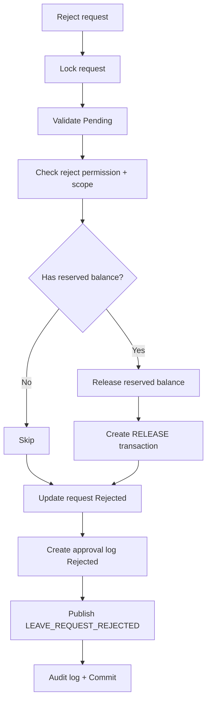
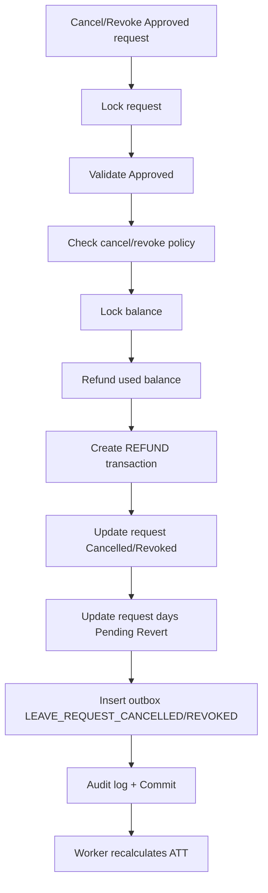

# BACKEND-07: LEAVE BACKEND
# TRIỂN KHAI BACKEND MODULE NGHỈ PHÉP
# HỆ THỐNG QUẢN LÝ DOANH NGHIỆP NỘI BỘ

> **📚 Bộ tài liệu BACKEND — Hệ thống Quản lý Doanh nghiệp**
> [BACKEND-01 Kiến trúc/Setup](<BACKEND-01_Backend_Architecture_Project_Setup.md>) · [BACKEND-02 Migration/ORM/Seed](<BACKEND-02_Database_Migration_ORM_Seed_Implementation.md>) · [BACKEND-03 Auth/RBAC](<BACKEND-03_Auth_Session_RBAC_Permission_Guard.md>) · [BACKEND-04 Foundation](<BACKEND-04_Foundation_Backend.md>) · [BACKEND-05 HR](<BACKEND-05_HR_Backend.md>) · [BACKEND-06 Attendance](<BACKEND-06_Attendance_Backend.md>) · **BACKEND-07 Leave** · [BACKEND-08 Task](<BACKEND-08_Task_Backend.md>) · [BACKEND-09 Notification](<BACKEND-09_Notification_Backend.md>) · [BACKEND-10 Dashboard](<BACKEND-10_Dashboard_Backend.md>) · [BACKEND-11 File/Audit/Settings/Jobs](<BACKEND-11_File_Audit_Settings_System_Jobs.md>) · [BACKEND-12 API Contract/OpenAPI](<BACKEND-12_API_Integration_Contract_OpenAPI_Swagger.md>) · [BACKEND-13 Testing/Security/Perf](<BACKEND-13_Backend_Testing_Security_Performance.md>) · [BACKEND-14 Release Readiness](<BACKEND-14_Backend_Release_Readiness.md>)
>
> **Nguồn & liên quan:** [Đặc tả: SPEC-05 LEAVE](<../SPEC/SPEC-05 LEAVE.md>) · [DB: DB-05 LEAVE](<../DB/DB-05 LEAVE Database Design.md>) · [API: API-05 LEAVE](<../API Design/API-05_LEAVE_API_Design.md>) · [Màn hình: UI-09](<../UI/UI-09_Module_UI_Design.md>) · [Frontend: FRONTEND-10](<../FRONTEND/FRONTEND-10_Leave_Frontend.md>) · [Chỉ mục: README](<../README.md>)

---

## 1. Thông tin tài liệu

| Trường | Nội dung |
| --- | --- |
| Mã tài liệu | BACKEND-07 |
| Tên tài liệu | Leave Backend |
| Tên dự án | Hệ thống quản lý doanh nghiệp nội bộ |
| Tên sản phẩm | Enterprise Management System |
| Module | LEAVE - Nghỉ phép |
| Phiên bản | v1.0 |
| Trạng thái | Draft |
| Giai đoạn | Backend Implementation - MVP Version 1.0 |
| Ngày tạo | 20/06/2026 |
| Ngày cập nhật | 20/06/2026 |
| Tài liệu nguồn | PRD-00, SPEC-01 -> SPEC-08, DB-01 -> DB-10, API-01 -> API-10, UI-01 -> UI-10, FRONTEND-01 -> FRONTEND-14, BACKEND-01 -> BACKEND-06 |
| Người viết |  |
| Người duyệt |  |

---

## 2. Mục đích tài liệu

BACKEND-07 mô tả cách triển khai backend cho module **LEAVE - Nghỉ phép**.

Tài liệu này dùng để:

1. Chuyển nghiệp vụ nghỉ phép từ SPEC-05, DB-05 và API-05 thành kiến trúc backend có thể triển khai.
2. Chuẩn hóa controller, DTO, service, repository, transaction, guard, event và test cho module LEAVE.
3. Đảm bảo backend xử lý đúng quy trình tạo đơn, lưu nháp, gửi đơn, duyệt, từ chối, hủy, thu hồi và điều chỉnh số dư phép.
4. Đảm bảo mọi thao tác LEAVE kiểm tra authentication, permission, data scope và business rule ở backend.
5. Đảm bảo số dư phép không bị sai khi có duyệt/hủy/từ chối/điều chỉnh đồng thời.
6. Đảm bảo đồng bộ đơn nghỉ đã duyệt/hủy/thu hồi sang module ATT.
7. Đảm bảo phát notification event cho NOTI và invalidation event cho DASH.
8. Đảm bảo audit log, file private, idempotency và error handling thống nhất toàn hệ thống.
9. Làm checklist cho Backend, Frontend, QA và DevOps khi nghiệm thu module Leave Backend.

---

## 3. Vị trí BACKEND-07 trong roadmap backend

```text
BACKEND-01: Backend Architecture & Project Setup
BACKEND-02: Database Migration, ORM & Seed Implementation
BACKEND-03: Auth, Session, RBAC & Permission Guard
BACKEND-04: Foundation Backend
BACKEND-05: HR Backend
BACKEND-06: Attendance Backend
BACKEND-07: Leave Backend
BACKEND-08: Task Backend
BACKEND-09: Notification Backend
BACKEND-10: Dashboard Backend
BACKEND-11: File, Audit, Settings & System Jobs
BACKEND-12: API Integration Contract & OpenAPI/Swagger
BACKEND-13: Backend Testing, Security & Performance
BACKEND-14: Backend Release Readiness
```

BACKEND-07 được triển khai sau BACKEND-06 vì module LEAVE cần đồng bộ với ATT khi đơn nghỉ được duyệt, hủy hoặc thu hồi.

---

## 4. Căn cứ triển khai

BACKEND-07 bám theo các quyết định đã chốt:

1. Module LEAVE quản lý loại nghỉ, chính sách nghỉ, số dư phép, đơn nghỉ, lịch nghỉ, duyệt/từ chối/hủy và đồng bộ dữ liệu nghỉ phép sang chấm công.
2. API LEAVE dùng prefix public `/api/v1/leave`.
3. Backend phải resolve `company_id` từ auth context, không tin `company_id` do frontend gửi.
4. Backend phải resolve `employee_id` từ user hiện tại cho API self-service.
5. AUTH/RBAC là nguồn kiểm tra permission và data scope.
6. HR là nguồn dữ liệu employee, department, direct manager, job level, contract và employment status.
7. ATT nhận dữ liệu nghỉ Approved/Cancelled/Revoked để cập nhật hoặc tính lại bảng công.
8. NOTI nhận event từ LEAVE để tạo thông báo.
9. DASH lấy dữ liệu phép còn lại, đơn chờ duyệt và lịch nghỉ để hiển thị widget.
10. FOUNDATION cung cấp audit log, file service, setting service, sequence service, public holiday service và idempotency nếu có.
11. DB-05 xác định 7 bảng MVP bắt buộc: `leave_types`, `leave_policies`, `leave_balances`, `leave_balance_transactions`, `leave_requests`, `leave_request_days`, `leave_request_approvals`.
12. Mọi thao tác quan trọng phải chạy trong transaction database và tạo audit log.
13. Không xóa cứng dữ liệu nghỉ phép quan trọng; dùng soft delete hoặc transaction đảo chiều.
14. Lý do nghỉ và file đính kèm có thể là dữ liệu nhạy cảm, cần masking theo permission.

---

## 5. Phạm vi BACKEND-07

### 5.1 Bao gồm trong MVP

| Nhóm | Nội dung triển khai |
| --- | --- |
| Leave module structure | Module, route, controller, service, repository, DTO, mapper, policy engine |
| My Leave Balance | Xem số dư phép của user hiện tại |
| My Leave Request | Tạo, lưu nháp, cập nhật nháp, gửi, xem, hủy đơn nghỉ của chính mình |
| Leave Request Admin | Manager/HR/Admin xem danh sách, xem chi tiết, duyệt, từ chối, hủy/thu hồi theo quyền |
| Leave Calculation | Preview số ngày/giờ nghỉ, kiểm tra ngày làm việc, ngày lễ, ca làm, balance và xung đột |
| Leave Calendar | Lịch nghỉ cá nhân, team, department, company theo data scope |
| Leave Type | CRUD mềm loại nghỉ phép |
| Leave Policy | CRUD mềm chính sách nghỉ phép |
| Leave Balance Admin | Danh sách balance, điều chỉnh số dư, xem ledger transaction |
| Leave File | Link/unlink file chứng minh qua file service dùng chung |
| Leave History | Lịch sử xử lý đơn nghỉ và lịch sử biến động số dư |
| ATT Sync | Đồng bộ Approved/Cancelled/Revoked sang attendance records |
| NOTI Event | Phát event gửi thông báo nghỉ phép |
| DASH Cache | Invalidate cache widget liên quan |
| Audit | Ghi audit log thao tác quan trọng |
| Export | Export danh sách đơn nghỉ/số dư theo quyền ở mức MVP cơ bản |
| Test | Unit, integration, permission, scope, transaction, concurrency và regression test |

### 5.2 Chưa đi sâu trong MVP nhưng cần chừa thiết kế

| Nhóm | Giai đoạn | Hướng mở rộng |
| --- | --- | --- |
| Multi-level approval nâng cao | Phase sau | Approval flow theo nhiều step, HR xác nhận sau manager |
| Leave accrual job tự động | Phase sau | Cộng phép theo tháng/quý/năm/thâm niên |
| Yearly reset/carry over | Phase sau | Reset phép đầu năm, chuyển phép tồn có giới hạn |
| Compensatory leave | Phase sau | Nghỉ bù liên kết overtime |
| Leave import Excel | Phase sau | Import số dư phép, preview, validate, commit |
| Calendar integration | Phase sau | Đồng bộ Google/Microsoft Calendar |
| Mobile push | Phase sau | NOTI/MOBILE xử lý device token |
| AI suggestion | Phase 5 | Gợi ý người thay thế, cảnh báo thiếu nhân sự |

---

## 6. Kiến trúc module LEAVE

### 6.1 Module boundary

```text
modules/leave
  -> HTTP API cho nghỉ phép
  -> nghiệp vụ tính ngày nghỉ
  -> nghiệp vụ quản lý balance ledger
  -> approval workflow cơ bản
  -> calendar query
  -> sync sang ATT
  -> publish event sang NOTI/DASH
```

LEAVE không chịu trách nhiệm:

1. Xác thực token: thuộc AUTH.
2. Quản lý hồ sơ nhân viên: thuộc HR.
3. Tính công gốc/check-in/check-out: thuộc ATT.
4. Tạo notification hiển thị cuối cùng: thuộc NOTI.
5. Render dashboard widget: thuộc DASH.
6. Lưu file vật lý: thuộc FOUNDATION File Service.

### 6.2 Layer đề xuất

```text
LeaveController
  -> nhận request HTTP, validate DTO cơ bản, gọi service

LeaveApplicationService
  -> điều phối use case, transaction, permission scope, idempotency, event

LeaveDomainService
  -> rule nghiệp vụ thuần: state transition, duration, balance, policy

LeaveRepository
  -> query/write database cho leave tables

LeaveMapper
  -> map entity -> DTO response, masking dữ liệu nhạy cảm

LeaveEventPublisher
  -> publish domain event qua outbox/event bus

LeaveSyncService
  -> hợp đồng đồng bộ LEAVE -> ATT
```

### 6.3 Sơ đồ phụ thuộc



---

## 7. Cấu trúc thư mục đề xuất

```text
src/modules/leave/
  leave.module.ts

  controllers/
    leave-me.controller.ts
    leave-request.controller.ts
    leave-approval.controller.ts
    leave-calendar.controller.ts
    leave-type.controller.ts
    leave-policy.controller.ts
    leave-balance.controller.ts
    leave-file.controller.ts
    leave-export.controller.ts
    internal-leave-sync.controller.ts

  dto/
    requests/
      create-leave-request.dto.ts
      update-leave-draft.dto.ts
      submit-leave-request.dto.ts
      cancel-leave-request.dto.ts
      approve-leave-request.dto.ts
      reject-leave-request.dto.ts
      revoke-leave-request.dto.ts
      preview-leave-calculation.dto.ts
      create-leave-type.dto.ts
      update-leave-type.dto.ts
      create-leave-policy.dto.ts
      update-leave-policy.dto.ts
      adjust-leave-balance.dto.ts
      link-leave-file.dto.ts
    queries/
      leave-request-list.query.ts
      my-leave-request-list.query.ts
      pending-approval-list.query.ts
      leave-calendar.query.ts
      leave-balance-list.query.ts
      leave-type-list.query.ts
      leave-policy-list.query.ts
      leave-export.query.ts
    responses/
      leave-request-summary.response.ts
      leave-request-detail.response.ts
      leave-balance.response.ts
      leave-balance-transaction.response.ts
      leave-type.response.ts
      leave-policy.response.ts
      leave-calendar-item.response.ts
      leave-calculation-preview.response.ts

  enums/
    leave-request-status.enum.ts
    leave-duration-type.enum.ts
    leave-day-part.enum.ts
    leave-balance-transaction-type.enum.ts
    leave-policy-scope.enum.ts
    leave-sync-status.enum.ts
    leave-approval-action.enum.ts

  services/
    leave-request.service.ts
    leave-approval.service.ts
    leave-calculation.service.ts
    leave-balance.service.ts
    leave-policy.service.ts
    leave-type.service.ts
    leave-calendar.service.ts
    leave-file.service.ts
    leave-export.service.ts
    leave-att-sync.service.ts
    leave-event.service.ts
    leave-sensitive-field.service.ts

  repositories/
    leave-request.repository.ts
    leave-balance.repository.ts
    leave-type.repository.ts
    leave-policy.repository.ts
    leave-calendar.repository.ts
    leave-approval.repository.ts

  mappers/
    leave-request.mapper.ts
    leave-balance.mapper.ts
    leave-type.mapper.ts
    leave-policy.mapper.ts
    leave-calendar.mapper.ts

  guards/
    leave-scope.guard.ts
    leave-sensitive-field.guard.ts

  policies/
    leave-state-machine.policy.ts
    leave-balance.policy.ts
    leave-cancel.policy.ts
    leave-approval.policy.ts
    leave-duration.policy.ts

  events/
    leave.events.ts
    leave-event.payloads.ts

  tests/
    unit/
    integration/
    e2e/
```

Nếu backend đang dùng module/layer convention khác, vẫn giữ nguyên ranh giới: **controller -> application service -> domain policy -> repository -> event/outbox**.

---

## 8. Database entities backend cần map

### 8.1 Bảng chính

| Entity | Bảng | Vai trò backend |
| --- | --- | --- |
| `LeaveTypeEntity` | `leave_types` | Danh mục loại nghỉ, rule theo loại nghỉ |
| `LeavePolicyEntity` | `leave_policies` | Chính sách theo company/department/employee/job level/contract type |
| `LeaveBalanceEntity` | `leave_balances` | Số dư hiện tại để query nhanh |
| `LeaveBalanceTransactionEntity` | `leave_balance_transactions` | Ledger biến động số dư |
| `LeaveRequestEntity` | `leave_requests` | Đơn nghỉ tổng |
| `LeaveRequestDayEntity` | `leave_request_days` | Chi tiết từng ngày/phần ngày nghỉ |
| `LeaveRequestApprovalEntity` | `leave_request_approvals` | Lịch sử submit/approve/reject/cancel/revoke |

### 8.2 Bảng phụ thuộc đọc/ghi

| Bảng | Module | Cách backend LEAVE dùng |
| --- | --- | --- |
| `users` | AUTH | Actor tạo/gửi/duyệt/từ chối/hủy/điều chỉnh |
| `employees` | HR | Chủ thể nghỉ phép, direct manager, department, employment status |
| `departments` | HR | Data scope, filter calendar, policy scope |
| `job_levels` | HR | Policy scope nếu bật |
| `employee_contracts` | HR | Policy theo contract type/ngày vào làm nếu bật |
| `shifts` | ATT | Tính giờ nghỉ theo ca |
| `attendance_records` | ATT | Đồng bộ trạng thái nghỉ sau approve/cancel/revoke |
| `public_holidays` | FOUNDATION | Loại trừ ngày lễ/ngày không làm việc |
| `files`, `file_links` | FOUNDATION | File chứng minh đơn nghỉ |
| `audit_logs` | FOUNDATION | Ghi log thao tác quan trọng |
| `sequence_counters` | FOUNDATION | Sinh mã đơn nghỉ, transaction code |
| `notifications`, `notification_events` | NOTI | Nhận event nghỉ phép |
| `dashboard_widget_cache` | DASH | Invalidate cache liên quan |

---

## 9. Enum và hằng số nghiệp vụ

### 9.1 Leave request status

```ts
export enum LeaveRequestStatus {
  Draft = 'Draft',
  Pending = 'Pending',
  Approved = 'Approved',
  Rejected = 'Rejected',
  Cancelled = 'Cancelled',
  Revoked = 'Revoked',
}
```

State transition hợp lệ:

```text
Draft -> Pending
Draft -> Cancelled
Pending -> Approved
Pending -> Rejected
Pending -> Cancelled
Approved -> Cancelled     nếu policy cho phép
Approved -> Revoked       HR/Admin thu hồi
Rejected -> terminal
Cancelled -> terminal
Revoked -> terminal
```

Backend bắt buộc kiểm tra state transition trong service, không chỉ dựa vào frontend.

### 9.2 Duration type

```ts
export enum LeaveDurationType {
  FullDay = 'FullDay',
  HalfDay = 'HalfDay',
  Hourly = 'Hourly',
  MultipleDays = 'MultipleDays',
}
```

### 9.3 Half day session

Giá trị lưu ở cột `leave_requests.half_day_session` / `leave_request_days.half_day_session` (DB-05). Field wire/DTO dùng đúng tên cột `half_day_session`.

```ts
export enum LeaveHalfDaySession {
  Morning = 'Morning',
  Afternoon = 'Afternoon',
}
```

### 9.4 Balance transaction type

Giá trị lưu = DB-05 CHECK `leave_balance_transactions.transaction_type` (12 giá trị):

```ts
export enum LeaveBalanceTransactionType {
  Opening = 'OPENING',
  Grant = 'GRANT',
  Accrual = 'ACCRUAL',
  Reserve = 'RESERVE',
  Release = 'RELEASE',
  Use = 'USE',
  Refund = 'REFUND',
  Adjustment = 'ADJUSTMENT',
  Expire = 'EXPIRE',
  CarryOver = 'CARRY_OVER',
  Import = 'IMPORT',
  SystemRecalculate = 'SYSTEM_RECALCULATE',
}
```

Nguyên tắc ledger:

1. Không update balance nếu không tạo transaction.
2. Pending có thể `RESERVE` nếu policy bật giữ chỗ.
3. Reject/cancel Pending tạo `RELEASE` nếu đã reserve.
4. Approve tạo `USE` nếu leave type trừ phép.
5. Cancel/Revoked sau Approved tạo `REFUND` nếu policy cho phép.
6. HR điều chỉnh tạo `ADJUSTMENT`.

### 9.5 Sync status

Giá trị lưu = DB-05 CHECK `attendance_sync_status` (dùng chuỗi có khoảng trắng, khớp DB):

```ts
export enum LeaveSyncStatus {
  NotRequired = 'Not Required',
  Pending = 'Pending',
  Synced = 'Synced',
  PendingRevert = 'Pending Revert',
  Reverted = 'Reverted',
  Failed = 'Failed',
}
```

---

## 10. Permission và data scope

### 10.1 Nguyên tắc guard

Mọi API LEAVE phải đi qua:

```text
AuthGuard
  -> CompanyStatusGuard
  -> PermissionGuard
  -> LeaveScopeGuard
  -> BusinessValidation
```

Backend không hard-code theo role. Role chỉ là seed mặc định. Quyết định truy cập dựa trên:

```text
permission + data_scope + target_resource + business_rule
```

### 10.2 Scope chuẩn

| Scope | Ý nghĩa |
| --- | --- |
| Own | Chỉ dữ liệu của employee liên kết với user hiện tại |
| Team | Nhân viên có `direct_manager_id` là employee hiện tại hoặc thuộc team quản lý |
| Department | Nhân viên thuộc phòng ban user được phân quyền |
| Company | Toàn công ty hiện tại |
| System | Liên công ty, chỉ Super Admin |

### 10.3 Permission MVP

| Nhóm | Permission |
| --- | --- |
| Balance | `LEAVE.BALANCE.VIEW_OWN`, `LEAVE.BALANCE.VIEW`, `LEAVE.BALANCE.ADJUST`, `LEAVE.BALANCE.TRANSACTION_VIEW` |
| Request self-service | `LEAVE.REQUEST.CREATE`, `LEAVE.REQUEST.SUBMIT`, `LEAVE.REQUEST.VIEW_OWN`, `LEAVE.REQUEST.UPDATE_DRAFT`, `LEAVE.REQUEST.CANCEL_OWN` |
| Request admin | `LEAVE.REQUEST.VIEW`, `LEAVE.REQUEST.APPROVE`, `LEAVE.REQUEST.REJECT`, `LEAVE.REQUEST.CANCEL_ANY`, `LEAVE.REQUEST.REVOKE`, `LEAVE.REQUEST.EXPORT` |
| Calendar | `LEAVE.CALENDAR.VIEW_OWN`, `LEAVE.CALENDAR.VIEW_TEAM`, `LEAVE.CALENDAR.VIEW_COMPANY` |
| Type | `LEAVE.TYPE.VIEW`, `LEAVE.TYPE.CREATE`, `LEAVE.TYPE.UPDATE`, `LEAVE.TYPE.DELETE` |
| Policy | `LEAVE.POLICY.VIEW`, `LEAVE.POLICY.CREATE`, `LEAVE.POLICY.UPDATE`, `LEAVE.POLICY.DELETE` |
| File | `LEAVE.FILE.VIEW`, `LEAVE.FILE.UPLOAD`, `LEAVE.FILE.DELETE` |
| Audit | `LEAVE.AUDIT_LOG.VIEW` |

### 10.4 Scope query builder

Backend nên có helper chung:

```ts
type LeaveScopeFilter = {
  companyId: string;
  employeeIds?: string[];
  departmentIds?: string[];
  allowCompanyWide?: boolean;
  allowSystemWide?: boolean;
};
```

Áp dụng vào mọi query list/detail/calendar/export.

Ví dụ:

```text
Employee + Own:
  where company_id = ctx.company_id
  and employee_id = ctx.employee_id

Manager + Team:
  where company_id = ctx.company_id
  and employee_id in (select id from employees where direct_manager_id = ctx.employee_id)

HR + Company:
  where company_id = ctx.company_id
```

---

## 11. API controller mapping

### 11.1 My Leave APIs

| Method | Endpoint | Controller method | Service method | Permission |
| --- | --- | --- | --- | --- |
| GET | `/api/v1/leave/me/overview` | `getMyOverview()` | `leaveMeService.getOverview()` | `LEAVE.BALANCE.VIEW_OWN` |
| GET | `/api/v1/leave/me/balances` | `getMyBalances()` | `leaveBalanceService.getMyBalances()` | `LEAVE.BALANCE.VIEW_OWN` |
| GET | `/api/v1/leave/me/requests` | `getMyRequests()` | `leaveRequestService.getMyRequests()` | `LEAVE.REQUEST.VIEW_OWN` |
| GET | `/api/v1/leave/me/requests/{id}` | `getMyRequestDetail()` | `leaveRequestService.getMyRequestDetail()` | `LEAVE.REQUEST.VIEW_OWN` |
| POST | `/api/v1/leave/requests` | `createRequest()` | `leaveRequestService.createRequest()` | `LEAVE.REQUEST.CREATE` |
| PATCH | `/api/v1/leave/requests/{id}` | `updateDraft()` | `leaveRequestService.updateDraft()` | `LEAVE.REQUEST.UPDATE_DRAFT` |
| POST | `/api/v1/leave/requests/{id}/submit` | `submitRequest()` | `leaveRequestService.submitRequest()` | `LEAVE.REQUEST.SUBMIT` |
| POST | `/api/v1/leave/requests/{id}/cancel` | `cancelOwnRequest()` | `leaveRequestService.cancelOwnRequest()` | `LEAVE.REQUEST.CANCEL_OWN` |

> Tạo đơn dùng một endpoint `POST /api/v1/leave/requests` với body `submit_now: boolean`. Nếu `submit_now=false` -> tạo `Draft`; nếu `submit_now=true` -> tạo và gửi luôn (chạy validation submit, chuyển `Pending`). Không có endpoint `/requests/draft` riêng. Cập nhật đơn nháp dùng `PATCH /api/v1/leave/requests/{id}` (bỏ biến thể `/draft`).

### 11.2 Request admin APIs

| Method | Endpoint | Controller method | Service method | Permission |
| --- | --- | --- | --- | --- |
| GET | `/api/v1/leave/requests` | `listRequests()` | `leaveRequestService.listRequestsByScope()` | `LEAVE.REQUEST.VIEW` |
| GET | `/api/v1/leave/requests/pending-approvals` | `listPendingApprovals()` | `leaveApprovalService.listPendingForActor()` | `LEAVE.REQUEST.APPROVE` hoặc `LEAVE.REQUEST.REJECT` |
| GET | `/api/v1/leave/requests/{id}` | `getRequestDetail()` | `leaveRequestService.getDetailByScope()` | `LEAVE.REQUEST.VIEW` |
| POST | `/api/v1/leave/requests/{id}/approve` | `approveRequest()` | `leaveApprovalService.approve()` | `LEAVE.REQUEST.APPROVE` |
| POST | `/api/v1/leave/requests/{id}/reject` | `rejectRequest()` | `leaveApprovalService.reject()` | `LEAVE.REQUEST.REJECT` |
| POST | `/api/v1/leave/requests/{id}/cancel-by-admin` | `cancelByAdmin()` | `leaveApprovalService.cancelByAdmin()` | `LEAVE.REQUEST.CANCEL_ANY` |
| POST | `/api/v1/leave/requests/{id}/revoke` | `revokeRequest()` | `leaveApprovalService.revoke()` | `LEAVE.REQUEST.REVOKE` |

### 11.3 Calculation và calendar APIs

| Method | Endpoint | Controller method | Service method | Permission |
| --- | --- | --- | --- | --- |
| POST | `/api/v1/leave/requests/calculate` | `previewCalculation()` | `leaveCalculationService.preview()` | `LEAVE.REQUEST.CREATE` hoặc `LEAVE.REQUEST.VIEW` |
| POST | `/api/v1/leave/requests/validate` | `validateRequest()` | `leaveCalculationService.validate()` | `LEAVE.REQUEST.CREATE` hoặc `LEAVE.REQUEST.SUBMIT` |
| GET | `/api/v1/leave/calendar?scope=` | `getCalendar()` | `leaveCalendarService.getCalendar()` | calendar permission theo `scope` (Own/Team/Department/Company) |

### 11.4 Leave type APIs

| Method | Endpoint | Controller method | Service method | Permission |
| --- | --- | --- | --- | --- |
| GET | `/api/v1/leave/types` | `listTypes()` | `leaveTypeService.list()` | `LEAVE.TYPE.VIEW` hoặc request create context |
| POST | `/api/v1/leave/types` | `createType()` | `leaveTypeService.create()` | `LEAVE.TYPE.CREATE` |
| PATCH | `/api/v1/leave/types/{id}` | `updateType()` | `leaveTypeService.update()` | `LEAVE.TYPE.UPDATE` |
| DELETE | `/api/v1/leave/types/{id}` | `deleteType()` | `leaveTypeService.softDelete()` | `LEAVE.TYPE.DELETE` |

### 11.5 Leave policy APIs

| Method | Endpoint | Controller method | Service method | Permission |
| --- | --- | --- | --- | --- |
| GET | `/api/v1/leave/policies` | `listPolicies()` | `leavePolicyService.list()` | `LEAVE.POLICY.VIEW` |
| POST | `/api/v1/leave/policies` | `createPolicy()` | `leavePolicyService.create()` | `LEAVE.POLICY.CREATE` |
| PATCH | `/api/v1/leave/policies/{id}` | `updatePolicy()` | `leavePolicyService.update()` | `LEAVE.POLICY.UPDATE` |
| DELETE | `/api/v1/leave/policies/{id}` | `deletePolicy()` | `leavePolicyService.softDelete()` | `LEAVE.POLICY.DELETE` |

### 11.6 Balance APIs

| Method | Endpoint | Controller method | Service method | Permission |
| --- | --- | --- | --- | --- |
| GET | `/api/v1/leave/balances` | `listBalances()` | `leaveBalanceService.listByScope()` | `LEAVE.BALANCE.VIEW` |
| GET | `/api/v1/leave/balances/{balance_id}` | `getBalanceDetail()` | `leaveBalanceService.getDetail()` | `LEAVE.BALANCE.VIEW` |
| GET | `/api/v1/leave/balances/{balance_id}/transactions` | `listTransactions()` | `leaveBalanceService.listTransactions()` | `LEAVE.BALANCE.TRANSACTION_VIEW` |
| POST | `/api/v1/leave/balances/{balance_id}/adjust` | `adjustBalance()` | `leaveBalanceService.adjust()` | `LEAVE.BALANCE.ADJUST` |
| POST | `/api/v1/leave/balances/initialize` | `initializeBalance()` | `leaveBalanceService.initialize()` | `LEAVE.BALANCE.ADJUST` |

### 11.7 File, history, export, internal APIs

| Method | Endpoint | Controller method | Service method | Permission |
| --- | --- | --- | --- | --- |
| POST | `/api/v1/leave/requests/{id}/files` | `linkFile()` | `leaveFileService.linkFile()` | `LEAVE.FILE.UPLOAD` |
| DELETE | `/api/v1/leave/requests/{id}/files/{file_id}` | `unlinkFile()` | `leaveFileService.unlinkFile()` | `LEAVE.FILE.DELETE` |
| GET | `/api/v1/leave/requests/{id}/history` | `getHistory()` | `leaveRequestService.getHistory()` | `LEAVE.AUDIT_LOG.VIEW` hoặc owner/detail permission |
| GET | `/api/v1/leave/requests/export` | `exportRequests()` | `leaveExportService.exportRequests()` | `LEAVE.REQUEST.EXPORT` |
| POST | `/internal/v1/leave/sync-attendance/retry` | `retryAttSync()` | `leaveAttSyncService.retryFailed()` | Internal token/service permission |

---

## 12. DTO validation

### 12.1 Create leave request DTO

```ts
export class CreateLeaveRequestDto {
  leave_type_id: string;
  duration_type: 'FullDay' | 'HalfDay' | 'Hourly' | 'MultipleDays';
  start_date: string;
  end_date: string;
  start_time?: string | null;
  end_time?: string | null;
  half_day_session?: 'Morning' | 'Afternoon' | null;
  reason?: string | null;
  handover_note?: string | null;
  file_ids?: string[];
}
```

Validation:

1. `leave_type_id` bắt buộc, UUID hợp lệ.
2. `duration_type` thuộc enum.
3. `start_date` bắt buộc.
4. `end_date` bắt buộc, không nhỏ hơn `start_date`.
5. `HalfDay` bắt buộc có `half_day_session`.
6. `Hourly` bắt buộc có `start_time`, `end_time`, cùng ngày hoặc theo rule cho phép.
7. `reason` bắt buộc nếu leave type yêu cầu.
8. `file_ids` bắt buộc nếu leave type yêu cầu attachment.
9. Không nhận `employee_id` cho self-service create; backend resolve từ auth context.
10. Không nhận `company_id`; backend resolve từ auth context.

### 12.2 Approve leave request DTO

```ts
export class ApproveLeaveRequestDto {
  comment?: string | null;
}
```

Validation:

1. Request phải tồn tại, cùng company.
2. Request phải ở trạng thái `Pending`.
3. Actor phải có permission approve và target nằm trong scope.
4. Actor không được tự duyệt đơn của chính mình, trừ policy đặc biệt.
5. Re-check balance trước khi approve.
6. Chạy toàn bộ trong database transaction.

### 12.3 Reject leave request DTO

```ts
export class RejectLeaveRequestDto {
  rejection_reason: string;
}
```

Validation:

1. `rejection_reason` bắt buộc.
2. Request phải `Pending`.
3. Actor phải có permission reject và target nằm trong scope.
4. Nếu có reserved balance, tạo transaction release.

### 12.4 Cancel own request DTO

```ts
export class CancelLeaveRequestDto {
  cancel_reason?: string | null;
}
```

Validation:

1. Request phải thuộc employee hiện tại.
2. Trạng thái được hủy: `Draft`, `Pending`, hoặc `Approved` nếu policy cho phép.
3. Nếu request Approved, kiểm tra ngày nghỉ đã qua chưa và kỳ công đã khóa chưa.
4. Nếu đã reserve balance, tạo transaction `RELEASE`.
5. Nếu đã use balance, tạo transaction `REFUND` nếu policy cho phép.
6. Nếu Approved, phát event cho ATT tính lại attendance.

### 12.5 Adjust balance DTO

```ts
export class AdjustLeaveBalanceDto {
  adjustment_type: 'Increase' | 'Decrease';
  amount_days: number;
  reason: string;
  effective_date: string;
  notify_employee?: boolean;
}
```

Validation:

1. Balance phải tồn tại, cùng company và nằm trong scope.
2. `amount_days` phải lớn hơn 0.
3. Nếu decrease làm remaining âm, chỉ cho phép khi policy cho âm hoặc actor có quyền override.
4. Không update balance nếu không tạo transaction.
5. Ghi audit log old/new balance.
6. Nếu `notify_employee=true`, phát event `LEAVE_BALANCE_ADJUSTED`.

---

## 13. Business services chi tiết

## 13.1 LeaveRequestService

Trách nhiệm:

1. Tạo request mới.
2. Lưu nháp.
3. Cập nhật đơn Draft.
4. Submit Draft sang Pending.
5. Lấy danh sách đơn của tôi.
6. Lấy danh sách đơn theo scope.
7. Lấy chi tiết đơn.
8. Hủy đơn của tôi.
9. Lấy lịch sử xử lý.

### 13.1.1 Tạo đơn nghỉ mới

Use case:

```text
User đăng nhập
-> Resolve employee hiện tại
-> Validate employee active/probation/official
-> Validate leave type active và được policy cho phép
-> Calculate duration
-> Validate balance nếu leave type trừ phép
-> Validate overlap với leave request Approved/Pending hiện có
-> Validate ATT remote/work request conflict nếu cần
-> Generate request_code
-> Create leave_requests
-> Create leave_request_days preview/final theo status
-> Link files nếu có
-> Nếu create as Pending: reserve balance nếu policy bật
-> Create approval log Submitted nếu gửi ngay
-> Publish LEAVE_REQUEST_SUBMITTED nếu gửi ngay
-> Audit log
```

Pseudo-flow:

```ts
async createRequest(ctx, dto) {
  return db.transaction(async trx => {
    const employee = await hrService.getEmployeeByUser(ctx.userId, trx);
    await assertEmployeeCanCreateLeave(employee);

    const leaveType = await leaveTypeRepo.findActive(ctx.companyId, dto.leave_type_id, trx);
    const policy = await leavePolicyService.resolvePolicy(ctx.companyId, employee, leaveType, trx);

    const calculation = await leaveCalculationService.calculate(ctx, employee, leaveType, policy, dto, trx);
    await leaveBalanceService.validateAvailableBalance(ctx, employee, leaveType, calculation, policy, trx);
    await assertNoOverlapLeave(ctx, employee.id, dto.start_date, dto.end_date, trx);

    const requestCode = await sequenceService.next('LEAVE_REQUEST', ctx.companyId, trx);
    const request = await leaveRequestRepo.create({ ...dto, requestCode, employee, calculation }, trx);
    await leaveRequestRepo.createDays(request.id, calculation.days, trx);

    await leaveFileService.linkFilesIfAny(ctx, request.id, dto.file_ids, trx);
    await auditService.log('LEAVE_REQUEST_CREATED', request, ctx, trx);

    return mapper.toDetailDto(request);
  });
}
```

### 13.1.2 Submit đơn nghỉ

Quy tắc:

1. Chỉ chủ đơn được submit.
2. Chỉ `Draft` được submit.
3. Re-calculate để tránh dữ liệu cũ.
4. Re-check balance và overlap.
5. Xác định approver theo direct manager hoặc policy.
6. Chuyển status sang `Pending`.
7. Nếu policy reserve balance, tạo transaction `RESERVE`.
8. Tạo approval log `Submitted`.
9. Phát event `LEAVE_REQUEST_SUBMITTED`.
10. Audit log.



### 13.1.3 Hủy đơn nghỉ của chính mình

Quy tắc:

1. Chủ đơn mới được dùng API cancel own.
2. `Draft` và `Pending` được hủy theo rule đơn giản.
3. `Approved` chỉ được hủy nếu policy cho phép và ngày nghỉ/kỳ công chưa bị khóa.
4. Nếu Pending đã reserve, tạo `RELEASE`.
5. Nếu Approved đã use, tạo `REFUND` nếu policy cho phép.
6. Nếu Approved, phát sync event để ATT tính lại bảng công.
7. Tạo approval log `Cancelled`.
8. Audit log và notification.

---

## 13.2 LeaveApprovalService

Trách nhiệm:

1. Lấy danh sách đơn chờ actor duyệt.
2. Duyệt đơn.
3. Từ chối đơn.
4. Hủy đơn thay người khác nếu có quyền.
5. Thu hồi đơn đã duyệt nếu có quyền.

### 13.2.1 Duyệt đơn nghỉ

Đây là use case quan trọng nhất của module LEAVE.

Transaction phải bao gồm:

1. Lock leave request row.
2. Lock leave balance row nếu loại nghỉ trừ phép.
3. Re-check request status là `Pending`.
4. Re-check actor có permission/scope approve.
5. Re-check balance tại thời điểm approve.
6. Update request status `Approved`.
7. Convert reserved balance sang used hoặc tạo `USE`.
8. Update leave request days status Approved.
9. Tạo leave approval log.
10. Gửi sync sang ATT bằng outbox/event.
11. Gửi NOTI event.
12. Invalidate DASH cache.
13. Ghi audit log.

Pseudo-flow:

```ts
async approve(ctx, requestId, dto) {
  return db.transaction(async trx => {
    const request = await leaveRequestRepo.findByIdForUpdate(ctx.companyId, requestId, trx);
    assertRequestStatus(request, 'Pending');

    await leaveScopeService.assertCanApprove(ctx, request.employee_id, trx);

    const leaveType = await leaveTypeRepo.findById(ctx.companyId, request.leave_type_id, trx);
    const policy = await leavePolicyService.resolvePolicyByRequest(request, trx);

    if (leaveType.deduct_balance) {
      const balance = await leaveBalanceRepo.findForUpdate(request.employee_id, request.leave_type_id, request.period_year, trx);
      await leaveBalanceService.consumeBalanceFromRequest(balance, request, policy, trx);
    }

    await leaveRequestRepo.markApproved(request.id, ctx.userId, now(), trx);
    await leaveRequestRepo.markDaysApproved(request.id, trx);
    await approvalRepo.createApprovedLog(request.id, ctx, dto.comment, trx);

    await leaveAttSyncService.enqueueApprovedSync(request.id, trx);
    await leaveEventService.publishRequestApproved(request.id, trx);
    await auditService.log('LEAVE_REQUEST_APPROVED', request, ctx, trx);

    return leaveRequestRepo.getDetail(request.id, trx);
  });
}
```

### 13.2.2 Từ chối đơn nghỉ

Quy tắc:

1. Request phải `Pending`.
2. Actor có quyền reject trong scope.
3. Nếu có `RESERVE`, tạo `RELEASE`.
4. Update request `Rejected`.
5. Update request days `Rejected`.
6. Tạo approval log `Rejected`.
7. Gửi notification cho employee.
8. Audit log.

### 13.2.3 Thu hồi đơn đã duyệt

Quy tắc:

1. Chỉ HR/Admin/Super Admin có `LEAVE.REQUEST.REVOKE`.
2. Request phải `Approved`.
3. Nếu ngày nghỉ đã qua hoặc kỳ công đã khóa, cần policy cho phép hoặc quyền override.
4. Tạo transaction `REFUND` nếu leave type trừ phép.
5. Update request `Revoked`.
6. Update request days sync status `Pending Revert`.
7. Insert outbox event `LEAVE_REQUEST_REVOKED` (ATT consume để revert/tính lại bảng công).
8. Enqueue ATT revert sync.
9. Gửi notification cho employee và approver.
10. Audit log.

> `LEAVE_REQUEST_REVOKED` là event thật (revoke là transition riêng so với cancel). LEAVE bắt buộc phát event này sau commit để ATT revert record `Leave`. Xem registry event chuẩn ở [SPEC-08 §15](<../SPEC/SPEC-08 NOTI.md>).

---

## 13.3 LeaveCalculationService

Trách nhiệm:

1. Tính số ngày/giờ nghỉ theo full day, half day, hourly, multiple days.
2. Loại trừ ngày lễ/ngày không làm việc nếu policy yêu cầu.
3. Tham khảo shift/attendance rule để tính hourly/half day.
4. Tạo `leave_request_days` preview.
5. Validate min notice, max days per request, attachment, reason, overlap.

### 13.3.1 Input

```ts
type LeaveCalculationInput = {
  companyId: string;
  employeeId: string;
  leaveTypeId: string;
  durationType: LeaveDurationType;
  startDate: string;
  endDate: string;
  startTime?: string;
  endTime?: string;
  halfDaySession?: LeaveHalfDaySession;
};
```

### 13.3.2 Output

```ts
type LeaveCalculationResult = {
  calculatedDays: number;
  calculatedHours: number;
  periodYear: number;
  days: Array<{
    date: string;
    durationType: LeaveDurationType;
    halfDaySession?: LeaveHalfDaySession | null;
    startTime?: string | null;
    endTime?: string | null;
    leaveDays: number;
    leaveHours: number;
    isWorkingDay: boolean;
    isPublicHoliday: boolean;
    shiftId?: string | null;
  }>;
  warnings: Array<{ code: string; message: string }>;
};
```

### 13.3.3 Rule tính cơ bản MVP

| Duration | Rule tính |
| --- | --- |
| FullDay | Mỗi working day = 1.0 ngày |
| MultipleDays | Tổng working days giữa start/end, loại trừ ngày lễ/cuối tuần theo policy |
| HalfDay Morning | 0.5 ngày, giờ nghỉ = nửa required minutes của shift |
| HalfDay Afternoon | 0.5 ngày, giờ nghỉ = nửa required minutes của shift |
| Hourly | Số giờ giữa start_time/end_time, quy đổi ngày theo working hours nếu leave type dùng unit Day |

### 13.3.4 Các rule phải validate

1. Leave type cho phép duration type tương ứng.
2. Start date không nằm trong quá khứ nếu policy không cho phép.
3. Min notice days theo leave type/policy.
4. Max days/hours per request.
5. Employee không có request Pending/Approved trùng ngày/giờ.
6. Nếu đã có remote work/attendance locked, cảnh báo hoặc chặn theo policy.
7. Nếu ngày không làm việc, không tính phép hoặc chặn theo policy.
8. Nếu nghỉ hourly ngoài giờ làm việc, trả validation error.

---

## 13.4 LeaveBalanceService

Trách nhiệm:

1. Lấy số dư phép cá nhân.
2. Lấy danh sách số dư theo scope.
3. Validate available balance khi tạo/submit/approve.
4. Reserve/release/use/refund balance.
5. Điều chỉnh số dư bởi HR/Admin.
6. Ghi ledger transaction.

### 13.4.1 Công thức balance đề xuất

```text
available_days = opening_balance + accrued_days + carry_forward_days + adjusted_days - used_days - reserved_days - expired_days
remaining_days = opening_balance + accrued_days + carry_forward_days + adjusted_days - used_days - expired_days
```

Trong đó:

1. `reserved_days` là phần đơn Pending đang giữ chỗ.
2. `used_days` tăng khi đơn Approved.
3. `reserved_days` giảm khi Pending được Approved/Rejected/Cancelled.
4. `adjusted_days` thay đổi khi HR điều chỉnh.

### 13.4.2 Locking bắt buộc

Khi approve/cancel/revoke/adjust:

```sql
SELECT *
FROM leave_balances
WHERE id = :balance_id
FOR UPDATE;
```

Hoặc lock theo unique key:

```sql
SELECT *
FROM leave_balances
WHERE company_id = :company_id
  AND employee_id = :employee_id
  AND leave_type_id = :leave_type_id
  AND period_year = :period_year
FOR UPDATE;
```

### 13.4.3 Idempotency

Các API sau bắt buộc hoặc khuyến nghị dùng `Idempotency-Key`:

| API | Mức độ |
| --- | --- |
| Submit request | Khuyến nghị |
| Approve request | Bắt buộc |
| Reject request | Bắt buộc |
| Cancel Approved request | Bắt buộc |
| Revoke request | Bắt buộc |
| Adjust balance | Bắt buộc |
| Export lớn | Khuyến nghị nếu tạo job |

---

## 13.5 LeaveTypeService

Trách nhiệm:

1. List leave types theo permission.
2. Employee chỉ thấy type active và được policy cho phép.
3. HR/Admin có thể thấy inactive nếu có permission.
4. Tạo leave type.
5. Cập nhật leave type.
6. Soft delete/inactive leave type.

Business rule:

1. `leave_type_code` unique trong company.
2. Không xóa cứng.
3. Không cho soft delete nếu còn policy active hoặc request active cần loại nghỉ này; thay vào đó set `status=Inactive`.
4. Không đổi field ảnh hưởng lịch sử nếu đã có request, trừ quyền đặc biệt.
5. Sensitive leave type phải được masking khi trả calendar/list cho người không có quyền.

---

## 13.6 LeavePolicyService

Trách nhiệm:

1. List/create/update/soft delete policy.
2. Resolve policy áp dụng cho employee + leave type.
3. Validate scope policy.
4. Cung cấp rule cho calculation, balance và cancellation.

### 13.6.1 Thứ tự ưu tiên policy

```text
Employee -> Department -> JobLevel -> ContractType -> Company -> Default
```

### 13.6.2 Policy fields backend nên hỗ trợ

```ts
type LeavePolicyRule = {
  annualEntitlementDays?: number;
  allowNegativeBalance?: boolean;
  reserveBalanceOnSubmit?: boolean;
  excludePublicHolidays?: boolean;
  excludeWeekends?: boolean;
  minNoticeDays?: number;
  maxDaysPerRequest?: number;
  allowCancelAfterApproved?: boolean;
  cancelBeforeStartDays?: number;
  allowPastDateRequest?: boolean;
  requireAttachmentForDurationGreaterThan?: number;
  allowManagerApproveOwnRequest?: boolean;
  sensitiveReasonMasking?: boolean;
};
```

---

## 13.7 LeaveCalendarService

Trách nhiệm:

1. Trả lịch nghỉ theo Own/Team/Department/Company/System.
2. Chỉ trả dữ liệu trong range được giới hạn.
3. Mặc định chỉ hiển thị Approved.
4. Pending chỉ hiển thị với người có quyền duyệt/xem đơn.
5. Mask reason và leave type nhạy cảm theo policy.
6. Tối ưu query theo `leave_request_days.work_date`.

Validation:

1. `from_date` và `to_date` bắt buộc.
2. Range tối đa đề xuất 93 ngày cho UI calendar.
3. Export/report có thể cho range dài hơn nhưng phải dùng endpoint export/job.
4. Nếu scope=company, user phải có `LEAVE.CALENDAR.VIEW_COMPANY`.
5. Nếu scope=team, user phải có `LEAVE.CALENDAR.VIEW_TEAM`.

---

## 13.8 LeaveAttSyncService

Trách nhiệm:

1. Khi request Approved, tạo sync event để ATT cập nhật attendance records.
2. Khi request Cancelled/Revoked sau Approved, tạo sync event để ATT tính lại attendance records.
3. Cập nhật `leave_request_days.sync_status`.
4. Retry khi sync lỗi.
5. Ghi audit log nếu lỗi nhiều lần.

### 13.8.1 Schema payload dùng chung LEAVE -> ATT (X-06/X-07)

Đây là **contract field-level dùng chung** giữa BE-07 (LEAVE phát) và BE-06 (ATT consume). Cùng một schema dùng cho `LEAVE_REQUEST_APPROVED`, `LEAVE_REQUEST_CANCELLED` và `LEAVE_REQUEST_REVOKED` (chỉ đổi `event_name`).

```json
{
  "event_name": "LEAVE_REQUEST_APPROVED",
  "company_id": "uuid",
  "leave_request_id": "uuid",
  "employee_id": "uuid",
  "days": [
    {
      "leave_request_day_id": "uuid",
      "attendance_date": "2026-06-25",
      "duration_type": "FullDay",
      "leave_minutes": 480,
      "half_day_session": null
    }
  ],
  "occurred_at": "ISO8601"
}
```

Quy ước:

1. Khóa ngày = `attendance_date` (khớp cột ATT). ATT link record theo `leave_request_id` + `leave_request_day_id`.
2. `duration_type` dùng enum LEAVE chuẩn §9.2 (`FullDay/HalfDay/Hourly/MultipleDays`).
3. `leave_minutes` (INT) là số phút nghỉ ảnh hưởng required working minutes, thay cho `leave_hours` cũ.
4. `half_day_session` ∈ `Morning/Afternoon` hoặc `null`; dùng đúng tên cột DB-05.
5. Payload không chứa lý do nghỉ, file private URL hoặc dữ liệu nhạy cảm.

### 13.8.2 ATT xử lý mong muốn

| Leave duration | ATT behavior |
| --- | --- |
| FullDay | Set attendance status `Leave`, disable check-in/out nếu ngày hiện tại/tương lai |
| HalfDay Morning | Giảm required minutes buổi sáng, không tính thiếu công buổi sáng |
| HalfDay Afternoon | Giảm required minutes buổi chiều, không tính về sớm do nghỉ chiều |
| Hourly | Trừ khoảng giờ nghỉ khỏi required working minutes |
| Cancelled/Revoked | Recalculate attendance record theo log chấm công, shift và rule hiện tại |

### 13.8.3 Sync strategy

MVP nên dùng **outbox event + worker** thay vì gọi ATT trực tiếp trong transaction chính.

Lý do:

1. Tránh approve leave thất bại do ATT tạm lỗi.
2. Có thể retry sync độc lập.
3. Có log rõ ràng khi sync failed.
4. Đảm bảo transaction LEAVE commit trước, ATT đọc được dữ liệu ổn định.

Flow:

```text
Approve leave transaction commit
-> Insert outbox event LEAVE_REQUEST_APPROVED
-> Worker consume event
-> ATT update attendance_records
-> Worker update leave_request_days.sync_status = Synced
-> If failed: sync_status = Failed, retry with backoff
```

---

## 13.9 LeaveEventService

Event cần phát trong MVP:

| Event | Khi nào phát | Consumer |
| --- | --- | --- |
| `LEAVE_REQUEST_SUBMITTED` | Employee gửi đơn | NOTI, DASH |
| `LEAVE_REQUEST_APPROVED` | Manager/HR duyệt đơn | ATT, NOTI, DASH |
| `LEAVE_REQUEST_REJECTED` | Manager/HR từ chối | NOTI, DASH |
| `LEAVE_REQUEST_CANCELLED` | Employee/HR hủy đơn | ATT nếu đã Approved, NOTI, DASH |
| `LEAVE_REQUEST_REVOKED` | HR/Admin thu hồi đơn đã duyệt | ATT, NOTI, DASH |
| `LEAVE_BALANCE_ADJUSTED` | HR/Admin điều chỉnh số dư | NOTI, DASH |
| `LEAVE_TYPE_CREATED` | Tạo loại nghỉ | Audit/NOTI nếu bật |
| `LEAVE_TYPE_UPDATED` | Cập nhật loại nghỉ | Audit/NOTI nếu bật |
| `LEAVE_POLICY_UPDATED` | Cập nhật chính sách | NOTI nếu cấu hình |
| `LEAVE_SYNC_TO_ATT_FAILED` | Sync sang ATT lỗi | NOTI/Admin alert, Audit |

Payload event không được chứa lý do nghỉ chi tiết hoặc URL file private nếu không cần.

---

## 13.10 SensitiveFieldService

Trách nhiệm:

1. Mask `reason`, `handover_note`, `review_note`, sensitive leave type name nếu user không có quyền xem chi tiết.
2. Không trả file private URL trực tiếp.
3. Với calendar team/company, chỉ hiển thị thông tin tối thiểu.
4. Với export, loại bỏ hoặc mask cột nhạy cảm nếu user thiếu permission.

Ví dụ calendar item cho user thiếu quyền:

```json
{
  "employee": { "full_name": "Nguyễn Văn A" },
  "leave_type": { "name": "Nghỉ phép" },
  "date": "2026-06-25",
  "duration_type": "FullDay",
  "status": "Approved",
  "display_reason": null
}
```

---

## 14. Transaction workflow quan trọng

## 14.1 Workflow tạo và gửi đơn nghỉ



## 14.2 Workflow duyệt đơn



## 14.3 Workflow từ chối đơn



## 14.4 Workflow hủy/thu hồi đơn đã duyệt



---

## 15. Repository query patterns

### 15.1 Danh sách đơn nghỉ theo scope

Query cần join:

```text
leave_requests
  join employees
  join departments
  join leave_types
```

Filter whitelist:

| Filter | Cột |
| --- | --- |
| `status` | `leave_requests.status` |
| `leave_type_id` | `leave_requests.leave_type_id` |
| `employee_id` | `leave_requests.employee_id` |
| `department_id` | `employees.department_id` hoặc snapshot department |
| `from_date` | `leave_requests.start_date >= from_date` hoặc overlap range |
| `to_date` | `leave_requests.end_date <= to_date` hoặc overlap range |
| `search` | request code, employee code, full name, leave type code |

Sort whitelist:

```text
created_at
updated_at
submitted_at
approved_at
start_date
end_date
status
request_code
calculated_days
```

### 15.2 Pending approvals

Manager query:

```sql
SELECT lr.*
FROM leave_requests lr
JOIN employees e ON e.id = lr.employee_id
WHERE lr.company_id = :company_id
  AND lr.status = 'Pending'
  AND e.direct_manager_id = :current_employee_id
  AND lr.deleted_at IS NULL
ORDER BY lr.submitted_at ASC;
```

HR query:

```sql
SELECT lr.*
FROM leave_requests lr
WHERE lr.company_id = :company_id
  AND lr.status = 'Pending'
  AND lr.deleted_at IS NULL
ORDER BY lr.submitted_at ASC;
```

### 15.3 Calendar query

```sql
SELECT lrd.*, lr.status, e.full_name, e.employee_code, d.name AS department_name, lt.name AS leave_type_name
FROM leave_request_days lrd
JOIN leave_requests lr ON lr.id = lrd.leave_request_id
JOIN employees e ON e.id = lrd.employee_id
LEFT JOIN departments d ON d.id = e.department_id
JOIN leave_types lt ON lt.id = lr.leave_type_id
WHERE lrd.company_id = :company_id
  AND lrd.work_date BETWEEN :from_date AND :to_date
  AND lr.status IN (:visible_statuses)
  AND lrd.deleted_at IS NULL;
```

### 15.4 Balance list

```sql
SELECT lb.*, e.employee_code, e.full_name, d.name AS department_name, lt.name AS leave_type_name
FROM leave_balances lb
JOIN employees e ON e.id = lb.employee_id
LEFT JOIN departments d ON d.id = e.department_id
JOIN leave_types lt ON lt.id = lb.leave_type_id
WHERE lb.company_id = :company_id
  AND lb.period_year = :period_year
  AND lb.deleted_at IS NULL;
```

---

## 16. Index backend cần đảm bảo đã có

Nếu BACKEND-02 đã tạo index theo DB-09/DB-05, BACKEND-07 chỉ cần verify. Nếu chưa, cần bổ sung migration index.

### 16.1 Leave requests

```sql
CREATE INDEX idx_leave_requests_company_status_submitted
ON leave_requests(company_id, status, submitted_at DESC)
WHERE deleted_at IS NULL;

CREATE INDEX idx_leave_requests_company_employee_date
ON leave_requests(company_id, employee_id, start_date, end_date)
WHERE deleted_at IS NULL;

CREATE UNIQUE INDEX uq_leave_requests_company_request_code
ON leave_requests(company_id, request_code)
WHERE deleted_at IS NULL;
```

### 16.2 Leave request days

```sql
CREATE INDEX idx_leave_request_days_company_date
ON leave_request_days(company_id, work_date)
WHERE deleted_at IS NULL;

CREATE INDEX idx_leave_request_days_request
ON leave_request_days(leave_request_id);

CREATE INDEX idx_leave_request_days_sync_status
ON leave_request_days(company_id, attendance_sync_status, work_date)
WHERE attendance_sync_status IN ('Pending', 'Pending Revert', 'Failed');
```

### 16.3 Leave balances

```sql
CREATE UNIQUE INDEX uq_leave_balances_employee_type_year
ON leave_balances(company_id, employee_id, leave_type_id, period_year)
WHERE deleted_at IS NULL;

CREATE INDEX idx_leave_balances_company_year_low
ON leave_balances(company_id, period_year, remaining_days)
WHERE deleted_at IS NULL;
```

### 16.4 Balance transactions

```sql
CREATE INDEX idx_leave_balance_transactions_balance_created
ON leave_balance_transactions(leave_balance_id, created_at DESC);

CREATE INDEX idx_leave_balance_transactions_request
ON leave_balance_transactions(leave_request_id)
WHERE leave_request_id IS NOT NULL;
```

---

## 17. Error code backend

| Code | HTTP | Khi nào dùng |
| --- | ---: | --- |
| `LEAVE-ERR-001` | 401 | Chưa đăng nhập |
| `LEAVE-ERR-002` | 400 | User chưa liên kết employee |
| `LEAVE-ERR-003` | 403 | Không có quyền tạo/xem/xử lý đơn |
| `LEAVE-ERR-004` | 404 | Leave type không tồn tại |
| `LEAVE-ERR-005` | 400 | Leave type inactive |
| `LEAVE-ERR-006` | 422 | Thiếu ngày bắt đầu |
| `LEAVE-ERR-007` | 422 | Thiếu ngày kết thúc |
| `LEAVE-ERR-008` | 422 | Ngày kết thúc nhỏ hơn ngày bắt đầu |
| `LEAVE-ERR-009` | 422 | Duration type không được leave type cho phép |
| `LEAVE-ERR-010` | 422 | Thiếu lý do nghỉ |
| `LEAVE-ERR-011` | 422 | Thiếu file bắt buộc |
| `LEAVE-ERR-012` | 409 | Trùng đơn nghỉ đã tồn tại |
| `LEAVE-ERR-013` | 422 | Không đủ số dư phép |
| `LEAVE-ERR-014` | 422 | Vượt số ngày tối đa mỗi đơn |
| `LEAVE-ERR-015` | 422 | Chưa đủ số ngày báo trước |
| `LEAVE-ERR-016` | 409 | State transition không hợp lệ |
| `LEAVE-ERR-017` | 403 | Request ngoài data scope |
| `LEAVE-ERR-018` | 409 | Kỳ công đã khóa, không thể hủy/thu hồi |
| `LEAVE-ERR-019` | 409 | Balance đang được xử lý, vui lòng thử lại |
| `LEAVE-ERR-020` | 500 | Sync sang ATT thất bại sau retry |
| `LEAVE-ERR-021` | 403 | Không có quyền xem dữ liệu nhạy cảm |
| `LEAVE-ERR-022` | 409 | Idempotency key đã dùng với payload khác |

---

## 18. Audit log

### 18.1 Action cần ghi audit

| Action | Entity | Khi nào |
| --- | --- | --- |
| `LEAVE_TYPE_CREATED` | LeaveType | Tạo loại nghỉ |
| `LEAVE_TYPE_UPDATED` | LeaveType | Cập nhật loại nghỉ |
| `LEAVE_TYPE_DELETED` | LeaveType | Vô hiệu hóa loại nghỉ |
| `LEAVE_POLICY_CREATED` | LeavePolicy | Tạo chính sách |
| `LEAVE_POLICY_UPDATED` | LeavePolicy | Cập nhật chính sách |
| `LEAVE_POLICY_DELETED` | LeavePolicy | Xóa mềm chính sách |
| `LEAVE_REQUEST_CREATED` | LeaveRequest | Tạo/lưu nháp đơn |
| `LEAVE_REQUEST_SUBMITTED` | LeaveRequest | Gửi đơn |
| `LEAVE_REQUEST_APPROVED` | LeaveRequest | Duyệt đơn |
| `LEAVE_REQUEST_REJECTED` | LeaveRequest | Từ chối đơn |
| `LEAVE_REQUEST_CANCELLED` | LeaveRequest | Hủy đơn |
| `LEAVE_REQUEST_REVOKED` | LeaveRequest | Thu hồi đơn |
| `LEAVE_BALANCE_ADJUSTED` | LeaveBalance | Điều chỉnh số dư |
| `LEAVE_EXPORT_REQUESTED` | LeaveRequest | Export dữ liệu |
| `LEAVE_FILE_VIEWED` | File | Xem/tải file nhạy cảm nếu bật |
| `LEAVE_SYNC_TO_ATT_FAILED` | LeaveRequestDay | Sync ATT lỗi |

### 18.2 Audit payload đề xuất

```json
{
  "module_code": "LEAVE",
  "action": "LEAVE_REQUEST_APPROVED",
  "entity_type": "leave_request",
  "entity_id": "leave-request-uuid",
  "company_id": "company-uuid",
  "actor_user_id": "user-uuid",
  "actor_employee_id": "employee-uuid",
  "old_values": {
    "status": "Pending"
  },
  "new_values": {
    "status": "Approved",
    "approved_at": "2026-06-20T10:00:00+07:00"
  },
  "metadata": {
    "request_code": "LR-2026-0001",
    "idempotency_key": "..."
  }
}
```

---

## 19. Notification và dashboard integration

### 19.1 Notification recipient resolver

| Event | Người nhận chính |
| --- | --- |
| `LEAVE_REQUEST_SUBMITTED` | Direct manager, HR nếu cấu hình |
| `LEAVE_REQUEST_APPROVED` | Employee tạo đơn |
| `LEAVE_REQUEST_REJECTED` | Employee tạo đơn |
| `LEAVE_REQUEST_CANCELLED` | Approver/HR nếu cần |
| `LEAVE_REQUEST_REVOKED` | Employee, approver, HR |
| `LEAVE_BALANCE_ADJUSTED` | Employee nếu `notify_employee=true` |
| `LEAVE_SYNC_TO_ATT_FAILED` | Admin/HR/System admin |

### 19.2 Dashboard cache invalidation

| Event | Widget/cache cần invalidate |
| --- | --- |
| `LEAVE_REQUEST_SUBMITTED` | Pending approval count, my recent requests |
| `LEAVE_REQUEST_APPROVED` | My balance, team calendar, company calendar, pending approvals |
| `LEAVE_REQUEST_REJECTED` | My recent requests, pending approvals |
| `LEAVE_REQUEST_CANCELLED` | My balance, calendar, pending approvals |
| `LEAVE_REQUEST_REVOKED` | My balance, calendar, attendance summary |
| `LEAVE_BALANCE_ADJUSTED` | My balance, HR balance dashboard |

---

## 20. File integration

### 20.1 Nguyên tắc

1. LEAVE không lưu file vật lý.
2. File upload đi qua FOUNDATION File Service.
3. LEAVE chỉ link file với entity `leave_request` qua `file_links`.
4. File mặc định private.
5. Download file phải kiểm tra permission + data scope.
6. Không trả storage path thật trong API response.

### 20.2 Link file flow

```text
Frontend upload file -> FOUNDATION /files
-> nhận file_id
-> POST /api/v1/leave/requests/{id}/files
-> LEAVE kiểm tra request ownership/scope
-> LEAVE tạo file_link module_code=LEAVE, entity_type=leave_request
```

---

## 21. Export backend

### 21.1 MVP export mode

MVP có thể triển khai synchronous export nếu dữ liệu nhỏ:

```http
GET /api/v1/leave/requests/export?from_date=2026-06-01&to_date=2026-06-30&format=xlsx
```

Giới hạn:

1. Range tối đa 12 tháng.
2. Tối đa 20.000 dòng cho sync export.
3. Nếu vượt giới hạn, trả lỗi yêu cầu dùng async job ở phase sau.
4. Export phải áp dụng data scope.
5. Nếu thiếu quyền sensitive, không export reason/file note chi tiết.
6. Ghi audit log export.

### 21.2 Cột export đề xuất

| Cột | Ghi chú |
| --- | --- |
| Request Code | Mã đơn |
| Employee Code | Mã nhân viên |
| Full Name | Tên nhân viên |
| Department | Phòng ban |
| Leave Type | Loại nghỉ, có thể mask nếu sensitive |
| Start Date | Ngày bắt đầu |
| End Date | Ngày kết thúc |
| Duration Type | FullDay/HalfDay/Hourly/MultipleDays |
| Calculated Days | Số ngày |
| Calculated Hours | Số giờ |
| Status | Trạng thái |
| Submitted At | Ngày gửi |
| Approved/Rejected At | Ngày xử lý |
| Approver | Người xử lý |
| Reason | Chỉ export nếu có quyền |

---

## 22. Security và privacy

### 22.1 Không tin dữ liệu từ frontend

Backend không được tin các field sau từ frontend trong nghiệp vụ self-service:

```text
company_id
employee_id
created_by
submitted_by
approver_id
status
calculated_days
calculated_hours
remaining_balance
```

Các field này phải do backend resolve/tính toán.

### 22.2 Masking dữ liệu nhạy cảm

Các field cần masking theo quyền:

```text
reason
handover_note
rejection_reason
review_note
file metadata nhạy cảm
leave type sensitive name
medical certificate
```

### 22.3 Self-approval prevention

Mặc định không cho actor tự duyệt đơn của chính mình:

```text
if request.employee_id == ctx.employee_id and !policy.allowManagerApproveOwnRequest:
  throw LEAVE-ERR-003
```

### 22.4 Race condition prevention

Các thao tác sau phải dùng transaction + row lock:

1. Approve request.
2. Reject request nếu có reserve balance.
3. Cancel Approved request.
4. Revoke request.
5. Adjust balance.
6. Submit nếu có reserve balance.

---

## 23. Background jobs và outbox

### 23.1 Outbox events

MVP nên dùng bảng/event bus chung đã triển khai ở foundation hoặc tạo abstraction:

```ts
eventPublisher.publishAfterCommit({
  eventName: 'LEAVE_REQUEST_APPROVED',
  aggregateType: 'leave_request',
  aggregateId: request.id,
  companyId: ctx.companyId,
  payload,
});
```

### 23.2 Jobs MVP

| Job | Tần suất | Mục đích |
| --- | --- | --- |
| `leave-att-sync-worker` | Event driven/retry | Đồng bộ leave day sang attendance |
| `leave-reminder-worker` | Hằng ngày | Thông báo đơn nghỉ sắp tới ngày bắt đầu nếu bật |
| `leave-low-balance-worker` | Hằng ngày/tuần | Cảnh báo số ngày phép thấp nếu bật |
| `leave-sync-retry-worker` | 5-15 phút | Retry sync Failed/Pending |

Các job accrual/reset/carry over để phase sau.

---

## 24. Cache strategy

### 24.1 Nên cache nhẹ

Có thể cache:

1. Leave type active list theo company.
2. Leave policy resolved theo company + employee + leave_type nếu rule không thay đổi thường xuyên.
3. Calendar range ngắn nếu traffic cao.

### 24.2 Không cache hoặc cache rất ngắn

Không nên cache lâu:

1. Balance của nhân viên.
2. Pending approvals.
3. Request detail.
4. Permission/scope sensitive query.

### 24.3 Cache invalidation

Invalidate khi:

1. Submit/approve/reject/cancel/revoke leave request.
2. Adjust balance.
3. Update leave type/policy.
4. ATT sync thành công/thất bại nếu dashboard phụ thuộc attendance.

---

## 25. API response mẫu

### 25.1 My balance response

```json
{
  "success": true,
  "message": "Lấy số dư phép thành công",
  "data": [
    {
      "id": "balance-uuid",
      "leave_type": {
        "id": "leave-type-uuid",
        "leave_type_code": "ANNUAL",
        "name": "Nghỉ phép năm"
      },
      "period_year": 2026,
      "opening_balance": 12,
      "accrued_days": 0,
      "used_days": 2,
      "reserved_days": 1,
      "adjusted_days": 0,
      "remaining_days": 9,
      "available_days": 8,
      "unit": "Day"
    }
  ],
  "meta": {
    "request_id": "req_20260620_000001",
    "timestamp": "2026-06-20T10:00:00+07:00"
  }
}
```

### 25.2 Request detail response

```json
{
  "success": true,
  "message": "Lấy chi tiết đơn nghỉ thành công",
  "data": {
    "id": "leave-request-uuid",
    "request_code": "LR-2026-0001",
    "employee": {
      "id": "employee-uuid",
      "employee_code": "EMP0001",
      "full_name": "Nguyễn Văn A",
      "department": {
        "id": "department-uuid",
        "name": "Phòng Kỹ thuật"
      }
    },
    "leave_type": {
      "id": "leave-type-uuid",
      "name": "Nghỉ phép năm"
    },
    "start_date": "2026-06-25",
    "end_date": "2026-06-26",
    "duration_type": "FullDay",
    "calculated_days": 2,
    "calculated_hours": 16,
    "reason": "Việc gia đình",
    "handover_note": "Đã bàn giao task",
    "status": "Pending",
    "days": [
      {
        "date": "2026-06-25",
        "duration_type": "FullDay",
        "leave_days": 1,
        "leave_hours": 8,
        "sync_status": "Pending"
      }
    ],
    "approvals": [
      {
        "action": "Submitted",
        "actor_name": "Nguyễn Văn A",
        "note": null,
        "created_at": "2026-06-20T10:00:00+07:00"
      }
    ]
  }
}
```

---

## 26. Test plan

### 26.1 Unit test

| Service | Test cases |
| --- | --- |
| LeaveStateMachinePolicy | Valid/invalid transitions |
| LeaveCalculationService | Full day, half day, hourly, multiple days, holiday exclusion |
| LeaveBalanceService | Reserve, release, use, refund, adjustment, negative balance |
| LeavePolicyService | Resolve priority Employee -> Department -> JobLevel -> ContractType -> Company |
| SensitiveFieldService | Mask reason/file/leave type theo permission |
| LeaveScopeService | Own/Team/Department/Company/System filter |

### 26.2 Integration test

| Use case | Kỳ vọng |
| --- | --- |
| Employee create draft | Tạo request Draft, days preview, audit log |
| Employee submit request | Status Pending, approval log, notification event |
| Manager approve team request | Status Approved, balance used, outbox ATT sync |
| Manager reject team request | Status Rejected, release reserved, notification event |
| Employee cancel Pending | Status Cancelled, release reserve |
| Employee cancel Approved | Refund balance, ATT revert event nếu policy cho phép |
| HR adjust balance | Balance thay đổi, ledger transaction, audit log |
| Calendar team | Chỉ thấy nhân viên thuộc team, mask sensitive reason |
| Export leave | Áp data scope, audit log export |
| ATT sync failed | sync_status Failed, retry được |

### 26.3 Permission/scope test

| Actor | Case | Kết quả |
| --- | --- | --- |
| Employee | Xem đơn người khác bằng UUID | 403 |
| Employee | Tạo đơn cho employee_id khác trong body | Backend bỏ qua hoặc 422 |
| Manager | Duyệt đơn ngoài team | 403 |
| Manager | Xem calendar company | 403 nếu thiếu permission |
| HR Company | Xem đơn toàn công ty | 200 |
| HR Department | Xem đơn ngoài department | 403/empty |
| Payroll Officer | Export có reason nhạy cảm | Mask nếu thiếu quyền |
| Super Admin | Truy vấn liên công ty | 200 nếu scope System |

### 26.4 Concurrency test

| Case | Kỳ vọng |
| --- | --- |
| Hai manager approve cùng một request | Chỉ một request thành Approved, request còn lại nhận conflict |
| Approve và cancel đồng thời | Row lock đảm bảo một transition thắng, transition sau bị conflict |
| Hai request cùng dùng balance còn lại | Balance không âm nếu policy không cho phép |
| Double click approve với cùng idempotency key | Trả cùng kết quả, không nhân đôi ledger |
| Idempotency key trùng payload khác | 409 |

### 26.5 E2E test tối thiểu

1. Employee login -> xem balance.
2. Employee tạo đơn nghỉ full day.
3. Employee submit.
4. Manager thấy pending approval.
5. Manager approve.
6. Employee nhận trạng thái Approved.
7. Balance giảm đúng.
8. Attendance record ngày đó có trạng thái Leave.
9. Dashboard pending count giảm.
10. Notification được tạo đúng người.

---

## 27. Observability

### 27.1 Log fields bắt buộc

Log nghiệp vụ LEAVE nên có:

```text
request_id
company_id
actor_user_id
actor_employee_id
leave_request_id
request_code
employee_id
operation
status_before
status_after
idempotency_key
```

Không log plain text reason/file URL nếu nhạy cảm.

### 27.2 Metrics đề xuất

| Metric | Mục đích |
| --- | --- |
| `leave_request_created_total` | Số đơn được tạo |
| `leave_request_approved_total` | Số đơn được duyệt |
| `leave_request_rejected_total` | Số đơn bị từ chối |
| `leave_att_sync_failed_total` | Số lần sync ATT lỗi |
| `leave_balance_adjusted_total` | Số lần điều chỉnh balance |
| `leave_approval_latency_seconds` | Thời gian từ submit đến approve/reject |
| `leave_api_latency_seconds` | Latency API LEAVE |
| `leave_conflict_total` | Số conflict do concurrency/state transition |

### 27.3 Alert đề xuất

1. ATT sync failed liên tục > 5 lần trong 15 phút.
2. Approve API error rate > 5% trong 10 phút.
3. Leave balance âm phát sinh ngoài policy.
4. Outbox backlog lớn hơn ngưỡng.
5. Export dữ liệu nhạy cảm nhiều bất thường.

---

## 28. Checklist triển khai Backend

### 28.1 Chuẩn bị

- [ ] Verify migration DB-05 đã chạy đủ 7 bảng MVP.
- [ ] Verify seed permission LEAVE đã có.
- [ ] Verify seed default leave types/policies nếu cần.
- [ ] Verify sequence counter cho leave request code.
- [ ] Verify public holidays có dữ liệu cơ bản.
- [ ] Verify ATT đã có service/contract nhận sync leave.
- [ ] Verify NOTI/DASH event infrastructure sẵn sàng hoặc có fallback outbox.

### 28.2 Implement module

- [ ] Tạo `LeaveModule`.
- [ ] Tạo controllers theo nhóm API.
- [ ] Tạo DTO validation.
- [ ] Tạo entity/repository.
- [ ] Tạo mapper response + masking.
- [ ] Tạo scope guard/helper.
- [ ] Tạo state machine policy.
- [ ] Tạo calculation service.
- [ ] Tạo balance service + ledger.
- [ ] Tạo approval service.
- [ ] Tạo ATT sync service.
- [ ] Tạo event publisher/outbox.
- [ ] Tạo audit integration.
- [ ] Tạo file link integration.
- [ ] Tạo export service.

### 28.3 Kiểm thử

- [ ] Unit test calculation.
- [ ] Unit test balance ledger.
- [ ] Unit test state transition.
- [ ] Integration test submit/approve/reject/cancel/revoke.
- [ ] Integration test permission/scope.
- [ ] Integration test ATT sync.
- [ ] Integration test NOTI event.
- [ ] Integration test DASH invalidation.
- [ ] E2E flow employee-manager.
- [ ] Concurrency test approve/balance.

### 28.4 Bàn giao

- [ ] OpenAPI/Swagger cập nhật đủ endpoint.
- [ ] Postman/Insomnia collection cập nhật.
- [ ] Seed data demo có employee, manager, HR, leave type, balance.
- [ ] QA test cases được mapping theo API.
- [ ] Frontend nhận DTO response cuối cùng.
- [ ] DevOps có env/config cho outbox worker.
- [ ] Error code được mapping với frontend message.

---

## 29. Sprint triển khai đề xuất

### Sprint 1: Foundation của module LEAVE

| Task | Output |
| --- | --- |
| Tạo module/controller/repository skeleton | API route base chạy được |
| Map entity DB-05 | Repository đọc/ghi cơ bản |
| Implement permission/scope helper | Own/Team/Company query hoạt động |
| Implement leave type/policy API | CRUD mềm danh mục/cấu hình |
| Implement my balance/list balance | Query balance theo scope |

### Sprint 2: Request workflow

| Task | Output |
| --- | --- |
| Calculation service | Preview ngày/giờ nghỉ |
| Create/draft/update draft | Employee tạo đơn |
| Submit request | Draft -> Pending, approval log, event |
| Request detail/list | My requests/admin requests |
| Pending approvals | Manager/HR thấy đơn cần xử lý |

### Sprint 3: Approval, balance, sync

| Task | Output |
| --- | --- |
| Approve/reject | State transition + ledger |
| Cancel/revoke | Refund/release + sync revert |
| ATT sync outbox | Attendance nhận leave Approved/Cancelled/Revoked |
| Balance adjustment | HR điều chỉnh số dư có ledger |
| Notification/dashboard event | Event payload hoàn chỉnh |

### Sprint 4: Calendar, file, export, hardening

| Task | Output |
| --- | --- |
| Calendar API | Own/team/company calendar |
| File link/unlink | File chứng minh private |
| Export API | Export theo scope |
| Test đầy đủ | Unit/integration/e2e/concurrency |
| Observability | Log, metric, alert cơ bản |

---

## 30. Acceptance criteria

BACKEND-07 được xem là hoàn thành khi:

1. Employee có thể xem balance, tạo draft, submit và hủy đơn theo rule.
2. Manager có thể xem pending approvals của team và approve/reject đúng scope.
3. HR/Admin có thể xem đơn theo scope, quản lý leave type, policy, balance và điều chỉnh số dư.
4. Balance không thể sai lệch vì mọi biến động đều có ledger transaction.
5. Approve/cancel/revoke chạy trong transaction và an toàn concurrency.
6. Đơn Approved đồng bộ sang ATT để cập nhật bảng công.
7. Đơn Cancelled/Revoked sau Approved làm ATT tính lại bảng công.
8. NOTI nhận event submit/approve/reject/cancel/revoke/adjust balance.
9. DASH cache liên quan được invalidate đúng event.
10. API list/detail/calendar/export luôn áp permission và data scope.
11. Dữ liệu nhạy cảm được mask đúng policy.
12. Audit log có đủ cho thao tác quan trọng.
13. Swagger/Postman cập nhật đủ API.
14. Test suite pass: unit, integration, permission, scope, concurrency và E2E MVP.

---

## 31. Rủi ro và biện pháp kiểm soát

| Rủi ro | Tác động | Biện pháp |
| --- | --- | --- |
| Balance âm do approve đồng thời | Sai dữ liệu phép | Row lock + transaction + idempotency |
| ATT sync lỗi | Bảng công sai | Outbox + retry + sync_status + alert |
| Manager xem/duyệt ngoài team | Lộ dữ liệu/sai quyền | Scope guard + repository filter |
| Lý do nghỉ nhạy cảm lộ qua calendar/notification | Vấn đề privacy | Sensitive field masking |
| Xóa/cập nhật leave type làm sai lịch sử | Sai dữ liệu cũ | Soft delete + hạn chế sửa field đã dùng |
| Policy thay đổi ảnh hưởng đơn cũ | Sai tính toán lịch sử | Lưu calculation snapshot trong request |
| Double click approve | Nhân đôi ledger | Idempotency key + state lock |
| Calendar query chậm | UX kém | Index `leave_request_days(company_id, date)` + giới hạn range |

---

## 32. Kết luận

BACKEND-07 là module nghiệp vụ lõi vì ảnh hưởng trực tiếp đến HR, ATT, NOTI, DASH và Payroll phase sau.

Trọng tâm triển khai không chỉ là CRUD đơn nghỉ, mà là đảm bảo 5 trục kỹ thuật quan trọng:

1. **State machine đúng** cho Draft, Pending, Approved, Rejected, Cancelled, Revoked.
2. **Balance ledger đúng** với reserve, release, use, refund và adjustment.
3. **Permission/data scope chặt** theo Own, Team, Department, Company và System.
4. **Sync ATT đáng tin cậy** bằng outbox/retry, không làm sai bảng công.
5. **Privacy/audit/event đầy đủ** để phục vụ vận hành thực tế và mở rộng lâu dài.

Sau BACKEND-07, bước tiếp theo nên triển khai:

```text
BACKEND-08: Task Backend
```
