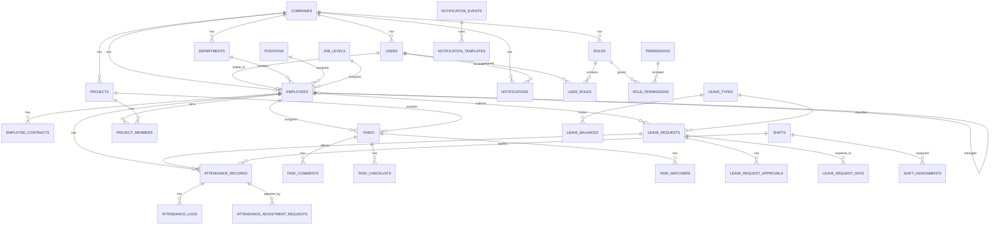
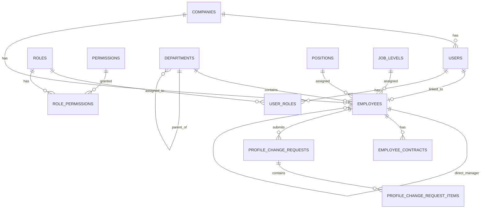
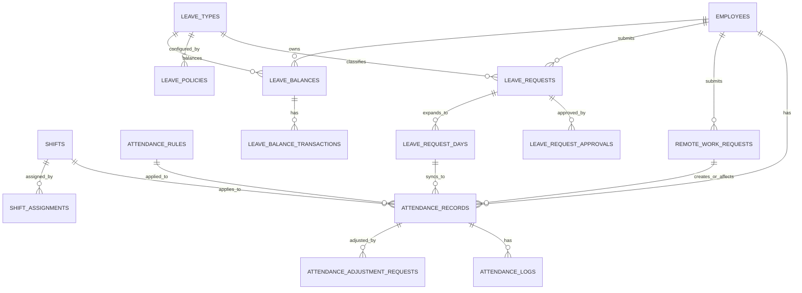
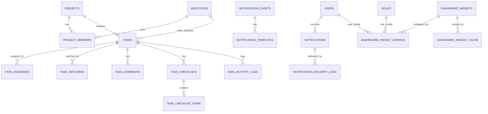
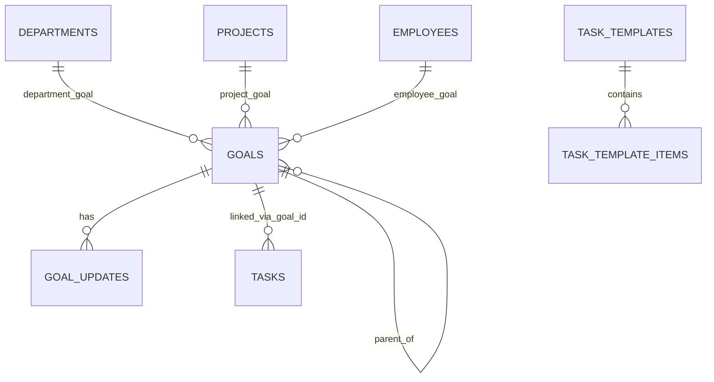

> 🔒 **BẤT BIẾN DB (bổ sung bắt buộc):** Mọi bảng có `company_id` PHẢI bật **RLS + FORCE**; `audit_logs` **append-only** (REVOKE UPDATE/DELETE + trigger); audit/event ghi qua **outbox** trong cùng transaction nghiệp vụ. Bộ docs gốc CHƯA mô tả 3 cơ chế này — DDL mẫu + `withTenant`/`set_config` tại [DECISIONS-02 §2–3](../DECISIONS/DECISIONS-02_Stack_Lock_And_Invariants.md).

# DB-01: DATABASE DESIGN TỔNG QUAN + ERD CẤP CAO

> **📚 Bộ tài liệu DB — Hệ thống Quản lý Doanh nghiệp**
> **DB-01 Tổng quan** · [DB-02 AUTH/RBAC](<DB-02 AUTH RBAC Database Design.md>) · [DB-03 HR](<DB-03_HR Database Design.md>) · [DB-04 ATT](<DB-04_ATT Database Design.md>) · [DB-05 LEAVE](<DB-05 LEAVE Database Design.md>) · [DB-06 TASK](<DB-06 TASK Database Design.md>) · [DB-07 NOTI/DASH](<DB-07 NOTI DASH Database Design.md>) · [DB-08 Audit/Files/Settings](<DB-08 Audit Files Settings Seeds Database Design.md>) · [DB-09 Index/Hiệu năng](<DB-09 Database Index Query Pattern Performance Design.md>) · [DB-10 Migration/Seed](<DB-10_Migration_Plan_Initial_Seed_Data_Database_Design.md>)
>
> **Nguồn & liên quan:** [PRD-00](<../PRD/PRD-00 Enterprise Management System .md>) · [Bộ SPEC: SPEC-01 Tổng quan](<../SPEC/SPEC-01 Tổng quan.md>) · [Thiết kế API: API-01 Tổng quan](<../API Design/API-01 TỔNG QUAN.md>) · [Chỉ mục tài liệu](<../README.md>)

---

## 1. Thông tin tài liệu

| Trường         | Nội dung                                |
| -------------- | --------------------------------------- |
| Mã tài liệu    | DB-01                                   |
| Tên tài liệu   | Database Design tổng quan + ERD cấp cao |
| Tên dự án      | Hệ thống quản lý doanh nghiệp nội bộ    |
| Phiên bản      | v1.0                                    |
| Trạng thái     | Draft                                   |
| Giai đoạn      | MVP Version 1.0                         |
| Tài liệu nguồn | PRD-00, SPEC-01 → SPEC-08               |
| Người viết     |                                         |
| Người duyệt    |                                         |
| Ngày tạo       | 20/06/2026                              |
| Ngày cập nhật  | 20/06/2026                              |

---

## 2. Mục đích tài liệu

Tài liệu này mô tả thiết kế database cấp cao cho hệ thống quản lý doanh nghiệp nội bộ.

Tài liệu này dùng để:

1. Xác định kiến trúc dữ liệu tổng thể.
2. Xác định danh sách nhóm bảng chính trong MVP.
3. Xác định quan hệ cấp cao giữa các module.
4. Xác định nguyên tắc đặt tên bảng, cột, khóa chính, khóa ngoại.
5. Xác định chiến lược multi-tenant, audit log, soft delete, file storage và notification.
6. Làm cơ sở để viết các tài liệu database chi tiết tiếp theo:

   * DB-02 AUTH & RBAC
   * DB-03 HR
   * DB-04 ATT
   * DB-05 LEAVE
   * DB-06 TASK
   * DB-07 NOTI & DASH
   * DB-08 Audit, Files, Settings
   * DB-09 Phase 2+ Extension

DB-01 chưa đi sâu đến toàn bộ chi tiết từng field, constraint, migration script hoặc index tối ưu cuối cùng. Các phần đó sẽ được tách ra ở các tài liệu DB module chi tiết.

---

## 3. Phạm vi thiết kế database

## 3.1 Module thuộc MVP

Database MVP cần hỗ trợ các module sau:

| Module | Tên module             | Vai trò dữ liệu                                             |
| ------ | ---------------------- | ----------------------------------------------------------- |
| AUTH   | Tài khoản & phân quyền | User, role, permission, session, data scope                 |
| HR     | Quản lý nhân sự        | Employee, department, position, contract, profile change    |
| ATT    | Chấm công              | Attendance, shift, rule, adjustment, remote work            |
| LEAVE  | Nghỉ phép              | Leave request, leave type, leave policy, leave balance      |
| TASK   | Công việc & dự án      | Project, project member, task, comment, checklist, activity |
| DASH   | Dashboard              | Widget, cấu hình widget, dữ liệu tổng hợp                   |
| NOTI   | Thông báo hệ thống     | Notification, event, template, delivery log                 |
| ME     | Trung tâm cá nhân (MVP bổ sung) | Không tạo dữ liệu mới; đọc-lại AUTH/HR/ATT/LEAVE/TASK/NOTI/DASH ở scope Own + `user_preferences` (SPEC-09) |
| GOAL   | Mục tiêu (MVP bổ sung) | Cây mục tiêu phòng ban/dự án/nhân viên + sổ check-in; liên kết `tasks.goal_id` (SPEC-10, DB-11) |

## 3.2 Module chưa thuộc MVP nhưng cần chừa khả năng mở rộng

| Module  | Tên module         | Ghi chú database                                    |
| ------- | ------------------ | --------------------------------------------------- |
| PAYROLL | Tiền lương         | Cần tách quyền riêng, dùng dữ liệu HR + ATT + LEAVE |
| RECRUIT | Tuyển dụng         | Có thể chuyển candidate thành employee              |
| ASSET   | Tài sản            | Gắn asset với employee                              |
| ROOM    | Phòng họp          | Gắn booking với user/employee                       |
| CHAT    | Chat nội bộ        | Gắn message với user                                |
| SOCIAL  | Mạng xã hội nội bộ | Gắn post/comment/reaction với user                  |
| MOBILE  | Mobile app         | Bổ sung device token, push notification             |
| AI      | AI & tích hợp      | Bổ sung AI logs, suggestions, summaries             |

---

## 4. Database engine đề xuất

## 4.1 Lựa chọn chính

Đề xuất sử dụng:

```text
PostgreSQL
```

## 4.2 Lý do chọn PostgreSQL

PostgreSQL phù hợp với hệ thống này vì:

1. Hệ thống có nhiều dữ liệu quan hệ: user, employee, department, attendance, leave, task, project.
2. Cần transaction để đảm bảo tính đúng đắn khi duyệt nghỉ, cập nhật số dư phép, đồng bộ bảng công.
3. Cần constraint, foreign key, unique index để kiểm soát dữ liệu.
4. Cần query dữ liệu báo cáo/dashboard.
5. Hỗ trợ JSONB tốt cho payload linh hoạt như notification payload, audit diff, cấu hình rule.
6. Dễ mở rộng về sau cho multi-tenant/SaaS.
7. Phù hợp với backend web app và mobile app.

---

## 5. Nguyên tắc thiết kế tổng thể

## 5.1 Thiết kế theo module

Mỗi module có nhóm bảng riêng, đặt tên rõ ràng theo domain nghiệp vụ.

Ví dụ:

```text
auth-related:
users
roles
permissions
user_roles
role_permissions

hr-related:
employees
departments
positions
employee_contracts

attendance-related:
attendance_records
attendance_logs
shifts
attendance_rules

leave-related:
leave_requests
leave_types
leave_balances

task-related:
projects
tasks
task_comments

notification-related:
notifications
notification_templates
```

## 5.2 Thiết kế sẵn cho multi-tenant

Dù MVP có thể chỉ phục vụ một công ty, database nên thiết kế sẵn khả năng multi-tenant bằng cách thêm:

```text
company_id
```

vào hầu hết bảng nghiệp vụ.

Các bảng cần có `company_id`:

```text
users
employees
departments
positions
employee_contracts
attendance_records
leave_requests
projects
tasks
notifications
dashboard_widget_configs
```

Các bảng global hoặc system-level có thể không cần `company_id`, hoặc có `company_id` nullable tùy mục đích.

Ví dụ:

```text
permissions: có thể global
roles: có thể global hoặc company-specific
system_settings: có thể global hoặc company-specific
```

## 5.3 Sử dụng UUID làm khóa chính

Đề xuất dùng:

```text
UUID
```

cho primary key.

Ví dụ:

```text
id UUID PRIMARY KEY
```

Lý do:

1. Phù hợp hệ thống có khả năng mở rộng SaaS.
2. Giảm rủi ro đoán ID qua URL.
3. Dễ đồng bộ dữ liệu với hệ thống bên ngoài.
4. Phù hợp khi sau này có mobile/offline/integration.

## 5.4 Chuẩn audit columns

Các bảng nghiệp vụ chính nên có bộ cột audit chuẩn:

```text
created_at TIMESTAMP
created_by UUID
updated_at TIMESTAMP
updated_by UUID
deleted_at TIMESTAMP NULL
deleted_by UUID NULL
```

Ý nghĩa:

| Cột        | Ý nghĩa                     |
| ---------- | --------------------------- |
| created_at | Thời điểm tạo bản ghi       |
| created_by | User tạo bản ghi            |
| updated_at | Thời điểm cập nhật gần nhất |
| updated_by | User cập nhật gần nhất      |
| deleted_at | Thời điểm xóa mềm           |
| deleted_by | User xóa mềm                |

## 5.5 Soft delete cho dữ liệu quan trọng

Không xóa cứng các dữ liệu quan trọng như:

```text
users
employees
departments
positions
employee_contracts
attendance_records
leave_requests
projects
tasks
notifications
files
```

Thay vào đó dùng:

```text
deleted_at
deleted_by
```

## 5.6 Tách audit log riêng

Ngoài audit columns, hệ thống cần bảng audit log riêng để ghi lại thao tác quan trọng.

Bảng đề xuất:

```text
audit_logs
```

Dùng để lưu:

1. Ai thao tác.
2. Thao tác gì.
3. Trên module nào.
4. Trên bản ghi nào.
5. Dữ liệu trước/sau nếu cần.
6. IP, device, user agent.
7. Thời điểm thao tác.

## 5.7 File dùng chung toàn hệ thống

File có thể xuất hiện ở nhiều module:

1. Hồ sơ nhân viên.
2. Hợp đồng lao động.
3. Đơn nghỉ phép.
4. Yêu cầu điều chỉnh công.
5. Task attachment.
6. Project document.

Do đó nên thiết kế file storage dùng chung:

```text
files
file_links
```

## 5.8 Notification dùng chung toàn hệ thống

Notification là module dùng chung, các module khác phát sinh event và tạo thông báo.

Các bảng lõi:

```text
notification_events
notification_templates
notifications
notification_delivery_logs
```

## 5.9 Dashboard không lưu dữ liệu nghiệp vụ gốc

Dashboard không nên copy toàn bộ dữ liệu nghiệp vụ. Dashboard chỉ nên lưu:

1. Cấu hình widget.
2. Widget nào bật/tắt theo role/user/company.
3. Thứ tự hiển thị.
4. Cache dữ liệu tổng hợp nếu cần.

Các bảng đề xuất:

```text
dashboard_widgets
dashboard_widget_configs
dashboard_widget_cache
```

---

## 6. Quy ước đặt tên database

## 6.1 Quy ước tên bảng

Dùng `snake_case`, danh từ số nhiều.

Ví dụ:

```text
users
roles
permissions
employees
departments
attendance_records
leave_requests
projects
tasks
notifications
```

## 6.2 Quy ước tên khóa chính

Mỗi bảng dùng:

```text
id
```

Ví dụ:

```text
users.id
employees.id
tasks.id
```

## 6.3 Quy ước tên khóa ngoại

Dùng format:

```text
{table_singular}_id
```

Ví dụ:

```text
company_id
user_id
employee_id
department_id
project_id
task_id
```

## 6.4 Quy ước tên bảng trung gian many-to-many

Dùng format:

```text
table_a_table_b
```

Ví dụ:

```text
user_roles
role_permissions
project_members
task_watchers
```

## 6.5 Quy ước enum/status

Tên cột status:

```text
status
```

Giá trị lưu dạng text code.

Ví dụ:

```text
Active
Inactive
Locked
Pending
Approved
Rejected
Cancelled
Done
```

Giai đoạn đầu có thể dùng text + check constraint. Nếu cần quản trị linh hoạt, chuyển sang lookup table.

## 6.6 Quy ước mã nghiệp vụ

Các mã nghiệp vụ nên lưu ở cột `code`.

Ví dụ:

```text
employee_code
project_code
leave_request_code
permission_code
notification_event_code
```

---

## 7. Nhóm bảng cấp cao

## 7.1 Nhóm Foundation / System

| Bảng              | Mô tả                               |
| ----------------- | ----------------------------------- |
| companies         | Công ty/tenant                      |
| company_settings  | Cấu hình công ty                    |
| system_settings   | Cấu hình hệ thống                   |
| modules           | Danh sách module                    |
| audit_logs        | Nhật ký thao tác toàn hệ thống      |
| files             | Metadata file                       |
| file_links        | Liên kết file với bản ghi nghiệp vụ |
| sequence_counters | Bộ đếm sinh mã tự động              |
| public_holidays   | Ngày nghỉ lễ/ngày không làm việc    |
| user_preferences  | Tùy chọn cá nhân theo user (locale/timezone/theme/layout ME) — scope User, SPEC-09 §15.2 |

## 7.2 Nhóm AUTH

| Bảng                  | Mô tả                   |
| --------------------- | ----------------------- |
| users                 | Tài khoản đăng nhập     |
| user_sessions         | Phiên đăng nhập         |
| password_reset_tokens | Token đặt lại mật khẩu  |
| roles                 | Vai trò                 |
| permissions           | Quyền                   |
| user_roles            | Gán role cho user       |
| role_permissions      | Gán permission cho role |
| login_logs            | Log đăng nhập           |

## 7.3 Nhóm HR

| Bảng                         | Mô tả                          |
| ---------------------------- | ------------------------------ |
| employees                    | Hồ sơ nhân viên                |
| departments                  | Phòng ban                      |
| positions                    | Chức vụ                        |
| job_levels                   | Cấp bậc                        |
| employee_contracts           | Hợp đồng nhân viên             |
| contract_types               | Loại hợp đồng                  |
| employee_files               | File hồ sơ nhân viên           |
| employee_status_histories    | Lịch sử trạng thái nhân viên   |
| profile_change_requests      | Yêu cầu cập nhật hồ sơ cá nhân |
| profile_change_request_items | Chi tiết field thay đổi        |
| employee_code_configs        | Cấu hình sinh mã nhân viên     |

## 7.4 Nhóm ATT

| Bảng                           | Mô tả                         |
| ------------------------------ | ----------------------------- |
| shifts                         | Ca làm việc                   |
| shift_assignments              | Gán ca làm                    |
| attendance_rules               | Rule chấm công                |
| attendance_records             | Bản ghi công tổng hợp         |
| attendance_logs                | Log check-in/check-out thô    |
| attendance_adjustment_requests | Yêu cầu điều chỉnh công       |
| attendance_adjustment_items    | Chi tiết điều chỉnh công      |
| remote_work_requests           | Yêu cầu remote/công tác       |
| remote_work_request_approvals  | Lịch sử duyệt remote/công tác |

## 7.5 Nhóm LEAVE

| Bảng                       | Mô tả                   |
| -------------------------- | ----------------------- |
| leave_types                | Loại nghỉ phép          |
| leave_policies             | Chính sách nghỉ phép    |
| leave_balances             | Số dư phép nhân viên    |
| leave_balance_transactions | Lịch sử cộng/trừ phép   |
| leave_requests             | Đơn nghỉ phép           |
| leave_request_approvals    | Lịch sử duyệt đơn nghỉ  |
| leave_request_days         | Chi tiết từng ngày nghỉ |

## 7.6 Nhóm TASK

| Bảng                 | Mô tả                          |
| -------------------- | ------------------------------ |
| projects             | Dự án                          |
| project_members      | Thành viên dự án               |
| project_files        | File dự án                     |
| tasks                | Công việc                      |
| task_assignees       | Người phụ trách task           |
| task_watchers        | Người theo dõi task            |
| task_comments        | Bình luận task                 |
| task_checklists      | Checklist task                 |
| task_checklist_items | Item checklist                 |
| task_files           | File task                      |
| task_activity_logs   | Lịch sử hoạt động task/project |

## 7.7 Nhóm NOTI

| Bảng                       | Mô tả                                              |
| -------------------------- | -------------------------------------------------- |
| notification_events        | Danh mục event thông báo                           |
| notification_templates     | Template thông báo                                 |
| notifications              | Thông báo gửi đến user                             |
| notification_delivery_logs | Log gửi thông báo qua từng kênh                    |
| notification_preferences   | Cấu hình nhận thông báo của user, có thể phase sau |

## 7.8 Nhóm DASH

| Bảng                     | Mô tả                                  |
| ------------------------ | -------------------------------------- |
| dashboard_widgets        | Danh mục widget                        |
| dashboard_widget_configs | Cấu hình widget theo company/role/user |
| dashboard_widget_cache   | Cache dữ liệu widget nếu cần           |

---

## 7.9 Nhóm GOAL

> Chi tiết đầy đủ: [DB-11 GOAL Database Design](<DB-11 GOAL Database Design.md>).

| Bảng                | Mô tả                                                                 |
| ------------------- | ---------------------------------------------------------------------- |
| goals               | Cây mục tiêu 1 bảng (department/project/employee/company-dự trữ), tự tham chiếu `parent_goal_id` |
| goal_updates        | Sổ check-in/finalize/reopen theo goal — append-only                    |
| task_templates      | Danh mục mẫu phân rã mục tiêu thành task                                |
| task_template_items | Các dòng công việc trong 1 template                                     |

---

## 8. Thiết kế bảng Foundation cấp cao

## 8.1 companies

Lưu thông tin công ty/tenant.

| Cột          | Kiểu      | Ghi chú                   |
| ------------ | --------- | ------------------------- |
| id           | UUID      | PK                        |
| company_code | VARCHAR   | Mã công ty, unique        |
| name         | VARCHAR   | Tên công ty               |
| legal_name   | VARCHAR   | Tên pháp lý               |
| tax_code     | VARCHAR   | Mã số thuế                |
| email        | VARCHAR   | Email công ty             |
| phone        | VARCHAR   | Số điện thoại             |
| address      | TEXT      | Địa chỉ                   |
| timezone     | VARCHAR   | Múi giờ                   |
| status       | VARCHAR   | Active/Inactive/Suspended |
| created_at   | TIMESTAMP |                           |
| created_by   | UUID      | FK users.id               |
| updated_at   | TIMESTAMP |                           |
| updated_by   | UUID      | FK users.id               |
| deleted_at   | TIMESTAMP | Soft delete               |
| deleted_by   | UUID      | FK users.id               |

## 8.2 modules

Danh sách module hệ thống.

| Cột         | Kiểu      | Ghi chú                                |
| ----------- | --------- | -------------------------------------- |
| id          | UUID      | PK                                     |
| module_code | VARCHAR   | AUTH, HR, ATT, LEAVE, TASK, DASH, NOTI, ME |
| name        | VARCHAR   | Tên module                             |
| description | TEXT      | Mô tả                                  |
| is_active   | BOOLEAN   | Bật/tắt module                         |
| sort_order  | INT       | Thứ tự                                 |
| created_at  | TIMESTAMP |                                        |
| updated_at  | TIMESTAMP |                                        |

## 8.3 audit_logs

Ghi log thao tác quan trọng.

| Cột               | Kiểu      | Ghi chú                                          |
| ----------------- | --------- | ------------------------------------------------ |
| id                | UUID      | PK                                               |
| company_id        | UUID      | FK companies.id                                  |
| actor_user_id     | UUID      | User thực hiện                                   |
| actor_employee_id | UUID      | Employee tương ứng nếu có                        |
| module_code       | VARCHAR   | AUTH/HR/ATT/LEAVE/TASK/DASH/NOTI                 |
| action            | VARCHAR   | CREATE/UPDATE/DELETE/APPROVE/REJECT/LOGIN/EXPORT |
| entity_type       | VARCHAR   | Tên entity                                       |
| entity_id         | UUID      | ID bản ghi bị tác động                           |
| old_values        | JSONB     | Dữ liệu trước                                    |
| new_values        | JSONB     | Dữ liệu sau                                      |
| metadata          | JSONB     | IP, user agent, request id                       |
| created_at        | TIMESTAMP | Thời điểm log                                    |

## 8.4 files

Lưu metadata file.

| Cột              | Kiểu      | Ghi chú                    |
| ---------------- | --------- | -------------------------- |
| id               | UUID      | PK                         |
| company_id       | UUID      | FK companies.id            |
| original_name    | VARCHAR   | Tên file gốc               |
| stored_name      | VARCHAR   | Tên file lưu trong storage |
| mime_type        | VARCHAR   | Loại file                  |
| file_size        | BIGINT    | Dung lượng                 |
| storage_provider | VARCHAR   | local/s3/gcs/minio         |
| storage_path     | TEXT      | Đường dẫn lưu              |
| checksum         | VARCHAR   | Hash nếu cần               |
| uploaded_by      | UUID      | FK users.id                |
| uploaded_at      | TIMESTAMP | Thời điểm upload           |
| is_private       | BOOLEAN   | File riêng tư              |
| deleted_at       | TIMESTAMP | Soft delete                |
| deleted_by       | UUID      | FK users.id                |

## 8.5 file_links

Liên kết một file với nhiều entity khác nhau.

| Cột         | Kiểu      | Ghi chú                             |
| ----------- | --------- | ----------------------------------- |
| id          | UUID      | PK                                  |
| company_id  | UUID      | FK companies.id                     |
| file_id     | UUID      | FK files.id                         |
| module_code | VARCHAR   | HR/ATT/LEAVE/TASK                   |
| entity_type | VARCHAR   | Employee/Contract/LeaveRequest/Task |
| entity_id   | UUID      | ID bản ghi nghiệp vụ                |
| link_type   | VARCHAR   | attachment/avatar/contract/document |
| created_at  | TIMESTAMP |                                     |
| created_by  | UUID      | FK users.id                         |

## 8.6 sequence_counters

Dùng để sinh mã tự động.

| Cột            | Kiểu      | Ghi chú                                         |
| -------------- | --------- | ----------------------------------------------- |
| id             | UUID      | PK                                              |
| company_id     | UUID      | FK companies.id                                 |
| sequence_key   | VARCHAR   | EMPLOYEE_CODE, LEAVE_REQUEST_CODE, PROJECT_CODE |
| prefix         | VARCHAR   | EMP, HR, DEV                                    |
| current_value  | BIGINT    | Giá trị hiện tại                                |
| padding_length | INT       | Số chữ số                                       |
| reset_policy   | VARCHAR   | NEVER/YEARLY/MONTHLY                            |
| last_reset_at  | TIMESTAMP | Thời điểm reset gần nhất                        |
| created_at     | TIMESTAMP |                                                 |
| updated_at     | TIMESTAMP |                                                 |

---

## 9. Thiết kế bảng AUTH cấp cao

## 9.1 users

Lưu tài khoản đăng nhập.

| Cột                 | Kiểu      | Ghi chú                                           |
| ------------------- | --------- | ------------------------------------------------- |
| id                  | UUID      | PK                                                |
| company_id          | UUID      | FK companies.id                                   |
| email               | VARCHAR   | Email đăng nhập, unique theo company              |
| password_hash       | VARCHAR   | Mật khẩu đã hash                                  |
| display_name        | VARCHAR   | Tên hiển thị                                      |
| avatar_file_id      | UUID      | FK files.id, nullable                             |
| status              | VARCHAR   | Pending Activation/Active/Inactive/Locked/Deleted |
| last_login_at       | TIMESTAMP | Lần đăng nhập gần nhất                            |
| password_changed_at | TIMESTAMP | Lần đổi mật khẩu gần nhất                         |
| created_at          | TIMESTAMP |                                                   |
| created_by          | UUID      | FK users.id                                       |
| updated_at          | TIMESTAMP |                                                   |
| updated_by          | UUID      | FK users.id                                       |
| deleted_at          | TIMESTAMP | Soft delete                                       |
| deleted_by          | UUID      | FK users.id                                       |

Ràng buộc đề xuất:

```text
UNIQUE(company_id, email)
```

## 9.2 roles

Lưu vai trò hệ thống.

| Cột            | Kiểu      | Ghi chú                                   |
| -------------- | --------- | ----------------------------------------- |
| id             | UUID      | PK                                        |
| company_id     | UUID NULL | NULL nếu role global                      |
| role_code      | VARCHAR   | SUPER_ADMIN, COMPANY_ADMIN, HR, MANAGER, EMPLOYEE |
| name           | VARCHAR   | Tên vai trò                               |
| description    | TEXT      | Mô tả                                     |
| is_system_role | BOOLEAN   | Role hệ thống không cho xóa               |
| status         | VARCHAR   | Active/Inactive                           |
| created_at     | TIMESTAMP |                                           |
| updated_at     | TIMESTAMP |                                           |
| deleted_at     | TIMESTAMP | Soft delete                               |

Ràng buộc đề xuất:

```text
UNIQUE(company_id, role_code)
```

<!-- sửa theo DRIFT AU-1: role_code chuẩn = COMPANY_ADMIN (KHÔNG phải ADMIN), khớp SPEC-02 §13.12 / DB-02 §7.2 / API-10 / BACKEND-03. -->

## 9.3 permissions

Lưu danh sách quyền.

| Cột             | Kiểu      | Ghi chú                           |
| --------------- | --------- | --------------------------------- |
| id              | UUID      | PK                                |
| module_code     | VARCHAR   | AUTH/HR/ATT/LEAVE/TASK/DASH/NOTI  |
| permission_code | VARCHAR   | HR.EMPLOYEE.VIEW                  |
| resource        | VARCHAR   | EMPLOYEE                          |
| action          | VARCHAR   | VIEW/CREATE/UPDATE/DELETE/APPROVE |
| description     | TEXT      | Mô tả                             |
| is_active       | BOOLEAN   |                                   |
| created_at      | TIMESTAMP |                                   |

Ràng buộc đề xuất:

```text
UNIQUE(permission_code)
```

## 9.4 user_roles

Gán role cho user.

| Cột         | Kiểu           | Ghi chú         |
| ----------- | -------------- | --------------- |
| id          | UUID           | PK              |
| company_id  | UUID           | FK companies.id |
| user_id     | UUID           | FK users.id     |
| role_id     | UUID           | FK roles.id     |
| assigned_by | UUID           | FK users.id     |
| assigned_at | TIMESTAMP      | Thời điểm gán   |
| expired_at  | TIMESTAMP NULL | Hết hạn nếu có  |
| is_active   | BOOLEAN        |                 |

Ràng buộc đề xuất:

```text
UNIQUE(user_id, role_id)
```

## 9.5 role_permissions

Gán permission cho role, kèm data scope.

| Cột           | Kiểu      | Ghi chú                                    |
| ------------- | --------- | ------------------------------------------ |
| id            | UUID      | PK                                         |
| company_id    | UUID NULL | Theo company nếu cần                       |
| role_id       | UUID      | FK roles.id                                |
| permission_id | UUID      | FK permissions.id                          |
| data_scope    | VARCHAR   | Own/Team/Department/Project/Company/System |
| conditions    | JSONB     | Điều kiện mở rộng nếu cần                  |
| created_at    | TIMESTAMP |                                            |
| created_by    | UUID      | FK users.id                                |

Ràng buộc đề xuất:

```text
UNIQUE(role_id, permission_id, data_scope)
```

## 9.6 user_sessions

Lưu phiên đăng nhập nếu backend quản lý session/token.

| Cột                | Kiểu      | Ghi chú            |
| ------------------ | --------- | ------------------ |
| id                 | UUID      | PK                 |
| user_id            | UUID      | FK users.id        |
| refresh_token_hash | VARCHAR   | Hash refresh token |
| ip_address         | VARCHAR   | IP                 |
| user_agent         | TEXT      | Browser/device     |
| device_id          | VARCHAR   | Nếu có             |
| expired_at         | TIMESTAMP | Hết hạn            |
| revoked_at         | TIMESTAMP | Thu hồi            |
| created_at         | TIMESTAMP |                    |

---

## 10. Thiết kế bảng HR cấp cao

## 10.1 employees

Lưu hồ sơ nhân viên.

| Cột               | Kiểu      | Ghi chú                                                      |
| ----------------- | --------- | ------------------------------------------------------------ |
| id                | UUID      | PK                                                           |
| company_id        | UUID      | FK companies.id                                              |
| user_id           | UUID NULL | FK users.id                                                  |
| employee_code     | VARCHAR   | Mã nhân viên                                                 |
| full_name         | VARCHAR   | Họ tên                                                       |
| first_name        | VARCHAR   | Tên                                                          |
| last_name         | VARCHAR   | Họ                                                           |
| gender            | VARCHAR   | Giới tính                                                    |
| date_of_birth     | DATE      | Ngày sinh                                                    |
| personal_email    | VARCHAR   | Email cá nhân                                                |
| company_email     | VARCHAR   | Email công ty                                                |
| phone             | VARCHAR   | Số điện thoại                                                |
| address           | TEXT      | Địa chỉ                                                      |
| department_id     | UUID      | FK departments.id                                            |
| position_id       | UUID      | FK positions.id                                              |
| job_level_id      | UUID      | FK job_levels.id                                             |
| direct_manager_id | UUID NULL | FK employees.id                                              |
| joined_date       | DATE      | Ngày vào làm                                                 |
| official_date     | DATE NULL | Ngày chính thức                                              |
| resigned_date     | DATE NULL | Ngày nghỉ việc                                               |
| employment_status | VARCHAR   | Probation/Official/Temporarily Suspended/Resigned/Terminated |
| avatar_file_id    | UUID NULL | FK files.id                                                  |
| created_at        | TIMESTAMP |                                                              |
| created_by        | UUID      | FK users.id                                                  |
| updated_at        | TIMESTAMP |                                                              |
| updated_by        | UUID      | FK users.id                                                  |
| deleted_at        | TIMESTAMP | Soft delete                                                  |
| deleted_by        | UUID      | FK users.id                                                  |

Ràng buộc đề xuất:

```text
UNIQUE(company_id, employee_code)
UNIQUE(company_id, company_email)
```

## 10.2 departments

Lưu phòng ban/cơ cấu tổ chức.

| Cột                  | Kiểu      | Ghi chú           |
| -------------------- | --------- | ----------------- |
| id                   | UUID      | PK                |
| company_id           | UUID      | FK companies.id   |
| parent_department_id | UUID NULL | FK departments.id |
| department_code      | VARCHAR   | Mã phòng ban      |
| name                 | VARCHAR   | Tên phòng ban     |
| manager_employee_id  | UUID NULL | FK employees.id   |
| status               | VARCHAR   | Active/Inactive   |
| sort_order           | INT       |                   |
| created_at           | TIMESTAMP |                   |
| updated_at           | TIMESTAMP |                   |
| deleted_at           | TIMESTAMP | Soft delete       |

## 10.3 positions

Lưu chức vụ.

| Cột           | Kiểu      | Ghi chú         |
| ------------- | --------- | --------------- |
| id            | UUID      | PK              |
| company_id    | UUID      | FK companies.id |
| position_code | VARCHAR   | Mã chức vụ      |
| name          | VARCHAR   | Tên chức vụ     |
| description   | TEXT      | Mô tả           |
| status        | VARCHAR   | Active/Inactive |
| created_at    | TIMESTAMP |                 |
| updated_at    | TIMESTAMP |                 |
| deleted_at    | TIMESTAMP | Soft delete     |

## 10.4 job_levels

Lưu cấp bậc nhân sự.

| Cột        | Kiểu      | Ghi chú                      |
| ---------- | --------- | ---------------------------- |
| id         | UUID      | PK                           |
| company_id | UUID      | FK companies.id              |
| level_code | VARCHAR   | INTERN/JUNIOR/SENIOR/MANAGER |
| name       | VARCHAR   | Tên cấp bậc                  |
| rank_order | INT       | Thứ tự                       |
| status     | VARCHAR   | Active/Inactive              |
| created_at | TIMESTAMP |                              |
| updated_at | TIMESTAMP |                              |
| deleted_at | TIMESTAMP | Soft delete                  |

## 10.5 employee_contracts

Lưu hợp đồng lao động.

| Cột              | Kiểu      | Ghi chú                         |
| ---------------- | --------- | ------------------------------- |
| id               | UUID      | PK                              |
| company_id       | UUID      | FK companies.id                 |
| employee_id      | UUID      | FK employees.id                 |
| contract_code    | VARCHAR   | Mã hợp đồng                     |
| contract_type_id | UUID      | FK contract_types.id            |
| start_date       | DATE      | Ngày bắt đầu                    |
| end_date         | DATE NULL | Ngày kết thúc                   |
| signed_date      | DATE NULL | Ngày ký                         |
| status           | VARCHAR   | Draft/Active/Expired/Terminated |
| file_id          | UUID NULL | FK files.id                     |
| note             | TEXT      | Ghi chú                         |
| created_at       | TIMESTAMP |                                 |
| created_by       | UUID      | FK users.id                     |
| updated_at       | TIMESTAMP |                                 |
| updated_by       | UUID      | FK users.id                     |
| deleted_at       | TIMESTAMP | Soft delete                     |

## 10.6 profile_change_requests

Lưu yêu cầu cập nhật hồ sơ cá nhân do Employee gửi.

| Cột          | Kiểu           | Ghi chú                             |
| ------------ | -------------- | ----------------------------------- |
| id           | UUID           | PK                                  |
| company_id   | UUID           | FK companies.id                     |
| employee_id  | UUID           | FK employees.id                     |
| requested_by | UUID           | FK users.id                         |
| status       | VARCHAR        | Pending/Approved/Rejected/Cancelled |
| reason       | TEXT           | Lý do                               |
| reviewed_by  | UUID NULL      | FK users.id                         |
| reviewed_at  | TIMESTAMP NULL | Thời điểm duyệt/từ chối             |
| review_note  | TEXT NULL      | Ghi chú xử lý                       |
| created_at   | TIMESTAMP      |                                     |
| updated_at   | TIMESTAMP      |                                     |

## 10.7 profile_change_request_items

Chi tiết từng field được đề xuất thay đổi.

| Cột        | Kiểu      | Ghi chú                       |
| ---------- | --------- | ----------------------------- |
| id         | UUID      | PK                            |
| request_id | UUID      | FK profile_change_requests.id |
| field_name | VARCHAR   | Tên field                     |
| old_value  | TEXT      | Giá trị cũ                    |
| new_value  | TEXT      | Giá trị mới                   |
| value_type | VARCHAR   | string/date/number/json       |
| created_at | TIMESTAMP |                               |

## 10.8 employee_code_configs

Cấu hình sinh mã nhân viên.

| Cột                   | Kiểu      | Ghi chú                 |
| --------------------- | --------- | ----------------------- |
| id                    | UUID      | PK                      |
| company_id            | UUID      | FK companies.id         |
| config_name           | VARCHAR   | Tên cấu hình            |
| prefix_pattern        | VARCHAR   | EMP, {DEPT}, {YEAR}-EMP |
| number_length         | INT       | Độ dài số               |
| reset_policy          | VARCHAR   | NEVER/YEARLY/MONTHLY    |
| allow_manual_override | BOOLEAN   | Cho phép sửa thủ công   |
| is_active             | BOOLEAN   | Cấu hình đang dùng      |
| created_at            | TIMESTAMP |                         |
| updated_at            | TIMESTAMP |                         |

---

## 11. Thiết kế bảng ATT cấp cao

## 11.1 shifts

Lưu ca làm việc.

| Cột                         | Kiểu      | Ghi chú                  |
| --------------------------- | --------- | ------------------------ |
| id                          | UUID      | PK                       |
| company_id                  | UUID      | FK companies.id          |
| shift_code                  | VARCHAR   | Mã ca                    |
| name                        | VARCHAR   | Tên ca                   |
| start_time                  | TIME      | Giờ bắt đầu              |
| end_time                    | TIME      | Giờ kết thúc             |
| break_start_time            | TIME NULL | Bắt đầu nghỉ giữa ca     |
| break_end_time              | TIME NULL | Kết thúc nghỉ giữa ca    |
| required_working_minutes    | INT       | Số phút làm việc yêu cầu |
| allowed_late_minutes        | INT       | Cho phép đi muộn         |
| allowed_early_leave_minutes | INT       | Cho phép về sớm          |
| is_flexible                 | BOOLEAN   | Ca linh hoạt             |
| flexible_checkin_from       | TIME NULL | Check-in từ              |
| flexible_checkin_to         | TIME NULL | Check-in đến             |
| status                      | VARCHAR   | Active/Inactive          |
| created_at                  | TIMESTAMP |                          |
| updated_at                  | TIMESTAMP |                          |
| deleted_at                  | TIMESTAMP | Soft delete              |

## 11.2 shift_assignments

Gán ca cho công ty/phòng ban/nhân viên.

| Cột             | Kiểu      | Ghi chú                     |
| --------------- | --------- | --------------------------- |
| id              | UUID      | PK                          |
| company_id      | UUID      | FK companies.id             |
| shift_id        | UUID      | FK shifts.id                |
| assignment_type | VARCHAR   | Company/Department/Employee |
| department_id   | UUID NULL | FK departments.id           |
| employee_id     | UUID NULL | FK employees.id             |
| effective_from  | DATE      | Từ ngày                     |
| effective_to    | DATE NULL | Đến ngày                    |
| priority        | INT       | Ưu tiên                     |
| status          | VARCHAR   | Active/Inactive             |
| created_at      | TIMESTAMP |                             |
| updated_at      | TIMESTAMP |                             |

## 11.3 attendance_rules

Lưu rule chấm công.

| Cột                      | Kiểu      | Ghi chú                     |
| ------------------------ | --------- | --------------------------- |
| id                       | UUID      | PK                          |
| company_id               | UUID      | FK companies.id             |
| rule_name                | VARCHAR   | Tên rule                    |
| scope_type               | VARCHAR   | Company/Department/Employee |
| department_id            | UUID NULL | FK departments.id           |
| employee_id              | UUID NULL | FK employees.id             |
| require_check_in         | BOOLEAN   | Bắt buộc check-in           |
| require_check_out        | BOOLEAN   | Bắt buộc check-out          |
| require_gps              | BOOLEAN   | Bắt buộc GPS                |
| require_note             | BOOLEAN   | Bắt buộc ghi chú            |
| allow_remote_checkin     | BOOLEAN   | Cho remote check-in         |
| allow_auto_attendance    | BOOLEAN   | Cho tự động chấm công       |
| allow_adjustment_request | BOOLEAN   | Cho gửi yêu cầu điều chỉnh  |
| rule_config              | JSONB     | Cấu hình mở rộng            |
| priority                 | INT       | Ưu tiên                     |
| status                   | VARCHAR   | Active/Inactive             |
| created_at               | TIMESTAMP |                             |
| updated_at               | TIMESTAMP |                             |

## 11.4 attendance_records

Bản ghi công tổng hợp theo ngày/ca.

| Cột                      | Kiểu           | Ghi chú                                   |
| ------------------------ | -------------- | ----------------------------------------- |
| id                       | UUID           | PK                                        |
| company_id               | UUID           | FK companies.id                           |
| employee_id              | UUID           | FK employees.id                           |
| work_date                | DATE           | Ngày công                                 |
| shift_id                 | UUID NULL      | FK shifts.id                              |
| check_in_at              | TIMESTAMP NULL | Giờ vào chính                             |
| check_out_at             | TIMESTAMP NULL | Giờ ra chính                              |
| total_working_minutes    | INT            | Tổng phút làm                             |
| required_working_minutes | INT            | Tổng phút yêu cầu                         |
| late_minutes             | INT            | Phút đi muộn                              |
| early_leave_minutes      | INT            | Phút về sớm                               |
| missing_minutes          | INT            | Phút thiếu                                |
| status                   | VARCHAR        | Present/Late/Absent/Leave/Remote Work/... |
| source                   | VARCHAR        | WEB/MOBILE/MANUAL/AUTO/REMOTE/DEVICE      |
| leave_request_id         | UUID NULL      | FK leave_requests.id                      |
| remote_work_request_id   | UUID NULL      | FK remote_work_requests.id                |
| applied_rule_id          | UUID NULL      | FK attendance_rules.id                    |
| note                     | TEXT           | Ghi chú                                   |
| created_at               | TIMESTAMP      |                                           |
| created_by               | UUID           | FK users.id                               |
| updated_at               | TIMESTAMP      |                                           |
| updated_by               | UUID           | FK users.id                               |
| deleted_at               | TIMESTAMP      | Soft delete                               |

Ràng buộc đề xuất MVP:

```text
UNIQUE(company_id, employee_id, work_date, shift_id)
```

Nếu MVP chỉ có một ca/ngày, có thể dùng:

```text
UNIQUE(company_id, employee_id, work_date)
```

## 11.5 attendance_logs

Log thô từng lần check-in/check-out.

| Cột                  | Kiểu         | Ghi chú                  |
| -------------------- | ------------ | ------------------------ |
| id                   | UUID         | PK                       |
| company_id           | UUID         | FK companies.id          |
| attendance_record_id | UUID         | FK attendance_records.id |
| employee_id          | UUID         | FK employees.id          |
| log_type             | VARCHAR      | CHECK_IN/CHECK_OUT       |
| log_time             | TIMESTAMP    | Server time              |
| source               | VARCHAR      | WEB/MOBILE/DEVICE/API    |
| ip_address           | VARCHAR      | IP                       |
| device_info          | JSONB        | Thiết bị                 |
| latitude             | DECIMAL NULL | GPS                      |
| longitude            | DECIMAL NULL | GPS                      |
| note                 | TEXT NULL    | Ghi chú                  |
| created_at           | TIMESTAMP    |                          |

## 11.6 attendance_adjustment_requests

Yêu cầu điều chỉnh công.

| Cột                  | Kiểu           | Ghi chú                                            |
| -------------------- | -------------- | -------------------------------------------------- |
| id                   | UUID           | PK                                                 |
| company_id           | UUID           | FK companies.id                                    |
| employee_id          | UUID           | FK employees.id                                    |
| attendance_record_id | UUID NULL      | FK attendance_records.id                           |
| request_type         | VARCHAR        | Missing Check-in/Missing Check-out/Remote/Fix Time |
| reason               | TEXT           | Lý do                                              |
| status               | VARCHAR        | Pending/Approved/Rejected/Cancelled                |
| submitted_by         | UUID           | FK users.id                                        |
| submitted_at         | TIMESTAMP      |                                                    |
| reviewed_by          | UUID NULL      | FK users.id                                        |
| reviewed_at          | TIMESTAMP NULL |                                                    |
| review_note          | TEXT NULL      |                                                    |
| created_at           | TIMESTAMP      |                                                    |
| updated_at           | TIMESTAMP      |                                                    |

## 11.7 remote_work_requests

Yêu cầu remote/công tác.

| Cột          | Kiểu           | Ghi chú                                   |
| ------------ | -------------- | ----------------------------------------- |
| id           | UUID           | PK                                        |
| company_id   | UUID           | FK companies.id                           |
| employee_id  | UUID           | FK employees.id                           |
| request_code | VARCHAR        | Mã request                                |
| work_type    | VARCHAR        | Remote/Business Trip/Outside Office       |
| start_date   | DATE           | Từ ngày                                   |
| end_date     | DATE           | Đến ngày                                  |
| reason       | TEXT           | Lý do                                     |
| work_note    | TEXT           | Nội dung công việc                        |
| status       | VARCHAR        | Draft/Pending/Approved/Rejected/Cancelled |
| submitted_by | UUID           | FK users.id                               |
| submitted_at | TIMESTAMP      |                                           |
| approved_by  | UUID NULL      | FK users.id                               |
| approved_at  | TIMESTAMP NULL |                                           |
| rule_mode    | VARCHAR        | AUTO_ATTENDANCE/SELF_CHECK_IN             |
| created_at   | TIMESTAMP      |                                           |
| updated_at   | TIMESTAMP      |                                           |

---

## 12. Thiết kế bảng LEAVE cấp cao

## 12.1 leave_types

Loại nghỉ phép.

| Cột                | Kiểu      | Ghi chú                              |
| ------------------ | --------- | ------------------------------------ |
| id                 | UUID      | PK                                   |
| company_id         | UUID      | FK companies.id                      |
| leave_type_code    | VARCHAR   | ANNUAL_LEAVE/SICK_LEAVE/UNPAID_LEAVE |
| name               | VARCHAR   | Tên loại nghỉ                        |
| is_paid            | BOOLEAN   | Có hưởng lương                       |
| deduct_balance     | BOOLEAN   | Có trừ phép                          |
| require_attachment | BOOLEAN   | Bắt buộc file                        |
| status             | VARCHAR   | Active/Inactive                      |
| created_at         | TIMESTAMP |                                      |
| updated_at         | TIMESTAMP |                                      |
| deleted_at         | TIMESTAMP | Soft delete                          |

## 12.2 leave_policies

Chính sách nghỉ phép.

| Cột                    | Kiểu      | Ghi chú                              |
| ---------------------- | --------- | ------------------------------------ |
| id                     | UUID      | PK                                   |
| company_id             | UUID      | FK companies.id                      |
| policy_name            | VARCHAR   | Tên chính sách                       |
| leave_type_id          | UUID      | FK leave_types.id                    |
| scope_type             | VARCHAR   | Company/Department/Employee/JobLevel |
| department_id          | UUID NULL | FK departments.id                    |
| employee_id            | UUID NULL | FK employees.id                      |
| job_level_id           | UUID NULL | FK job_levels.id                     |
| annual_quota_days      | DECIMAL   | Số ngày/năm                          |
| allow_negative_balance | BOOLEAN   | Cho nghỉ âm phép                     |
| max_negative_days      | DECIMAL   | Số ngày âm tối đa                    |
| carry_forward_allowed  | BOOLEAN   | Cho chuyển phép                      |
| max_carry_forward_days | DECIMAL   | Số ngày chuyển tối đa                |
| policy_config          | JSONB     | Cấu hình mở rộng                     |
| status                 | VARCHAR   | Active/Inactive                      |
| created_at             | TIMESTAMP |                                      |
| updated_at             | TIMESTAMP |                                      |

## 12.3 leave_balances

Số dư phép của nhân viên.

| Cột                  | Kiểu      | Ghi chú             |
| -------------------- | --------- | ------------------- |
| id                   | UUID      | PK                  |
| company_id           | UUID      | FK companies.id     |
| employee_id          | UUID      | FK employees.id     |
| leave_type_id        | UUID      | FK leave_types.id   |
| year                 | INT       | Năm                 |
| granted_days         | DECIMAL   | Được cấp            |
| used_days            | DECIMAL   | Đã dùng             |
| pending_days         | DECIMAL   | Đang chờ duyệt      |
| adjusted_days        | DECIMAL   | Điều chỉnh          |
| carried_forward_days | DECIMAL   | Chuyển từ năm trước |
| expired_days         | DECIMAL   | Hết hạn             |
| remaining_days       | DECIMAL   | Còn lại             |
| updated_at           | TIMESTAMP |                     |

Ràng buộc đề xuất:

```text
UNIQUE(company_id, employee_id, leave_type_id, year)
```

## 12.4 leave_balance_transactions

Lịch sử biến động số dư phép.

| Cột              | Kiểu      | Ghi chú                                      |
| ---------------- | --------- | -------------------------------------------- |
| id               | UUID      | PK                                           |
| company_id       | UUID      | FK companies.id                              |
| leave_balance_id | UUID      | FK leave_balances.id                         |
| employee_id      | UUID      | FK employees.id                              |
| leave_type_id    | UUID      | FK leave_types.id                            |
| transaction_type | VARCHAR   | GRANT/USE/REFUND/ADJUST/EXPIRE/CARRY_OVER |
| days             | DECIMAL   | Số ngày cộng/trừ                             |
| reference_type   | VARCHAR   | LeaveRequest/ManualAdjustment/System         |
| reference_id     | UUID NULL | ID liên quan                                 |
| note             | TEXT      | Ghi chú                                      |
| created_at       | TIMESTAMP |                                              |
| created_by       | UUID      | FK users.id                                  |

## 12.5 leave_requests

Đơn nghỉ phép.

| Cột                 | Kiểu           | Ghi chú                                           |
| ------------------- | -------------- | ------------------------------------------------- |
| id                  | UUID           | PK                                                |
| company_id          | UUID           | FK companies.id                                   |
| leave_request_code  | VARCHAR        | Mã đơn nghỉ                                       |
| employee_id         | UUID           | FK employees.id                                   |
| leave_type_id       | UUID           | FK leave_types.id                                 |
| duration_type       | VARCHAR        | Full Day/Half Day/Hourly/Multiple Days            |
| start_date          | DATE           | Ngày bắt đầu                                      |
| end_date            | DATE           | Ngày kết thúc                                     |
| start_time          | TIME NULL      | Nếu nghỉ theo giờ                                 |
| end_time            | TIME NULL      | Nếu nghỉ theo giờ                                 |
| total_days          | DECIMAL        | Tổng số ngày                                      |
| total_hours         | DECIMAL NULL   | Tổng số giờ                                       |
| reason              | TEXT           | Lý do                                             |
| status              | VARCHAR        | Draft/Pending/Approved/Rejected/Cancelled/Revoked |
| current_approver_id | UUID NULL      | FK users.id                                       |
| submitted_at        | TIMESTAMP NULL | Thời điểm gửi                                     |
| approved_at         | TIMESTAMP NULL | Thời điểm duyệt                                   |
| rejected_at         | TIMESTAMP NULL | Thời điểm từ chối                                 |
| cancelled_at        | TIMESTAMP NULL | Thời điểm hủy                                     |
| created_at          | TIMESTAMP      |                                                   |
| created_by          | UUID           | FK users.id                                       |
| updated_at          | TIMESTAMP      |                                                   |
| updated_by          | UUID           | FK users.id                                       |
| deleted_at          | TIMESTAMP      | Soft delete                                       |

## 12.6 leave_request_approvals

Lịch sử duyệt đơn nghỉ.

| Cột                  | Kiểu      | Ghi chú                      |
| -------------------- | --------- | ---------------------------- |
| id                   | UUID      | PK                           |
| company_id           | UUID      | FK companies.id              |
| leave_request_id     | UUID      | FK leave_requests.id         |
| approver_user_id     | UUID      | FK users.id                  |
| approver_employee_id | UUID NULL | FK employees.id              |
| action               | VARCHAR   | APPROVE/REJECT/CANCEL/REVOKE |
| note                 | TEXT      | Ghi chú                      |
| acted_at             | TIMESTAMP | Thời điểm xử lý              |

## 12.7 leave_request_days

Chi tiết từng ngày nghỉ, giúp đồng bộ sang chấm công.

| Cột                  | Kiểu      | Ghi chú                                     |
| -------------------- | --------- | ------------------------------------------- |
| id                   | UUID      | PK                                          |
| company_id           | UUID      | FK companies.id                             |
| leave_request_id     | UUID      | FK leave_requests.id                        |
| employee_id          | UUID      | FK employees.id                             |
| leave_date           | DATE      | Ngày nghỉ                                   |
| duration_type        | VARCHAR   | Full Day/Half Morning/Half Afternoon/Hourly |
| leave_minutes        | INT       | Số phút nghỉ                                |
| status               | VARCHAR   | Pending/Approved/Cancelled                  |
| attendance_record_id | UUID NULL | FK attendance_records.id                    |
| created_at           | TIMESTAMP |                                             |

---

## 13. Thiết kế bảng TASK cấp cao

## 13.1 projects

Dự án.

| Cột                 | Kiểu      | Ghi chú                                              |
| ------------------- | --------- | ---------------------------------------------------- |
| id                  | UUID      | PK                                                   |
| company_id          | UUID      | FK companies.id                                      |
| project_code        | VARCHAR   | Mã dự án                                             |
| name                | VARCHAR   | Tên dự án                                            |
| description         | TEXT      | Mô tả                                                |
| owner_employee_id   | UUID      | FK employees.id                                      |
| manager_employee_id | UUID NULL | FK employees.id                                      |
| start_date          | DATE NULL | Ngày bắt đầu                                         |
| end_date            | DATE NULL | Ngày kết thúc dự kiến                                |
| status              | VARCHAR   | Planning/Active/On Hold/Completed/Cancelled/Archived |
| priority            | VARCHAR   | Low/Medium/High/Urgent                               |
| created_at          | TIMESTAMP |                                                      |
| created_by          | UUID      | FK users.id                                          |
| updated_at          | TIMESTAMP |                                                      |
| updated_by          | UUID      | FK users.id                                          |
| deleted_at          | TIMESTAMP | Soft delete                                          |

## 13.2 project_members

Thành viên dự án.

| Cột          | Kiểu           | Ghi chú                      |
| ------------ | -------------- | ---------------------------- |
| id           | UUID           | PK                           |
| company_id   | UUID           | FK companies.id              |
| project_id   | UUID           | FK projects.id               |
| employee_id  | UUID           | FK employees.id              |
| project_role | VARCHAR        | Owner/Manager/Member/Watcher |
| joined_at    | TIMESTAMP      |                              |
| left_at      | TIMESTAMP NULL |                              |
| status       | VARCHAR        | Active/Inactive              |
| created_at   | TIMESTAMP      |                              |

Ràng buộc đề xuất:

```text
UNIQUE(project_id, employee_id)
```

## 13.3 tasks

Công việc.

| Cột                       | Kiểu           | Ghi chú                                   |
| ------------------------- | -------------- | ----------------------------------------- |
| id                        | UUID           | PK                                        |
| company_id                | UUID           | FK companies.id                           |
| project_id                | UUID NULL      | FK projects.id                            |
| task_code                 | VARCHAR        | Mã task                                   |
| title                     | VARCHAR        | Tiêu đề                                   |
| description               | TEXT           | Mô tả                                     |
| creator_user_id           | UUID           | FK users.id                               |
| reporter_employee_id      | UUID NULL      | FK employees.id                           |
| main_assignee_employee_id | UUID NULL      | FK employees.id                           |
| parent_task_id            | UUID NULL      | FK tasks.id                               |
| priority                  | VARCHAR        | Low/Medium/High/Urgent                    |
| status                    | VARCHAR        | Todo/In Progress/In Review/Done/Cancelled |
| due_date                  | DATE NULL      | Deadline                                  |
| start_date                | DATE NULL      | Ngày bắt đầu                              |
| completed_at              | TIMESTAMP NULL | Hoàn thành lúc                            |
| created_at                | TIMESTAMP      |                                           |
| created_by                | UUID           | FK users.id                               |
| updated_at                | TIMESTAMP      |                                           |
| updated_by                | UUID           | FK users.id                               |
| deleted_at                | TIMESTAMP      | Soft delete                               |

Lưu ý:

```text
Overdue nên tính bằng due_date < current_date và status chưa Done/Cancelled.
Không nhất thiết lưu Overdue như status vật lý.
```

## 13.4 task_assignees

Hỗ trợ nhiều người phụ trách nếu sau này cần mở rộng.

| Cột         | Kiểu           | Ghi chú          |
| ----------- | -------------- | ---------------- |
| id          | UUID           | PK               |
| company_id  | UUID           | FK companies.id  |
| task_id     | UUID           | FK tasks.id      |
| employee_id | UUID           | FK employees.id  |
| role        | VARCHAR        | Main/Co-assignee |
| assigned_by | UUID           | FK users.id      |
| assigned_at | TIMESTAMP      |                  |
| removed_at  | TIMESTAMP NULL |                  |

## 13.5 task_watchers

Người theo dõi task.

| Cột         | Kiểu      | Ghi chú         |
| ----------- | --------- | --------------- |
| id          | UUID      | PK              |
| company_id  | UUID      | FK companies.id |
| task_id     | UUID      | FK tasks.id     |
| employee_id | UUID      | FK employees.id |
| created_at  | TIMESTAMP |                 |

## 13.6 task_comments

Bình luận task.

| Cột                | Kiểu      | Ghi chú                   |
| ------------------ | --------- | ------------------------- |
| id                 | UUID      | PK                        |
| company_id         | UUID      | FK companies.id           |
| task_id            | UUID      | FK tasks.id               |
| author_user_id     | UUID      | FK users.id               |
| author_employee_id | UUID NULL | FK employees.id           |
| parent_comment_id  | UUID NULL | FK task_comments.id       |
| content            | TEXT      | Nội dung                  |
| mentioned_user_ids | JSONB     | User được mention nếu cần |
| created_at         | TIMESTAMP |                           |
| updated_at         | TIMESTAMP |                           |
| deleted_at         | TIMESTAMP | Soft delete               |

## 13.7 task_checklists

Checklist của task.

| Cột        | Kiểu      | Ghi chú         |
| ---------- | --------- | --------------- |
| id         | UUID      | PK              |
| company_id | UUID      | FK companies.id |
| task_id    | UUID      | FK tasks.id     |
| title      | VARCHAR   | Tên checklist   |
| sort_order | INT       | Thứ tự          |
| created_at | TIMESTAMP |                 |

## 13.8 task_checklist_items

Item trong checklist.

| Cột          | Kiểu           | Ghi chú               |
| ------------ | -------------- | --------------------- |
| id           | UUID           | PK                    |
| checklist_id | UUID           | FK task_checklists.id |
| content      | TEXT           | Nội dung              |
| is_done      | BOOLEAN        | Đã hoàn thành         |
| done_by      | UUID NULL      | FK users.id           |
| done_at      | TIMESTAMP NULL |                       |
| sort_order   | INT            | Thứ tự                |
| created_at   | TIMESTAMP      |                       |

## 13.9 task_activity_logs

Log hoạt động task/project.

| Cột           | Kiểu      | Ghi chú                                           |
| ------------- | --------- | ------------------------------------------------- |
| id            | UUID      | PK                                                |
| company_id    | UUID      | FK companies.id                                   |
| project_id    | UUID NULL | FK projects.id                                    |
| task_id       | UUID NULL | FK tasks.id                                       |
| actor_user_id | UUID      | FK users.id                                       |
| action        | VARCHAR   | CREATED/UPDATED/ASSIGNED/STATUS_CHANGED/COMMENTED |
| old_values    | JSONB     | Dữ liệu trước                                     |
| new_values    | JSONB     | Dữ liệu sau                                       |
| created_at    | TIMESTAMP |                                                   |

---

## 14. Thiết kế bảng NOTI cấp cao

## 14.1 notification_events

Danh mục event thông báo.

| Cột              | Kiểu      | Ghi chú                                |
| ---------------- | --------- | -------------------------------------- |
| id               | UUID      | PK                                     |
| event_code       | VARCHAR   | LEAVE_REQUEST_SUBMITTED, TASK_ASSIGNED |
| module_code      | VARCHAR   | AUTH/HR/ATT/LEAVE/TASK                 |
| name             | VARCHAR   | Tên event                              |
| description      | TEXT      | Mô tả                                  |
| default_priority | VARCHAR   | Low/Normal/High/Urgent/Critical        |
| is_active        | BOOLEAN   |                                        |
| created_at       | TIMESTAMP |                                        |

## 14.2 notification_templates

Template thông báo.

| Cột              | Kiểu      | Ghi chú                   |
| ---------------- | --------- | ------------------------- |
| id               | UUID      | PK                        |
| company_id       | UUID NULL | NULL nếu template global  |
| event_id         | UUID      | FK notification_events.id |
| channel          | VARCHAR   | IN_APP/EMAIL/PUSH         |
| title_template   | TEXT      | Template tiêu đề          |
| body_template    | TEXT      | Template nội dung         |
| variables_schema | JSONB     | Danh sách biến            |
| is_active        | BOOLEAN   |                           |
| created_at       | TIMESTAMP |                           |
| updated_at       | TIMESTAMP |                           |

## 14.3 notifications

Thông báo gửi đến user.

| Cột                   | Kiểu           | Ghi chú                             |
| --------------------- | -------------- | ----------------------------------- |
| id                    | UUID           | PK                                  |
| company_id            | UUID           | FK companies.id                     |
| recipient_user_id     | UUID           | FK users.id                         |
| recipient_employee_id | UUID NULL      | FK employees.id                     |
| module_code           | VARCHAR        | Module nguồn                        |
| event_code            | VARCHAR        | Event nguồn                         |
| title                 | VARCHAR        | Tiêu đề                             |
| body                  | TEXT           | Nội dung                            |
| priority              | VARCHAR        | Low/Normal/High/Urgent/Critical     |
| status                | VARCHAR        | Unread/Read/Hidden/Archived/Deleted |
| target_module         | VARCHAR        | Module đích                         |
| target_type           | VARCHAR        | LeaveRequest/Task/Attendance        |
| target_id             | UUID           | ID bản ghi đích                     |
| target_url            | TEXT           | Deep link                           |
| payload               | JSONB          | Metadata                            |
| read_at               | TIMESTAMP NULL | Đã đọc lúc                          |
| created_at            | TIMESTAMP      |                                     |
| deleted_at            | TIMESTAMP NULL | Xóa mềm theo user                   |

## 14.4 notification_delivery_logs

Log gửi thông báo qua kênh.

| Cột               | Kiểu           | Ghi chú                      |
| ----------------- | -------------- | ---------------------------- |
| id                | UUID           | PK                           |
| notification_id   | UUID           | FK notifications.id          |
| channel           | VARCHAR        | IN_APP/EMAIL/PUSH/REALTIME   |
| status            | VARCHAR        | Pending/Sent/Failed          |
| provider          | VARCHAR        | Email provider/push provider |
| provider_response | JSONB          | Response                     |
| error_message     | TEXT NULL      | Lỗi                          |
| sent_at           | TIMESTAMP NULL |                              |
| created_at        | TIMESTAMP      |                              |

---

## 15. Thiết kế bảng DASH cấp cao

## 15.1 dashboard_widgets

Danh mục widget.

| Cột                      | Kiểu      | Ghi chú                 |
| ------------------------ | --------- | ----------------------- |
| id                       | UUID      | PK                      |
| widget_code              | VARCHAR   | DASH-WIDGET-001         |
| module_code              | VARCHAR   | ATT/LEAVE/TASK/HR/NOTI  |
| name                     | VARCHAR   | Tên widget              |
| description              | TEXT      | Mô tả                   |
| required_permission_code | VARCHAR   | Permission cần có       |
| default_data_scope       | VARCHAR   | Own/Team/Company/System |
| component_key            | VARCHAR   | Key frontend component  |
| is_active                | BOOLEAN   |                         |
| created_at               | TIMESTAMP |                         |

## 15.2 dashboard_widget_configs

Cấu hình hiển thị widget theo company/role/user.

| Cột        | Kiểu      | Ghi chú                 |
| ---------- | --------- | ----------------------- |
| id         | UUID      | PK                      |
| company_id | UUID      | FK companies.id         |
| widget_id  | UUID      | FK dashboard_widgets.id |
| role_id    | UUID NULL | FK roles.id             |
| user_id    | UUID NULL | FK users.id             |
| is_enabled | BOOLEAN   | Bật/tắt                 |
| sort_order | INT       | Thứ tự                  |
| config     | JSONB     | Cấu hình mở rộng        |
| created_at | TIMESTAMP |                         |
| updated_at | TIMESTAMP |                         |

## 15.3 dashboard_widget_cache

Cache dữ liệu widget nếu cần.

| Cột        | Kiểu      | Ghi chú                 |
| ---------- | --------- | ----------------------- |
| id         | UUID      | PK                      |
| company_id | UUID      | FK companies.id         |
| widget_id  | UUID      | FK dashboard_widgets.id |
| user_id    | UUID NULL | FK users.id             |
| role_id    | UUID NULL | FK roles.id             |
| cache_key  | VARCHAR   | Key cache               |
| data       | JSONB     | Dữ liệu cache           |
| expired_at | TIMESTAMP | Hết hạn                 |
| created_at | TIMESTAMP |                         |

---

## 16. ERD cấp cao - toàn hệ thống



---

## 17. ERD cấp cao - AUTH + HR



---

## 18. ERD cấp cao - ATT + LEAVE



---

## 19. ERD cấp cao - TASK + NOTI + DASH



---

## 19b. ERD cấp cao - GOAL

> Chi tiết đầy đủ: [DB-11 GOAL Database Design](<DB-11 GOAL Database Design.md>).



---

## 20. Quan hệ dữ liệu quan trọng giữa các module

## 20.1 AUTH → HR

Quan hệ:

```text
users.id → employees.user_id
```

Ý nghĩa:

1. Một user có thể liên kết với một employee.
2. Không phải employee nào cũng bắt buộc có user.
3. Employee muốn đăng nhập, chấm công, xin nghỉ, nhận task thì cần user.
4. Khi employee nghỉ việc, HR có thể gọi AUTH để khóa user.

## 20.2 HR → ATT

Quan hệ:

```text
employees.id → attendance_records.employee_id
employees.id → attendance_logs.employee_id
departments.id → shift_assignments.department_id
employees.id → shift_assignments.employee_id
```

Ý nghĩa:

1. Chấm công luôn gắn với employee.
2. ATT dùng HR để biết phòng ban, quản lý trực tiếp, trạng thái nhân viên.
3. Nhân viên nghỉ việc hoặc bị chấm dứt hợp đồng không được chấm công.
4. Ca làm có thể gán theo công ty, phòng ban hoặc nhân viên.

## 20.3 HR → LEAVE

Quan hệ:

```text
employees.id → leave_requests.employee_id
employees.id → leave_balances.employee_id
departments.id → leave_policies.department_id
```

Ý nghĩa:

1. Đơn nghỉ luôn gắn với employee.
2. Số dư phép gắn với employee + leave type + year.
3. LEAVE dùng HR để xác định quản lý trực tiếp và phạm vi team.

## 20.4 LEAVE → ATT

Quan hệ:

```text
leave_requests.id → attendance_records.leave_request_id
leave_request_days.attendance_record_id → attendance_records.id
```

Ý nghĩa:

1. Đơn nghỉ Approved có thể tạo/cập nhật attendance record.
2. Nghỉ cả ngày có thể set attendance status = Leave.
3. Nghỉ nửa ngày/theo giờ có thể giảm required working minutes.
4. Nếu đơn nghỉ bị hủy/thu hồi, ATT cần tính lại ngày công.

## 20.5 HR → TASK

Quan hệ:

```text
employees.id → projects.owner_employee_id
employees.id → project_members.employee_id
employees.id → tasks.main_assignee_employee_id
```

Ý nghĩa:

1. Project owner/manager/member là employee.
2. Task assignee là employee.
3. TASK cần kiểm tra trạng thái employee trước khi giao việc.
4. Manager scope có thể dựa vào direct_manager_id trong HR.

## 20.6 TASK → NOTI

Quan hệ logic:

```text
task event → notification_events → notifications
```

Ví dụ:

1. Task assigned.
2. Task deadline changed.
3. Task comment mentioned.
4. Task overdue.

## 20.7 LEAVE → NOTI

Quan hệ logic:

```text
leave event → notification_events → notifications
```

Ví dụ:

1. Employee gửi đơn nghỉ.
2. Manager cần duyệt.
3. Đơn được duyệt.
4. Đơn bị từ chối.
5. Số phép còn lại thấp.

## 20.8 ATT → NOTI

Quan hệ logic:

```text
attendance event → notification_events → notifications
```

Ví dụ:

1. Quên check-out.
2. Vắng mặt.
3. Gửi yêu cầu điều chỉnh công.
4. Yêu cầu điều chỉnh công được duyệt/từ chối.

## 20.9 Các module → DASH

Dashboard lấy dữ liệu từ:

```text
HR
ATT
LEAVE
TASK
NOTI
```

Nguyên tắc:

1. DASH không tự xử lý nghiệp vụ gốc.
2. DASH chỉ query/tổng hợp/cache dữ liệu.
3. Widget phải kiểm tra permission và data scope.

---

## 21. Chiến lược index cấp cao

## 21.1 Index bắt buộc cho multi-tenant

Hầu hết bảng nghiệp vụ cần index theo:

```text
company_id
```

Ví dụ:

```text
CREATE INDEX idx_employees_company_id ON employees(company_id);
CREATE INDEX idx_attendance_records_company_id ON attendance_records(company_id);
```

## 21.2 Index cho AUTH

Đề xuất:

```text
users(company_id, email)
users(company_id, status)
user_roles(user_id)
role_permissions(role_id)
permissions(permission_code)
user_sessions(user_id, expired_at)
```

## 21.3 Index cho HR

Đề xuất:

```text
employees(company_id, employee_code)
employees(company_id, company_email)
employees(company_id, department_id)
employees(company_id, position_id)
employees(company_id, direct_manager_id)
employees(company_id, employment_status)
departments(company_id, parent_department_id)
employee_contracts(company_id, employee_id)
employee_contracts(company_id, end_date)
```

## 21.4 Index cho ATT

Đề xuất:

```text
attendance_records(company_id, employee_id, work_date)
attendance_records(company_id, work_date, status)
attendance_records(company_id, department_id, work_date) -- nếu denormalize department_id
attendance_logs(company_id, employee_id, log_time)
attendance_adjustment_requests(company_id, employee_id, status)
attendance_adjustment_requests(company_id, status, submitted_at)
remote_work_requests(company_id, employee_id, start_date, end_date)
```

Ghi chú:

Nếu cần query bảng công team/phòng ban nhanh, có thể cân nhắc denormalize `department_id` vào `attendance_records`.

## 21.5 Index cho LEAVE

Đề xuất:

```text
leave_requests(company_id, employee_id, start_date, end_date)
leave_requests(company_id, status)
leave_requests(company_id, current_approver_id, status)
leave_balances(company_id, employee_id, leave_type_id, year)
leave_request_days(company_id, employee_id, leave_date)
```

## 21.6 Index cho TASK

Đề xuất:

```text
projects(company_id, status)
project_members(company_id, project_id)
project_members(company_id, employee_id)
tasks(company_id, project_id)
tasks(company_id, main_assignee_employee_id, status)
tasks(company_id, due_date, status)
task_comments(task_id, created_at)
task_activity_logs(task_id, created_at)
```

## 21.7 Index cho NOTI

Đề xuất:

```text
notifications(company_id, recipient_user_id, status, created_at)
notifications(company_id, recipient_user_id, read_at)
notifications(company_id, module_code, event_code)
notification_delivery_logs(notification_id)
```

## 21.8 Index cho DASH

Đề xuất:

```text
dashboard_widget_configs(company_id, role_id)
dashboard_widget_configs(company_id, user_id)
dashboard_widget_cache(company_id, widget_id, user_id, expired_at)
```

---

## 22. Nguyên tắc constraint cấp cao

## 22.1 Unique constraint

Các constraint đề xuất:

```text
companies.company_code unique
users(company_id, email) unique
employees(company_id, employee_code) unique
employees(company_id, company_email) unique
roles(company_id, role_code) unique
permissions.permission_code unique
leave_balances(company_id, employee_id, leave_type_id, year) unique
attendance_records(company_id, employee_id, work_date, shift_id) unique
project_members(project_id, employee_id) unique
```

## 22.2 Foreign key

Các FK quan trọng:

```text
users.company_id → companies.id
employees.company_id → companies.id
employees.user_id → users.id
employees.department_id → departments.id
employees.position_id → positions.id
employees.direct_manager_id → employees.id

attendance_records.employee_id → employees.id
leave_requests.employee_id → employees.id
tasks.main_assignee_employee_id → employees.id
notifications.recipient_user_id → users.id
```

## 22.3 Check constraint

Có thể dùng check constraint cho status ổn định.

Ví dụ:

```text
users.status IN ('Pending Activation', 'Active', 'Inactive', 'Locked', 'Deleted')

leave_requests.status IN ('Draft', 'Pending', 'Approved', 'Rejected', 'Cancelled', 'Revoked')

tasks.status IN ('Todo', 'In Progress', 'In Review', 'Done', 'Cancelled')
```

## 22.4 Không cascade delete dữ liệu nghiệp vụ quan trọng

Không nên cascade delete từ employee sang attendance/leave/task.

Ví dụ:

```text
Không xóa employee thì mất attendance_records.
Không xóa user thì mất audit_logs.
Không xóa project thì mất tasks.
```

Dùng soft delete và giữ lịch sử.

---

## 23. Chiến lược JSONB

## 23.1 Khi nào dùng JSONB

Dùng JSONB cho dữ liệu linh hoạt hoặc payload phụ:

```text
audit_logs.old_values
audit_logs.new_values
attendance_rules.rule_config
notification_templates.variables_schema
notifications.payload
dashboard_widget_configs.config
dashboard_widget_cache.data
```

## 23.2 Khi nào không dùng JSONB

Không dùng JSONB cho dữ liệu cần query/filter thường xuyên như:

```text
employee_code
department_id
attendance work_date
leave_request status
task status
notification status
```

Các dữ liệu này cần là cột riêng để dễ index và query.

---

## 24. Chiến lược bảo mật dữ liệu

## 24.1 Dữ liệu nhạy cảm

Các nhóm dữ liệu nhạy cảm:

1. Hồ sơ nhân viên.
2. CCCD/CMND.
3. Hợp đồng lao động.
4. Bảng công chi tiết.
5. Điều chỉnh công.
6. Nghỉ phép.
7. Dữ liệu lương ở phase sau.
8. Audit log.
9. File hồ sơ nhân sự.

## 24.2 Nguyên tắc bảo mật

1. Backend kiểm tra permission trước khi trả dữ liệu.
2. Các field nhạy cảm cần được tách quyền xem.
3. File nhạy cảm cần private storage.
4. Không để public URL trực tiếp cho file riêng tư.
5. Mọi thao tác xem/sửa/xuất dữ liệu nhạy cảm cần ghi audit log.
6. Export dữ liệu cần permission riêng.
7. Notification payload không chứa dữ liệu nhạy cảm quá mức.

## 24.3 Gợi ý mã hóa dữ liệu

Có thể cân nhắc mã hóa ở application layer hoặc database layer cho:

```text
identity_number
bank_account_number
salary data sau MVP
sensitive contract data
```

MVP có thể chưa mã hóa field-level ngay, nhưng nên thiết kế service layer để dễ bổ sung.

---

## 25. Chiến lược migration

## 25.1 Thứ tự migration đề xuất

```text
001_create_companies
002_create_users_roles_permissions
003_create_audit_logs
004_create_files
005_create_hr_core
006_create_attendance_core
007_create_leave_core
008_create_task_core
009_create_notification_core
010_create_dashboard_core
011_seed_default_modules
012_seed_default_permissions
013_seed_default_roles
014_seed_default_dashboard_widgets
015_seed_notification_events
```

## 25.2 Seed data bắt buộc

Cần seed:

1. Modules: AUTH, HR, ATT, LEAVE, TASK, DASH, NOTI.
2. Permissions theo từng module.
3. Default roles:

   * Super Admin
   * Admin công ty
   * HR
   * Manager
   * Employee
4. Default role permissions.
5. Default notification events.
6. Default dashboard widgets.
7. Default leave types nếu cần.
8. Default attendance statuses nếu dùng lookup.

---

## 26. Thứ tự triển khai database đề xuất

## 26.1 Sprint DB Foundation

1. companies
2. modules
3. users
4. roles
5. permissions
6. user_roles
7. role_permissions
8. audit_logs
9. files
10. file_links

## 26.2 Sprint DB HR

1. departments
2. positions
3. job_levels
4. employees
5. contract_types
6. employee_contracts
7. profile_change_requests
8. profile_change_request_items
9. employee_code_configs
10. sequence_counters

## 26.3 Sprint DB ATT

1. shifts
2. shift_assignments
3. attendance_rules
4. attendance_records
5. attendance_logs
6. attendance_adjustment_requests
7. remote_work_requests

## 26.4 Sprint DB LEAVE

1. leave_types
2. leave_policies
3. leave_balances
4. leave_balance_transactions
5. leave_requests
6. leave_request_approvals
7. leave_request_days

## 26.5 Sprint DB TASK

1. projects
2. project_members
3. tasks
4. task_assignees
5. task_watchers
6. task_comments
7. task_checklists
8. task_checklist_items
9. task_activity_logs

## 26.6 Sprint DB NOTI + DASH

1. notification_events
2. notification_templates
3. notifications
4. notification_delivery_logs
5. dashboard_widgets
6. dashboard_widget_configs
7. dashboard_widget_cache

---

## 27. Danh sách tài liệu DB chi tiết cần viết tiếp

Sau DB-01, cần viết tiếp:

| Mã tài liệu | Nội dung                                    |
| ----------- | ------------------------------------------- |
| DB-02       | AUTH & RBAC Database Design                 |
| DB-03       | HR Database Design                          |
| DB-04       | ATT Database Design                         |
| DB-05       | LEAVE Database Design                       |
| DB-06       | TASK Database Design                        |
| DB-07       | NOTI & DASH Database Design                 |
| DB-08       | Audit, Files, Settings, Seeds               |
| DB-09       | Database Index, Query Pattern & Performance |
| DB-10       | Migration Plan & Initial Seed Data          |

---

## 28. Kết luận

DB-01 xác định database tổng quan cho hệ thống quản lý doanh nghiệp nội bộ theo hướng:

1. PostgreSQL làm database chính.
2. UUID làm primary key.
3. Thiết kế sẵn `company_id` để mở rộng multi-tenant/SaaS.
4. AUTH/RBAC là nền tảng phân quyền.
5. HR là nguồn dữ liệu nhân sự trung tâm.
6. ATT, LEAVE, TASK liên kết trực tiếp với Employee.
7. NOTI là module dùng chung cho event và thông báo.
8. DASH chỉ tổng hợp/cấu hình widget, không xử lý nghiệp vụ gốc.
9. Audit log, soft delete, file storage dùng chung toàn hệ thống.
10. Thiết kế đủ mở để phát triển Payroll, Recruitment, Asset, Room, Chat, Social, Mobile và AI ở các phase sau.

Bước tiếp theo nên triển khai là:

```text
DB-02: AUTH & RBAC Database Design
```

Tài liệu DB-02 sẽ đi sâu vào users, roles, permissions, user_roles, role_permissions, sessions, login logs, seed permissions và default roles.
