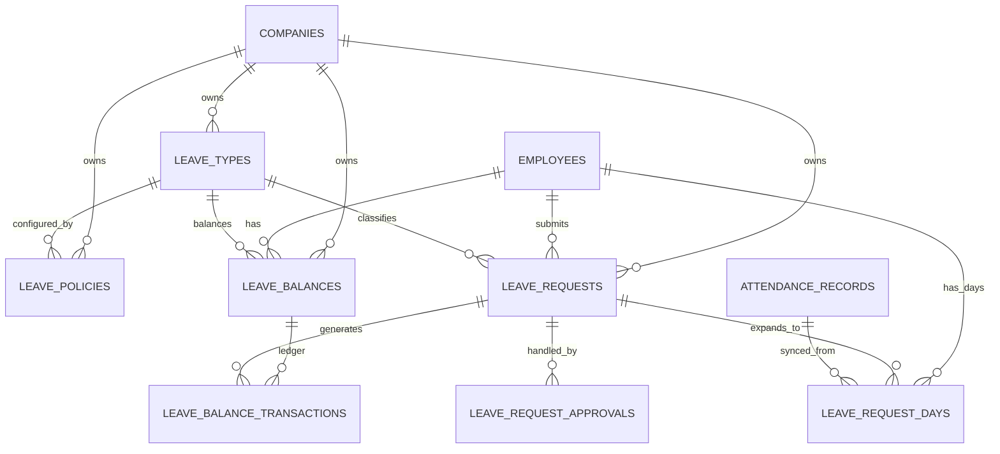

> 🔒 **BẤT BIẾN DB (bổ sung bắt buộc):** Mọi bảng có `company_id` PHẢI bật **RLS + FORCE**; `audit_logs` **append-only** (REVOKE UPDATE/DELETE + trigger); audit/event ghi qua **outbox** trong cùng transaction nghiệp vụ. Bộ docs gốc CHƯA mô tả 3 cơ chế này — DDL mẫu + `withTenant`/`set_config` tại [DECISIONS-02 §2–3](../DECISIONS/DECISIONS-02_Stack_Lock_And_Invariants.md).

# DB-05: LEAVE DATABASE DESIGN

> **📚 Bộ tài liệu DB — Hệ thống Quản lý Doanh nghiệp**
> [DB-01 Tổng quan](<DB-01 DATABASE DESIGN TỔNG QUAN.md>) · [DB-02 AUTH/RBAC](<DB-02 AUTH RBAC Database Design.md>) · [DB-03 HR](<DB-03_HR Database Design.md>) · [DB-04 ATT](<DB-04_ATT Database Design.md>) · **DB-05 LEAVE** · [DB-06 TASK](<DB-06 TASK Database Design.md>) · [DB-07 NOTI/DASH](<DB-07 NOTI DASH Database Design.md>) · [DB-08 Audit/Files/Settings](<DB-08 Audit Files Settings Seeds Database Design.md>) · [DB-09 Index/Hiệu năng](<DB-09 Database Index Query Pattern Performance Design.md>) · [DB-10 Migration/Seed](<DB-10_Migration_Plan_Initial_Seed_Data_Database_Design.md>)
>
> **Nguồn & liên quan:** [PRD-00 §9.4](<../PRD/PRD-00 Enterprise Management System .md>) · SPEC tương ứng: [SPEC-05 LEAVE](<../SPEC/SPEC-05 LEAVE.md>) · [SPEC-01 Tổng quan](<../SPEC/SPEC-01 Tổng quan.md>) · [Thiết kế API: API-05 LEAVE](<../API Design/API-05_LEAVE_API_Design.md>) · [Chỉ mục tài liệu](<../README.md>)

---

## 1. Thông tin tài liệu

| Trường | Nội dung |
| --- | --- |
| Mã tài liệu | DB-05 |
| Tên tài liệu | LEAVE Database Design |
| Tên dự án | Hệ thống quản lý doanh nghiệp nội bộ |
| Module | LEAVE - Nghỉ phép |
| Phiên bản | v1.0 |
| Trạng thái | Draft |
| Giai đoạn | MVP Version 1.0 |
| Tài liệu nguồn | PRD-00, SPEC-01 -> SPEC-08, DB-01, DB-02, DB-03, DB-04 |
| Ngày tạo | 20/06/2026 |
| Ngày cập nhật | 20/06/2026 |

---

## 2. Mục đích tài liệu

Tài liệu này mô tả thiết kế database chi tiết cho module **LEAVE - Nghỉ phép** trong hệ thống quản lý doanh nghiệp nội bộ.

Module LEAVE chịu trách nhiệm lưu trữ, truy vết và xử lý dữ liệu liên quan đến:

1. Danh mục loại nghỉ phép.
2. Chính sách nghỉ phép.
3. Số dư phép của nhân viên.
4. Lịch sử cộng/trừ/điều chỉnh số dư phép.
5. Đơn nghỉ phép của nhân viên.
6. Tính ngày nghỉ theo full day, half day, hourly và multiple days.
7. Quy trình gửi, duyệt, từ chối, hủy hoặc thu hồi đơn nghỉ.
8. Lịch sử xử lý đơn nghỉ.
9. File đính kèm trong đơn nghỉ.
10. Đồng bộ đơn nghỉ đã duyệt sang module chấm công.
11. Cung cấp dữ liệu cho Dashboard, Notification và Payroll phase sau.
12. Ghi audit log cho các thao tác quan trọng.

Tài liệu DB-05 là cơ sở để backend triển khai migration, model/entity, repository, leave service, balance service, approval service, sync service sang ATT, API nghỉ phép và test case database cho module LEAVE.

---

## 3. Phạm vi thiết kế

### 3.1 Bao gồm trong DB-05

DB-05 bao gồm các bảng chính sau:

| Nhóm | Bảng | Vai trò |
| --- | --- | --- |
| Master data | `leave_types` | Danh mục loại nghỉ phép |
| Policy | `leave_policies` | Chính sách nghỉ phép theo company/department/employee/job level |
| Balance | `leave_balances` | Số dư phép theo employee + leave type + năm/kỳ |
| Balance | `leave_balance_transactions` | Lịch sử cộng/trừ/giữ chỗ/hoàn phép/điều chỉnh |
| Request | `leave_requests` | Đơn nghỉ phép tổng |
| Request detail | `leave_request_days` | Chi tiết từng ngày nghỉ để tính công và lịch nghỉ |
| Approval | `leave_request_approvals` | Lịch sử duyệt/từ chối/hủy/thu hồi |
| Optional extension | `leave_policy_assignments` | Gán policy theo phạm vi nếu cần tách riêng khỏi `leave_policies` |
| Optional extension | `leave_accrual_jobs` | Lịch sử job cộng phép tự động ở phase sau |
| Optional extension | `leave_import_batches` | Import số dư phép ở phase sau |

Trong MVP, 7 bảng bắt buộc là:

```text
leave_types
leave_policies
leave_balances
leave_balance_transactions
leave_requests
leave_request_days
leave_request_approvals
```

### 3.2 Bảng dùng lại từ module khác

DB-05 không tạo lại các bảng sau, nhưng phụ thuộc trực tiếp vào chúng:

| Bảng | Module | Cách LEAVE sử dụng |
| --- | --- | --- |
| `companies` | Foundation | Mỗi dữ liệu nghỉ phép thuộc một company/tenant |
| `users` | AUTH | Actor tạo, gửi, duyệt, từ chối, hủy, điều chỉnh |
| `roles` / `permissions` / `role_permissions` | AUTH | Kiểm soát permission và data scope |
| `employees` | HR | Nhân viên là chủ thể tạo đơn và sở hữu số dư phép |
| `departments` | HR | Áp chính sách theo phòng ban, lọc lịch nghỉ |
| `positions` | HR | Hiển thị thông tin nhân sự và mở rộng policy |
| `job_levels` | HR | Áp chính sách theo cấp bậc nếu cần |
| `employee_contracts` | HR | Tính phép theo ngày vào làm, loại hợp đồng, trạng thái hợp đồng nếu cấu hình |
| `shifts` | ATT | Xác định giờ làm việc để tính nghỉ theo giờ/nửa ngày |
| `attendance_records` | ATT | Đồng bộ trạng thái nghỉ sang bảng công |
| `attendance_rules` | ATT | Tham khảo rule ngày làm việc nếu cần |
| `public_holidays` | Foundation | Loại trừ ngày lễ/ngày không làm việc khi tính số ngày nghỉ |
| `files` / `file_links` | Foundation | Lưu file chứng minh hoặc tài liệu đính kèm đơn nghỉ |
| `notifications` / `notification_events` | NOTI | Gửi thông báo khi gửi/duyệt/từ chối/hủy đơn |
| `dashboard_widget_cache` | DASH | Dashboard có thể cache tổng số đơn Pending, phép còn lại |
| `audit_logs` | Foundation | Ghi log thao tác quan trọng |
| `sequence_counters` | Foundation | Sinh mã đơn nghỉ tự động |

### 3.3 Không đi sâu trong DB-05 nhưng cần chừa thiết kế

| Nhóm | Giai đoạn | Ghi chú thiết kế |
| --- | --- | --- |
| Payroll | Phase 2 | Payroll dùng `leave_request_days`, `leave_balances`, `employees` để tính lương |
| Accrual nâng cao | Phase sau | Tự động cộng phép theo tháng/quý/năm/thâm niên |
| Carry over | Phase sau | Chuyển phép tồn sang năm sau, giới hạn số ngày chuyển |
| Multi-level approval | Phase sau | Có thể mở rộng `leave_request_approvals.approval_step` |
| Compensatory leave | Phase sau | Liên kết overtime để sinh quỹ nghỉ bù |
| Special leave workflow | Phase sau | Nghỉ thai sản/nghỉ dài hạn có workflow riêng |
| Calendar integration | Phase sau | Đồng bộ Google/Microsoft Calendar |
| Import Excel | Phase sau | Import số dư phép qua `leave_import_batches` |
| Mobile push | Phase sau | NOTI/MOBILE xử lý device token và push |
| AI suggestion | Phase 5 | AI gợi ý người thay thế, cảnh báo thiếu nhân sự |

---

## 4. Nguyên tắc thiết kế LEAVE

### 4.1 PostgreSQL làm database chính

DB-05 tiếp tục dùng PostgreSQL vì module LEAVE cần:

1. Transaction khi duyệt đơn: đổi trạng thái đơn, cập nhật balance, tạo transaction, tạo detail days, đồng bộ ATT.
2. Foreign key để bảo vệ quan hệ với employee, user, company, leave type.
3. Unique constraint để tránh trùng số dư và mã đơn.
4. Index tốt cho truy vấn lịch nghỉ, danh sách đơn, đơn chờ duyệt, báo cáo theo tháng/năm.
5. JSONB cho cấu hình policy linh hoạt, snapshot tính toán, metadata mở rộng.
6. Dễ mở rộng sang payroll, approval nhiều cấp và calendar integration.

### 4.2 UUID làm primary key

Tất cả bảng LEAVE dùng:

```sql
id UUID PRIMARY KEY DEFAULT gen_random_uuid()
```

### 4.3 Multi-tenant bằng `company_id`

Tất cả bảng LEAVE bắt buộc có `company_id`.

Nguyên tắc:

1. Mỗi đơn nghỉ thuộc đúng một công ty.
2. Mỗi số dư phép thuộc đúng một công ty.
3. Mọi query LEAVE phải filter theo `company_id` từ auth context.
4. Không tin `company_id` từ request body frontend.
5. Super Admin có scope System mới được truy vấn liên công ty.
6. Các unique/index chính luôn đặt `company_id` ở cột đầu.

### 4.4 Employee là chủ thể trung tâm của LEAVE

LEAVE không tạo đơn trực tiếp theo `user_id`, mà theo `employee_id`.

Lý do:

1. Nghỉ phép là nghiệp vụ nhân sự, phải gắn với hồ sơ employee.
2. Manager scope dựa vào `employees.direct_manager_id`.
3. Phòng ban để lọc lịch nghỉ lấy từ `employees.department_id`.
4. Payroll sau này tính phép theo employee, không theo user.
5. Một số employee có thể chưa có user, nhưng HR vẫn có thể tạo/cập nhật dữ liệu phép cho employee nếu cần.

`user_id` vẫn được lưu cho actor:

```text
created_by
submitted_by
reviewed_by
cancelled_by
updated_by
```

### 4.5 Tách đơn tổng và chi tiết từng ngày nghỉ

Thiết kế dùng hai lớp dữ liệu:

| Lớp | Bảng | Vai trò |
| --- | --- | --- |
| Tổng | `leave_requests` | Lưu thông tin chung của đơn nghỉ |
| Chi tiết | `leave_request_days` | Mỗi dòng là một ngày hoặc một phần ngày nghỉ |

Nguyên tắc:

1. `leave_requests` phục vụ danh sách đơn, trạng thái, tổng số ngày/giờ.
2. `leave_request_days` phục vụ lịch nghỉ, đồng bộ ATT, tính required minutes.
3. Khi đơn Draft/Pending có thể tạo day detail tạm để preview.
4. Khi đơn Approved, day detail phải được cố định để ATT và Payroll sử dụng.
5. Khi đơn Cancelled/Revoked, không xóa day detail; cập nhật status/sync_status để truy vết.

### 4.6 Tách số dư hiện tại và lịch sử giao dịch

Thiết kế dùng hai bảng:

| Lớp | Bảng | Vai trò |
| --- | --- | --- |
| Số dư hiện tại | `leave_balances` | Tổng hợp số dư theo employee + leave type + năm/kỳ |
| Ledger | `leave_balance_transactions` | Lịch sử mọi biến động số dư |

Nguyên tắc:

1. `leave_balances` là dữ liệu tổng hợp để query nhanh.
2. `leave_balance_transactions` là ledger bắt buộc để truy vết.
3. Không sửa số dư mà không tạo transaction.
4. Khi approve đơn nghỉ có trừ phép, tạo transaction `USE`.
5. Khi cancel/revoke đơn Approved, tạo transaction `REFUND`.
6. Khi HR điều chỉnh, tạo transaction `ADJUSTMENT`.
7. Khi Pending cần giữ chỗ số dư, tạo transaction `RESERVE`; khi approve chuyển sang `USE`, khi reject/cancel tạo `RELEASE`.

### 4.7 Chính sách nghỉ phép phải có phạm vi áp dụng

`leave_policies` cần hỗ trợ phạm vi:

```text
Company
Department
Employee
JobLevel
ContractType
```

Thứ tự ưu tiên đề xuất:

```text
Employee -> Department -> JobLevel -> ContractType -> Company -> Default
```

Nếu MVP chưa cần nhiều phạm vi, vẫn nên thiết kế sẵn các cột nullable để tránh refactor lớn.

### 4.8 Trạng thái đơn nghỉ là state machine

Trạng thái đơn nghỉ đề xuất:

| Status | Ý nghĩa |
| --- | --- |
| Draft | Đơn lưu nháp, chưa gửi |
| Pending | Đã gửi, chờ duyệt |
| Approved | Đã duyệt |
| Rejected | Bị từ chối |
| Cancelled | Đã hủy |
| Revoked | Đã thu hồi sau khi duyệt |

Luồng hợp lệ:

```text
Draft -> Pending
Draft -> Cancelled
Pending -> Approved
Pending -> Rejected
Pending -> Cancelled
Approved -> Cancelled       nếu policy cho phép hủy sau duyệt
Approved -> Revoked         HR/Admin thu hồi
Rejected -> không xử lý tiếp
Cancelled -> không xử lý tiếp
Revoked -> không xử lý tiếp
```

Backend phải kiểm tra state transition, không chỉ dựa vào frontend.

### 4.9 Đồng bộ với ATT là bắt buộc khi Approved/Cancelled/Revoked

Khi đơn nghỉ chuyển sang `Approved`:

1. LEAVE tạo/cập nhật `leave_request_days`.
2. LEAVE phát event nội bộ `LEAVE_REQUEST_APPROVED`.
3. ATT dùng `leave_request_days` để tạo hoặc cập nhật `attendance_records`.
4. Nếu nghỉ full day, attendance status là `Leave`.
5. Nếu nghỉ half day/hourly, ATT giảm `required_working_minutes`.
6. Nếu ngày đó đã có check-in/check-out, ATT phải tính lại công theo rule.

Khi đơn `Cancelled` hoặc `Revoked` sau khi Approved:

1. LEAVE phát event `LEAVE_REQUEST_CANCELLED` hoặc `LEAVE_REQUEST_REVOKED`.
2. ATT restore/tính lại `attendance_records`.
3. `leave_request_days.sync_status` chuyển sang `Pending Revert` rồi `Reverted` hoặc `Failed`.

### 4.10 Không xóa cứng dữ liệu nghỉ phép quan trọng

Không xóa cứng:

```text
leave_types
leave_policies
leave_balances
leave_balance_transactions
leave_requests
leave_request_days
leave_request_approvals
```

Dùng:

```text
deleted_at
deleted_by
```

Riêng transaction ledger không nên soft delete trong nghiệp vụ thường. Nếu cần hủy tác động, tạo transaction đảo chiều.

### 4.11 Audit log bắt buộc

Các thao tác sau phải ghi `audit_logs`:

1. Tạo/sửa/vô hiệu hóa leave type.
2. Tạo/sửa/vô hiệu hóa leave policy.
3. Tạo/lưu nháp/gửi đơn nghỉ.
4. Duyệt/từ chối/hủy/thu hồi đơn nghỉ.
5. Điều chỉnh số dư phép.
6. Job tự động cộng phép hoặc reset phép.
7. Đồng bộ sang ATT thất bại nhiều lần.
8. Export dữ liệu nghỉ phép.
9. Xem/tải file nhạy cảm nếu có cấu hình.

### 4.12 Quyền và data scope

Backend phải kiểm tra permission và data scope trước khi trả dữ liệu.

| Scope | Ý nghĩa trong LEAVE |
| --- | --- |
| Own | Chỉ đơn/số dư/lịch nghỉ của chính employee hiện tại |
| Team | Nhân viên có `direct_manager_id` là employee hiện tại |
| Department | Nhân viên thuộc phòng ban user được quản lý |
| Company | Toàn bộ dữ liệu nghỉ phép trong công ty |
| System | Toàn bộ dữ liệu nghỉ phép trong hệ thống |

Ví dụ:

1. Employee chỉ xem/tạo/hủy đơn của chính mình.
2. Manager chỉ duyệt đơn của nhân viên trong team.
3. HR xem và xử lý theo scope Company nếu có quyền.
4. Admin công ty chỉ xem/xử lý nếu được cấp permission tương ứng.
5. Super Admin có thể xem toàn hệ thống nhưng vẫn nên giới hạn theo tenant trong UI vận hành.

### 4.13 Lý do nghỉ và file đính kèm là dữ liệu riêng tư

Một số dữ liệu LEAVE có thể nhạy cảm:

```text
reason
rejection_reason
medical certificate
sick leave attachment
maternity leave attachment
bereavement document
```

Nguyên tắc:

1. Không đưa lý do nghỉ chi tiết vào notification payload nếu không cần.
2. Lịch nghỉ team có thể chỉ hiển thị trạng thái "Nghỉ" thay vì lý do.
3. File đính kèm phải dùng private storage.
4. Export dữ liệu nghỉ có lý do/file cần permission riêng.
5. Có thể mask lý do nghỉ với người xem lịch nhưng không có quyền chi tiết.

---

## 5. ERD cấp module LEAVE

### 5.1 ERD dạng text

```text
companies
  1 --- n leave_types
  1 --- n leave_policies
  1 --- n leave_balances
  1 --- n leave_balance_transactions
  1 --- n leave_requests
  1 --- n leave_request_days
  1 --- n leave_request_approvals

employees
  1 --- n leave_balances
  1 --- n leave_requests
  1 --- n leave_request_days
  1 --- n leave_balance_transactions
  1 --- n leave_request_approvals       nếu approver_employee_id

leave_types
  1 --- n leave_policies
  1 --- n leave_balances
  1 --- n leave_requests
  1 --- n leave_balance_transactions

leave_balances
  1 --- n leave_balance_transactions

leave_requests
  1 --- n leave_request_days
  1 --- n leave_request_approvals
  1 --- n leave_balance_transactions     nếu transaction phát sinh từ đơn

users
  1 --- n leave_requests.created_by/submitted_by/cancelled_by
  1 --- n leave_request_approvals.approver_user_id
  1 --- n leave_balance_transactions.created_by

departments
  1 --- n leave_policies                 nếu policy_scope = Department
  1 --- n leave_requests                 qua department_id snapshot

attendance_records
  0..1 --- n leave_request_days           logic sync qua leave_request_days.attendance_record_id

files
  1 --- n file_links                      module_code = LEAVE
```

### 5.2 Quan hệ chính

| Quan hệ | Loại | Ghi chú |
| --- | --- | --- |
| `companies.id` -> `leave_requests.company_id` | 1-n | Multi-tenant |
| `employees.id` -> `leave_requests.employee_id` | 1-n | Employee có nhiều đơn nghỉ |
| `leave_types.id` -> `leave_requests.leave_type_id` | 1-n | Đơn thuộc một loại nghỉ |
| `leave_requests.id` -> `leave_request_days.leave_request_id` | 1-n | Một đơn có nhiều ngày nghỉ |
| `leave_requests.id` -> `leave_request_approvals.leave_request_id` | 1-n | Một đơn có nhiều log xử lý |
| `employees.id` -> `leave_balances.employee_id` | 1-n | Employee có nhiều balance theo loại phép/năm |
| `leave_types.id` -> `leave_balances.leave_type_id` | 1-n | Balance theo loại nghỉ |
| `leave_balances.id` -> `leave_balance_transactions.leave_balance_id` | 1-n | Balance có nhiều giao dịch |
| `leave_requests.id` -> `leave_balance_transactions.leave_request_id` | 1-n | Giao dịch có thể phát sinh từ đơn nghỉ |
| `attendance_records.id` -> `leave_request_days.attendance_record_id` | 1-n hoặc nullable | Day detail có thể đồng bộ sang bảng công |
| `users.id` -> `leave_request_approvals.approver_user_id` | 1-n | Người xử lý đơn |

### 5.3 Mermaid ERD



---

## 6. Danh sách bảng DB-05

| STT | Bảng | Bắt buộc MVP | Mô tả |
| --- | --- | --- | --- |
| 1 | `leave_types` | Có | Danh mục loại nghỉ |
| 2 | `leave_policies` | Có | Chính sách nghỉ phép |
| 3 | `leave_balances` | Có | Số dư phép hiện tại |
| 4 | `leave_balance_transactions` | Có | Ledger biến động số dư |
| 5 | `leave_requests` | Có | Đơn nghỉ tổng |
| 6 | `leave_request_days` | Có | Chi tiết từng ngày nghỉ |
| 7 | `leave_request_approvals` | Có | Lịch sử xử lý đơn |
| 8 | `leave_policy_assignments` | Sau MVP/Nên cân nhắc | Tách mapping policy phức tạp |
| 9 | `leave_accrual_jobs` | Phase sau | Lịch sử job cộng phép |
| 10 | `leave_import_batches` | Phase sau | Import số dư phép |
| 11 | `leave_import_rows` | Phase sau | Chi tiết dòng import |

---

## 7. Thiết kế chi tiết bảng

### 7.1 Bảng `leave_types`

#### Mục đích

Lưu danh mục loại nghỉ phép của công ty.

Ví dụ:

```text
ANNUAL_LEAVE
UNPAID_LEAVE
SICK_LEAVE
MATERNITY_LEAVE
MARRIAGE_LEAVE
BEREAVEMENT_LEAVE
COMPENSATORY_LEAVE
OTHER
```

#### Cấu trúc cột

| Cột | Kiểu | Bắt buộc | Ghi chú |
| --- | --- | --- | --- |
| `id` | UUID | Có | PK |
| `company_id` | UUID | Có | FK `companies.id` |
| `leave_type_code` | VARCHAR(100) | Có | Mã loại nghỉ, unique theo company |
| `name` | VARCHAR(255) | Có | Tên hiển thị |
| `description` | TEXT | Không | Mô tả |
| `is_paid` | BOOLEAN | Có | Có hưởng lương không |
| `deduct_balance` | BOOLEAN | Có | Có trừ số dư phép không |
| `balance_unit` | VARCHAR(20) | Có | Day/Hour |
| `allow_full_day` | BOOLEAN | Có | Cho nghỉ cả ngày |
| `allow_half_day` | BOOLEAN | Có | Cho nghỉ nửa ngày |
| `allow_hourly` | BOOLEAN | Có | Cho nghỉ theo giờ |
| `allow_multiple_days` | BOOLEAN | Có | Cho nghỉ nhiều ngày |
| `require_reason` | BOOLEAN | Có | Bắt buộc nhập lý do |
| `require_attachment` | BOOLEAN | Có | Bắt buộc file đính kèm |
| `min_notice_days` | INT | Không | Số ngày báo trước tối thiểu |
| `max_days_per_request` | NUMERIC(8,2) | Không | Số ngày tối đa mỗi đơn |
| `max_hours_per_request` | NUMERIC(8,2) | Không | Số giờ tối đa mỗi đơn |
| `allow_negative_balance` | BOOLEAN | Có | Có cho âm số dư không |
| `is_system_default` | BOOLEAN | Có | Loại nghỉ mặc định hệ thống/company |
| `status` | VARCHAR(50) | Có | Active/Inactive |
| `sort_order` | INT | Không | Thứ tự hiển thị |
| `metadata` | JSONB | Không | Dữ liệu mở rộng |
| `created_at` | TIMESTAMP | Có | Thời điểm tạo |
| `created_by` | UUID | Không | FK `users.id` |
| `updated_at` | TIMESTAMP | Có | Thời điểm cập nhật |
| `updated_by` | UUID | Không | FK `users.id` |
| `deleted_at` | TIMESTAMP | Không | Soft delete |
| `deleted_by` | UUID | Không | FK `users.id` |

#### Constraint/index đề xuất

```sql
ALTER TABLE leave_types
ADD CONSTRAINT chk_leave_types_status
CHECK (status IN ('Active', 'Inactive'));

ALTER TABLE leave_types
ADD CONSTRAINT chk_leave_types_balance_unit
CHECK (balance_unit IN ('Day', 'Hour'));

ALTER TABLE leave_types
ADD CONSTRAINT chk_leave_types_request_limit
CHECK (
  (max_days_per_request IS NULL OR max_days_per_request > 0)
  AND (max_hours_per_request IS NULL OR max_hours_per_request > 0)
);

CREATE UNIQUE INDEX uq_leave_types_company_code_active
ON leave_types (company_id, leave_type_code)
WHERE deleted_at IS NULL;

CREATE INDEX idx_leave_types_company_status
ON leave_types (company_id, status)
WHERE deleted_at IS NULL;

CREATE INDEX idx_leave_types_company_sort
ON leave_types (company_id, sort_order)
WHERE deleted_at IS NULL;
```

#### Quy tắc nghiệp vụ

1. `leave_type_code` không được trùng trong cùng company.
2. Không xóa cứng loại nghỉ đã phát sinh request/balance; chỉ `status = Inactive` hoặc soft delete nếu chưa dùng.
3. Nếu `deduct_balance = false`, khi duyệt đơn không trừ `leave_balances`, nhưng vẫn tạo `leave_request_days`.
4. Nếu `require_attachment = true`, API gửi đơn phải kiểm tra file đính kèm.
5. Nếu `allow_hourly = false`, không cho duration type Hourly.
6. Nếu `allow_half_day = false`, không cho half day morning/afternoon.
7. Nếu `allow_negative_balance = false`, service không cho approve hoặc submit vượt số dư theo policy.

---

### 7.2 Bảng `leave_policies`

#### Mục đích

Lưu chính sách nghỉ phép áp dụng theo công ty, phòng ban, nhân viên, cấp bậc hoặc loại hợp đồng.

Policy quyết định:

1. Số ngày/giờ được cấp.
2. Có giữ chỗ số dư khi đơn Pending không.
3. Có cho âm số dư không.
4. Có tính theo ngày vào làm không.
5. Có trừ cuối tuần/ngày lễ không.
6. Có cho hủy đơn đã duyệt không.
7. Rule carry over/reset/accrual ở phase sau.

#### Cấu trúc cột

| Cột | Kiểu | Bắt buộc | Ghi chú |
| --- | --- | --- | --- |
| `id` | UUID | Có | PK |
| `company_id` | UUID | Có | FK `companies.id` |
| `leave_type_id` | UUID | Có | FK `leave_types.id` |
| `policy_code` | VARCHAR(100) | Có | Mã policy, unique theo company |
| `name` | VARCHAR(255) | Có | Tên policy |
| `description` | TEXT | Không | Mô tả |
| `policy_scope` | VARCHAR(50) | Có | Company/Department/Employee/JobLevel/ContractType |
| `department_id` | UUID | Không | FK `departments.id`, khi scope Department |
| `employee_id` | UUID | Không | FK `employees.id`, khi scope Employee |
| `job_level_id` | UUID | Không | FK `job_levels.id`, khi scope JobLevel |
| `contract_type_id` | UUID | Không | FK `contract_types.id`, khi scope ContractType |
| `yearly_quota_days` | NUMERIC(8,2) | Không | Số ngày phép cấp theo năm |
| `yearly_quota_hours` | NUMERIC(8,2) | Không | Số giờ phép cấp theo năm |
| `accrual_method` | VARCHAR(50) | Có | None/Monthly/Yearly/Manual/Prorated |
| `accrual_day_of_month` | INT | Không | Ngày cộng phép trong tháng |
| `prorate_on_join_date` | BOOLEAN | Có | Tính tỷ lệ theo ngày vào làm |
| `include_weekends` | BOOLEAN | Có | Có tính cuối tuần vào số ngày nghỉ không |
| `include_public_holidays` | BOOLEAN | Có | Có tính ngày lễ vào số ngày nghỉ không |
| `reserve_balance_on_pending` | BOOLEAN | Có | Có giữ chỗ số dư khi Pending không |
| `allow_negative_balance` | BOOLEAN | Có | Có cho âm số dư không |
| `max_negative_days` | NUMERIC(8,2) | Không | Mức âm tối đa theo ngày |
| `allow_cancel_after_approved` | BOOLEAN | Có | Cho hủy đơn Approved |
| `cancel_before_days` | INT | Không | Phải hủy trước bao nhiêu ngày |
| `requires_manager_approval` | BOOLEAN | Có | Cần manager duyệt |
| `requires_hr_approval` | BOOLEAN | Có | Cần HR xác nhận sau manager |
| `effective_from` | DATE | Có | Ngày bắt đầu hiệu lực |
| `effective_to` | DATE | Không | Ngày kết thúc hiệu lực |
| `priority` | INT | Có | Ưu tiên khi nhiều policy cùng khớp |
| `status` | VARCHAR(50) | Có | Active/Inactive |
| `policy_config` | JSONB | Không | Cấu hình mở rộng |
| `created_at` | TIMESTAMP | Có | Thời điểm tạo |
| `created_by` | UUID | Không | FK `users.id` |
| `updated_at` | TIMESTAMP | Có | Thời điểm cập nhật |
| `updated_by` | UUID | Không | FK `users.id` |
| `deleted_at` | TIMESTAMP | Không | Soft delete |
| `deleted_by` | UUID | Không | FK `users.id` |

#### Constraint/index đề xuất

```sql
ALTER TABLE leave_policies
ADD CONSTRAINT chk_leave_policies_scope
CHECK (policy_scope IN ('Company', 'Department', 'Employee', 'JobLevel', 'ContractType'));

ALTER TABLE leave_policies
ADD CONSTRAINT chk_leave_policies_status
CHECK (status IN ('Active', 'Inactive'));

ALTER TABLE leave_policies
ADD CONSTRAINT chk_leave_policies_accrual_method
CHECK (accrual_method IN ('None', 'Monthly', 'Yearly', 'Manual', 'Prorated'));

ALTER TABLE leave_policies
ADD CONSTRAINT chk_leave_policies_effective_date
CHECK (effective_to IS NULL OR effective_to >= effective_from);

ALTER TABLE leave_policies
ADD CONSTRAINT chk_leave_policies_target
CHECK (
  (policy_scope = 'Company' AND department_id IS NULL AND employee_id IS NULL AND job_level_id IS NULL AND contract_type_id IS NULL)
  OR (policy_scope = 'Department' AND department_id IS NOT NULL AND employee_id IS NULL)
  OR (policy_scope = 'Employee' AND employee_id IS NOT NULL)
  OR (policy_scope = 'JobLevel' AND job_level_id IS NOT NULL)
  OR (policy_scope = 'ContractType' AND contract_type_id IS NOT NULL)
);

CREATE UNIQUE INDEX uq_leave_policies_company_code_active
ON leave_policies (company_id, policy_code)
WHERE deleted_at IS NULL;

CREATE INDEX idx_leave_policies_lookup
ON leave_policies (company_id, leave_type_id, policy_scope, status, effective_from, effective_to)
WHERE deleted_at IS NULL;

CREATE INDEX idx_leave_policies_department
ON leave_policies (company_id, department_id, leave_type_id, status)
WHERE deleted_at IS NULL;

CREATE INDEX idx_leave_policies_employee
ON leave_policies (company_id, employee_id, leave_type_id, status)
WHERE deleted_at IS NULL;
```

#### Quy tắc nghiệp vụ

1. Khi tính policy cho employee, service chọn policy active, cùng company, đúng leave type, hiệu lực tại ngày nghỉ.
2. Nếu nhiều policy cùng khớp, chọn theo thứ tự scope và `priority`.
3. Không sửa trực tiếp policy đã dùng để tính đơn quá khứ nếu thay đổi làm sai dữ liệu; nên tạo policy mới với `effective_from` mới.
4. `policy_config` có thể lưu cấu hình carry over, accrual nâng cao hoặc exception.
5. Nếu `reserve_balance_on_pending = true`, khi submit đơn Pending cần giữ chỗ số dư.
6. Nếu `include_weekends = false`, ngày nghỉ rơi vào cuối tuần có thể không tính vào total_days, tùy rule ca làm.
7. Nếu `include_public_holidays = false`, ngày lễ public holiday không tính vào total_days.

---

### 7.3 Bảng `leave_balances`

#### Mục đích

Lưu số dư phép hiện tại của nhân viên theo từng loại nghỉ và năm/kỳ.

Mỗi dòng thường đại diện cho:

```text
employee_id + leave_type_id + balance_year
```

#### Cấu trúc cột

| Cột | Kiểu | Bắt buộc | Ghi chú |
| --- | --- | --- | --- |
| `id` | UUID | Có | PK |
| `company_id` | UUID | Có | FK `companies.id` |
| `employee_id` | UUID | Có | FK `employees.id` |
| `leave_type_id` | UUID | Có | FK `leave_types.id` |
| `balance_year` | INT | Có | Năm áp dụng |
| `period_start` | DATE | Có | Ngày bắt đầu kỳ |
| `period_end` | DATE | Có | Ngày kết thúc kỳ |
| `opening_days` | NUMERIC(8,2) | Có | Số dư đầu kỳ theo ngày |
| `granted_days` | NUMERIC(8,2) | Có | Số ngày được cấp |
| `used_days` | NUMERIC(8,2) | Có | Số ngày đã dùng Approved |
| `pending_days` | NUMERIC(8,2) | Có | Số ngày đang giữ chỗ Pending |
| `adjusted_days` | NUMERIC(8,2) | Có | Tổng điều chỉnh cộng/trừ |
| `carried_over_days` | NUMERIC(8,2) | Có | Số ngày chuyển từ kỳ trước |
| `expired_days` | NUMERIC(8,2) | Có | Số ngày hết hạn |
| `remaining_days` | NUMERIC(8,2) | Có | Số ngày còn lại khả dụng |
| `opening_hours` | NUMERIC(8,2) | Có | Số dư đầu kỳ theo giờ |
| `granted_hours` | NUMERIC(8,2) | Có | Số giờ được cấp |
| `used_hours` | NUMERIC(8,2) | Có | Số giờ đã dùng |
| `pending_hours` | NUMERIC(8,2) | Có | Số giờ đang giữ chỗ |
| `adjusted_hours` | NUMERIC(8,2) | Có | Tổng điều chỉnh giờ |
| `remaining_hours` | NUMERIC(8,2) | Có | Số giờ còn lại |
| `last_accrual_at` | TIMESTAMP | Không | Lần cộng phép tự động gần nhất |
| `last_calculated_at` | TIMESTAMP | Không | Lần tính lại gần nhất |
| `status` | VARCHAR(50) | Có | Active/Closed |
| `metadata` | JSONB | Không | Dữ liệu mở rộng |
| `created_at` | TIMESTAMP | Có | Thời điểm tạo |
| `created_by` | UUID | Không | FK `users.id` |
| `updated_at` | TIMESTAMP | Có | Thời điểm cập nhật |
| `updated_by` | UUID | Không | FK `users.id` |
| `deleted_at` | TIMESTAMP | Không | Soft delete |
| `deleted_by` | UUID | Không | FK `users.id` |

#### Constraint/index đề xuất

```sql
ALTER TABLE leave_balances
ADD CONSTRAINT chk_leave_balances_status
CHECK (status IN ('Active', 'Closed'));

ALTER TABLE leave_balances
ADD CONSTRAINT chk_leave_balances_period
CHECK (period_end >= period_start);

ALTER TABLE leave_balances
ADD CONSTRAINT chk_leave_balances_non_negative_components
CHECK (
  opening_days >= 0
  AND granted_days >= 0
  AND used_days >= 0
  AND pending_days >= 0
  AND carried_over_days >= 0
  AND expired_days >= 0
  AND opening_hours >= 0
  AND granted_hours >= 0
  AND used_hours >= 0
  AND pending_hours >= 0
);

CREATE UNIQUE INDEX uq_leave_balances_employee_type_year_active
ON leave_balances (company_id, employee_id, leave_type_id, balance_year)
WHERE deleted_at IS NULL;

CREATE INDEX idx_leave_balances_employee_year
ON leave_balances (company_id, employee_id, balance_year)
WHERE deleted_at IS NULL;

CREATE INDEX idx_leave_balances_type_year
ON leave_balances (company_id, leave_type_id, balance_year)
WHERE deleted_at IS NULL;

CREATE INDEX idx_leave_balances_remaining
ON leave_balances (company_id, balance_year, remaining_days)
WHERE deleted_at IS NULL;
```

#### Quy tắc nghiệp vụ

1. Không cho tạo trùng balance cho cùng employee + leave type + year.
2. Balance phải được cập nhật trong transaction cùng với `leave_balance_transactions`.
3. `remaining_days` có thể được lưu materialized để query nhanh, nhưng phải được service tính nhất quán.
4. Công thức đề xuất:

```text
remaining_days =
opening_days
+ granted_days
+ adjusted_days
+ carried_over_days
- used_days
- pending_days
- expired_days
```

1. Nếu leave type tính theo giờ, sử dụng nhóm field `*_hours`.
2. Khi đóng năm/kỳ, chuyển `status = Closed`; không cho tạo request mới vào kỳ đã đóng trừ khi HR có quyền đặc biệt.
3. Có thể cho phép remaining âm nếu policy cho phép; constraint không nên bắt `remaining_days >= 0` ở DB, mà để service kiểm tra theo policy.

---

### 7.4 Bảng `leave_balance_transactions`

#### Mục đích

Lưu mọi biến động số dư phép của nhân viên.

Đây là ledger nghiệp vụ. Mọi thay đổi balance phải có transaction tương ứng.

#### Loại transaction đề xuất

| Type | Ý nghĩa |
| --- | --- |
| OPENING | Số dư đầu kỳ |
| GRANT | Cấp phép |
| ACCRUAL | Cộng phép tự động |
| RESERVE | Giữ chỗ khi đơn Pending |
| RELEASE | Nhả giữ chỗ khi Rejected/Cancelled |
| USE | Trừ phép khi Approved |
| REFUND | Hoàn phép khi Cancelled/Revoked sau Approved |
| ADJUSTMENT | HR điều chỉnh thủ công |
| EXPIRE | Hết hạn phép |
| CARRY_OVER | Chuyển phép tồn |
| IMPORT | Import từ file |
| SYSTEM_RECALCULATE | Điều chỉnh do hệ thống tính lại |

#### Cấu trúc cột

| Cột | Kiểu | Bắt buộc | Ghi chú |
| --- | --- | --- | --- |
| `id` | UUID | Có | PK |
| `company_id` | UUID | Có | FK `companies.id` |
| `leave_balance_id` | UUID | Có | FK `leave_balances.id` |
| `employee_id` | UUID | Có | FK `employees.id` |
| `leave_type_id` | UUID | Có | FK `leave_types.id` |
| `leave_request_id` | UUID | Không | FK `leave_requests.id` nếu phát sinh từ đơn |
| `transaction_type` | VARCHAR(50) | Có | OPENING/GRANT/RESERVE/USE/... |
| `transaction_date` | DATE | Có | Ngày nghiệp vụ |
| `amount_days` | NUMERIC(8,2) | Có | Số ngày thay đổi, có thể âm/dương |
| `amount_hours` | NUMERIC(8,2) | Có | Số giờ thay đổi, có thể âm/dương |
| `balance_before_days` | NUMERIC(8,2) | Có | Số dư trước |
| `balance_after_days` | NUMERIC(8,2) | Có | Số dư sau |
| `balance_before_hours` | NUMERIC(8,2) | Có | Số giờ trước |
| `balance_after_hours` | NUMERIC(8,2) | Có | Số giờ sau |
| `reason` | TEXT | Không | Lý do nghiệp vụ |
| `reference_type` | VARCHAR(100) | Không | LeaveRequest/ManualAdjustment/AccrualJob/Import |
| `reference_id` | UUID | Không | ID tham chiếu |
| `created_by_type` | VARCHAR(50) | Có | User/System/Job |
| `metadata` | JSONB | Không | Snapshot policy, calculation info |
| `created_at` | TIMESTAMP | Có | Thời điểm tạo |
| `created_by` | UUID | Không | FK `users.id` |

#### Constraint/index đề xuất

```sql
ALTER TABLE leave_balance_transactions
ADD CONSTRAINT chk_leave_balance_transactions_type
CHECK (
  transaction_type IN (
    'OPENING',
    'GRANT',
    'ACCRUAL',
    'RESERVE',
    'RELEASE',
    'USE',
    'REFUND',
    'ADJUSTMENT',
    'EXPIRE',
    'CARRY_OVER',
    'IMPORT',
    'SYSTEM_RECALCULATE'
  )
);

ALTER TABLE leave_balance_transactions
ADD CONSTRAINT chk_leave_balance_transactions_created_by_type
CHECK (created_by_type IN ('User', 'System', 'Job'));

CREATE INDEX idx_leave_balance_tx_balance_date
ON leave_balance_transactions (company_id, leave_balance_id, transaction_date, created_at);

CREATE INDEX idx_leave_balance_tx_employee_date
ON leave_balance_transactions (company_id, employee_id, transaction_date);

CREATE INDEX idx_leave_balance_tx_request
ON leave_balance_transactions (company_id, leave_request_id)
WHERE leave_request_id IS NOT NULL;

CREATE INDEX idx_leave_balance_tx_type_date
ON leave_balance_transactions (company_id, transaction_type, transaction_date);
```

#### Quy tắc nghiệp vụ

1. Không update/delete transaction trong nghiệp vụ thường.
2. Nếu sai transaction, tạo transaction đảo chiều.
3. Khi approve đơn, tạo transaction trong cùng DB transaction với cập nhật `leave_requests.status`.
4. Khi reject/cancel đơn Pending đã reserve, tạo RELEASE.
5. Khi cancel/revoke đơn Approved đã use, tạo REFUND.
6. `balance_before` và `balance_after` giúp audit dễ hơn, dù có thể tính lại từ ledger.
7. Nên lock row `leave_balances` khi tạo transaction để tránh race condition approve nhiều đơn cùng lúc.

---

### 7.5 Bảng `leave_requests`

#### Mục đích

Lưu thông tin tổng của đơn nghỉ phép.

Một đơn nghỉ có thể là:

1. Nghỉ cả ngày.
2. Nghỉ nửa ngày buổi sáng.
3. Nghỉ nửa ngày buổi chiều.
4. Nghỉ theo giờ.
5. Nghỉ nhiều ngày.

#### Cấu trúc cột

| Cột | Kiểu | Bắt buộc | Ghi chú |
| --- | --- | --- | --- |
| `id` | UUID | Có | PK |
| `company_id` | UUID | Có | FK `companies.id` |
| `leave_request_code` | VARCHAR(100) | Có | Mã đơn nghỉ, unique theo company |
| `employee_id` | UUID | Có | FK `employees.id` |
| `department_id` | UUID | Không | FK `departments.id`, snapshot tại lúc tạo |
| `position_id` | UUID | Không | FK `positions.id`, snapshot nếu cần |
| `direct_manager_employee_id` | UUID | Không | FK `employees.id`, snapshot người quản lý |
| `leave_type_id` | UUID | Có | FK `leave_types.id` |
| `leave_policy_id` | UUID | Không | FK `leave_policies.id`, policy đã áp dụng |
| `duration_type` | VARCHAR(50) | Có | FullDay/HalfDay/Hourly/MultipleDays |
| `half_day_session` | VARCHAR(50) | Không | Morning/Afternoon nếu nghỉ nửa ngày |
| `start_date` | DATE | Có | Ngày bắt đầu |
| `end_date` | DATE | Có | Ngày kết thúc |
| `start_time` | TIME | Không | Nếu nghỉ theo giờ |
| `end_time` | TIME | Không | Nếu nghỉ theo giờ |
| `total_days` | NUMERIC(8,2) | Có | Tổng ngày nghỉ tính phép |
| `total_hours` | NUMERIC(8,2) | Không | Tổng giờ nghỉ |
| `reason` | TEXT | Không | Lý do nghỉ |
| `handover_note` | TEXT | Không | Ghi chú bàn giao |
| `contact_during_leave` | VARCHAR(255) | Không | Liên hệ khi nghỉ nếu cần |
| `status` | VARCHAR(50) | Có | Draft/Pending/Approved/Rejected/Cancelled/Revoked |
| `current_approver_user_id` | UUID | Không | FK `users.id` |
| `current_approver_employee_id` | UUID | Không | FK `employees.id` |
| `submitted_at` | TIMESTAMP | Không | Thời điểm gửi |
| `submitted_by` | UUID | Không | FK `users.id` |
| `approved_at` | TIMESTAMP | Không | Thời điểm duyệt cuối |
| `approved_by` | UUID | Không | FK `users.id` |
| `rejected_at` | TIMESTAMP | Không | Thời điểm từ chối |
| `rejected_by` | UUID | Không | FK `users.id` |
| `rejection_reason` | TEXT | Không | Lý do từ chối |
| `cancelled_at` | TIMESTAMP | Không | Thời điểm hủy |
| `cancelled_by` | UUID | Không | FK `users.id` |
| `cancel_reason` | TEXT | Không | Lý do hủy |
| `revoked_at` | TIMESTAMP | Không | Thời điểm thu hồi |
| `revoked_by` | UUID | Không | FK `users.id` |
| `revoke_reason` | TEXT | Không | Lý do thu hồi |
| `balance_effect_status` | VARCHAR(50) | Có | None/Reserved/Used/Released/Refunded |
| `attendance_sync_status` | VARCHAR(50) | Có | Not Required/Pending/Synced/Failed/Reverted/Pending Revert |
| `calculation_snapshot` | JSONB | Không | Snapshot kết quả tính ngày/giờ/policy/shift |
| `approval_snapshot` | JSONB | Không | Snapshot approver/workflow |
| `metadata` | JSONB | Không | Dữ liệu mở rộng |
| `created_at` | TIMESTAMP | Có | Thời điểm tạo |
| `created_by` | UUID | Không | FK `users.id` |
| `updated_at` | TIMESTAMP | Có | Thời điểm cập nhật |
| `updated_by` | UUID | Không | FK `users.id` |
| `deleted_at` | TIMESTAMP | Không | Soft delete |
| `deleted_by` | UUID | Không | FK `users.id` |

#### Constraint/index đề xuất

```sql
ALTER TABLE leave_requests
ADD CONSTRAINT chk_leave_requests_status
CHECK (status IN ('Draft', 'Pending', 'Approved', 'Rejected', 'Cancelled', 'Revoked'));

ALTER TABLE leave_requests
ADD CONSTRAINT chk_leave_requests_duration_type
CHECK (duration_type IN ('FullDay', 'HalfDay', 'Hourly', 'MultipleDays'));

ALTER TABLE leave_requests
ADD CONSTRAINT chk_leave_requests_half_day_session
CHECK (
  half_day_session IS NULL
  OR half_day_session IN ('Morning', 'Afternoon')
);

ALTER TABLE leave_requests
ADD CONSTRAINT chk_leave_requests_date_range
CHECK (end_date >= start_date);

ALTER TABLE leave_requests
ADD CONSTRAINT chk_leave_requests_total
CHECK (total_days >= 0 AND (total_hours IS NULL OR total_hours >= 0));

ALTER TABLE leave_requests
ADD CONSTRAINT chk_leave_requests_hourly_time
CHECK (
  duration_type <> 'Hourly'
  OR (start_time IS NOT NULL AND end_time IS NOT NULL AND end_time > start_time)
);

ALTER TABLE leave_requests
ADD CONSTRAINT chk_leave_requests_balance_effect_status
CHECK (balance_effect_status IN ('None', 'Reserved', 'Used', 'Released', 'Refunded'));

ALTER TABLE leave_requests
ADD CONSTRAINT chk_leave_requests_attendance_sync_status
CHECK (attendance_sync_status IN ('Not Required', 'Pending', 'Synced', 'Failed', 'Reverted', 'Pending Revert'));

CREATE UNIQUE INDEX uq_leave_requests_company_code_active
ON leave_requests (company_id, leave_request_code)
WHERE deleted_at IS NULL;

CREATE INDEX idx_leave_requests_employee_date
ON leave_requests (company_id, employee_id, start_date, end_date)
WHERE deleted_at IS NULL;

CREATE INDEX idx_leave_requests_status_date
ON leave_requests (company_id, status, start_date, end_date)
WHERE deleted_at IS NULL;

CREATE INDEX idx_leave_requests_pending_approver
ON leave_requests (company_id, current_approver_user_id, status)
WHERE deleted_at IS NULL AND status = 'Pending';

CREATE INDEX idx_leave_requests_department_date
ON leave_requests (company_id, department_id, start_date, end_date)
WHERE deleted_at IS NULL;

CREATE INDEX idx_leave_requests_type_status
ON leave_requests (company_id, leave_type_id, status)
WHERE deleted_at IS NULL;
```

#### Quy tắc nghiệp vụ

1. `leave_request_code` sinh từ `sequence_counters` với key `LEAVE_REQUEST_CODE`.
2. `employee_id`, `department_id`, `position_id`, `direct_manager_employee_id` phải cùng company.
3. Khi tạo đơn, snapshot phòng ban/quản lý để lịch sử không bị thay đổi nếu HR sửa cơ cấu sau này.
4. Không cho gửi đơn nếu employee không ở trạng thái được phép nghỉ.
5. Không cho submit nếu thiếu file với loại nghỉ bắt buộc file.
6. Không cho tạo đơn có `total_days = 0`, trừ khi policy cho phép lưu draft để xử lý sau.
7. Không cho overlap với đơn `Pending` hoặc `Approved` của cùng employee trong cùng khoảng thời gian.
8. Đơn `Draft` được sửa bởi chủ đơn.
9. Đơn `Pending` không sửa nội dung chính, trừ khi workflow cho phép recall.
10. Đơn đã `Approved`, `Rejected`, `Cancelled`, `Revoked` không xử lý lại cùng action.
11. Khi status thay đổi phải tạo `leave_request_approvals` và `audit_logs`.

---

### 7.6 Bảng `leave_request_days`

#### Mục đích

Lưu chi tiết từng ngày nghỉ của một đơn nghỉ.

Bảng này cực kỳ quan trọng vì:

1. Lịch nghỉ lấy dữ liệu từ đây.
2. ATT dùng bảng này để chặn check-in/check-out full day.
3. ATT dùng bảng này để giảm required working minutes với half day/hourly.
4. Payroll phase sau dùng bảng này để tính công/lương.
5. Cho phép xử lý đơn nhiều ngày chính xác theo từng ngày làm việc/ngày lễ/cuối tuần.

#### Cấu trúc cột

| Cột | Kiểu | Bắt buộc | Ghi chú |
| --- | --- | --- | --- |
| `id` | UUID | Có | PK |
| `company_id` | UUID | Có | FK `companies.id` |
| `leave_request_id` | UUID | Có | FK `leave_requests.id` |
| `employee_id` | UUID | Có | FK `employees.id`, denormalize để query nhanh |
| `leave_type_id` | UUID | Có | FK `leave_types.id`, denormalize để query nhanh |
| `work_date` | DATE | Có | Ngày nghỉ |
| `day_type` | VARCHAR(50) | Có | Full Day/Half Day/Hourly/Non Working Day/Public Holiday |
| `half_day_session` | VARCHAR(50) | Không | Morning/Afternoon |
| `start_time` | TIME | Không | Nếu nghỉ theo giờ |
| `end_time` | TIME | Không | Nếu nghỉ theo giờ |
| `leave_days` | NUMERIC(8,2) | Có | Số ngày tính phép cho dòng này |
| `leave_hours` | NUMERIC(8,2) | Có | Số giờ tính phép cho dòng này |
| `required_working_minutes_before` | INT | Không | Số phút yêu cầu trước khi áp leave |
| `leave_minutes` | INT | Có | Số phút nghỉ ảnh hưởng ATT |
| `required_working_minutes_after` | INT | Không | Số phút yêu cầu sau khi trừ leave |
| `is_working_day` | BOOLEAN | Có | Có phải ngày làm việc không |
| `is_public_holiday` | BOOLEAN | Có | Có phải ngày lễ không |
| `public_holiday_id` | UUID | Không | FK `public_holidays.id` nếu có |
| `shift_id` | UUID | Không | FK `shifts.id`, shift dùng để tính |
| `attendance_record_id` | UUID | Không | FK `attendance_records.id` sau khi sync |
| `attendance_sync_status` | VARCHAR(50) | Có | Not Required/Pending/Synced/Failed/Reverted/Pending Revert |
| `attendance_synced_at` | TIMESTAMP | Không | Thời điểm sync |
| `attendance_sync_error` | TEXT | Không | Lỗi sync nếu có |
| `status` | VARCHAR(50) | Có | Active/Cancelled/Revoked |
| `calculation_snapshot` | JSONB | Không | Snapshot shift/policy/rule tính toán |
| `created_at` | TIMESTAMP | Có | Thời điểm tạo |
| `created_by` | UUID | Không | FK `users.id` |
| `updated_at` | TIMESTAMP | Có | Thời điểm cập nhật |
| `updated_by` | UUID | Không | FK `users.id` |
| `deleted_at` | TIMESTAMP | Không | Soft delete |
| `deleted_by` | UUID | Không | FK `users.id` |

#### Constraint/index đề xuất

```sql
ALTER TABLE leave_request_days
ADD CONSTRAINT chk_leave_request_days_day_type
CHECK (day_type IN ('Full Day', 'Half Day', 'Hourly', 'Non Working Day', 'Public Holiday'));

ALTER TABLE leave_request_days
ADD CONSTRAINT chk_leave_request_days_half_session
CHECK (
  half_day_session IS NULL
  OR half_day_session IN ('Morning', 'Afternoon')
);

ALTER TABLE leave_request_days
ADD CONSTRAINT chk_leave_request_days_status
CHECK (status IN ('Active', 'Cancelled', 'Revoked'));

ALTER TABLE leave_request_days
ADD CONSTRAINT chk_leave_request_days_sync_status
CHECK (attendance_sync_status IN ('Not Required', 'Pending', 'Synced', 'Failed', 'Reverted', 'Pending Revert'));

ALTER TABLE leave_request_days
ADD CONSTRAINT chk_leave_request_days_amount
CHECK (leave_days >= 0 AND leave_hours >= 0 AND leave_minutes >= 0);

ALTER TABLE leave_request_days
ADD CONSTRAINT chk_leave_request_days_hourly_time
CHECK (
  day_type <> 'Hourly'
  OR (start_time IS NOT NULL AND end_time IS NOT NULL AND end_time > start_time)
);

CREATE UNIQUE INDEX uq_leave_request_days_request_date_session
ON leave_request_days (
  company_id,
  leave_request_id,
  work_date,
  COALESCE(half_day_session, 'NONE')
)
WHERE deleted_at IS NULL;

CREATE INDEX idx_leave_request_days_employee_date
ON leave_request_days (company_id, employee_id, work_date)
WHERE deleted_at IS NULL;

CREATE INDEX idx_leave_request_days_calendar
ON leave_request_days (company_id, work_date, status, leave_type_id)
WHERE deleted_at IS NULL;

CREATE INDEX idx_leave_request_days_sync_status
ON leave_request_days (company_id, attendance_sync_status, work_date)
WHERE deleted_at IS NULL;

CREATE INDEX idx_leave_request_days_attendance_record
ON leave_request_days (company_id, attendance_record_id)
WHERE attendance_record_id IS NOT NULL;
```

#### Quy tắc nghiệp vụ

1. Mỗi ngày nghỉ trong khoảng start/end cần có một dòng nếu ngày đó ảnh hưởng nghiệp vụ.
2. Nếu policy không tính cuối tuần/ngày lễ, vẫn có thể tạo dòng `Non Working Day`/`Public Holiday` với `leave_days = 0` để hiển thị lịch và debug.
3. Full day thường `leave_days = 1`, `leave_minutes = required_working_minutes_before`.
4. Half day thường `leave_days = 0.5`, `leave_minutes` bằng nửa shift hoặc theo cấu hình.
5. Hourly có `leave_days` quy đổi từ giờ nếu balance tính theo ngày.
6. `attendance_sync_status` cho phép retry khi đồng bộ ATT lỗi.
7. Không xóa day detail khi đơn bị hủy sau duyệt; chuyển `status = Cancelled` để ATT/Payroll truy vết.
8. `calculation_snapshot` nên lưu policy, shift, public holiday và rule tính toán tại thời điểm tạo/approve.

---

### 7.7 Bảng `leave_request_approvals`

#### Mục đích

Lưu lịch sử xử lý đơn nghỉ.

Bảng này không chỉ lưu action approve/reject, mà còn lưu submit, cancel, revoke nếu cần truy vết đầy đủ.

#### Cấu trúc cột

| Cột | Kiểu | Bắt buộc | Ghi chú |
| --- | --- | --- | --- |
| `id` | UUID | Có | PK |
| `company_id` | UUID | Có | FK `companies.id` |
| `leave_request_id` | UUID | Có | FK `leave_requests.id` |
| `approval_step` | INT | Có | Bước duyệt, MVP có thể là 1 |
| `approver_user_id` | UUID | Không | FK `users.id` |
| `approver_employee_id` | UUID | Không | FK `employees.id` |
| `approver_role_code` | VARCHAR(100) | Không | Manager/HR/Admin snapshot |
| `action` | VARCHAR(50) | Có | SUBMIT/APPROVE/REJECT/CANCEL/REVOKE/COMMENT |
| `from_status` | VARCHAR(50) | Không | Trạng thái trước |
| `to_status` | VARCHAR(50) | Không | Trạng thái sau |
| `comment` | TEXT | Không | Ghi chú xử lý |
| `rejection_reason` | TEXT | Không | Lý do từ chối nếu action REJECT |
| `cancel_reason` | TEXT | Không | Lý do hủy nếu action CANCEL |
| `acted_at` | TIMESTAMP | Có | Thời điểm xử lý |
| `metadata` | JSONB | Không | IP, user agent, workflow snapshot |
| `created_at` | TIMESTAMP | Có | Thời điểm tạo |

#### Constraint/index đề xuất

```sql
ALTER TABLE leave_request_approvals
ADD CONSTRAINT chk_leave_request_approvals_action
CHECK (action IN ('SUBMIT', 'APPROVE', 'REJECT', 'CANCEL', 'REVOKE', 'COMMENT'));

CREATE INDEX idx_leave_approvals_request
ON leave_request_approvals (company_id, leave_request_id, acted_at);

CREATE INDEX idx_leave_approvals_approver
ON leave_request_approvals (company_id, approver_user_id, acted_at)
WHERE approver_user_id IS NOT NULL;

CREATE INDEX idx_leave_approvals_action_date
ON leave_request_approvals (company_id, action, acted_at);
```

#### Quy tắc nghiệp vụ

1. Mỗi lần xử lý đơn phải tạo một dòng approval/history.
2. Nếu từ chối, `rejection_reason` bắt buộc.
3. Nếu hủy/thu hồi sau duyệt, nên bắt buộc reason.
4. MVP có thể chỉ có một bước duyệt, nhưng `approval_step` giúp mở rộng nhiều cấp.
5. `from_status` và `to_status` giúp audit luồng trạng thái.
6. Không update/delete lịch sử approval trong nghiệp vụ thường.

---

### 7.8 Bảng `leave_policy_assignments` - tùy chọn sau MVP

#### Mục đích

Nếu policy assignment trở nên phức tạp, có thể tách riêng bảng gán policy thay vì để trực tiếp các cột scope trong `leave_policies`.

MVP có thể chưa cần bảng này nếu `leave_policies` đã đủ.

#### Cấu trúc cột đề xuất

| Cột | Kiểu | Bắt buộc | Ghi chú |
| --- | --- | --- | --- |
| `id` | UUID | Có | PK |
| `company_id` | UUID | Có | FK `companies.id` |
| `leave_policy_id` | UUID | Có | FK `leave_policies.id` |
| `assignment_scope` | VARCHAR(50) | Có | Company/Department/Employee/JobLevel/ContractType |
| `department_id` | UUID | Không | FK departments |
| `employee_id` | UUID | Không | FK employees |
| `job_level_id` | UUID | Không | FK job_levels |
| `contract_type_id` | UUID | Không | FK contract_types |
| `effective_from` | DATE | Có | Ngày hiệu lực |
| `effective_to` | DATE | Không | Ngày hết hiệu lực |
| `priority` | INT | Có | Ưu tiên |
| `status` | VARCHAR(50) | Có | Active/Inactive |
| `created_at` | TIMESTAMP | Có |  |
| `created_by` | UUID | Không | FK users.id |
| `updated_at` | TIMESTAMP | Có |  |
| `updated_by` | UUID | Không | FK users.id |
| `deleted_at` | TIMESTAMP | Không | Soft delete |
| `deleted_by` | UUID | Không | FK users.id |

---

## 8. Quan hệ với AUTH/RBAC

### 8.1 Permission LEAVE cần seed

Các permission MVP cần có:

| Permission code | Mô tả |
| --- | --- |
| `LEAVE.REQUEST.CREATE` | Tạo đơn nghỉ |
| `LEAVE.REQUEST.SUBMIT` | Gửi đơn nghỉ của chính mình |
| `LEAVE.REQUEST.VIEW_OWN` | Xem đơn của chính mình |
| `LEAVE.REQUEST.VIEW_TEAM` | Xem đơn team |
| `LEAVE.REQUEST.VIEW_DEPARTMENT` | Xem đơn phòng ban |
| `LEAVE.REQUEST.VIEW_COMPANY` | Xem đơn toàn công ty |
| `LEAVE.REQUEST.UPDATE_OWN` | Sửa đơn Draft của chính mình |
| `LEAVE.REQUEST.CANCEL_OWN` | Hủy đơn của chính mình |
| `LEAVE.REQUEST.CANCEL_ANY` | Hủy đơn của người khác |
| `LEAVE.REQUEST.APPROVE` | Duyệt đơn |
| `LEAVE.REQUEST.REJECT` | Từ chối đơn |
| `LEAVE.REQUEST.REVOKE` | Thu hồi đơn đã duyệt |
| `LEAVE.REQUEST.EXPORT` | Xuất dữ liệu đơn nghỉ |
| `LEAVE.TYPE.VIEW` | Xem loại nghỉ |
| `LEAVE.TYPE.CREATE` | Tạo loại nghỉ |
| `LEAVE.TYPE.UPDATE` | Cập nhật loại nghỉ |
| `LEAVE.TYPE.DELETE` | Vô hiệu hóa loại nghỉ |
| `LEAVE.POLICY.VIEW` | Xem policy |
| `LEAVE.POLICY.CREATE` | Tạo policy |
| `LEAVE.POLICY.UPDATE` | Cập nhật policy |
| `LEAVE.POLICY.DELETE` | Vô hiệu hóa policy |
| `LEAVE.BALANCE.VIEW_OWN` | Xem số dư của chính mình |
| `LEAVE.BALANCE.VIEW` | Xem số dư nhân viên |
| `LEAVE.BALANCE.ADJUST` | Điều chỉnh số dư |
| `LEAVE.CALENDAR.VIEW_OWN` | Xem lịch nghỉ cá nhân |
| `LEAVE.CALENDAR.VIEW_TEAM` | Xem lịch nghỉ team |
| `LEAVE.CALENDAR.VIEW_COMPANY` | Xem lịch nghỉ công ty |
| `LEAVE.AUDIT_LOG.VIEW` | Xem lịch sử xử lý |

### 8.2 Mapping role mặc định

| Role | Permission mặc định | Data scope |
| --- | --- | --- |
| Employee | CREATE, SUBMIT, VIEW_OWN, UPDATE_OWN, CANCEL_OWN, BALANCE.VIEW_OWN, CALENDAR.VIEW_OWN | Own |
| Manager | VIEW_TEAM, APPROVE, REJECT, CALENDAR.VIEW_TEAM, BALANCE.VIEW nếu cấp | Team |
| HR | VIEW_COMPANY, APPROVE, REJECT, TYPE.*, POLICY.*, BALANCE.*, CALENDAR.VIEW_COMPANY, EXPORT nếu cấp | Company |
| Admin công ty | Theo cấu hình company | Company |
| Super Admin | Tất cả | System |

### 8.3 Data scope query mẫu

#### Employee xem đơn của mình

```sql
SELECT lr.*
FROM leave_requests lr
JOIN employees e ON e.id = lr.employee_id
WHERE lr.company_id = :company_id
  AND lr.employee_id = :current_employee_id
  AND lr.deleted_at IS NULL;
```

#### Manager xem đơn của team

```sql
SELECT lr.*
FROM leave_requests lr
JOIN employees e ON e.id = lr.employee_id
WHERE lr.company_id = :company_id
  AND e.direct_manager_id = :current_employee_id
  AND lr.deleted_at IS NULL;
```

#### HR xem đơn toàn công ty

```sql
SELECT lr.*
FROM leave_requests lr
WHERE lr.company_id = :company_id
  AND lr.deleted_at IS NULL;
```

---

## 9. Quan hệ với HR

### 9.1 Dữ liệu HR bắt buộc sử dụng

LEAVE cần các trường từ `employees`:

| Trường | Mục đích |
| --- | --- |
| `employees.id` | Chủ thể nghỉ phép |
| `employees.company_id` | Kiểm tra tenant |
| `employees.employee_code` | Hiển thị trong danh sách/lịch/báo cáo |
| `employees.full_name` | Hiển thị người xin nghỉ |
| `employees.department_id` | Lọc theo phòng ban, snapshot vào đơn |
| `employees.position_id` | Hiển thị/chính sách mở rộng |
| `employees.job_level_id` | Áp policy theo cấp bậc nếu có |
| `employees.direct_manager_id` | Xác định người duyệt |
| `employees.employment_status` | Chặn nhân viên không còn làm việc tạo đơn |
| `employees.join_date` | Tính prorate ngày phép |

### 9.2 Snapshot HR vào `leave_requests`

Nên snapshot:

```text
department_id
position_id
direct_manager_employee_id
```

Lý do:

1. Đơn nghỉ quá khứ không bị đổi context khi employee chuyển phòng ban.
2. Manager tại thời điểm tạo đơn được ghi nhận rõ.
3. Dashboard/report theo lịch sử chính xác hơn.

### 9.3 Employee trạng thái không hợp lệ

Service cần chặn tạo đơn nếu employee thuộc trạng thái:

```text
Resigned
Terminated
Deleted
```

Có thể cho phép với trạng thái:

```text
Probation
Official
Temporarily Suspended tùy policy
```

---

## 10. Quan hệ với ATT

### 10.1 Nguyên tắc đồng bộ

LEAVE là nguồn dữ liệu nghỉ phép; ATT là nguồn dữ liệu bảng công.

Khi đơn nghỉ được Approved:

```text
leave_requests.status = Approved
-> leave_request_days được tạo/cập nhật
-> phát event LEAVE_REQUEST_APPROVED
-> ATT tạo/cập nhật attendance_records
-> cập nhật leave_request_days.attendance_sync_status
```

Khi đơn nghỉ Approved bị Cancelled/Revoked:

```text
leave_requests.status = Cancelled/Revoked
-> leave_request_days.status = Cancelled/Revoked
-> phát event LEAVE_REQUEST_CANCELLED/REVOKED
-> ATT tính lại attendance_records
-> cập nhật sync_status = Reverted hoặc Failed
```

### 10.2 Mapping `leave_request_days` sang `attendance_records`

| Leave detail | ATT xử lý |
| --- | --- |
| Full Day | Chặn check-in/check-out, status `Leave`, required minutes = 0 |
| Half Day Morning | Giảm required minutes buổi sáng, không tính đi muộn buổi sáng |
| Half Day Afternoon | Giảm required minutes buổi chiều, không tính về sớm buổi chiều |
| Hourly | Trừ `leave_minutes` khỏi required working minutes |
| Non Working Day | Không tạo record hoặc tạo record không tính công tùy cấu hình |
| Public Holiday | Không tạo record nếu policy không tính ngày lễ |

### 10.3 Trường liên kết quan trọng

`leave_request_days` nên có:

```text
attendance_record_id
attendance_sync_status
attendance_synced_at
attendance_sync_error
```

`attendance_records` nên có:

```text
leave_request_id
```

Hoặc nếu một attendance record có thể bị nhiều leave detail ảnh hưởng, dùng `leave_request_days.attendance_record_id` là chính và ATT tổng hợp theo employee/date.

### 10.4 Event nội bộ đề xuất

| Event | Khi nào phát |
| --- | --- |
| `LEAVE_REQUEST_APPROVED` | Đơn nghỉ được duyệt |
| `LEAVE_REQUEST_CANCELLED` | Đơn nghỉ bị hủy |
| `LEAVE_REQUEST_REVOKED` | Đơn nghỉ bị thu hồi |
| `LEAVE_REQUEST_DAY_SYNC_REQUIRED` | Cần đồng bộ/tính lại ATT |
| `LEAVE_REQUEST_DAY_SYNC_FAILED` | Đồng bộ ATT lỗi |

### 10.5 Chống lỗi race condition với ATT

Các tình huống cần xử lý:

| Tình huống | Cách xử lý |
| --- | --- |
| Employee đã check-in rồi mới được duyệt nghỉ nửa ngày | ATT recalculation theo leave detail |
| Employee có đơn nghỉ full day nhưng cố check-in | ATT kiểm tra leave Approved trước khi check-in |
| Hủy đơn sau khi đã sync ATT | ATT restore required minutes hoặc tính lại từ log |
| Remote và leave trùng ngày | Leave Approved ưu tiên cao hơn remote |
| Nhiều đơn leave cùng ngày | Chặn overlap hoặc tính tổng không vượt required minutes |

---

## 11. Quan hệ với NOTI

### 11.1 Sự kiện thông báo LEAVE

Các event đề xuất seed vào NOTI:

| Event code | Mô tả | Người nhận |
| --- | --- | --- |
| `LEAVE_REQUEST_SUBMITTED` | Employee gửi đơn nghỉ | Manager/HR approver |
| `LEAVE_REQUEST_APPROVED` | Đơn nghỉ được duyệt | Employee |
| `LEAVE_REQUEST_REJECTED` | Đơn nghỉ bị từ chối | Employee |
| `LEAVE_REQUEST_CANCELLED` | Đơn nghỉ bị hủy | Approver/HR/Employee tùy actor |
| `LEAVE_REQUEST_REVOKED` | Đơn nghỉ bị thu hồi | Employee/HR |
| `LEAVE_REQUEST_REMINDER` | Nhắc đơn sắp tới ngày nghỉ | Employee/Manager |
| `LEAVE_BALANCE_LOW` | Số dư phép thấp | Employee/HR tùy cấu hình |
| `LEAVE_BALANCE_ADJUSTED` | HR điều chỉnh số dư | Employee |
| `LEAVE_POLICY_UPDATED` | Chính sách nghỉ thay đổi | HR/Admin hoặc toàn bộ tùy cấu hình |
| `LEAVE_SYNC_TO_ATT_FAILED` | Đồng bộ bảng công lỗi | HR/Admin |

### 11.2 Payload notification nên tối giản

Payload nên lưu:

```json
{
  "module": "LEAVE",
  "entity_type": "LeaveRequest",
  "entity_id": "uuid",
  "leave_request_code": "LV-2026-0001",
  "status": "Approved",
  "navigate_to": "/leave/requests/{id}"
}
```

Không nên đưa:

```text
Lý do nghỉ nhạy cảm
File chứng minh
Thông tin bệnh án
Dữ liệu riêng tư không cần thiết
```

---

## 12. Quan hệ với DASH

### 12.1 Widget lấy dữ liệu từ LEAVE

| Widget | Bảng chính |
| --- | --- |
| Số ngày phép còn lại | `leave_balances` |
| Đơn nghỉ gần nhất của tôi | `leave_requests` |
| Đơn nghỉ chờ duyệt | `leave_requests` |
| Lịch nghỉ team | `leave_request_days`, `leave_requests`, `employees` |
| Lịch nghỉ công ty | `leave_request_days`, `leave_requests`, `employees`, `departments` |
| Thống kê nghỉ phép tháng/năm | `leave_request_days`, `leave_types` |
| Cảnh báo số dư thấp | `leave_balances` |

### 12.2 Dashboard không ghi dữ liệu LEAVE

DASH chỉ:

1. Đọc dữ liệu.
2. Tổng hợp dữ liệu.
3. Cache ngắn hạn nếu cần.
4. Điều hướng về màn hình LEAVE.

DASH không được:

1. Tự duyệt đơn.
2. Tự sửa số dư.
3. Tự tạo day detail.
4. Tự sync sang ATT.

---

## 13. File đính kèm đơn nghỉ

### 13.1 Dùng `files` và `file_links`

Không cần tạo bảng riêng `leave_request_files` trong MVP nếu đã có `files` và `file_links`.

Khi upload file cho đơn nghỉ:

```text
files.id = metadata file
file_links.module_code = LEAVE
file_links.entity_type = LeaveRequest
file_links.entity_id = leave_requests.id
file_links.link_type = attachment
```

### 13.2 Quy tắc bảo mật file

1. File nghỉ ốm/thai sản/tang sự có thể nhạy cảm.
2. `files.is_private = true`.
3. Backend cấp signed URL ngắn hạn nếu dùng object storage.
4. Không trả storage path trực tiếp cho frontend.
5. Xem/tải file có thể ghi audit log nếu cấu hình bật.
6. Chỉ chủ đơn, approver trong scope, HR/Admin có quyền mới xem file.

---

## 14. Luồng nghiệp vụ và transaction database

### 14.1 Luồng tạo Draft

```text
BEGIN
1. Kiểm tra user -> employee.
2. Kiểm tra permission LEAVE.REQUEST.CREATE.
3. Kiểm tra leave_type active.
4. Tính sơ bộ total_days/total_hours.
5. Sinh leave_request_code nếu là đơn mới.
6. Insert leave_requests status Draft.
7. Insert/update file_links nếu có file.
8. Insert audit_logs.
COMMIT
```

Bảng tác động:

```text
leave_requests
files/file_links
audit_logs
sequence_counters
```

### 14.2 Luồng Submit đơn

```text
BEGIN
1. Lock leave_requests FOR UPDATE.
2. Kiểm tra status = Draft hoặc tạo mới trực tiếp Pending.
3. Kiểm tra employee active/probation/official.
4. Kiểm tra leave_type và policy.
5. Kiểm tra required reason/attachment.
6. Tính leave_request_days.
7. Kiểm tra overlap với đơn Pending/Approved khác.
8. Kiểm tra balance nếu deduct_balance = true.
9. Nếu policy reserve pending: lock leave_balances, tạo RESERVE transaction, cập nhật pending_days.
10. Update leave_requests status = Pending, submitted_at, current_approver.
11. Insert leave_request_days.
12. Insert leave_request_approvals action SUBMIT.
13. Insert audit_logs.
14. Tạo notification/event cho approver.
COMMIT
```

### 14.3 Luồng Approve đơn

```text
BEGIN
1. Lock leave_requests FOR UPDATE.
2. Kiểm tra status = Pending.
3. Kiểm tra actor có quyền approve và đúng scope.
4. Lock leave_balances nếu leave type có trừ balance.
5. Nếu đã reserve: chuyển Reserved -> Used.
6. Nếu chưa reserve: tạo USE transaction và cập nhật used_days.
7. Update leave_requests status = Approved, approved_at, approved_by.
8. Update leave_request_days status Active, sync_status Pending.
9. Insert leave_request_approvals action APPROVE.
10. Insert audit_logs.
11. Phát event sync ATT.
12. Tạo notification cho employee.
COMMIT
```

Lưu ý:

- Có thể sync ATT trong cùng transaction nếu service đơn giản.
- Khuyến nghị dùng outbox/job để sync ATT sau commit nhằm tránh rollback chéo phức tạp.
- Nếu dùng outbox, cần bảng event/outbox ở DB-08.

### 14.4 Luồng Reject đơn

```text
BEGIN
1. Lock leave_requests FOR UPDATE.
2. Kiểm tra status = Pending.
3. Kiểm tra actor có quyền reject và đúng scope.
4. Nếu đã reserve balance: tạo RELEASE transaction, giảm pending_days.
5. Update leave_requests status = Rejected, rejected_at, rejected_by, rejection_reason.
6. Update leave_request_days status Cancelled hoặc giữ để audit tùy thiết kế.
7. Insert leave_request_approvals action REJECT.
8. Insert audit_logs.
9. Tạo notification cho employee.
COMMIT
```

### 14.5 Luồng Cancel đơn

```text
BEGIN
1. Lock leave_requests FOR UPDATE.
2. Kiểm tra actor là chủ đơn hoặc có quyền CANCEL_ANY.
3. Kiểm tra trạng thái cho phép cancel.
4. Nếu status Pending và đã reserve: tạo RELEASE transaction.
5. Nếu status Approved và đã use: tạo REFUND transaction.
6. Update leave_requests status = Cancelled.
7. Update leave_request_days status Cancelled, sync_status Pending/Reverted tùy trạng thái cũ.
8. Insert leave_request_approvals action CANCEL.
9. Insert audit_logs.
10. Nếu đơn Approved: phát event ATT recalculate/revert.
11. Tạo notification liên quan.
COMMIT
```

### 14.6 Luồng HR điều chỉnh balance

```text
BEGIN
1. Kiểm tra permission LEAVE.BALANCE.ADJUST.
2. Lock leave_balances FOR UPDATE.
3. Tạo leave_balance_transactions type ADJUSTMENT.
4. Cập nhật adjusted_days/remaining_days hoặc adjusted_hours/remaining_hours.
5. Insert audit_logs.
6. Tạo notification cho employee nếu cấu hình bật.
COMMIT
```

---

## 15. Query pattern chính

### 15.1 Lấy số dư phép của tôi

```sql
SELECT
  lb.id,
  lt.leave_type_code,
  lt.name AS leave_type_name,
  lb.balance_year,
  lb.granted_days,
  lb.used_days,
  lb.pending_days,
  lb.adjusted_days,
  lb.remaining_days,
  lb.remaining_hours
FROM leave_balances lb
JOIN leave_types lt ON lt.id = lb.leave_type_id
WHERE lb.company_id = :company_id
  AND lb.employee_id = :employee_id
  AND lb.balance_year = :year
  AND lb.deleted_at IS NULL
  AND lt.deleted_at IS NULL
ORDER BY lt.sort_order, lt.name;
```

### 15.2 Lấy đơn nghỉ của tôi

```sql
SELECT
  lr.*,
  lt.name AS leave_type_name
FROM leave_requests lr
JOIN leave_types lt ON lt.id = lr.leave_type_id
WHERE lr.company_id = :company_id
  AND lr.employee_id = :employee_id
  AND lr.deleted_at IS NULL
  AND (:status IS NULL OR lr.status = :status)
  AND (:from_date IS NULL OR lr.end_date >= :from_date)
  AND (:to_date IS NULL OR lr.start_date <= :to_date)
ORDER BY lr.created_at DESC
LIMIT :limit OFFSET :offset;
```

### 15.3 Lấy đơn chờ tôi duyệt

```sql
SELECT
  lr.*,
  e.employee_code,
  e.full_name,
  lt.name AS leave_type_name
FROM leave_requests lr
JOIN employees e ON e.id = lr.employee_id
JOIN leave_types lt ON lt.id = lr.leave_type_id
WHERE lr.company_id = :company_id
  AND lr.status = 'Pending'
  AND lr.deleted_at IS NULL
  AND (
    lr.current_approver_user_id = :current_user_id
    OR e.direct_manager_id = :current_employee_id
  )
ORDER BY lr.submitted_at ASC;
```

### 15.4 Lấy lịch nghỉ team/company

```sql
SELECT
  lrd.work_date,
  lrd.day_type,
  lrd.half_day_session,
  lrd.leave_days,
  lrd.leave_hours,
  lr.id AS leave_request_id,
  lr.status,
  lt.name AS leave_type_name,
  e.id AS employee_id,
  e.employee_code,
  e.full_name,
  e.department_id
FROM leave_request_days lrd
JOIN leave_requests lr ON lr.id = lrd.leave_request_id
JOIN leave_types lt ON lt.id = lrd.leave_type_id
JOIN employees e ON e.id = lrd.employee_id
WHERE lrd.company_id = :company_id
  AND lrd.work_date BETWEEN :from_date AND :to_date
  AND lrd.status = 'Active'
  AND lr.status IN ('Approved', 'Pending')
  AND lrd.deleted_at IS NULL
  AND (:department_id IS NULL OR e.department_id = :department_id)
ORDER BY lrd.work_date, e.full_name;
```

### 15.5 Kiểm tra overlap đơn nghỉ

```sql
SELECT 1
FROM leave_requests lr
WHERE lr.company_id = :company_id
  AND lr.employee_id = :employee_id
  AND lr.status IN ('Pending', 'Approved')
  AND lr.deleted_at IS NULL
  AND lr.id <> COALESCE(:current_request_id, '00000000-0000-0000-0000-000000000000'::uuid)
  AND lr.start_date <= :new_end_date
  AND lr.end_date >= :new_start_date
LIMIT 1;
```

Kiểm tra chính xác hơn nên dùng `leave_request_days` để bắt overlap half day/hourly.

---

## 16. Index tổng hợp đề xuất

### 16.1 Index cho danh sách đơn

```sql
CREATE INDEX idx_leave_requests_company_created
ON leave_requests (company_id, created_at DESC)
WHERE deleted_at IS NULL;

CREATE INDEX idx_leave_requests_company_status_created
ON leave_requests (company_id, status, created_at DESC)
WHERE deleted_at IS NULL;

CREATE INDEX idx_leave_requests_employee_status_created
ON leave_requests (company_id, employee_id, status, created_at DESC)
WHERE deleted_at IS NULL;
```

### 16.2 Index cho lịch nghỉ

```sql
CREATE INDEX idx_leave_request_days_company_date_status
ON leave_request_days (company_id, work_date, status)
WHERE deleted_at IS NULL;

CREATE INDEX idx_leave_request_days_employee_date_status
ON leave_request_days (company_id, employee_id, work_date, status)
WHERE deleted_at IS NULL;

CREATE INDEX idx_leave_request_days_type_date
ON leave_request_days (company_id, leave_type_id, work_date)
WHERE deleted_at IS NULL;
```

### 16.3 Index cho balance

```sql
CREATE INDEX idx_leave_balances_company_employee_year
ON leave_balances (company_id, employee_id, balance_year)
WHERE deleted_at IS NULL;

CREATE INDEX idx_leave_balance_transactions_company_employee_created
ON leave_balance_transactions (company_id, employee_id, created_at DESC);
```

### 16.4 Index cho approval

```sql
CREATE INDEX idx_leave_requests_current_approver_pending
ON leave_requests (company_id, current_approver_user_id, submitted_at)
WHERE deleted_at IS NULL AND status = 'Pending';

CREATE INDEX idx_leave_approvals_request_acted
ON leave_request_approvals (company_id, leave_request_id, acted_at DESC);
```

---

## 17. Seed data đề xuất

### 17.1 Default leave types

| Code | Name | Paid | Deduct balance | Allow half day | Allow hourly | Require attachment |
| --- | --- | --- | --- | --- | --- | --- |
| `ANNUAL_LEAVE` | Nghỉ phép năm | true | true | true | false/true tùy công ty | false |
| `UNPAID_LEAVE` | Nghỉ không lương | false | false | true | false/true | false |
| `SICK_LEAVE` | Nghỉ ốm | true | true/false tùy policy | true | false/true | true tùy công ty |
| `MATERNITY_LEAVE` | Nghỉ thai sản | true | false | false | false | true |
| `MARRIAGE_LEAVE` | Nghỉ kết hôn | true | false | false | false | true/false |
| `BEREAVEMENT_LEAVE` | Nghỉ tang | true | false | false | false | true/false |
| `COMPENSATORY_LEAVE` | Nghỉ bù | true | true | true | true | false |
| `OTHER` | Khác | true/false | false | true | false | false |

### 17.2 Default leave policy MVP

Ví dụ policy cơ bản:

```text
Annual leave:
- 12 ngày/năm
- Tính prorate theo ngày vào làm: Có
- Giữ chỗ số dư khi Pending: Có
- Không cho âm số dư
- Không tính cuối tuần/ngày lễ
- Manager duyệt
- HR có quyền can thiệp
```

### 17.3 Default permissions

Seed toàn bộ permission trong mục 8.1 vào bảng `permissions`.

### 17.4 Default notification events

Seed các event trong mục 11.1 vào `notification_events`.

---

## 18. API mapping sang bảng

| API | Bảng chính | Bảng phụ |
| --- | --- | --- |
| `GET /api/leave-balances/me` | `leave_balances` | `leave_types` |
| `GET /api/leave-balances` | `leave_balances` | `employees`, `leave_types` |
| `POST /api/leave-balances/{id}/adjust` | `leave_balances` | `leave_balance_transactions`, `audit_logs`, `notifications` |
| `POST /api/leave-requests/draft` | `leave_requests` | `files`, `file_links`, `audit_logs` |
| `POST /api/leave-requests/{id}/submit` | `leave_requests` | `leave_request_days`, `leave_balance_transactions`, `leave_request_approvals`, `notifications`, `audit_logs` |
| `GET /api/leave-requests/me` | `leave_requests` | `leave_types`, `leave_request_days` |
| `GET /api/leave-requests/{id}` | `leave_requests` | `leave_request_days`, `leave_request_approvals`, `files` |
| `POST /api/leave-requests/{id}/cancel` | `leave_requests` | `leave_balance_transactions`, `leave_request_days`, `leave_request_approvals`, `attendance_records`, `notifications`, `audit_logs` |
| `GET /api/leave-requests/pending-approval` | `leave_requests` | `employees`, `leave_types` |
| `POST /api/leave-requests/{id}/approve` | `leave_requests` | `leave_balances`, `leave_balance_transactions`, `leave_request_days`, `leave_request_approvals`, `attendance_records`, `notifications`, `audit_logs` |
| `POST /api/leave-requests/{id}/reject` | `leave_requests` | `leave_balance_transactions`, `leave_request_approvals`, `notifications`, `audit_logs` |
| `GET /api/leave-requests` | `leave_requests` | `employees`, `departments`, `leave_types` |
| `GET /api/leaves/calendar` | `leave_request_days` | `leave_requests`, `employees`, `departments`, `leave_types` |
| `GET /api/leave-types` | `leave_types` |  |
| `POST /api/leave-types` | `leave_types` | `audit_logs` |
| `PUT /api/leave-types/{id}` | `leave_types` | `audit_logs` |
| `DELETE /api/leave-types/{id}` | `leave_types` | `audit_logs` |
| `GET /api/leave-policies` | `leave_policies` | `leave_types` |
| `POST /api/leave-policies` | `leave_policies` | `audit_logs` |
| `PUT /api/leave-policies/{id}` | `leave_policies` | `audit_logs` |

---

## 19. Chiến lược migration

### 19.1 Phụ thuộc trước khi chạy DB-05

DB-05 cần các migration trước đó:

```text
001_create_companies
002_create_users_roles_permissions
003_create_audit_logs
004_create_files
005_create_hr_core
006_create_attendance_core
```

Lý do:

1. LEAVE cần `companies`.
2. LEAVE cần `users` cho actor.
3. LEAVE cần `employees`, `departments`, `positions`, `job_levels`.
4. LEAVE cần `audit_logs`, `files`, `file_links`.
5. LEAVE cần ATT để đồng bộ `attendance_records` sau khi duyệt.
6. LEAVE cần `sequence_counters` để sinh mã đơn.

### 19.2 Thứ tự migration đề xuất

```text
007_01_create_leave_types
007_02_create_leave_policies
007_03_create_leave_balances
007_04_create_leave_balance_transactions
007_05_create_leave_requests
007_06_create_leave_request_days
007_07_create_leave_request_approvals
007_08_create_leave_indexes
007_09_seed_leave_permissions
007_10_seed_default_leave_types
007_11_seed_default_leave_policy
007_12_seed_leave_notification_events
```

### 19.3 Ghi chú migration foreign key với ATT

Nếu muốn tránh phụ thuộc vòng giữa ATT và LEAVE:

1. Tạo `attendance_records` ở DB-04 trước nhưng để `leave_request_id` nullable.
2. Tạo LEAVE ở DB-05.
3. Sau khi cả hai module có bảng, thêm FK bổ sung nếu cần:

```sql
ALTER TABLE attendance_records
ADD CONSTRAINT fk_attendance_records_leave_request
FOREIGN KEY (leave_request_id) REFERENCES leave_requests(id);
```

Hoặc không FK cứng ở `attendance_records.leave_request_id`, chỉ dùng logical reference để giảm coupling.

---

## 20. Rủi ro và cách giảm thiểu

| Rủi ro | Mức độ | Cách giảm thiểu |
| --- | --- | --- |
| Duyệt hai đơn cùng lúc làm âm balance | Cao | Lock `leave_balances` FOR UPDATE, transaction serializable/row lock |
| Trùng đơn nghỉ cùng ngày | Cao | Kiểm tra overlap bằng `leave_request_days`, transaction khi submit |
| Sai số ngày nghỉ do ngày lễ/ca làm | Cao | Lưu `calculation_snapshot`, dùng `public_holidays`, `shifts` |
| Sync ATT thất bại sau khi approve | Cao | Có `attendance_sync_status`, retry job, audit lỗi |
| Hủy đơn Approved nhưng ATT không restore | Cao | Event cancel/revoke bắt buộc, trạng thái Reverted/Failed |
| Manager duyệt ngoài team | Cao | Backend kiểm tra scope theo `employees.direct_manager_id` |
| Rò lý do nghỉ/file nhạy cảm | Cao | Permission riêng, private file, không đưa chi tiết vào notification |
| Policy thay đổi làm sai dữ liệu quá khứ | Trung bình | Snapshot policy vào request/day, version/effective date |
| Balance tổng hợp lệch ledger | Trung bình | Reconcile job so sánh `leave_balances` và transactions |
| Dashboard query nặng lịch nghỉ | Trung bình | Index theo company/date/status, cache ngắn hạn ở DASH |
| Multi-tenant leak | Cao | Mọi query filter `company_id`, unique có company_id |
| Nhiều cấp duyệt phát sinh sau MVP | Trung bình | `approval_step`, `approval_snapshot` để mở rộng |

---

## 21. Quyết định thiết kế đã chốt

1. DB-05 là thiết kế database chi tiết cho module LEAVE.
2. LEAVE dùng `employees.id` làm khóa nghiệp vụ chính, không dùng `users.id` làm chủ thể nghỉ phép.
3. `leave_requests` là đơn tổng, `leave_request_days` là chi tiết từng ngày/phần ngày.
4. `leave_request_days` là bảng bắt buộc để ATT tính/chặn chấm công chính xác.
5. `leave_balances` lưu số dư hiện tại, `leave_balance_transactions` là ledger bắt buộc.
6. Không cập nhật balance nếu không tạo transaction.
7. Policy có scope Company/Department/Employee/JobLevel/ContractType để mở rộng.
8. Trạng thái đơn nghỉ phải đi qua state machine rõ ràng.
9. Đơn Approved phải đồng bộ sang ATT.
10. Đơn Cancelled/Revoked sau Approved phải yêu cầu ATT tính lại.
11. `reason` và file đính kèm có thể là dữ liệu nhạy cảm, không public ra lịch nghỉ nếu thiếu quyền.
12. Mọi query phải filter `company_id`.
13. Manager duyệt theo scope Team dựa trên HR direct manager.
14. HR/Admin duyệt theo Company nếu có quyền.
15. Dashboard chỉ đọc/cache dữ liệu LEAVE, không xử lý nghiệp vụ gốc.
16. NOTI chỉ nhận event/payload tối giản, không chứa dữ liệu nhạy cảm không cần thiết.
17. Payroll phase sau dùng `leave_request_days` và `leave_balance_transactions` làm nguồn đáng tin cậy.
18. File đính kèm dùng `files` + `file_links`, không cần bảng file riêng trong MVP.
19. Cần seed default leave types, permissions và notification events.
20. Cần có job/retry cho đồng bộ ATT nếu dùng bất đồng bộ.

---

## 22. Checklist triển khai backend

### 22.1 Migration

- [ ] Tạo bảng `leave_types`.
- [ ] Tạo bảng `leave_policies`.
- [ ] Tạo bảng `leave_balances`.
- [ ] Tạo bảng `leave_balance_transactions`.
- [ ] Tạo bảng `leave_requests`.
- [ ] Tạo bảng `leave_request_days`.
- [ ] Tạo bảng `leave_request_approvals`.
- [ ] Tạo index theo danh sách trong tài liệu.
- [ ] Seed permission LEAVE.
- [ ] Seed default leave types.
- [ ] Seed notification events.

### 22.2 Service

- [ ] Leave type service.
- [ ] Leave policy service.
- [ ] Leave balance service.
- [ ] Leave request service.
- [ ] Leave calculation service.
- [ ] Leave approval service.
- [ ] Leave attendance sync service.
- [ ] Leave notification event publisher.
- [ ] Leave dashboard query service.
- [ ] Leave export service.

### 22.3 Validation

- [ ] Kiểm tra employee active.
- [ ] Kiểm tra leave type active.
- [ ] Kiểm tra policy hiệu lực.
- [ ] Kiểm tra required reason.
- [ ] Kiểm tra required attachment.
- [ ] Kiểm tra date range.
- [ ] Kiểm tra hourly time range.
- [ ] Kiểm tra overlap.
- [ ] Kiểm tra balance.
- [ ] Kiểm tra permission và data scope.
- [ ] Kiểm tra state transition.
- [ ] Kiểm tra attendance sync result.

### 22.4 Test database

- [ ] Không tạo trùng leave type code.
- [ ] Không tạo trùng balance employee/type/year.
- [ ] Không submit đơn overlap.
- [ ] Submit Pending tạo reserve transaction nếu policy bật.
- [ ] Approve Pending tạo/use balance transaction.
- [ ] Reject Pending release reserved balance.
- [ ] Cancel Approved refund balance.
- [ ] Approved full day tạo/sync attendance leave.
- [ ] Half day/hourly giảm required minutes.
- [ ] Manager không duyệt ngoài team.
- [ ] HR xem company theo permission.
- [ ] Employee chỉ xem Own.
- [ ] File attachment không trả public URL.
- [ ] Export cần permission.

---

## 23. Kết luận

DB-05 thiết kế module LEAVE theo hướng:

1. Chặt chẽ với AUTH/RBAC để kiểm soát permission và data scope.
2. Chặt chẽ với HR vì employee là trung tâm của nghỉ phép.
3. Chặt chẽ với ATT vì đơn nghỉ Approved ảnh hưởng trực tiếp đến bảng công.
4. Có ledger số dư rõ ràng để tránh sai lệch balance.
5. Có chi tiết từng ngày nghỉ để phục vụ lịch nghỉ, chấm công và payroll.
6. Có trạng thái, lịch sử xử lý và audit log đầy đủ.
7. Có index/constraint để chống trùng dữ liệu, tối ưu lịch nghỉ, danh sách đơn và dashboard.
8. Đủ mở cho nhiều cấp duyệt, accrual, carry over, payroll, mobile, calendar integration và AI ở các phase sau.

Tài liệu DB-05 có thể dùng trực tiếp làm cơ sở để backend viết migration, entity, repository, service nghiệp vụ nghỉ phép, service đồng bộ chấm công và API cho module LEAVE.
