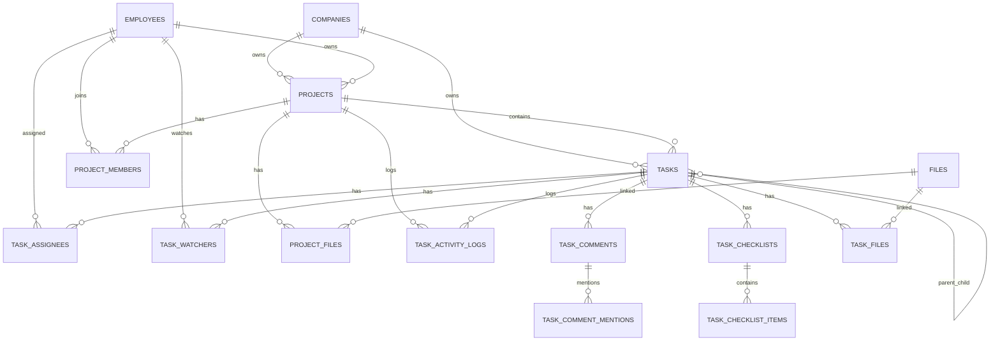

> 🔒 **BẤT BIẾN DB (bổ sung bắt buộc):** Mọi bảng có `company_id` PHẢI bật **RLS + FORCE**; `audit_logs` **append-only** (REVOKE UPDATE/DELETE + trigger); audit/event ghi qua **outbox** trong cùng transaction nghiệp vụ. Bộ docs gốc CHƯA mô tả 3 cơ chế này — DDL mẫu + `withTenant`/`set_config` tại [DECISIONS-02 §2–3](../DECISIONS/DECISIONS-02_Stack_Lock_And_Invariants.md).

# DB-06: TASK DATABASE DESIGN

> **📚 Bộ tài liệu DB — Hệ thống Quản lý Doanh nghiệp**
> [DB-01 Tổng quan](<DB-01 DATABASE DESIGN TỔNG QUAN.md>) · [DB-02 AUTH/RBAC](<DB-02 AUTH RBAC Database Design.md>) · [DB-03 HR](<DB-03_HR Database Design.md>) · [DB-04 ATT](<DB-04_ATT Database Design.md>) · [DB-05 LEAVE](<DB-05 LEAVE Database Design.md>) · **DB-06 TASK** · [DB-07 NOTI/DASH](<DB-07 NOTI DASH Database Design.md>) · [DB-08 Audit/Files/Settings](<DB-08 Audit Files Settings Seeds Database Design.md>) · [DB-09 Index/Hiệu năng](<DB-09 Database Index Query Pattern Performance Design.md>) · [DB-10 Migration/Seed](<DB-10_Migration_Plan_Initial_Seed_Data_Database_Design.md>)
>
> **Nguồn & liên quan:** [PRD-00 §9.5](<../PRD/PRD-00 Enterprise Management System .md>) · SPEC tương ứng: [SPEC-06 TASK](<../SPEC/SPEC-06 TASK.md>) · [SPEC-01 Tổng quan](<../SPEC/SPEC-01 Tổng quan.md>) · [Thiết kế API: API-06 TASK](<../API Design/API-06_TASK_API_Design.md>) · [Chỉ mục tài liệu](<../README.md>)

---

## 1. Thông tin tài liệu

| Trường | Nội dung |
| --- | --- |
| Mã tài liệu | DB-06 |
| Tên tài liệu | TASK Database Design |
| Tên dự án | Hệ thống quản lý doanh nghiệp nội bộ |
| Module | TASK - Công việc & Dự án |
| Phiên bản | v1.0 |
| Trạng thái | Draft |
| Giai đoạn | MVP Version 1.0 |
| Tài liệu nguồn | PRD-00, SPEC-01 -> SPEC-08, DB-01, DB-02, DB-03, DB-04, DB-05 |
| Ngày tạo | 20/06/2026 |
| Ngày cập nhật | 20/06/2026 |

---

## 2. Mục đích tài liệu

Tài liệu này mô tả thiết kế database chi tiết cho module **TASK - Công việc & Dự án** trong hệ thống quản lý doanh nghiệp nội bộ.

Module TASK chịu trách nhiệm lưu trữ, truy vết và xử lý dữ liệu liên quan đến:

1. Quản lý dự án.
2. Quản lý thành viên dự án.
3. Phân vai trò nội bộ trong dự án: Owner, Manager, Member, Viewer.
4. Quản lý task/công việc.
5. Tạo task cá nhân hoặc task thuộc dự án.
6. Giao task cho nhân viên.
7. Quản lý người phụ trách chính và người đồng phụ trách nếu mở rộng.
8. Quản lý người theo dõi task.
9. Theo dõi trạng thái task: Todo, In Progress, In Review, Done, Cancelled.
10. Tính task quá hạn theo deadline.
11. Quản lý priority: Low, Medium, High, Urgent.
12. Quản lý bình luận trong task.
13. Quản lý mention trong comment để gửi thông báo.
14. Quản lý file đính kèm của project và task.
15. Quản lý checklist/checklist item trong task.
16. Ghi activity log cho mọi thay đổi quan trọng.
17. Cung cấp dữ liệu cho Dashboard.
18. Phát event cho Notification.
19. Chừa thiết kế mở rộng cho Gantt chart, Sprint, Time tracking, Automation, AI và tích hợp bên ngoài.

Tài liệu DB-06 là cơ sở để backend triển khai migration, model/entity, repository, project service, task service, permission scope service, notification event producer, dashboard query service, API công việc/dự án và test case database cho module TASK.

---

## 3. Phạm vi thiết kế

### 3.1 Bao gồm trong DB-06

DB-06 bao gồm các bảng chính sau:

| Nhóm | Bảng | Vai trò |
| --- | --- | --- |
| Project | `projects` | Dự án/nhóm công việc/sáng kiến |
| Project member | `project_members` | Thành viên dự án và vai trò trong dự án |
| Project file | `project_files` | File/tài liệu gắn với dự án |
| Task core | `tasks` | Công việc chính |
| Task assignment | `task_assignees` | Người phụ trách task, hỗ trợ nhiều assignee |
| Task watcher | `task_watchers` | Người theo dõi task |
| Comment | `task_comments` | Bình luận trong task |
| Comment mention | `task_comment_mentions` | Người được mention trong comment |
| Checklist | `task_checklists` | Nhóm checklist trong task |
| Checklist item | `task_checklist_items` | Từng item cần hoàn thành |
| Task file | `task_files` | File/tài liệu gắn với task |
| Activity | `task_activity_logs` | Lịch sử hoạt động task/project |
| Optional | `task_tags` | Danh mục tag/nhãn task, có thể triển khai sau MVP |
| Optional | `task_tag_links` | Gắn tag vào task, có thể triển khai sau MVP |

Trong MVP, các bảng bắt buộc là:

```text
projects
project_members
tasks
task_assignees
task_watchers
task_comments
task_checklists
task_checklist_items
task_activity_logs
```

Các bảng nên có ngay nếu hệ thống triển khai file/comment mention trong MVP:

```text
project_files
task_files
task_comment_mentions
```

Các bảng có thể để phase sau:

```text
task_tags
task_tag_links
task_dependencies
task_time_logs
sprints
task_templates
project_templates
```

### 3.2 Bảng dùng lại từ module khác

DB-06 không tạo lại các bảng sau, nhưng phụ thuộc trực tiếp vào chúng:

| Bảng | Module | Cách TASK sử dụng |
| --- | --- | --- |
| `companies` | Foundation | Mỗi project/task thuộc một company/tenant |
| `users` | AUTH | Actor tạo, cập nhật, giao task, comment, upload file, ghi log |
| `roles` / `permissions` / `role_permissions` | AUTH | Kiểm soát permission và data scope |
| `employees` | HR | Chủ thể được giao task, thành viên dự án, reporter, owner |
| `departments` | HR | Gắn project theo phòng ban, lọc task theo phòng ban assignee |
| `positions` | HR | Hiển thị thông tin nhân sự, có thể dùng trong báo cáo |
| `leave_requests` / `leave_request_days` | LEAVE | Cảnh báo khi giao task/deadline trùng kỳ nghỉ đã duyệt |
| `attendance_records` | ATT | Dashboard kết hợp task hôm nay với trạng thái chấm công |
| `remote_work_requests` | ATT | Remote work có thể yêu cầu chọn task/project ở phase sau |
| `notifications` / `notification_events` | NOTI | Gửi thông báo khi assigned/comment/mention/due/overdue |
| `dashboard_widget_cache` | DASH | Dashboard có thể cache tổng số task/dự án, không xử lý nghiệp vụ gốc |
| `audit_logs` | Foundation | Ghi log thao tác quan trọng cấp hệ thống |
| `files` / `file_links` | Foundation | Lưu file đính kèm project/task |
| `sequence_counters` | Foundation | Sinh mã project/task tự động |

### 3.3 Không đi sâu trong DB-06 nhưng cần chừa thiết kế

| Nhóm | Giai đoạn | Ghi chú thiết kế |
| --- | --- | --- |
| Sprint/Scrum | Phase sau | Thêm `sprints`, `sprint_tasks`, backlog, story point |
| Gantt chart | Phase sau | Thêm dependency, baseline, milestone |
| Time tracking | Phase sau | Thêm `task_time_logs`, liên kết ATT nếu cần |
| Task dependency | Phase sau | Thêm `task_dependencies` |
| Template | Phase sau | Thêm `project_templates`, `task_templates` |
| Automation workflow | Phase sau | Thêm rule engine hoặc workflow tables |
| Approval task quan trọng | Phase sau | Thêm `task_approval_requests`, `task_approval_steps` |
| Calendar integration | Phase sau | Thêm external calendar sync metadata |
| Google Drive/Microsoft OneDrive | Phase sau | Dùng `files` + external provider metadata |
| Chat realtime trong dự án | Phase 4 | Tách sang module CHAT, có thể link project_id/task_id |
| AI | Phase 5 | Thêm AI summary/suggestion tables hoặc event logs |
| Báo cáo năng suất | Phase sau | Có thể materialize aggregate/cube theo employee/project/time |
| Client/budget project | Phase sau | Thêm `clients`, `project_budgets`, `project_costs` |

---

## 4. Nguyên tắc thiết kế TASK

### 4.1 PostgreSQL làm database chính

DB-06 tiếp tục dùng PostgreSQL vì module TASK cần:

1. Quan hệ chặt giữa project, member, task, assignee, watcher, comment, file và activity log.
2. Transaction khi tạo project kèm owner, tạo task kèm assignee/checklist/file, đổi trạng thái, đổi assignee.
3. Foreign key để bảo vệ quan hệ với company, employee, user, project, task.
4. Unique constraint để chống trùng mã project/task và chống thêm trùng member/assignee/watcher.
5. Index tốt cho truy vấn danh sách task, việc của tôi, task quá hạn, Kanban, project report.
6. JSONB cho metadata, old/new values trong activity log, snapshot thay đổi.
7. Dễ mở rộng sang Sprint, Gantt, Time tracking, AI và tích hợp bên ngoài.

### 4.2 UUID làm primary key

Tất cả bảng TASK dùng:

```sql
id UUID PRIMARY KEY DEFAULT gen_random_uuid()
```

### 4.3 Multi-tenant bằng `company_id`

Tất cả bảng TASK bắt buộc có `company_id`.

Nguyên tắc:

1. Mỗi project/task thuộc đúng một công ty.
2. Mọi query TASK phải filter theo `company_id` từ auth context.
3. Không tin `company_id` từ request body frontend.
4. Super Admin có scope System mới được truy vấn liên công ty.
5. Các unique/index chính luôn đặt `company_id` ở cột đầu.

### 4.4 Employee là chủ thể nghiệp vụ, User là actor thao tác

TASK cần phân biệt rõ:

| Khái niệm | Ý nghĩa | Cột thường dùng |
| --- | --- | --- |
| Employee | Người trong nghiệp vụ nhân sự, được giao việc/tham gia project | `employee_id`, `owner_employee_id`, `assignee_employee_id` |
| User | Tài khoản đăng nhập, actor thực hiện thao tác | `created_by`, `updated_by`, `assigned_by`, `actor_user_id` |

Nguyên tắc:

1. Project owner, project member, assignee, watcher nên gắn với `employees.id`.
2. Người tạo/cập nhật/comment/upload/log nên gắn với `users.id`.
3. Khi user hiện tại thao tác, backend phải tìm employee liên kết nếu nghiệp vụ cần employee scope.
4. Không giao task cho employee `Resigned` hoặc `Terminated`.
5. Nếu employee chưa có user, vẫn có thể là member/assignee do HR/Manager tạo thay, nhưng họ không tự đăng nhập xử lý task cho đến khi có user.

### 4.5 Project role không thay thế RBAC hệ thống

Module TASK có hai lớp quyền:

| Lớp quyền | Bảng/nguồn | Vai trò |
| --- | --- | --- |
| RBAC hệ thống | `permissions`, `role_permissions` | Xác định user có quyền TASK.PROJECT.CREATE, TASK.TASK.ASSIGN... |
| Role nội bộ project | `project_members.project_role` | Xác định user là Owner/Manager/Member/Viewer trong project cụ thể |

Nguyên tắc:

1. Backend luôn kiểm tra permission hệ thống trước.
2. Nếu task thuộc project, backend kiểm tra thêm project membership/role nếu cần.
3. Project Owner/Manager chỉ có quyền trong phạm vi project đó.
4. Project role không được dùng để vượt qua permission hệ thống ở các API nhạy cảm.
5. Data scope Project được tính từ `project_members`.

### 4.6 Task có thể thuộc project hoặc là task cá nhân

MVP cho phép thiết kế:

```text
tasks.project_id NULL
```

Ý nghĩa:

1. `project_id IS NOT NULL`: task thuộc một project.
2. `project_id IS NULL`: task cá nhân/việc lẻ nếu cấu hình company cho phép.

Nếu công ty muốn bắt buộc mọi task thuộc project, service layer kiểm tra cấu hình, không cần thay đổi database.

### 4.7 Một assignee chính trong MVP, mở rộng nhiều assignee

MVP đề xuất mỗi task có một assignee chính. Tuy nhiên DB vẫn dùng `task_assignees` để mở rộng nhiều người phụ trách.

Khuyến nghị lưu đồng thời:

1. `tasks.main_assignee_employee_id` để query nhanh danh sách task.
2. `task_assignees` để truy vết lịch sử gán, hỗ trợ co-assignee sau này.

Nguyên tắc nhất quán:

```text
tasks.main_assignee_employee_id = employee_id của dòng task_assignees role = Main và removed_at IS NULL
```

### 4.8 Watcher/Follower tách khỏi Assignee

`task_watchers` dùng cho người theo dõi nhưng không trực tiếp xử lý.

Watcher có thể là:

1. Người tạo task.
2. Project owner/manager.
3. Người được mention.
4. Người tự bấm theo dõi.
5. HR/Manager cần giám sát task.

Watcher nhận thông báo khi có cập nhật quan trọng tùy cấu hình.

### 4.9 Overdue là trạng thái dẫn xuất, không lưu cứng vào `tasks.status`

`tasks.status` chỉ nên lưu các trạng thái workflow chính:

```text
Todo
In Progress
In Review
Done
Cancelled
```

`Overdue` được tính bằng điều kiện:

```text
due_at < current_timestamp
AND status NOT IN ('Done', 'Cancelled')
```

Lý do:

1. Tránh job cập nhật trạng thái hàng loạt mỗi ngày/giờ.
2. Tránh phá workflow task.
3. Query overdue có thể tối ưu bằng index `due_at` + `status`.
4. Dashboard và Notification có thể tính riêng hoặc cache summary.

### 4.10 Activity log là ledger nghiệp vụ của TASK

`task_activity_logs` lưu mọi thay đổi quan trọng trong project/task.

Các hành động cần ghi log:

1. PROJECT_CREATED.
2. PROJECT_UPDATED.
3. PROJECT_STATUS_CHANGED.
4. PROJECT_MEMBER_ADDED.
5. PROJECT_MEMBER_REMOVED.
6. PROJECT_MEMBER_ROLE_CHANGED.
7. TASK_CREATED.
8. TASK_UPDATED.
9. TASK_ASSIGNED.
10. TASK_ASSIGNEE_CHANGED.
11. TASK_STATUS_CHANGED.
12. TASK_PRIORITY_CHANGED.
13. TASK_DUE_DATE_CHANGED.
14. TASK_COMMENT_CREATED.
15. TASK_COMMENT_UPDATED.
16. TASK_COMMENT_DELETED.
17. TASK_FILE_UPLOADED.
18. TASK_FILE_DELETED.
19. TASK_CHECKLIST_CREATED.
20. TASK_CHECKLIST_ITEM_DONE.
21. TASK_DELETED.

Activity log phục vụ UI lịch sử hoạt động. `audit_logs` cấp hệ thống vẫn dùng cho thao tác nhạy cảm hoặc quản trị.

### 4.11 File dùng `files` / `file_links`, bảng domain là tùy chọn

Có hai cách triển khai:

| Cách | Mô tả | Khuyến nghị |
| --- | --- | --- |
| Dùng `file_links` chung | `files` lưu metadata, `file_links` gắn với Project/Task | Phù hợp thiết kế dùng chung toàn hệ thống |
| Dùng `project_files` / `task_files` | Bảng domain riêng để query nhanh và lưu metadata nghiệp vụ | Phù hợp nếu task/project cần quản lý file chuyên sâu |

DB-06 định nghĩa cả `project_files` và `task_files`, nhưng có thể triển khai như wrapper/link table tham chiếu `files.id`.

### 4.12 Không xóa cứng dữ liệu TASK quan trọng

Không xóa cứng:

```text
projects
project_members
project_files
tasks
task_assignees
task_watchers
task_comments
task_checklists
task_checklist_items
task_files
task_activity_logs
```

Dùng:

```text
deleted_at
deleted_by
```

Riêng `task_activity_logs` không nên xóa trong nghiệp vụ thường. Nếu cần ẩn log nhạy cảm, dùng quyền xem hoặc mask dữ liệu.

### 4.13 Quyền và data scope

Backend phải kiểm tra permission và data scope trước khi trả dữ liệu.

| Scope | Ý nghĩa trong TASK | Cách xác định gợi ý |
| --- | --- | --- |
| Own | Task do mình tạo, được giao, đang theo dõi hoặc project mình tham gia | `created_by`, `task_assignees`, `task_watchers`, `project_members` |
| Team | Task của nhân viên thuộc team mình quản lý | `employees.direct_manager_id` |
| Department | Task thuộc phòng ban mình quản lý hoặc assignee thuộc phòng ban | `tasks.department_id`, `employees.department_id` |
| Project | Task thuộc dự án user là member | `project_members.employee_id` |
| Company | Tất cả project/task trong công ty | `company_id` |
| System | Tất cả project/task toàn hệ thống | Super Admin only |

### 4.14 Notification payload không chứa dữ liệu quá nhạy cảm

TASK sẽ phát event cho NOTI trong các trường hợp:

1. TASK_ASSIGNED.
2. TASK_UPDATED.
3. TASK_STATUS_CHANGED.
4. TASK_COMMENT_CREATED.
5. TASK_MENTIONED.
6. TASK_DUE_SOON.
7. TASK_OVERDUE.
8. PROJECT_MEMBER_ADDED.
9. PROJECT_MEMBER_REMOVED.
10. PROJECT_CLOSED.
11. PROJECT_CANCELLED.
12. PROJECT_ARCHIVED.

Payload notification chỉ nên chứa:

```json
{
  "project_id": "...",
  "task_id": "...",
  "title": "...",
  "action_url": "/tasks/..."
}
```

Không nên đưa nội dung comment dài, file private URL hoặc dữ liệu nhạy cảm vào notification payload.

### 4.15 Dashboard không copy dữ liệu TASK gốc

DASH chỉ lấy dữ liệu tóm tắt từ TASK hoặc cache summary ngắn hạn.

Các chỉ số TASK thường dùng cho dashboard:

1. Task của tôi hôm nay.
2. Task quá hạn của tôi.
3. Task sắp đến hạn.
4. Task team quá hạn.
5. Dự án đang chạy.
6. Tiến độ dự án.
7. Số task theo status.
8. Số task theo priority.
9. Số task chưa có assignee.

Không nên copy nguyên bảng `tasks` sang dashboard.

---

## 5. ERD cấp module TASK

### 5.1 ERD dạng text

```text
companies
  1 --- n projects
  1 --- n project_members
  1 --- n tasks
  1 --- n task_assignees
  1 --- n task_watchers
  1 --- n task_comments
  1 --- n task_activity_logs

employees
  1 --- n projects                         qua owner_employee_id
  1 --- n project_members
  1 --- n tasks                            qua reporter_employee_id / main_assignee_employee_id
  1 --- n task_assignees
  1 --- n task_watchers
  1 --- n task_checklist_items.done_by_employee_id

users
  1 --- n projects.created_by/updated_by/deleted_by
  1 --- n tasks.created_by/updated_by/deleted_by
  1 --- n task_comments.created_by
  1 --- n task_activity_logs.actor_user_id

projects
  1 --- n project_members
  1 --- n project_files
  1 --- n tasks
  1 --- n task_activity_logs

tasks
  n --- 0..1 projects
  n --- 0..1 tasks                           qua parent_task_id
  1 --- n task_assignees
  1 --- n task_watchers
  1 --- n task_comments
  1 --- n task_checklists
  1 --- n task_checklist_items
  1 --- n task_files
  1 --- n task_activity_logs

task_comments
  1 --- n task_comment_mentions

task_checklists
  1 --- n task_checklist_items

files
  1 --- n project_files
  1 --- n task_files
  1 --- n file_links                         nếu dùng bảng file dùng chung
```

### 5.2 Quan hệ chính

| Quan hệ | Loại | Ghi chú |
| --- | --- | --- |
| `companies.id` -> `projects.company_id` | 1-n | Multi-tenant |
| `employees.id` -> `projects.owner_employee_id` | 1-n | Owner chính của project |
| `departments.id` -> `projects.department_id` | 1-n | Phòng ban liên quan, nullable |
| `projects.id` -> `project_members.project_id` | 1-n | Thành viên dự án |
| `employees.id` -> `project_members.employee_id` | 1-n | Employee tham gia nhiều project |
| `projects.id` -> `tasks.project_id` | 1-n | Project có nhiều task |
| `tasks.id` -> `tasks.parent_task_id` | 1-n self-reference | Task cha/sub-task nếu bật |
| `employees.id` -> `tasks.main_assignee_employee_id` | 1-n | Assignee chính snapshot/query nhanh |
| `tasks.id` -> `task_assignees.task_id` | 1-n | Task có nhiều assignee theo thiết kế mở rộng |
| `tasks.id` -> `task_watchers.task_id` | 1-n | Task có nhiều watcher |
| `tasks.id` -> `task_comments.task_id` | 1-n | Task có nhiều comment |
| `task_comments.id` -> `task_comment_mentions.comment_id` | 1-n | Một comment mention nhiều user/employee |
| `tasks.id` -> `task_checklists.task_id` | 1-n | Task có nhiều checklist group |
| `task_checklists.id` -> `task_checklist_items.checklist_id` | 1-n | Checklist có nhiều item |
| `files.id` -> `task_files.file_id` | 1-n | File gắn task |
| `files.id` -> `project_files.file_id` | 1-n | File gắn project |
| `tasks.id` -> `task_activity_logs.task_id` | 1-n | Activity log theo task |
| `projects.id` -> `task_activity_logs.project_id` | 1-n | Activity log theo project |

### 5.3 Mermaid ERD



---

## 6. Danh sách bảng DB-06

| STT | Bảng | Bắt buộc MVP | Mô tả |
| --- | --- | --- | --- |
| 1 | `projects` | Có | Dự án/nhóm công việc |
| 2 | `project_members` | Có | Thành viên và role trong project |
| 3 | `project_files` | Nên có | File/tài liệu project |
| 4 | `tasks` | Có | Công việc |
| 5 | `task_assignees` | Có | Người phụ trách task |
| 6 | `task_watchers` | Có | Người theo dõi task |
| 7 | `task_comments` | Có | Comment trong task |
| 8 | `task_comment_mentions` | Nên có | Mention trong comment để gửi NOTI |
| 9 | `task_checklists` | Có | Nhóm checklist |
| 10 | `task_checklist_items` | Có | Item checklist |
| 11 | `task_files` | Nên có | File task |
| 12 | `task_activity_logs` | Có | Lịch sử hoạt động task/project |
| 13 | `task_tags` | Phase sau | Danh mục tag |
| 14 | `task_tag_links` | Phase sau | Gắn tag vào task |

---

## 7. Thiết kế chi tiết bảng

### 7.1 Bảng `projects`

#### Mục đích

Lưu thông tin dự án, nhóm công việc hoặc sáng kiến có mục tiêu, thành viên, trạng thái, thời gian và danh sách task liên quan.

#### Cấu trúc cột

| Cột | Kiểu | Bắt buộc | Ghi chú |
| --- | --- | --- | --- |
| `id` | UUID | Có | PK |
| `company_id` | UUID | Có | FK `companies.id` |
| `project_code` | VARCHAR(100) | Có | Mã dự án, unique theo company |
| `name` | VARCHAR(255) | Có | Tên dự án |
| `description` | TEXT | Không | Mô tả |
| `owner_employee_id` | UUID | Có | FK `employees.id`, owner chính |
| `department_id` | UUID | Không | FK `departments.id`, phòng ban liên quan |
| `priority` | VARCHAR(50) | Có | Low/Medium/High/Urgent |
| `status` | VARCHAR(50) | Có | Planning/Active/On Hold/Completed/Cancelled/Archived |
| `visibility` | VARCHAR(50) | Có | Private/Internal/Public |
| `start_date` | DATE | Không | Ngày bắt đầu |
| `end_date` | DATE | Không | Ngày kết thúc dự kiến |
| `completed_at` | TIMESTAMP | Không | Thời điểm hoàn thành |
| `closed_at` | TIMESTAMP | Không | Thời điểm đóng nếu dùng khác completed |
| `closed_by` | UUID | Không | FK `users.id` |
| `archived_at` | TIMESTAMP | Không | Thời điểm lưu trữ |
| `archived_by` | UUID | Không | FK `users.id` |
| `cancelled_at` | TIMESTAMP | Không | Thời điểm hủy |
| `cancelled_by` | UUID | Không | FK `users.id` |
| `cancel_reason` | TEXT | Không | Lý do hủy |
| `progress_percent` | NUMERIC(5,2) | Không | Cache tiến độ nếu cần, có thể tính động |
| `metadata` | JSONB | Không | Dữ liệu mở rộng |
| `created_at` | TIMESTAMP | Có | Thời điểm tạo |
| `created_by` | UUID | Không | FK `users.id` |
| `updated_at` | TIMESTAMP | Có | Thời điểm cập nhật |
| `updated_by` | UUID | Không | FK `users.id` |
| `deleted_at` | TIMESTAMP | Không | Soft delete |
| `deleted_by` | UUID | Không | FK `users.id` |

#### Constraint/index đề xuất

```sql
ALTER TABLE projects
ADD CONSTRAINT chk_projects_priority
CHECK (priority IN ('Low', 'Medium', 'High', 'Urgent'));

ALTER TABLE projects
ADD CONSTRAINT chk_projects_status
CHECK (status IN ('Planning', 'Active', 'On Hold', 'Completed', 'Cancelled', 'Archived'));

ALTER TABLE projects
ADD CONSTRAINT chk_projects_visibility
CHECK (visibility IN ('Private', 'Internal', 'Public'));

ALTER TABLE projects
ADD CONSTRAINT chk_projects_date_range
CHECK (end_date IS NULL OR start_date IS NULL OR end_date >= start_date);

ALTER TABLE projects
ADD CONSTRAINT chk_projects_progress_percent
CHECK (progress_percent IS NULL OR (progress_percent >= 0 AND progress_percent <= 100));

CREATE UNIQUE INDEX uq_projects_company_code_active
ON projects (company_id, project_code)
WHERE deleted_at IS NULL;

CREATE INDEX idx_projects_company_status
ON projects (company_id, status, start_date DESC)
WHERE deleted_at IS NULL;

CREATE INDEX idx_projects_company_owner
ON projects (company_id, owner_employee_id, status)
WHERE deleted_at IS NULL;

CREATE INDEX idx_projects_company_department
ON projects (company_id, department_id, status)
WHERE deleted_at IS NULL;

CREATE INDEX idx_projects_company_visibility
ON projects (company_id, visibility, status)
WHERE deleted_at IS NULL;

CREATE INDEX idx_projects_search_name
ON projects USING gin (to_tsvector('simple', coalesce(project_code, '') || ' ' || coalesce(name, '')))
WHERE deleted_at IS NULL;
```

#### Quy tắc nghiệp vụ

1. `project_code` không được trùng trong cùng company.
2. Project bắt buộc có owner hợp lệ.
3. Owner phải là employee thuộc cùng company và không ở trạng thái `Resigned`/`Terminated`.
4. Khi tạo project thành công, owner phải được thêm vào `project_members` với `project_role = Owner`.
5. Không xóa cứng project trong MVP.
6. Project `Archived` không hiển thị mặc định.
7. Project `Completed` không nên cho tạo task mới, trừ khi reopen hoặc có quyền đặc biệt.
8. Project `Cancelled` không cho cập nhật task, trừ người có quyền đặc biệt.
9. Project `Private` chỉ hiển thị cho project member hoặc người có scope cao hơn.
10. Không cho chuyển `Completed` nếu còn task active chưa Done/Cancelled, trừ khi cấu hình cho phép.
11. Mọi thay đổi quan trọng phải ghi `task_activity_logs`.

---

### 7.2 Bảng `project_members`

#### Mục đích

Lưu thành viên dự án và vai trò của từng employee trong project.

#### Cấu trúc cột

| Cột | Kiểu | Bắt buộc | Ghi chú |
| --- | --- | --- | --- |
| `id` | UUID | Có | PK |
| `company_id` | UUID | Có | FK `companies.id` |
| `project_id` | UUID | Có | FK `projects.id` |
| `employee_id` | UUID | Có | FK `employees.id` |
| `project_role` | VARCHAR(50) | Có | Owner/Manager/Member/Viewer |
| `status` | VARCHAR(50) | Có | Active/Inactive/Removed |
| `joined_at` | TIMESTAMP | Có | Thời điểm tham gia |
| `left_at` | TIMESTAMP | Không | Thời điểm rời khỏi/bị xóa |
| `invited_by` | UUID | Không | FK `users.id`, người thêm thành viên |
| `removed_by` | UUID | Không | FK `users.id`, người xóa thành viên |
| `remove_reason` | TEXT | Không | Lý do xóa nếu có |
| `metadata` | JSONB | Không | Dữ liệu mở rộng |
| `created_at` | TIMESTAMP | Có | Thời điểm tạo |
| `created_by` | UUID | Không | FK `users.id` |
| `updated_at` | TIMESTAMP | Có | Thời điểm cập nhật |
| `updated_by` | UUID | Không | FK `users.id` |
| `deleted_at` | TIMESTAMP | Không | Soft delete |
| `deleted_by` | UUID | Không | FK `users.id` |

#### Constraint/index đề xuất

```sql
ALTER TABLE project_members
ADD CONSTRAINT chk_project_members_role
CHECK (project_role IN ('Owner', 'Manager', 'Member', 'Viewer'));

ALTER TABLE project_members
ADD CONSTRAINT chk_project_members_status
CHECK (status IN ('Active', 'Inactive', 'Removed'));

CREATE UNIQUE INDEX uq_project_members_active_employee
ON project_members (company_id, project_id, employee_id)
WHERE deleted_at IS NULL AND status = 'Active';

CREATE INDEX idx_project_members_project_role
ON project_members (company_id, project_id, project_role, status)
WHERE deleted_at IS NULL;

CREATE INDEX idx_project_members_employee_status
ON project_members (company_id, employee_id, status)
WHERE deleted_at IS NULL;

CREATE INDEX idx_project_members_project_status
ON project_members (company_id, project_id, status)
WHERE deleted_at IS NULL;
```

#### Quy tắc nghiệp vụ

1. Chỉ employee active/probation/official theo cấu hình mới được thêm vào project.
2. Không thêm trùng một employee active vào cùng project.
3. Không xóa owner cuối cùng khỏi project.
4. Nếu member đang có task active trong project, khi remove phải cảnh báo.
5. Member bị removed không còn thấy project private.
6. Thay đổi project role phải ghi activity log.
7. Project role không thay thế permission hệ thống.
8. Nếu employee rời công ty, service nên cảnh báo các project còn member active.

---

### 7.3 Bảng `project_files`

#### Mục đích

Lưu liên kết file/tài liệu ở cấp project. Có thể dùng trực tiếp bảng này hoặc dùng `file_links` với `entity_type = Project`.

#### Cấu trúc cột

| Cột | Kiểu | Bắt buộc | Ghi chú |
| --- | --- | --- | --- |
| `id` | UUID | Có | PK |
| `company_id` | UUID | Có | FK `companies.id` |
| `project_id` | UUID | Có | FK `projects.id` |
| `file_id` | UUID | Có | FK `files.id` |
| `file_type` | VARCHAR(50) | Không | Document/Spec/Design/Other |
| `description` | TEXT | Không | Mô tả file |
| `visibility` | VARCHAR(50) | Có | Project/Internal/Private |
| `uploaded_by` | UUID | Có | FK `users.id` |
| `uploaded_at` | TIMESTAMP | Có | Thời điểm upload |
| `metadata` | JSONB | Không | Dữ liệu mở rộng |
| `created_at` | TIMESTAMP | Có | Thời điểm tạo |
| `created_by` | UUID | Không | FK `users.id` |
| `updated_at` | TIMESTAMP | Có | Thời điểm cập nhật |
| `updated_by` | UUID | Không | FK `users.id` |
| `deleted_at` | TIMESTAMP | Không | Soft delete |
| `deleted_by` | UUID | Không | FK `users.id` |

#### Constraint/index đề xuất

```sql
ALTER TABLE project_files
ADD CONSTRAINT chk_project_files_visibility
CHECK (visibility IN ('Project', 'Internal', 'Private'));

CREATE UNIQUE INDEX uq_project_files_project_file_active
ON project_files (company_id, project_id, file_id)
WHERE deleted_at IS NULL;

CREATE INDEX idx_project_files_project
ON project_files (company_id, project_id, uploaded_at DESC)
WHERE deleted_at IS NULL;

CREATE INDEX idx_project_files_file
ON project_files (file_id)
WHERE deleted_at IS NULL;
```

#### Quy tắc nghiệp vụ

1. File phải thuộc cùng company với project.
2. Chỉ user có quyền xem project và quyền upload file mới được upload.
3. File private phải dùng private storage, không public URL trực tiếp.
4. Xóa file là soft delete ở link; metadata file có thể vẫn giữ trong `files`.
5. Upload/xóa file phải ghi activity log.

---

### 7.4 Bảng `tasks`

#### Mục đích

Lưu thông tin chính của công việc/task.

#### Cấu trúc cột

| Cột | Kiểu | Bắt buộc | Ghi chú |
| --- | --- | --- | --- |
| `id` | UUID | Có | PK |
| `company_id` | UUID | Có | FK `companies.id` |
| `project_id` | UUID | Không | FK `projects.id`; NULL nếu task cá nhân được phép |
| `parent_task_id` | UUID | Không | FK `tasks.id`, sub-task nếu dùng |
| `task_code` | VARCHAR(100) | Có | Mã task, unique theo company |
| `title` | VARCHAR(255) | Có | Tiêu đề task |
| `description` | TEXT | Không | Mô tả |
| `reporter_employee_id` | UUID | Không | Employee báo cáo/tạo nghiệp vụ |
| `creator_user_id` | UUID | Có | FK `users.id`, user tạo task |
| `main_assignee_employee_id` | UUID | Không | FK `employees.id`, assignee chính hiện tại |
| `department_id` | UUID | Không | Snapshot phòng ban assignee hoặc project |
| `priority` | VARCHAR(50) | Có | Low/Medium/High/Urgent |
| `status` | VARCHAR(50) | Có | Todo/In Progress/In Review/Done/Cancelled |
| `start_at` | TIMESTAMP | Không | Thời điểm bắt đầu |
| `due_at` | TIMESTAMP | Không | Deadline thời điểm chính xác |
| `estimated_minutes` | INT | Không | Ước lượng số phút làm |
| `actual_hours` | NUMERIC(10,2) | Không | Tổng giờ thực tế nếu có time tracking sau này |
| `completed_at` | TIMESTAMP | Không | Thời điểm Done |
| `completed_by` | UUID | Không | FK `users.id` |
| `cancelled_at` | TIMESTAMP | Không | Thời điểm hủy |
| `cancelled_by` | UUID | Không | FK `users.id` |
| `cancel_reason` | TEXT | Không | Lý do hủy |
| `is_locked` | BOOLEAN | Có | Khóa chỉnh sửa nếu Done/Project closed |
| `sort_order` | INT | Không | Thứ tự trong board/list nếu cần |
| `metadata` | JSONB | Không | Tags tạm, custom fields, external refs |
| `created_at` | TIMESTAMP | Có | Thời điểm tạo |
| `created_by` | UUID | Không | FK `users.id` |
| `updated_at` | TIMESTAMP | Có | Thời điểm cập nhật |
| `updated_by` | UUID | Không | FK `users.id` |
| `deleted_at` | TIMESTAMP | Không | Soft delete |
| `deleted_by` | UUID | Không | FK `users.id` |

#### Constraint/index đề xuất

```sql
ALTER TABLE tasks
ADD CONSTRAINT chk_tasks_priority
CHECK (priority IN ('Low', 'Medium', 'High', 'Urgent'));

ALTER TABLE tasks
ADD CONSTRAINT chk_tasks_status
CHECK (status IN ('Todo', 'In Progress', 'In Review', 'Done', 'Cancelled'));

ALTER TABLE tasks
ADD CONSTRAINT chk_tasks_estimated_minutes
CHECK (estimated_minutes IS NULL OR estimated_minutes >= 0);

ALTER TABLE tasks
ADD CONSTRAINT chk_tasks_actual_hours
CHECK (actual_hours IS NULL OR actual_hours >= 0);

ALTER TABLE tasks
ADD CONSTRAINT chk_tasks_due_after_start
CHECK (due_at IS NULL OR start_at IS NULL OR due_at >= start_at);

ALTER TABLE tasks
ADD CONSTRAINT chk_tasks_not_self_parent
CHECK (parent_task_id IS NULL OR parent_task_id <> id);

CREATE UNIQUE INDEX uq_tasks_company_code_active
ON tasks (company_id, task_code)
WHERE deleted_at IS NULL;

CREATE INDEX idx_tasks_company_status_due
ON tasks (company_id, status, due_at)
WHERE deleted_at IS NULL;

CREATE INDEX idx_tasks_project_status_sort
ON tasks (company_id, project_id, status, sort_order, due_at)
WHERE deleted_at IS NULL;

CREATE INDEX idx_tasks_assignee_status_due
ON tasks (company_id, main_assignee_employee_id, status, due_at)
WHERE deleted_at IS NULL;

CREATE INDEX idx_tasks_creator_status
ON tasks (company_id, creator_user_id, status, created_at DESC)
WHERE deleted_at IS NULL;

CREATE INDEX idx_tasks_department_status
ON tasks (company_id, department_id, status, due_at)
WHERE deleted_at IS NULL;

CREATE INDEX idx_tasks_overdue_candidate
ON tasks (company_id, due_at, status)
WHERE deleted_at IS NULL AND status NOT IN ('Done', 'Cancelled') AND due_at IS NOT NULL;

CREATE INDEX idx_tasks_search_title
ON tasks USING gin (to_tsvector('simple', coalesce(task_code, '') || ' ' || coalesce(title, '') || ' ' || coalesce(description, '')))
WHERE deleted_at IS NULL;
```

#### Quy tắc nghiệp vụ

1. Task bắt buộc có `title`.
2. `task_code` không được trùng trong cùng company.
3. Task có thể thuộc project hoặc là task cá nhân nếu cấu hình cho phép.
4. Nếu task thuộc project, project phải tồn tại, cùng company và chưa bị xóa mềm.
5. Nếu project ở trạng thái `Completed`/`Cancelled`/`Archived`, không cho tạo task mới trừ quyền đặc biệt.
6. Assignee phải là employee hợp lệ, không `Resigned`/`Terminated`.
7. Nếu project bắt buộc member, assignee phải là member active của project.
8. `due_at` không được nhỏ hơn `start_at` nếu có start time.
9. Khi chuyển Done, phải set `completed_at` và `completed_by`.
10. Khi chuyển từ Done sang trạng thái khác nếu cho reopen, có thể clear hoặc giữ `completed_at` theo policy; khuyến nghị giữ lịch sử trong activity log.
11. Task Cancelled không tính vào tiến độ hoàn thành.
12. Task quá hạn là trạng thái dẫn xuất, không lưu cứng vào `status`.
13. Xóa task là soft delete.
14. Mọi thay đổi quan trọng phải ghi `task_activity_logs`.
15. Nếu checklist bắt buộc hoàn thành trước Done, service phải kiểm tra `task_checklist_items` trước khi update status.

---

### 7.5 Bảng `task_assignees`

#### Mục đích

Lưu người phụ trách task. MVP dùng một assignee chính, nhưng bảng này hỗ trợ nhiều assignee và lịch sử gán.

#### Cấu trúc cột

| Cột | Kiểu | Bắt buộc | Ghi chú |
| --- | --- | --- | --- |
| `id` | UUID | Có | PK |
| `company_id` | UUID | Có | FK `companies.id` |
| `task_id` | UUID | Có | FK `tasks.id` |
| `employee_id` | UUID | Có | FK `employees.id` |
| `assignee_role` | VARCHAR(50) | Có | Main/CoAssignee/Reviewer |
| `status` | VARCHAR(50) | Có | Active/Removed |
| `assigned_by` | UUID | Có | FK `users.id` |
| `assigned_at` | TIMESTAMP | Có | Thời điểm gán |
| `removed_by` | UUID | Không | FK `users.id` |
| `removed_at` | TIMESTAMP | Không | Thời điểm gỡ |
| `remove_reason` | TEXT | Không | Lý do gỡ |
| `metadata` | JSONB | Không | Dữ liệu mở rộng |
| `created_at` | TIMESTAMP | Có | Thời điểm tạo |
| `created_by` | UUID | Không | FK `users.id` |
| `updated_at` | TIMESTAMP | Có | Thời điểm cập nhật |
| `updated_by` | UUID | Không | FK `users.id` |
| `deleted_at` | TIMESTAMP | Không | Soft delete |
| `deleted_by` | UUID | Không | FK `users.id` |

#### Constraint/index đề xuất

```sql
ALTER TABLE task_assignees
ADD CONSTRAINT chk_task_assignees_role
CHECK (assignee_role IN ('Main', 'CoAssignee', 'Reviewer'));

ALTER TABLE task_assignees
ADD CONSTRAINT chk_task_assignees_status
CHECK (status IN ('Active', 'Removed'));

CREATE UNIQUE INDEX uq_task_assignees_active_employee
ON task_assignees (company_id, task_id, employee_id)
WHERE deleted_at IS NULL AND status = 'Active';

CREATE UNIQUE INDEX uq_task_assignees_one_main_active
ON task_assignees (company_id, task_id)
WHERE deleted_at IS NULL AND status = 'Active' AND assignee_role = 'Main';

CREATE INDEX idx_task_assignees_employee_status
ON task_assignees (company_id, employee_id, status, assigned_at DESC)
WHERE deleted_at IS NULL;

CREATE INDEX idx_task_assignees_task_status
ON task_assignees (company_id, task_id, status)
WHERE deleted_at IS NULL;
```

#### Quy tắc nghiệp vụ

1. Trong MVP, mỗi task chỉ có một assignee chính active.
2. Khi đổi assignee chính, phải remove dòng Main cũ và tạo dòng Main mới hoặc update có log đầy đủ.
3. Cập nhật `tasks.main_assignee_employee_id` trong cùng transaction.
4. Người giao task phải có permission `TASK.TASK.ASSIGN`.
5. Nếu task thuộc project, assignee nên là project member; nếu không, cần cảnh báo hoặc chặn theo cấu hình.
6. Assignee cũ và mới đều nhận notification khi đổi assignee.
7. Đổi assignee phải ghi activity log.

---

### 7.6 Bảng `task_watchers`

#### Mục đích

Lưu người theo dõi task để nhận thông báo khi task có thay đổi quan trọng.

#### Cấu trúc cột

| Cột | Kiểu | Bắt buộc | Ghi chú |
| --- | --- | --- | --- |
| `id` | UUID | Có | PK |
| `company_id` | UUID | Có | FK `companies.id` |
| `task_id` | UUID | Có | FK `tasks.id` |
| `employee_id` | UUID | Có | FK `employees.id` |
| `watcher_type` | VARCHAR(50) | Có | Manual/Creator/ProjectManager/Mention/System |
| `status` | VARCHAR(50) | Có | Active/Muted/Removed |
| `added_by` | UUID | Không | FK `users.id` |
| `added_at` | TIMESTAMP | Có | Thời điểm thêm |
| `removed_by` | UUID | Không | FK `users.id` |
| `removed_at` | TIMESTAMP | Không | Thời điểm gỡ |
| `metadata` | JSONB | Không | Dữ liệu mở rộng |
| `created_at` | TIMESTAMP | Có | Thời điểm tạo |
| `created_by` | UUID | Không | FK `users.id` |
| `updated_at` | TIMESTAMP | Có | Thời điểm cập nhật |
| `updated_by` | UUID | Không | FK `users.id` |
| `deleted_at` | TIMESTAMP | Không | Soft delete |
| `deleted_by` | UUID | Không | FK `users.id` |

#### Constraint/index đề xuất

```sql
ALTER TABLE task_watchers
ADD CONSTRAINT chk_task_watchers_type
CHECK (watcher_type IN ('Manual', 'Creator', 'ProjectManager', 'Mention', 'System'));

ALTER TABLE task_watchers
ADD CONSTRAINT chk_task_watchers_status
CHECK (status IN ('Active', 'Muted', 'Removed'));

CREATE UNIQUE INDEX uq_task_watchers_active_employee
ON task_watchers (company_id, task_id, employee_id)
WHERE deleted_at IS NULL AND status IN ('Active', 'Muted');

CREATE INDEX idx_task_watchers_employee_status
ON task_watchers (company_id, employee_id, status)
WHERE deleted_at IS NULL;

CREATE INDEX idx_task_watchers_task_status
ON task_watchers (company_id, task_id, status)
WHERE deleted_at IS NULL;
```

#### Quy tắc nghiệp vụ

1. Người xem được task mới có thể tự watch task.
2. Creator có thể được tự động thêm làm watcher.
3. Assignee không nhất thiết phải là watcher, vì notification assignee có thể tính từ `task_assignees`.
4. Người bị mention có thể tự động thêm watcher nếu cấu hình.
5. `Muted` nghĩa là vẫn theo dõi nhưng không nhận một số notification.
6. Remove watcher là soft remove, không xóa cứng.

---

### 7.7 Bảng `task_comments`

#### Mục đích

Lưu bình luận trao đổi trong task.

#### Cấu trúc cột

| Cột | Kiểu | Bắt buộc | Ghi chú |
| --- | --- | --- | --- |
| `id` | UUID | Có | PK |
| `company_id` | UUID | Có | FK `companies.id` |
| `task_id` | UUID | Có | FK `tasks.id` |
| `parent_comment_id` | UUID | Không | FK `task_comments.id`, reply nếu cần |
| `content` | TEXT | Có | Nội dung comment |
| `content_format` | VARCHAR(50) | Có | PlainText/Markdown/RichText |
| `created_by` | UUID | Có | FK `users.id` |
| `created_by_employee_id` | UUID | Không | FK `employees.id`, snapshot actor employee |
| `edited_at` | TIMESTAMP | Không | Thời điểm sửa |
| `edited_by` | UUID | Không | FK `users.id` |
| `deleted_reason` | TEXT | Không | Lý do xóa nếu cần |
| `metadata` | JSONB | Không | Mention raw, client info, attachments refs nếu cần |
| `created_at` | TIMESTAMP | Có | Thời điểm tạo |
| `updated_at` | TIMESTAMP | Có | Thời điểm cập nhật |
| `updated_by` | UUID | Không | FK `users.id` |
| `deleted_at` | TIMESTAMP | Không | Soft delete |
| `deleted_by` | UUID | Không | FK `users.id` |

#### Constraint/index đề xuất

```sql
ALTER TABLE task_comments
ADD CONSTRAINT chk_task_comments_content_format
CHECK (content_format IN ('PlainText', 'Markdown', 'RichText'));

ALTER TABLE task_comments
ADD CONSTRAINT chk_task_comments_content_not_empty
CHECK (length(trim(content)) > 0);

CREATE INDEX idx_task_comments_task_created
ON task_comments (company_id, task_id, created_at ASC)
WHERE deleted_at IS NULL;

CREATE INDEX idx_task_comments_created_by
ON task_comments (company_id, created_by, created_at DESC)
WHERE deleted_at IS NULL;

CREATE INDEX idx_task_comments_parent
ON task_comments (company_id, parent_comment_id)
WHERE deleted_at IS NULL;
```

#### Quy tắc nghiệp vụ

1. Chỉ người xem được task mới comment được.
2. Comment không được rỗng.
3. Comment đã xóa là soft delete.
4. Người tạo comment có thể sửa/xóa comment của chính mình nếu cấu hình cho phép.
5. Người có quyền quản lý task có thể xóa comment của người khác nếu được cấp quyền.
6. Comment mới gửi notification cho assignee/watcher/người được mention tùy cấu hình.
7. Nội dung comment nên được sanitize để tránh XSS nếu hỗ trợ RichText/Markdown.

---

### 7.8 Bảng `task_comment_mentions`

#### Mục đích

Lưu người được mention trong comment để gửi notification và kiểm soát quyền xem.

#### Cấu trúc cột

| Cột | Kiểu | Bắt buộc | Ghi chú |
| --- | --- | --- | --- |
| `id` | UUID | Có | PK |
| `company_id` | UUID | Có | FK `companies.id` |
| `comment_id` | UUID | Có | FK `task_comments.id` |
| `task_id` | UUID | Có | FK `tasks.id`, denormalize để query nhanh |
| `mentioned_employee_id` | UUID | Có | FK `employees.id` |
| `mentioned_user_id` | UUID | Không | FK `users.id`, nếu employee có user |
| `mention_text` | VARCHAR(255) | Không | Text mention gốc |
| `can_view_task_at_mention_time` | BOOLEAN | Có | Kết quả kiểm tra quyền tại thời điểm mention |
| `notification_id` | UUID | Không | FK `notifications.id` nếu muốn trace |
| `created_at` | TIMESTAMP | Có | Thời điểm tạo |
| `created_by` | UUID | Không | FK `users.id` |
| `deleted_at` | TIMESTAMP | Không | Soft delete |
| `deleted_by` | UUID | Không | FK `users.id` |

#### Constraint/index đề xuất

```sql
CREATE UNIQUE INDEX uq_task_comment_mentions_employee
ON task_comment_mentions (company_id, comment_id, mentioned_employee_id)
WHERE deleted_at IS NULL;

CREATE INDEX idx_task_comment_mentions_task_employee
ON task_comment_mentions (company_id, task_id, mentioned_employee_id)
WHERE deleted_at IS NULL;

CREATE INDEX idx_task_comment_mentions_user
ON task_comment_mentions (company_id, mentioned_user_id, created_at DESC)
WHERE deleted_at IS NULL;
```

#### Quy tắc nghiệp vụ

1. Khi comment có mention, backend parse mention và tạo dòng tương ứng.
2. Nếu người được mention không có quyền xem task, hệ thống phải cảnh báo hoặc không gửi notification tùy cấu hình.
3. Nếu mention hợp lệ, NOTI gửi event `TASK_MENTIONED`.
4. Không để mention tự động cấp quyền xem task nếu company không bật rule này.

---

### 7.9 Bảng `task_checklists`

#### Mục đích

Lưu nhóm checklist trong task. MVP có thể tạo một checklist mặc định cho mỗi task, nhưng thiết kế này hỗ trợ nhiều nhóm checklist.

#### Cấu trúc cột

| Cột | Kiểu | Bắt buộc | Ghi chú |
| --- | --- | --- | --- |
| `id` | UUID | Có | PK |
| `company_id` | UUID | Có | FK `companies.id` |
| `task_id` | UUID | Có | FK `tasks.id` |
| `title` | VARCHAR(255) | Có | Tên checklist group |
| `description` | TEXT | Không | Mô tả |
| `order_index` | INT | Có | Thứ tự hiển thị |
| `is_required_for_done` | BOOLEAN | Có | Có bắt buộc hoàn thành trước Done không |
| `metadata` | JSONB | Không | Dữ liệu mở rộng |
| `created_at` | TIMESTAMP | Có | Thời điểm tạo |
| `created_by` | UUID | Không | FK `users.id` |
| `updated_at` | TIMESTAMP | Có | Thời điểm cập nhật |
| `updated_by` | UUID | Không | FK `users.id` |
| `deleted_at` | TIMESTAMP | Không | Soft delete |
| `deleted_by` | UUID | Không | FK `users.id` |

#### Constraint/index đề xuất

```sql
ALTER TABLE task_checklists
ADD CONSTRAINT chk_task_checklists_title_not_empty
CHECK (length(trim(title)) > 0);

CREATE INDEX idx_task_checklists_task_order
ON task_checklists (company_id, task_id, order_index)
WHERE deleted_at IS NULL;
```

#### Quy tắc nghiệp vụ

1. Checklist phải thuộc một task.
2. Người có quyền cập nhật task được thêm/sửa/xóa checklist.
3. Xóa checklist là soft delete.
4. Nếu `is_required_for_done = true`, tất cả item trong checklist này phải done trước khi task Done.

---

### 7.10 Bảng `task_checklist_items`

#### Mục đích

Lưu từng item nhỏ cần hoàn thành trong checklist.

#### Cấu trúc cột

| Cột | Kiểu | Bắt buộc | Ghi chú |
| --- | --- | --- | --- |
| `id` | UUID | Có | PK |
| `company_id` | UUID | Có | FK `companies.id` |
| `task_id` | UUID | Có | FK `tasks.id`, denormalize để query nhanh |
| `checklist_id` | UUID | Có | FK `task_checklists.id` |
| `title` | VARCHAR(500) | Có | Nội dung item |
| `description` | TEXT | Không | Mô tả thêm |
| `is_done` | BOOLEAN | Có | Mặc định false |
| `done_by` | UUID | Không | FK `users.id` |
| `done_by_employee_id` | UUID | Không | FK `employees.id` |
| `done_at` | TIMESTAMP | Không | Thời điểm hoàn thành |
| `order_index` | INT | Có | Thứ tự hiển thị |
| `metadata` | JSONB | Không | Dữ liệu mở rộng |
| `created_at` | TIMESTAMP | Có | Thời điểm tạo |
| `created_by` | UUID | Không | FK `users.id` |
| `updated_at` | TIMESTAMP | Có | Thời điểm cập nhật |
| `updated_by` | UUID | Không | FK `users.id` |
| `deleted_at` | TIMESTAMP | Không | Soft delete |
| `deleted_by` | UUID | Không | FK `users.id` |

#### Constraint/index đề xuất

```sql
ALTER TABLE task_checklist_items
ADD CONSTRAINT chk_task_checklist_items_title_not_empty
CHECK (length(trim(title)) > 0);

ALTER TABLE task_checklist_items
ADD CONSTRAINT chk_task_checklist_items_done_consistency
CHECK (
  (is_done = false AND done_at IS NULL)
  OR
  (is_done = true AND done_at IS NOT NULL)
);

CREATE INDEX idx_task_checklist_items_task
ON task_checklist_items (company_id, task_id, is_done)
WHERE deleted_at IS NULL;

CREATE INDEX idx_task_checklist_items_checklist_order
ON task_checklist_items (company_id, checklist_id, order_index)
WHERE deleted_at IS NULL;
```

#### Quy tắc nghiệp vụ

1. Checklist item không được rỗng.
2. Assignee có thể tick hoàn thành checklist nếu cấu hình cho phép.
3. Khi tick done, set `is_done = true`, `done_by`, `done_by_employee_id`, `done_at` trong cùng transaction.
4. Khi untick, clear `done_by`, `done_by_employee_id`, `done_at`.
5. Nếu cấu hình bắt buộc checklist hoàn thành trước Done, service kiểm tra còn item `is_done = false` trước khi cho chuyển task Done.
6. Thay đổi item quan trọng nên ghi activity log.

---

### 7.11 Bảng `task_files`

#### Mục đích

Lưu file đính kèm task. Có thể dùng trực tiếp bảng này hoặc dùng `file_links` với `entity_type = Task`.

#### Cấu trúc cột

| Cột | Kiểu | Bắt buộc | Ghi chú |
| --- | --- | --- | --- |
| `id` | UUID | Có | PK |
| `company_id` | UUID | Có | FK `companies.id` |
| `task_id` | UUID | Có | FK `tasks.id` |
| `file_id` | UUID | Có | FK `files.id` |
| `comment_id` | UUID | Không | FK `task_comments.id`, nếu file upload trong comment |
| `file_type` | VARCHAR(50) | Không | Attachment/Evidence/Document/Other |
| `description` | TEXT | Không | Mô tả file |
| `visibility` | VARCHAR(50) | Có | Task/Internal/Private |
| `uploaded_by` | UUID | Có | FK `users.id` |
| `uploaded_at` | TIMESTAMP | Có | Thời điểm upload |
| `metadata` | JSONB | Không | Dữ liệu mở rộng |
| `created_at` | TIMESTAMP | Có | Thời điểm tạo |
| `created_by` | UUID | Không | FK `users.id` |
| `updated_at` | TIMESTAMP | Có | Thời điểm cập nhật |
| `updated_by` | UUID | Không | FK `users.id` |
| `deleted_at` | TIMESTAMP | Không | Soft delete |
| `deleted_by` | UUID | Không | FK `users.id` |

#### Constraint/index đề xuất

```sql
ALTER TABLE task_files
ADD CONSTRAINT chk_task_files_visibility
CHECK (visibility IN ('Task', 'Internal', 'Private'));

CREATE UNIQUE INDEX uq_task_files_task_file_active
ON task_files (company_id, task_id, file_id)
WHERE deleted_at IS NULL;

CREATE INDEX idx_task_files_task
ON task_files (company_id, task_id, uploaded_at DESC)
WHERE deleted_at IS NULL;

CREATE INDEX idx_task_files_comment
ON task_files (company_id, comment_id)
WHERE deleted_at IS NULL;

CREATE INDEX idx_task_files_file
ON task_files (file_id)
WHERE deleted_at IS NULL;
```

#### Quy tắc nghiệp vụ

1. Chỉ người có quyền upload mới upload được.
2. File phải gắn với `task_id`.
3. File upload cần giới hạn định dạng và dung lượng ở service layer.
4. File nhạy cảm cần private storage và permission riêng nếu có.
5. Xóa file là soft delete.
6. Upload/xóa file phải ghi activity log.

---

### 7.12 Bảng `task_activity_logs`

#### Mục đích

Lưu lịch sử hoạt động của project/task để truy vết thay đổi trong UI và hỗ trợ kiểm tra trách nhiệm.

#### Cấu trúc cột

| Cột | Kiểu | Bắt buộc | Ghi chú |
| --- | --- | --- | --- |
| `id` | UUID | Có | PK |
| `company_id` | UUID | Có | FK `companies.id` |
| `project_id` | UUID | Không | FK `projects.id` |
| `task_id` | UUID | Không | FK `tasks.id` |
| `actor_user_id` | UUID | Có | FK `users.id`, user thực hiện |
| `actor_employee_id` | UUID | Không | FK `employees.id`, nếu có |
| `action` | VARCHAR(100) | Có | TASK_CREATED, STATUS_CHANGED... |
| `target_type` | VARCHAR(50) | Có | Project/Task/Member/Comment/File/Checklist |
| `target_id` | UUID | Không | ID đối tượng bị tác động |
| `old_values` | JSONB | Không | Dữ liệu trước |
| `new_values` | JSONB | Không | Dữ liệu sau |
| `message` | TEXT | Không | Message hiển thị nếu cần |
| `ip_address` | VARCHAR(45) | Không | IPv4/IPv6 |
| `user_agent` | TEXT | Không | User agent |
| `request_id` | VARCHAR(100) | Không | Trace request |
| `metadata` | JSONB | Không | Dữ liệu mở rộng |
| `created_at` | TIMESTAMP | Có | Thời điểm log |

#### Constraint/index đề xuất

```sql
ALTER TABLE task_activity_logs
ADD CONSTRAINT chk_task_activity_target_type
CHECK (target_type IN ('Project', 'Task', 'Member', 'Comment', 'File', 'Checklist', 'ChecklistItem', 'Watcher', 'Assignee'));

CREATE INDEX idx_task_activity_project_created
ON task_activity_logs (company_id, project_id, created_at DESC)
WHERE project_id IS NOT NULL;

CREATE INDEX idx_task_activity_task_created
ON task_activity_logs (company_id, task_id, created_at DESC)
WHERE task_id IS NOT NULL;

CREATE INDEX idx_task_activity_actor_created
ON task_activity_logs (company_id, actor_user_id, created_at DESC);

CREATE INDEX idx_task_activity_action_created
ON task_activity_logs (company_id, action, created_at DESC);

CREATE INDEX idx_task_activity_target
ON task_activity_logs (company_id, target_type, target_id, created_at DESC);
```

#### Quy tắc nghiệp vụ

1. Activity log không nên bị xóa trong nghiệp vụ thường.
2. Mọi thay đổi quan trọng của project/task phải tạo log.
3. `old_values`/`new_values` chỉ lưu field cần thiết, tránh lưu dữ liệu nhạy cảm quá mức.
4. UI có thể dùng `message` để hiển thị nhanh, nhưng dữ liệu chuẩn vẫn là action + old/new values.
5. Nếu action liên quan bảo mật/xuất dữ liệu, đồng thời ghi thêm `audit_logs` cấp hệ thống.

---

### 7.13 Bảng `task_tags` - phase sau

#### Mục đích

Lưu danh mục tag/nhãn task theo company.

#### Cấu trúc cột đề xuất

| Cột | Kiểu | Bắt buộc | Ghi chú |
| --- | --- | --- | --- |
| `id` | UUID | Có | PK |
| `company_id` | UUID | Có | FK `companies.id` |
| `tag_code` | VARCHAR(100) | Có | Mã tag |
| `name` | VARCHAR(100) | Có | Tên tag |
| `color` | VARCHAR(50) | Không | Mã màu UI nếu cần |
| `status` | VARCHAR(50) | Có | Active/Inactive |
| `created_at` | TIMESTAMP | Có | Thời điểm tạo |
| `created_by` | UUID | Không | FK `users.id` |
| `updated_at` | TIMESTAMP | Có | Thời điểm cập nhật |
| `updated_by` | UUID | Không | FK `users.id` |
| `deleted_at` | TIMESTAMP | Không | Soft delete |
| `deleted_by` | UUID | Không | FK `users.id` |

#### Constraint/index đề xuất

```sql
CREATE UNIQUE INDEX uq_task_tags_company_code_active
ON task_tags (company_id, tag_code)
WHERE deleted_at IS NULL;

CREATE UNIQUE INDEX uq_task_tags_company_name_active
ON task_tags (company_id, lower(name))
WHERE deleted_at IS NULL;
```

---

### 7.14 Bảng `task_tag_links` - phase sau

#### Mục đích

Gắn tag vào task.

#### Cấu trúc cột đề xuất

| Cột | Kiểu | Bắt buộc | Ghi chú |
| --- | --- | --- | --- |
| `id` | UUID | Có | PK |
| `company_id` | UUID | Có | FK `companies.id` |
| `task_id` | UUID | Có | FK `tasks.id` |
| `tag_id` | UUID | Có | FK `task_tags.id` |
| `created_at` | TIMESTAMP | Có | Thời điểm tạo |
| `created_by` | UUID | Không | FK `users.id` |
| `deleted_at` | TIMESTAMP | Không | Soft delete |
| `deleted_by` | UUID | Không | FK `users.id` |

#### Constraint/index đề xuất

```sql
CREATE UNIQUE INDEX uq_task_tag_links_active
ON task_tag_links (company_id, task_id, tag_id)
WHERE deleted_at IS NULL;

CREATE INDEX idx_task_tag_links_tag
ON task_tag_links (company_id, tag_id)
WHERE deleted_at IS NULL;
```

---

## 8. Enum/status chuẩn trong TASK

### 8.1 Project priority

```text
Low
Medium
High
Urgent
```

### 8.2 Project status

```text
Planning
Active
On Hold
Completed
Cancelled
Archived
```

### 8.3 Project visibility

```text
Private      Chỉ member và người có quyền cao hơn xem được
Internal     User trong công ty có quyền TASK.PROJECT.VIEW có thể xem metadata cơ bản
Public       Public trong phạm vi công ty, không public internet
```

### 8.4 Project role

```text
Owner
Manager
Member
Viewer
```

### 8.5 Task priority

```text
Low
Medium
High
Urgent
```

### 8.6 Task status lưu trong DB

```text
Todo
In Progress
In Review
Done
Cancelled
```

Không lưu `Overdue` trong `tasks.status`. Overdue là trạng thái dẫn xuất.

### 8.7 Assignee role

> **Drift reconciliation 22/06 (theo SPEC-DRIFT-MATRIX §5 — TK-7):** enum nội bộ `assignee_role` PHẢI khớp CHECK constraint ở §7.5 (`task_assignees`): đủ **3 giá trị** `Main` / `CoAssignee` / `Reviewer`. Không được bỏ sót `Reviewer`.

```text
Main
CoAssignee
Reviewer
```

### 8.8 Watcher type

```text
Manual
Creator
ProjectManager
Mention
System
```

### 8.9 Activity action đề xuất

```text
PROJECT_CREATED
PROJECT_UPDATED
PROJECT_STATUS_CHANGED
PROJECT_CLOSED
PROJECT_ARCHIVED
PROJECT_CANCELLED
PROJECT_DELETED
PROJECT_MEMBER_ADDED
PROJECT_MEMBER_REMOVED
PROJECT_MEMBER_ROLE_CHANGED
PROJECT_FILE_UPLOADED
PROJECT_FILE_DELETED
TASK_CREATED
TASK_UPDATED
TASK_DELETED
TASK_ASSIGNED
TASK_ASSIGNEE_CHANGED
TASK_STATUS_CHANGED
TASK_PRIORITY_CHANGED
TASK_DUE_DATE_CHANGED
TASK_WATCHER_ADDED
TASK_WATCHER_REMOVED
TASK_COMMENT_CREATED
TASK_COMMENT_UPDATED
TASK_COMMENT_DELETED
TASK_MENTIONED
TASK_FILE_UPLOADED
TASK_FILE_DELETED
TASK_CHECKLIST_CREATED
TASK_CHECKLIST_UPDATED
TASK_CHECKLIST_DELETED
TASK_CHECKLIST_ITEM_CREATED
TASK_CHECKLIST_ITEM_UPDATED
TASK_CHECKLIST_ITEM_DONE
TASK_CHECKLIST_ITEM_REOPENED
TASK_CHECKLIST_ITEM_DELETED
```

---

## 9. Index tổng hợp theo use case

### 9.1 Danh sách project

Use case:

1. Lọc theo status.
2. Lọc theo owner.
3. Lọc theo phòng ban.
4. Tìm theo code/name.
5. Chỉ hiện project member nếu private.

Index chính:

```sql
idx_projects_company_status
idx_projects_company_owner
idx_projects_company_department
idx_projects_search_name
idx_project_members_employee_status
```

### 9.2 Danh sách task

Use case:

1. Lọc theo status.
2. Lọc theo project.
3. Lọc theo assignee.
4. Lọc theo priority.
5. Lọc theo due date.
6. Tìm theo code/title/description.

Index chính:

```sql
idx_tasks_company_status_due
idx_tasks_project_status_sort
idx_tasks_assignee_status_due
idx_tasks_department_status
idx_tasks_search_title
```

### 9.3 Việc của tôi

Query thường lấy task liên quan user hiện tại:

1. Task tôi được giao.
2. Task tôi tạo.
3. Task tôi theo dõi.
4. Task trong project tôi tham gia.

Index chính:

```sql
idx_tasks_assignee_status_due
idx_tasks_creator_status
idx_task_assignees_employee_status
idx_task_watchers_employee_status
idx_project_members_employee_status
```

### 9.4 Task quá hạn/sắp đến hạn

Điều kiện:

```sql
due_at < now()
AND status NOT IN ('Done', 'Cancelled')
AND deleted_at IS NULL
```

Index chính:

```sql
idx_tasks_overdue_candidate
```

### 9.5 Kanban board

Query:

```text
company_id + project_id + status + sort_order
```

Index chính:

```sql
idx_tasks_project_status_sort
```

### 9.6 Activity log

Index chính:

```sql
idx_task_activity_project_created
idx_task_activity_task_created
idx_task_activity_actor_created
idx_task_activity_action_created
```

---

## 10. Luồng transaction nghiệp vụ chính

### 10.1 Transaction tạo project

```text
1. Backend lấy user từ token/session.
2. Kiểm tra permission TASK.PROJECT.CREATE.
3. Xác định company_id từ auth context.
4. Nếu project_code không truyền, sinh mã từ sequence_counters.
5. Validate project_code unique trong company.
6. Validate name không rỗng.
7. Validate owner_employee_id hợp lệ, cùng company, chưa nghỉ việc.
8. Validate start_date/end_date.
9. Insert projects.
10. Insert project_members với owner role = Owner.
11. Insert task_activity_logs action = PROJECT_CREATED.
12. Ghi audit_logs nếu cấu hình yêu cầu.
13. Commit transaction.
14. Phát event PROJECT_CREATED hoặc PROJECT_MEMBER_ADDED nếu cần NOTI.
```

### 10.2 Transaction thêm member vào project

```text
1. Kiểm tra permission TASK.PROJECT.MANAGE_MEMBER.
2. Kiểm tra user có quyền với project theo RBAC + project role.
3. Lock project row nếu cần.
4. Validate project chưa Cancelled/Archived.
5. Validate employee hợp lệ, cùng company, chưa nghỉ việc.
6. Kiểm tra chưa là active member của project.
7. Insert project_members.
8. Insert task_activity_logs action = PROJECT_MEMBER_ADDED.
9. Commit transaction.
10. Phát event PROJECT_MEMBER_ADDED cho NOTI.
```

### 10.3 Transaction xóa member khỏi project

```text
1. Kiểm tra permission TASK.PROJECT.MANAGE_MEMBER.
2. Kiểm tra user có quyền với project.
3. Lock project_members target row.
4. Nếu target là Owner, kiểm tra còn ít nhất một Owner active khác.
5. Kiểm tra member có task active trong project.
6. Nếu có task active, chặn hoặc cảnh báo theo cấu hình.
7. Update project_members status = Removed, left_at, removed_by.
8. Insert task_activity_logs action = PROJECT_MEMBER_REMOVED.
9. Commit transaction.
10. Phát event PROJECT_MEMBER_REMOVED cho NOTI.
```

### 10.4 Transaction tạo task

```text
1. Backend lấy user từ token/session.
2. Kiểm tra permission TASK.TASK.CREATE.
3. Xác định employee actor nếu có.
4. Xác định company_id từ auth context.
5. Validate title không rỗng.
6. Nếu project_id có giá trị:
   - Validate project tồn tại, cùng company, chưa deleted.
   - Validate project status cho phép tạo task.
   - Kiểm tra user có quyền trong project nếu project private hoặc cần role.
7. Nếu project_id NULL:
   - Kiểm tra company có cho tạo task cá nhân không.
8. Validate assignee_employee_id nếu có:
   - Employee cùng company.
   - Employee chưa Resigned/Terminated.
   - Nếu project bắt buộc member, assignee phải là project member active.
9. Validate priority/status/due_at/start_at/estimated_minutes.
10. Nếu task_code không truyền, sinh mã từ sequence_counters.
11. Insert tasks.
12. Nếu có assignee, insert task_assignees role = Main và cập nhật tasks.main_assignee_employee_id.
13. Auto insert watcher cho creator/project owner nếu cấu hình.
14. Insert checklist/checklist items nếu request có checklist.
15. Link file nếu request upload file.
16. Insert task_activity_logs action = TASK_CREATED.
17. Commit transaction.
18. Phát event TASK_ASSIGNED nếu có assignee.
```

### 10.5 Transaction đổi assignee

```text
1. Kiểm tra permission TASK.TASK.ASSIGN.
2. Lock task row.
3. Validate task chưa Cancelled/deleted.
4. Validate project status nếu task thuộc project.
5. Validate assignee mới hợp lệ.
6. Nếu project bắt buộc member, validate assignee mới là member active.
7. Update task_assignees Main cũ status = Removed, removed_at, removed_by.
8. Insert task_assignees Main mới.
9. Update tasks.main_assignee_employee_id.
10. Insert task_activity_logs action = TASK_ASSIGNEE_CHANGED.
11. Commit transaction.
12. Phát notification cho assignee cũ và mới.
```

### 10.6 Transaction cập nhật trạng thái task

```text
1. Kiểm tra permission TASK.TASK.UPDATE_STATUS.
2. Lock task row.
3. Validate user có quyền theo RBAC + scope + project role/assignee.
4. Validate trạng thái hiện tại không bị khóa.
5. Validate workflow transition hợp lệ.
6. Nếu chuyển Done:
   - Kiểm tra checklist required đã hoàn thành.
   - Set completed_at, completed_by.
7. Nếu chuyển Cancelled:
   - Set cancelled_at, cancelled_by, cancel_reason nếu có.
8. Update tasks.status.
9. Insert task_activity_logs action = TASK_STATUS_CHANGED.
10. Commit transaction.
11. Phát event TASK_STATUS_CHANGED cho NOTI.
12. DASH đọc dữ liệu mới hoặc invalidate cache nếu có.
```

### 10.7 Transaction comment task

```text
1. Kiểm tra permission TASK.TASK.COMMENT.
2. Kiểm tra user xem được task.
3. Validate content không rỗng.
4. Insert task_comments.
5. Parse mentions.
6. Với từng mention:
   - Validate employee/user tồn tại cùng company.
   - Kiểm tra người được mention có quyền xem task.
   - Insert task_comment_mentions.
7. Insert task_activity_logs action = TASK_COMMENT_CREATED.
8. Commit transaction.
9. Phát event TASK_COMMENT_CREATED và TASK_MENTIONED cho NOTI.
```

### 10.8 Transaction tick checklist item

```text
1. Kiểm tra permission TASK.TASK.UPDATE hoặc TASK.TASK.UPDATE_STATUS theo cấu hình.
2. Kiểm tra user xem/cập nhật được task.
3. Lock checklist item row.
4. Update is_done, done_by, done_by_employee_id, done_at.
5. Insert task_activity_logs action = TASK_CHECKLIST_ITEM_DONE hoặc TASK_CHECKLIST_ITEM_REOPENED.
6. Commit transaction.
```

### 10.9 Transaction upload file task

```text
1. Kiểm tra permission TASK.TASK.FILE_UPLOAD.
2. Kiểm tra user xem/cập nhật được task.
3. Validate file size/mime/extension theo cấu hình.
4. Upload file vào private storage.
5. Insert files.
6. Insert task_files hoặc file_links.
7. Insert task_activity_logs action = TASK_FILE_UPLOADED.
8. Commit transaction.
9. Phát event nếu cấu hình cần thông báo.
```

### 10.10 Job kiểm tra task sắp đến hạn/quá hạn

```text
1. Job chạy theo lịch, ví dụ mỗi 30-60 phút hoặc hằng ngày tùy cấu hình.
2. Tìm task status NOT IN Done/Cancelled, due_at trong khoảng cảnh báo.
3. Tạo event TASK_DUE_SOON nếu chưa gửi trong kỳ hiện tại.
4. Tìm task due_at < now() và status NOT IN Done/Cancelled.
5. Tạo event TASK_OVERDUE nếu chưa gửi hoặc gửi nhắc lại theo policy.
6. NOTI xử lý gửi thông báo cho assignee/creator/project manager.
7. DASH có thể cache số lượng task overdue.
```

Lưu ý: job không cần update `tasks.status = Overdue` vì Overdue là trạng thái dẫn xuất.

---

## 11. Query pattern đề xuất

### 11.1 Query danh sách task theo scope Own

```sql
SELECT DISTINCT t.*
FROM tasks t
LEFT JOIN task_assignees ta
  ON ta.task_id = t.id
  AND ta.company_id = t.company_id
  AND ta.status = 'Active'
  AND ta.deleted_at IS NULL
LEFT JOIN task_watchers tw
  ON tw.task_id = t.id
  AND tw.company_id = t.company_id
  AND tw.status IN ('Active', 'Muted')
  AND tw.deleted_at IS NULL
LEFT JOIN project_members pm
  ON pm.project_id = t.project_id
  AND pm.company_id = t.company_id
  AND pm.status = 'Active'
  AND pm.deleted_at IS NULL
WHERE t.company_id = :company_id
  AND t.deleted_at IS NULL
  AND (
    t.creator_user_id = :user_id
    OR ta.employee_id = :employee_id
    OR tw.employee_id = :employee_id
    OR pm.employee_id = :employee_id
  )
ORDER BY t.due_at ASC NULLS LAST, t.created_at DESC
LIMIT :limit OFFSET :offset;
```

### 11.2 Query task quá hạn của employee

```sql
SELECT t.*
FROM tasks t
WHERE t.company_id = :company_id
  AND t.main_assignee_employee_id = :employee_id
  AND t.deleted_at IS NULL
  AND t.status NOT IN ('Done', 'Cancelled')
  AND t.due_at IS NOT NULL
  AND t.due_at < now()
ORDER BY t.due_at ASC;
```

### 11.3 Query Kanban theo project

```sql
SELECT t.*
FROM tasks t
WHERE t.company_id = :company_id
  AND t.project_id = :project_id
  AND t.deleted_at IS NULL
ORDER BY
  CASE t.status
    WHEN 'Todo' THEN 1
    WHEN 'In Progress' THEN 2
    WHEN 'In Review' THEN 3
    WHEN 'Done' THEN 4
    WHEN 'Cancelled' THEN 5
    ELSE 99
  END,
  t.sort_order ASC NULLS LAST,
  t.due_at ASC NULLS LAST,
  t.created_at DESC;
```

### 11.4 Query report tiến độ project

```sql
SELECT
  t.project_id,
  COUNT(*) FILTER (WHERE t.deleted_at IS NULL) AS total_tasks,
  COUNT(*) FILTER (WHERE t.status = 'Done' AND t.deleted_at IS NULL) AS done_tasks,
  COUNT(*) FILTER (WHERE t.status = 'Cancelled' AND t.deleted_at IS NULL) AS cancelled_tasks,
  COUNT(*) FILTER (
    WHERE t.status NOT IN ('Done', 'Cancelled')
      AND t.due_at IS NOT NULL
      AND t.due_at < now()
      AND t.deleted_at IS NULL
  ) AS overdue_tasks,
  CASE
    WHEN COUNT(*) FILTER (WHERE t.status <> 'Cancelled' AND t.deleted_at IS NULL) = 0 THEN 0
    ELSE ROUND(
      COUNT(*) FILTER (WHERE t.status = 'Done' AND t.deleted_at IS NULL)::numeric
      * 100
      / COUNT(*) FILTER (WHERE t.status <> 'Cancelled' AND t.deleted_at IS NULL),
      2
    )
  END AS progress_percent
FROM tasks t
WHERE t.company_id = :company_id
  AND t.project_id = :project_id
GROUP BY t.project_id;
```

---

## 12. Liên kết với AUTH/RBAC

### 12.1 Permission seed đề xuất

```text
TASK.PROJECT.VIEW
TASK.PROJECT.CREATE
TASK.PROJECT.UPDATE
TASK.PROJECT.DELETE
TASK.PROJECT.CLOSE
TASK.PROJECT.ARCHIVE
TASK.PROJECT.MANAGE_MEMBER
TASK.PROJECT.VIEW_REPORT
TASK.TASK.VIEW
TASK.TASK.CREATE
TASK.TASK.UPDATE
TASK.TASK.DELETE
TASK.TASK.ASSIGN
TASK.TASK.UPDATE_STATUS
TASK.TASK.UPDATE_PRIORITY
TASK.TASK.UPDATE_DEADLINE
TASK.TASK.COMMENT
TASK.TASK.FILE_UPLOAD
TASK.TASK.FILE_DELETE
TASK.TASK.WATCH
TASK.TASK.VIEW_KANBAN
TASK.TASK.EXPORT
TASK.AUDIT_LOG.VIEW
```

### 12.2 Data scope seed đề xuất theo role

| Role | Permission nhóm TASK | Scope đề xuất |
| --- | --- | --- |
| Super Admin | Tất cả TASK.* | System |
| Admin công ty | Theo phân quyền cấu hình | Company |
| HR | View/Create/Update task nghiệp vụ HR nếu được cấp | Company hoặc Department |
| Manager | Project/Task view/create/assign/update status | Team hoặc Project |
| Project Manager | View/update/manage member trong project phụ trách | Project |
| Employee | View own task, update status task được giao, comment nếu xem được | Own |

### 12.3 Kiểm tra quyền khi xem task

Một user xem được task nếu thỏa ít nhất một điều kiện sau:

1. Có permission `TASK.TASK.VIEW` với scope Company/System.
2. Có scope Team và assignee/reporter thuộc team.
3. Có scope Department và task/assignee thuộc phòng ban được phép.
4. Là assignee active của task.
5. Là watcher active của task.
6. Là creator của task.
7. Là project member active của project chứa task.
8. Project visibility cho phép và user có quyền view tương ứng.

---

## 13. Liên kết với HR

TASK phụ thuộc HR để:

1. Validate employee khi thêm project member.
2. Validate employee khi giao task.
3. Lấy department/position/job level để hiển thị và lọc.
4. Xác định direct manager để áp dụng Team scope.
5. Chặn giao task cho employee `Resigned` hoặc `Terminated`.
6. Cảnh báo khi employee rời công ty nhưng vẫn còn task active.

Khuyến nghị snapshot vào `tasks.department_id`:

1. Nếu task có assignee chính, dùng department của assignee tại thời điểm assign.
2. Nếu task chưa có assignee nhưng thuộc project, có thể dùng `projects.department_id`.
3. Khi assignee đổi phòng ban sau này, task lịch sử không bị thay đổi ngoài ý muốn.
4. Nếu muốn báo cáo theo phòng ban hiện tại, join sang `employees.department_id` thay vì dùng snapshot.

---

## 14. Liên kết với LEAVE và ATT

### 14.1 Liên kết với LEAVE

Khi tạo/giao task hoặc đổi deadline:

1. Nếu assignee có leave approved trong khoảng thời gian task/deadline, hệ thống có thể cảnh báo.
2. Nếu deadline nằm trong kỳ nghỉ đã duyệt, hệ thống cảnh báo người giao task.
3. MVP chỉ cảnh báo, chưa bắt buộc chặn giao việc.
4. Phase sau có thể tự gợi ý đổi assignee hoặc điều chỉnh deadline.

### 14.2 Liên kết với ATT

MVP chưa tính công theo task, nhưng cần chừa thiết kế:

1. Remote work có thể yêu cầu chọn task/project đang làm.
2. Dashboard có thể hiển thị task hôm nay cùng trạng thái chấm công.
3. Phase sau có thể thêm `task_time_logs` và đối soát với `attendance_records`.
4. Không nên lưu dữ liệu chấm công vào bảng TASK trong MVP.

---

## 15. Liên kết với NOTI

### 15.1 Event TASK gửi sang NOTI

| Event | Khi nào phát sinh | Người nhận gợi ý |
| --- | --- | --- |
| `TASK_ASSIGNED` | Task được giao cho employee | Assignee mới |
| `TASK_ASSIGNEE_CHANGED` | Đổi assignee | Assignee cũ, assignee mới, watcher |
| `TASK_UPDATED` | Task được cập nhật quan trọng | Assignee, watcher, project manager |
| `TASK_STATUS_CHANGED` | Đổi trạng thái task | Creator, assignee, watcher |
| `TASK_PRIORITY_CHANGED` | Đổi priority | Assignee, watcher |
| `TASK_DUE_DATE_CHANGED` | Đổi deadline | Assignee, watcher |
| `TASK_COMMENT_CREATED` | Có comment mới | Assignee, watcher, creator tùy cấu hình |
| `TASK_MENTIONED` | User/employee được mention | Người được mention |
| `TASK_DUE_SOON` | Task sắp đến hạn | Assignee, creator nếu cấu hình |
| `TASK_OVERDUE` | Task quá hạn | Assignee, project manager nếu cấu hình |
| `PROJECT_MEMBER_ADDED` | Thêm member vào project | Member được thêm |
| `PROJECT_MEMBER_REMOVED` | Xóa member khỏi project | Member bị xóa |
| `PROJECT_CLOSED` | Project đóng/completed | Project members |
| `PROJECT_CANCELLED` | Project bị hủy | Project members |
| `PROJECT_ARCHIVED` | Project bị lưu trữ | Project members nếu cần |

### 15.2 Idempotency notification

Để tránh gửi trùng:

1. Event producer nên có `event_key` ổn định, ví dụ `TASK_OVERDUE:{task_id}:{yyyy-mm-dd}`.
2. NOTI hoặc job có thể lưu log đã gửi.
3. Với comment/mention, event key có thể dùng `comment_id` + `mentioned_employee_id`.
4. Với assignment, event key có thể dùng `task_assignee_id`.

---

## 16. Liên kết với DASH

Dashboard đọc TASK để hiển thị:

1. Task của tôi hôm nay.
2. Task quá hạn của tôi.
3. Task sắp đến hạn.
4. Task đang làm.
5. Task chờ review.
6. Task team quá hạn.
7. Dự án đang chạy.
8. Tiến độ dự án.
9. Số lượng task theo trạng thái.
10. Việc cần ưu tiên.

Dữ liệu DASH nên lấy qua query/service của TASK hoặc cache ngắn hạn trong `dashboard_widget_cache`. DASH không được tự sửa `tasks` hoặc `projects`.

---

## 17. Migration đề xuất

### 17.1 Thứ tự migration DB-06

```text
008_01_create_projects
008_02_create_project_members
008_03_create_project_files
008_04_create_tasks
008_05_create_task_assignees
008_06_create_task_watchers
008_07_create_task_comments
008_08_create_task_comment_mentions
008_09_create_task_checklists
008_10_create_task_checklist_items
008_11_create_task_files
008_12_create_task_activity_logs
008_13_create_task_tags_optional
008_14_create_task_tag_links_optional
008_15_seed_task_permissions
008_16_seed_task_notification_events
```

### 17.2 Lưu ý migration

1. Cần tạo `projects` trước `tasks` vì task có FK project.
2. Cần tạo `tasks` trước các bảng phụ: assignees, watchers, comments, checklists, files, logs.
3. Nếu dùng FK self-reference `tasks.parent_task_id`, tạo constraint sau khi tạo bảng.
4. Nếu dùng `project_files`/`task_files`, bảng `files` phải tồn tại từ Foundation.
5. Nếu `notifications` chưa có ở thời điểm migration TASK, `task_comment_mentions.notification_id` có thể chưa tạo FK hoặc để nullable không FK, bổ sung sau.
6. Seed permission TASK nên chạy sau khi bảng `permissions` đã tồn tại.
7. Seed notification events nên chạy sau khi NOTI core đã tồn tại; nếu DB-06 chạy trước NOTI, tách seed sang DB-07.

---

## 18. Seed data đề xuất

### 18.1 Seed module

```text
TASK - Công việc & Dự án
```

### 18.2 Seed permission

Dùng danh sách permission ở mục 12.1.

### 18.3 Seed role permission MVP gợi ý

#### Super Admin

```text
TASK.* với scope System
```

#### Admin công ty

```text
TASK.PROJECT.VIEW scope Company
TASK.PROJECT.CREATE scope Company
TASK.PROJECT.UPDATE scope Company
TASK.PROJECT.DELETE scope Company
TASK.PROJECT.CLOSE scope Company
TASK.PROJECT.ARCHIVE scope Company
TASK.PROJECT.MANAGE_MEMBER scope Company
TASK.PROJECT.VIEW_REPORT scope Company
TASK.TASK.VIEW scope Company
TASK.TASK.CREATE scope Company
TASK.TASK.UPDATE scope Company
TASK.TASK.DELETE scope Company
TASK.TASK.ASSIGN scope Company
TASK.TASK.UPDATE_STATUS scope Company
TASK.TASK.UPDATE_PRIORITY scope Company
TASK.TASK.UPDATE_DEADLINE scope Company
TASK.TASK.COMMENT scope Company
TASK.TASK.FILE_UPLOAD scope Company
TASK.TASK.FILE_DELETE scope Company
TASK.TASK.WATCH scope Company
TASK.TASK.VIEW_KANBAN scope Company
TASK.TASK.EXPORT scope Company
TASK.AUDIT_LOG.VIEW scope Company
```

#### Manager

```text
TASK.PROJECT.VIEW scope Team/Project
TASK.PROJECT.CREATE scope Team
TASK.PROJECT.UPDATE scope Team/Project
TASK.PROJECT.MANAGE_MEMBER scope Project
TASK.PROJECT.VIEW_REPORT scope Team/Project
TASK.TASK.VIEW scope Team/Project
TASK.TASK.CREATE scope Team/Project
TASK.TASK.UPDATE scope Team/Project
TASK.TASK.ASSIGN scope Team/Project
TASK.TASK.UPDATE_STATUS scope Team/Project
TASK.TASK.UPDATE_PRIORITY scope Team/Project
TASK.TASK.UPDATE_DEADLINE scope Team/Project
TASK.TASK.COMMENT scope Team/Project
TASK.TASK.FILE_UPLOAD scope Team/Project
TASK.TASK.WATCH scope Team/Project
TASK.TASK.VIEW_KANBAN scope Project
TASK.AUDIT_LOG.VIEW scope Team/Project
```

#### Project Manager

```text
TASK.PROJECT.VIEW scope Project
TASK.PROJECT.UPDATE scope Project
TASK.PROJECT.MANAGE_MEMBER scope Project
TASK.PROJECT.VIEW_REPORT scope Project
TASK.TASK.VIEW scope Project
TASK.TASK.CREATE scope Project
TASK.TASK.UPDATE scope Project
TASK.TASK.ASSIGN scope Project
TASK.TASK.UPDATE_STATUS scope Project
TASK.TASK.COMMENT scope Project
TASK.TASK.FILE_UPLOAD scope Project
TASK.TASK.WATCH scope Project
TASK.TASK.VIEW_KANBAN scope Project
TASK.AUDIT_LOG.VIEW scope Project
```

#### Employee

```text
TASK.PROJECT.VIEW scope Project
TASK.TASK.VIEW scope Own/Project
TASK.TASK.CREATE scope Own nếu công ty cho phép task cá nhân
TASK.TASK.UPDATE scope Own giới hạn field
TASK.TASK.UPDATE_STATUS scope Own
TASK.TASK.COMMENT scope Own/Project
TASK.TASK.FILE_UPLOAD scope Own/Project nếu cấu hình cho phép
TASK.TASK.WATCH scope Own/Project
TASK.TASK.VIEW_KANBAN scope Project nếu là member
```

---

## 19. Chính sách dữ liệu và bảo mật

### 19.1 Dữ liệu nhạy cảm trong TASK

Dữ liệu TASK thường ít nhạy cảm hơn HR/ATT/LEAVE, nhưng vẫn có thể chứa thông tin nội bộ quan trọng:

1. Nội dung task chiến lược.
2. File đính kèm tài liệu nội bộ.
3. Comment có thông tin khách hàng, nhân sự, tài chính.
4. Project private.
5. Activity log truy vết hành vi người dùng.

### 19.2 Nguyên tắc bảo mật

1. Backend luôn kiểm tra permission.
2. Không trả task private cho người không phải member nếu không có scope cao hơn.
3. Không public URL file private.
4. Comment/file nhạy cảm cần kiểm soát quyền xem.
5. Export task cần permission `TASK.TASK.EXPORT`.
6. Activity log cần permission `TASK.AUDIT_LOG.VIEW`.
7. Notification payload không chứa nội dung comment/file nhạy cảm quá mức.
8. Search full-text phải filter permission trước hoặc filter kết quả theo scope.

---

## 20. Gợi ý API liên quan database

| API | Bảng chính | Bảng phụ |
| --- | --- | --- |
| `GET /api/projects` | `projects` | `project_members`, `tasks` aggregate |
| `POST /api/projects` | `projects` | `project_members`, `task_activity_logs` |
| `PUT /api/projects/{id}` | `projects` | `task_activity_logs` |
| `DELETE /api/projects/{id}` | `projects` | `task_activity_logs` |
| `POST /api/projects/{id}/members` | `project_members` | `task_activity_logs`, NOTI event |
| `GET /api/tasks` | `tasks` | `task_assignees`, `task_watchers`, `projects` |
| `GET /api/tasks/my` | `tasks` | `task_assignees`, `task_watchers`, `project_members` |
| `POST /api/tasks` | `tasks` | `task_assignees`, `task_watchers`, `task_checklists`, `task_files`, `task_activity_logs` |
| `PUT /api/tasks/{id}` | `tasks` | `task_activity_logs` |
| `PUT /api/tasks/{id}/assignee` | `task_assignees`, `tasks` | `task_activity_logs`, NOTI event |
| `PUT /api/tasks/{id}/status` | `tasks` | `task_checklist_items`, `task_activity_logs`, NOTI event |
| `POST /api/tasks/{id}/comments` | `task_comments` | `task_comment_mentions`, `task_activity_logs`, NOTI event |
| `POST /api/tasks/{id}/files` | `files`, `task_files` | `task_activity_logs` |
| `POST /api/tasks/{id}/checklists` | `task_checklists` | `task_activity_logs` |
| `PUT /api/tasks/{id}/checklists/{item_id}` | `task_checklist_items` | `task_activity_logs` |
| `GET /api/tasks/{id}/activity-logs` | `task_activity_logs` | `users`, `employees` display |

---

## 21. Test case database quan trọng

### 21.1 Project

| Mã | Test case | Kỳ vọng |
| --- | --- | --- |
| DB06-PROJ-001 | Tạo project hợp lệ | Insert `projects`, `project_members Owner`, `task_activity_logs` |
| DB06-PROJ-002 | Tạo trùng project_code trong company | Bị chặn bởi unique index/service |
| DB06-PROJ-003 | Tạo cùng project_code khác company | Cho phép |
| DB06-PROJ-004 | Owner không hợp lệ/nghỉ việc | Bị chặn |
| DB06-PROJ-005 | end_date < start_date | Bị chặn |
| DB06-PROJ-006 | Xóa project | Chỉ set `deleted_at`, không xóa task |
| DB06-PROJ-007 | Xóa owner cuối cùng | Bị chặn |

### 21.2 Task

| Mã | Test case | Kỳ vọng |
| --- | --- | --- |
| DB06-TASK-001 | Tạo task hợp lệ | Insert `tasks`, `task_assignees`, `task_activity_logs` |
| DB06-TASK-002 | Thiếu title | Bị chặn |
| DB06-TASK-003 | Task thuộc project không active | Bị chặn hoặc cảnh báo theo rule |
| DB06-TASK-004 | Assignee không hợp lệ | Bị chặn |
| DB06-TASK-005 | Assignee không thuộc project bắt buộc member | Bị chặn |
| DB06-TASK-006 | due_at trước start_at | Bị chặn |
| DB06-TASK-007 | Chuyển Done khi checklist required chưa xong | Bị chặn |
| DB06-TASK-008 | Chuyển Done hợp lệ | Set `status = Done`, `completed_at`, `completed_by` |
| DB06-TASK-009 | Task quá hạn | Query overdue trả về nhưng `tasks.status` không đổi thành Overdue |
| DB06-TASK-010 | Xóa task | Soft delete và ghi activity log |

### 21.3 Comment/file/checklist

| Mã | Test case | Kỳ vọng |
| --- | --- | --- |
| DB06-CMT-001 | Comment rỗng | Bị chặn |
| DB06-CMT-002 | Comment có mention hợp lệ | Insert comment + mention + event NOTI |
| DB06-CMT-003 | Mention người không có quyền xem task | Cảnh báo/chặn theo cấu hình |
| DB06-FILE-001 | Upload file hợp lệ | Insert files + task_files/project_files + activity log |
| DB06-FILE-002 | Xóa file | Soft delete link file |
| DB06-CHK-001 | Tick checklist item | Update done fields + activity log |
| DB06-CHK-002 | Untick checklist item | Clear done fields + activity log |

---

## 22. Gợi ý DDL tổng hợp tối thiểu

> Phần này chỉ là skeleton tham khảo để backend viết migration chuẩn. DDL thực tế cần bổ sung tên constraint/FK theo convention của dự án.

```sql
CREATE TABLE projects (
  id UUID PRIMARY KEY DEFAULT gen_random_uuid(),
  company_id UUID NOT NULL,
  project_code VARCHAR(100) NOT NULL,
  name VARCHAR(255) NOT NULL,
  description TEXT,
  owner_employee_id UUID NOT NULL,
  department_id UUID,
  priority VARCHAR(50) NOT NULL DEFAULT 'Medium',
  status VARCHAR(50) NOT NULL DEFAULT 'Planning',
  visibility VARCHAR(50) NOT NULL DEFAULT 'Private',
  start_date DATE,
  end_date DATE,
  completed_at TIMESTAMP,
  closed_at TIMESTAMP,
  closed_by UUID,
  archived_at TIMESTAMP,
  archived_by UUID,
  cancelled_at TIMESTAMP,
  cancelled_by UUID,
  cancel_reason TEXT,
  progress_percent NUMERIC(5,2),
  metadata JSONB,
  created_at TIMESTAMP NOT NULL DEFAULT now(),
  created_by UUID,
  updated_at TIMESTAMP NOT NULL DEFAULT now(),
  updated_by UUID,
  deleted_at TIMESTAMP,
  deleted_by UUID
);

CREATE TABLE project_members (
  id UUID PRIMARY KEY DEFAULT gen_random_uuid(),
  company_id UUID NOT NULL,
  project_id UUID NOT NULL,
  employee_id UUID NOT NULL,
  project_role VARCHAR(50) NOT NULL,
  status VARCHAR(50) NOT NULL DEFAULT 'Active',
  joined_at TIMESTAMP NOT NULL DEFAULT now(),
  left_at TIMESTAMP,
  invited_by UUID,
  removed_by UUID,
  remove_reason TEXT,
  metadata JSONB,
  created_at TIMESTAMP NOT NULL DEFAULT now(),
  created_by UUID,
  updated_at TIMESTAMP NOT NULL DEFAULT now(),
  updated_by UUID,
  deleted_at TIMESTAMP,
  deleted_by UUID
);

CREATE TABLE tasks (
  id UUID PRIMARY KEY DEFAULT gen_random_uuid(),
  company_id UUID NOT NULL,
  project_id UUID,
  parent_task_id UUID,
  task_code VARCHAR(100) NOT NULL,
  title VARCHAR(255) NOT NULL,
  description TEXT,
  reporter_employee_id UUID,
  creator_user_id UUID NOT NULL,
  main_assignee_employee_id UUID,
  department_id UUID,
  priority VARCHAR(50) NOT NULL DEFAULT 'Medium',
  status VARCHAR(50) NOT NULL DEFAULT 'Todo',
  start_at TIMESTAMP,
  due_at TIMESTAMP,
  estimated_minutes INT,
  actual_hours NUMERIC(10,2),
  completed_at TIMESTAMP,
  completed_by UUID,
  cancelled_at TIMESTAMP,
  cancelled_by UUID,
  cancel_reason TEXT,
  is_locked BOOLEAN NOT NULL DEFAULT false,
  sort_order INT,
  metadata JSONB,
  created_at TIMESTAMP NOT NULL DEFAULT now(),
  created_by UUID,
  updated_at TIMESTAMP NOT NULL DEFAULT now(),
  updated_by UUID,
  deleted_at TIMESTAMP,
  deleted_by UUID
);

CREATE TABLE task_activity_logs (
  id UUID PRIMARY KEY DEFAULT gen_random_uuid(),
  company_id UUID NOT NULL,
  project_id UUID,
  task_id UUID,
  actor_user_id UUID NOT NULL,
  actor_employee_id UUID,
  action VARCHAR(100) NOT NULL,
  target_type VARCHAR(50) NOT NULL,
  target_id UUID,
  old_values JSONB,
  new_values JSONB,
  message TEXT,
  ip_address VARCHAR(45),
  user_agent TEXT,
  request_id VARCHAR(100),
  metadata JSONB,
  created_at TIMESTAMP NOT NULL DEFAULT now()
);
```

---

## 23. Kết luận

DB-06 thiết kế module TASK theo hướng:

1. `projects` là thực thể quản lý dự án/nhóm công việc.
2. `project_members` quản lý thành viên và project role.
3. `tasks` là trung tâm nghiệp vụ công việc.
4. `task_assignees` hỗ trợ một assignee chính trong MVP và nhiều assignee ở phase sau.
5. `task_watchers` hỗ trợ notification và danh sách task liên quan.
6. `task_comments` và `task_comment_mentions` hỗ trợ trao đổi trong task và mention.
7. `task_checklists` + `task_checklist_items` hỗ trợ chia nhỏ công việc.
8. `project_files` + `task_files` liên kết với file storage dùng chung.
9. `task_activity_logs` là ledger nghiệp vụ để truy vết mọi thay đổi quan trọng.
10. Overdue là trạng thái dẫn xuất, không lưu cứng trong `tasks.status`.
11. Backend luôn kiểm tra AUTH/RBAC, data scope và project role.
12. Thiết kế đủ mở để phát triển Sprint, Gantt, Time tracking, Automation và AI ở các phase sau.

Tài liệu tiếp theo nên triển khai:

```text
DB-07: NOTI & DASH Database Design
```

DB-07 sẽ đi sâu vào notification_events, notification_templates, notifications, notification_delivery_logs, dashboard_widgets, dashboard_widget_configs và dashboard_widget_cache.
