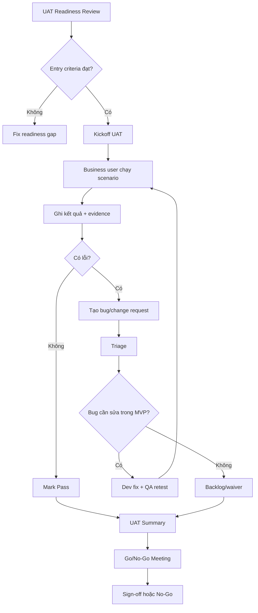

# QA-09: UAT PLAN & BUSINESS ACCEPTANCE
# KẾ HOẠCH USER ACCEPTANCE TESTING & NGHIỆM THU NGHIỆP VỤ

---

## 1. Thông tin tài liệu

| Trường | Nội dung |
| --- | --- |
| Mã tài liệu | QA-09 |
| Tên tài liệu | UAT Plan & Business Acceptance |
| Tên dự án | Hệ thống quản lý doanh nghiệp nội bộ |
| Tên sản phẩm | Enterprise Management System |
| Giai đoạn | QA / Release Readiness - MVP Version 1.0 |
| Trạng thái | Draft |
| Ngày tạo | 20/06/2026 |
| Ngày cập nhật | 20/06/2026 |
| Tài liệu nguồn | PRD-00, SPEC-01 -> SPEC-08, DB-01 -> DB-10, API-01 -> API-08, UI-01 -> UI-10, FRONTEND-01 -> FRONTEND-14, BACKEND-01 -> BACKEND-14, QA-01 -> QA-08 |
| Người viết |  |
| Người duyệt |  |

---

## 2. Mục đích tài liệu

Tài liệu QA-09 định nghĩa kế hoạch **User Acceptance Testing (UAT)** và **Business Acceptance** cho hệ thống quản lý doanh nghiệp nội bộ ở giai đoạn MVP Version 1.0.

QA-09 dùng để:

1. Xác định mục tiêu, phạm vi và cách tổ chức UAT.
2. Xác định nhóm người dùng nghiệp vụ tham gia nghiệm thu.
3. Chuẩn hóa điều kiện bắt đầu UAT, điều kiện kết thúc UAT và tiêu chí ký nghiệm thu.
4. Chuyển các yêu cầu nghiệp vụ trong PRD/SPEC/UI/API thành kịch bản nghiệm thu thực tế.
5. Kiểm tra hệ thống dưới góc nhìn người dùng cuối thay vì chỉ dưới góc nhìn kỹ thuật.
6. Đảm bảo các flow chính như đăng nhập, mở app, chấm công, xin nghỉ, duyệt nghỉ, quản lý nhân sự, giao việc, thông báo và dashboard vận hành đúng mong đợi.
7. Xác định tiêu chí Go / No-Go trước khi release MVP.
8. Chuẩn hóa mẫu biên bản UAT, bug log, change request và sign-off.

UAT không thay thế Unit Test, Integration Test, API Test, E2E Test, Security Test, Performance Test hoặc Regression Test. UAT là bước xác nhận cuối cùng rằng hệ thống đáp ứng nhu cầu nghiệp vụ thực tế và đủ điều kiện bàn giao cho người dùng doanh nghiệp.

---

## 3. Vị trí của QA-09 trong chuỗi QA

```text
QA-01: QA Strategy & Test Plan
QA-02: Test Case Matrix theo module
QA-03: End-to-End Flow Testing
QA-04: API Testing & Contract Testing
QA-05: Permission, Role & Data Scope Testing
QA-06: Security Testing
QA-07: Performance & Load Testing
QA-08: Bug Tracking, Regression & Release Criteria
QA-09: UAT Plan & Business Acceptance
```

QA-09 nằm ở cuối chuỗi kiểm thử MVP. Chỉ bắt đầu UAT khi các vòng kiểm thử kỹ thuật chính đã đạt mức ổn định tối thiểu và không còn lỗi nghiêm trọng chặn nghiệp vụ.

---

## 4. Căn cứ xây dựng UAT

### 4.1 Căn cứ sản phẩm

UAT bám theo các quyết định sản phẩm đã chốt:

1. Hệ thống là nền tảng quản lý doanh nghiệp nội bộ all-in-one.
2. MVP tập trung vào AUTH, HR, ATT, LEAVE, TASK, DASH, NOTI và FOUNDATION.
3. Sau đăng nhập, người dùng vào Home Portal trước.
4. Người dùng mở từng module thông qua Home Portal hoặc App Switcher.
5. Các nghiệp vụ quan trọng phải đi qua module gốc.
6. Dashboard và Notification chỉ tổng hợp, cảnh báo và điều hướng; không thay thế nghiệp vụ gốc.
7. Permission và data scope quyết định app, menu, button, widget, field và dữ liệu được hiển thị.
8. Backend là lớp kiểm soát quyền cuối cùng.

### 4.2 Căn cứ nghiệp vụ

Các nghiệp vụ UAT bắt buộc dựa trên nhóm chức năng MVP:

| Module | Nghiệp vụ cần nghiệm thu |
| --- | --- |
| AUTH | Đăng nhập, đăng xuất, phiên đăng nhập, quyền, vai trò, tài khoản |
| FOUNDATION | Home Portal, App Switcher, module registry, settings, audit, file |
| HR | Hồ sơ nhân viên, phòng ban, chức vụ, hợp đồng, mã nhân viên, yêu cầu sửa hồ sơ |
| ATT | Chấm công hôm nay, bảng công, điều chỉnh công, remote/công tác, ca/rule |
| LEAVE | Số dư phép, tạo đơn nghỉ, duyệt/từ chối/hủy, lịch nghỉ, chính sách |
| TASK | Dự án, task, assignee, trạng thái, comment, checklist, file, Kanban |
| DASH | Dashboard theo vai trò, widget, quick action, cảnh báo |
| NOTI | Unread count, dropdown, danh sách thông báo, deep link, mark read |

### 4.3 Căn cứ kỹ thuật

UAT không kiểm tra sâu từng dòng code, nhưng phải xác nhận các điểm kỹ thuật có ảnh hưởng trực tiếp tới nghiệm thu nghiệp vụ:

1. API trả đúng dữ liệu theo auth context.
2. Không lộ dữ liệu ngoài data scope.
3. UI không hiển thị action trái quyền.
4. Các action quan trọng có audit log hoặc event nếu yêu cầu.
5. Notification được tạo đúng người nhận và đúng thời điểm.
6. Dashboard phản ánh trạng thái nghiệp vụ mới sau khi thao tác.
7. Các lỗi business rule hiển thị dễ hiểu với người dùng.
8. Không dùng dữ liệu client-side không đáng tin cậy để quyết định nghiệp vụ nhạy cảm như chấm công.

---

## 5. Mục tiêu UAT

### 5.1 Mục tiêu tổng quát

Xác nhận hệ thống MVP đủ tốt để người dùng doanh nghiệp có thể sử dụng cho các nghiệp vụ nội bộ cốt lõi:

```text
Đăng nhập
-> Mở module
-> Thao tác nghiệp vụ hằng ngày
-> Duyệt / xử lý yêu cầu
-> Theo dõi dashboard
-> Nhận thông báo
-> Truy vết thao tác quan trọng
```

### 5.2 Mục tiêu chi tiết

| Mã | Mục tiêu |
| --- | --- |
| QA09-OBJ-001 | Xác nhận flow người dùng chính chạy đúng từ đầu đến cuối |
| QA09-OBJ-002 | Xác nhận nghiệp vụ hiển thị đúng theo vai trò Employee, Manager, HR, Admin, Super Admin |
| QA09-OBJ-003 | Xác nhận dữ liệu nghiệp vụ đúng theo phạm vi Own, Team, Department, Company, System |
| QA09-OBJ-004 | Xác nhận người dùng nghiệp vụ hiểu được UI, copy, trạng thái lỗi và hướng dẫn xử lý |
| QA09-OBJ-005 | Xác nhận các business rule quan trọng hoạt động đúng |
| QA09-OBJ-006 | Xác nhận dashboard và notification phản ánh đúng thay đổi nghiệp vụ |
| QA09-OBJ-007 | Xác nhận hệ thống đủ ổn định để chuyển sang pilot hoặc production rollout |
| QA09-OBJ-008 | Xác nhận danh sách bug còn tồn tại được business chấp nhận hoặc yêu cầu sửa trước release |

---

## 6. Phạm vi UAT

### 6.1 Bao gồm trong UAT MVP

| Nhóm | Phạm vi |
| --- | --- |
| User journey | Login, Home Portal, App Switcher, Module Workspace |
| Daily Employee flow | Check-in/out, xem bảng công, xin nghỉ, xem task, đọc thông báo |
| Manager flow | Xem team, duyệt nghỉ, duyệt điều chỉnh công, theo dõi task team |
| HR flow | Quản lý hồ sơ nhân viên, hợp đồng, phòng ban, số dư phép, bảng công, duyệt yêu cầu |
| Admin flow | Tài khoản, vai trò, quyền, module/settings, audit log |
| Cross-module | HR -> AUTH, LEAVE -> ATT, TASK -> NOTI, ATT/LEAVE/TASK/HR -> DASH |
| Business state | Loading, empty, forbidden, disabled, validation, conflict, success |
| Data scope | Own, Team, Department, Company, System |
| Responsive | Desktop bắt buộc, tablet/mobile web với P0 flows |
| Acceptance sign-off | Module acceptance, release acceptance, business sign-off |

### 6.2 Không bao gồm sâu trong UAT MVP

| Nhóm | Lý do |
| --- | --- |
| Payroll | Chưa thuộc MVP |
| Recruitment | Chưa thuộc MVP |
| Asset / Room | Chưa thuộc MVP |
| Chat / Social | Chưa thuộc MVP |
| Native mobile app | Giai đoạn sau |
| AI assistant / automation | Giai đoạn sau |
| Device attendance integration | Chừa thiết kế, chưa bắt buộc MVP |
| BI/report nâng cao | Không thuộc phạm vi release MVP |
| Penetration testing chuyên sâu | Thuộc QA-06 hoặc kiểm thử bảo mật riêng |

---

## 7. Nguyên tắc UAT

### 7.1 Test theo nghiệp vụ thật

UAT phải dùng ngôn ngữ, dữ liệu và tình huống gần với vận hành thực tế:

```text
Nhân viên đi làm hôm nay
Nhân viên xin nghỉ ngày mai
Manager duyệt đơn của nhân viên thuộc team
HR cập nhật hợp đồng
Admin gán quyền cho user
```

Không viết UAT theo kiểu kỹ thuật quá sâu như:

```text
Gọi endpoint X với payload Y
Kiểm tra status code 200
```

API có thể được dùng để điều tra lỗi, nhưng người nghiệm thu nghiệp vụ phải test qua UI chính.

### 7.2 Backend là nguồn sự thật

Nếu UI cho phép thao tác nhưng backend từ chối vì business rule, kết quả backend được xem là nguồn sự thật. UAT cần đánh giá thêm việc UI có hiển thị lý do rõ ràng hay không.

### 7.3 Không hard-code theo role

UAT không chỉ kiểm tra role name. UAT phải kiểm tra theo:

```text
role seed
+ permission
+ data scope
+ module status
+ target resource
+ business status
```

### 7.4 Kiểm tra positive và negative case

Mỗi flow quan trọng cần có:

1. Trường hợp thành công.
2. Trường hợp thiếu quyền.
3. Trường hợp ngoài scope.
4. Trường hợp dữ liệu không hợp lệ.
5. Trường hợp business rule chặn.
6. Trường hợp conflict hoặc dữ liệu đã thay đổi.

### 7.5 Không nghiệm thu bằng cảm tính

Mỗi kết luận `Pass`, `Fail`, `Blocked` phải có bằng chứng:

1. Link môi trường.
2. Tài khoản test.
3. Dữ liệu test.
4. Screenshot hoặc video ngắn nếu cần.
5. Bug ID nếu fail.
6. Người xác nhận.

---

## 8. Stakeholder và actor tham gia UAT

### 8.1 Nhóm người dùng nghiệp vụ

| Actor | Vai trò trong UAT |
| --- | --- |
| Employee Representative | Test flow nhân viên thường: chấm công, xin nghỉ, xem task, đọc thông báo |
| Manager Representative | Test flow quản lý: xem team, duyệt, theo dõi tiến độ, dashboard manager |
| HR Representative | Test flow nhân sự: hồ sơ, hợp đồng, bảng công, phép, duyệt yêu cầu |
| Company Admin | Test tài khoản, phân quyền, settings, audit, module visibility |
| Business Owner | Quyết định nghiệm thu nghiệp vụ tổng thể |
| Product Owner | Điều phối phạm vi, ưu tiên bug/change request |
| QA Lead | Điều phối UAT, tổng hợp kết quả, kiểm soát evidence |
| Dev Lead / Tech Lead | Phân tích lỗi, xác nhận fix, hỗ trợ troubleshooting |
| Support / Implementation | Hướng dẫn người dùng UAT và ghi nhận phản hồi vận hành |

### 8.2 RACI

| Hoạt động | Business Owner | Product Owner | QA Lead | UAT Users | Dev Lead | Support |
| --- | --- | --- | --- | --- | --- | --- |
| Chốt phạm vi UAT | A | R | C | C | C | C |
| Chuẩn bị test scenario | C | A | R | C | C | C |
| Chuẩn bị môi trường | I | C | A | I | R | C |
| Chuẩn bị dữ liệu test | C | A | R | C | C | R |
| Thực thi UAT | C | C | A | R | I | C |
| Ghi nhận bug | I | C | A | R | C | C |
| Triage bug | C | A | R | C | R | I |
| Xác nhận fix | C | A | R | R | C | I |
| Ký nghiệm thu module | A | R | C | C | I | I |
| Ký nghiệm thu release | A | R | C | C | C | I |

Ghi chú:

```text
R = Responsible
A = Accountable
C = Consulted
I = Informed
```

---

## 9. Môi trường UAT

### 9.1 Yêu cầu môi trường

| Hạng mục | Yêu cầu |
| --- | --- |
| Environment | UAT/Staging riêng, không dùng production thật |
| Version | Đúng build candidate cần nghiệm thu |
| Database | Dữ liệu seed đủ đại diện nghiệp vụ MVP |
| Auth | Có tài khoản test cho từng actor |
| Email/Notification | Có thể dùng sandbox/mock channel nếu chưa gửi email thật |
| File storage | Có thể upload/download file private trong phạm vi test |
| Audit log | Bật log cho action quan trọng |
| Timezone | Asia/Ho_Chi_Minh |
| Feature flag | Chỉ bật module thuộc MVP |
| Test data reset | Có phương án reset hoặc snapshot dữ liệu trước mỗi cycle |
| Monitoring | Có log lỗi, request id, frontend error boundary, backend logs |

### 9.2 Build được phép đưa vào UAT

Một build được đưa vào UAT khi:

1. Đã deploy thành công lên UAT environment.
2. Migration và seed chạy thành công.
3. Smoke test pass.
4. E2E P0 pass.
5. Không còn lỗi Blocker/Critical mở.
6. Không có regression lớn ở AUTH, HR, ATT, LEAVE, TASK, DASH, NOTI.
7. Release note nội bộ nêu rõ phạm vi build.
8. Known issues đã được Product Owner chấp nhận trước khi bắt đầu cycle.

---

## 10. Dữ liệu UAT

### 10.1 Nguyên tắc dữ liệu

Dữ liệu UAT phải đủ để test:

1. Nhiều vai trò.
2. Nhiều phòng ban.
3. Nhiều trạng thái nhân viên.
4. Nhiều rule chấm công.
5. Nhiều loại nghỉ phép.
6. Nhiều trạng thái đơn nghỉ.
7. Nhiều trạng thái task.
8. Nhiều loại thông báo.
9. Trường hợp dữ liệu trong scope và ngoài scope.

Không dùng dữ liệu cá nhân thật nếu chưa có chính sách bảo vệ dữ liệu phù hợp.

### 10.2 Bộ tài khoản test đề xuất

| Mã | Actor | Vai trò seed | Scope | Mục tiêu test |
| --- | --- | --- | --- | --- |
| UAT-USER-EMP-01 | Employee A | Employee | Own | Chấm công, xin nghỉ, task cá nhân, notification |
| UAT-USER-EMP-02 | Employee B | Employee | Own | Test nhân viên cùng team |
| UAT-USER-EMP-03 | Employee C | Employee | Own | Test nhân viên ngoài team |
| UAT-USER-MGR-01 | Manager A | Manager + Employee | Team | Duyệt nghỉ/điều chỉnh công, task team |
| UAT-USER-HR-01 | HR A | HR + Employee | Company | Hồ sơ, bảng công, phép, hợp đồng |
| UAT-USER-ADMIN-01 | Admin A | Company Admin | Company | User, role, settings, audit |
| UAT-USER-SA-01 | Super Admin | Super Admin | System | Kiểm tra system-level nếu có trong MVP |

### 10.3 Bộ dữ liệu nghiệp vụ tối thiểu

| Nhóm | Dữ liệu cần có |
| --- | --- |
| Company | 1 công ty active, timezone Asia/Ho_Chi_Minh |
| Department | Kỹ thuật, Nhân sự, Kinh doanh |
| Position | Developer, HR Executive, Sales Executive, Manager |
| Employee status | Probation, Official, Suspended/Inactive, Resigned |
| Shift | Ca hành chính, ca linh hoạt |
| Attendance rule | Rule mặc định, rule remote, rule auto attendance nếu bật |
| Leave type | Nghỉ phép năm, nghỉ bệnh, nghỉ không lương |
| Leave balance | Có đủ phép, sắp hết phép, không đủ phép |
| Leave request | Draft, Pending, Approved, Rejected, Cancelled |
| Task | Todo, In Progress, In Review, Done, Overdue |
| Notification | Unread, Read, target hợp lệ, target không còn quyền |
| Dashboard | Dữ liệu đủ để hiển thị widget Employee, Manager, HR, Admin |

---

## 11. Entry Criteria cho UAT

UAT chỉ bắt đầu khi các điều kiện sau được đáp ứng.

| Mã | Entry criteria | Bắt buộc |
| --- | --- | --- |
| QA09-ENTRY-001 | Build candidate đã deploy lên UAT environment | Có |
| QA09-ENTRY-002 | Migration + seed data chạy thành công | Có |
| QA09-ENTRY-003 | Smoke test pass trên AUTH, HOME, ATT, LEAVE, TASK, NOTI | Có |
| QA09-ENTRY-004 | E2E P0 pass hoặc có exception được PO chấp nhận | Có |
| QA09-ENTRY-005 | Không còn bug Blocker/Critical mở | Có |
| QA09-ENTRY-006 | Regression suite chính pass >= 95% | Có |
| QA09-ENTRY-007 | Danh sách known issue đã được công bố | Có |
| QA09-ENTRY-008 | Tài khoản UAT và test data đã sẵn sàng | Có |
| QA09-ENTRY-009 | UAT scenario sheet đã được Product/Business duyệt | Có |
| QA09-ENTRY-010 | Người dùng UAT đã được hướng dẫn cách test và report bug | Có |

---

## 12. Exit Criteria cho UAT

UAT được xem là hoàn tất khi đạt các điều kiện sau.

| Mã | Exit criteria | Ngưỡng đạt |
| --- | --- | --- |
| QA09-EXIT-001 | 100% UAT P0 scenarios đã chạy | Bắt buộc |
| QA09-EXIT-002 | >= 95% UAT P1 scenarios đã chạy | Bắt buộc |
| QA09-EXIT-003 | 100% P0 scenarios pass | Bắt buộc |
| QA09-EXIT-004 | P1 pass rate >= 95% hoặc có waiver | Bắt buộc |
| QA09-EXIT-005 | Không còn bug Blocker/Critical mở | Bắt buộc |
| QA09-EXIT-006 | Major bug còn mở phải có workaround và được Business Owner chấp nhận | Bắt buộc |
| QA09-EXIT-007 | Known issues list đã được cập nhật | Bắt buộc |
| QA09-EXIT-008 | UAT summary report đã được QA Lead gửi | Bắt buộc |
| QA09-EXIT-009 | Business Owner ký nghiệm thu module hoặc release | Bắt buộc |
| QA09-EXIT-010 | Go/No-Go meeting có kết luận rõ ràng | Bắt buộc |

---

## 13. UAT Cycle Plan

### 13.1 Tổng quan cycle

| Cycle | Mục tiêu | Thời điểm đề xuất | Output |
| --- | --- | --- | --- |
| UAT Cycle 0 | UAT readiness / dry run | Trước UAT chính | Xác nhận môi trường, account, dữ liệu |
| UAT Cycle 1 | Nghiệm thu P0/P1 flow | Build RC1 | Bug log, feedback, gap nghiệp vụ |
| UAT Cycle 2 | Retest bug fix + regression nghiệp vụ | Build RC2 | Updated UAT report |
| UAT Cycle 3 | Final confirmation / sign-off | Release candidate cuối | Business sign-off |

### 13.2 Nguyên tắc chạy cycle

1. Mỗi cycle cần có danh sách scenario đóng băng trước khi bắt đầu.
2. Bug phát sinh phải được phân loại ngay trong ngày.
3. Change request không được trộn với bug.
4. Bug Blocker/Critical dừng nghiệm thu flow liên quan cho đến khi có fix.
5. Sau mỗi cycle phải có summary: pass/fail/block, bug count, rủi ro, khuyến nghị Go/No-Go.

---

## 14. Quy tắc phân loại kết quả UAT

| Kết quả | Định nghĩa |
| --- | --- |
| Pass | Scenario chạy đúng theo expected result, không có lỗi ảnh hưởng nghiệm thu |
| Pass with Observation | Scenario chạy được nhưng có góp ý UX/copy hoặc vấn đề nhỏ không chặn |
| Fail | Kết quả sai với expected result hoặc business rule |
| Blocked | Không thể test do môi trường, dữ liệu, quyền, bug upstream hoặc API lỗi |
| Not Run | Chưa chạy trong cycle hiện tại |
| Out of Scope | Scenario không thuộc phạm vi MVP hoặc đã được loại khỏi UAT |

---

## 15. Severity trong UAT

| Severity | Định nghĩa | Ví dụ |
| --- | --- | --- |
| Blocker | Chặn hoàn toàn UAT hoặc không thể dùng hệ thống chính | Không login được với mọi user; hệ thống trắng trang |
| Critical | Sai nghiệp vụ nghiêm trọng, có nguy cơ dữ liệu hoặc bảo mật | Manager thấy dữ liệu ngoài team; duyệt nghỉ không trừ phép |
| Major | Ảnh hưởng nghiệp vụ chính nhưng có workaround tạm | Không export được bảng công, nhưng vẫn xem được trên UI |
| Minor | Lỗi nhỏ, không ảnh hưởng flow chính | Copy chưa rõ, layout lệch nhẹ |
| Trivial | Góp ý thẩm mỹ hoặc cải tiến nhỏ | Icon chưa đúng màu mong muốn |

> **Ánh xạ về thang severity chuẩn S0–S4 ([QA-08 §9](QA-08_Bug_Tracking_Regression_Release_Criteria.md)):** Blocker → **S0**; Critical → **S1**; Major → **S2**; Minor → **S3**; Trivial → **S4**. Thang nghiệp vụ ở trên dùng cho biên bản UAT; khi ghi nhận bug vào bug tracker, dùng S0–S4 theo QA-08.

---

## 16. Bug vs Change Request

### 16.1 Bug

Được xem là bug nếu hệ thống không đúng với tài liệu đã chốt hoặc kỳ vọng nghiệm thu đã được duyệt.

Ví dụ:

```text
SPEC quy định Employee chỉ xem dữ liệu Own
-> Employee xem được đơn nghỉ của người khác
=> Bug Critical
```

### 16.2 Change Request

Được xem là change request nếu người dùng muốn thay đổi hoặc bổ sung ngoài phạm vi đã chốt.

Ví dụ:

```text
MVP chỉ hỗ trợ 1 cấp duyệt nghỉ
-> Business muốn thêm 2 cấp duyệt trong UAT
=> Change Request, không phải bug MVP
```

### 16.3 Quy tắc xử lý

| Loại | Cách xử lý |
| --- | --- |
| Bug Blocker/Critical | Phải sửa trước sign-off |
| Bug Major | Sửa trước release hoặc có waiver/workaround |
| Bug Minor/Trivial | Có thể chuyển backlog nếu Business Owner đồng ý |
| Change Request | Ghi nhận backlog, đánh giá impact, không chặn release nếu ngoài MVP |
| Spec Gap | Product Owner quyết định cập nhật spec hoặc xem là change request |

---

# PHẦN A: UAT SCENARIO THEO FLOW CỐT LÕI

---

## 17. UAT scenario - AUTH, Home Portal, App Switcher

| UAT ID | Actor | Scenario | Expected result | Priority |
| --- | --- | --- | --- | --- |
| QA09-UAT-AUTH-001 | Employee | Đăng nhập bằng tài khoản hợp lệ | Login thành công, load user context, vào Home Portal | P0 |
| QA09-UAT-AUTH-002 | Employee | Đăng nhập sai mật khẩu | Hiển thị lỗi chung, không tiết lộ email có tồn tại | P0 |
| QA09-UAT-AUTH-003 | Employee | Token hết hạn khi đang ở màn protected | Refresh nếu được; nếu thất bại redirect login | P0 |
| QA09-UAT-AUTH-004 | Employee | Logout | Clear session, cache, permission, quay về login | P0 |
| QA09-UAT-HOME-001 | Employee | Vào Home Portal sau login | Chỉ thấy app có quyền | P0 |
| QA09-UAT-HOME-002 | Employee | Search app bằng tiếng Việt / module code | Trả đúng app tương ứng | P1 |
| QA09-UAT-HOME-003 | Employee | Mở app Chấm công từ Home Portal | Điều hướng đúng route mặc định có quyền | P0 |
| QA09-UAT-HOME-004 | Manager | Mở app Nghỉ phép từ Home Portal | Vào workspace LEAVE với menu theo quyền Manager | P0 |
| QA09-UAT-APP-001 | User | Mở App Switcher từ màn bất kỳ | Overlay/drawer mở, không mất dữ liệu màn hiện tại | P0 |
| QA09-UAT-APP-002 | User | Đổi app khi form chưa lưu | Hiển thị confirm dirty form | P1 |
| QA09-UAT-APP-003 | User thiếu quyền | Cố truy cập URL app không có quyền | Hiển thị Forbidden hoặc redirect an toàn | P0 |

---

## 18. UAT scenario - HR

| UAT ID | Actor | Scenario | Expected result | Priority |
| --- | --- | --- | --- | --- |
| QA09-UAT-HR-001 | HR | Xem danh sách nhân viên | Hiển thị nhân viên trong company/scope, có search/filter/pagination | P0 |
| QA09-UAT-HR-002 | HR | Tạo nhân viên mới | Employee được tạo, mã nhân viên tự sinh theo rule, audit log được ghi | P0 |
| QA09-UAT-HR-003 | HR | Tạo nhân viên trùng email/mã nếu không cho phép | Hệ thống chặn và hiển thị lỗi rõ | P0 |
| QA09-UAT-HR-004 | HR | Cập nhật thông tin công việc nhân viên | Dữ liệu cập nhật đúng, lịch sử thay đổi được ghi | P0 |
| QA09-UAT-HR-005 | Employee | Xem hồ sơ cá nhân | Chỉ thấy dữ liệu được phép xem | P0 |
| QA09-UAT-HR-006 | Employee | Gửi yêu cầu cập nhật thông tin cá nhân | Hồ sơ chính chưa đổi, request Pending được tạo | P0 |
| QA09-UAT-HR-007 | HR | Duyệt yêu cầu cập nhật hồ sơ | Hồ sơ chính được cập nhật, employee nhận notification | P0 |
| QA09-UAT-HR-008 | HR | Từ chối yêu cầu cập nhật hồ sơ | Hồ sơ giữ nguyên, lý do từ chối hiển thị cho employee | P1 |
| QA09-UAT-HR-009 | HR | Quản lý phòng ban/chức vụ | Tạo/sửa/vô hiệu hóa đúng rule, không làm hỏng dữ liệu liên kết | P1 |
| QA09-UAT-HR-010 | HR | Quản lý hợp đồng nhân viên | Thêm/cập nhật/xem hợp đồng đúng quyền, file private nếu có | P1 |
| QA09-UAT-HR-011 | Manager | Xem nhân viên ngoài team khi chỉ có scope Team | Không thấy dữ liệu ngoài scope | P0 |
| QA09-UAT-HR-012 | Admin | Cấu hình rule sinh mã nhân viên | Preview mã tiếp theo đúng rule, tạo nhân viên dùng rule mới | P1 |

---

## 19. UAT scenario - Attendance

| UAT ID | Actor | Scenario | Expected result | Priority |
| --- | --- | --- | --- | --- |
| QA09-UAT-ATT-001 | Employee | Mở màn Chấm công hôm nay | Hiển thị trạng thái hôm nay, ca/rule, allowed actions | P0 |
| QA09-UAT-ATT-002 | Employee | Check-in hợp lệ | Ghi nhận giờ server, cập nhật trạng thái, timeline, dashboard | P0 |
| QA09-UAT-ATT-003 | Employee | Check-out hợp lệ | Ghi nhận giờ server, tính worked minutes/status | P0 |
| QA09-UAT-ATT-004 | Employee | Đã có đơn nghỉ full-day approved | Disable check-in/out, hiển thị lý do rõ | P0 |
| QA09-UAT-ATT-005 | Employee | Chấm công khi chưa liên kết employee active | Bị chặn, hiển thị lỗi nghiệp vụ | P0 |
| QA09-UAT-ATT-006 | Employee | Xem bảng công cá nhân | Chỉ thấy dữ liệu Own, filter theo tháng/khoảng ngày | P0 |
| QA09-UAT-ATT-007 | Employee | Gửi yêu cầu điều chỉnh công | Request Pending được tạo, Manager/HR nhận notification | P0 |
| QA09-UAT-ATT-008 | Manager | Duyệt yêu cầu điều chỉnh công của team | Bảng công cập nhật, audit log, notification cho employee | P0 |
| QA09-UAT-ATT-009 | Manager | Duyệt yêu cầu ngoài team | Không được phép | P0 |
| QA09-UAT-ATT-010 | HR | Điều chỉnh công trực tiếp | Cập nhật record, ghi audit log old/new value | P1 |
| QA09-UAT-ATT-011 | Employee | Gửi remote/công tác request | Request Pending, sau duyệt áp rule remote | P1 |
| QA09-UAT-ATT-012 | HR/Admin | Cấu hình ca/rule theo phòng ban/employee | Rule áp đúng priority, màn Today phản ánh đúng | P1 |
| QA09-UAT-ATT-013 | HR | Export bảng công | File đúng bộ lọc/scope, không lộ dữ liệu ngoài quyền | P1 |

---

## 20. UAT scenario - Leave

| UAT ID | Actor | Scenario | Expected result | Priority |
| --- | --- | --- | --- | --- |
| QA09-UAT-LEAVE-001 | Employee | Xem số dư phép của tôi | Hiển thị đúng balance theo leave type/kỳ | P0 |
| QA09-UAT-LEAVE-002 | Employee | Tạo đơn nghỉ full-day | Preview số ngày nghỉ, gửi Pending thành công | P0 |
| QA09-UAT-LEAVE-003 | Employee | Tạo đơn nghỉ half-day/hourly | Tính số ngày/giờ đúng rule | P0 |
| QA09-UAT-LEAVE-004 | Employee | Tạo đơn nghỉ khi không đủ phép | Hệ thống chặn hoặc cảnh báo theo policy | P0 |
| QA09-UAT-LEAVE-005 | Employee | Lưu nháp đơn nghỉ | Draft được lưu, có thể sửa/gửi sau | P1 |
| QA09-UAT-LEAVE-006 | Employee | Hủy đơn Pending của mình | Trạng thái Cancelled nếu policy cho phép | P1 |
| QA09-UAT-LEAVE-007 | Manager | Duyệt đơn nghỉ của nhân viên team | Status Approved, trừ/giữ balance, sync ATT, gửi notification | P0 |
| QA09-UAT-LEAVE-008 | Manager | Từ chối đơn nghỉ | Bắt buộc lý do, status Rejected, employee nhận notification | P0 |
| QA09-UAT-LEAVE-009 | Manager | Duyệt đơn ngoài team | Không được phép | P0 |
| QA09-UAT-LEAVE-010 | HR | Xem lịch nghỉ toàn công ty theo quyền | Hiển thị đúng lịch, filter phòng ban/nhân viên | P1 |
| QA09-UAT-LEAVE-011 | HR | Điều chỉnh số dư phép | Tạo transaction, cập nhật balance, audit log, notification nếu bật | P1 |
| QA09-UAT-LEAVE-012 | HR/Admin | Cấu hình loại nghỉ/chính sách | Policy áp đúng khi tạo đơn mới | P1 |
| QA09-UAT-LEAVE-013 | System | Đơn nghỉ Approved ảnh hưởng chấm công | ATT chặn check-in full-day, tính lại nếu hủy/thu hồi | P0 |

---

## 21. UAT scenario - Task

| UAT ID | Actor | Scenario | Expected result | Priority |
| --- | --- | --- | --- | --- |
| QA09-UAT-TASK-001 | Employee | Xem Việc của tôi | Hiển thị task được giao/tạo/theo dõi đúng scope | P0 |
| QA09-UAT-TASK-002 | Manager | Tạo project | Project tạo thành công, owner/member đúng | P1 |
| QA09-UAT-TASK-003 | Manager | Thêm thành viên project | Chỉ thêm employee hợp lệ, notification nếu cấu hình | P1 |
| QA09-UAT-TASK-004 | Manager | Tạo và giao task | Assignee nhận task, notification được tạo | P0 |
| QA09-UAT-TASK-005 | Employee | Cập nhật trạng thái task | Status đổi đúng, activity log được ghi | P0 |
| QA09-UAT-TASK-006 | Employee | Comment task | Comment hiển thị, activity log cập nhật | P1 |
| QA09-UAT-TASK-007 | Employee | Mention user trong comment | Người được mention nhận notification | P1 |
| QA09-UAT-TASK-008 | Employee | Cập nhật checklist | Checklist item đổi trạng thái, progress cập nhật | P1 |
| QA09-UAT-TASK-009 | Manager | Xem Kanban project | Cột trạng thái đúng, task nằm đúng cột | P1 |
| QA09-UAT-TASK-010 | Manager | Giao task cho nhân viên đang nghỉ phép | Hiển thị cảnh báo nếu có leave approved | P1 |
| QA09-UAT-TASK-011 | User thiếu quyền | Mở task/project ngoài scope | Không hiển thị dữ liệu hoặc Forbidden | P0 |
| QA09-UAT-TASK-012 | Manager | Xem task quá hạn team | Dashboard/list phản ánh đúng overdue task | P1 |

---

## 22. UAT scenario - Notification

| UAT ID | Actor | Scenario | Expected result | Priority |
| --- | --- | --- | --- | --- |
| QA09-UAT-NOTI-001 | User | Xem unread count trên topbar | Badge đúng số notification chưa đọc | P0 |
| QA09-UAT-NOTI-002 | User | Mở notification dropdown | Hiển thị danh sách mới nhất, phân biệt read/unread | P0 |
| QA09-UAT-NOTI-003 | User | Mark read một notification | Item chuyển read, unread count giảm | P0 |
| QA09-UAT-NOTI-004 | User | Mark all read | Tất cả unread của user hiện tại chuyển read | P1 |
| QA09-UAT-NOTI-005 | User | Click notification deep link | Điều hướng module gốc, module gốc kiểm tra quyền lại | P0 |
| QA09-UAT-NOTI-006 | User | Click notification target không còn quyền | Hiển thị Forbidden hoặc target unavailable | P0 |
| QA09-UAT-NOTI-007 | HR/Admin | Xem template/event notification | Chỉ người có quyền cấu hình mới truy cập được | P1 |
| QA09-UAT-NOTI-008 | System | Event leave submitted tạo notification cho approver | Đúng người nhận, đúng nội dung, đúng target | P0 |
| QA09-UAT-NOTI-009 | System | Event task mentioned tạo notification | Người được mention nhận thông báo | P1 |

---

## 23. UAT scenario - Dashboard

| UAT ID | Actor | Scenario | Expected result | Priority |
| --- | --- | --- | --- | --- |
| QA09-UAT-DASH-001 | Employee | Mở Employee Dashboard | Hiển thị widget Today Attendance, My Tasks, Leave Balance, Notifications theo quyền | P0 |
| QA09-UAT-DASH-002 | Manager | Mở Manager Dashboard | Hiển thị pending approvals, team task, team attendance đúng scope | P0 |
| QA09-UAT-DASH-003 | HR | Mở HR Dashboard | Hiển thị nhân sự mới, hợp đồng sắp hết hạn, đơn nghỉ/bảng công cần xử lý | P0 |
| QA09-UAT-DASH-004 | Admin | Mở Admin Dashboard | Hiển thị user/module/system warning nếu có | P1 |
| QA09-UAT-DASH-005 | Employee | Check-in thành công rồi quay lại dashboard | Widget attendance cập nhật hoặc refresh được | P0 |
| QA09-UAT-DASH-006 | Manager | Duyệt đơn nghỉ rồi quay lại dashboard | Pending count giảm, lịch/nghiệp vụ cập nhật | P0 |
| QA09-UAT-DASH-007 | User thiếu quyền widget | Mở dashboard | Widget thiếu quyền không hiển thị hoặc forbidden an toàn | P0 |
| QA09-UAT-DASH-008 | Module nguồn lỗi | Dashboard widget hiển thị degraded/error state, không làm hỏng toàn trang | P1 |
| QA09-UAT-DASH-009 | Quick action từ dashboard | Điều hướng module gốc, không xử lý nghiệp vụ thay module gốc | P0 |

---

## 24. UAT scenario - Admin, Permission, System/Foundation

| UAT ID | Actor | Scenario | Expected result | Priority |
| --- | --- | --- | --- | --- |
| QA09-UAT-SYS-001 | Admin | Xem danh sách user | Hiển thị user theo company/scope | P0 |
| QA09-UAT-SYS-002 | Admin | Tạo user và gán role | User đăng nhập được theo quyền mới | P0 |
| QA09-UAT-SYS-003 | Admin | Gỡ permission khỏi role | Menu/action/widget tương ứng biến mất sau refresh context | P0 |
| QA09-UAT-SYS-004 | Admin | Khóa tài khoản user | User bị khóa không đăng nhập được | P0 |
| QA09-UAT-SYS-005 | Admin | Xem audit log action quan trọng | Audit log có actor, action, target, timestamp | P1 |
| QA09-UAT-SYS-006 | Admin | Upload/download file private | Chỉ user có quyền tải/xem file | P1 |
| QA09-UAT-SYS-007 | Admin | Tắt module qua setting/feature flag | App/menu module bị ẩn hoặc disabled theo policy | P1 |
| QA09-UAT-SYS-008 | Super Admin | Truy cập dữ liệu system scope nếu bật | Chỉ SA có scope System được phép | P1 |
| QA09-UAT-SYS-009 | User thường | Truy cập URL admin/system | Forbidden, không lộ dữ liệu | P0 |

---

# PHẦN B: BUSINESS ACCEPTANCE CRITERIA

---

## 25. Tiêu chí nghiệm thu cấp release

MVP chỉ được đề xuất Go-Live/Pilot khi đạt các tiêu chí sau.

| Mã | Tiêu chí nghiệm thu release | Bắt buộc |
| --- | --- | --- |
| QA09-REL-AC-001 | User có thể đăng nhập, vào Home Portal, mở app và thao tác module chính | Có |
| QA09-REL-AC-002 | Employee daily flow hoàn chỉnh: chấm công, xem bảng công, xin nghỉ, xem task, đọc notification | Có |
| QA09-REL-AC-003 | Manager approval flow hoàn chỉnh: duyệt nghỉ, duyệt điều chỉnh công, xem team/task | Có |
| QA09-REL-AC-004 | HR administration flow đủ dùng: nhân viên, hợp đồng, phép, bảng công | Có |
| QA09-REL-AC-005 | Admin flow đủ dùng: user, role, permission, module/settings, audit | Có |
| QA09-REL-AC-006 | Permission/data scope không có lỗi nghiêm trọng | Có |
| QA09-REL-AC-007 | Không còn bug Blocker/Critical mở | Có |
| QA09-REL-AC-008 | Major bug còn mở có workaround và business waiver | Có |
| QA09-REL-AC-009 | Dashboard và Notification phản ánh đúng event nghiệp vụ P0 | Có |
| QA09-REL-AC-010 | UAT sign-off được Business Owner và Product Owner xác nhận | Có |

---

## 26. Tiêu chí nghiệm thu cấp module

### 26.1 AUTH / Account

| Mã | Acceptance criteria |
| --- | --- |
| QA09-AUTH-AC-001 | User hợp lệ đăng nhập được và được đưa về Home Portal |
| QA09-AUTH-AC-002 | User không hợp lệ hoặc bị khóa không đăng nhập được |
| QA09-AUTH-AC-003 | Session hết hạn được xử lý rõ ràng |
| QA09-AUTH-AC-004 | Permission/context được load trước khi render protected UI |
| QA09-AUTH-AC-005 | Logout xóa cache, token và dữ liệu nhạy cảm local |

### 26.2 Home Portal / App Switcher

| Mã | Acceptance criteria |
| --- | --- |
| QA09-HOME-AC-001 | Home Portal hiển thị app theo permission/module status |
| QA09-HOME-AC-002 | App Switcher mở được từ mọi workspace |
| QA09-HOME-AC-003 | Search app hoạt động với tên, alias và module code |
| QA09-HOME-AC-004 | Direct URL trái quyền bị chặn an toàn |
| QA09-HOME-AC-005 | Dirty form được cảnh báo trước khi đổi app |

### 26.3 HR

| Mã | Acceptance criteria |
| --- | --- |
| QA09-HR-AC-001 | HR quản lý được employee core data trong phạm vi quyền |
| QA09-HR-AC-002 | Employee code sinh tự động đúng rule cấu hình |
| QA09-HR-AC-003 | Employee self-service tạo request, không sửa trực tiếp hồ sơ chính |
| QA09-HR-AC-004 | HR/Admin duyệt request thì hồ sơ chính mới thay đổi |
| QA09-HR-AC-005 | Dữ liệu nhạy cảm HR không trả về nếu thiếu quyền |
| QA09-HR-AC-006 | Tạo/sửa/xóa mềm employee có audit log |

### 26.4 Attendance

| Mã | Acceptance criteria |
| --- | --- |
| QA09-ATT-AC-001 | Today Attendance trả đúng allowed actions |
| QA09-ATT-AC-002 | Check-in/check-out dùng giờ server và rule backend |
| QA09-ATT-AC-003 | Approved leave full-day chặn check-in/check-out |
| QA09-ATT-AC-004 | Bảng công cá nhân/team/company đúng data scope |
| QA09-ATT-AC-005 | Điều chỉnh công có approval/audit/notification phù hợp |
| QA09-ATT-AC-006 | Remote/công tác áp đúng rule nếu bật |
| QA09-ATT-AC-007 | Dữ liệu nhạy cảm GPS/IP/device được mask hoặc ẩn theo quyền |

### 26.5 Leave

| Mã | Acceptance criteria |
| --- | --- |
| QA09-LEAVE-AC-001 | Employee xem đúng số dư phép của mình |
| QA09-LEAVE-AC-002 | Tạo đơn nghỉ tính đúng full-day, half-day, hourly, multiple days |
| QA09-LEAVE-AC-003 | Balance và policy được kiểm tra trước khi gửi/duyệt |
| QA09-LEAVE-AC-004 | Manager/HR chỉ duyệt đơn trong scope |
| QA09-LEAVE-AC-005 | Approve/reject/cancel cập nhật status, history, notification |
| QA09-LEAVE-AC-006 | Leave approved đồng bộ ATT và Dashboard |
| QA09-LEAVE-AC-007 | Điều chỉnh balance tạo ledger transaction, không update trực tiếp không log |

### 26.6 Task

| Mã | Acceptance criteria |
| --- | --- |
| QA09-TASK-AC-001 | User xem đúng task theo role/scope/project membership |
| QA09-TASK-AC-002 | Tạo/giao task gửi notification cho assignee nếu bật |
| QA09-TASK-AC-003 | Cập nhật trạng thái task ghi activity log |
| QA09-TASK-AC-004 | Comment/mention/checklist hoạt động đúng |
| QA09-TASK-AC-005 | Kanban hiển thị đúng task theo trạng thái |
| QA09-TASK-AC-006 | Cảnh báo khi task/deadline trùng lịch nghỉ nếu có dữ liệu |
| QA09-TASK-AC-007 | Không lộ project/task ngoài quyền |

### 26.7 Notification

| Mã | Acceptance criteria |
| --- | --- |
| QA09-NOTI-AC-001 | Event nghiệp vụ P0 tạo notification đúng người nhận |
| QA09-NOTI-AC-002 | Unread count/dropdown/list đồng bộ sau mark read |
| QA09-NOTI-AC-003 | Deep link dẫn về module gốc và module gốc kiểm tra quyền lại |
| QA09-NOTI-AC-004 | Notification target không còn hợp lệ hiển thị trạng thái an toàn |
| QA09-NOTI-AC-005 | Template/event/channel chỉ người có quyền mới cấu hình |

### 26.8 Dashboard

| Mã | Acceptance criteria |
| --- | --- |
| QA09-DASH-AC-001 | Dashboard hiển thị đúng theo role/permission/data scope |
| QA09-DASH-AC-002 | Widget P0 có loading/empty/error/degraded state |
| QA09-DASH-AC-003 | Dashboard không xử lý nghiệp vụ gốc thay module nguồn |
| QA09-DASH-AC-004 | Quick action điều hướng đúng module gốc |
| QA09-DASH-AC-005 | Cache/refresh/invalidation đủ để không hiển thị sai dữ liệu nghiêm trọng |

---

## 27. Business Go / No-Go Criteria

### 27.1 Go

Release được đề xuất Go nếu:

1. Tất cả P0 UAT scenario pass.
2. Không còn Blocker/Critical bug mở.
3. Major bug còn lại có workaround được Business Owner ký waiver.
4. Permission/data scope test không phát hiện lỗi nghiêm trọng.
5. Business Owner xác nhận hệ thống đủ dùng cho pilot hoặc production scope đã chốt.
6. Product Owner xác nhận mọi change request ngoài MVP đã đưa backlog.
7. Support/Implementation đã có hướng dẫn người dùng và known issues.

### 27.2 Conditional Go

Release có thể Conditional Go nếu:

1. Không có lỗi Blocker/Critical.
2. Một số Major bug không chặn nghiệp vụ chính.
3. Có workaround rõ ràng.
4. Có kế hoạch hotfix trong thời gian ngắn.
5. Business Owner ký chấp nhận rủi ro.

### 27.3 No-Go

Release phải No-Go nếu có một trong các điều kiện:

1. Không login được ổn định.
2. Lộ dữ liệu ngoài permission/data scope.
3. Duyệt nghỉ/chấm công làm sai dữ liệu nghiệp vụ nghiêm trọng.
4. Dashboard/notification sai đến mức gây quyết định nghiệp vụ sai.
5. Bug Blocker/Critical chưa sửa.
6. UAT P0 pass rate < 100%.
7. Business Owner không ký nghiệm thu.

---

## 28. UAT Execution Workflow



---

## 29. Mẫu UAT Scenario Sheet

| Field | Mô tả |
| --- | --- |
| UAT ID | Mã scenario |
| Module | Module liên quan |
| Actor | Người dùng test |
| Priority | P0/P1/P2 |
| Preconditions | Điều kiện trước khi chạy |
| Test Data | Tài khoản/dữ liệu dùng |
| Steps | Các bước thao tác |
| Expected Result | Kết quả mong đợi |
| Actual Result | Kết quả thực tế |
| Status | Pass/Fail/Blocked/Not Run |
| Evidence | Screenshot/video/log/request id |
| Bug ID | Link bug nếu fail |
| Tester | Người chạy |
| Executed At | Thời điểm chạy |
| Business Comment | Góp ý business nếu có |

### 29.1 Ví dụ UAT scenario chi tiết

| Field | Nội dung |
| --- | --- |
| UAT ID | QA09-UAT-LEAVE-007 |
| Module | LEAVE, ATT, NOTI, DASH |
| Actor | Manager |
| Priority | P0 |
| Preconditions | Employee A có đơn nghỉ Pending thuộc team của Manager A |
| Test Data | UAT-USER-MGR-01, leave request LR-001 |
| Steps | 1. Login Manager A; 2. Mở Nghỉ phép -> Duyệt đơn; 3. Mở chi tiết LR-001; 4. Bấm Duyệt; 5. Xác nhận; 6. Kiểm tra kết quả |
| Expected Result | Đơn chuyển Approved, employee nhận notification, ATT chặn chấm công ngày nghỉ full-day, dashboard pending count giảm |
| Actual Result |  |
| Status |  |
| Evidence |  |
| Bug ID |  |
| Tester |  |
| Executed At |  |
| Business Comment |  |

---

## 30. Mẫu Bug Report cho UAT

| Field | Mô tả |
| --- | --- |
| Bug ID | Mã bug trên bug tracker |
| Title | Tóm tắt lỗi |
| Reported by | Người báo |
| Reported at | Thời điểm |
| Environment | UAT/Staging |
| Build version | Version build |
| Module | Module bị lỗi |
| Related UAT ID | Scenario liên quan |
| Severity | Blocker/Critical/Major/Minor/Trivial |
| Priority | P0/P1/P2/P3 |
| Steps to reproduce | Các bước tái hiện |
| Expected result | Kết quả mong đợi |
| Actual result | Kết quả thực tế |
| Evidence | Screenshot/video/log/request id |
| Test account | Tài khoản test |
| Test data | Dữ liệu liên quan |
| Root cause | Dev cập nhật sau |
| Fix version | Build fix |
| Retest result | Pass/Fail |
| Business decision | Fix/waiver/backlog |

---

## 31. Mẫu Change Request trong UAT

| Field | Mô tả |
| --- | --- |
| CR ID | Mã change request |
| Title | Tên yêu cầu thay đổi |
| Requested by | Người yêu cầu |
| Business reason | Lý do nghiệp vụ |
| Current behavior | Hành vi hiện tại |
| Requested behavior | Hành vi mong muốn |
| Module impact | Module ảnh hưởng |
| Data impact | Dữ liệu ảnh hưởng |
| Permission impact | Quyền/scope ảnh hưởng |
| Priority | Must/Should/Could/Later |
| MVP decision | Include in MVP / Backlog / Reject |
| Owner | Product Owner |
| Approved by | Business Owner nếu đưa vào MVP |
| Target release | Version dự kiến |

---

## 32. Mẫu UAT Summary Report

```text
UAT Summary Report - MVP Version 1.0

1. Thông tin chung
- Build version:
- Environment:
- UAT cycle:
- Thời gian chạy:
- Người tham gia:

2. Phạm vi đã test
- AUTH:
- HOME/APP:
- HR:
- ATT:
- LEAVE:
- TASK:
- DASH:
- NOTI:
- SYSTEM:

3. Kết quả tổng hợp
- Total scenarios:
- Passed:
- Failed:
- Blocked:
- Not Run:
- Pass rate:
- P0 pass rate:

4. Bug summary
- Blocker:
- Critical:
- Major:
- Minor:
- Trivial:
- Fixed:
- Open:
- Deferred/Waived:

5. Change request summary
- Total CR:
- Accepted for MVP:
- Backlog:
- Rejected:

6. Rủi ro còn lại
- Risk 1:
- Risk 2:
- Risk 3:

7. Khuyến nghị QA/Product
- Go:
- Conditional Go:
- No-Go:

8. Business decision
- Kết luận:
- Người ký:
- Ngày ký:
```

---

## 33. Mẫu Business Sign-off

```text
BUSINESS ACCEPTANCE SIGN-OFF

Dự án: Enterprise Management System
Release: MVP Version 1.0
Environment nghiệm thu: UAT
Ngày nghiệm thu:

Tôi xác nhận đã tham gia hoặc xem xét kết quả UAT cho phạm vi MVP sau:

[ ] AUTH / Account
[ ] Home Portal / App Switcher
[ ] HR
[ ] Attendance
[ ] Leave
[ ] Task
[ ] Dashboard
[ ] Notification
[ ] System/Foundation

Kết luận:

[ ] Accepted - Đủ điều kiện release
[ ] Accepted with Known Issues - Chấp nhận release với danh sách known issues
[ ] Not Accepted - Chưa đủ điều kiện release

Ghi chú / điều kiện đi kèm:

...

Người đại diện Business:
Họ tên:
Chức vụ:
Chữ ký:
Ngày:

Product Owner:
Họ tên:
Chữ ký:
Ngày:

QA Lead:
Họ tên:
Chữ ký:
Ngày:
```

---

## 34. Checklist UAT Readiness

### 34.1 Product readiness

- [ ] Phạm vi UAT đã được chốt.
- [ ] Scenario P0/P1 đã được duyệt.
- [ ] Business Owner xác nhận người tham gia UAT.
- [ ] Known issues trước UAT đã được công bố.
- [ ] Change request policy đã được thống nhất.

### 34.2 Technical readiness

- [ ] UAT environment hoạt động.
- [ ] Build candidate đã deploy.
- [ ] Migration/seed thành công.
- [ ] Test accounts đã tạo.
- [ ] Permission/data scope đã seed đúng.
- [ ] Notification sandbox/mock hoạt động.
- [ ] File upload/download hoạt động.
- [ ] Audit log hoạt động.
- [ ] Monitoring/logging/request id sẵn sàng.

### 34.3 QA readiness

- [ ] Smoke test pass.
- [ ] E2E P0 pass.
- [ ] Regression chính pass.
- [ ] Bug tracker sẵn sàng.
- [ ] UAT scenario sheet sẵn sàng.
- [ ] Evidence folder/link sẵn sàng.
- [ ] UAT kickoff đã được tổ chức.
- [ ] UAT users được hướng dẫn cách test và report lỗi.

---

## 35. Checklist Business Acceptance theo module

### 35.1 AUTH / HOME

- [ ] User đăng nhập thành công.
- [ ] User bị khóa không đăng nhập được.
- [ ] Home Portal hiển thị đúng app.
- [ ] App Switcher hoạt động.
- [ ] Direct route trái quyền bị chặn.
- [ ] Logout xóa session.

### 35.2 HR

- [ ] HR xem/tạo/sửa nhân viên.
- [ ] Mã nhân viên tự sinh đúng rule.
- [ ] Employee tự gửi request sửa hồ sơ.
- [ ] HR duyệt/từ chối request sửa hồ sơ.
- [ ] Hợp đồng/file/audit hoạt động đúng quyền.
- [ ] Manager không thấy nhân viên ngoài scope.

### 35.3 ATT

- [ ] Employee check-in/check-out thành công.
- [ ] Leave approved full-day chặn chấm công.
- [ ] Bảng công cá nhân/team/company đúng scope.
- [ ] Điều chỉnh công gửi/duyệt/từ chối hoạt động.
- [ ] Remote/công tác hoạt động nếu bật.
- [ ] HR/Admin điều chỉnh trực tiếp có audit log.

### 35.4 LEAVE

- [ ] Employee xem số dư phép.
- [ ] Employee tạo/gửi/hủy đơn nghỉ.
- [ ] Manager/HR duyệt/từ chối đúng scope.
- [ ] Balance cập nhật đúng.
- [ ] ATT sync đúng sau approve/cancel/revoke.
- [ ] Lịch nghỉ hiển thị đúng.

### 35.5 TASK

- [ ] User xem task của mình.
- [ ] Manager tạo/giao task.
- [ ] Cập nhật trạng thái task.
- [ ] Comment/mention/checklist hoạt động.
- [ ] Kanban hoạt động.
- [ ] Không lộ task/project ngoài quyền.

### 35.6 DASH / NOTI

- [ ] Dashboard đúng theo role.
- [ ] Widget cập nhật sau nghiệp vụ P0.
- [ ] Quick action điều hướng module gốc.
- [ ] Notification unread/dropdown/list đúng.
- [ ] Deep link kiểm tra quyền lại ở module gốc.
- [ ] Mark read/mark all read hoạt động.

### 35.7 SYSTEM

- [ ] Admin quản lý user/role/permission.
- [ ] Permission thay đổi phản ánh ở UI/API.
- [ ] Module/settings hoạt động theo policy.
- [ ] Audit log truy vết action quan trọng.
- [ ] File private không bị truy cập trái quyền.

---

## 36. Traceability Matrix UAT

| Requirement group | Source | UAT coverage |
| --- | --- | --- |
| Login/session/permission | SPEC-02, API AUTH, UI-03, FE Auth | QA09-UAT-AUTH-* |
| Home Portal/App Switcher | UI-01, UI-02, UI-03, UI-06, FE Layout | QA09-UAT-HOME-*, QA09-UAT-APP-* |
| HR employee lifecycle | SPEC-03, DB-03, API-03, UI-09 | QA09-UAT-HR-* |
| Attendance | SPEC-04, DB-04, API-04, UI-03/UI-09 | QA09-UAT-ATT-* |
| Leave | SPEC-05, DB-05, API-05, UI-03/UI-09 | QA09-UAT-LEAVE-* |
| Task/project | SPEC-06, DB-06, API-06, UI-03/UI-09 | QA09-UAT-TASK-* |
| Dashboard | SPEC-07, DB-07, API-08, UI-08 | QA09-UAT-DASH-* |
| Notification | SPEC-08, DB-07, API-07, UI-03/UI-09 | QA09-UAT-NOTI-* |
| Permission/data scope | SPEC-02, API-01, QA-05, FE-03 | Cross-module P0 |
| Performance readiness | DB-09, QA-07 | UAT observation + no critical slowdown |
| Release criteria | QA-08 | Exit criteria + Go/No-Go |

---

## 37. Rủi ro UAT và phương án giảm thiểu

| Rủi ro | Tác động | Giảm thiểu |
| --- | --- | --- |
| Dữ liệu UAT không đủ thực tế | Business không phát hiện gap | Chuẩn bị test data theo nhiều role/scope/status |
| Người dùng UAT chưa hiểu cách report bug | Bug thiếu thông tin, khó fix | Training ngắn + bug report template |
| UAT biến thành request thêm tính năng | Scope creep | Tách bug và change request rõ ràng |
| Môi trường UAT không ổn định | Blocked nhiều scenario | Dry run Cycle 0 và monitoring |
| Permission seed sai | Kết quả UAT không đáng tin | Kiểm tra QA-05 trước UAT |
| Dashboard cache làm dữ liệu trễ | Business nghĩ hệ thống sai | Hiển thị refresh/last updated/stale state |
| Notification bị mock không giống thật | Gap khi go-live | Nêu rõ channel nào mock, channel nào thật |
| Bug fix gây regression | UAT kéo dài | Regression pack sau mỗi build fix |
| Business không có người ký | Chậm release | Chốt RACI và lịch sign-off từ đầu |

---

## 38. Quy tắc evidence

Mỗi scenario P0/P1 cần evidence tối thiểu:

1. Screenshot màn hình pass/fail.
2. Bug ID nếu fail.
3. Tài khoản test.
4. Dữ liệu chính liên quan.
5. Thời điểm test.
6. Build version.
7. Request ID hoặc log ID nếu lỗi liên quan backend.

Evidence nên được tổ chức theo cấu trúc:

```text
/UAT-Evidence
  /Cycle-0-Readiness
  /Cycle-1-RC1
    /AUTH
    /HR
    /ATT
    /LEAVE
    /TASK
    /DASH
    /NOTI
  /Cycle-2-RC2
  /Final-Signoff
```

---

## 39. Quy tắc communication trong UAT

### 39.1 Kênh trao đổi

| Kênh | Mục đích |
| --- | --- |
| UAT kickoff meeting | Giới thiệu scope, cách test, cách report |
| Daily UAT checkpoint | Cập nhật pass/fail/block, bug nghiêm trọng |
| Bug triage meeting | Phân loại bug/change request |
| Go/No-Go meeting | Quyết định release |
| Bug tracker | Nguồn sự thật cho lỗi |
| UAT summary report | Nguồn sự thật cho kết quả nghiệm thu |

### 39.2 Quy tắc phản hồi

1. Bug Blocker/Critical phải được triage trong cùng ngày.
2. Bug thiếu evidence được trả lại người report để bổ sung.
3. Change request phải có quyết định Product Owner.
4. Business waiver phải được ghi rõ trong UAT Summary.
5. Không sửa dữ liệu UAT thủ công nếu chưa ghi nhận lý do.

---

## 40. Kế hoạch bàn giao sau UAT

Sau khi UAT sign-off, cần bàn giao:

| Deliverable | Người nhận | Ghi chú |
| --- | --- | --- |
| UAT Summary Report | Business, Product, QA, Dev | Bắt buộc |
| Final Bug List | Product, Dev, QA | Gồm open/fixed/deferred |
| Known Issues | Business, Support, Implementation | Dùng khi pilot/go-live |
| Release Acceptance Decision | Stakeholders | Go/Conditional Go/No-Go |
| Business Sign-off | Product/Project archive | Bắt buộc |
| UAT Evidence Folder | QA/Product | Lưu phục vụ audit |
| Backlog Change Requests | Product | Đưa vào roadmap sau MVP |
| Support FAQ / User notes | Support/Implementation | Nếu có |

---

## 41. Định nghĩa Done cho QA-09

Tài liệu QA-09 được xem là hoàn tất khi:

1. Có mục tiêu và phạm vi UAT rõ ràng.
2. Có entry/exit criteria.
3. Có RACI và stakeholder tham gia.
4. Có plan cycle UAT.
5. Có scenario UAT theo từng module MVP.
6. Có business acceptance criteria cấp module và cấp release.
7. Có Go/No-Go criteria.
8. Có template bug report, change request, UAT summary và sign-off.
9. Có checklist readiness và acceptance.
10. Có traceability matrix liên kết yêu cầu với UAT.
11. Có rủi ro và phương án giảm thiểu.
12. Có quy tắc evidence và communication.
13. Đủ để QA Lead, Product Owner và Business Owner dùng làm kế hoạch nghiệm thu chính thức.

---

## 42. Kết luận

QA-09 hoàn thiện lớp nghiệm thu cuối cùng cho MVP của hệ thống quản lý doanh nghiệp nội bộ.

Trọng tâm của UAT không phải chứng minh từng API hoặc từng component đã chạy, mà là xác nhận:

```text
Người dùng thật
-> thao tác được nghiệp vụ thật
-> trên dữ liệu gần thực tế
-> theo đúng quyền và phạm vi
-> với kết quả đủ tin cậy
-> và được business chấp nhận để release.
```

Sau QA-09, bước tiếp theo là tổ chức **UAT Readiness Review**, chuẩn bị môi trường/dữ liệu/tài khoản, chạy **UAT Cycle 0**, sau đó tiến hành các vòng nghiệm thu chính thức cho release MVP. Kết quả nghiệm thu được tổng hợp vào **QA-10: MVP Release Readiness Checklist** trước khi quyết định go-live.

---

## 43. Tài liệu liên quan

| Mã | Tài liệu | Quan hệ |
| --- | --- | --- |
| [QA-01](QA-01_QA_Strategy_And_Test_Plan.md) | QA Strategy & Test Plan | Tài liệu nền: chiến lược, critical E2E flow |
| [QA-02](QA-02_Test_Case_Matrix_theo_module.md) | Test Case Matrix theo module | Ma trận test case theo module/role/scope |
| [QA-03](QA-03_End-to-End_Flow_Testing.md) | End-to-End Flow Testing | Flow nghiệp vụ xuyên module |
| [QA-04](QA-04_API_Testing_Contract_Testing.md) | API Testing & Contract Testing | Kiểm thử API contract/response/error |
| [QA-05](QA-05_Permission_Role_Data_Scope_Testing.md) | Permission, Role & Data Scope Testing | RBAC, data scope, field/route guard |
| [QA-06](QA-06_Security_Testing.md) | Security Testing | Bảo mật, OWASP, multi-tenant isolation |
| [QA-07](QA-07_Performance_Load_Testing.md) | Performance & Load Testing | Hiệu năng, tải, SLA/SLO |
| [QA-08](QA-08_Bug_Tracking_Regression_Release_Criteria.md) | Bug Tracking, Regression & Release Criteria | **Chuẩn severity (S0–S4)**, bug lifecycle, release gate |
| **QA-09 (tài liệu này)** | UAT Plan & Business Acceptance | Nghiệm thu nghiệp vụ với stakeholder |
| [QA-10](QA-10_MVP_Release_Readiness_Checklist.md) | MVP Release Readiness Checklist | Checklist release gate cuối |
