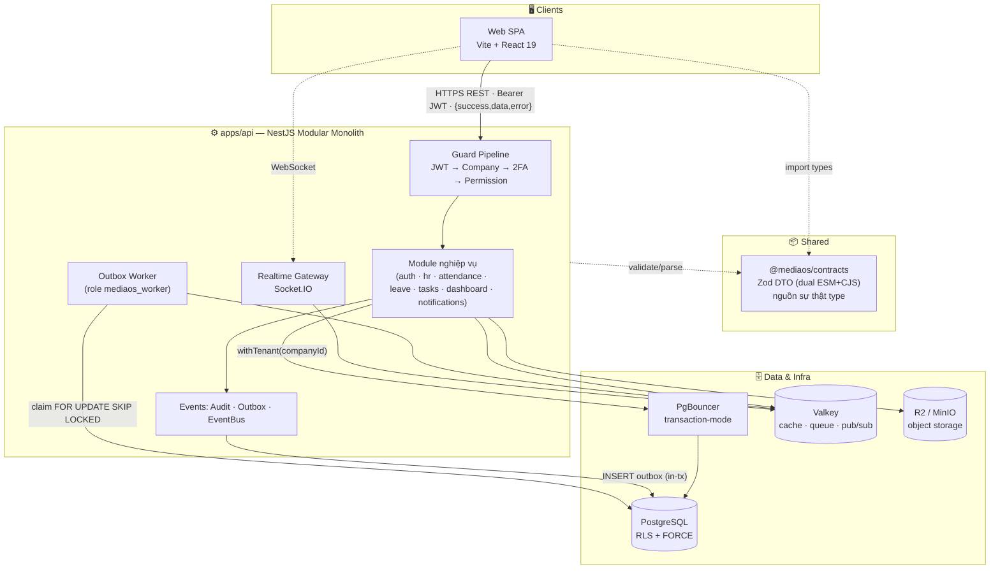
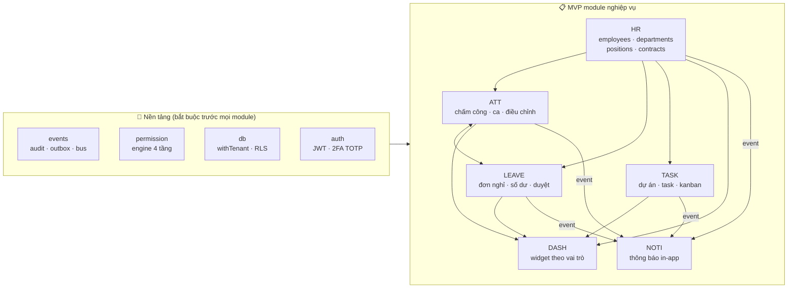
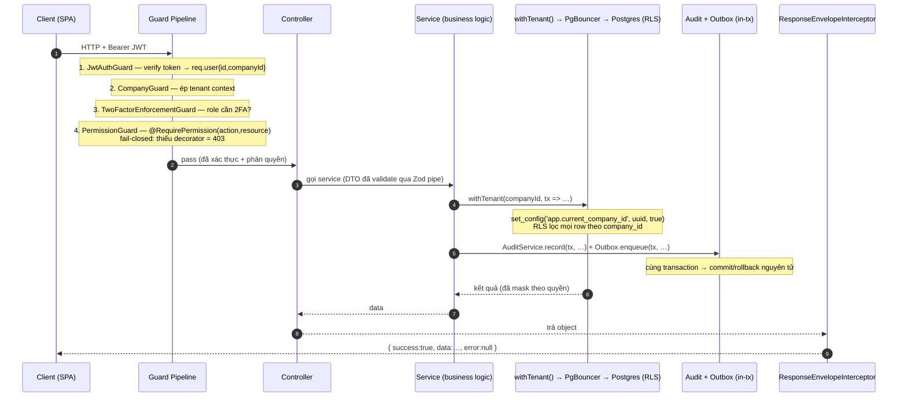
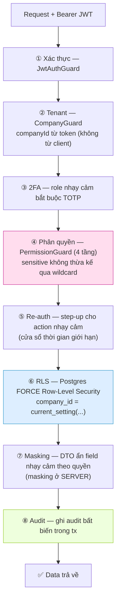
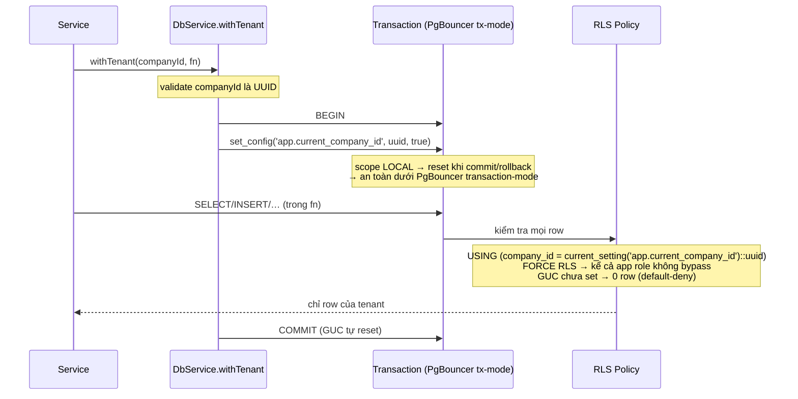
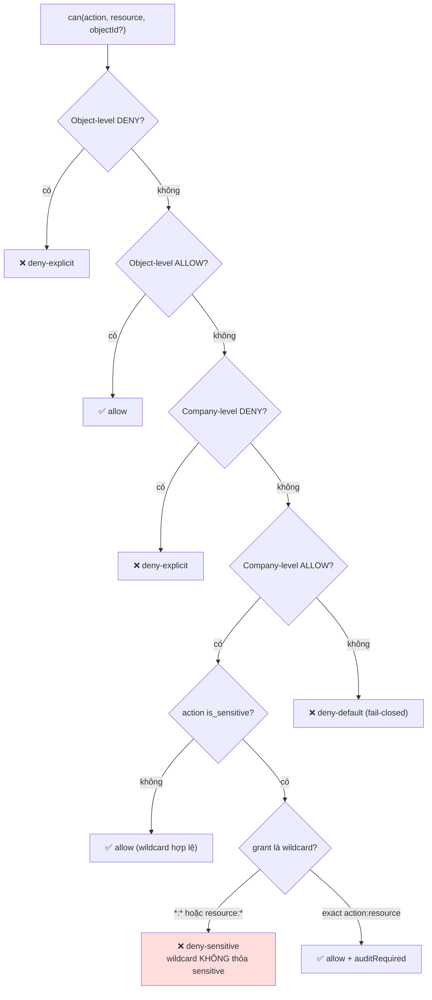
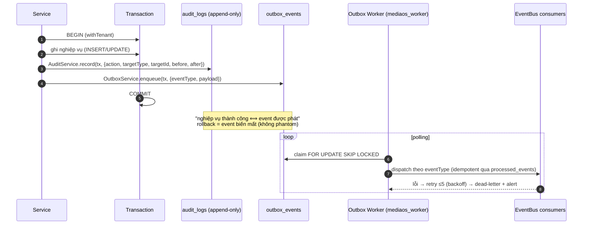

# Hệ thống Quản lý Doanh nghiệp — Tài liệu Thiết kế & Kiến trúc

> **Tài liệu một-trang** mô tả kiến trúc nền tảng và nguyên lý hoạt động của hệ thống.
> **Nguồn sự thật sản phẩm:** [`docs/spec/`](./spec/) (SPEC-01…08). **Quyết định kiến trúc:** [`docs/adr/`](./adr/). **Dữ liệu:** [`erd-current.md`](./erd-current.md). **Phân quyền:** [`permission-matrix-spec.md`](./permission-matrix-spec.md). **Hợp đồng vận hành:** [`../CLAUDE.md`](../CLAUDE.md).
>
> ⚠️ **De-media-fy 2026-06-20:** dự án đã đổi hướng thành **hệ thống quản lý doanh nghiệp nội bộ chung** (không còn media/kênh/content). Cây code `apps/api` hiện CÒN một số subsystem của hướng cũ (media · workflow-DAG · payroll · finance · SaaS control-plane · break-glass · mobile) đang **park (out-of-scope)** — tài liệu này mô tả **kiến trúc đích** theo `docs/spec/`; phần parked được chú thích rõ. Khi code cũ mâu thuẫn với spec → spec thắng.

---

## Mục lục

1. [Dự án là gì](#1-dự-án-là-gì)
2. [Tech stack](#2-tech-stack)
3. [Sơ đồ kiến trúc tổng thể](#3-sơ-đồ-kiến-trúc-tổng-thể)
4. [Bản đồ module MVP](#4-bản-đồ-module-mvp)
5. [Vòng đời một request](#5-vòng-đời-một-request)
6. [Bảo mật phân tầng (defense-in-depth)](#6-bảo-mật-phân-tầng-defense-in-depth)
7. [Cô lập tenant (RLS + withTenant)](#7-cô-lập-tenant-rls--withtenant)
8. [Permission Engine 4 tầng](#8-permission-engine-4-tầng)
9. [Audit log + Outbox + Event Bus](#9-audit-log--outbox--event-bus)
10. [Realtime, Storage, 2FA](#10-realtime-storage-2fa)
11. [Contracts — nguồn sự thật DTO](#11-contracts--nguồn-sự-thật-dto)
12. [Frontend (SPA)](#12-frontend-spa)
13. [3 Bất biến](#13-3-bất-biến)
14. [Subsystem parked (hướng cũ)](#14-subsystem-parked-hướng-cũ)
15. [Chạy & vận hành](#15-chạy--vận-hành)

---

## 1. Dự án là gì

**Hệ thống quản lý doanh nghiệp nội bộ** (internal Enterprise Management System) — nền tảng all-in-one cho một công ty, kiến trúc **Modular Monolith + API-first**. Số hóa nhân sự, chấm công, nghỉ phép, công việc, dashboard và thông báo trên một hệ thống. Đơn-công-ty trước; sẵn sàng mở rộng đa-công-ty/SaaS về sau nhưng **không phải mục tiêu hiện tại**.

**MVP = 7 module lõi** (xem `docs/spec/`): AUTH · HR · ATT (chấm công) · LEAVE (nghỉ phép) · TASK (công việc & dự án) · DASH (dashboard) · NOTI (thông báo). Phase sau (thiết kế để mở rộng, CHƯA làm): PAYROLL · RECRUIT · ASSET · ROOM · CHAT · SOCIAL · MOBILE · AI · INTEGRATION.

Điểm khác biệt cốt lõi: **bảo mật là kiến trúc, không phải kỷ luật dev**. Cô lập dữ liệu ép ở tầng DB bằng RLS; mọi hành động quan trọng ghi audit bất biến; phân quyền kiểm ở server, mask dữ liệu nhạy cảm ở server.

---

## 2. Tech stack

| Tầng | Công nghệ | Ghi chú |
|------|-----------|---------|
| **Backend** | NestJS · TypeScript · `nestjs-zod` | Modular monolith, business logic ở Service |
| **Database** | PostgreSQL 16/17 · **RLS + FORCE** · UUID PK | Cô lập tenant ở tầng DB |
| **ORM** | **Drizzle** | KHÔNG Prisma (phá outbox + rò tenant trên pool) |
| **Pooling** | **PgBouncer transaction-mode** + pool direct riêng | `set_config('app.current_company_id', $1, true)` |
| **Cache/Queue** | **Valkey** · BullMQ | KHÔNG Redis 8 (AGPL) |
| **Realtime** | WebSocketGateway + Socket.IO + Valkey adapter | Room `co:{companyId}:…` |
| **Storage** | Cloudflare R2 / MinIO qua `@aws-sdk/client-s3` | Presigned URL, key do server kiểm soát |
| **Frontend** | **Vite + React 19 SPA** · TanStack Router/Query/Table · Zustand | 1 trust boundary |
| **UI** | shadcn/ui · Tailwind v4 · React Hook Form · Zod · Recharts | Headless, no license trap |
| **i18n / TZ** | react-i18next (vi) · date-fns v4 + @date-fns/tz | UTC-at-rest, render `Asia/Ho_Chi_Minh` |
| **Monorepo** | pnpm 11 · Turborepo | `packages/contracts` (Zod) = nguồn sự thật DTO |

**Loại bỏ có chủ đích:** Supabase (service_role bypass RLS) · Prisma · Next.js cho admin (SSR rò dữ liệu nhạy cảm) · Redis 8 (AGPL) · MUI X Pro / AG Grid Enterprise (bẫy license) · Typesense (GPL-3).

---

## 3. Sơ đồ kiến trúc tổng thể



**Luồng chính:** client gọi REST với Bearer JWT → guard pipeline xác thực & phân quyền → service xử lý nghiệp vụ qua `withTenant()` (PgBouncer → Postgres với RLS) → ghi audit + outbox trong cùng transaction → response bọc envelope `{success, data, error}`. Sự kiện bất đồng bộ do Outbox Worker phát; realtime qua Socket.IO + Valkey adapter.

**Cấu trúc:** `apps/api` (NestJS monolith DUY NHẤT) · `apps/auth` (đăng nhập) · `apps/console` (quản trị hệ thống) · `apps/app` (vỏ nghiệp vụ) · `packages/contracts` (Zod DTO) · `packages/ui` (shadcn) · `packages/web-core` (auth store · api-client · use-can · i18n).

---

## 4. Bản đồ module MVP



**Thứ tự phụ thuộc bắt buộc** (CLAUDE.md §3): `Audit + Outbox` → `Permission engine` → `Tenant isolation (RLS)` → mọi module nghiệp vụ.

**Quan hệ liên-module chính** (theo spec):

- **AUTH ← tất cả:** mọi module resolve user/role/permission/scope qua AUTH. Link `users.employee_id ↔ employees.user_id` nối tài khoản ↔ hồ sơ.
- **HR → ATT/LEAVE/TASK/DASH:** cung cấp `employee_id`, `department_id`, `direct_manager_id` (Team scope), `employment_status` (gate check-in/tạo đơn nghỉ).
- **ATT ↔ LEAVE:** đơn nghỉ được duyệt ghi/đè `attendance_records` (status `Leave`, giảm giờ yêu cầu, chặn check-in cả-ngày); hủy/thu hồi nghỉ → ATT tính lại. Remote/công tác thuộc **ATT**, không phải LEAVE.
- **Tất cả → NOTI:** phát `event_code` → `notifications` (recipient theo `recipient_user_id`).
- **Tất cả → DASH:** DASH chỉ đọc/tổng hợp + deep-link; module nguồn ép data scope. DASH chỉ sở hữu bảng cấu hình widget.
- **TASK:** domain độc lập (projects/tasks); dùng HR `employees` cho owner/reporter/assignee/member; vai trò cấp-dự-án (Owner/Manager/Member/Viewer) chồng lên role hệ thống.

Endpoint theo prefix `/api/v1`. Phân quyền: `@RequirePermission(action, resource)` với mã `MODULE.RESOURCE.ACTION` (xem `permission-matrix-spec.md`).

---

## 5. Vòng đời một request



**Bootstrap (`main.ts`):** global prefix `api/v1` · `ZodValidationPipe` · `ResponseEnvelopeInterceptor` · `AllExceptionsFilter` (5xx chỉ log phía server) · CORS.

**Pipeline guard toàn cục (theo thứ tự):** `JwtAuthGuard` (verify Bearer, gắn `req.user`; bỏ qua nếu `@Public()`) → `CompanyGuard` (ép `companyId` từ JWT) → `TwoFactorEnforcementGuard` (role nhạy cảm bắt buộc TOTP) → `PermissionGuard` (`@RequirePermission`, **fail-closed**: route không khai quyền → 403).

---

## 6. Bảo mật phân tầng (defense-in-depth)



**Nguyên tắc xuyên suốt:**

- **Fail-closed mọi cổng** — thiếu decorator → 403; lỗi DB → 403 (không 500); thiếu quyền → deny-default.
- **Server là nguồn sự thật** — FE chỉ là UX. Masking ở server; client không nhận dữ liệu thì không thể render.
- **Audit-in-tx** — hành động nhạy cảm ghi audit cùng transaction với nghiệp vụ (không bản ghi mồ côi).
- **Valkey là cache, không phải nguồn sự thật** — fail-soft; DB là chuẩn.

---

## 7. Cô lập tenant (RLS + withTenant)

Mọi truy cập dữ liệu nghiệp vụ đi qua **một cổng duy nhất**: `withTenant(companyId, fn)` trong [`db/db.service.ts`](../apps/api/src/db/db.service.ts). _Hiện chạy N=1; giữ nguyên để sẵn sàng mở rộng._



**Mô hình 3 DB role (least-privilege):**

| Role | Vai trò | Quyền |
|------|---------|-------|
| `mediaos_owner` | Chạy migration (DDL) | ALTER/CREATE schema |
| `mediaos_app` | Kết nối app (qua PgBouncer) | SELECT/INSERT/UPDATE/DELETE — **bảng append-only chỉ SELECT+INSERT** |
| `mediaos_worker` | Outbox worker (conn direct) | đọc cross-tenant + UPDATE status outbox |

**Dual-pool:** `pool` (qua PgBouncer, app queries) · `directPool` (migration, LISTEN/NOTIFY, BullMQ) · `workerPool` (role worker).

---

## 8. Permission Engine 4 tầng

`PermissionService.can(user, action, resource, objId?, ctx)` — [`permission/`](../apps/api/src/permission/). Quyết định **deny-overrides**, **fail-closed**:



**4 tầng = RBAC × Scope × Object × Sensitive:**

1. **RBAC** — role → permission (`role_permissions`, effect ALLOW/DENY).
2. **Scope** — phạm vi dữ liệu: **Own / Team / Department / Company / System** (TASK thêm **Project**). Team = `direct_manager_id = me` hoặc team mình quản lý.
3. **Object** — quyền trên từng object cụ thể.
4. **Sensitive** — action `is_sensitive` **không thừa kế qua wildcard**; phải ALLOW tường minh → chống leo thang đặc quyền.

**Cache Valkey:** key `perm:cap:{companyId}:{userId}`, TTL ~300s, invalidate khi `permission.changed`. Fail-soft: Valkey rớt → về DB, không bao giờ false-allow.

**Front-end mirror:** `useCan()` (web-core, Zustand) + `<PermissionGate>` — đọc `capabilities` map từ `/auth/me`, chỉ ẩn/hiện UI. Quyết định thật ở server.

---

## 9. Audit log + Outbox + Event Bus

Module [`events/`](../apps/api/src/events/) là nền tảng phải có trước mọi module (ADR-0009).



- **Audit append-only** — `audit_logs` chỉ INSERT/SELECT (app role không UPDATE/DELETE). `before`/`after` JSONB **không bao giờ chứa secret/password** (Bất biến #3). Trường log chuẩn (SPEC-01 §16.3): `actor_id · action · module · target_type · target_id · old_value · new_value · ip_address · user_agent · created_at`.
- **Outbox** — `outbox_events(status, attempts, available_at)`; enqueue trong tx nghiệp vụ → "write succeeds ⟺ event queued". `processed_events` cho idempotency.
- **Bảng log/append-only theo spec:** `audit_logs` · `attendance_audit_logs` · `task_activity_logs` · `leave_balance_transactions` · `notification_logs` · `employee_status_histories` · `employee_change_logs` (không có `deleted_at`).

---

## 10. Realtime, Storage, 2FA

**Realtime (cho NOTI + sau này CHAT):** Socket.IO gateway, **auth ở handshake** (fail-closed: token sai → từ chối). Room cô lập tenant `co:{companyId}:user:{userId}` (prefix lấy từ token, không spoof). Mọi emit server→client qua DTO `.parse()` (cùng masking như REST — cấm `io.emit` thẳng row). Multi-instance qua `ValkeyIoAdapter`; fail-soft về in-memory.

**Storage:** Presigned URL (PUT/GET) qua `@aws-sdk/client-s3` (R2/MinIO). Key do **server** kiểm soát: `company/{companyId}/type/{objectType}/id/{objectId}` — chặn path traversal chéo tenant. Allowlist content-type + ceiling size (file hồ sơ nhân sự, file đính kèm task/đơn nghỉ).

**2FA TOTP (module `auth/`):** otplib (RFC 6238), window ±1. Login mật khẩu → challenge token → submit TOTP → access token. Defense-in-depth: jti single-use · OTP step-replay guard (Valkey) · `TwoFactorEnforcementGuard` chặn role bắt buộc 2FA chưa enroll · rate-limit fail-**closed**.

---

## 11. Contracts — nguồn sự thật DTO

[`packages/contracts`](../packages/contracts) (`@mediaos/contracts`) — **một định nghĩa Zod** dùng cho cả backend + frontend:

- **Build dual:** CJS + ESM, chỉ phụ thuộc `zod`.
- **Vai trò:** runtime validation (NestJS `nestjs-zod` + ZodValidationPipe; web `.parse()` trên response) + type inference (`z.infer`) → **không type-drift** giữa api ↔ web.

Envelope chuẩn mọi response:

```json
{ "success": true, "data": { }, "error": null }
```

Lỗi: `{ "success": false, "error": { "code": "HR-ERR-001", "message": "…" } }` (mã lỗi theo SPEC-01 §9.6).

---

## 12. Frontend (SPA)

Web Vite + React 19 SPA, multi-app theo trust boundary: `apps/auth` (đăng nhập + 2FA) · `apps/console` (quản trị hệ thống: user/role/permission/cấu hình) · `apps/app` (vỏ nghiệp vụ: HR/ATT/LEAVE/TASK/DASH/NOTI).

- **API layer (`packages/web-core`):** base `VITE_API_URL` (mặc định `http://localhost:3100/api/v1`), gắn Bearer từ auth store, bóc envelope `{success,data,error}`, validate Zod, `ApiError{status, code}`. TanStack Query cache/stale-time.
- **Auth/Permission:** Zustand auth store giữ `capabilities: Record<"action:resource", boolean>`; `useCan()` resolve wildcard (không gọi API); `<PermissionGate>` ẩn/hiện UI.
- **Shared component (`packages/ui`):** shadcn primitives + `DataTable` (TanStack v8, filter+phân trang+skeleton+empty) · `PageHeader` · `EmptyState` · form (React Hook Form + Zod).
- **i18n:** react-i18next, tiếng Việt mặc định.

---

## 13. 3 Bất biến

> Ép tự động bởi hook trong `.claude/hooks/`. Không bao giờ được phá. (Chi tiết: CLAUDE.md §2.)

1. **`company_id` ở MỌI query** nghiệp vụ — tenant isolation ép ở DB bằng **RLS + FORCE**, không dựa kỷ luật dev. Mọi repository qua `withTenant(companyId, fn)`. Chạy N=1; giữ hạ tầng để mở rộng.
2. **Không hard-delete** dữ liệu quan trọng — `deleted_at` (soft-delete). Bảng audit/log/ledger là **append-only** — app role không UPDATE/DELETE.
3. **Không secret plaintext** — mật khẩu user → hash; secret hệ thống → env/secret manager, không log, không vào DTO role không quyền.

---

## 14. Subsystem parked (hướng cũ)

Cây code `apps/api` còn các subsystem của hướng media/SaaS cũ, **không thuộc phạm vi spec hiện tại** — không phát triển tiếp, không tham chiếu khi làm module MVP, không xóa ở đợt dọn này:

| Subsystem | Trạng thái |
|-----------|-----------|
| `media` · `platform` (channels · content · platform_accounts) | Parked — không còn là sản phẩm |
| `workflow` · `approval` · `evaluation` · `defect` (engine DAG/FSM duyệt nội dung) | Parked — LEAVE/ATT dùng phê duyệt đơn giản riêng, không qua engine này |
| `payroll` · `finance` · `kpi` 🔒 | Parked → PAYROLL quay lại ở **Phase 2** (khi build: bảng `payslips`/`kpi_results` vào danh sách append-only, route re-auth giữ nguyên) |
| `saas` · control-plane `apps/admin` (aud=operator) · break-glass | Parked — đơn-công-ty, chưa cần |
| `apps/mobile` (Expo) | Parked → **Phase 5** |
| `crypto` (envelope encryption + KMS) | Giữ ở mức hạ tầng; chỉ kích hoạt lại nếu Phase sau cần lưu credential bên thứ ba |

> Khi gặp mâu thuẫn giữa code parked và `docs/spec/`, **spec thắng**. Việc gỡ/gộp dần các subsystem này được theo dõi ở `harness/backlog.mjs`.

---

## 15. Chạy & vận hành

```bash
# Lần đầu
cp .env.example .env          # điền secret cần thiết
pnpm install                  # allowBuilds: esbuild/swc/nest

# Hạ tầng (cần Docker): Postgres + PgBouncer + Valkey + MinIO
pnpm db:up
pnpm db:setup-roles           # tạo 3 DB role (owner/app/worker)
export DATABASE_DIRECT_URL=…  # migrate dùng direct URL
pnpm db:migrate               # áp migration (chain 0000→latest)

# Dev
pnpm dev                      # api + web (turbo, song song)
pnpm --filter @mediaos/api  dev|build|test|typecheck
pnpm --filter @mediaos/web  dev|build|test|typecheck

# Chất lượng
pnpm lint · pnpm typecheck · pnpm test · pnpm format

# Sinh migration sau khi sửa schema
pnpm --filter @mediaos/api db:generate
```

**Health:** `GET /api/v1/health` (liveness) · `GET /api/v1/health/db` (readiness, fail-soft).

**Verify có Postgres (DB cô lập):** `bash scripts/lane-db-setup.sh <lane>` → `export LANE_DB=mediaos_<lane>` → `pnpm --filter @mediaos/api test`. Lý do: drizzle áp migration đơn điệu theo `when` → DB chung skip band thấp ⇒ test xanh-giả/đỏ-giả.

---

> **Tài liệu này** mô tả kiến trúc đích theo `docs/spec/`. Khi kiến trúc đổi, cập nhật cùng PR. Chi tiết quyết định: [`docs/adr/`](./adr/) · sản phẩm: [`docs/spec/`](./spec/) · hợp đồng vận hành: [`../CLAUDE.md`](../CLAUDE.md).
