# MediaOS — Tài liệu Thiết kế & Kiến trúc Hệ thống

> **Tài liệu một-trang** mô tả thiết kế, cấu trúc và nguyên lý hoạt động của MediaOS **theo code hiện tại**.
> Dựng lại từ source thực tế (không phải bản kế hoạch cũ) — mốc git `040dd82`, 2026-06-17.
> Nguồn quyết định kiến trúc: [`docs/adr/`](./adr/). Hợp đồng vận hành: [`CLAUDE.md`](../CLAUDE.md). Lộ trình: [`TASKS.md`](../TASKS.md).

---

## Mục lục

1. [Dự án là gì](#1-dự-án-là-gì)
2. [Tech stack](#2-tech-stack)
3. [Sơ đồ kiến trúc tổng thể](#3-sơ-đồ-kiến-trúc-tổng-thể)
4. [Cấu trúc monorepo](#4-cấu-trúc-monorepo)
5. [Bản đồ module theo domain](#5-bản-đồ-module-theo-domain)
6. [Nguyên lý hoạt động — vòng đời một request](#6-nguyên-lý-hoạt-động--vòng-đời-một-request)
7. [Mô hình bảo mật phân tầng (defense-in-depth)](#7-mô-hình-bảo-mật-phân-tầng-defense-in-depth)
8. [Cô lập đa-tenant (RLS + withTenant)](#8-cô-lập-đa-tenant-rls--withtenant)
9. [Permission Engine 4 tầng](#9-permission-engine-4-tầng)
10. [Audit log + Transactional Outbox + Event Bus](#10-audit-log--transactional-outbox--event-bus)
11. [Mã hóa bí mật (envelope encryption + KMS)](#11-mã-hóa-bí-mật-envelope-encryption--kms)
12. [Break-glass, 2FA, Realtime, Storage](#12-break-glass-2fa-realtime-storage)
13. [Workflow & Approval — máy trạng thái](#13-workflow--approval--máy-trạng-thái)
14. [Mô hình dữ liệu (ERD)](#14-mô-hình-dữ-liệu-erd)
15. [Kiến trúc Frontend (Web SPA + Mobile)](#15-kiến-trúc-frontend-web-spa--mobile)
16. [Contracts — nguồn sự thật DTO](#16-contracts--nguồn-sự-thật-dto)
17. [3 Bất biến](#17-3-bất-biến)
18. [19 Quyết định kiến trúc (ADR)](#18-19-quyết-định-kiến-trúc-adr)
19. [Tiến độ thực tế theo code](#19-tiến-độ-thực-tế-theo-code)
20. [Chạy & vận hành](#20-chạy--vận-hành)

---

## 1. Dự án là gì

**MediaOS** là hệ điều hành quản trị doanh nghiệp nội bộ cho công ty media (~200 nhân sự · 100 kênh · 300 video/tháng), kiến trúc **Modular Monolith + API-first + SaaS-ready**. Thương hiệu hiện tại: **Funtime Media Corp** ("Better Videos · Better Life").

Hệ thống bao trùm toàn bộ vòng đời vận hành media:

- **Nhân sự & Tổ chức** — phòng ban, đội, vị trí, hồ sơ nhân viên
- **Sản xuất nội dung** — kênh, tài khoản nền tảng, dự án, content, asset có version
- **Workflow duyệt** — engine DAG + FSM, checklist, đánh giá, defect
- **Cộng tác** — task hub thống nhất, chat realtime, thông báo, họp
- **Chấm công & Nghỉ phép** — check-in/out, lịch làm, khóa kỳ
- **Lương & Tài chính** — bảng lương bất biến, KPI, doanh thu/chi phí/lợi nhuận (append-only)
- **Phân tích** — dashboard phân quyền theo vai trò, báo cáo, materialized view
- **Đa-tenant SaaS** — gói cước, feature flag, hạn mức, control-plane quản trị nền tảng
- **Mobile** — app Expo cho nhân viên (task, duyệt, chấm công, payslip)

Điểm khác biệt cốt lõi: **bảo mật là kiến trúc, không phải kỷ luật dev**. Cô lập tenant ép ở tầng DB bằng RLS; bí mật mã hóa phía app; mọi hành động quan trọng ghi audit bất biến.

---

## 2. Tech stack

| Tầng | Công nghệ | Ghi chú |
|------|-----------|---------|
| **Backend** | NestJS · TypeScript · `nestjs-zod` | Modular monolith, business logic ở Service |
| **Database** | PostgreSQL 16/17 · **RLS + FORCE** · UUID PK | Cô lập tenant ở tầng DB |
| **ORM** | **Drizzle** | KHÔNG Prisma (phá outbox + rò tenant trên pool) |
| **Pooling** | **PgBouncer transaction-mode** + pool direct riêng | `set_config('app.current_company_id', $1, true)` |
| **Cache/Queue** | **Valkey 8** · BullMQ | KHÔNG Redis 8 (AGPL) |
| **Realtime** | WebSocketGateway + Socket.IO + Valkey adapter | Room `co:{companyId}:…` |
| **Secrets** | Envelope encryption (AES-256-GCM) + KMS/Vault | Mã hóa phía app |
| **Storage** | Cloudflare R2 / MinIO qua `@aws-sdk/client-s3` | Presigned URL |
| **Frontend Web** | **Vite + React 19 SPA** · TanStack Router/Query/Table · Zustand | 1 trust boundary |
| **UI** | shadcn/ui · Tailwind v4 · React Hook Form · Zod · Recharts · React Flow | Headless, no license trap |
| **Mobile** | **Expo SDK 53** · Expo Router · expo-secure-store · TanStack Query | iOS + Android |
| **i18n / TZ** | react-i18next (vi) · date-fns v4 + @date-fns/tz | UTC-at-rest, render `Asia/Ho_Chi_Minh` |
| **Monorepo** | pnpm 11 · Turborepo | `packages/contracts` (Zod) = nguồn sự thật DTO |

**Loại bỏ có chủ đích:** Supabase (service_role bypass RLS) · Prisma · Next.js cho admin (SSR rò dữ liệu nhạy cảm) · Redis 8 (AGPL) · MUI X Pro / AG Grid Enterprise (bẫy license) · Typesense (GPL-3).

---

## 3. Sơ đồ kiến trúc tổng thể

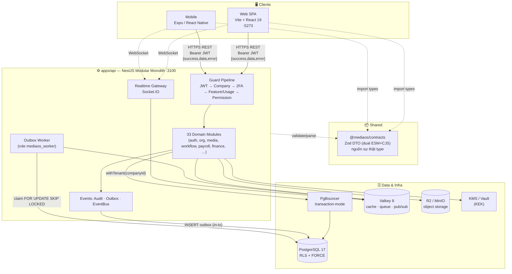

**Luồng chính:** client gọi REST với Bearer JWT → guard pipeline xác thực & phân quyền → service xử lý nghiệp vụ qua `withTenant()` (PgBouncer → Postgres với RLS) → ghi audit + outbox trong cùng transaction → response bọc envelope `{success, data, error}`. Sự kiện bất đồng bộ do Outbox Worker phát; realtime qua Socket.IO + Valkey adapter.

---

## 4. Cấu trúc monorepo

```
mediaos/
├── apps/
│   ├── api/                    # NestJS modular monolith (:3100)
│   │   ├── src/
│   │   │   ├── main.ts         # bootstrap: global prefix /api/v1, Zod pipe, envelope, filter
│   │   │   ├── app.module.ts   # wiring 33 module + 5 global guard
│   │   │   ├── common/         # interceptor envelope · exception filter · tz util
│   │   │   ├── config/         # env loader (Zod-validated)
│   │   │   ├── db/             # Drizzle: db.service (withTenant) · schema/ · worker-role
│   │   │   ├── events/         # audit.service · outbox.service · event-bus · outbox-worker
│   │   │   ├── permission/     # engine 4 tầng · guards · cache Valkey
│   │   │   ├── crypto/         # envelope cipher · KEK provider (local/vault)
│   │   │   └── <33 module nghiệp vụ>/
│   │   └── migrations/         # 97 file SQL (band hóa theo lane G1…G16)
│   ├── web/                    # Vite + React 19 SPA (:5273)
│   │   └── src/ (routes · components · stores · hooks · lib · i18n)
│   └── mobile/                 # Expo SDK 53 (React Native)
│       └── app/ (Expo Router) + src/ (auth · api · hooks · components)
├── packages/
│   └── contracts/             # Zod schemas — nguồn sự thật DTO (dual-build ESM+CJS)
├── docs/                      # ADR · plans · spikes · design (← tài liệu này)
├── scripts/                   # backup-db.sh · setup-db-roles.mjs · lane-db-setup.sh
├── docker-compose.yml         # Postgres · PgBouncer · Valkey · MinIO
├── turbo.json · pnpm-workspace.yaml
```

**Quy mô thực tế:** 33 module API · 97 migration · 27 file schema · 29 contract · 35 trang web · 25 màn mobile · 19 ADR.

---

## 5. Bản đồ module theo domain

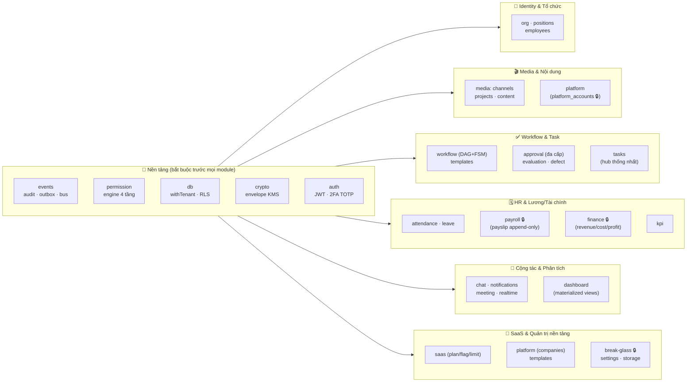

🔒 = chứa dữ liệu nhạy cảm/bí mật (crown-jewel: payroll, finance, secret, break-glass, permission).

**Thứ tự phụ thuộc bắt buộc** (CLAUDE.md §3): `Audit + Outbox` → `Permission engine` → `Tenant isolation (RLS)` → mọi module nghiệp vụ. Không code module nhạy cảm (lương, tài khoản kênh, tài chính) khi PermissionService chưa xong.

### Endpoint chính theo domain (REST, prefix `/api/v1`)

| Domain | Module | Endpoint tiêu biểu |
|--------|--------|--------------------|
| Auth | `auth` | `POST /auth/login` · `/auth/refresh` · `GET /auth/me` · `/auth/2fa/{enroll,verify,enable,disable,status}` |
| Org/HR | `org` `positions` `employees` | `/org/units` `/org/teams` · `/org/positions` · `/employees` (+ `/import`) |
| Media | `media` `platform` | `/projects` `/content` `/channels` · `/platform-accounts` (+ `/reveal`, `/break-glass-reveal`) |
| Workflow | `workflow` `approval` | `/workflow-templates` · `/workflow/*` · `/approval/inbox` |
| Task | `tasks` | `/tasks` (My) · `/tasks/board` · `/tasks/:id/comments` |
| Chấm công | `attendance` `leave` | `/attendance/{check-in,check-out,periods}` · `/leave/requests` |
| Lương | `payroll` | `/payslips/run` · `/payslips` · `/payslips/me/:id/reauth` (re-auth gate) |
| Tài chính | `finance` | `/finance/cost` (+ `/adjust`,`/void`) · `/finance/revenue` · `/finance/allocation` |
| Phân tích | `dashboard` `kpi` `evaluation` `defect` | `/dashboard/{summary,mv-stats,alerts}` · `/kpi` · `/evaluation` |
| Cộng tác | `chat` `notifications` `meeting` | `/chat/rooms` · `/notifications` · `/meetings` |
| SaaS | `saas` `platform` `templates` | `/subscription` · `/admin/platform/companies` · `/admin/platform/templates` |
| Security | `break-glass` `permission` | `/break-glass/grants` · `/permissions/users/:id/roles` |

---

## 6. Nguyên lý hoạt động — vòng đời một request

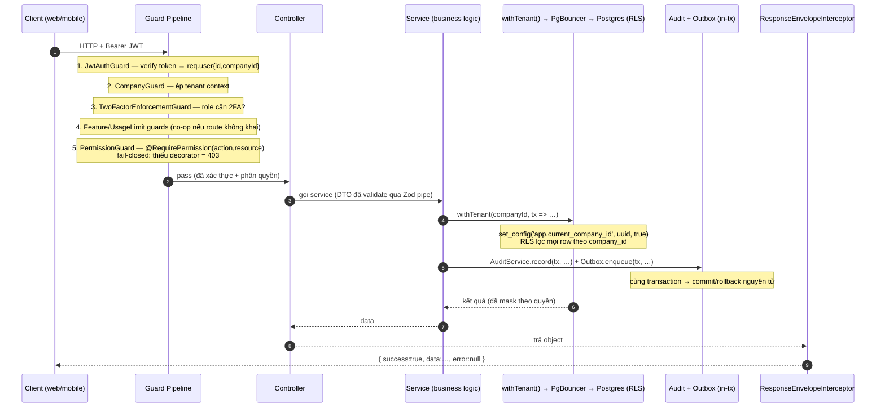

**Bootstrap (`main.ts`):** global prefix `api/v1` · `ZodValidationPipe` (validate input) · `ResponseEnvelopeInterceptor` (bọc mọi response) · `AllExceptionsFilter` (chuẩn hóa lỗi, 5xx chỉ log phía server) · CORS.

**Pipeline guard toàn cục (`app.module.ts`, theo thứ tự):**
1. `JwtAuthGuard` — verify Bearer, gắn `req.user`. Bỏ qua nếu `@Public()`.
2. `CompanyGuard` — ép `companyId` từ JWT làm tenant scope.
3. `TwoFactorEnforcementGuard` — chặn nếu role yêu cầu 2FA mà user chưa enroll (`@AllowWithoutTwoFactor()` để mở route setup).
4. `FeatureFlagEnforcementGuard` / `UsageLimitEnforcementGuard` — no-op trừ khi route khai `@RequireFeature` / `@EnforceUsageLimit` (SaaS).
5. `PermissionGuard` — kiểm tra `@RequirePermission(action, resourceType, {isSensitive?, requiresReauth?})`. **Fail-closed**: route không khai quyền → 403.

---

## 7. Mô hình bảo mật phân tầng (defense-in-depth)

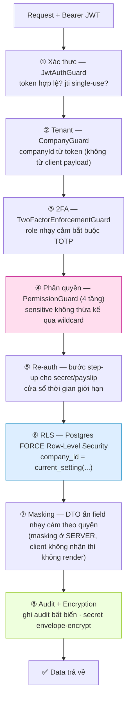

**Nguyên tắc xuyên suốt:**
- **Fail-closed mọi cổng bảo mật** — thiếu decorator → 403; lỗi DB → 403 (không 500); thiếu quyền → deny-default.
- **Server là nguồn sự thật** — FE/mobile chỉ là UX. Masking thực hiện phía server; client không nhận dữ liệu thì không thể render.
- **Audit-in-tx** — mọi hành động nhạy cảm ghi audit trong cùng transaction với nghiệp vụ (không có bản ghi mồ côi).
- **Valkey là cache, không phải nguồn sự thật** — fail-soft; DB mới là chuẩn.

---

## 8. Cô lập đa-tenant (RLS + withTenant)

Mọi truy cập dữ liệu nghiệp vụ đi qua **một cổng duy nhất**: `withTenant(companyId, fn)` trong [`db/db.service.ts`](../apps/api/src/db/db.service.ts).

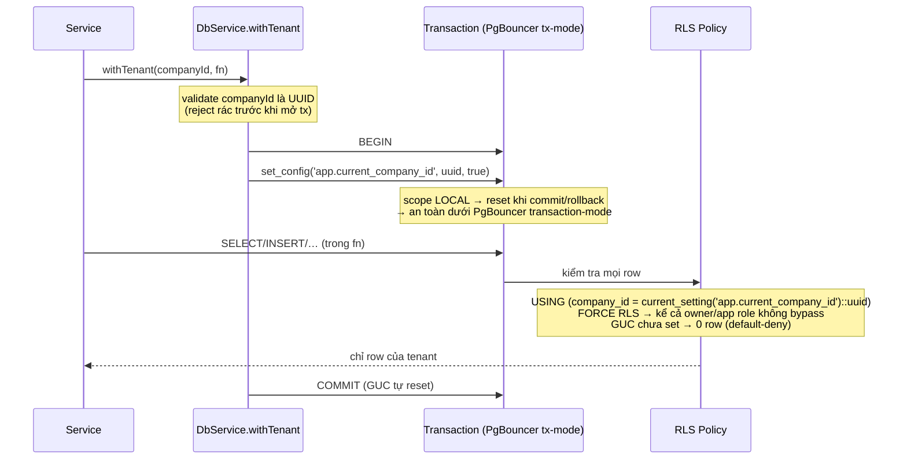

**Mô hình 3 DB role (least-privilege)** — `migrations/0001_roles_and_grants.sql`:

| Role | Vai trò | Quyền |
|------|---------|-------|
| `mediaos_owner` | Chạy migration (DDL) | ALTER/CREATE schema |
| `mediaos_app` | Kết nối app (qua PgBouncer) | SELECT/INSERT/UPDATE/DELETE — **bảng append-only chỉ SELECT+INSERT** |
| `mediaos_worker` | Outbox worker (conn direct) | đọc cross-tenant + UPDATE status outbox |

**Dual-pool:** `pool` (qua PgBouncer, app queries) · `directPool` (direct: migration, LISTEN/NOTIFY, BullMQ) · `workerPool` (role worker, đọc mọi tenant cho outbox).

**Escape-hatch platform-admin (ADR-0017):** GUC `app.platform_admin='on'` qua `withPlatformContext()` chỉ nới RLS trên **bảng `companies`** (để list-all). Default-deny: GUC chưa set → false → không bypass. Mọi bảng khác vẫn 0-row.

---

## 9. Permission Engine 4 tầng

`PermissionService.can(user, action, objType, objId, ctx)` — [`permission/`](../apps/api/src/permission/). Quyết định theo **độ ưu tiên** (số nhỏ = ưu tiên cao), **deny-overrides**, **fail-closed**:

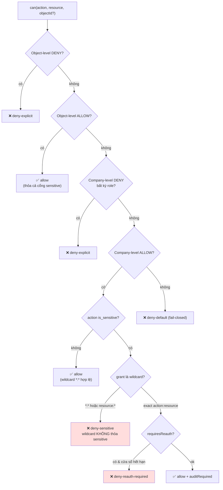

**4 tầng = RBAC × Scope × Object × Sensitive:**
1. **RBAC** — role → permission (`role_permissions`, effect ALLOW/DENY).
2. **Scope** — phạm vi company-level.
3. **Object** — quyền trên từng object cụ thể (`object_permissions`, ví dụ 1 tài khoản kênh).
4. **Sensitive** — action `is_sensitive` **không thừa kế qua wildcard**; phải có ALLOW tường minh hoặc object-grant → chống leo thang đặc quyền.

**Cache Valkey:** key `perm:cap:{companyId}:{userId}` + `perm:obj:…`, TTL 300s; `expires_at` re-check mỗi lần `can()` (an toàn cache-hit); invalidate khi sự kiện `permission.changed`. Fail-soft: Valkey rớt → về DB, không bao giờ false-allow.

**Front-end mirror:** web `useCan()` (Zustand) + mobile `useCan()` (Context) + `<PermissionGate>` — đọc `capabilities` map từ `/auth/me`, không gọi API, chỉ ẩn/hiện UI (UX). Quyết định thật luôn ở server.

---

## 10. Audit log + Transactional Outbox + Event Bus

Module [`events/`](../apps/api/src/events/) là nền tảng phải có trước mọi module (ADR-0009).

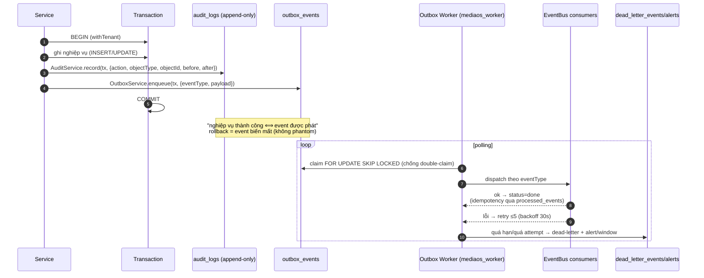

- **Audit append-only** — `audit_logs` chỉ INSERT/SELECT (app role không UPDATE/DELETE). `before`/`after` JSONB **không bao giờ chứa secret/password** (Bất biến #3). CHECK constraint `object_types` ~50 loại, mở rộng kiểu UNION mọi lane.
- **Outbox** — `outbox_events(status, attempts, available_at)`; enqueue trong tx nghiệp vụ → đảm bảo "write succeeds ⟺ event queued". `processed_events` cho idempotency theo `(consumer_name, event_id)`.
- **Worker** — đọc qua `workerDb` (role worker, thấy mọi tenant); claim `FOR UPDATE SKIP LOCKED`; reaper hồi sinh event kẹt `processing` > 5 phút; thất bại → `dead_letter_events` + `dead_letter_alerts` (1 alert/window).

---

## 11. Mã hóa bí mật (envelope encryption + KMS)

Module [`crypto/`](../apps/api/src/crypto/) — bảo vệ secret tài khoản nền tảng (`platform_accounts`) và secret TOTP (`user_totp`). ADR-0004.

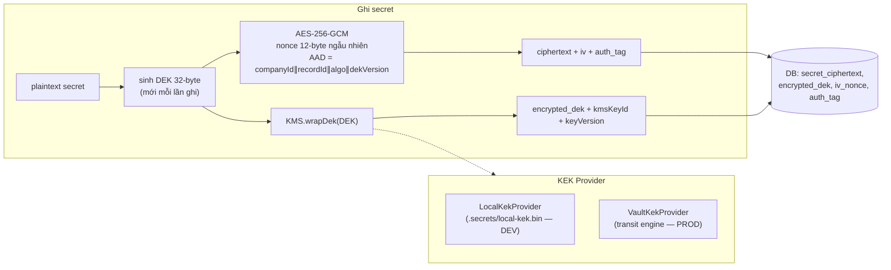

- **DEK/KEK split** — mỗi lần ghi sinh DEK 32-byte mới (AES-256), DEK được KEK bọc lại. KEK **không bao giờ** ở trong DB → dump DB mà thiếu KEK là vô dụng.
- **AES-256-GCM** — nonce ngẫu nhiên mỗi lần ghi (chống tái dùng (key, nonce) — thảm họa với GCM). **AAD** ràng buộc `companyId∥recordId∥algo∥dekVersion` (NUL-delimited, không thể re-segment).
- **DEK zeroing** — `dek.fill(0)` trong `finally` sau khi dùng.
- **Provider:** `LocalKekProvider` (đọc KEK 32-byte từ file `.secrets/local-kek.bin`, chỉ DEV) · `VaultKekProvider` (PROD, DEK không materialize trong app memory). `SecretRotationService` lo xoay khóa (re-wrap), `SecretProvisioningService` khởi tạo khi tạo company.
- Mismatch khi seal/open → lỗi generic, **không lộ plaintext/key**.

---

## 12. Break-glass, 2FA, Realtime, Storage

### Break-glass — truy cập khẩn cấp secret (ADR-0019, module `break-glass/`)

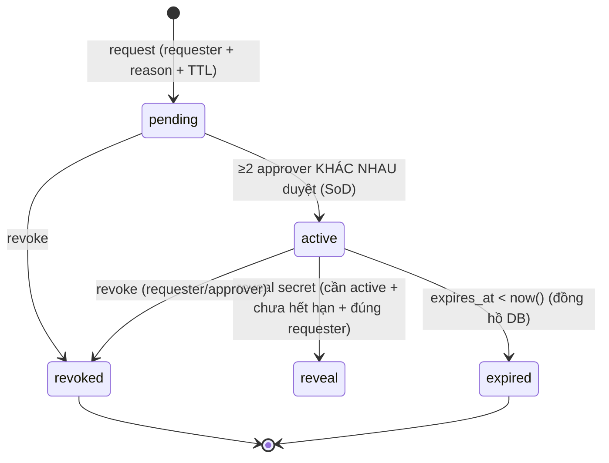

SoD ép **3 tầng**: DB `UNIQUE(grant_id, approver_id)` + CHECK no-self-approve · service `COUNT(DISTINCT approver)` ≥ required · HTTP PermissionGuard (sensitive). TTL mặc định 10 phút, kiểm tra `expires_at` bằng đồng hồ DB. Mọi bước audit-in-tx (`object_type=break_glass_access`), không lưu secret trong `before/after`.

### 2FA TOTP (module `auth/`)

- otplib **v12** (RFC 6238), issuer "MediaOS", window ±1 (lệch đồng hồ 30s).
- Luồng: login mật khẩu → challenge token → submit TOTP → access token. Secret TOTP **envelope-encrypt** trong `user_totp`; recovery codes lưu **hash** (10 mã, single-use).
- Defense-in-depth: jti single-use (chống replay token) · OTP step-replay guard (Valkey `setNx` theo `(userId, currentStep)`) · `TwoFactorEnforcementGuard` chặn role bắt buộc 2FA chưa enroll · security alert khi bất thường · rate-limit fail-**closed** (Valkey rớt → khóa theo mem).

### Realtime (module `realtime/`)

- Socket.IO gateway, **auth ở handshake** (Bearer → user). Fail-closed: token sai → từ chối ở handshake.
- **Room cô lập tenant:** `co:{companyId}:chat:{roomId}`, `co:{companyId}:user:{userId}`. Prefix `co:{companyId}:` lấy từ token (không spoof được).
- Mọi emit server→client qua DTO `.parse()` (cùng masking như REST — cấm `io.emit` thẳng row). Multi-instance qua `ValkeyIoAdapter` (pub/sub); fail-soft về in-memory.

### Storage (module `storage/`)

- Presigned URL (PUT/GET) qua `@aws-sdk/client-s3` (R2/MinIO). Key do **server** kiểm soát: `company/{companyId}/type/{objectType}/id/{objectId}` — chặn path traversal chéo tenant. Allowlist content-type + ceiling size. Thiếu config → throw (không ghi-vào-hư-không).

---

## 13. Workflow & Approval — máy trạng thái

Engine duyệt nội dung: template DAG → instance runtime trên content/project, có FSM, checklist, đánh giá, defect. **`approval_requests` + `approval_steps` là nguồn sự thật duy nhất** cho mọi hành vi duyệt; `workflow_steps.status` chỉ là **projection** cập nhật qua event (ADR-0016).

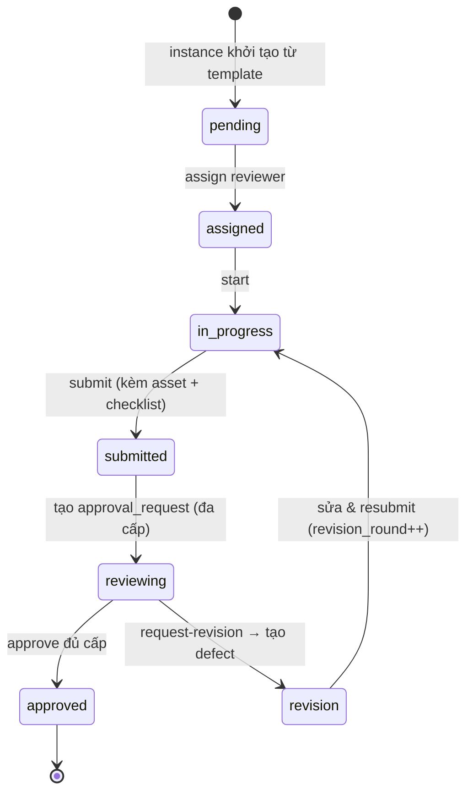

- `WorkflowDagValidator` validate DAG + tính thứ tự thực thi; `step_transitions` định nghĩa FSM; `LockPropagationService` lan truyền khóa giữa step; dependency `finish_to_start`…
- **Approval đa cấp:** `approval_rules` định tuyến approver theo level; `approval_steps` append-only (quyết định bất biến); `defects` là chi tiết của quyết định `revision_requested` (không phải kênh song song).
- **Task hub thống nhất (ADR/G9):** mọi loại task (workflow_step, production, review, meeting_action, office, finance, hr) trong **một bảng `tasks`** — một board, một mô hình quyền. HR/finance/meeting phát task qua event.

---

## 14. Mô hình dữ liệu (ERD)

~90 bảng, nhóm theo domain. Sơ đồ dưới minh họa **lõi tenant + auth + permission + workflow/task** (representative subset):

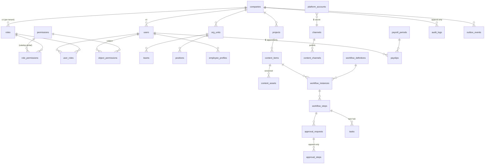

**Phân loại bảng theo tính chất:**

| Tính chất | Bảng tiêu biểu |
|-----------|----------------|
| **Tenant-scoped** (`company_id` NOT NULL + RLS) | hầu hết bảng nghiệp vụ |
| **Catalog global** (không RLS) | `permissions` · `platforms` · `subscription_plans` · `plan_entitlements` · `workspace_templates` · `encryption_keys` |
| **Append-only** (app chỉ SELECT+INSERT) | `audit_logs` · `approval_steps` · `defects` · `task_comments` · `evaluation_results/scores` · `kpi_results` · `revenue_records` · `cost_records` · `profit_snapshots` · `payslips` · `payslip_items` · `security_alerts` · `break_glass_approvals` |
| **Secret mã hóa** 🔒 | `platform_accounts.secret_ciphertext` · `user_totp.secret_ciphertext` (envelope) · `user_recovery_codes.code_hash` (hash) |
| **Nhạy cảm mask theo quyền** | `employee_profiles.base_salary` · `salary_profiles` · `payslips` (lương) · PII tài khoản nền tảng |

**Mẫu sửa dữ liệu append-only:** không UPDATE/DELETE — bản ghi sửa = row mới với `entry_kind ∈ {original, adjustment, void}` + `replaces_record_id` trỏ bản gốc; CHECK ép chuỗi toàn vẹn. **Soft-delete:** `deleted_at` + partial unique index `WHERE deleted_at IS NULL`.

---

## 15. Kiến trúc Frontend (Web SPA + Mobile)

### Web — Vite + React 19 SPA (`apps/web/src`)

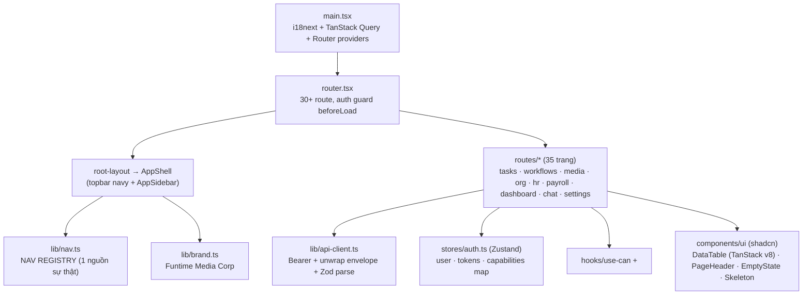

- **API layer:** `lib/api-client.ts` — base `VITE_API_URL` (mặc định `http://localhost:3100/api/v1`), gắn Bearer từ auth store, bóc envelope `{success,data,error}`, validate Zod, `ApiError{status, code}`. TanStack Query cache/stale-time.
- **Auth/Permission:** Zustand `auth.ts` giữ `capabilities: Record<"action:resource", boolean>`; `useCan()` resolve wildcard `exact → action:* → *:resource → *:*` (không gọi API); `<PermissionGate>` ẩn/hiện UI.
- **Shell & brand:** `AppShell` (topbar slate-900 + sidebar tự sinh từ `lib/nav.ts`), brand "Funtime Media Corp" trong `lib/brand.ts`, theme Slate-Corporate. Bộ shared component tái dùng mọi module: `DataTable` (filter+phân trang+skeleton+empty), `PageHeader`, `EmptyState`, `Skeleton`.
- **i18n:** react-i18next init đồng bộ, tiếng Việt mặc định, namespace auto-glob, `import.meta.glob` eager.

### Mobile — Expo SDK 53 (`apps/mobile`)

- **Stack:** Expo Router (file-based) · React Query · Zod · `expo-secure-store` (token trong Keychain/Keystore).
- **Màn:** `(auth)/login` · `(tabs)/` {Home, MyTasks, Approvals, Notifications, Chat, Attendance, Leave, Payslips, KPI} · deep-link `task/[id]`, `submit/[id]`, `revision/[id]`, `chat/[id]`.
- **Auth/Permission:** React Context `auth-context` (restore từ SecureStore → `/auth/me`); `useCan()` + `<PermissionGate>` **mirror web** (cùng `hasCapability`). Client `api/client.ts`: 401 → single-flight refresh, retry 1 lần.
- **Payslip re-auth modal** trước khi lộ lương; permission gating server-driven (không có nút Approve nếu không phải reviewer). Dùng chung `@mediaos/contracts`.

---

## 16. Contracts — nguồn sự thật DTO

[`packages/contracts`](../packages/contracts) (`@mediaos/contracts`) — **một định nghĩa Zod** dùng cho cả 3 nền:

- **Build dual:** CJS (`dist/cjs`) + ESM (`dist/esm`), chỉ phụ thuộc `zod`. Resolve `workspace:*`.
- **Vai trò:** runtime validation (NestJS `nestjs-zod` + ZodValidationPipe; web/mobile `.parse()` trên response) + type inference (`z.infer`) → **không type-drift** giữa api ↔ web ↔ mobile.
- **29 module contract:** core (`apiResponseSchema`, `paginationMeta`) · auth · two-factor · platform · subscription · org · employees · positions · permission · settings · media · platform-accounts · workflow · task · approval · defect · chat · notification · meeting · realtime · attendance · leave · evaluation · kpi · payroll · finance · dashboard · crypto.

Envelope chuẩn mọi response:

```json
{ "success": true, "data": { ... }, "error": null }
```

---

## 17. 3 Bất biến

> Ép tự động bởi hook trong `.claude/hooks/`. Không bao giờ được phá.

1. **`company_id` ở MỌI query** nghiệp vụ — tenant isolation ép ở tầng DB bằng **RLS + FORCE**, không dựa kỷ luật dev. Mọi repository đi qua `withTenant(companyId, fn)`.
2. **Không hard-delete** dữ liệu quan trọng — dùng `deleted_at` (soft-delete). Bảng audit/snapshot (`audit_logs`, `payslips`, `kpi_results`, `profit_snapshots`, `revenue_records`, `cost_records`…) là **append-only** — app role không có UPDATE/DELETE.
3. **Không secret plaintext** — mật khẩu user → argon2id/hash; tài khoản kênh (`platform_accounts`) → **envelope encryption + KMS**, mã hóa phía app, không log, không vào DTO của role không quyền.

---

## 18. 19 Quyết định kiến trúc (ADR)

Đầy đủ tại [`docs/adr/`](./adr/). Tóm tắt:

| # | Tiêu đề | Quyết định |
|---|---------|-----------|
| 0001 | RLS multi-tenant | Cô lập tenant ở DB bằng PostgreSQL **FORCE RLS**; app role non-superuser, no BYPASSRLS; mọi truy cập qua `withTenant`. |
| 0002 | ORM = Drizzle | Drizzle (SQL-first, kiểm soát tx/connection) thay Prisma (phá outbox + rò tenant trên pool). |
| 0003 | PgBouncer transaction-mode | `set_config(...,true)` LOCAL scope reset sau tx → an toàn khi reuse connection; pool direct cho LISTEN/NOTIFY + BullMQ. |
| 0004 | Envelope encryption + KMS | Mã hóa phía app: DEK mã data, KEK ở KMS/Vault; reveal cần re-auth + audit; không pgcrypto-in-SQL. |
| 0005 | Payroll/Finance immutable | `payslips`, `kpi_results`, `*_records`, `profit_snapshots` append-only; sửa = bản ghi mới; khóa kỳ KPI trước payroll. |
| 0006 | Frontend Vite + React SPA | SPA 1 trust boundary; không Next.js admin (SSR rò dữ liệu nhạy cảm). |
| 0007 | Mobile = React Native | RN/Expo sau khi web ổn; tái dùng React + contracts; push FCM. |
| 0008 | Timezone UTC-at-rest | Lưu `timestamptz` (UTC); render `Asia/Ho_Chi_Minh` ở display layer (`@date-fns/tz`, two-pass DST). |
| 0009 | Audit + Outbox + Event bus | Audit append-only + outbox (business event cùng tx); bus idempotent + dead-letter. Nền tảng trước mọi module. |
| 0010 | Permission engine 4 tầng | `can()` = RBAC × Scope × Object × Sensitive; sensitive **không thừa kế**; deny-path-first; cache Valkey; server là truth. |
| 0011 | Zero-cost infra | Self-host Oracle Cloud Always Free / on-prem; backup `pg_dump` → B2 offsite. |
| 0012 | NestJS modular monolith | NestJS + `nestjs-zod`; `packages/contracts` (Zod) nguồn sự thật DTO; envelope + global filter. |
| 0013 | Valkey + BullMQ + Socket.IO | Valkey (BSD, tránh Redis 8 AGPL); BullMQ; realtime room `co:{companyId}:…`. |
| 0014 | Storage R2/MinIO qua S3 SDK | R2 no egress; S3 SDK chuẩn → swap R2↔MinIO không đổi code. |
| 0015 | UI shadcn + TanStack | shadcn (own-the-code) + TanStack Table v8 headless; tránh bẫy license MUI X/AG Grid. |
| 0016 | Approval single source of truth | `approval_requests/steps` là nguồn duy nhất; `workflow_steps.status` là projection qua event; `defects` là chi tiết quyết định. |
| 0017 | Platform-admin tenancy | GUC `app.platform_admin` escape-hatch **chỉ bảng `companies`**; default-deny; `withPlatformContext`. |
| 0018 | Mobile stack = Expo | Expo SDK 53 managed + Expo Router; token `expo-secure-store`; contracts từ monorepo; 2FA-aware. |
| 0019 | Control plane cross-tenant | Mô hình 3 tầng: `withTenant(target)` per-call → GUC read-only per-bảng → DB role read-only riêng; token `aud=operator`, 2FA bắt buộc. |

---

## 19. Tiến độ thực tế theo code

> ⚠️ Bản kế hoạch MVP v1 cũ (MASTER-PLAN, mốc 2026-06-05, đã xóa khỏi repo) ghi "G1 95%, còn lại 0%" — **đã lỗi thời**. Code thực tế đã land xuyên suốt G1–G16. Bảng dưới phản ánh **code hiện tại** (git `040dd82`, 97 migration, 33 module).

| Phase | Phạm vi | Trạng thái theo code |
|-------|---------|----------------------|
| G1 | Bootstrap monorepo, Docker, NestJS/React skeleton, CI, backup | ✅ Landed |
| G2 | RLS + FORCE, audit, outbox, masking, soft-delete, dead-letter alert | ✅ Landed |
| G3 | Permission engine 4 tầng, Valkey cache, mutation runtime | ✅ Landed |
| G4 | MVP-0: workflow, tasks, approval (1-level), chat | ✅ Landed |
| G5 | Org/HR: org_units, teams, positions, employee profiles, settings | ✅ Landed |
| G6 | Media: channels, platform_accounts (🔒 envelope+KMS), projects, content, asset version; break-glass (PR-A KMS, PR-B reveal) | ✅ Landed |
| G7 | Workflow Builder: template DAG, checklist, eval hook, multi-target | ✅ Landed |
| G8 | Approval đa cấp, evaluation, defect, KPI | ✅ Landed |
| G9 | Task hub thống nhất (một bảng `tasks`) | ✅ Landed |
| G10 | Chat realtime, notifications (mandatory rules), meeting | ✅ Landed |
| G11 | Attendance (check-in/out, period lock), leave | ✅ Landed |
| G12 | Payroll 🔒: salary profile, period FSM, payslip append-only + re-auth, bonus/penalty, acknowledgement | ✅ Landed (BE+FE) |
| G13 | Finance 🔒: revenue/cost/profit append-only, expense, allocation | ✅ Landed |
| G14 | Dashboard phân quyền, report, materialized views, alerts | ✅ Landed |
| G15 | Mobile Expo: core (M0/M1) + notif/chat/device-token (G15-2) + attendance/leave/payslip/KPI (G15-3) | ✅ Landed |
| G16 | 2FA TOTP (G16-1), hot-path index, SaaS prep (platform tier, plan/flag/limit, template-clone) (G16-3) | ✅ Landed |
| GX | i18n (vi), timezone, ops debt | ✅ Landed |
| — | Admin Control Plane (`apps/admin`, ADR-0019) | 📋 Đã có PLAN + ADR + band-hook; chưa mở lane code |
| — | Web UI redesign (MISA-style, Funtime branding) | 🟡 Đang triển khai (foundation + Module Nhân sự landed) |

---

## 20. Chạy & vận hành

```bash
# Lần đầu
cp .env.example .env          # điền secret cần thiết
pnpm install                  # allowBuilds: esbuild/swc/nest/expo

# Hạ tầng (cần Docker): Postgres + PgBouncer + Valkey + MinIO
pnpm db:up
pnpm db:setup-roles           # tạo 3 DB role (owner/app/worker)
export DATABASE_DIRECT_URL=…  # migrate dùng direct URL
pnpm db:migrate               # áp 97 migration (chain 0000→latest)

# Dev
pnpm dev                      # api :3100 + web :5273 (turbo, song song)
pnpm --filter @mediaos/api  dev|build|test|typecheck
pnpm --filter @mediaos/web  dev|build|test|typecheck

# Chất lượng
pnpm lint · pnpm typecheck · pnpm test · pnpm format

# Sinh migration sau khi sửa schema
pnpm --filter @mediaos/api db:generate

# Backup
bash scripts/backup-db.sh     # pg_dump → encrypt → rclone offsite
```

**Health:** `GET /api/v1/health` (liveness) · `GET /api/v1/health/db` (readiness, fail-soft).

**Vận hành song song (multi-lane):** mỗi lane 1 worktree `mediaos-<lane>`, band migration riêng (G9 `0040s`…G16 `0120s`), DB cô lập `mediaos_<lane>` khi verify (drizzle áp migration đơn điệu theo `when` → DB chung sẽ skip band thấp). Review gate phân tầng FULL/LIGHT theo domain diff (xem [`CLAUDE.md`](../CLAUDE.md) §5–9).

---

> **Tài liệu này** mô tả trạng thái code tại git `040dd82`. Khi kiến trúc đổi, cập nhật cùng PR. Chi tiết quyết định: [`docs/adr/`](./adr/) · lộ trình & nợ kỹ thuật: [`TASKS.md`](../TASKS.md) · hợp đồng vận hành: [`CLAUDE.md`](../CLAUDE.md).
