# UI-02: INFORMATION ARCHITECTURE & SITEMAP
# SƠ ĐỒ MENU, ROUTING, SIDEBAR, TOPBAR, QUYỀN HIỂN THỊ MENU

> **📚 Bộ tài liệu UI — Hệ thống Quản lý Doanh nghiệp**
> [UI-01 Tổng quan](<UI-01_UIUX_Design_Tong_Quan.md>) · **UI-02 IA/Sitemap** · [UI-03 User Flow](<UI-03_User_Flow_MVP.md>) · [UI-04 Screen List](<UI-04_Screen_List_Wireframe_Plan.md>) · [UI-05 Design System](<UI-05_Design_System_Component_Library.md>) · [UI-06 Home/App Switcher](<UI-06_Home_Portal_App_Switcher_UI_Design.md>) · [UI-07 Module Workspace](<UI-07_Module_Workspace_Template_Design.md>) · [UI-08 Dashboard](<UI-08_Dashboard_UIUX_Design.md>) · [UI-09 Module UI](<UI-09_Module_UI_Design.md>) · [UI-10 Prototype/Handoff](<UI-10_Prototype_Frontend_Handoff_Guide.md>)
>
> **Liên quan:** [Đặc tả: SPEC-01 Tổng quan](<../SPEC/SPEC-01 Tổng quan.md>) · [Phân quyền: SPEC-02 AUTH](<../SPEC/SPEC-02 AUTH.md>) · [Module/registry: API-09 FOUNDATION](<../API Design/API-09_FOUNDATION_API_Design.md>) · [Chỉ mục tài liệu](<../README.md>)

---

## 1. Thông tin tài liệu

| Trường | Nội dung |
| --- | --- |
| Mã tài liệu | UI-02 |
| Tên tài liệu | Information Architecture & Sitemap |
| Tên dự án | Hệ thống quản lý doanh nghiệp nội bộ |
| Tên sản phẩm | Enterprise Management System |
| Phiên bản | v1.0 |
| Trạng thái | Draft |
| Giai đoạn | MVP Version 1.0 |
| Tài liệu nguồn | PRD-00, SPEC-01 -> SPEC-08, DB-01 -> DB-10, API-01 -> API-09, UI-01 |
| Ngày tạo | 20/06/2026 |
| Ngày cập nhật | 20/06/2026 |
| Người viết |  |
| Người duyệt |  |

### Lịch sử thay đổi (Changelog)

| Phiên bản | Ngày | Thay đổi | Người thực hiện |
| --- | --- | --- | --- |
| v1.0 | 20/06/2026 | Khởi tạo tài liệu cho giai đoạn MVP v1.0. | |

---

## 2. Mục đích tài liệu

Tài liệu UI-02 định nghĩa kiến trúc thông tin và điều hướng cho hệ thống quản lý doanh nghiệp nội bộ.

UI-02 tập trung vào các nội dung:

1. Cấu trúc thông tin tổng thể của hệ thống.
2. Sitemap cấp cao cho MVP.
3. Route convention cho frontend.
4. Cấu trúc Home Portal sau đăng nhập.
5. Cấu trúc Module Workspace cho từng module.
6. Sơ đồ sidebar theo module.
7. Cấu trúc topbar dùng chung.
8. App Switcher / App Launcher.
9. Quy tắc ẩn/hiện app, menu, route, button theo permission và data scope.
10. Matrix quyền hiển thị menu theo role mặc định.
11. Quy tắc xử lý truy cập URL trái quyền.
12. Checklist bàn giao cho UI/UX, frontend, backend và QA.

Tài liệu này là cơ sở để triển khai các tài liệu tiếp theo:

| Mã tài liệu | Nội dung |
| --- | --- |
| UI-03 | User Flow chi tiết |
| UI-04 | Screen List & Screen Specification |
| UI-05 | Design System |
| UI-06 | Dashboard UI Design |
| UI-07 | HR UI Design |
| UI-08 | Attendance UI Design |
| UI-09 | Leave UI Design |
| UI-10 | Task UI Design |
| UI-11 | Notification UI Design |
| UI-12 | Admin/System UI Design |

---

## 3. Căn cứ thiết kế

UI-02 bám theo các quyết định đã chốt trong UI-01 và bộ tài liệu SPEC/API/DB:

1. Sau đăng nhập, người dùng vào **Home Portal** trước, không đi thẳng vào module nghiệp vụ.
2. Từ Home Portal, người dùng chọn app/module để vào **Module Workspace**.
3. Trong mọi màn hình, người dùng có thể bấm nút **Ứng dụng** để mở **App Switcher**.
4. Module Workspace có sidebar riêng theo từng module.
5. Topbar dùng chung toàn hệ thống.
6. Frontend được phép ẩn/hiện menu để cải thiện UX nhưng không phải lớp bảo mật cuối cùng.
7. Backend luôn kiểm tra authentication, permission, data scope và business rule.
8. Menu không được hard-code theo role; role chỉ là seed mặc định. Menu phải dựa vào permission thực tế backend trả về.
9. Data scope ảnh hưởng dữ liệu hiển thị trong màn hình, widget, badge, counter và danh sách.
10. URL trái quyền phải bị chặn bằng route guard và backend guard.

---

## 4. Phạm vi IA/Sitemap MVP

### 4.1 Module thuộc MVP

| Module code | Tên hiển thị | Vai trò trong IA |
| --- | --- | --- |
| `DASH` | Dashboard | Trang tổng quan theo vai trò |
| `HR` | Nhân sự | Hồ sơ nhân viên, phòng ban, chức vụ, hợp đồng |
| `ATT` | Chấm công | Check-in/out, bảng công, ca làm, rule, điều chỉnh công, remote |
| `LEAVE` | Nghỉ phép | Đơn nghỉ, duyệt nghỉ, lịch nghỉ, chính sách, số dư phép |
| `TASK` | Công việc | Dự án, task, Kanban, bình luận, checklist, file |
| `NOTI` | Thông báo | Danh sách thông báo, dropdown, cấu hình thông báo |
| `AUTH` | Tài khoản & phân quyền | User, role, permission, profile, security |
| `FOUNDATION` | Hệ thống | Company, settings, audit log, files, module catalog |

### 4.2 Module phase sau chỉ hiển thị dạng placeholder nếu cấu hình cho phép

| Module code | Tên hiển thị | Trạng thái mặc định trong MVP |
| --- | --- | --- |
| `PAYROLL` | Tiền lương | Ẩn hoặc khóa |
| `RECRUIT` | Tuyển dụng | Ẩn hoặc khóa |
| `ASSET` | Tài sản | Ẩn hoặc khóa |
| `ROOM` | Phòng họp | Ẩn hoặc khóa |
| `CHAT` | Chat nội bộ | Ẩn hoặc khóa |
| `SOCIAL` | Mạng xã hội nội bộ | Ẩn hoặc khóa |
| `MOBILE` | Mobile app | Không phải route web chính |
| `AI` | AI & Automation | Ẩn hoặc khóa |

---

## 5. Nguyên tắc kiến trúc thông tin

### 5.1 Nguyên tắc 1: Home Portal là cổng vào tổng

Home Portal trả lời nhanh câu hỏi:

```text
Tôi có những ứng dụng nào?
Tôi thường dùng ứng dụng nào?
Tôi muốn chuyển nhanh đến đâu?
```

Home Portal không nên chứa nghiệp vụ sâu. Các nghiệp vụ chi tiết phải được xử lý trong Module Workspace.

### 5.2 Nguyên tắc 2: Mỗi module là một workspace riêng

Mỗi module có:

1. App icon.
2. App name.
3. Route root.
4. Sidebar riêng.
5. Dashboard/tổng quan riêng nếu cần.
6. Screen list riêng.
7. Permission riêng.
8. Empty/forbidden/error state riêng.

### 5.3 Nguyên tắc 3: Navigation phải theo permission

Frontend xác định app/menu/action được hiển thị bằng các nguồn:

| Nguồn | Vai trò |
| --- | --- |
| `modules` / app registry | Biết module nào tồn tại và active |
| User permissions | Biết user có quyền nào |
| User data scopes | Biết phạm vi dữ liệu |
| Feature flags | Biết chức năng nào đang bật/tắt |
| Company settings | Biết cấu hình công ty |
| Route meta | Biết route cần permission nào |

### 5.4 Nguyên tắc 4: Không lộ menu không có quyền

Mặc định:

```text
Không có quyền -> ẩn app/menu/action
Có quyền xem -> hiển thị màn hình
Có quyền thao tác -> hiển thị action tương ứng
Business rule không cho phép -> disable action + tooltip lý do
```

### 5.5 Nguyên tắc 5: Route vẫn phải tồn tại để xử lý direct URL

Ngay cả khi menu bị ẩn, route vẫn cần guard để xử lý trường hợp user nhập URL trực tiếp.

Kết quả:

| Trường hợp | UI behavior |
| --- | --- |
| Chưa đăng nhập | Redirect `/login` |
| Token hết hạn | Refresh token hoặc redirect `/login` |
| Không có quyền route | Hiển thị `/403` |
| Module không tồn tại | Hiển thị `/404` |
| Module bị tắt | Hiển thị module disabled state hoặc `/404` theo policy |
| Có quyền nhưng không có dữ liệu trong scope | Hiển thị empty state theo scope |

---

## 6. Mô hình điều hướng tổng thể

### 6.1 Điều hướng 3 lớp

```text
Lớp 1: Home Portal
  -> Cổng vào sau đăng nhập
  -> App grid, recent apps, favorite apps, search app

Lớp 2: Module Workspace
  -> Không gian làm việc chi tiết của từng module
  -> Sidebar module + topbar global + content area

Lớp 3: App Switcher Overlay
  -> Mở từ mọi màn hình
  -> Chuyển nhanh app/module
```

### 6.2 Flow điều hướng chính

```text
Login
  -> Home Portal
    -> Chọn app/module
      -> Module Workspace
        -> Xử lý nghiệp vụ
        -> Bấm nút Ứng dụng
          -> App Switcher
            -> Chọn module khác
              -> Module Workspace khác
```

### 6.3 Flow quay về Home Portal

Người dùng có thể quay về Home Portal bằng:

1. Click logo hệ thống.
2. Click app `Home` trong App Switcher.
3. Click breadcrumb `Home`.
4. Click keyboard shortcut nếu có cấu hình.

---

## 7. Sitemap cấp cao

### 7.1 Sơ đồ sitemap dạng cây

```text
Enterprise Management System
├── Public Area
│   ├── Login
│   ├── Forgot Password
│   └── Reset Password
│
├── Protected Area
│   ├── Home Portal
│   │   ├── Recent Apps
│   │   ├── Favorite Apps
│   │   ├── My Apps
│   │   ├── All Apps
│   │   └── App Search
│   │
│   ├── Dashboard Workspace
│   │   ├── Employee Dashboard
│   │   ├── Manager Dashboard
│   │   ├── HR Dashboard
│   │   ├── Admin Dashboard
│   │   └── Widget Config
│   │
│   ├── HR Workspace
│   │   ├── Employee List
│   │   ├── Employee Detail
│   │   ├── My Profile
│   │   ├── Profile Change Requests
│   │   ├── Departments
│   │   ├── Positions
│   │   ├── Job Levels
│   │   ├── Contract Types
│   │   ├── Employee Contracts
│   │   ├── Employee Code Config
│   │   └── Org Chart
│   │
│   ├── Attendance Workspace
│   │   ├── Today Attendance
│   │   ├── My Attendance Records
│   │   ├── Team Attendance Records
│   │   ├── Company Attendance Records
│   │   ├── Attendance Detail
│   │   ├── Adjustment Requests
│   │   ├── Remote Work Requests
│   │   ├── Shifts
│   │   ├── Shift Assignments
│   │   ├── Attendance Rules
│   │   └── Attendance Reports
│   │
│   ├── Leave Workspace
│   │   ├── My Leave Balance
│   │   ├── My Leave Requests
│   │   ├── Create Leave Request
│   │   ├── Leave Request Detail
│   │   ├── Leave Approvals
│   │   ├── Leave Calendar
│   │   ├── Leave Types
│   │   ├── Leave Policies
│   │   ├── Leave Balances
│   │   └── Leave Reports
│   │
│   ├── Task Workspace
│   │   ├── Project List
│   │   ├── Project Detail
│   │   ├── Project Members
│   │   ├── My Tasks
│   │   ├── Task List
│   │   ├── Task Detail
│   │   ├── Kanban Board
│   │   ├── Task Comments
│   │   ├── Task Checklist
│   │   └── Task Reports
│   │
│   ├── Notification Workspace
│   │   ├── My Notifications
│   │   ├── Notification Detail
│   │   ├── Notification Templates
│   │   ├── Notification Events
│   │   ├── Notification Delivery Logs
│   │   └── Notification Settings
│   │
│   ├── System Workspace
│   │   ├── Users
│   │   ├── Roles
│   │   ├── Permissions
│   │   ├── Company Settings
│   │   ├── System Settings
│   │   ├── Module Catalog
│   │   ├── Files
│   │   └── Audit Logs
│   │
│   └── Account Area
│       ├── Account Profile
│       ├── Change Password
│       ├── Security Sessions
│       └── Logout
│
└── Error Area
    ├── 403 Forbidden
    ├── 404 Not Found
    ├── 500 Server Error
    └── Maintenance
```

### 7.2 Sơ đồ sitemap dạng Mermaid

```mermaid
flowchart TD
  A[Login] --> B[Home Portal]
  B --> C[DASH Workspace]
  B --> D[HR Workspace]
  B --> E[ATT Workspace]
  B --> F[LEAVE Workspace]
  B --> G[TASK Workspace]
  B --> H[NOTI Workspace]
  B --> I[SYSTEM Workspace]

  C --> C1[Employee Dashboard]
  C --> C2[Manager Dashboard]
  C --> C3[HR Dashboard]
  C --> C4[Admin Dashboard]

  D --> D1[Employees]
  D --> D2[My Profile]
  D --> D3[Profile Change Requests]
  D --> D4[Departments]
  D --> D5[Positions]
  D --> D6[Contracts]

  E --> E1[Today]
  E --> E2[My Records]
  E --> E3[Team Records]
  E --> E4[All Records]
  E --> E5[Adjustments]
  E --> E6[Remote Work]
  E --> E7[Shifts & Rules]

  F --> F1[My Balance]
  F --> F2[My Requests]
  F --> F3[Approvals]
  F --> F4[Calendar]
  F --> F5[Types & Policies]
  F --> F6[Balances]

  G --> G1[Projects]
  G --> G2[My Tasks]
  G --> G3[Task List]
  G --> G4[Kanban]
  G --> G5[Reports]

  H --> H1[My Notifications]
  H --> H2[Notification Detail]
  H --> H3[Events/Templates]
  H --> H4[Delivery Logs]

  I --> I1[Users]
  I --> I2[Roles]
  I --> I3[Permissions]
  I --> I4[Settings]
  I --> I5[Audit Logs]
```



---

## 8. Route convention tổng thể

### 8.1 Quy ước đặt route

| Loại route | Quy ước |
| --- | --- |
| Public route | `/login`, `/forgot-password`, `/reset-password` |
| Home route | `/home` |
| Module root | `/{module}` hoặc `/{module}/overview` |
| Resource list | `/{module}/{resource}` |
| Create screen | `/{module}/{resource}/new` |
| Detail screen | `/{module}/{resource}/:id` |
| Edit screen | `/{module}/{resource}/:id/edit` |
| Nested resource | `/{module}/{resource}/:id/{child}` |
| Settings | `/{module}/settings` hoặc `/system/settings` |
| Error | `/403`, `/404`, `/500` |

### 8.2 Layout mapping theo route

| Route group | Layout |
| --- | --- |
| `/login`, `/forgot-password`, `/reset-password` | Auth Layout |
| `/home` | Home Portal Layout |
| `/dashboard/*` | Module Workspace Layout |
| `/hr/*` | Module Workspace Layout |
| `/attendance/*` | Module Workspace Layout |
| `/leave/*` | Module Workspace Layout |
| `/tasks/*` | Module Workspace Layout |
| `/notifications/*` | Module Workspace Layout |
| `/system/*` | Module Workspace Layout |
| `/account/*` | Account Layout hoặc Module Workspace nhẹ |
| `/403`, `/404`, `/500` | Error Layout |

### 8.3 Route metadata bắt buộc

Mỗi route cần khai báo metadata để frontend guard và render menu.

```ts
interface RouteMeta {
  routeKey: string;
  path: string;
  layout: 'AUTH' | 'HOME_PORTAL' | 'MODULE_WORKSPACE' | 'ACCOUNT' | 'ERROR';
  moduleCode?: string;
  screenCode?: string;
  title: string;
  requiredPermissions?: string[];
  requiredAnyPermissions?: string[];
  requiredScopes?: Array<'Own' | 'Team' | 'Department' | 'Project' | 'Company' | 'System'>;
  featureFlag?: string;
  showInSidebar?: boolean;
  showInTopbar?: boolean;
  showInAppSwitcher?: boolean;
  sidebarGroup?: string;
  order?: number;
  icon?: string;
  isPublic?: boolean;
  exact?: boolean;
}
```

### 8.4 Quy tắc permission trong route metadata

| Trường | Ý nghĩa |
| --- | --- |
| `requiredPermissions` | User phải có tất cả permission trong danh sách |
| `requiredAnyPermissions` | User chỉ cần có một trong các permission |
| `requiredScopes` | Scope tối thiểu để hiển thị dữ liệu phù hợp |
| `featureFlag` | Chức năng phải được bật trong company/system settings |
| `moduleCode` | Module phải active |

Khuyến nghị MVP dùng `requiredAnyPermissions` cho menu cha và `requiredPermissions` cho route/action cụ thể.

---

## 9. Route list chi tiết MVP

### 9.1 Public & Auth routes

| Route | Màn hình | Layout | Permission | Ghi chú |
| --- | --- | --- | --- | --- |
| `/login` | Đăng nhập | Auth | Public | Nếu đã login thì redirect `/home` |
| `/forgot-password` | Quên mật khẩu | Auth | Public | Không tiết lộ email tồn tại hay không |
| `/reset-password` | Đặt lại mật khẩu | Auth | Public token | Cần token hợp lệ |
| `/logout` | Đăng xuất | Action route | Authenticated | Có thể xử lý bằng action thay vì page |

### 9.2 Home Portal routes

| Route | Màn hình | Permission | Ghi chú |
| --- | --- | --- | --- |
| `/home` | Home Portal | Authenticated | Hiển thị app theo quyền |
| `/home/apps` | Tất cả ứng dụng | Authenticated | Có thể dùng chung với Home Portal |
| `/home/recent` | Ứng dụng gần đây | Authenticated | Optional |
| `/home/favorites` | Ứng dụng yêu thích | Authenticated | Optional |

### 9.3 Account routes

| Route | Màn hình | Permission | Data scope |
| --- | --- | --- | --- |
| `/account/profile` | Hồ sơ tài khoản cá nhân | Authenticated (self-service) | Own |
| `/account/profile/edit` | Cập nhật hồ sơ tài khoản | Authenticated (self-service) | Own |
| `/account/change-password` | Đổi mật khẩu | `AUTH.PASSWORD.CHANGE` | Own |
| `/account/sessions` | Phiên đăng nhập | Authenticated (self-service) | Own |

### 9.4 DASH routes

| Route | Màn hình | Permission đề xuất | Data scope |
| --- | --- | --- | --- |
| `/dashboard` | Dashboard mặc định của user | `DASH.DASHBOARD.VIEW` | Theo permission |
| `/dashboard/employee` | Employee Dashboard | `DASH.DASHBOARD.VIEW_EMPLOYEE` | Own |
| `/dashboard/manager` | Manager Dashboard | `DASH.DASHBOARD.VIEW_MANAGER` | Team/Project |
| `/dashboard/hr` | HR Dashboard | `DASH.DASHBOARD.VIEW_HR` | Company |
| `/dashboard/admin` | Admin Dashboard | `DASH.DASHBOARD.VIEW_ADMIN` | Company/System |
| `/dashboard/widgets` | Widget catalog | `DASH.CONFIG.VIEW` | Company |
| `/dashboard/configs` | Cấu hình dashboard | `DASH.CONFIG.VIEW` | Company/System |
| `/dashboard/configs/:id/edit` | Sửa cấu hình dashboard | `DASH.CONFIG.UPDATE` | Company/System |

### 9.5 HR routes

| Route | Màn hình | Permission đề xuất | Data scope |
| --- | --- | --- | --- |
| `/hr` | HR Overview | `HR.EMPLOYEE.VIEW` (scope Own khi tự xem) | Own/Team/Company |
| `/hr/employees` | Danh sách nhân viên | `HR.EMPLOYEE.VIEW` | Team/Department/Company/System |
| `/hr/employees/new` | Tạo nhân viên | `HR.EMPLOYEE.CREATE` | Company/System |
| `/hr/employees/:id` | Chi tiết nhân viên | `HR.EMPLOYEE.VIEW` | Own/Team/Department/Company/System |
| `/hr/employees/:id/edit` | Cập nhật nhân viên | `HR.EMPLOYEE.UPDATE` | Company/System hoặc scope được cấp |
| `/hr/me` | Hồ sơ của tôi | `HR.EMPLOYEE.VIEW` | Own |
| `/hr/me/change-request` | Gửi yêu cầu sửa hồ sơ cá nhân | `HR.PROFILE_CHANGE_REQUEST.CREATE` | Own |
| `/hr/profile-change-requests` | Danh sách yêu cầu cập nhật hồ sơ | `HR.PROFILE_CHANGE_REQUEST.VIEW` | Company/System |
| `/hr/profile-change-requests/:id` | Chi tiết yêu cầu cập nhật hồ sơ | `HR.PROFILE_CHANGE_REQUEST.VIEW` | Own/Company/System |
| `/hr/departments` | Phòng ban | `HR.DEPARTMENT.VIEW` | Company/System |
| `/hr/positions` | Chức vụ | `HR.POSITION.VIEW` | Company/System |
| `/hr/job-levels` | Cấp bậc | `HR.MASTER_DATA.MANAGE` | Company/System |
| `/hr/contract-types` | Loại hợp đồng | `HR.MASTER_DATA.MANAGE` | Company/System |
| `/hr/contracts` | Danh sách hợp đồng | `HR.CONTRACT.VIEW` | Company/System |
| `/hr/employees/:id/contracts` | Hợp đồng của nhân viên | `HR.CONTRACT.VIEW` | Own/Team/Company/System |
| `/hr/org-chart` | Sơ đồ tổ chức | `HR.ORG_CHART.VIEW` | Team/Company/System |
| `/hr/settings/employee-code` | Cấu hình mã nhân viên | `HR.EMPLOYEE_CODE_CONFIG.VIEW` | Company/System |
| `/hr/audit-logs` | Lịch sử thay đổi HR | `HR.AUDIT_LOG.VIEW` | Company/System |

### 9.6 ATT routes

| Route | Màn hình | Permission đề xuất | Data scope |
| --- | --- | --- | --- |
| `/attendance` | Attendance Overview | `ATT.ATTENDANCE.VIEW_OWN` hoặc `ATT.ATTENDANCE.VIEW` | Own/Team/Company |
| `/attendance/today` | Chấm công hôm nay | `ATT.ATTENDANCE.VIEW_OWN` | Own |
| `/attendance/check-in` | Check-in action | `ATT.ATTENDANCE.CHECK_IN` | Own |
| `/attendance/check-out` | Check-out action | `ATT.ATTENDANCE.CHECK_OUT` | Own |
| `/attendance/my-records` | Bảng công của tôi | `ATT.ATTENDANCE.VIEW_OWN` | Own |
| `/attendance/team-records` | Bảng công team | `ATT.ATTENDANCE.VIEW_TEAM` | Team |
| `/attendance/records` | Bảng công công ty | `ATT.ATTENDANCE.VIEW_COMPANY` | Company/System |
| `/attendance/records/:id` | Chi tiết ngày công | `ATT.ATTENDANCE.VIEW` | Own/Team/Company/System |
| `/attendance/adjustment-requests` | Yêu cầu điều chỉnh công | `ATT.ADJUSTMENT.VIEW` | Own/Team/Company |
| `/attendance/adjustment-requests/new` | Tạo yêu cầu điều chỉnh công | `ATT.ADJUSTMENT.CREATE` | Own |
| `/attendance/adjustment-requests/:id` | Chi tiết điều chỉnh công | `ATT.ADJUSTMENT.VIEW` | Own/Team/Company |
| `/attendance/remote-work-requests` | Remote/công tác | `ATT.REMOTE_REQUEST.VIEW_OWN` | Own/Team/Company |
| `/attendance/remote-work-requests/new` | Tạo request remote/công tác | `ATT.REMOTE_REQUEST.CREATE_OWN` | Own |
| `/attendance/shifts` | Ca làm việc | `ATT.SHIFT.VIEW` | Company/System |
| `/attendance/shift-assignments` | Gán ca | `ATT.SHIFT_ASSIGNMENT.VIEW` | Company/System |
| `/attendance/rules` | Rule chấm công | `ATT.RULE.VIEW` | Company/System |
| `/attendance/reports` | Báo cáo chấm công | `ATT.ATTENDANCE.VIEW_COMPANY` | Team/Company/System |
| `/attendance/audit-logs` | Lịch sử thao tác ATT | `ATT.AUDIT_LOG.VIEW` | Company/System |

### 9.7 LEAVE routes

| Route | Màn hình | Permission đề xuất | Data scope |
| --- | --- | --- | --- |
| `/leave` | Leave Overview | `LEAVE.REQUEST.VIEW_OWN` hoặc `LEAVE.REQUEST.VIEW` | Own/Team/Company |
| `/leave/me/balances` | Số ngày phép của tôi | `LEAVE.BALANCE.VIEW_OWN` | Own |
| `/leave/me/requests` | Đơn nghỉ của tôi | `LEAVE.REQUEST.VIEW_OWN` | Own |
| `/leave/requests/new` | Tạo đơn nghỉ | `LEAVE.REQUEST.CREATE` | Own |
| `/leave/requests/:id` | Chi tiết đơn nghỉ | `LEAVE.REQUEST.VIEW` | Own/Team/Company/System |
| `/leave/approvals` | Đơn nghỉ cần duyệt | `LEAVE.REQUEST.APPROVE` hoặc `LEAVE.REQUEST.VIEW_PENDING` | Team/Company/System |
| `/leave/calendar` | Lịch nghỉ | `LEAVE.CALENDAR.VIEW` | Own/Team/Department/Company |
| `/leave/types` | Loại nghỉ | `LEAVE.TYPE.VIEW` | Company/System |
| `/leave/policies` | Chính sách nghỉ | `LEAVE.POLICY.VIEW` | Company/System |
| `/leave/balances` | Số dư phép nhân viên | `LEAVE.BALANCE.VIEW` | Company/System |
| `/leave/balances/:id/transactions` | Lịch sử số dư phép | `LEAVE.BALANCE_TRANSACTION.VIEW` | Company/System |
| `/leave/reports` | Báo cáo nghỉ phép | `LEAVE.REQUEST.VIEW` | Company/System |
| `/leave/audit-logs` | Lịch sử thao tác LEAVE | `LEAVE.AUDIT_LOG.VIEW` | Company/System |

### 9.8 TASK routes

> **Sidebar TASK chuẩn = FRONTEND-11 §8.1** (hợp nhất S5-TASK-NAV-TREE-1) — bảng route dưới đây là
> IA đề xuất gốc, KHÔNG phản ánh bố cục sidebar; một số route (`/tasks/kanban`, `/tasks/list`,
> `/tasks/reports`…) chưa build hoặc đã gộp thành tab trong Project Detail. Route đang chạy thật =
> `ROUTE_REGISTRY` (packages/web-core) + `apps/app/src/router.tsx`.

| Route | Màn hình | Permission đề xuất | Data scope |
| --- | --- | --- | --- |
| `/tasks` | Task Overview | `TASK.TASK.VIEW` | Own/Team/Project/Company |
| `/tasks/my-tasks` | Việc của tôi | `TASK.TASK.VIEW` | Own |
| `/tasks/assigned-to-me` | Task được giao cho tôi | `TASK.TASK.VIEW` | Own |
| `/tasks/created-by-me` | Task tôi tạo | `TASK.TASK.VIEW` | Own |
| `/tasks/list` | Danh sách task | `TASK.TASK.VIEW` | Own/Team/Project/Company |
| `/tasks/new` | Tạo task | `TASK.TASK.CREATE` | Own/Team/Project/Company |
| `/tasks/:id` | Chi tiết task | `TASK.TASK.VIEW` | Own/Team/Project/Company |
| `/tasks/:id/edit` | Cập nhật task | `TASK.TASK.UPDATE` | Own/Team/Project/Company |
| `/tasks/kanban` | Kanban tổng | `TASK.TASK.VIEW_KANBAN` | Own/Team/Project/Company |
| `/tasks/projects` | Danh sách dự án | `TASK.PROJECT.VIEW` | Own/Team/Project/Company |
| `/tasks/projects/new` | Tạo dự án | `TASK.PROJECT.CREATE` | Team/Company/System |
| `/tasks/projects/:id` | Chi tiết dự án | `TASK.PROJECT.VIEW` | Project/Company/System |
| `/tasks/projects/:id/board` | Kanban dự án | `TASK.TASK.VIEW_KANBAN` | Project/Company/System |
| `/tasks/projects/:id/members` | Thành viên dự án | `TASK.PROJECT_MEMBER.VIEW` | Project/Company/System |
| `/tasks/projects/:id/settings` | Thiết lập dự án | `TASK.PROJECT.UPDATE` | Project/Company/System |
| `/tasks/reports` | Báo cáo task/dự án | `TASK.PROJECT.VIEW_REPORT` | Team/Project/Company/System |
| `/tasks/audit-logs` | Activity/Audit task | `TASK.AUDIT_LOG.VIEW` | Project/Company/System |

### 9.9 NOTI routes

| Route | Màn hình | Permission đề xuất | Data scope |
| --- | --- | --- | --- |
| `/notifications` | Thông báo của tôi | `NOTI.NOTIFICATION.VIEW_OWN` | Own |
| `/notifications/:id` | Chi tiết thông báo | `NOTI.NOTIFICATION.VIEW_OWN` | Own |
| `/notifications/settings` | Thiết lập thông báo cá nhân | `NOTI.NOTIFICATION.VIEW_OWN` | Own |
| `/notifications/admin/events` | Cấu hình event thông báo | `NOTI.EVENT.VIEW` | Company/System |
| `/notifications/admin/templates` | Template thông báo | `NOTI.TEMPLATE.VIEW` | Company/System |
| `/notifications/admin/delivery-logs` | Delivery logs | `NOTI.LOG.VIEW` | Company/System |
| `/notifications/admin/system-send` | Gửi thông báo hệ thống | `NOTI.NOTIFICATION.SEND_SYSTEM` | Company/System |
| `/notifications/audit-logs` | Audit NOTI | `NOTI.AUDIT_LOG.VIEW` | Company/System |

### 9.10 SYSTEM / FOUNDATION / AUTH Admin routes

| Route | Màn hình | Permission đề xuất | Data scope |
| --- | --- | --- | --- |
| `/system` | System Overview | `FOUNDATION.SETTING.VIEW` hoặc `AUTH.USER.VIEW` | Company/System |
| `/system/users` | Danh sách user | `AUTH.USER.VIEW` | Company/System |
| `/system/users/new` | Tạo user | `AUTH.USER.CREATE` | Company/System |
| `/system/users/:id` | Chi tiết user | `AUTH.USER.VIEW` | Company/System |
| `/system/users/:id/edit` | Sửa user | `AUTH.USER.UPDATE` | Company/System |
| `/system/users/:id/roles` | Gán role cho user | `AUTH.USER.ASSIGN_ROLE` | Company/System |
| `/system/roles` | Danh sách role | `AUTH.ROLE.VIEW` | Company/System |
| `/system/roles/new` | Tạo role | `AUTH.ROLE.CREATE` | Company/System |
| `/system/roles/:id` | Chi tiết role | `AUTH.ROLE.VIEW` | Company/System |
| `/system/roles/:id/edit` | Sửa role | `AUTH.ROLE.UPDATE` | Company/System |
| `/system/roles/:id/permissions` | Gán permission cho role | `AUTH.PERMISSION.ASSIGN` | Company/System |
| `/system/permissions` | Danh sách permission | `AUTH.PERMISSION.VIEW` | Company/System |
| `/system/company` | Thông tin công ty | `FOUNDATION.COMPANY.VIEW` | Company/System |
| `/system/modules` | Module catalog | `FOUNDATION.MODULE.VIEW` | Company/System |
| `/system/settings` | Cấu hình hệ thống/công ty | `FOUNDATION.SETTING.VIEW` | Company/System |
| `/system/files` | File metadata | `FOUNDATION.FILE.VIEW` | Company/System |
| `/system/audit-logs` | Audit log toàn hệ thống | `FOUNDATION.AUDIT_LOG.VIEW` | Company/System |

---

## 10. Home Portal IA

### 10.1 Nhóm app trên Home Portal

Home Portal nên chia app thành các nhóm dễ hiểu:

| Nhóm | App/module | Đối tượng thường dùng |
| --- | --- | --- |
| Công việc hằng ngày | Chấm công, Nghỉ phép, Công việc, Thông báo | Employee, Manager |
| Quản lý nhân sự | Nhân sự, Chấm công, Nghỉ phép, Dashboard HR | HR, Manager |
| Quản trị | User, Role, Permission, Settings, Audit | Admin, Super Admin |
| Tổng quan | Dashboard | Tất cả role theo dashboard được cấp |
| Mở rộng | Payroll, Recruit, Asset, Room, Chat, Social, AI | Phase sau |

### 10.2 App card trên Home Portal

Mỗi app card gồm:

| Thành phần | Mô tả |
| --- | --- |
| Icon | Icon nhận diện app |
| App name | Tên tiếng Việt dễ hiểu |
| Module code | Mã ngắn cho kỹ thuật, ví dụ HR, ATT |
| Description | Mô tả ngắn 1 dòng |
| Badge | New, Beta, Locked, Coming soon, Disabled |
| Favorite | Ghim ứng dụng |
| Last opened | Dùng cho nhóm gần đây |
| Unread/count | Badge nhỏ nếu app có số cần xử lý |

### 10.3 App visibility rule

| Trường hợp | Home Portal behavior |
| --- | --- |
| Module active + user có ít nhất 1 route trong module | Hiển thị app |
| Module active nhưng user không có quyền nào | Ẩn app |
| Module inactive | Ẩn app hoặc hiển thị disabled nếu Admin bật chế độ showcase |
| Module phase sau | Ẩn mặc định; có thể hiển thị Coming soon cho Admin/Super Admin |
| User có nhiều role | Hợp nhất quyền và hiển thị app theo quyền cuối cùng |
| User vừa bị gỡ role | App biến mất sau khi refresh permission hoặc đăng nhập lại |

### 10.4 App list đề xuất cho từng vai trò mặc định

| Role mặc định | App ưu tiên trên Home Portal |
| --- | --- |
| Employee | Chấm công, Nghỉ phép, Công việc, Thông báo, Hồ sơ của tôi, Dashboard cá nhân |
| Manager | Dashboard Manager, Công việc, Nghỉ phép, Chấm công team, Nhân sự team, Thông báo |
| HR | Nhân sự, Chấm công, Nghỉ phép, Dashboard HR, Thông báo |
| Company Admin | Dashboard Admin, User, Role, Permission, Settings, Audit |
| Super Admin | Company, Module, User, Role, Permission, Settings, Audit |
| Project Manager | Công việc, Dự án, Kanban, Báo cáo dự án, Thông báo |

---

## 11. App Switcher IA

### 11.1 Vị trí mở App Switcher

App Switcher được mở từ:

1. Nút **Ứng dụng** trên topbar.
2. Keyboard shortcut nếu có.
3. Nút Home/App ở mobile bottom navigation nếu triển khai mobile web.

### 11.2 Nội dung App Switcher

```text
App Switcher
├── Search app
├── Home
├── Recent apps
├── Favorite apps
├── My apps
│   ├── Dashboard
│   ├── Nhân sự
│   ├── Chấm công
│   ├── Nghỉ phép
│   ├── Công việc
│   └── Thông báo
└── Other apps
    ├── Tiền lương
    ├── Tuyển dụng
    ├── Tài sản
    ├── Phòng họp
    ├── Chat
    └── AI
```

### 11.3 Search app alias

| Từ khóa | App gợi ý |
| --- | --- |
| `home`, `trang chủ` | Home Portal |
| `dashboard`, `tổng quan`, `báo cáo` | DASH |
| `nhân sự`, `hr`, `employee`, `nhân viên` | HR |
| `công`, `chấm công`, `attendance`, `check-in`, `check-out` | ATT |
| `nghỉ`, `phép`, `leave`, `đơn nghỉ` | LEAVE |
| `task`, `công việc`, `dự án`, `project`, `kanban` | TASK |
| `thông báo`, `noti`, `notification` | NOTI |
| `user`, `role`, `permission`, `quyền` | AUTH/System |
| `setting`, `cấu hình`, `audit`, `log` | FOUNDATION/System |

### 11.4 Empty state trong App Switcher

| Trường hợp | Nội dung gợi ý |
| --- | --- |
| Không tìm thấy app | `Không tìm thấy ứng dụng phù hợp.` |
| User không có app nào ngoài Home | `Tài khoản của bạn chưa được cấp quyền sử dụng ứng dụng. Vui lòng liên hệ quản trị viên.` |
| Module bị khóa | `Ứng dụng này chưa được kích hoạt cho công ty của bạn.` |

---

## 12. Sidebar architecture

### 12.1 Nguyên tắc sidebar

1. Sidebar chỉ xuất hiện trong Module Workspace Layout.
2. Home Portal không dùng sidebar nghiệp vụ.
3. Sidebar chỉ hiển thị menu thuộc module hiện tại.
4. Menu cha hiển thị nếu có ít nhất một menu con được phép hiển thị.
5. Menu không có quyền thì ẩn.
6. Menu có quyền xem nhưng không có dữ liệu do scope thì vẫn hiển thị, content area hiển thị empty/no data due to scope.
7. Sidebar hỗ trợ collapse/expand.
8. MVP không nên dùng quá 2 cấp menu để tránh phức tạp.

### 12.2 Sidebar item metadata

```ts
interface SidebarItem {
  key: string;
  label: string;
  path?: string;
  icon?: string;
  moduleCode: string;
  group?: string;
  parentKey?: string;
  requiredAnyPermissions?: string[];
  requiredPermissions?: string[];
  featureFlag?: string;
  badgeSource?: string;
  order: number;
  children?: SidebarItem[];
}
```

### 12.3 Sidebar behavior

| State | Behavior |
| --- | --- |
| Expanded | Hiển thị icon + label + badge |
| Collapsed | Chỉ hiển thị icon, tooltip label |
| Active route | Highlight menu item tương ứng |
| Parent active | Expand group chứa route active |
| Badge count | Chỉ hiển thị nếu user có quyền xem dữ liệu tương ứng |
| Forbidden child | Không render item |
| Feature disabled | Không render hoặc render disabled tùy policy |

---

## 13. Sidebar menu theo module

### 13.1 DASH sidebar

```text
Dashboard
├── Tổng quan của tôi
├── Dashboard nhân viên
├── Dashboard quản lý
├── Dashboard HR
├── Dashboard Admin
├── Widget
└── Cấu hình dashboard
```

| Menu | Route | Permission đề xuất |
| --- | --- | --- |
| Tổng quan của tôi | `/dashboard` | `DASH.DASHBOARD.VIEW` |
| Dashboard nhân viên | `/dashboard/employee` | `DASH.DASHBOARD.VIEW_EMPLOYEE` |
| Dashboard quản lý | `/dashboard/manager` | `DASH.DASHBOARD.VIEW_MANAGER` |
| Dashboard HR | `/dashboard/hr` | `DASH.DASHBOARD.VIEW_HR` |
| Dashboard Admin | `/dashboard/admin` | `DASH.DASHBOARD.VIEW_ADMIN` |
| Widget | `/dashboard/widgets` | `DASH.CONFIG.VIEW` |
| Cấu hình dashboard | `/dashboard/configs` | `DASH.CONFIG.VIEW` |

### 13.2 HR sidebar

```text
Nhân sự
├── Tổng quan
├── Hồ sơ của tôi
├── Nhân viên
│   ├── Danh sách nhân viên
│   ├── Thêm nhân viên
│   └── Yêu cầu cập nhật hồ sơ
├── Tổ chức
│   ├── Phòng ban
│   ├── Chức vụ
│   ├── Cấp bậc
│   └── Sơ đồ tổ chức
├── Hợp đồng
│   ├── Loại hợp đồng
│   └── Hợp đồng nhân viên
├── Thiết lập
│   └── Quy tắc sinh mã nhân viên
└── Lịch sử thay đổi
```

| Menu | Route | Permission đề xuất |
| --- | --- | --- |
| Tổng quan | `/hr` | `HR.EMPLOYEE.VIEW` |
| Hồ sơ của tôi | `/hr/me` | `HR.EMPLOYEE.VIEW` |
| Danh sách nhân viên | `/hr/employees` | `HR.EMPLOYEE.VIEW` |
| Thêm nhân viên | `/hr/employees/new` | `HR.EMPLOYEE.CREATE` |
| Yêu cầu cập nhật hồ sơ | `/hr/profile-change-requests` | `HR.PROFILE_CHANGE_REQUEST.VIEW` |
| Phòng ban | `/hr/departments` | `HR.DEPARTMENT.VIEW` |
| Chức vụ | `/hr/positions` | `HR.POSITION.VIEW` |
| Cấp bậc | `/hr/job-levels` | `HR.MASTER_DATA.MANAGE` |
| Sơ đồ tổ chức | `/hr/org-chart` | `HR.ORG_CHART.VIEW` |
| Loại hợp đồng | `/hr/contract-types` | `HR.MASTER_DATA.MANAGE` |
| Hợp đồng nhân viên | `/hr/contracts` | `HR.CONTRACT.VIEW` |
| Quy tắc sinh mã nhân viên | `/hr/settings/employee-code` | `HR.EMPLOYEE_CODE_CONFIG.VIEW` |
| Lịch sử thay đổi | `/hr/audit-logs` | `HR.AUDIT_LOG.VIEW` |

### 13.3 ATT sidebar

```text
Chấm công
├── Hôm nay
├── Bảng công
│   ├── Bảng công của tôi
│   ├── Bảng công team
│   └── Bảng công công ty
├── Điều chỉnh công
├── Remote/Công tác
├── Ca làm việc
│   ├── Danh sách ca
│   └── Gán ca
├── Rule chấm công
├── Báo cáo
└── Lịch sử thao tác
```

| Menu | Route | Permission đề xuất |
| --- | --- | --- |
| Hôm nay | `/attendance/today` | `ATT.ATTENDANCE.VIEW_OWN` |
| Bảng công của tôi | `/attendance/my-records` | `ATT.ATTENDANCE.VIEW_OWN` |
| Bảng công team | `/attendance/team-records` | `ATT.ATTENDANCE.VIEW_TEAM` |
| Bảng công công ty | `/attendance/records` | `ATT.ATTENDANCE.VIEW_COMPANY` |
| Điều chỉnh công | `/attendance/adjustment-requests` | `ATT.ADJUSTMENT.VIEW` |
| Remote/Công tác | `/attendance/remote-work-requests` | `ATT.REMOTE_REQUEST.VIEW_OWN` |
| Danh sách ca | `/attendance/shifts` | `ATT.SHIFT.VIEW` |
| Gán ca | `/attendance/shift-assignments` | `ATT.SHIFT_ASSIGNMENT.VIEW` |
| Rule chấm công | `/attendance/rules` | `ATT.RULE.VIEW` |
| Báo cáo | `/attendance/reports` | `ATT.ATTENDANCE.VIEW_COMPANY` |
| Lịch sử thao tác | `/attendance/audit-logs` | `ATT.AUDIT_LOG.VIEW` |

### 13.4 LEAVE sidebar

```text
Nghỉ phép
├── Tổng quan
├── Số ngày phép của tôi
├── Đơn nghỉ của tôi
├── Tạo đơn nghỉ
├── Duyệt đơn nghỉ
├── Lịch nghỉ
├── Cấu hình
│   ├── Loại nghỉ
│   ├── Chính sách nghỉ
│   └── Số dư phép
├── Báo cáo
└── Lịch sử thao tác
```

| Menu | Route | Permission đề xuất |
| --- | --- | --- |
| Tổng quan | `/leave` | `LEAVE.REQUEST.VIEW_OWN` hoặc `LEAVE.REQUEST.VIEW` |
| Số ngày phép của tôi | `/leave/me/balances` | `LEAVE.BALANCE.VIEW_OWN` |
| Đơn nghỉ của tôi | `/leave/me/requests` | `LEAVE.REQUEST.VIEW_OWN` |
| Tạo đơn nghỉ | `/leave/requests/new` | `LEAVE.REQUEST.CREATE` |
| Duyệt đơn nghỉ | `/leave/approvals` | `LEAVE.REQUEST.APPROVE` |
| Lịch nghỉ | `/leave/calendar` | `LEAVE.CALENDAR.VIEW` |
| Loại nghỉ | `/leave/types` | `LEAVE.TYPE.VIEW` |
| Chính sách nghỉ | `/leave/policies` | `LEAVE.POLICY.VIEW` |
| Số dư phép | `/leave/balances` | `LEAVE.BALANCE.VIEW` |
| Báo cáo | `/leave/reports` | `LEAVE.REQUEST.VIEW` |
| Lịch sử thao tác | `/leave/audit-logs` | `LEAVE.AUDIT_LOG.VIEW` |

### 13.5 TASK sidebar

```text
Công việc
├── Tổng quan
├── Việc của tôi
├── Task được giao
├── Task tôi tạo
├── Danh sách task
├── Kanban
├── Dự án
│   ├── Danh sách dự án
│   ├── Tạo dự án
│   └── Báo cáo dự án
├── Báo cáo
└── Activity log
```

| Menu | Route | Permission đề xuất |
| --- | --- | --- |
| Tổng quan | `/tasks` | `TASK.TASK.VIEW` |
| Việc của tôi | `/tasks/my-tasks` | `TASK.TASK.VIEW` |
| Task được giao | `/tasks/assigned-to-me` | `TASK.TASK.VIEW` |
| Task tôi tạo | `/tasks/created-by-me` | `TASK.TASK.VIEW` |
| Danh sách task | `/tasks/list` | `TASK.TASK.VIEW` |
| Kanban | `/tasks/kanban` | `TASK.TASK.VIEW_KANBAN` |
| Danh sách dự án | `/tasks/projects` | `TASK.PROJECT.VIEW` |
| Tạo dự án | `/tasks/projects/new` | `TASK.PROJECT.CREATE` |
| Báo cáo dự án | `/tasks/reports` | `TASK.PROJECT.VIEW_REPORT` |
| Activity log | `/tasks/audit-logs` | `TASK.AUDIT_LOG.VIEW` |

### 13.6 NOTI sidebar

```text
Thông báo
├── Thông báo của tôi
├── Thiết lập cá nhân
├── Quản trị thông báo
│   ├── Event thông báo
│   ├── Template thông báo
│   ├── Delivery logs
│   └── Gửi thông báo hệ thống
└── Audit log
```

| Menu | Route | Permission đề xuất |
| --- | --- | --- |
| Thông báo của tôi | `/notifications` | `NOTI.NOTIFICATION.VIEW_OWN` |
| Thiết lập cá nhân | `/notifications/settings` | `NOTI.NOTIFICATION.VIEW_OWN` |
| Event thông báo | `/notifications/admin/events` | `NOTI.EVENT.VIEW` |
| Template thông báo | `/notifications/admin/templates` | `NOTI.TEMPLATE.VIEW` |
| Delivery logs | `/notifications/admin/delivery-logs` | `NOTI.LOG.VIEW` |
| Gửi thông báo hệ thống | `/notifications/admin/system-send` | `NOTI.NOTIFICATION.SEND_SYSTEM` |
| Audit log | `/notifications/audit-logs` | `NOTI.AUDIT_LOG.VIEW` |

### 13.7 SYSTEM sidebar

```text
Hệ thống
├── Tổng quan hệ thống
├── Tài khoản
│   ├── Người dùng
│   ├── Vai trò
│   └── Quyền
├── Công ty
├── Module
├── Cấu hình
├── File
└── Audit log
```

| Menu | Route | Permission đề xuất |
| --- | --- | --- |
| Tổng quan hệ thống | `/system` | `FOUNDATION.SETTING.VIEW` hoặc `AUTH.USER.VIEW` |
| Người dùng | `/system/users` | `AUTH.USER.VIEW` |
| Vai trò | `/system/roles` | `AUTH.ROLE.VIEW` |
| Quyền | `/system/permissions` | `AUTH.PERMISSION.VIEW` |
| Công ty | `/system/company` | `FOUNDATION.COMPANY.VIEW` |
| Module | `/system/modules` | `FOUNDATION.MODULE.VIEW` |
| Cấu hình | `/system/settings` | `FOUNDATION.SETTING.VIEW` |
| File | `/system/files` | `FOUNDATION.FILE.VIEW` |
| Audit log | `/system/audit-logs` | `FOUNDATION.AUDIT_LOG.VIEW` |

---

## 14. Topbar architecture

### 14.1 Thành phần topbar chuẩn

```text
+--------------------------------------------------------------------------------+
| Logo/Home | Current App | Global Search | App Switcher | Quick Action | Noti | Help | Avatar |
+--------------------------------------------------------------------------------+
```

| Thành phần | Bắt buộc MVP | Permission/condition |
| --- | --- | --- |
| Logo/Home | Có | Authenticated |
| Current App name | Có | Module workspace |
| Global search | Có thể MVP đơn giản | Chỉ search trong module user có quyền |
| App Switcher button | Có | Authenticated |
| Quick Action | Có | Theo permission action |
| Notification badge | Có | `NOTI.NOTIFICATION.VIEW_OWN` |
| Help | Optional | Authenticated |
| Settings shortcut | Optional | Chỉ hiện nếu có permission settings |
| Avatar/account menu | Có | Authenticated |

### 14.2 Topbar account menu

```text
Avatar Menu
├── Hồ sơ tài khoản
├── Hồ sơ nhân viên của tôi
├── Đổi mật khẩu
├── Phiên đăng nhập
├── Cài đặt giao diện cá nhân
└── Đăng xuất
```

| Menu | Route/action | Permission |
| --- | --- | --- |
| Hồ sơ tài khoản | `/account/profile` | Authenticated (self-service) |
| Hồ sơ nhân viên của tôi | `/hr/me` | `HR.EMPLOYEE.VIEW` |
| Đổi mật khẩu | `/account/change-password` | `AUTH.PASSWORD.CHANGE` |
| Phiên đăng nhập | `/account/sessions` | Authenticated (self-service) |
| Đăng xuất | Logout action | Authenticated |

### 14.3 Topbar notification dropdown

Notification dropdown hiển thị:

1. Unread count.
2. 5-10 thông báo mới nhất.
3. Mark all read.
4. Link xem tất cả.
5. Deep link sang module gốc.

Permission:

```text
NOTI.NOTIFICATION.VIEW_OWN
NOTI.NOTIFICATION.READ_OWN
NOTI.NOTIFICATION.MARK_ALL_READ
```

### 14.4 Topbar quick action

Quick action nên hiển thị theo role/permission, không hard-code.

| Action | Điều kiện hiển thị |
| --- | --- |
| Check-in | `ATT.ATTENDANCE.CHECK_IN` + chưa check-in + không bị chặn bởi leave/remote rule |
| Check-out | `ATT.ATTENDANCE.CHECK_OUT` + đã check-in + chưa check-out |
| Tạo đơn nghỉ | `LEAVE.REQUEST.CREATE` |
| Tạo task | `TASK.TASK.CREATE` |
| Tạo nhân viên | `HR.EMPLOYEE.CREATE` |
| Tạo user | `AUTH.USER.CREATE` |
| Gửi thông báo hệ thống | `NOTI.NOTIFICATION.SEND_SYSTEM` |

---

## 15. Permission-based menu visibility

### 15.1 Rule tổng quát

```text
App visible = module active AND user có ít nhất 1 visible route/action trong module
Sidebar group visible = có ít nhất 1 child visible
Menu item visible = route permission pass AND feature flag pass AND module active
Action visible = action permission pass
Data visible = permission pass AND data scope pass AND field-level permission pass
```

### 15.2 Pseudo-code kiểm tra menu

```ts
function canShowMenuItem(userContext, menuItem) {
  if (!userContext.isAuthenticated) return false;
  if (!isModuleActive(menuItem.moduleCode)) return false;
  if (menuItem.featureFlag && !isFeatureEnabled(menuItem.featureFlag)) return false;

  if (menuItem.requiredPermissions?.length) {
    return hasAllPermissions(userContext, menuItem.requiredPermissions);
  }

  if (menuItem.requiredAnyPermissions?.length) {
    return hasAnyPermission(userContext, menuItem.requiredAnyPermissions);
  }

  return true;
}
```

### 15.3 Pseudo-code kiểm tra app

```ts
function canShowApp(userContext, app) {
  if (!app.isActive) return false;

  const visibleRoutes = app.routes.filter(route => canShowMenuItem(userContext, route));
  const visibleActions = app.quickActions.filter(action => canUseAction(userContext, action));

  return visibleRoutes.length > 0 || visibleActions.length > 0;
}
```

### 15.4 Pseudo-code route guard

```ts
async function guardRoute(route, userContext) {
  if (route.isPublic) return 'ALLOW';

  if (!userContext.isAuthenticated) return 'REDIRECT_LOGIN';
  if (!isModuleActive(route.moduleCode)) return 'NOT_FOUND_OR_DISABLED';

  const permissionPass = checkRoutePermission(route, userContext.permissions);
  if (!permissionPass) return 'FORBIDDEN';

  return 'ALLOW';
}
```

### 15.5 UI behavior khi API trả 403

| Ngữ cảnh | Behavior |
| --- | --- |
| Page load | Hiển thị full page 403 |
| Widget load | Hiển thị widget forbidden state |
| Action button | Hiển thị toast lỗi + refresh permission nếu cần |
| Table row action | Ẩn action nếu biết trước; nếu backend trả 403 thì toast |
| Deep link từ notification | Chuyển đến route gốc, module gốc kiểm tra quyền lại |

---

## 16. Role default -> menu matrix

> Lưu ý: bảng dưới là mapping mặc định theo seed role. Khi triển khai thực tế, frontend vẫn phải dựa vào permission trả về, không dựa vào tên role.

| Module/Menu | Super Admin | Company Admin | HR | Manager | Employee | Project Manager |
| --- | --- | --- | --- | --- | --- | --- |
| Home Portal | Có | Có | Có | Có | Có | Có |
| Dashboard Employee | Có | Có nếu cấp | Có nếu cấp | Có nếu cấp | Có | Có nếu cấp |
| Dashboard Manager | Có | Có nếu cấp | Có nếu cấp | Có | Không | Có nếu cấp |
| Dashboard HR | Có | Có nếu cấp | Có | Không mặc định | Không | Không |
| Dashboard Admin | Có | Có | Không mặc định | Không | Không | Không |
| HR - Hồ sơ của tôi | Có | Có | Có | Có | Có | Có |
| HR - Danh sách nhân viên | Có | Có | Có | Team/Department nếu cấp | Không | Project-related nếu cấp |
| HR - Tạo nhân viên | Có | Có nếu cấp | Có nếu cấp | Không | Không | Không |
| HR - Yêu cầu cập nhật hồ sơ | Có | Có | Có | Không mặc định | Tạo request của mình | Không |
| ATT - Chấm công hôm nay | Có | Có nếu là employee | Có nếu là employee | Có nếu là employee | Có | Có nếu là employee |
| ATT - Bảng công của tôi | Có | Có | Có | Có | Có | Có |
| ATT - Bảng công team | Có | Có | Có | Có | Không | Không mặc định |
| ATT - Bảng công công ty | Có | Có | Có | Không | Không | Không |
| ATT - Điều chỉnh công | Có | Có | Có | Duyệt team | Tạo request | Tạo request |
| ATT - Ca/rule | Có | Có | Có nếu cấp | Không | Không | Không |
| LEAVE - Số phép của tôi | Có | Có | Có | Có | Có | Có |
| LEAVE - Đơn nghỉ của tôi | Có | Có | Có | Có | Có | Có |
| LEAVE - Duyệt đơn | Có | Có | Có | Team | Không | Không mặc định |
| LEAVE - Loại/chính sách nghỉ | Có | Có | Có nếu cấp | Không | Không | Không |
| TASK - Việc của tôi | Có | Có | Có | Có | Có | Có |
| TASK - Dự án | Có | Có | Có nếu cấp | Team/Project | Project nếu là member | Project |
| TASK - Kanban | Có | Có | Có nếu cấp | Team/Project | Own/Assigned | Project |
| TASK - Báo cáo | Có | Có | Có nếu cấp | Team/Project | Không mặc định | Project |
| NOTI - Thông báo của tôi | Có | Có | Có | Có | Có | Có |
| NOTI - Cấu hình | Có | Có nếu cấp | Không mặc định | Không | Không | Không |
| SYSTEM - Users | Có | Có | Có nếu cấp tạo user nhân viên | Không | Không | Không |
| SYSTEM - Roles | Có | Có | Không | Không | Không | Không |
| SYSTEM - Permissions | Có | Có nếu cấp | Không | Không | Không | Không |
| SYSTEM - Settings | Có | Có | Không mặc định | Không | Không | Không |
| SYSTEM - Audit log | Có | Có nếu cấp | Hạn chế nếu cấp | Không | Không | Không |

---

## 17. Badge/counter visibility

### 17.1 Nguyên tắc badge

Badge chỉ hiển thị nếu user có quyền xem dữ liệu tương ứng.

| Badge | Nguồn dữ liệu | Permission cần có |
| --- | --- | --- |
| Thông báo chưa đọc | NOTI | `NOTI.NOTIFICATION.VIEW_OWN` |
| Đơn nghỉ chờ duyệt | LEAVE | `LEAVE.REQUEST.APPROVE` hoặc `LEAVE.REQUEST.VIEW_PENDING` |
| Điều chỉnh công chờ duyệt | ATT | `ATT.ADJUSTMENT.APPROVE` |
| Task quá hạn | TASK | `TASK.TASK.VIEW` theo scope |
| Hợp đồng sắp hết hạn | HR | `HR.CONTRACT.VIEW` |
| Bất thường chấm công | ATT | `ATT.ATTENDANCE.VIEW_TEAM` hoặc `ATT.ATTENDANCE.VIEW_COMPANY` |

### 17.2 Badge theo scope

| Scope | Cách tính badge |
| --- | --- |
| Own | Chỉ dữ liệu của user/employee hiện tại |
| Team | Dữ liệu nhân viên trực thuộc |
| Department | Dữ liệu phòng ban được cấp quyền |
| Project | Dữ liệu project user là member/manager/owner |
| Company | Dữ liệu toàn công ty |
| System | Dữ liệu toàn hệ thống |

---

## 18. Global search IA

### 18.1 Phạm vi search MVP

Global Search có thể triển khai từ đơn giản đến nâng cao.

MVP đề xuất:

1. Search app/module.
2. Search route/menu trong app user có quyền.
3. Search nhanh nhân viên nếu có quyền HR.
4. Search nhanh task/project nếu có quyền TASK.

### 18.2 Search result grouping

```text
Search results
├── Apps
├── Menu
├── Employees
├── Tasks
├── Projects
└── Notifications
```

### 18.3 Permission rule cho search

| Loại kết quả | Rule |
| --- | --- |
| App | Chỉ app visible theo permission |
| Menu | Chỉ menu visible theo permission |
| Employee | Chỉ employee trong data scope HR |
| Task | Chỉ task/project trong data scope TASK |
| Notification | Chỉ notification của chính user |
| Sensitive field | Không search hoặc mask nếu thiếu field-level permission |

---

## 19. Breadcrumb convention

### 19.1 Breadcrumb pattern

```text
Home / Module / Resource / Detail
```

Ví dụ:

```text
Home / Nhân sự / Nhân viên / Nguyễn Văn A
Home / Chấm công / Bảng công / Tháng 06/2026
Home / Nghỉ phép / Đơn nghỉ / LEAVE-0001
Home / Công việc / Dự án / CRM Upgrade / Task #123
```

### 19.2 Breadcrumb behavior

| Trường hợp | Behavior |
| --- | --- |
| User không có quyền parent route | Breadcrumb item không link, chỉ hiển thị text |
| Resource deleted/archived | Hiển thị badge trạng thái |
| Deep detail route | Breadcrumb giúp quay về list nếu có quyền |
| Mobile | Breadcrumb rút gọn, chỉ giữ back button + current title |

---

## 20. Error & forbidden architecture

### 20.1 Error routes

| Route | Màn hình | Khi nào dùng |
| --- | --- | --- |
| `/403` | Không có quyền | Route guard hoặc API trả forbidden |
| `/404` | Không tìm thấy | Route/resource không tồn tại |
| `/500` | Lỗi hệ thống | API/server error |
| `/maintenance` | Bảo trì | System maintenance |

### 20.2 Forbidden page content

Màn hình 403 nên có:

1. Tiêu đề: `Bạn không có quyền truy cập trang này`.
2. Mô tả ngắn: `Vui lòng liên hệ quản trị viên nếu bạn cho rằng đây là nhầm lẫn.`
3. Button: `Về trang chủ`.
4. Button optional: `Quay lại`.
5. Mã lỗi/request id nếu có.

### 20.3 Không tiết lộ dữ liệu nhạy cảm

Nếu user truy cập resource tồn tại nhưng không có quyền, có thể trả:

| Policy | Khi dùng |
| --- | --- |
| 403 Forbidden | Hệ thống nội bộ, cần rõ nguyên nhân |
| 404 Not Found | Resource nhạy cảm, tránh lộ sự tồn tại |

MVP đề xuất:

```text
Route/module trái quyền -> 403
Resource nhạy cảm ngoài scope -> 404 hoặc 403 theo policy backend từng module
```

---

## 21. Responsive navigation

### 21.1 Desktop

| Thành phần | Behavior |
| --- | --- |
| Topbar | Luôn hiển thị |
| Sidebar | Expanded mặc định, cho phép collapse |
| App Switcher | Modal lớn hoặc drawer |
| Table/filter | Full width |

### 21.2 Tablet

| Thành phần | Behavior |
| --- | --- |
| Topbar | Giữ đủ app switcher, notification, avatar |
| Sidebar | Collapsed mặc định hoặc drawer |
| App Switcher | Drawer/fullscreen overlay |
| Filter | Có thể gom vào filter drawer |

### 21.3 Mobile web / mobile app phase sau

| Thành phần | Behavior |
| --- | --- |
| Topbar | Tối giản: title, notification, avatar |
| Sidebar | Không cố định, chuyển thành drawer |
| Bottom nav | Có thể dùng cho Home, Chấm công, Task, Thông báo, Menu |
| App Switcher | Fullscreen overlay |
| Quick action | Floating action hoặc bottom sheet |

---

## 22. Menu config source of truth

### 22.1 Đề xuất quản lý menu

Có 2 cách:

| Cách | Mô tả | Khuyến nghị |
| --- | --- | --- |
| Frontend static registry | FE định nghĩa route/menu, dùng permission từ backend để filter | Phù hợp MVP |
| Backend-driven menu | BE trả menu đã lọc theo permission | Phù hợp phase sau hoặc SaaS phức tạp |

MVP khuyến nghị:

```text
Frontend giữ route/menu registry.
Backend trả user, role, permission, data scope, module active, feature flags.
Frontend filter app/menu/action theo registry + quyền.
Backend vẫn guard API và dữ liệu.
```

### 22.2 Registry mẫu

```ts
const appRegistry = [
  {
    moduleCode: 'HR',
    appName: 'Nhân sự',
    rootPath: '/hr',
    icon: 'users',
    requiredAnyPermissions: [
      'HR.EMPLOYEE.VIEW',
      'HR.PROFILE_CHANGE_REQUEST.CREATE'
    ],
    sidebar: [
      {
        key: 'hr.employees',
        label: 'Nhân viên',
        path: '/hr/employees',
        requiredAnyPermissions: ['HR.EMPLOYEE.VIEW']
      },
      {
        key: 'hr.me',
        label: 'Hồ sơ của tôi',
        path: '/hr/me',
        requiredAnyPermissions: ['HR.EMPLOYEE.VIEW']
      }
    ]
  }
];
```

### 22.3 Backend payload tối thiểu cho frontend

```json
{
  "user": {
    "id": "uuid",
    "display_name": "Nguyễn Văn A",
    "email": "a@company.com",
    "avatar_url": null,
    "employee_id": "uuid"
  },
  "company": {
    "id": "uuid",
    "name": "Demo Company"
  },
  "roles": ["EMPLOYEE", "MANAGER"],
  "permissions": [
    {
      "code": "ATT.ATTENDANCE.VIEW_OWN",
      "data_scope": "Own"
    },
    {
      "code": "LEAVE.REQUEST.APPROVE",
      "data_scope": "Team"
    }
  ],
  "modules": [
    { "code": "HR", "is_active": true },
    { "code": "ATT", "is_active": true }
  ],
  "feature_flags": {
    "attendance.remote_work": true,
    "task.kanban": true
  }
}
```

---

## 23. IA cho notification deep link

### 23.1 Deep link format

Notification cần có target đủ an toàn để điều hướng:

```json
{
  "target_module": "LEAVE",
  "target_type": "LEAVE_REQUEST",
  "target_id": "uuid",
  "target_url": "/leave/requests/uuid"
}
```

### 23.2 Quy tắc mở notification

1. User click notification.
2. Frontend mark read nếu có quyền.
3. Frontend điều hướng `target_url`.
4. Route guard kiểm tra permission cơ bản.
5. Module/API gốc kiểm tra quyền và data scope lại.
6. Nếu không còn quyền hoặc resource không còn trong scope, hiển thị 403/404.

---

## 24. IA cho dashboard quick action

Dashboard và Home Portal có thể hiển thị quick action, nhưng action thật phải gọi module gốc.

| Quick action | Module/API gốc | Route fallback |
| --- | --- | --- |
| Check-in | ATT | `/attendance/today` |
| Check-out | ATT | `/attendance/today` |
| Tạo đơn nghỉ | LEAVE | `/leave/requests/new` |
| Duyệt đơn nghỉ | LEAVE | `/leave/approvals` |
| Tạo task | TASK | `/tasks/new` |
| Xem task quá hạn | TASK | `/tasks/list?status=overdue` |
| Duyệt điều chỉnh công | ATT | `/attendance/adjustment-requests` |
| Xem hợp đồng sắp hết hạn | HR | `/hr/contracts?status=expiring` |

---

## 25. Naming convention

### 25.1 App name tiếng Việt

| Module | App name |
| --- | --- |
| DASH | Dashboard |
| HR | Nhân sự |
| ATT | Chấm công |
| LEAVE | Nghỉ phép |
| TASK | Công việc |
| NOTI | Thông báo |
| AUTH/FOUNDATION | Hệ thống |

### 25.2 Route key convention

```text
{module}.{resource}.{screen/action}
```

Ví dụ:

```text
hr.employee.list
hr.employee.detail
attendance.today.view
leave.request.create
task.project.board
notification.my.list
system.user.list
```

### 25.3 Screen code convention cho UI-04

```text
UI-{MODULE}-SCREEN-{NUMBER}
```

Ví dụ:

```text
UI-HR-SCREEN-001: Danh sách nhân viên
UI-ATT-SCREEN-001: Chấm công hôm nay
UI-LEAVE-SCREEN-001: Đơn nghỉ của tôi
UI-TASK-SCREEN-001: Việc của tôi
```

---

## 26. Acceptance criteria

### 26.1 Home Portal

| Mã | Tiêu chí |
| --- | --- |
| UI02-AC-001 | Sau login thành công, user được đưa về `/home` |
| UI02-AC-002 | Home Portal chỉ hiển thị app user có quyền truy cập |
| UI02-AC-003 | App phase sau không hiển thị mặc định nếu chưa active |
| UI02-AC-004 | User có thể tìm kiếm app theo tên tiếng Việt, tiếng Anh hoặc module code |
| UI02-AC-005 | Click app điều hướng đến route mặc định của module |

### 26.2 Sidebar

| Mã | Tiêu chí |
| --- | --- |
| UI02-AC-006 | Mỗi module có sidebar riêng |
| UI02-AC-007 | Sidebar chỉ hiển thị menu user có quyền |
| UI02-AC-008 | Menu cha tự ẩn nếu không có child visible |
| UI02-AC-009 | Active state đúng theo route hiện tại |
| UI02-AC-010 | Sidebar collapse/expand không làm mất ngữ cảnh |

### 26.3 Topbar

| Mã | Tiêu chí |
| --- | --- |
| UI02-AC-011 | Topbar hiển thị App Switcher từ mọi màn hình protected |
| UI02-AC-012 | Notification badge chỉ hiển thị khi user có quyền NOTI own |
| UI02-AC-013 | Avatar menu hiển thị profile, đổi mật khẩu, đăng xuất |
| UI02-AC-014 | Quick action chỉ hiển thị khi user có permission tương ứng |

### 26.4 Permission/route guard

| Mã | Tiêu chí |
| --- | --- |
| UI02-AC-015 | User chưa login vào protected route bị redirect login |
| UI02-AC-016 | User thiếu permission truy cập route trực tiếp bị chặn 403 |
| UI02-AC-017 | API trả 403 thì UI hiển thị forbidden state phù hợp |
| UI02-AC-018 | Frontend không hard-code quyền theo role name |
| UI02-AC-019 | Data scope được áp dụng cho badge, widget và danh sách |
| UI02-AC-020 | Deep link từ notification vẫn kiểm tra quyền ở module gốc |

---

## 27. Checklist bàn giao cho UI/UX

| Hạng mục | Trạng thái |
| --- | --- |
| Thiết kế Home Portal app grid | Cần thực hiện |
| Thiết kế App Switcher overlay | Cần thực hiện |
| Thiết kế Module Workspace layout | Cần thực hiện |
| Thiết kế sidebar expanded/collapsed | Cần thực hiện |
| Thiết kế topbar global | Cần thực hiện |
| Thiết kế forbidden/empty/error state | Cần thực hiện |
| Thiết kế badge/counter state | Cần thực hiện |
| Thiết kế responsive navigation | Cần thực hiện |

---

## 28. Checklist bàn giao cho frontend

| Hạng mục | Trạng thái |
| --- | --- |
| Tạo route registry | Cần thực hiện |
| Tạo app registry | Cần thực hiện |
| Tạo sidebar registry theo module | Cần thực hiện |
| Tạo permission utility `hasPermission` | Cần thực hiện |
| Tạo scope utility `getEffectiveScope` | Cần thực hiện |
| Tạo route guard | Cần thực hiện |
| Tạo app visibility filter | Cần thực hiện |
| Tạo menu visibility filter | Cần thực hiện |
| Tạo action visibility filter | Cần thực hiện |
| Tạo forbidden page/widget state | Cần thực hiện |
| Tạo app switcher search alias | Cần thực hiện |
| Đồng bộ permission từ `/auth/me` hoặc endpoint tương đương | Cần thực hiện |

---

## 29. Checklist bàn giao cho backend

| Hạng mục | Trạng thái |
| --- | --- |
| API trả user context sau login | Cần thực hiện |
| API trả permissions + data scopes | Cần thực hiện |
| API trả module active/feature flags | Cần thực hiện |
| Backend guard API theo permission | Cần thực hiện |
| Backend guard data scope | Cần thực hiện |
| Endpoint notification unread count | Cần thực hiện |
| Endpoint dashboard/widget theo quyền | Cần thực hiện |
| Endpoint module/app registry nếu backend-driven phase sau | Optional |
| Audit log khi thay đổi role/permission/settings | Cần thực hiện |

---

## 30. Checklist bàn giao cho QA

| Nhóm test | Nội dung |
| --- | --- |
| Login navigation | Login xong vào Home Portal |
| App visibility | Employee không thấy app quản trị user/role |
| Sidebar visibility | Manager không thấy menu cấu hình role/permission |
| Route guard | Nhập URL trái quyền bị 403 |
| API guard | Gọi API trái quyền bị 403 dù UI ẩn menu |
| Multi-role | User có nhiều role thấy menu hợp nhất đúng |
| Scope | Manager chỉ thấy dữ liệu team trong badge/list/widget |
| Notification deep link | Click notification vào đúng route và module gốc kiểm tra quyền lại |
| Token expired | Token hết hạn redirect/refresh đúng |
| Module disabled | Module inactive không xuất hiện trên Home/App Switcher |

---

## 31. Kết luận

UI-02 chốt kiến trúc thông tin và điều hướng cho MVP theo mô hình:

```text
Login -> Home Portal -> Module Workspace -> App Switcher -> Module Workspace khác
```

Các điểm quan trọng cần giữ khi triển khai:

1. Home Portal là cổng vào tổng sau đăng nhập.
2. Mỗi module có workspace và sidebar riêng.
3. Topbar dùng chung toàn hệ thống.
4. App Switcher mở được từ mọi màn hình protected.
5. App/menu/action phải hiển thị theo permission và data scope.
6. Frontend không hard-code theo role.
7. Backend vẫn là lớp kiểm soát quyền cuối cùng.
8. Direct URL trái quyền phải bị chặn.
9. Notification deep link và dashboard quick action phải điều hướng về module gốc để kiểm tra quyền lại.
10. IA này là nền tảng để triển khai UI-03 User Flow và UI-04 Screen List.
