# UI-03: USER FLOW MVP
# LUỒNG NGƯỜI DÙNG MVP - LOGIN, MỞ APP, ĐỔI APP, CHECK-IN, XIN NGHỈ, DUYỆT, TASK, NOTIFICATION

> **📚 Bộ tài liệu UI — Hệ thống Quản lý Doanh nghiệp**
> [UI-01 Tổng quan](<UI-01_UIUX_Design_Tong_Quan.md>) · [UI-02 IA/Sitemap](<UI-02_Information_Architecture_Sitemap.md>) · **UI-03 User Flow** · [UI-04 Screen List](<UI-04_Screen_List_Wireframe_Plan.md>) · [UI-05 Design System](<UI-05_Design_System_Component_Library.md>) · [UI-06 Home/App Switcher](<UI-06_Home_Portal_App_Switcher_UI_Design.md>) · [UI-07 Module Workspace](<UI-07_Module_Workspace_Template_Design.md>) · [UI-08 Dashboard](<UI-08_Dashboard_UIUX_Design.md>) · [UI-09 Module UI](<UI-09_Module_UI_Design.md>) · [UI-10 Prototype/Handoff](<UI-10_Prototype_Frontend_Handoff_Guide.md>)
>
> **Liên quan:** [Đặc tả: SPEC-01 Tổng quan](<../SPEC/SPEC-01 Tổng quan.md>) · [SPEC-04 ATT](<../SPEC/SPEC-04 ATT.md>) · [SPEC-05 LEAVE](<../SPEC/SPEC-05 LEAVE.md>) · [SPEC-06 TASK](<../SPEC/SPEC-06 TASK.md>) · [SPEC-08 NOTI](<../SPEC/SPEC-08 NOTI.md>) · [Chỉ mục tài liệu](<../README.md>)

---

## 1. Thông tin tài liệu

| Trường | Nội dung |
| --- | --- |
| Mã tài liệu | UI-03 |
| Tên tài liệu | User Flow MVP |
| Tên dự án | Hệ thống quản lý doanh nghiệp nội bộ |
| Tên sản phẩm | Enterprise Management System |
| Phiên bản | v1.0 |
| Trạng thái | Draft |
| Giai đoạn | MVP Version 1.0 |
| Tài liệu nguồn | PRD-00, SPEC-01 -> SPEC-08, DB-01 -> DB-10, API-01 -> API-09, UI-01, UI-02 |
| Ngày tạo | 20/06/2026 |
| Ngày cập nhật | 20/06/2026 |
| Người viết |  |
| Người duyệt |  |

### Lịch sử thay đổi (Changelog)

| Phiên bản | Ngày | Thay đổi | Người thực hiện |
| --- | --- | --- | --- |
| v1.0 | 20/06/2026 | Khởi tạo tài liệu cho giai đoạn MVP v1.0. | |

---

## 2. Mục đích tài liệu

Tài liệu UI-03 mô tả chi tiết các **user flow MVP** quan trọng nhất của hệ thống quản lý doanh nghiệp nội bộ.

UI-03 không thay thế UI-02 Information Architecture & Sitemap. UI-02 định nghĩa cấu trúc route, menu, sidebar, topbar và quyền hiển thị. UI-03 đi sâu vào cách người dùng thực sự di chuyển và thao tác qua từng màn hình.

Các flow được triển khai trong tài liệu này gồm:

1. Login vào hệ thống.
2. Mở Home Portal sau đăng nhập.
3. Mở app/module từ Home Portal.
4. Đổi app/module bằng App Switcher.
5. Check-in/check-out.
6. Tạo, lưu nháp, gửi và hủy đơn nghỉ phép.
7. Duyệt hoặc từ chối đơn nghỉ phép.
8. Xem, cập nhật, giao việc và tương tác task.
9. Nhận, đọc, xử lý và deep link từ notification.

Mục tiêu cuối cùng là giúp UI/UX Designer, Frontend, Backend và QA hiểu cùng một luồng trải nghiệm, từ đó thiết kế wireframe, prototype, component, API integration và test case nhất quán.

---

## 3. Căn cứ thiết kế

UI-03 bám theo các quyết định đã chốt trong UI-01 và UI-02:

1. Sau đăng nhập, người dùng vào **Home Portal** trước.
2. Từ Home Portal, người dùng chọn app/module để vào **Module Workspace**.
3. Trong mọi màn hình protected, người dùng có thể bấm nút **Ứng dụng** để mở **App Switcher**.
4. Module Workspace có sidebar riêng theo từng module.
5. Topbar dùng chung toàn hệ thống.
6. App, menu, button, quick action và badge phải hiển thị theo permission và data scope.
7. Frontend chỉ hỗ trợ UX bằng cách ẩn/hiện thành phần giao diện; backend vẫn là lớp kiểm tra quyền cuối cùng.
8. Notification deep link và dashboard quick action phải điều hướng về module gốc để module đó kiểm tra quyền và business rule lại.
9. Home Portal và Dashboard không xử lý nghiệp vụ gốc. Các nghiệp vụ như check-in, tạo đơn nghỉ, duyệt đơn, update task, mark notification read phải gọi API module gốc.

---

## 4. Phạm vi user flow MVP

### 4.1 Flow thuộc MVP bắt buộc

| Mã flow | Tên flow | Module chính | Độ ưu tiên |
| --- | --- | --- | --- |
| UI03-FLOW-001 | Login thành công vào Home Portal | AUTH | Rất cao |
| UI03-FLOW-002 | Login lỗi / token hết hạn / logout | AUTH | Rất cao |
| UI03-FLOW-003 | Mở app từ Home Portal | FOUNDATION / AUTH | Rất cao |
| UI03-FLOW-004 | Đổi app bằng App Switcher | FOUNDATION / AUTH | Rất cao |
| UI03-FLOW-005 | Check-in / Check-out | ATT | Rất cao |
| UI03-FLOW-006 | Xem bảng công cá nhân | ATT | Cao |
| UI03-FLOW-007 | Tạo đơn nghỉ phép | LEAVE | Rất cao |
| UI03-FLOW-008 | Lưu nháp và gửi đơn nghỉ | LEAVE | Rất cao |
| UI03-FLOW-009 | Hủy đơn nghỉ của tôi | LEAVE | Cao |
| UI03-FLOW-010 | Duyệt / từ chối đơn nghỉ | LEAVE | Rất cao |
| UI03-FLOW-011 | Xem task của tôi | TASK | Rất cao |
| UI03-FLOW-012 | Cập nhật trạng thái task | TASK | Rất cao |
| UI03-FLOW-013 | Tạo / giao task | TASK | Cao |
| UI03-FLOW-014 | Comment / mention trong task | TASK | Cao |
| UI03-FLOW-015 | Notification dropdown + unread count | NOTI | Rất cao |
| UI03-FLOW-016 | Notification detail + mark read + deep link | NOTI | Rất cao |

### 4.2 Flow chưa đi sâu trong MVP

| Flow | Giai đoạn đề xuất | Ghi chú |
| --- | --- | --- |
| Onboarding nhân viên mới nâng cao | Phase sau | Có thể thuộc HR workflow |
| Import Excel HR/ATT/LEAVE | Phase sau | Cần flow riêng cho import/validation |
| Payroll approval | Phase 2 | Module PAYROLL chưa thuộc MVP |
| Device attendance sync | Phase sau | Module ATT chừa thiết kế |
| Mobile push notification | Phase sau | NOTI/MOBILE mở rộng |
| Chat nội bộ / social feed | Phase 4 | Chưa thuộc MVP |
| AI assistant / AI summary | Phase 5 | Chưa thuộc MVP |

---

## 5. Ký hiệu sử dụng trong tài liệu

### 5.1 Actor

| Ký hiệu | Actor | Mô tả |
| --- | --- | --- |
| EMP | Employee | Nhân viên thường |
| MGR | Manager | Quản lý trực tiếp / quản lý team |
| HR | HR | Nhân sự |
| ADMIN | Company Admin | Quản trị công ty |
| SA | Super Admin | Quản trị toàn hệ thống |
| SYS | System | Hệ thống / backend / job |

### 5.2 Loại màn hình

| Ký hiệu | Loại màn hình |
| --- | --- |
| AUTH_LAYOUT | Màn hình public/login |
| HOME_PORTAL | Home Portal sau đăng nhập |
| MODULE_WORKSPACE | Workspace chi tiết của module |
| MODAL | Modal xác nhận / form nhanh |
| DRAWER | Drawer chi tiết / quick view |
| OVERLAY | App Switcher hoặc notification dropdown |
| ERROR_STATE | 403, 404, 500, empty, disabled, forbidden |

### 5.3 Trạng thái thường gặp

| State | Mô tả |
| --- | --- |
| Loading | Đang tải dữ liệu |
| Loaded | Dữ liệu tải thành công |
| Empty | Không có dữ liệu |
| Forbidden | Không có quyền |
| Disabled | Có quyền xem nhưng action bị business rule chặn |
| Error | API lỗi hoặc network lỗi |
| Success | Thao tác thành công |
| Pending | Đang chờ duyệt / chờ xử lý |
| Stale | Dữ liệu cache có thể chưa mới nhất |

---

## 6. Nguyên tắc flow toàn hệ thống

### 6.1 Nguyên tắc authentication trước authorization

Mọi protected flow phải đi qua thứ tự:

```text
Kiểm tra access token
-> Nếu token hợp lệ: lấy user context
-> Lấy permission + data scope
-> Kiểm tra module/route/action permission
-> Kiểm tra business rule
-> Gọi API nghiệp vụ
-> Render UI state tương ứng
```

### 6.2 Nguyên tắc route guard

| Trường hợp | Hành vi UI |
| --- | --- |
| Chưa login vào protected route | Redirect `/login`, lưu `returnUrl` |
| Login thành công có `returnUrl` hợp lệ | Redirect về `returnUrl` nếu user có quyền |
| Login thành công không có `returnUrl` | Redirect `/home` |
| Token hết hạn nhưng refresh được | Refresh token, giữ nguyên màn hình |
| Token hết hạn và refresh lỗi | Logout local, redirect `/login` |
| User thiếu quyền route | Hiển thị `/403` hoặc forbidden state trong layout |
| Module bị disable | Hiển thị module disabled state hoặc redirect `/home` |
| API trả 403 | Không retry vô hạn, hiển thị forbidden state |

### 6.3 Nguyên tắc action guard

Frontend cần xác định action có được hiển thị hay không dựa trên:

```text
permission
+ data scope
+ feature flag
+ module active
+ business status
+ backend allowed_actions nếu có
```

Ví dụ:

| Action | Điều kiện hiển thị |
| --- | --- |
| Check-in | Có `ATT.ATTENDANCE.CHECK_IN`, chưa check-in, không có nghỉ phép full-day approved |
| Check-out | Có `ATT.ATTENDANCE.CHECK_OUT`, đã check-in, chưa check-out |
| Tạo đơn nghỉ | Có `LEAVE.REQUEST.CREATE`, employee active/probation |
| Duyệt đơn nghỉ | Có `LEAVE.REQUEST.APPROVE`, đơn thuộc scope duyệt, trạng thái Pending |
| Cập nhật task | Có `TASK.TASK.UPDATE` hoặc quyền tương ứng trong project/task |
| Mark read notification | Có `NOTI.NOTIFICATION.VIEW_OWN`, notification thuộc user hiện tại |

### 6.4 Nguyên tắc feedback

Mỗi action quan trọng cần có feedback rõ ràng:

| Kết quả | UI feedback |
| --- | --- |
| Thành công | Toast success + cập nhật dữ liệu tại chỗ |
| Lỗi validation | Inline error tại field |
| Lỗi business rule | Alert/tooltip giải thích lý do |
| Lỗi permission | Forbidden state hoặc toast warning |
| Lỗi network | Toast error + nút thử lại |
| Action cần xác nhận | Confirm dialog trước khi submit |
| Action irreversible hoặc nhạy cảm | Confirm dialog + ghi chú nếu cần |

---

## 7. Tổng quan flow điều hướng MVP

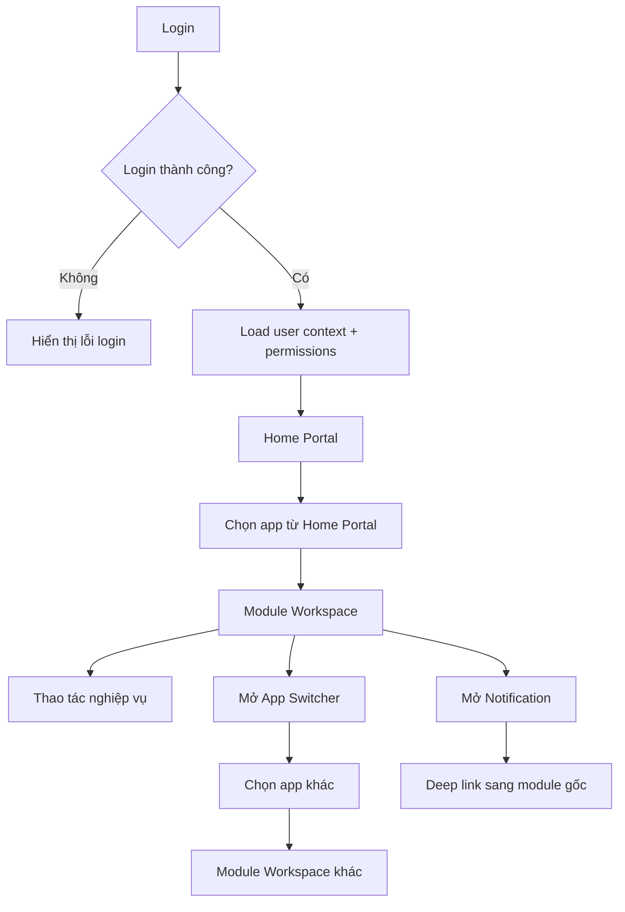

---

# PHẦN A: AUTH, HOME PORTAL, APP SWITCHER

---

## 8. UI03-FLOW-001: Login thành công vào Home Portal

### 8.1 Mục tiêu

Người dùng đăng nhập bằng email/mật khẩu hợp lệ và được đưa về Home Portal, nơi hiển thị các app/module mà người dùng có quyền truy cập.

### 8.2 Actor

EMP, MGR, HR, ADMIN, SA.

### 8.3 Entry point

```text
/login
```

### 8.4 Điều kiện bắt đầu

1. Người dùng chưa đăng nhập hoặc session đã hết hạn.
2. Người dùng có tài khoản active.
3. Company/tenant active.

### 8.5 Flow chính

| Bước | Actor | Màn hình | Hành động | Hệ thống xử lý | Kết quả UI |
| --- | --- | --- | --- | --- | --- |
| 1 | User | Login | Nhập email, password | Validate client-side required field | Enable nút Đăng nhập nếu hợp lệ cơ bản |
| 2 | User | Login | Bấm Đăng nhập | Gọi API login | Button loading |
| 3 | SYS | Backend | Xác thực tài khoản | Kiểm tra email/password/status/company | Trả access token + refresh token |
| 4 | FE | App shell | Nhận token | Lưu token theo policy bảo mật | Chuẩn bị load context |
| 5 | FE | App shell | Gọi user context | `GET /api/v1/auth/me` | Lấy user, employee, company |
| 6 | FE | App shell | Gọi quyền | `GET /api/v1/auth/me/permissions` | Lấy permissions + data scopes |
| 7 | FE | App shell | Gọi app registry | `GET /api/v1/foundation/modules/my-apps` nếu có | Lấy app được phép |
| 8 | FE | Home Portal | Redirect | Điều hướng `/home` | Hiển thị app grid theo quyền |

### 8.6 Flow phụ: có returnUrl

```text
User mở /leave/approvals khi chưa login
-> Redirect /login?returnUrl=/leave/approvals
-> Login thành công
-> Kiểm tra user có quyền route /leave/approvals
-> Nếu có quyền: redirect /leave/approvals
-> Nếu không có quyền: redirect /home hoặc /403
```

### 8.7 State UI

| State | Mô tả |
| --- | --- |
| Default | Form email/password, link quên mật khẩu |
| Loading | Nút Đăng nhập loading, disable form |
| Error invalid credentials | Hiển thị lỗi chung, không nói rõ email hay password sai |
| Account locked | Hiển thị thông báo tài khoản bị khóa, hướng dẫn liên hệ admin |
| Company inactive | Hiển thị thông báo công ty chưa được kích hoạt |
| Success | Redirect Home Portal |

### 8.8 API mapping

| Nghiệp vụ | API |
| --- | --- |
| Login | `POST /api/v1/auth/login` |
| Lấy user context | `GET /api/v1/auth/me` |
| Lấy quyền | `GET /api/v1/auth/me/permissions` |
| Lấy app theo quyền | `GET /api/v1/foundation/modules/my-apps` |
| Lấy unread count | `GET /api/v1/notifications/unread-count` |

### 8.9 Acceptance criteria

| Mã | Tiêu chí |
| --- | --- |
| UI03-AC-001 | Login thành công đưa user về `/home` nếu không có returnUrl |
| UI03-AC-002 | Home Portal chỉ hiển thị app user có quyền |
| UI03-AC-003 | User thiếu permission không thấy app tương ứng |
| UI03-AC-004 | Token/user context/permission phải load xong trước khi render app protected |
| UI03-AC-005 | Không render nhấp nháy app trái quyền trong lúc loading |

---

## 9. UI03-FLOW-002: Login lỗi, token hết hạn và logout

### 9.1 Login lỗi

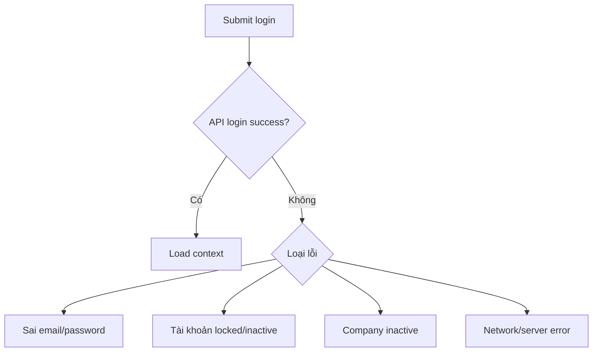

### 9.2 Token hết hạn

| Bước | Tình huống | Hành vi UI |
| --- | --- | --- |
| 1 | API trả 401 do access token hết hạn | FE gọi refresh token nếu có |
| 2 | Refresh thành công | Retry request đang bị lỗi một lần |
| 3 | Refresh thất bại | Clear auth state, redirect `/login` |
| 4 | User đang nhập form chưa lưu | Hiển thị cảnh báo session hết hạn nếu cần |

### 9.3 Logout

| Bước | Actor | Hành động | Kết quả |
| --- | --- | --- | --- |
| 1 | User | Mở avatar menu | Hiển thị Profile, Đổi mật khẩu, Đăng xuất |
| 2 | User | Bấm Đăng xuất | Confirm nếu đang có form dirty |
| 3 | FE | Gọi logout API | Clear token/local auth state |
| 4 | FE | Redirect | Về `/login` |

### 9.4 Acceptance criteria

| Mã | Tiêu chí |
| --- | --- |
| UI03-AC-006 | Login sai không tiết lộ email có tồn tại hay không |
| UI03-AC-007 | Token hết hạn refresh được thì user không bị văng khỏi màn hình |
| UI03-AC-008 | Refresh token lỗi thì redirect login rõ ràng |
| UI03-AC-009 | Logout clear toàn bộ context, permission, app registry cache của user |

---

## 10. UI03-FLOW-003: Mở app từ Home Portal

### 10.1 Mục tiêu

Người dùng từ Home Portal chọn một ứng dụng/module để vào Module Workspace tương ứng.

### 10.2 Entry point

```text
/home
```

### 10.3 Flow chính

| Bước | Actor | Màn hình | Hành động | Hệ thống xử lý | Kết quả UI |
| --- | --- | --- | --- | --- | --- |
| 1 | User | Home Portal | Xem app grid | FE render app theo app registry + permission | App card hiển thị theo quyền |
| 2 | User | Home Portal | Search app | FE lọc theo tên, module code, alias | Hiển thị kết quả search |
| 3 | User | Home Portal | Click app Chấm công | FE kiểm tra route meta + permission | Điều hướng `/attendance/today` hoặc `/attendance` |
| 4 | FE | Module Workspace | Load module layout | Load sidebar theo module + topbar | Hiển thị workspace |
| 5 | FE | Module screen | Load dữ liệu màn mặc định | Gọi API module gốc | Render nội dung |
| 6 | SYS | Foundation | Ghi recent app | `POST /api/v1/foundation/modules/{module_code}/open` nếu có | App xuất hiện trong Recent |

### 10.4 Route mặc định theo app

| App | Route mặc định đề xuất | Ghi chú |
| --- | --- | --- |
| Dashboard | `/dashboard` | Dashboard mặc định theo user |
| Nhân sự | `/hr` hoặc `/hr/employees` | Tùy permission |
| Chấm công | `/attendance/today` | Employee ưu tiên Today |
| Nghỉ phép | `/leave` hoặc `/leave/me/requests` | Employee ưu tiên đơn của tôi |
| Công việc | `/tasks/my-tasks` | Employee ưu tiên việc của tôi |
| Thông báo | `/notifications` | Danh sách thông báo của tôi |
| Hệ thống | `/system` | Admin/Super Admin |

### 10.5 Flow khi app bị ẩn/khóa

| Trường hợp | UI behavior |
| --- | --- |
| User không có permission module | Không hiển thị app |
| User có app từ cache cũ nhưng role vừa bị gỡ | Click app gọi route guard, hiển thị 403 và refresh permission |
| Module inactive | Hiển thị disabled state hoặc ẩn app theo policy |
| App coming soon | Card disabled, tooltip `Ứng dụng sẽ được triển khai ở giai đoạn sau` |

### 10.6 Acceptance criteria

| Mã | Tiêu chí |
| --- | --- |
| UI03-AC-010 | Home Portal app search hỗ trợ tên tiếng Việt, tiếng Anh, module code, alias |
| UI03-AC-011 | Click app luôn đi vào route mặc định mà user có quyền |
| UI03-AC-012 | Nếu user không có quyền route mặc định, hệ thống tìm route đầu tiên có quyền trong module |
| UI03-AC-013 | Nếu không có route nào có quyền, app không được hiển thị |
| UI03-AC-014 | Mở app cập nhật recent app nếu backend hỗ trợ |

---

## 11. UI03-FLOW-004: Đổi app bằng App Switcher

### 11.1 Mục tiêu

Người dùng đang ở bất kỳ màn hình protected nào có thể mở App Switcher để chuyển nhanh sang module khác mà không cần quay lại Home Portal.

### 11.2 Entry point

1. Nút **Ứng dụng** trên topbar.
2. Shortcut bàn phím nếu có.
3. Nút Home/App trên mobile nếu triển khai mobile web.

### 11.3 Flow chính

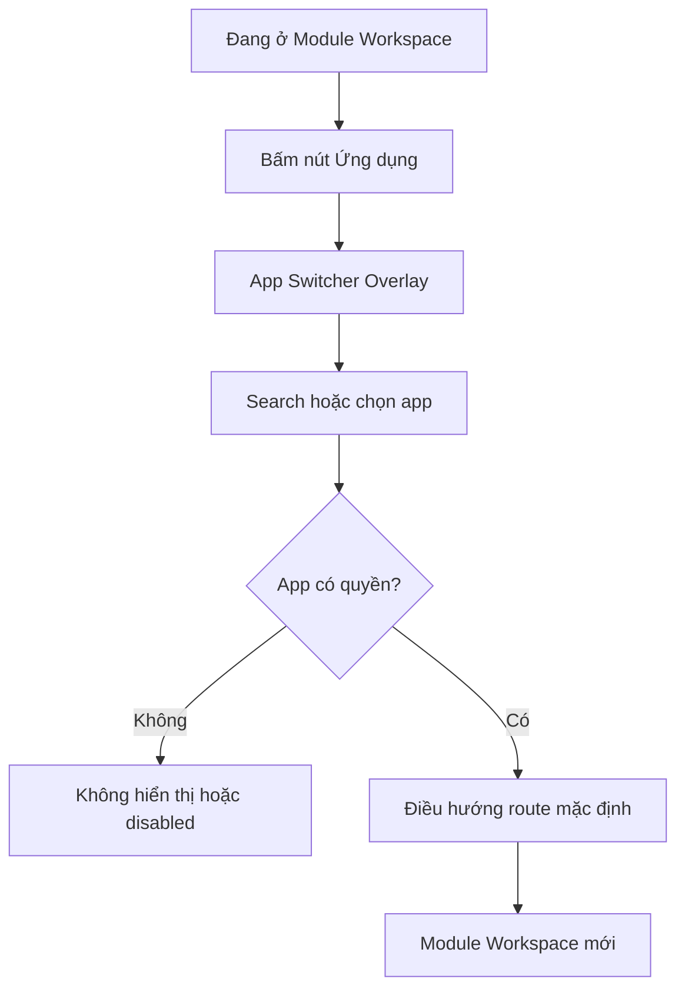

### 11.4 Flow chi tiết

| Bước | Actor | Màn hình | Hành động | Hệ thống xử lý | Kết quả UI |
| --- | --- | --- | --- | --- | --- |
| 1 | User | Module Workspace | Bấm `Ứng dụng` | FE mở App Switcher overlay | Overlay hiển thị trên màn hiện tại |
| 2 | FE | App Switcher | Load app list | Dùng app registry từ auth context/cache hoặc gọi API | App list theo quyền |
| 3 | User | App Switcher | Search `nghỉ` | FE lọc alias | Gợi ý LEAVE |
| 4 | User | App Switcher | Chọn LEAVE | Route guard kiểm tra permission | Điều hướng `/leave` hoặc route mặc định |
| 5 | FE | LEAVE Workspace | Đóng overlay | Load sidebar LEAVE + screen | User vào LEAVE |

### 11.5 Dirty form handling

Nếu user đang có form chưa lưu khi đổi app:

```text
User bấm App Switcher
-> Chọn app khác
-> FE phát hiện form dirty
-> Hiển thị confirm: "Bạn có thay đổi chưa lưu. Rời khỏi trang?"
-> Nếu Hủy: giữ nguyên màn hình
-> Nếu Đồng ý: điều hướng app mới
```

### 11.6 Acceptance criteria

| Mã | Tiêu chí |
| --- | --- |
| UI03-AC-015 | App Switcher mở được từ mọi màn hình protected |
| UI03-AC-016 | App Switcher không phá vỡ state màn hình nếu user bấm đóng overlay |
| UI03-AC-017 | Search app trả kết quả đúng theo alias |
| UI03-AC-018 | User không thấy app không có quyền |
| UI03-AC-019 | Deep route đổi app vẫn qua route guard |
| UI03-AC-020 | Form dirty phải cảnh báo trước khi rời màn hình |

---

# PHẦN B: ATTENDANCE FLOW

---

## 12. UI03-FLOW-005: Check-in / Check-out

### 12.1 Mục tiêu

Nhân viên check-in/check-out nhanh qua web/mobile, hệ thống kiểm tra rule chấm công, trạng thái hôm nay, đơn nghỉ approved, remote rule và quyền trước khi ghi nhận.

### 12.2 Actor

EMP là actor chính. MGR/HR/ADMIN có thể xem bảng công hoặc điều chỉnh công theo quyền nhưng không check-in thay nhân viên trong flow này.

### 12.3 Entry point

1. Home Portal app card `Chấm công`.
2. Dashboard widget `Chấm công hôm nay`.
3. Route `/attendance/today`.
4. Notification nhắc thiếu check-out deep link về `/attendance/today`.

### 12.4 Điều kiện bắt đầu

1. User đã login.
2. User liên kết với employee active/probation.
3. User có permission `ATT.ATTENDANCE.VIEW_OWN`.
4. User có permission `ATT.ATTENDANCE.CHECK_IN` hoặc `ATT.ATTENDANCE.CHECK_OUT` tương ứng.

### 12.5 Flow load trạng thái hôm nay

| Bước | Actor | Màn hình | Hành động | Hệ thống xử lý | Kết quả UI |
| --- | --- | --- | --- | --- | --- |
| 1 | User | `/attendance/today` | Mở màn hình | FE gọi `GET /api/v1/attendance/today` | Loading skeleton |
| 2 | SYS | ATT | Resolve employee | Kiểm tra employee, shift, rule, leave, remote | Trả status + allowed actions |
| 3 | FE | Today Attendance | Render trạng thái | Dựa vào `can_check_in`, `can_check_out`, status | Hiển thị nút phù hợp |

### 12.6 Flow check-in

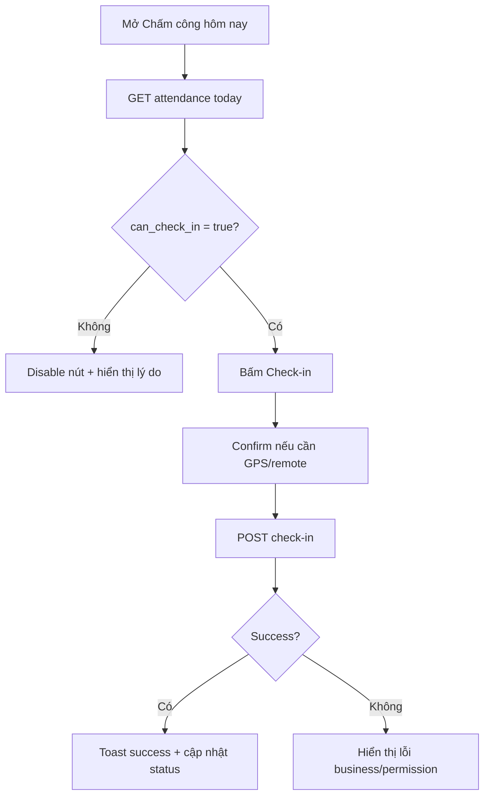

### 12.7 Flow check-out

| Bước | Actor | Hành động | API | Kết quả UI |
| --- | --- | --- | --- | --- |
| 1 | EMP | Mở `/attendance/today` | `GET /api/v1/attendance/today` | Hiển thị đã check-in, nút Check-out |
| 2 | EMP | Bấm Check-out | `POST /api/v1/attendance/check-out` | Button loading |
| 3 | SYS | Tính giờ làm, đi muộn/về sớm/thiếu giờ | ATT xử lý | Trả attendance record cập nhật |
| 4 | FE | Render success | Refresh today status | Toast `Check-out thành công` |

### 12.8 Business state cần hiển thị

| Trạng thái backend | UI behavior |
| --- | --- |
| Chưa check-in | Hiển thị nút Check-in |
| Đã check-in, chưa check-out | Hiển thị nút Check-out |
| Đã check-out | Hiển thị trạng thái hoàn tất ngày công |
| Có đơn nghỉ full-day approved | Disable check-in/check-out, hiển thị lý do `Bạn đã có đơn nghỉ phép được duyệt hôm nay` |
| Nghỉ nửa ngày/theo giờ | Hiển thị thông tin leave ảnh hưởng required working minutes |
| Remote approved tự động chấm công | Hiển thị trạng thái Remote/Auto attendance |
| Không có ca làm hôm nay | Hiển thị empty/info state |
| Thiếu quyền | Forbidden state |
| Thiếu GPS nếu rule yêu cầu | Yêu cầu bật quyền vị trí |

### 12.9 API mapping

| Nghiệp vụ | API |
| --- | --- |
| Lấy trạng thái hôm nay | `GET /api/v1/attendance/today` |
| Check-in | `POST /api/v1/attendance/check-in` |
| Check-out | `POST /api/v1/attendance/check-out` |
| Xem bảng công của tôi | `GET /api/v1/attendance/my-records` |
| Xem chi tiết ngày công | `GET /api/v1/attendance/records/{record_id}` |

### 12.10 Acceptance criteria

| Mã | Tiêu chí |
| --- | --- |
| UI03-AC-021 | Màn hình Today hiển thị đúng nút Check-in/Check-out theo backend allowed actions |
| UI03-AC-022 | Không cho check-in khi backend báo có nghỉ phép full-day approved |
| UI03-AC-023 | Sau check-in/check-out thành công, UI cập nhật ngay không cần reload toàn trang |
| UI03-AC-024 | Nếu check-in/check-out lỗi business rule, UI hiển thị lý do rõ ràng |
| UI03-AC-025 | Check-in/check-out không dùng giờ client để tính công, chỉ hiển thị giờ server trả về |

---

## 13. UI03-FLOW-006: Xem bảng công cá nhân

### 13.1 Mục tiêu

Employee xem bảng công cá nhân theo tháng/khoảng ngày, có thể mở chi tiết từng ngày công và gửi yêu cầu điều chỉnh công nếu phát hiện sai.

### 13.2 Flow chính

| Bước | Actor | Màn hình | Hành động | API | Kết quả UI |
| --- | --- | --- | --- | --- | --- |
| 1 | EMP | ATT Sidebar | Click `Bảng công của tôi` | `GET /api/v1/attendance/my-records` | Table bảng công |
| 2 | EMP | Bảng công | Lọc tháng/năm/status | API list có filter | Cập nhật table |
| 3 | EMP | Bảng công | Click một ngày công | `GET /api/v1/attendance/records/{id}` | Mở detail drawer/page |
| 4 | EMP | Detail | Bấm `Gửi điều chỉnh` nếu có quyền | Điều hướng `/attendance/adjustment-requests/new` | Form điều chỉnh |

### 13.3 State UI

| State | Nội dung |
| --- | --- |
| Empty | `Chưa có dữ liệu chấm công trong kỳ này.` |
| No scope | Không áp dụng với bảng công cá nhân, nếu lỗi thì xem lại employee mapping |
| Forbidden | `Bạn không có quyền xem bảng công cá nhân.` |
| Error | `Không tải được bảng công. Vui lòng thử lại.` |

### 13.4 Acceptance criteria

| Mã | Tiêu chí |
| --- | --- |
| UI03-AC-026 | Bảng công cá nhân chỉ hiển thị dữ liệu Own |
| UI03-AC-027 | Filter tháng/năm/status không làm mất route context |
| UI03-AC-028 | Detail ngày công hiển thị check-in, check-out, log, trạng thái và lý do nếu có |
| UI03-AC-029 | Nút gửi điều chỉnh chỉ hiển thị khi có permission `ATT.ADJUSTMENT.CREATE` |

---

# PHẦN C: LEAVE FLOW

---

## 14. UI03-FLOW-007: Tạo đơn nghỉ phép

### 14.1 Mục tiêu

Employee tạo đơn nghỉ phép từ module LEAVE, hệ thống hỗ trợ xem số dư phép, chọn loại nghỉ, ngày nghỉ, duration, lý do, bàn giao và preview số ngày nghỉ trước khi gửi.

### 14.2 Actor

EMP là actor chính.

### 14.3 Entry point

1. Home Portal app `Nghỉ phép`.
2. Dashboard quick action `Tạo đơn nghỉ`.
3. Route `/leave/requests/new`.
4. Notification hoặc widget số dư phép deep link.

### 14.4 Flow chính

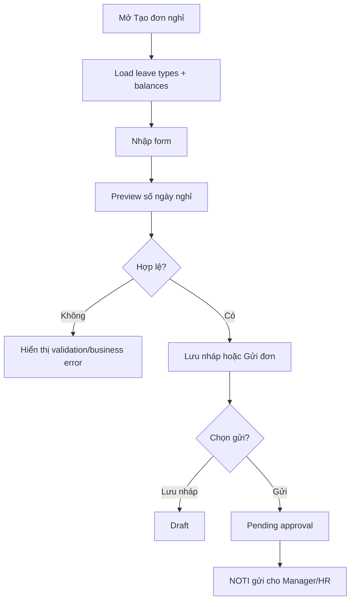

### 14.5 Flow chi tiết

| Bước | Actor | Màn hình | Hành động | Hệ thống xử lý | Kết quả UI |
| --- | --- | --- | --- | --- | --- |
| 1 | EMP | `/leave/requests/new` | Mở form | Load leave types, balances, policy cơ bản | Form ready |
| 2 | EMP | Form | Chọn loại nghỉ | UI cập nhật balance còn lại | Hiển thị số ngày còn |
| 3 | EMP | Form | Chọn start/end/date/time | Gọi preview calculation nếu có | Hiển thị số ngày/giờ nghỉ |
| 4 | EMP | Form | Nhập lý do/bàn giao/file | Validate required fields | Form valid/invalid |
| 5 | EMP | Form | Bấm Lưu nháp | `POST /api/v1/leave/requests/draft` hoặc save draft API tương ứng | Toast success, status Draft |
| 6 | EMP | Form | Bấm Gửi đơn | `POST /api/v1/leave/requests` hoặc submit sau draft | Status Pending |
| 7 | SYS | LEAVE/NOTI | Phát event | `LEAVE_REQUEST_SUBMITTED` | Manager/HR nhận thông báo |

### 14.6 Field form đề xuất

| Field | Bắt buộc | Ghi chú UX |
| --- | --- | --- |
| Leave type | Có | Dropdown loại nghỉ active |
| Duration type | Có | Full day, half day, hourly, multiple days |
| Start date | Có | Date picker |
| End date | Có nếu multiple/full-day | Date picker |
| Start time/end time | Có nếu hourly | Time picker |
| Half day session | Có nếu half-day | Morning/Afternoon |
| Reason | Có/không tùy policy | Textarea |
| Handover note | Có thể bắt buộc nếu nghỉ nhiều ngày | Textarea |
| Attachment | Tùy loại nghỉ | Upload qua file service |
| Approver preview | Optional | Hiển thị người duyệt dự kiến |

### 14.7 Validation cần hiển thị

| Rule | UI message gợi ý |
| --- | --- |
| Thiếu loại nghỉ | `Vui lòng chọn loại nghỉ.` |
| Thiếu ngày bắt đầu | `Vui lòng chọn ngày bắt đầu nghỉ.` |
| Ngày kết thúc trước ngày bắt đầu | `Ngày kết thúc không được nhỏ hơn ngày bắt đầu.` |
| Vượt số dư phép | `Số ngày nghỉ vượt quá số phép còn lại.` |
| Trùng đơn nghỉ đã có | `Bạn đã có đơn nghỉ trong khoảng thời gian này.` |
| Ngày nghỉ không phải ngày làm việc | `Khoảng thời gian này không tính là ngày làm việc theo chính sách.` |
| Thiếu file chứng minh | `Vui lòng đính kèm tài liệu theo yêu cầu của loại nghỉ.` |

### 14.8 API mapping

| Nghiệp vụ | API |
| --- | --- |
| Lấy số dư phép của tôi | `GET /api/v1/leave/me/balances` |
| Tạo đơn nghỉ | `POST /api/v1/leave/requests` |
| Lưu nháp đơn nghỉ | `POST /api/v1/leave/requests/draft` |
| Gửi đơn nghỉ | `POST /api/v1/leave/requests/{request_id}/submit` |
| Xem đơn nghỉ của tôi | `GET /api/v1/leave/me/requests` |
| Xem chi tiết đơn nghỉ | `GET /api/v1/leave/requests/{request_id}` |

### 14.9 Acceptance criteria

| Mã | Tiêu chí |
| --- | --- |
| UI03-AC-030 | Employee có quyền tạo đơn mới thấy nút `Tạo đơn nghỉ` |
| UI03-AC-031 | Form hiển thị số dư phép tương ứng loại nghỉ |
| UI03-AC-032 | Có thể lưu nháp nếu thiếu một số thông tin chưa bắt buộc ở trạng thái Draft |
| UI03-AC-033 | Khi gửi đơn, bắt buộc validate đầy đủ theo policy |
| UI03-AC-034 | Gửi đơn thành công chuyển trạng thái Pending và có timeline/log |
| UI03-AC-035 | Sau gửi đơn, Manager/HR nhận notification theo flow NOTI |

---

## 15. UI03-FLOW-008: Lưu nháp, gửi và theo dõi đơn nghỉ

### 15.1 Mục tiêu

Employee quản lý vòng đời đơn nghỉ của chính mình: Draft -> Pending -> Approved/Rejected/Cancelled.

### 15.2 State machine đơn nghỉ MVP

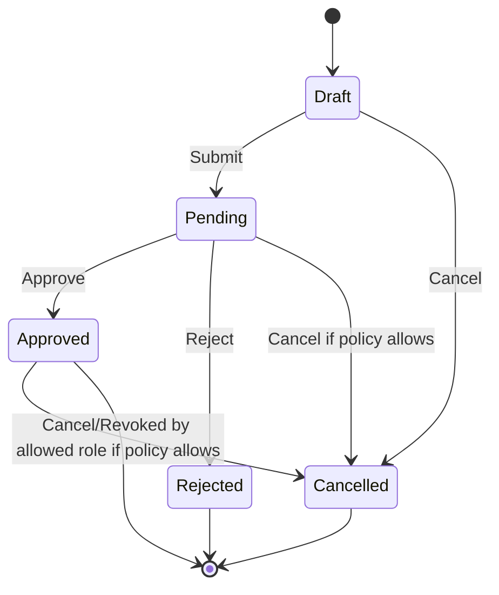

### 15.3 Flow danh sách đơn của tôi

| Bước | Actor | Màn hình | Hành động | API | Kết quả UI |
| --- | --- | --- | --- | --- | --- |
| 1 | EMP | `/leave/me/requests` | Mở danh sách | `GET /api/v1/leave/me/requests` | Table/card danh sách |
| 2 | EMP | Danh sách | Filter status/date/type | API list filter | Cập nhật danh sách |
| 3 | EMP | Danh sách | Click đơn | `GET /api/v1/leave/requests/{id}` | Detail page/drawer |
| 4 | EMP | Detail | Nếu Draft: bấm Sửa/Gửi | API update/submit | Status cập nhật |
| 5 | EMP | Detail | Nếu policy cho phép: Hủy | `POST /api/v1/leave/requests/{id}/cancel` | Status Cancelled |

### 15.4 UI detail đơn nghỉ

Detail nên có:

1. Header: mã đơn, trạng thái, loại nghỉ.
2. Thông tin thời gian nghỉ.
3. Số ngày/giờ tính phép.
4. Lý do, bàn giao, file đính kèm.
5. Người duyệt dự kiến/đã duyệt.
6. Timeline xử lý.
7. Action theo trạng thái: Sửa, Gửi, Hủy, In/Xuất nếu có quyền.

### 15.5 Acceptance criteria

| Mã | Tiêu chí |
| --- | --- |
| UI03-AC-036 | Danh sách đơn của tôi chỉ hiển thị đơn của employee hiện tại |
| UI03-AC-037 | Status badge phân biệt rõ Draft, Pending, Approved, Rejected, Cancelled |
| UI03-AC-038 | Action trên detail thay đổi theo status và permission |
| UI03-AC-039 | Hủy đơn phải có confirm và reason nếu backend yêu cầu |
| UI03-AC-040 | Đơn Approved khi bị hủy/thu hồi phải hiển thị thông tin đồng bộ lại ATT nếu có |

---

## 16. UI03-FLOW-010: Duyệt / từ chối đơn nghỉ

### 16.1 Mục tiêu

Manager/HR xem danh sách đơn nghỉ đang chờ duyệt trong phạm vi quyền, mở chi tiết, duyệt hoặc từ chối kèm ghi chú.

### 16.2 Actor

MGR, HR, ADMIN.

### 16.3 Entry point

1. Dashboard widget `Đơn nghỉ chờ duyệt`.
2. Notification `Bạn có một đơn nghỉ cần duyệt`.
3. Sidebar LEAVE -> `Duyệt đơn nghỉ`.
4. Route `/leave/approvals`.

### 16.4 Flow chính

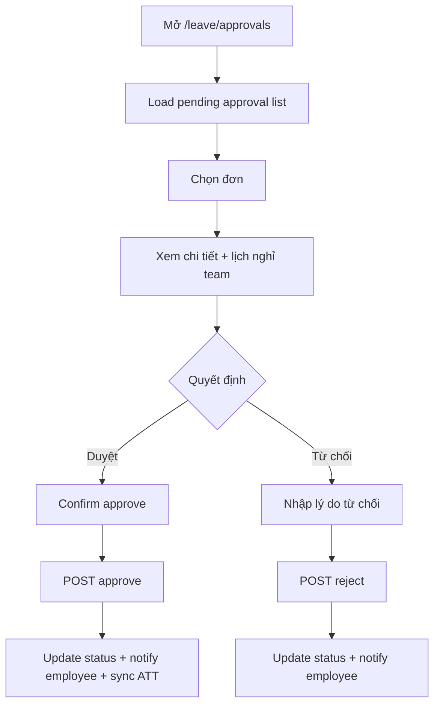

### 16.5 Flow chi tiết

| Bước | Actor | Màn hình | Hành động | API | Kết quả UI |
| --- | --- | --- | --- | --- | --- |
| 1 | MGR/HR | `/leave/approvals` | Mở danh sách | `GET /api/v1/leave/requests/pending-approval` | Danh sách Pending theo scope |
| 2 | MGR/HR | List | Filter employee/date/type | API filter | Cập nhật danh sách |
| 3 | MGR/HR | List | Click đơn | `GET /api/v1/leave/requests/{id}` | Detail |
| 4 | MGR/HR | Detail | Xem số dư, lịch nghỉ team, bàn giao | API detail + calendar nếu cần | Thông tin ra quyết định |
| 5A | MGR/HR | Detail | Bấm Duyệt | `POST /api/v1/leave/requests/{id}/approve` | Status Approved |
| 5B | MGR/HR | Detail | Bấm Từ chối | `POST /api/v1/leave/requests/{id}/reject` | Status Rejected |
| 6 | SYS | LEAVE/ATT/NOTI | Sau xử lý | Sync ATT nếu Approved, gửi NOTI | Employee nhận kết quả |

### 16.6 UI duyệt đơn

| Thành phần | Mục đích |
| --- | --- |
| Summary card | Hiển thị nhân viên, phòng ban, loại nghỉ, thời gian, số ngày |
| Balance card | Số phép còn lại, số ngày dự kiến trừ |
| Conflict warning | Cảnh báo team đang thiếu người, trùng lịch nghỉ nếu backend hỗ trợ |
| Handover note | Xem nội dung bàn giao |
| File attachments | Xem tài liệu chứng minh nếu có quyền |
| Approval box | Duyệt/Từ chối, comment/rejection reason |
| Timeline | Lịch sử tạo, gửi, duyệt/từ chối |

### 16.7 Acceptance criteria

| Mã | Tiêu chí |
| --- | --- |
| UI03-AC-041 | Manager chỉ thấy đơn trong Team scope |
| UI03-AC-042 | HR có quyền Company scope thấy đơn toàn công ty |
| UI03-AC-043 | Nút Duyệt/Từ chối chỉ hiển thị khi đơn Pending và user có permission tương ứng |
| UI03-AC-044 | Từ chối bắt buộc nhập lý do nếu policy yêu cầu |
| UI03-AC-045 | Duyệt thành công cập nhật status, timeline và gửi notification cho Employee |
| UI03-AC-046 | Duyệt đơn nghỉ full-day Approved phải khiến ATT chặn/tính lại chấm công theo rule |

---

# PHẦN D: TASK FLOW

---

## 17. UI03-FLOW-011: Xem task của tôi

### 17.1 Mục tiêu

Employee/Manager xem danh sách task được giao, task đang làm, quá hạn, sắp đến hạn, mở chi tiết task và cập nhật tiến độ.

### 17.2 Actor

EMP, MGR, Project Manager, HR nếu có task nội bộ.

### 17.3 Entry point

1. Home Portal app `Công việc`.
2. Dashboard widget `Task của tôi`.
3. Notification `Bạn được giao task mới`.
4. Route `/tasks/my-tasks`.

### 17.4 Flow chính

| Bước | Actor | Màn hình | Hành động | API | Kết quả UI |
| --- | --- | --- | --- | --- | --- |
| 1 | User | `/tasks/my-tasks` | Mở danh sách | `GET /api/v1/tasks/my-tasks` | List/table/card |
| 2 | User | My Tasks | Filter status/priority/due date | API filter | Cập nhật danh sách |
| 3 | User | My Tasks | Click task | `GET /api/v1/tasks/{task_id}` | Task detail |
| 4 | User | Task detail | Xem mô tả, assignee, deadline, checklist, comment | Load detail data | Ready |

### 17.5 UI list task

| Thành phần | Mô tả |
| --- | --- |
| Filter tabs | Tất cả, Hôm nay, Quá hạn, Sắp đến hạn, Đang làm, Chờ review |
| Search | Tìm theo tên/mã task |
| Sort | Deadline, priority, updated_at |
| Task card/table row | Tên task, project, assignee, priority, status, deadline, comment count |
| Empty state | `Bạn chưa có task nào trong bộ lọc này.` |

### 17.6 Acceptance criteria

| Mã | Tiêu chí |
| --- | --- |
| UI03-AC-047 | My Tasks chỉ hiển thị task thuộc scope của user |
| UI03-AC-048 | Task quá hạn và sắp đến hạn phải có badge rõ ràng |
| UI03-AC-049 | Click task từ list, dashboard hoặc notification đều vào cùng detail route |
| UI03-AC-050 | Nếu user không còn quyền xem task sau khi nhận notification, detail hiển thị forbidden |

---

## 18. UI03-FLOW-012: Cập nhật trạng thái task

### 18.1 Mục tiêu

Người có quyền cập nhật trạng thái task chuyển task qua các trạng thái Todo, In Progress, In Review, Done, Cancelled.

### 18.2 State machine task MVP

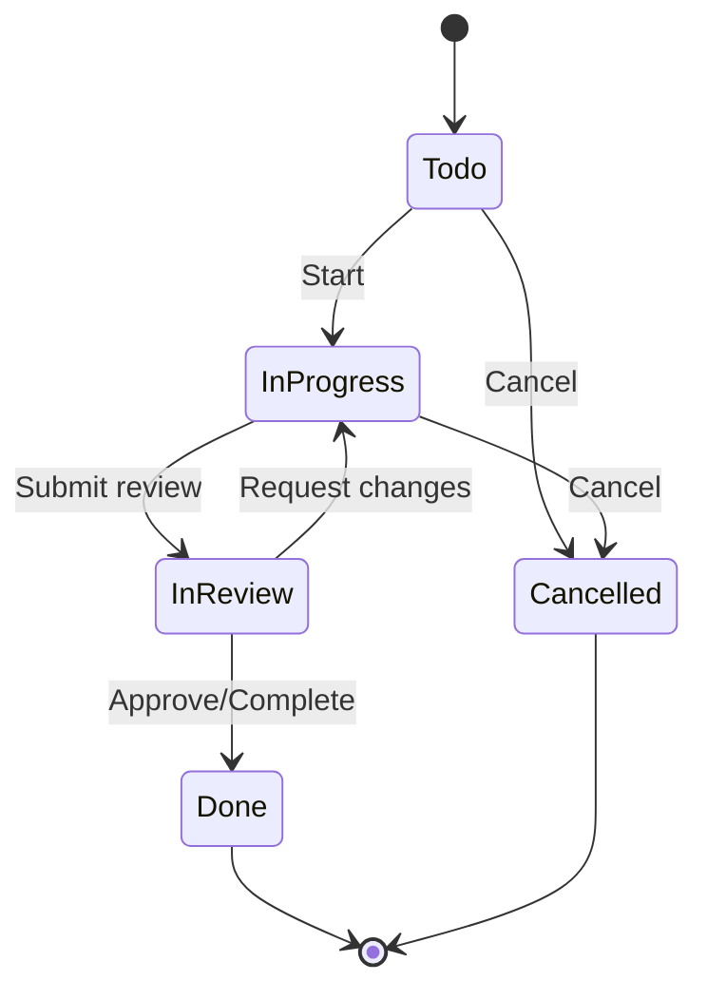

### 18.3 Flow chính

| Bước | Actor | Màn hình | Hành động | API | Kết quả UI |
| --- | --- | --- | --- | --- | --- |
| 1 | User | Task Detail | Mở task | `GET /api/v1/tasks/{task_id}` | Hiển thị allowed actions |
| 2 | User | Task Detail | Bấm đổi status | `PATCH /api/v1/tasks/{task_id}` hoặc status endpoint | Button loading |
| 3 | SYS | TASK | Validate permission + state transition | Update task, activity log, event | Trả task mới |
| 4 | FE | Task Detail | Render status mới | Cập nhật badge, timeline | Toast success |
| 5 | SYS | NOTI | Nếu cần | Event `TASK_STATUS_CHANGED` | Người liên quan nhận notification |

### 18.4 Business rule UI cần hỗ trợ

| Rule | UI behavior |
| --- | --- |
| Task Done không cho sửa status nếu thiếu quyền reopen | Disable action |
| Assignee chỉ được update task của mình nếu policy cho phép | Hiển thị action theo allowed_actions |
| Project archived | Disable update, hiển thị banner `Dự án đã lưu trữ` |
| Deadline nằm trong kỳ nghỉ của assignee | Hiển thị warning khi tạo/giao task nếu backend có dữ liệu |
| Task cần checklist hoàn tất trước Done | Disable Done hoặc show validation |

### 18.5 Acceptance criteria

| Mã | Tiêu chí |
| --- | --- |
| UI03-AC-051 | Status action hiển thị theo permission và allowed state transition |
| UI03-AC-052 | Update status thành công ghi activity log hiển thị trong detail |
| UI03-AC-053 | Nếu status update phát notification, recipient thấy notification mới |
| UI03-AC-054 | UI xử lý optimistic update cẩn thận; nếu API lỗi phải rollback state |

---

## 19. UI03-FLOW-013: Tạo / giao task

### 19.1 Mục tiêu

Manager/Project Owner tạo task mới, gán người phụ trách, deadline, priority, checklist/file nếu cần.

### 19.2 Actor

MGR, Project Manager, HR, ADMIN tùy permission.

### 19.3 Entry point

1. `/tasks/new`.
2. `/tasks/projects/{project_id}` -> nút `Tạo task`.
3. Kanban board -> nút `+ Task`.
4. Dashboard quick action `Tạo task` nếu có quyền.

### 19.4 Flow chính

| Bước | Actor | Màn hình | Hành động | Hệ thống xử lý | Kết quả UI |
| --- | --- | --- | --- | --- | --- |
| 1 | MGR | Task list/Kanban | Bấm `Tạo task` | FE mở form page/modal/drawer | Form task |
| 2 | MGR | Form | Nhập title, project, assignee, deadline | Validate required fields | Form valid |
| 3 | FE | Form | Chọn assignee | Check employee active, scope, project member nếu backend hỗ trợ | Hiển thị warning nếu không hợp lệ |
| 4 | MGR | Form | Submit | `POST /api/v1/tasks` | Tạo task |
| 5 | SYS | TASK/NOTI | Phát event | `TASK_ASSIGNED` nếu có assignee | Assignee nhận notification |
| 6 | FE | UI | Redirect detail hoặc giữ board | Toast success | Task xuất hiện |

### 19.5 Field form đề xuất

| Field | Bắt buộc | Ghi chú |
| --- | --- | --- |
| Title | Có | Tên task ngắn gọn |
| Description | Không | Rich text/textarea |
| Project | Tùy cấu hình | Có thể task cá nhân nếu cho phép |
| Assignee | Có/không tùy policy | Có thể nhiều assignee nếu hệ thống bật |
| Priority | Có mặc định Medium | Low/Medium/High/Urgent |
| Deadline | Nên có | Date/time picker |
| Checklist | Optional | Thêm nhanh checklist |
| File | Optional | Upload qua file service |
| Watchers | Optional | Người theo dõi |

### 19.6 Acceptance criteria

| Mã | Tiêu chí |
| --- | --- |
| UI03-AC-055 | Nút tạo task chỉ hiển thị khi có `TASK.TASK.CREATE` |
| UI03-AC-056 | Chỉ cho chọn assignee trong phạm vi quyền/project/team hợp lệ |
| UI03-AC-057 | Tạo task có assignee phải gửi notification `TASK_ASSIGNED` |
| UI03-AC-058 | Task mới xuất hiện ngay trong list/Kanban đúng status |

---

## 20. UI03-FLOW-014: Comment / mention trong task

### 20.1 Mục tiêu

Người dùng trao đổi trong task, mention người liên quan và hệ thống gửi notification cho người được mention.

### 20.2 Flow chính

| Bước | Actor | Màn hình | Hành động | API | Kết quả UI |
| --- | --- | --- | --- | --- | --- |
| 1 | User | Task Detail | Mở tab/comment section | Load comments | Comment thread |
| 2 | User | Comment box | Nhập nội dung, mention `@A` | FE gợi ý user có quyền trong project/company | Comment draft |
| 3 | User | Comment box | Submit | `POST /api/v1/tasks/{task_id}/comments` | Comment mới xuất hiện |
| 4 | SYS | TASK/NOTI | Parse mentions | Event `TASK_COMMENT_CREATED`, `TASK_MENTIONED` | Người liên quan nhận notification |

### 20.3 UI state

| State | Mô tả |
| --- | --- |
| Empty comments | `Chưa có bình luận nào.` |
| Sending | Comment hiển thị trạng thái đang gửi |
| Failed | Comment có nút gửi lại/xóa draft |
| Mention forbidden | Không gợi ý user ngoài scope nếu không có quyền |

### 20.4 Acceptance criteria

| Mã | Tiêu chí |
| --- | --- |
| UI03-AC-059 | Comment mới được append vào thread sau khi API success |
| UI03-AC-060 | Mention user phải tạo notification cho recipient hợp lệ |
| UI03-AC-061 | User không có quyền xem task không được nhận deep link xem nội dung nhạy cảm |
| UI03-AC-062 | Notification payload comment không chứa dữ liệu nhạy cảm quá mức |

---

# PHẦN E: NOTIFICATION FLOW

---

## 21. UI03-FLOW-015: Notification dropdown và unread count

### 21.1 Mục tiêu

Người dùng thấy badge số thông báo chưa đọc trên topbar, mở dropdown để xem thông báo mới nhất và đi tới trang danh sách thông báo nếu cần.

### 21.2 Actor

Mọi user có permission `NOTI.NOTIFICATION.VIEW_OWN`.

### 21.3 Entry point

Nút chuông thông báo trên topbar.

### 21.4 Flow chính

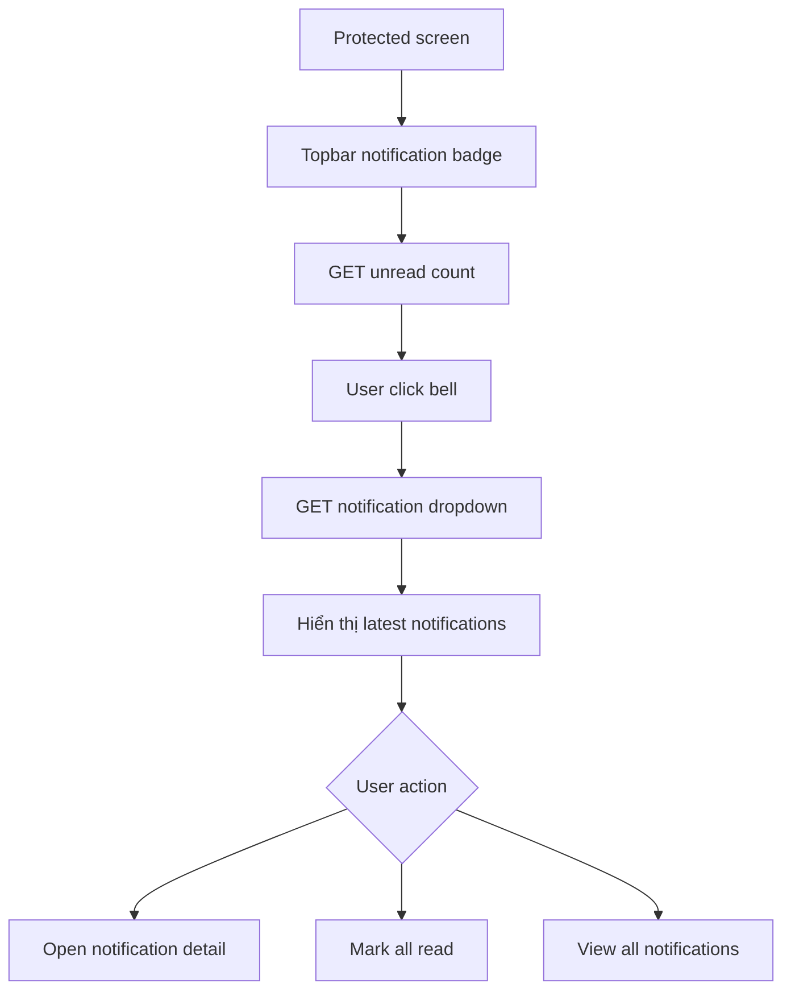

### 21.5 Flow chi tiết

| Bước | Actor | Màn hình | Hành động | API | Kết quả UI |
| --- | --- | --- | --- | --- | --- |
| 1 | FE | Topbar | Load protected layout | `GET /api/v1/notifications/unread-count` | Badge count |
| 2 | User | Topbar | Click bell | `GET /api/v1/notifications/dropdown` | Dropdown list |
| 3 | User | Dropdown | Click notification | `GET /api/v1/notifications/{id}` hoặc deep link target | Mở detail/deep link |
| 4 | User | Dropdown | Click `Đánh dấu tất cả đã đọc` | `POST /api/v1/notifications/mark-all-read` | Badge về 0 |
| 5 | User | Dropdown | Click `Xem tất cả` | Điều hướng `/notifications` | Notification Workspace |

### 21.6 UI dropdown

| Thành phần | Mô tả |
| --- | --- |
| Header | `Thông báo`, unread count, mark all read |
| List item | Icon module, title, short message, time, unread dot |
| Empty | `Bạn chưa có thông báo mới.` |
| Footer | `Xem tất cả thông báo` |
| Error | `Không tải được thông báo. Thử lại.` |

### 21.7 Acceptance criteria

| Mã | Tiêu chí |
| --- | --- |
| UI03-AC-063 | Badge chỉ hiển thị nếu user có quyền NOTI own |
| UI03-AC-064 | Unread count không tính hidden/deleted/archived |
| UI03-AC-065 | Dropdown giới hạn số item để tránh tải nặng |
| UI03-AC-066 | Mark all read chỉ áp dụng notification của user hiện tại |
| UI03-AC-067 | Nếu không có permission NOTI, topbar không hiển thị chuông hoặc hiển thị disabled theo policy |

---

## 22. UI03-FLOW-016: Notification detail, mark read và deep link

### 22.1 Mục tiêu

Người dùng mở một notification, notification được đánh dấu đã đọc nếu hợp lệ, sau đó có thể điều hướng an toàn sang module nghiệp vụ gốc.

### 22.2 Flow chính

| Bước | Actor | Màn hình | Hành động | API | Kết quả UI |
| --- | --- | --- | --- | --- | --- |
| 1 | User | Dropdown/List | Click notification | `GET /api/v1/notifications/{id}` | Detail/target info |
| 2 | SYS | NOTI | Kiểm tra owner | Chỉ user nhận notification được xem | Detail |
| 3 | SYS | NOTI | Auto mark read nếu policy bật | Update read_at | Badge giảm |
| 4 | User | Detail | Click `Mở chi tiết` | Điều hướng target route | Module gốc kiểm tra quyền |
| 5 | Module gốc | Target screen | Load entity | API module gốc kiểm tra permission/scope | Hiển thị hoặc 403 |

### 22.3 Deep link target examples

| Notification event | Target route | Module kiểm tra lại |
| --- | --- | --- |
| `LEAVE_REQUEST_SUBMITTED` | `/leave/approvals` hoặc `/leave/requests/{id}` | LEAVE |
| `LEAVE_REQUEST_APPROVED` | `/leave/requests/{id}` | LEAVE |
| `ATT_ADJUSTMENT_SUBMITTED` | `/attendance/adjustment-requests/{id}` | ATT |
| `TASK_ASSIGNED` | `/tasks/{task_id}` | TASK |
| `TASK_MENTIONED` | `/tasks/{task_id}` | TASK |
| `ATT_MISSING_CHECKOUT` | `/attendance/today` | ATT |
| `HR_PROFILE_CHANGE_SUBMITTED` | `/hr/profile-change-requests/{id}` | HR |

### 22.4 Security rule

Notification chỉ là lớp thông báo và điều hướng. Khi user click target:

```text
NOTI không quyết định user có được xem entity gốc hay không.
Module gốc phải kiểm tra lại permission + data scope + business rule.
```

Nếu user nhận notification nhưng sau đó bị gỡ quyền:

```text
Click notification
-> Điều hướng target route
-> Route guard/API module gốc trả 403
-> UI hiển thị forbidden state
```

### 22.5 Acceptance criteria

| Mã | Tiêu chí |
| --- | --- |
| UI03-AC-068 | User chỉ xem được notification của chính mình |
| UI03-AC-069 | Click notification unread chuyển sang read nếu auto_mark_read bật |
| UI03-AC-070 | Deep link luôn đi qua route guard và API guard của module gốc |
| UI03-AC-071 | Notification không chứa dữ liệu nhạy cảm vượt mức cần thiết |
| UI03-AC-072 | Nếu target entity bị xóa/mất quyền, UI hiển thị 404/403 thân thiện |

---

# PHẦN F: FLOW LIÊN MODULE

---

## 23. Flow liên module: Leave Approved -> Attendance cập nhật -> Notification gửi Employee

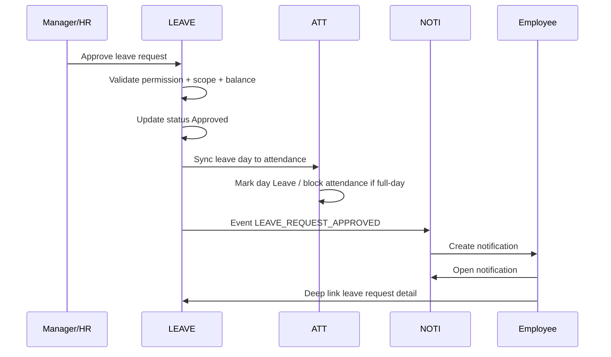

### UI impact

| Khu vực | Cập nhật |
| --- | --- |
| Employee leave detail | Status Approved, timeline cập nhật |
| Employee attendance today | Nếu ngày hôm nay là ngày nghỉ approved, disable check-in/out |
| Manager dashboard | Pending approval count giảm |
| Notification badge | Employee tăng unread count |
| Leave calendar | Hiển thị ngày nghỉ approved |

---

## 24. Flow liên module: Task assigned -> Notification -> User mở task

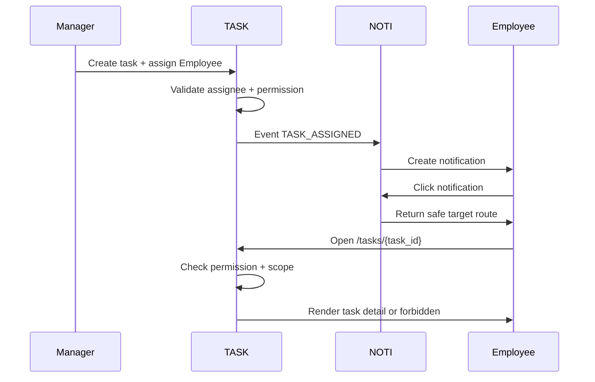

---

## 25. Flow liên module: Missing checkout reminder

```text
SYS ATT job phát hiện nhân viên thiếu check-out
-> ATT phát event ATT_MISSING_CHECKOUT
-> NOTI tạo notification cho Employee
-> Employee click notification
-> Điều hướng /attendance/today
-> ATT hiển thị trạng thái thiếu check-out và action được phép
```

---

# PHẦN G: ROLE-BASED USER JOURNEY MVP

---

## 26. Employee journey trong một ngày làm việc

```text
Login
-> Home Portal
-> Chấm công
-> Check-in
-> Công việc
-> Xem task của tôi
-> Cập nhật task / comment
-> Nghỉ phép
-> Tạo đơn nghỉ nếu cần
-> Notification
-> Xem kết quả duyệt nghỉ hoặc task được mention
-> Chấm công
-> Check-out
```

### App ưu tiên cho Employee

| Thứ tự | App | Lý do |
| --- | --- | --- |
| 1 | Chấm công | Nhu cầu hằng ngày |
| 2 | Công việc | Xem task được giao |
| 3 | Nghỉ phép | Xin nghỉ, xem số dư phép |
| 4 | Thông báo | Nhận kết quả và nhắc việc |
| 5 | Dashboard | Tổng quan cá nhân |
| 6 | Hồ sơ của tôi | Xem/cập nhật thông tin cá nhân nếu có quyền |

---

## 27. Manager journey trong ngày

```text
Login
-> Home Portal
-> Dashboard Manager
-> Xem đơn nghỉ chờ duyệt
-> Mở LEAVE approvals
-> Duyệt/từ chối đơn nghỉ
-> Công việc
-> Tạo task/giao task
-> Kanban/Task team
-> Chấm công team
-> Xem bất thường hoặc điều chỉnh công cần duyệt
-> Notification
```

### App ưu tiên cho Manager

| Thứ tự | App | Lý do |
| --- | --- | --- |
| 1 | Dashboard | Nắm nhanh team |
| 2 | Công việc | Giao việc, theo dõi tiến độ |
| 3 | Nghỉ phép | Duyệt đơn team |
| 4 | Chấm công | Xem bảng công/bất thường team |
| 5 | Nhân sự team | Xem hồ sơ nhân viên thuộc phạm vi |
| 6 | Thông báo | Nhận việc cần xử lý |

---

## 28. HR journey trong ngày

```text
Login
-> Home Portal
-> Nhân sự
-> Xem nhân viên/hợp đồng/yêu cầu cập nhật hồ sơ
-> Chấm công
-> Xem bảng công công ty / xử lý điều chỉnh
-> Nghỉ phép
-> Xem đơn toàn công ty / lịch nghỉ
-> Dashboard HR
-> Notification
```

### App ưu tiên cho HR

| Thứ tự | App | Lý do |
| --- | --- | --- |
| 1 | Nhân sự | Quản lý hồ sơ nhân viên |
| 2 | Chấm công | Kiểm soát bảng công |
| 3 | Nghỉ phép | Kiểm soát đơn nghỉ và số dư phép |
| 4 | Dashboard HR | Cảnh báo và tổng quan |
| 5 | Thông báo | Theo dõi yêu cầu cần xử lý |
| 6 | Hệ thống | Nếu HR được cấp thêm quyền cấu hình |

---

# PHẦN H: SCREEN, COMPONENT, API MAPPING

---

## 29. Screen mapping theo flow

| Flow | Screen chính | Route | Layout |
| --- | --- | --- | --- |
| Login | Login | `/login` | AUTH_LAYOUT |
| Home | Home Portal | `/home` | HOME_PORTAL |
| App Switcher | App Switcher Overlay | Global overlay | OVERLAY |
| Check-in/out | Today Attendance | `/attendance/today` | MODULE_WORKSPACE |
| My attendance | Bảng công của tôi | `/attendance/my-records` | MODULE_WORKSPACE |
| Create leave | Tạo đơn nghỉ | `/leave/requests/new` | MODULE_WORKSPACE |
| My leave | Đơn nghỉ của tôi | `/leave/me/requests` | MODULE_WORKSPACE |
| Leave approval | Duyệt đơn nghỉ | `/leave/approvals` | MODULE_WORKSPACE |
| My tasks | Việc của tôi | `/tasks/my-tasks` | MODULE_WORKSPACE |
| Task detail | Chi tiết task | `/tasks/:id` | MODULE_WORKSPACE |
| Kanban | Kanban | `/tasks/kanban` | MODULE_WORKSPACE |
| Notification list | Thông báo của tôi | `/notifications` | MODULE_WORKSPACE |
| Notification detail | Chi tiết thông báo | `/notifications/:id` | MODULE_WORKSPACE |

---

## 30. Component dùng nhiều trong UI-03

| Nhóm | Component |
| --- | --- |
| Navigation | AppCard, AppSwitcher, SidebarItem, Breadcrumb, Topbar |
| Auth | LoginForm, PasswordInput, AuthErrorAlert |
| Attendance | AttendanceTodayCard, CheckInButton, CheckOutButton, AttendanceStatusBadge, TimesheetTable |
| Leave | LeaveBalanceCard, LeaveRequestForm, LeaveStatusBadge, ApprovalBox, LeaveTimeline |
| Task | TaskCard, TaskTable, TaskStatusBadge, PriorityBadge, KanbanColumn, CommentThread, Checklist |
| Notification | NotificationBell, NotificationDropdown, NotificationItem, UnreadDot, NotificationDetail |
| Feedback | Toast, ConfirmDialog, Alert, EmptyState, ForbiddenState, LoadingSkeleton |
| Permission | DisabledActionTooltip, MaskedField, LockedAppState |

---

## 31. API mapping tổng hợp

### 31.1 AUTH / Navigation

| UI action | API |
| --- | --- |
| Login | `POST /api/v1/auth/login` |
| Logout | `POST /api/v1/auth/logout` |
| Load user context | `GET /api/v1/auth/me` |
| Load permissions | `GET /api/v1/auth/me/permissions` |
| Load my apps | `GET /api/v1/foundation/modules/my-apps` |
| Mark app opened | `POST /api/v1/foundation/modules/{module_code}/open` |
| Favorite app | `POST /api/v1/foundation/modules/{module_code}/favorite` |
| Unfavorite app | `DELETE /api/v1/foundation/modules/{module_code}/favorite` |

### 31.2 ATT

| UI action | API |
| --- | --- |
| Load attendance today | `GET /api/v1/attendance/today` |
| Check-in | `POST /api/v1/attendance/check-in` |
| Check-out | `POST /api/v1/attendance/check-out` |
| My records | `GET /api/v1/attendance/my-records` |
| Record detail | `GET /api/v1/attendance/records/{record_id}` |
| Create adjustment request | `POST /api/v1/attendance/adjustment-requests` |

### 31.3 LEAVE

| UI action | API |
| --- | --- |
| My leave balances | `GET /api/v1/leave/me/balances` |
| My leave requests | `GET /api/v1/leave/me/requests` |
| Create leave request | `POST /api/v1/leave/requests` |
| Save draft | `POST /api/v1/leave/requests/draft` |
| Submit leave request | `POST /api/v1/leave/requests/{request_id}/submit` |
| Leave request detail | `GET /api/v1/leave/requests/{request_id}` |
| Cancel leave request | `POST /api/v1/leave/requests/{request_id}/cancel` |
| Pending approval list | `GET /api/v1/leave/requests/pending-approval` |
| Approve | `POST /api/v1/leave/requests/{request_id}/approve` |
| Reject | `POST /api/v1/leave/requests/{request_id}/reject` |
| Leave calendar | `GET /api/v1/leave/calendar` |

### 31.4 TASK

| UI action | API |
| --- | --- |
| My tasks | `GET /api/v1/tasks/my-tasks` |
| Task list | `GET /api/v1/tasks` |
| Task detail | `GET /api/v1/tasks/{task_id}` |
| Create task | `POST /api/v1/tasks` |
| Update task | `PATCH /api/v1/tasks/{task_id}` |
| Change status | `PATCH /api/v1/tasks/{task_id}` hoặc endpoint status riêng nếu backend tách |
| Add comment | `POST /api/v1/tasks/{task_id}/comments` |
| Update checklist item | `PATCH /api/v1/tasks/{task_id}/checklist-items/{item_id}` |
| Project board | `GET /api/v1/tasks/projects/{project_id}/board` |

### 31.5 NOTI

| UI action | API |
| --- | --- |
| Unread count | `GET /api/v1/notifications/unread-count` |
| Dropdown | `GET /api/v1/notifications/dropdown` |
| Notification list | `GET /api/v1/notifications` |
| Notification detail | `GET /api/v1/notifications/{notification_id}` |
| Mark read | `POST /api/v1/notifications/{notification_id}/mark-read` |
| Mark all read | `POST /api/v1/notifications/mark-all-read` |
| Delete/soft delete | `DELETE /api/v1/notifications/{notification_id}` |
| Resolve target | `GET /api/v1/notifications/{notification_id}/target` nếu backend tách endpoint |

---

# PHẦN I: ERROR, EMPTY, PERMISSION STATES

---

## 32. Error state theo flow

| Flow | Error | UI xử lý |
| --- | --- | --- |
| Login | Sai email/password | Alert chung: `Thông tin đăng nhập không hợp lệ.` |
| Login | Account locked | Alert: `Tài khoản đã bị khóa. Vui lòng liên hệ quản trị viên.` |
| Home | Không load được app | Empty/error state + nút thử lại |
| App Switcher | Không tìm thấy app | `Không tìm thấy ứng dụng phù hợp.` |
| Attendance | Employee chưa liên kết user | Error state: liên hệ HR/Admin |
| Attendance | Đã có đơn nghỉ approved | Disable action + lý do |
| Leave | Vượt số dư phép | Inline/business error |
| Leave approval | Đơn đã được người khác xử lý | Refresh detail, show status mới |
| Task | Task đã bị xóa/lưu trữ | 404 hoặc archived state |
| Notification | Notification không thuộc user | 404 hoặc 403 |
| Deep link | Không có quyền target | Forbidden page |

---

## 33. Empty state chuẩn

| Màn hình | Empty state gợi ý |
| --- | --- |
| Home Portal không có app | `Tài khoản của bạn chưa được cấp quyền sử dụng ứng dụng. Vui lòng liên hệ quản trị viên.` |
| App Switcher search empty | `Không tìm thấy ứng dụng phù hợp.` |
| Attendance my records empty | `Chưa có dữ liệu chấm công trong kỳ này.` |
| Leave my requests empty | `Bạn chưa có đơn nghỉ nào.` + CTA `Tạo đơn nghỉ` nếu có quyền |
| Leave approvals empty | `Không có đơn nghỉ nào đang chờ bạn duyệt.` |
| My tasks empty | `Bạn chưa có task nào trong bộ lọc này.` |
| Notifications empty | `Bạn chưa có thông báo nào.` |

---

## 34. Forbidden state chuẩn

| Trường hợp | UI message |
| --- | --- |
| Không có quyền app | `Bạn không có quyền truy cập ứng dụng này.` |
| Không có quyền route | `Bạn không có quyền xem màn hình này.` |
| Không có quyền action | Ẩn action hoặc disable với tooltip `Bạn không có quyền thực hiện thao tác này.` |
| Không có dữ liệu trong scope | `Không có dữ liệu phù hợp trong phạm vi quyền của bạn.` |
| Notification target mất quyền | `Bạn không còn quyền xem nội dung liên quan đến thông báo này.` |

---

# PHẦN J: RESPONSIVE FLOW

---

## 35. Responsive behavior

### 35.1 Desktop

1. Home Portal dùng app grid rộng.
2. Module Workspace dùng sidebar trái expanded/collapsed.
3. App Switcher dùng modal lớn hoặc drawer.
4. Notification dùng dropdown topbar.
5. Table có đầy đủ cột, hỗ trợ filter bar.

### 35.2 Tablet

1. Sidebar có thể collapsed mặc định.
2. App Switcher dùng fullscreen overlay hoặc drawer lớn.
3. Table ưu tiên column quan trọng, các cột phụ vào detail drawer.
4. Form chia 1-2 cột tùy chiều rộng.

### 35.3 Mobile web

1. Home Portal app grid 2-3 cột.
2. Module sidebar chuyển thành bottom nav hoặc drawer.
3. App Switcher fullscreen.
4. Notification fullscreen list hoặc bottom sheet.
5. Table chuyển thành card list.
6. Check-in/check-out button phải lớn, dễ bấm.
7. Leave request form dùng từng section theo bước nếu màn nhỏ.

---

# PHẦN K: QA TEST SCENARIOS

---

## 36. QA scenarios trọng yếu

### 36.1 Login/Home/App Switcher

| Mã test | Nội dung | Kỳ vọng |
| --- | --- | --- |
| UI03-TC-001 | Login employee thành công | Redirect `/home`, thấy app Employee được cấp |
| UI03-TC-002 | Login manager thành công | Thấy app Manager/Dashboard/Task/Leave theo quyền |
| UI03-TC-003 | User nhập URL `/system/users` không có quyền | Hiển thị 403 |
| UI03-TC-004 | App Switcher search `chấm công` | Gợi ý ATT |
| UI03-TC-005 | User đang nhập form leave chưa lưu, đổi app | Hiển thị confirm rời trang |

### 36.2 Attendance

| Mã test | Nội dung | Kỳ vọng |
| --- | --- | --- |
| UI03-TC-101 | Employee chưa check-in mở Today | Thấy nút Check-in |
| UI03-TC-102 | Check-in thành công | Toast success, status cập nhật |
| UI03-TC-103 | Đã check-in mở Today | Thấy nút Check-out |
| UI03-TC-104 | Có leave approved full-day hôm nay | Disable check-in/out, show lý do |
| UI03-TC-105 | Employee không có user-employee mapping | Show error state liên hệ HR/Admin |

### 36.3 Leave

| Mã test | Nội dung | Kỳ vọng |
| --- | --- | --- |
| UI03-TC-201 | Employee tạo đơn hợp lệ | Đơn Draft/Pending theo action |
| UI03-TC-202 | Gửi đơn vượt số dư | Hiển thị business error |
| UI03-TC-203 | Manager mở approvals | Chỉ thấy đơn thuộc Team scope |
| UI03-TC-204 | HR mở approvals | Thấy đơn theo Company scope nếu có quyền |
| UI03-TC-205 | Approve đơn | Status Approved, employee nhận notification |
| UI03-TC-206 | Reject đơn thiếu lý do khi bắt buộc | Inline validation error |

### 36.4 Task

| Mã test | Nội dung | Kỳ vọng |
| --- | --- | --- |
| UI03-TC-301 | Employee mở My Tasks | Chỉ thấy task của mình/phạm vi được cấp |
| UI03-TC-302 | Manager tạo task gán employee | Task tạo thành công, assignee nhận notification |
| UI03-TC-303 | Update status task | Status đổi, activity log cập nhật |
| UI03-TC-304 | Comment mention user | User được mention nhận notification |
| UI03-TC-305 | User click task notification nhưng mất quyền | Target hiển thị 403 |

### 36.5 Notification

| Mã test | Nội dung | Kỳ vọng |
| --- | --- | --- |
| UI03-TC-401 | Load unread count | Badge hiển thị đúng |
| UI03-TC-402 | Click notification unread | Auto mark read nếu policy bật |
| UI03-TC-403 | Mark all read | Badge về 0, list cập nhật |
| UI03-TC-404 | User biết UUID notification người khác | 403/404 |
| UI03-TC-405 | Click notification leave approved | Vào leave detail, module LEAVE kiểm tra quyền lại |

---

# PHẦN L: FRONTEND HANDOFF

---

## 37. Checklist bàn giao cho Frontend

| Hạng mục | Trạng thái |
| --- | --- |
| Auth guard cho protected route | Cần thực hiện |
| Permission guard cho route/action | Cần thực hiện |
| App registry filter theo permission | Cần thực hiện |
| App Switcher overlay | Cần thực hiện |
| Home Portal app grid/search/recent/favorite | Cần thực hiện |
| Module Workspace layout dùng chung | Cần thực hiện |
| Sidebar theo module | Cần thực hiện |
| Notification badge/dropdown | Cần thực hiện |
| Dirty form guard khi đổi route/app | Cần thực hiện |
| Toast/alert/confirm dialog chuẩn | Cần thực hiện |
| Empty/forbidden/error state dùng chung | Cần thực hiện |
| Attendance Today integration | Cần thực hiện |
| Leave request form + approval UI | Cần thực hiện |
| Task list/detail/Kanban/comment | Cần thực hiện |
| Deep link handler từ notification | Cần thực hiện |

---

## 38. Checklist bàn giao cho Backend/API

| Hạng mục | Trạng thái |
| --- | --- |
| API login/logout/me/permissions | Cần thực hiện |
| API module/app registry theo quyền | Cần thực hiện hoặc tạm frontend registry |
| API unread count/dropdown notification | Cần thực hiện |
| API attendance today/check-in/check-out | Cần thực hiện |
| API leave create/draft/submit/approve/reject | Cần thực hiện |
| API task my-tasks/detail/update/comment | Cần thực hiện |
| API trả allowed_actions nếu có thể | Khuyến nghị |
| API error code rõ business rule | Cần thực hiện |
| Backend guard permission/data scope mọi API | Bắt buộc |
| Audit log cho action quan trọng | Bắt buộc |
| Notification event khi leave/task/attendance thay đổi | Cần thực hiện |

---

## 39. Checklist bàn giao cho UI/UX

| Hạng mục | Trạng thái |
| --- | --- |
| Wireframe Login | Cần thực hiện |
| Wireframe Home Portal | Cần thực hiện |
| Wireframe App Switcher | Cần thực hiện |
| Wireframe Attendance Today | Cần thực hiện |
| Wireframe Leave Request Form | Cần thực hiện |
| Wireframe Leave Approval Detail | Cần thực hiện |
| Wireframe My Tasks | Cần thực hiện |
| Wireframe Task Detail | Cần thực hiện |
| Wireframe Notification Dropdown/List/Detail | Cần thực hiện |
| Prototype flow Login -> Home -> App -> App Switcher | Cần thực hiện |
| Prototype flow Check-in -> Check-out | Cần thực hiện |
| Prototype flow Create Leave -> Approve -> Notification | Cần thực hiện |
| Prototype flow Task Assigned -> Notification -> Task Detail | Cần thực hiện |

---

# PHẦN M: ACCEPTANCE CRITERIA TỔNG THỂ UI-03

---

## 40. Acceptance criteria tổng thể

| Mã | Tiêu chí |
| --- | --- |
| UI03-GAC-001 | Tài liệu mô tả đầy đủ flow Login -> Home Portal -> Module Workspace -> App Switcher |
| UI03-GAC-002 | Có flow mở app và đổi app theo permission |
| UI03-GAC-003 | Có flow check-in/check-out với trạng thái, API, lỗi và acceptance criteria |
| UI03-GAC-004 | Có flow tạo/lưu nháp/gửi/hủy đơn nghỉ |
| UI03-GAC-005 | Có flow duyệt/từ chối đơn nghỉ cho Manager/HR |
| UI03-GAC-006 | Có flow xem task, update status, tạo/giao task, comment/mention |
| UI03-GAC-007 | Có flow notification dropdown, unread count, mark read, deep link |
| UI03-GAC-008 | Tất cả flow đều nêu rõ route, màn hình, actor, API mapping, state và tiêu chí nghiệm thu |
| UI03-GAC-009 | Tất cả deep link từ notification phải qua module gốc kiểm tra quyền lại |
| UI03-GAC-010 | Tài liệu đủ cơ sở để tiếp tục UI-04 Screen List & Wireframe Plan |

---

## 41. Kết luận

UI-03 chốt các user flow MVP quan trọng cho hệ thống theo mô hình trải nghiệm đã thống nhất:

```text
Login
-> Home Portal
-> Mở app/module
-> Module Workspace
-> Thao tác nghiệp vụ
-> App Switcher để đổi app
-> Notification để quay lại đúng nghiệp vụ cần xử lý
```

Các nguyên tắc quan trọng cần giữ xuyên suốt khi triển khai UI/UX và frontend:

1. Home Portal là cổng vào tổng, không xử lý nghiệp vụ sâu.
2. Module Workspace là nơi xử lý nghiệp vụ chi tiết.
3. App Switcher là lớp chuyển app nhanh, không thay thế route guard.
4. Dashboard và notification chỉ tổng hợp/điều hướng, module gốc vẫn kiểm tra quyền và xử lý nghiệp vụ.
5. Frontend hiển thị theo permission/data scope để cải thiện UX, nhưng backend luôn là nguồn kiểm soát quyền cuối cùng.
6. Mọi flow quan trọng phải có loading, empty, error, forbidden, disabled và success state rõ ràng.

Sau UI-03, bước tiếp theo nên triển khai:

```text
UI-04: Screen List & Wireframe Plan
```

UI-04 sẽ tách toàn bộ màn hình MVP thành danh sách screen cụ thể, ưu tiên wireframe, trạng thái màn hình, component chính và API cần tích hợp.
