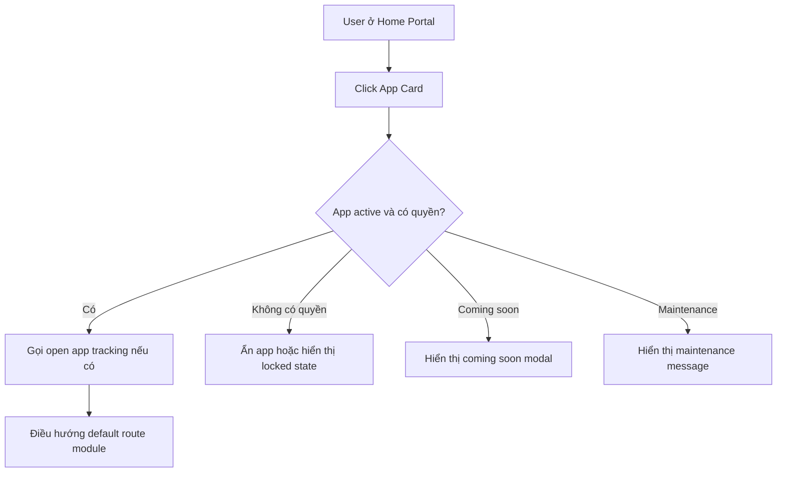
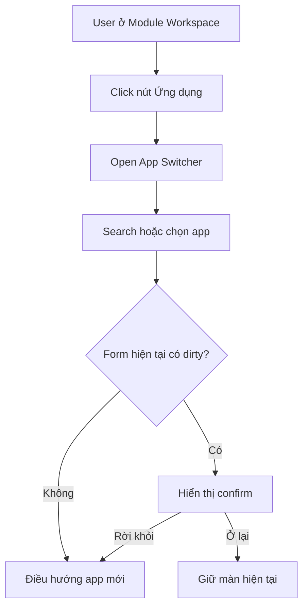
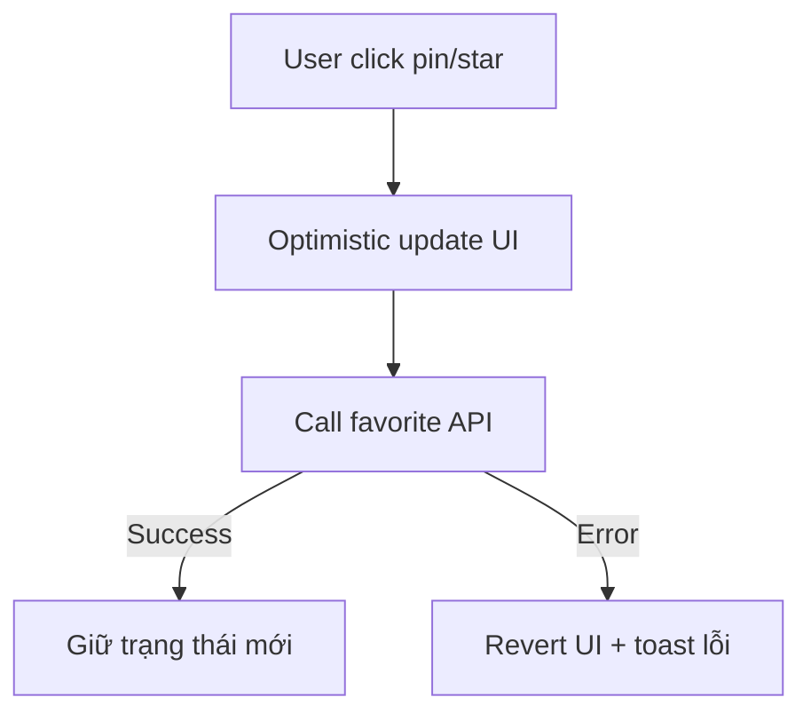
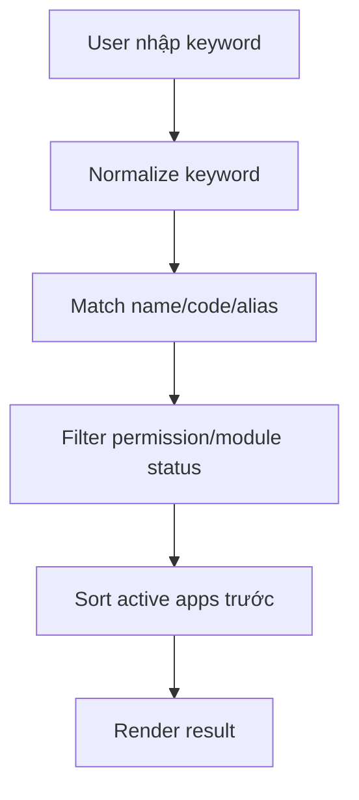

# UI-06: HOME PORTAL & APP SWITCHER UI DESIGN
# THIẾT KẾ CHI TIẾT HOME PORTAL & APP SWITCHER

> **📚 Bộ tài liệu UI — Hệ thống Quản lý Doanh nghiệp**
> [UI-01 Tổng quan](<UI-01_UIUX_Design_Tong_Quan.md>) · [UI-02 IA/Sitemap](<UI-02_Information_Architecture_Sitemap.md>) · [UI-03 User Flow](<UI-03_User_Flow_MVP.md>) · [UI-04 Screen List](<UI-04_Screen_List_Wireframe_Plan.md>) · [UI-05 Design System](<UI-05_Design_System_Component_Library.md>) · **UI-06 Home/App Switcher** · [UI-07 Module Workspace](<UI-07_Module_Workspace_Template_Design.md>) · [UI-08 Dashboard](<UI-08_Dashboard_UIUX_Design.md>) · [UI-09 Module UI](<UI-09_Module_UI_Design.md>) · [UI-10 Prototype/Handoff](<UI-10_Prototype_Frontend_Handoff_Guide.md>)
>
> **Liên quan:** [Đặc tả: SPEC-01 Tổng quan](<../SPEC/SPEC-01 Tổng quan.md>) · [Module/app registry: API-09 FOUNDATION](<../API Design/API-09_FOUNDATION_API_Design.md>) · [Chỉ mục tài liệu](<../README.md>)

---

## 1. Thông tin tài liệu

| Trường | Nội dung |
| --- | --- |
| Mã tài liệu | UI-06 |
| Tên tài liệu | Home Portal & App Switcher UI Design |
| Tên dự án | Hệ thống quản lý doanh nghiệp nội bộ |
| Tên sản phẩm | Enterprise Management System |
| Phiên bản | v1.0 |
| Trạng thái | Draft |
| Giai đoạn | MVP Version 1.0 |
| Tài liệu nguồn | PRD-00, SPEC-01 -> SPEC-08, DB-01 -> DB-10, API-01 -> API-09, UI-01 -> UI-05 |
| Ngày tạo | 20/06/2026 |
| Ngày cập nhật | 20/06/2026 |
| Người viết |  |
| Người duyệt |  |

### Lịch sử thay đổi (Changelog)

| Phiên bản | Ngày | Thay đổi | Người thực hiện |
| --- | --- | --- | --- |
| v1.0 | 20/06/2026 | Khởi tạo tài liệu cho giai đoạn MVP v1.0. | |

---

## 2. Mục đích tài liệu

Tài liệu UI-06 mô tả chi tiết thiết kế giao diện cho hai thành phần nền tảng của hệ thống:

1. **Home Portal**: màn hình đầu tiên sau khi người dùng đăng nhập thành công.
2. **App Switcher**: lớp chuyển ứng dụng nhanh, có thể mở từ mọi màn hình protected.

UI-06 dùng để:

1. Chốt bố cục Home Portal desktop, tablet và mobile web.
2. Chốt bố cục App Switcher desktop, tablet và mobile web.
3. Chuẩn hóa App Card, App Grid, App Search, Recent Apps, Favorite Apps và Coming Soon State.
4. Xác định rõ hành vi hiển thị app theo permission, module active, feature flag và company setting.
5. Làm cơ sở cho UI/UX Designer dựng high-fidelity trên Figma.
6. Làm cơ sở cho Frontend triển khai component, route guard và state handling.
7. Làm cơ sở cho Backend/API bổ sung app registry endpoint nếu cần.
8. Làm checklist cho QA kiểm thử flow Login -> Home Portal -> Module Workspace -> App Switcher.

---

## 3. Căn cứ thiết kế

UI-06 bám theo các quyết định đã chốt trong các tài liệu UI trước đó:

1. Sau khi đăng nhập, user vào **Home Portal** trước, không đi thẳng vào dashboard nghiệp vụ.
2. Từ Home Portal, user chọn app/module để vào **Module Workspace**.
3. Trong mọi màn hình protected, user có thể bấm nút **Ứng dụng** để mở **App Switcher**.
4. Home Portal không xử lý nghiệp vụ sâu; nghiệp vụ phải điều hướng về module gốc.
5. App, menu, route, button, quick action, badge và widget phải hiển thị theo permission và data scope.
6. Frontend được phép ẩn/hiện thành phần để cải thiện UX, nhưng backend vẫn kiểm tra quyền cuối cùng.
7. App Switcher không được làm lộ app mà user không có quyền truy cập, trừ khi sản phẩm chủ động hiển thị app khóa/coming soon theo policy.
8. Khi user đang có form chưa lưu, đổi app phải hiển thị confirm dirty form.
9. UI-06 sử dụng lại token, layout shell và component foundation đã định nghĩa ở UI-05.

---

## 4. Phạm vi UI-06

### 4.1 Bao gồm trong MVP

| Nhóm | Thành phần |
| --- | --- |
| Home Portal | Header, search, category chips, app grid, recent apps, favorite apps, my apps, app card |
| App Switcher | Overlay desktop, drawer/tablet, fullscreen mobile, app search, home link, recent apps, my apps, other apps |
| App Card | Icon, tên app, mô tả ngắn, badge, trạng thái, favorite/pin, hover/focus state |
| App Search | Search theo tên tiếng Việt, tiếng Anh, module code, alias, không dấu nếu có |
| State | Loading, empty, forbidden, locked, disabled, coming soon, beta, maintenance, error |
| Permission UX | Hiển thị/ẩn app theo permission, module status, feature flag, company setting |
| Responsive | Desktop, tablet, mobile web |
| Interaction | Open app, back home, favorite app, recent app, close overlay, keyboard shortcut, dirty form guard |
| API mapping | Auth context, permission, module/app registry, recent/favorite apps |
| Handoff | Component spec, Figma frame list, QA checklist, acceptance criteria |

### 4.2 Chưa đi sâu trong MVP

| Nhóm | Giai đoạn đề xuất | Ghi chú |
| --- | --- | --- |
| App marketplace / Chợ ứng dụng | Phase sau | Cho phép admin bật/tắt/cài app |
| App onboarding tour | Phase sau | Hướng dẫn user lần đầu dùng app |
| Cá nhân hóa layout kéo thả | Phase sau | User tự sắp xếp app grid |
| Workspace multi-window | Phase sau | Mở nhiều app dạng tab/window |
| AI app recommendation | Phase 5 | Gợi ý app theo hành vi sử dụng |
| Global search xuyên module nâng cao | Phase sau | Cần quyền, indexing và search service riêng |
| Mobile native app launcher | Phase mobile | UI riêng cho mobile native |

---

## 5. Định nghĩa khái niệm

| Khái niệm | Định nghĩa |
| --- | --- |
| Home Portal | Trang tổng sau đăng nhập, hiển thị các app/module user được phép truy cập |
| App Switcher | Overlay/drawer/fullscreen cho phép chuyển nhanh app từ mọi màn hình protected |
| App Card | Card đại diện cho một app/module |
| My Apps | Danh sách app user có quyền truy cập và module đang active |
| Recent Apps | App user đã mở gần đây |
| Favorite Apps | App user ghim/yêu thích để truy cập nhanh |
| Other Apps | App phase sau, app chưa kích hoạt, app coming soon hoặc app bị khóa theo policy |
| Locked App | App user nhìn thấy nhưng chưa được cấp quyền hoặc chưa kích hoạt |
| Coming Soon App | App chưa thuộc MVP hoặc chưa triển khai, chỉ hiển thị nếu company/product bật placeholder |
| Module Workspace | Không gian làm việc chi tiết của từng module sau khi user mở app |

---

## 6. Nguyên tắc thiết kế tổng thể

### 6.1 Home Portal là cổng vào, không phải dashboard nghiệp vụ

Home Portal chỉ nên giúp user trả lời nhanh:

```text
Tôi có những ứng dụng nào?
Tôi muốn mở nhanh ứng dụng nào?
Ứng dụng nào tôi dùng gần đây hoặc đã ghim?
```

Không đưa quá nhiều dữ liệu nghiệp vụ vào Home Portal. Nếu cần hiển thị thông tin, chỉ nên dùng các thành phần nhẹ:

1. Thông báo quan trọng rất ngắn.
2. Shortcut vào dashboard cá nhân.
3. App gần đây.
4. App yêu thích.
5. Gợi ý thao tác nhanh dạng link sang module gốc.

### 6.2 App Switcher là lớp chuyển app nhanh

App Switcher phải mở được từ:

1. Home Portal.
2. Module Workspace.
3. Dashboard.
4. Notification page.
5. System/Admin page.
6. Account page nếu đang ở protected area.

App Switcher không thay thế sidebar module. Sidebar dùng để điều hướng trong module; App Switcher dùng để đổi module.

### 6.3 Navigation phải theo permission

Không hard-code app theo role. Role chỉ là seed mặc định. UI phải dựa vào dữ liệu backend trả về:

1. User permissions.
2. Data scopes.
3. Module active status.
4. Feature flags.
5. Company settings.
6. App registry.

### 6.4 Backend vẫn là lớp bảo mật cuối cùng

Frontend có thể ẩn app, menu và action để trải nghiệm sạch hơn. Tuy nhiên tất cả route/API vẫn phải được backend kiểm tra:

1. Authentication.
2. Permission.
3. Data scope.
4. Module status.
5. Company status.
6. Business rule.

### 6.5 Giữ trải nghiệm đơn giản cho user mới

User mới không nên bị choáng bởi quá nhiều module. Home Portal ưu tiên:

1. App dùng hằng ngày.
2. App theo vai trò chính.
3. App đã dùng gần đây.
4. App được ghim.
5. Các app phase sau chỉ hiển thị nếu cần tạo cảm giác ecosystem.

---

## 7. Route và screen code

### 7.1 Route chính

| Screen | Route/Entry | Layout |
| --- | --- | --- |
| Home Portal | `/home` | Home Portal Layout |
| All Apps | `/home/apps` | Home Portal Layout |
| Recent Apps | `/home/recent` | Home Portal Layout |
| Favorite Apps | `/home/favorites` | Home Portal Layout |
| App Switcher | Global Topbar Button | Overlay/Drawer/Fullscreen |
| App open action | `/{module}` hoặc default route của module | Module Workspace |

### 7.2 Screen code

| Mã screen | Tên screen | Priority | Ghi chú |
| --- | --- | --- | --- |
| UI-HOME-SCREEN-001 | Home Portal App Grid | P0 | Màn đầu sau login |
| UI-HOME-SCREEN-002 | App Switcher Overlay | P0 | Mở từ topbar mọi màn protected |
| UI-HOME-SCREEN-003 | Home/App Search State | P1 | Search, no result, keyboard navigation |
| UI-HOME-SCREEN-004 | Recent/Favorite Apps | P2 | Có thể triển khai sau P0 |
| UI-HOME-SCREEN-005 | Locked/Coming Soon App State | P2 | Hiển thị theo policy |
| UI-HOME-SCREEN-006 | Home Portal Mobile | P1 | Responsive mobile web |
| UI-HOME-SCREEN-007 | App Switcher Mobile Fullscreen | P1 | Responsive mobile web |
| UI-HOME-SCREEN-008 | App Permission Empty State | P1 | User chưa có app nào |
| UI-HOME-SCREEN-009 | Dirty Form Confirm on App Switch | P0 | Bắt buộc khi đổi app từ form chưa lưu |

---

## 8. App registry UI model

### 8.1 App item model đề xuất cho frontend

```ts
type AppStatus =
  | 'ACTIVE'
  | 'DISABLED'
  | 'LOCKED'
  | 'COMING_SOON'
  | 'BETA'
  | 'MAINTENANCE';

interface AppRegistryItem {
  moduleCode: 'DASH' | 'HR' | 'ATT' | 'LEAVE' | 'TASK' | 'NOTI' | 'AUTH' | 'FOUNDATION' | string;
  appKey: string;
  appName: string;
  appNameEn?: string;
  description?: string;
  icon: string;
  accentToken?: string;
  route: string;
  defaultRoute: string;
  category: 'DAILY' | 'HR' | 'WORK' | 'ADMIN' | 'FINANCE' | 'OPERATION' | 'COMMUNICATION' | 'SYSTEM' | 'OTHER';
  status: AppStatus;
  badges?: Array<'NEW' | 'BETA' | 'COMING_SOON' | 'LOCKED' | 'MAINTENANCE'>;
  requiredAnyPermissions?: string[];
  requiredPermissions?: string[];
  requiredScopes?: string[];
  aliases?: string[];
  isFavorite?: boolean;
  isRecent?: boolean;
  recentOpenedAt?: string;
  order?: number;
  visibleInHome?: boolean;
  visibleInSwitcher?: boolean;
  lockedReason?: string;
}
```

### 8.2 App status behavior

| Status | Home Portal | App Switcher | Click behavior |
| --- | --- | --- | --- |
| ACTIVE | Hiển thị bình thường | Hiển thị bình thường | Điều hướng vào module |
| DISABLED | Ẩn hoặc hiển thị mờ theo policy | Ẩn hoặc mờ | Không cho mở, tooltip lý do |
| LOCKED | Ẩn mặc định; có thể mờ nếu muốn upsell nội bộ | Có thể mờ trong Other Apps | Mở modal không có quyền hoặc liên hệ admin |
| COMING_SOON | Hiển thị nếu bật placeholder | Hiển thị trong Other Apps | Không điều hướng, hiển thị coming soon |
| BETA | Hiển thị bình thường + badge Beta | Hiển thị bình thường + badge Beta | Điều hướng bình thường |
| MAINTENANCE | Hiển thị mờ + badge Bảo trì | Hiển thị mờ + badge Bảo trì | Không cho mở, hiển thị maintenance state |

### 8.3 App category đề xuất

| Category | App |
| --- | --- |
| DAILY | Chấm công, Nghỉ phép, Công việc, Thông báo, Dashboard |
| HR | Nhân sự, Hồ sơ của tôi, Hợp đồng, Tuyển dụng phase sau |
| WORK | Công việc, Dự án, Kanban, Phòng họp phase sau |
| ADMIN | User, Role, Permission, Settings, Audit |
| FINANCE | Tiền lương phase sau |
| OPERATION | Tài sản, Phòng họp, Workflow phase sau |
| COMMUNICATION | Thông báo, Chat, Social phase sau |
| SYSTEM | Foundation, Module Catalog, File, Audit Log |

---

## 9. Home Portal desktop design

### 9.1 Layout tổng thể

```text
+------------------------------------------------------------------------------------------------+
| Logo / Product name        Search app                                  Ứng dụng  Noti  Avatar   |
+------------------------------------------------------------------------------------------------+
|                                                                                                |
| Welcome section                                                                                |
| Xin chào, Nguyễn Văn A                                                                         |
| Bạn muốn làm gì hôm nay?                                                                       |
|                                                                                                |
| [Gần đây] [Yêu thích] [Ứng dụng của tôi] [Tất cả] [Công việc hằng ngày] [Quản trị]              |
|                                                                                                |
| Section: Gần đây                                                                               |
| [Chấm công] [Công việc] [Nghỉ phép]                                                            |
|                                                                                                |
| Section: Ứng dụng của tôi                                                                      |
| [Dashboard] [Nhân sự] [Chấm công] [Nghỉ phép] [Công việc] [Thông báo] [Hệ thống]                |
|                                                                                                |
| Section: Ứng dụng khác                                                                         |
| [Tiền lương - Coming soon] [Tuyển dụng - Coming soon] [Tài sản - Coming soon]                   |
|                                                                                                |
+------------------------------------------------------------------------------------------------+
```

### 9.2 Kích thước layout desktop

| Thành phần | Kích thước đề xuất |
| --- | --- |
| Viewport mục tiêu | >= 1280px |
| Page max width | 1180px - 1320px |
| Header height | 64px - 72px |
| Content padding | 32px - 48px |
| App grid gap | 20px - 24px |
| App card size | 136px x 128px hoặc 160px x 144px |
| Icon size | 44px - 56px |
| App card radius | Theo token `radius-xl` |
| App card shadow | Theo token `shadow-card` |
| Category chip height | 36px - 40px |

### 9.3 Header Home Portal

| Thành phần | Bắt buộc | Mô tả |
| --- | --- | --- |
| Logo/Product name | Có | Click về `/home` |
| Search app | Có | Search trong app user có thể thấy |
| App Switcher button | Có | Có thể trùng chức năng search nhưng vẫn giữ để nhất quán |
| Notification badge | Có | Hiển thị unread count |
| Avatar/User menu | Có | Profile, đổi mật khẩu, logout |
| Settings quick link | Theo quyền | Chỉ hiển thị nếu user có quyền system/settings |
| Help icon | Optional | Phase sau |

### 9.4 Welcome section

Welcome section giúp Home Portal có cảm giác cá nhân hóa nhưng không biến thành dashboard nặng.

Nội dung đề xuất:

```text
Xin chào, {display_name}
Bạn muốn làm gì hôm nay?
```

Có thể thêm một dòng nhẹ theo role:

| Role | Gợi ý nội dung |
| --- | --- |
| Employee | `Bạn có thể chấm công, xem việc được giao hoặc tạo đơn nghỉ phép.` |
| Manager | `Bạn có thể xem việc của team, duyệt đơn nghỉ hoặc kiểm tra tiến độ.` |
| HR | `Bạn có thể quản lý nhân sự, bảng công, đơn nghỉ và cảnh báo nhân sự.` |
| Admin | `Bạn có thể quản lý người dùng, quyền, cấu hình và nhật ký hệ thống.` |

Không hiển thị dữ liệu nhạy cảm trong welcome section.

### 9.5 Category chips

Category chips dùng để lọc app grid nhanh.

| Chip | Điều kiện hiển thị | Ý nghĩa |
| --- | --- | --- |
| Gần đây | Có ít nhất 1 recent app | App user vừa mở |
| Yêu thích | Có ít nhất 1 favorite app hoặc cho phép ghim | App user đã ghim |
| Ứng dụng của tôi | Luôn có | App user có quyền |
| Tất cả | Có nhiều app | Tất cả app được phép hiển thị |
| Công việc hằng ngày | Có app ATT/LEAVE/TASK/NOTI | Nhóm app nhân viên dùng thường xuyên |
| Nhân sự | Có HR hoặc related app | Nhóm HR |
| Quản trị | Có AUTH/FOUNDATION | Nhóm Admin |
| Khác | Có app phase sau/coming soon | App mở rộng |

### 9.6 App grid behavior

1. App grid mặc định sắp xếp theo `order`, sau đó theo nhóm ưu tiên role.
2. App gần đây có thể hiển thị trước My Apps nếu user đã có lịch sử.
3. Favorite app luôn đứng trên app thường trong cùng nhóm.
4. App active hiển thị rõ; app coming soon hiển thị mờ.
5. App không có quyền mặc định không hiển thị.
6. App grid phải hỗ trợ keyboard focus.
7. Hover card hiển thị trạng thái nhẹ, không làm layout nhảy.
8. Click app active điều hướng đến default route của module.
9. Click favorite icon không mở app; chỉ toggle favorite.
10. Long text phải truncate tối đa 2 dòng.

---

## 10. Home Portal sections

### 10.1 Section Gần đây

Mục tiêu: giúp user quay lại app vừa dùng.

| Quy tắc | Mô tả |
| --- | --- |
| Số lượng | 3 - 6 app |
| Sắp xếp | Theo `recentOpenedAt` mới nhất |
| Không có dữ liệu | Ẩn section hoặc hiển thị sau khi user mở app đầu tiên |
| Click | Điều hướng vào default route hoặc route cuối nếu có lưu last route an toàn |
| Bảo mật | Nếu user mất quyền sau lần mở trước, app biến mất khỏi recent |

### 10.2 Section Yêu thích

Mục tiêu: cho user ghim app quan trọng.

| Quy tắc | Mô tả |
| --- | --- |
| Số lượng | Không giới hạn nhưng UI nên hiển thị 8 - 12 app đầu |
| Sắp xếp | Theo user-defined order hoặc thời gian ghim |
| Toggle | Icon star/pin trên app card |
| Không có dữ liệu | Có thể ẩn hoặc hiển thị gợi ý `Ghim ứng dụng thường dùng để mở nhanh hơn.` |
| Permission | Nếu app bị mất quyền, bỏ khỏi favorite hoặc hiển thị locked theo policy |

### 10.3 Section Ứng dụng của tôi

Mục tiêu: danh sách app chính user được quyền dùng.

App thuộc MVP:

| Module code | Tên app | Default route |
| --- | --- | --- |
| DASH | Dashboard | `/dashboard` |
| HR | Nhân sự | `/hr` hoặc `/hr/me` theo role |
| ATT | Chấm công | `/attendance/today` |
| LEAVE | Nghỉ phép | `/leave/me/requests` hoặc `/leave/approvals` theo role |
| TASK | Công việc | `/tasks/my-tasks` |
| NOTI | Thông báo | `/notifications` |
| AUTH | Tài khoản & phân quyền | `/system/users` nếu có quyền admin |
| FOUNDATION | Hệ thống | `/system` nếu có quyền admin |

### 10.4 Section Ứng dụng khác

Mục tiêu: thể hiện hệ sinh thái mở rộng nhưng không làm rối MVP.

| App phase sau | UI mặc định |
| --- | --- |
| PAYROLL | Ẩn hoặc Coming soon |
| RECRUIT | Ẩn hoặc Coming soon |
| ASSET | Ẩn hoặc Coming soon |
| ROOM | Ẩn hoặc Coming soon |
| CHAT | Ẩn hoặc Coming soon |
| SOCIAL | Ẩn hoặc Coming soon |
| AI | Ẩn hoặc Coming soon |

Policy khuyến nghị MVP:

```text
Employee: Ẩn app phase sau.
Manager/HR/Admin: Có thể hiển thị Coming soon nếu muốn demo roadmap.
Super Admin: Có thể thấy app phase sau ở trạng thái disabled/coming soon để quản lý module catalog.
```

---

## 11. App Card design

### 11.1 App Card anatomy

```text
+----------------------------+
|            [Icon]          |
|                            |
|          Tên app           |
|     Mô tả ngắn nếu có      |
|                            |
| [Badge]             [Pin]  |
+----------------------------+
```

### 11.2 Thành phần App Card

| Thành phần | Bắt buộc | Mô tả |
| --- | --- | --- |
| Icon | Có | Icon module hoặc app logo |
| App name | Có | Tên tiếng Việt rõ ràng |
| Description | Optional | Tối đa 1 dòng ở desktop, ẩn ở compact |
| Badge | Optional | Beta, New, Coming soon, Locked, Maintenance |
| Favorite/Pin | Optional | Cho phép ghim app |
| Status overlay | Optional | Dùng cho disabled/locked/maintenance |
| Focus ring | Có | Hỗ trợ keyboard navigation |
| Tooltip | Có với state đặc biệt | Hiển thị lý do locked/disabled |

### 11.3 App Card visual states

| State | UI behavior |
| --- | --- |
| Default | Surface card, icon rõ, text rõ |
| Hover | Nâng shadow nhẹ, scale rất nhỏ hoặc đổi surface |
| Focus | Focus ring rõ, có thể Enter để mở app |
| Active/current app | Border/accent nhẹ, badge `Đang mở` trong App Switcher |
| Favorite | Pin/star active |
| Locked | Opacity thấp hơn, icon khóa, tooltip lý do |
| Coming soon | Badge Coming soon, click mở popover thông tin |
| Maintenance | Badge Bảo trì, không cho click mở module |
| Loading | Skeleton card |
| Error | Card fallback icon + tên app nếu icon tải lỗi |

### 11.4 App Card content rule

| Trường | Quy tắc |
| --- | --- |
| Tên app | 1 - 2 từ nếu có thể: `Nhân sự`, `Chấm công`, `Nghỉ phép` |
| Mô tả | 40 - 60 ký tự, không bắt buộc |
| Badge | Tối đa 2 badge/card |
| Tooltip | Ngắn, giải thích được hành động tiếp theo |
| Icon | Không dùng icon quá giống nhau giữa module |
| Color | Dùng module accent nhưng không gây quá nhiều màu lộn xộn |

### 11.5 App icon đề xuất

| Module | Icon gợi ý | Accent |
| --- | --- | --- |
| DASH | Chart / Grid dashboard | Brand / blue |
| HR | Users / ID card | Purple / indigo |
| ATT | Clock / Check circle | Green / teal |
| LEAVE | Calendar / Palm / Door out | Orange / amber |
| TASK | Check square / Kanban | Blue / cyan |
| NOTI | Bell | Red / pink accent nhẹ |
| AUTH | Shield / Key / User cog | Gray / slate |
| FOUNDATION | Settings / Building / Database | Neutral / dark |
| PAYROLL | Wallet / Money | Emerald |
| RECRUIT | User plus | Violet |
| ASSET | Box / Package | Brown / amber |
| ROOM | Calendar room / Door | Cyan |
| CHAT | Message circle | Blue |
| SOCIAL | Users network | Pink |
| AI | Sparkles / Bot | Gradient accent |

---

## 12. App Search design

### 12.1 Search entry point

Search app xuất hiện ở:

1. Home Portal header.
2. App Switcher header.
3. Mobile Home Portal search bar.
4. Keyboard shortcut nếu có.

### 12.2 Search behavior

Search phải hỗ trợ:

1. Tìm theo tên app tiếng Việt.
2. Tìm theo module code.
3. Tìm theo tên tiếng Anh.
4. Tìm theo alias nghiệp vụ.
5. Tìm không dấu nếu có thể.
6. Không phân biệt hoa thường.
7. Ưu tiên app active/user có quyền.
8. Không trả app không có quyền nếu policy là ẩn app.
9. Hiển thị app locked/coming soon nếu policy cho phép.

### 12.3 Search alias

| Từ khóa | App gợi ý |
| --- | --- |
| `home`, `trang chủ` | Home Portal |
| `dashboard`, `tong quan`, `tổng quan`, `bao cao`, `báo cáo` | DASH |
| `nhan su`, `nhân sự`, `hr`, `employee`, `nhan vien`, `nhân viên` | HR |
| `cong`, `cham cong`, `chấm công`, `attendance`, `checkin`, `check-in`, `checkout`, `check-out` | ATT |
| `nghi`, `nghỉ`, `phep`, `phép`, `leave`, `don nghi`, `đơn nghỉ` | LEAVE |
| `task`, `cong viec`, `công việc`, `du an`, `dự án`, `project`, `kanban` | TASK |
| `thong bao`, `thông báo`, `noti`, `notification`, `bell` | NOTI |
| `user`, `role`, `permission`, `quyen`, `quyền`, `tai khoan`, `tài khoản` | AUTH |
| `setting`, `cau hinh`, `cấu hình`, `audit`, `log`, `file`, `module` | FOUNDATION |

### 12.4 Search result UI

```text
+--------------------------------------------------+
| Tìm kiếm ứng dụng...                             |
+--------------------------------------------------+
| Kết quả phù hợp                                  |
| [Chấm công]  Check-in, check-out, bảng công      |
| [Công việc]  Task, dự án, Kanban                 |
|                                                  |
| Ứng dụng khác                                    |
| [Tiền lương] Coming soon                         |
+--------------------------------------------------+
```

### 12.5 Search states

| State | UI |
| --- | --- |
| Empty keyword | Hiển thị recent/favorite/my apps |
| Typing | Có debounce 150ms - 250ms |
| Loading | Skeleton result |
| Found | Hiển thị nhóm kết quả |
| No result | `Không tìm thấy ứng dụng phù hợp.` |
| No permission | Không hiển thị app hoặc hiển thị message theo policy |
| Error | `Không tải được danh sách ứng dụng. Vui lòng thử lại.` |

### 12.6 Keyboard support

| Phím | Hành vi |
| --- | --- |
| `/` hoặc `Ctrl/Cmd + K` | Focus search / mở App Switcher search |
| `ArrowDown/ArrowUp` | Di chuyển giữa kết quả |
| `Enter` | Mở app đang focus |
| `Esc` | Đóng App Switcher hoặc clear search |
| `Tab` | Di chuyển focus theo thứ tự |
| `Home` trong App Switcher | Chọn link Home nếu focus tương ứng |

---

## 13. App Switcher desktop design

### 13.1 Kiểu hiển thị desktop khuyến nghị

Desktop nên dùng **modal lớn ở giữa màn hình** hoặc **popover lớn dưới nút Ứng dụng**.

Khuyến nghị MVP:

```text
Desktop >= 1024px: Center modal / command palette style
Tablet 768px - 1023px: Side drawer hoặc centered modal rộng 80%
Mobile < 768px: Fullscreen overlay
```

### 13.2 App Switcher modal desktop

```text
+--------------------------------------------------------------------------------+
| X   Tìm kiếm ứng dụng...                                          Home Portal   |
+--------------------------------------------------------------------------------+
| Gần đây                                                                          |
| [Chấm công] [Công việc] [Nghỉ phép]                                               |
|                                                                                  |
| Yêu thích                                                                         |
| [Dashboard] [Nhân sự]                                                            |
|                                                                                  |
| Ứng dụng của tôi                                                                  |
| [Dashboard] [Nhân sự] [Chấm công] [Nghỉ phép] [Công việc] [Thông báo] [Hệ thống]  |
|                                                                                  |
| Ứng dụng khác                                                                     |
| [Tiền lương - Coming soon] [Tuyển dụng - Coming soon] [Tài sản - Coming soon]     |
+--------------------------------------------------------------------------------+
```

### 13.3 App Switcher anatomy

| Vùng | Thành phần |
| --- | --- |
| Header | Close button, search input, Home Portal link |
| Current context | Tên app hiện tại hoặc badge `Đang mở` |
| Recent apps | App vừa mở |
| Favorite apps | App đã ghim |
| My apps | App user có quyền |
| Other apps | App coming soon/disabled theo policy |
| Footer optional | Shortcut hint, admin link, help |

### 13.4 App Switcher rules

1. App Switcher phải mở trên mọi màn hình protected.
2. App Switcher không thay đổi dữ liệu nghiệp vụ.
3. Click app active điều hướng về default route hoặc last safe route.
4. Click Home điều hướng `/home`.
5. Nếu đang ở form có thay đổi chưa lưu, hiển thị dirty form confirm trước khi điều hướng.
6. Nếu user chọn app hiện tại, đóng App Switcher hoặc điều hướng về root của app theo policy.
7. Nếu app bị disabled/maintenance, không điều hướng.
8. Nếu app là coming soon, mở popover hoặc modal thông báo.
9. Nếu user không có app nào, hiển thị empty state và liên hệ admin.
10. App Switcher phải trap focus khi mở.

### 13.5 Current app indicator

Trong App Switcher, app hiện tại cần có:

1. Border/accent state.
2. Badge nhỏ `Đang mở`.
3. Không cần disable click, nhưng nếu click thì điều hướng về default route hoặc đóng overlay.
4. Với module sâu như `/tasks/projects/:id`, current app vẫn là `TASK`.

---

## 14. App Switcher mobile design

### 14.1 Mobile fullscreen layout

```text
+--------------------------------------+
| X  Ứng dụng                          |
| [Tìm kiếm ứng dụng...]               |
+--------------------------------------+
| Home Portal                          |
|                                      |
| Gần đây                              |
| [Chấm công] [Công việc]              |
|                                      |
| Ứng dụng của tôi                     |
| [Dashboard] [Nhân sự]                |
| [Chấm công] [Nghỉ phép]              |
| [Công việc] [Thông báo]              |
|                                      |
| Khác                                 |
| [Tiền lương] [Tuyển dụng]            |
+--------------------------------------+
```

### 14.2 Mobile behavior

1. Fullscreen overlay chiếm toàn bộ màn hình.
2. Search input đặt ngay dưới title.
3. App card dùng grid 3 cột hoặc list compact.
4. Icon size nhỏ hơn desktop.
5. App name tối đa 2 dòng.
6. Nút đóng ở góc trái hoặc phải, dễ bấm.
7. Hỗ trợ swipe down để đóng nếu frontend có khả năng.
8. Không dùng hover state; dùng pressed/tap state.
9. App Switcher mở từ topbar hoặc bottom navigation.
10. Nếu keyboard mở, danh sách app phải scroll được.

### 14.3 Mobile grid

| Viewport | Grid |
| --- | --- |
| < 360px | 2 cột |
| 360px - 480px | 3 cột |
| 480px - 767px | 4 cột |
| >= 768px | Tablet layout |

---

## 15. Responsive behavior

### 15.1 Breakpoint

| Breakpoint | Width | Hành vi |
| --- | ---: | --- |
| Mobile S | < 360px | App grid 2 cột, text compact |
| Mobile | 360px - 767px | App grid 3 cột, fullscreen App Switcher |
| Tablet | 768px - 1023px | App grid 4 - 5 cột, drawer/modal App Switcher |
| Desktop | 1024px - 1439px | App grid 5 - 6 cột, modal App Switcher |
| Large Desktop | >= 1440px | App grid 6 - 8 cột, content max width |

### 15.2 Home Portal responsive rules

| Thành phần | Desktop | Tablet | Mobile |
| --- | --- | --- | --- |
| Header | Full topbar | Compact topbar | Logo + search/icon actions |
| Search | Input rộng | Input vừa | Full width dưới header hoặc icon mở search |
| Category chips | 1 hàng, wrap nếu cần | Scroll ngang | Scroll ngang |
| App grid | 5 - 8 cột | 4 - 5 cột | 2 - 3 cột |
| Welcome | Full text | Rút gọn | Rút gọn hoặc ẩn description |
| Recent/Favorite | Card grid | Card grid | Horizontal scroll |
| Other Apps | Dưới cùng | Dưới cùng | Dưới cùng hoặc collapsed |

### 15.3 App card responsive rules

| Thành phần | Desktop | Mobile |
| --- | --- | --- |
| Card padding | 16px - 20px | 12px |
| Icon | 48px - 56px | 36px - 44px |
| Title | 14px - 16px | 13px - 14px |
| Description | Có thể hiện | Ẩn |
| Badge | Góc trên/phải | Góc dưới hoặc ẩn nếu chật |
| Favorite icon | Hover hiện hoặc luôn hiện | Luôn hiện nếu có chức năng ghim |

---

## 16. Permission và visibility rules

### 16.1 Visibility rule tổng quát

```text
App visible =
  module exists
  AND module is enabled for company OR showComingSoonPolicy = true
  AND user has required permission OR app status is COMING_SOON/LOCKED with visible policy
  AND feature flag allows display
```

### 16.2 Quy tắc mặc định MVP

| Tình huống | UI behavior mặc định |
| --- | --- |
| User có quyền module | Hiển thị app |
| User không có quyền module | Ẩn app |
| Module phase sau | Ẩn với Employee, có thể Coming soon với Admin/SA |
| Module bị tắt bởi company | Ẩn hoặc Disabled nếu Admin |
| Module đang bảo trì | Hiển thị mờ với badge Bảo trì nếu user từng có quyền |
| Permission mất sau khi đã favorite | Bỏ khỏi favorite hoặc hiển thị locked theo policy |
| Direct URL vào module không quyền | Route guard -> 403 |

### 16.3 Role-based app priority mặc định

| Role | App ưu tiên |
| --- | --- |
| Employee | Chấm công, Nghỉ phép, Công việc, Thông báo, Hồ sơ của tôi, Dashboard |
| Manager | Dashboard Manager, Công việc, Nghỉ phép, Chấm công team, Nhân sự team, Thông báo |
| HR | Nhân sự, Chấm công, Nghỉ phép, Dashboard HR, Thông báo |
| Company Admin | Dashboard Admin, User, Role, Permission, Settings, Audit |
| Super Admin | Company, Module, User, Role, Permission, Settings, Audit |
| Project Manager | Công việc, Dự án, Kanban, Báo cáo dự án, Thông báo |

Lưu ý: đây chỉ là thứ tự gợi ý khi user có permission tương ứng. Không dùng role name để bypass permission.

---

## 17. State design

### 17.1 Loading state

Home Portal loading:

```text
Header skeleton
Category chip skeleton
App card skeleton x 8
```

App Switcher loading:

```text
Search input skeleton
Recent section skeleton
App item skeleton x 6
```

### 17.2 Empty state

| Trường hợp | Message | Action |
| --- | --- | --- |
| Không có app nào | `Tài khoản của bạn chưa được cấp quyền sử dụng ứng dụng.` | `Liên hệ quản trị viên` |
| Không có recent app | `Bạn chưa mở ứng dụng nào gần đây.` | Ẩn section hoặc mở My Apps |
| Không có favorite app | `Ghim ứng dụng thường dùng để mở nhanh hơn.` | Không bắt buộc |
| Search no result | `Không tìm thấy ứng dụng phù hợp.` | Clear search |
| Module disabled | `Ứng dụng này chưa được kích hoạt cho công ty của bạn.` | Liên hệ admin nếu có |
| Coming soon | `Ứng dụng này sẽ được phát triển ở giai đoạn sau.` | Đóng |
| Maintenance | `Ứng dụng đang được bảo trì. Vui lòng thử lại sau.` | Đóng |

### 17.3 Error state

| Lỗi | UI |
| --- | --- |
| Không tải được app registry | Hiển thị error block + nút thử lại |
| Không tải được permission | Redirect login hoặc forbidden theo lỗi |
| API timeout | Toast lỗi + nút thử lại |
| Favorite toggle lỗi | Revert UI + toast |
| Recent app record lỗi | Không chặn điều hướng, ghi log nếu cần |
| Icon asset lỗi | Dùng icon fallback |

### 17.4 Forbidden state

Nếu user vào `/home` nhưng không có app nào:

```text
Bạn chưa được cấp quyền sử dụng ứng dụng nào.
Vui lòng liên hệ quản trị viên công ty để được cấp quyền.
```

Không nên hiển thị danh sách module nội bộ nếu policy là không lộ app trái quyền.

### 17.5 Dirty form confirm

Khi user đang ở form chưa lưu và mở App Switcher để chuyển app:

```text
Bạn có thay đổi chưa lưu.
Nếu chuyển ứng dụng, các thay đổi hiện tại có thể bị mất.

[Ở lại] [Rời khỏi]
```

Quy tắc:

1. Confirm xuất hiện sau khi user chọn app khác, không xuất hiện ngay khi mở App Switcher.
2. Nếu user chọn `Ở lại`, đóng confirm và giữ App Switcher hoặc quay lại form theo UX quyết định.
3. Nếu user chọn `Rời khỏi`, điều hướng sang app mới.
4. Nếu form có autosave, message cần điều chỉnh.

---

## 18. Interaction detail

### 18.1 Mở app từ Home Portal



### 18.2 Đổi app bằng App Switcher



### 18.3 Ghim app yêu thích



### 18.4 Search app



---

## 19. API mapping

### 19.1 API cần cho Home Portal/App Switcher

| Nhu cầu UI | API đề xuất | Ghi chú |
| --- | --- | --- |
| Lấy user hiện tại | `GET /api/v1/auth/me` | Avatar, display name, roles |
| Lấy permission | `GET /api/v1/auth/me/permissions` | Có thể gộp vào auth/me |
| Lấy app theo quyền | `GET /api/v1/foundation/modules/my-apps` | App registry chính |
| Lấy recent apps | `GET /api/v1/foundation/modules/recent-apps` | Optional MVP |
| Ghi nhận mở app | `POST /api/v1/foundation/modules/{module_code}/open` | Optional nhưng nên có |
| Ghim app | `POST /api/v1/foundation/modules/{module_code}/favorite` | Optional MVP |
| Bỏ ghim app | `DELETE /api/v1/foundation/modules/{module_code}/favorite` | Optional MVP |
| Notification badge | `GET /api/v1/notifications/unread-count` | Có thể dùng dropdown API |
| Notification dropdown | `GET /api/v1/notifications/dropdown` | Topbar dùng chung |

### 19.2 Fallback khi chưa có app registry API

Nếu backend chưa có app registry endpoint, frontend có thể tạm dùng local registry:

1. Khai báo danh sách app trong source code.
2. Dựa vào permission từ `auth/me/permissions` để filter app.
3. Recent/favorite lưu ở local storage hoặc user preference tạm thời.
4. Khi có API chính thức, chuyển sang backend-driven registry.

Lưu ý: fallback chỉ phục vụ MVP sớm, không nên dùng lâu dài nếu hệ thống hướng tới SaaS/multi-tenant.

### 19.3 Response mẫu app registry

```json
{
  "success": true,
  "message": "Lấy danh sách ứng dụng thành công",
  "data": [
    {
      "module_code": "ATT",
      "app_key": "attendance",
      "app_name": "Chấm công",
      "app_name_en": "Attendance",
      "description": "Check-in, check-out và bảng công",
      "icon": "clock",
      "route": "/attendance/today",
      "default_route": "/attendance/today",
      "category": "DAILY",
      "status": "ACTIVE",
      "badges": [],
      "aliases": ["chấm công", "attendance", "check-in", "check-out"],
      "is_favorite": true,
      "is_recent": true,
      "recent_opened_at": "2026-06-20T09:00:00+07:00",
      "order": 10,
      "visible_in_home": true,
      "visible_in_switcher": true
    }
  ]
}
```

---

## 20. Component mapping

### 20.1 Layout components

| Component | Vai trò |
| --- | --- |
| `HomePortalLayout` | Layout tổng cho `/home` |
| `HomePortalHeader` | Header của Home Portal |
| `HomeWelcomePanel` | Khu vực chào user |
| `HomeAppSection` | Section app: Recent, Favorite, My Apps |
| `AppGrid` | Grid render app card |
| `AppCard` | Card app/module |
| `AppSearchInput` | Input search app |
| `AppCategoryChips` | Lọc app theo category |
| `AppSwitcherButton` | Nút mở App Switcher |
| `AppSwitcherOverlay` | Overlay desktop |
| `AppSwitcherDrawer` | Drawer/tablet |
| `AppSwitcherFullscreen` | Mobile fullscreen |
| `AppSwitcherSection` | Section trong switcher |
| `DirtyFormConfirmDialog` | Confirm khi đổi app từ form chưa lưu |

### 20.2 State components

| Component | Dùng cho |
| --- | --- |
| `AppGridSkeleton` | Loading Home Portal |
| `AppSwitcherSkeleton` | Loading App Switcher |
| `NoAppsEmptyState` | User không có app |
| `NoSearchResultState` | Search không có kết quả |
| `LockedAppTooltip` | App bị khóa quyền |
| `ComingSoonAppModal` | App phase sau |
| `MaintenanceAppNotice` | App bảo trì |
| `AppRegistryErrorState` | Không tải được app registry |

### 20.3 Permission components

| Component | Dùng cho |
| --- | --- |
| `PermissionGate` | Ẩn/hiện app/action theo quyền |
| `ModuleStatusGate` | Kiểm tra module active/disabled |
| `FeatureFlagGate` | Kiểm tra feature flag |
| `AppVisibilityGuard` | Quy tắc hiển thị app |
| `RouteGuard` | Chặn direct URL trái quyền |

---

## 21. Visual style guideline

### 21.1 Phong cách tổng thể

Home Portal cần tạo cảm giác:

1. Hiện đại.
2. Sạch.
3. Nhanh.
4. Dễ dùng với người không kỹ thuật.
5. Có cảm giác all-in-one platform.
6. Không quá nặng nghiệp vụ.

### 21.2 Background

Có 3 phương án:

| Phương án | Mô tả | Khuyến nghị |
| --- | --- | --- |
| Gradient brand | Nền gradient nhẹ theo màu thương hiệu | Khuyến nghị MVP |
| Image background | Dùng ảnh văn phòng/abstract như ảnh tham chiếu | Có thể dùng nếu đảm bảo contrast |
| Neutral surface | Nền xám/trắng, card nổi rõ | An toàn nhất cho enterprise |

Khuyến nghị:

```text
MVP dùng gradient nhẹ + card surface rõ.
Nếu dùng ảnh nền, bắt buộc có overlay và fallback background.
```

### 21.3 Card style

1. Card nền sáng hoặc glass/surface nhẹ.
2. Border mỏng theo token.
3. Shadow nhẹ, không quá game/app consumer.
4. Icon màu theo module accent.
5. Badge nhỏ, không lấn át app name.
6. Tương phản text đạt chuẩn đọc được.

### 21.4 Motion

| Interaction | Motion |
| --- | --- |
| Hover card | 120ms - 180ms ease |
| Open App Switcher | 160ms - 220ms fade/scale |
| Close App Switcher | 120ms - 160ms |
| Search result update | Không cần animation phức tạp |
| Toggle favorite | 120ms icon transition |
| Loading skeleton | Subtle shimmer nếu có |

Không lạm dụng motion vì đây là hệ thống enterprise.

---

## 22. Accessibility guideline

### 22.1 Keyboard

1. App card phải focus được.
2. Enter/Space mở app.
3. Escape đóng App Switcher.
4. Tab order rõ ràng.
5. Focus không bị mất khi search result thay đổi.
6. App Switcher trap focus khi đang mở.
7. Đóng App Switcher trả focus về nút `Ứng dụng`.

### 22.2 Screen reader

1. App card có `aria-label` chứa tên app và trạng thái.
2. Badge locked/coming soon phải đọc được.
3. Search input có label rõ.
4. App Switcher có role dialog.
5. Nút đóng có `aria-label="Đóng danh sách ứng dụng"`.
6. Unread badge có text thay thế.

### 22.3 Contrast

1. Text trên background ảnh/gradient phải đủ contrast.
2. Badge text phải đủ contrast.
3. Focus ring phải rõ.
4. Disabled/locked app vẫn phải đọc được nếu hiển thị.

### 22.4 Touch target

1. App card click area tối thiểu 44px.
2. Pin/favorite icon tối thiểu 32px, tốt nhất 40px.
3. Close button App Switcher tối thiểu 44px trên mobile.
4. Category chip tối thiểu 36px height.

---

## 23. Figma frame list

### 23.1 Home Portal frames

| Frame | Viewport | Priority |
| --- | --- | --- |
| UI06-HP-001 Home Portal Desktop Default | 1440px | P0 |
| UI06-HP-002 Home Portal Desktop Search Active | 1440px | P1 |
| UI06-HP-003 Home Portal Desktop Empty Apps | 1440px | P1 |
| UI06-HP-004 Home Portal Desktop Loading | 1440px | P1 |
| UI06-HP-005 Home Portal Desktop Coming Soon State | 1440px | P2 |
| UI06-HP-006 Home Portal Tablet | 834px | P1 |
| UI06-HP-007 Home Portal Mobile | 390px | P1 |
| UI06-HP-008 Home Portal No Recent/Favorite | 1440px | P2 |

### 23.2 App Switcher frames

| Frame | Viewport | Priority |
| --- | --- | --- |
| UI06-AS-001 App Switcher Desktop Default | 1440px | P0 |
| UI06-AS-002 App Switcher Desktop Search Result | 1440px | P0 |
| UI06-AS-003 App Switcher Desktop No Result | 1440px | P1 |
| UI06-AS-004 App Switcher Desktop Locked App | 1440px | P2 |
| UI06-AS-005 App Switcher Dirty Form Confirm | 1440px | P0 |
| UI06-AS-006 App Switcher Tablet Drawer | 834px | P1 |
| UI06-AS-007 App Switcher Mobile Fullscreen | 390px | P1 |
| UI06-AS-008 App Switcher Loading/Error | 1440px | P1 |

### 23.3 Component frames

| Frame | Component |
| --- | --- |
| UI06-CMP-001 App Card States | Default, hover, focus, active, locked, coming soon, maintenance |
| UI06-CMP-002 Category Chips | Default, active, disabled |
| UI06-CMP-003 App Search Input | Empty, typing, result, no result |
| UI06-CMP-004 App Section | Header, count, grid, empty |
| UI06-CMP-005 Empty/Error States | No app, no search result, registry error |
| UI06-CMP-006 Badge States | New, Beta, Locked, Coming soon, Maintenance |
| UI06-CMP-007 Favorite Toggle | Off, hover, on, loading, error |

---

## 24. Wireframe chi tiết

### 24.1 Home Portal desktop default

```text
+--------------------------------------------------------------------------------------------------+
| EMS Logo                         [Search apps...]                      [Ứng dụng] [Bell] [Avatar] |
+--------------------------------------------------------------------------------------------------+
|                                                                                                  |
|  Xin chào, Nguyễn Văn A                                                                          |
|  Bạn muốn làm gì hôm nay?                                                                        |
|                                                                                                  |
|  [Gần đây] [Yêu thích] [Ứng dụng của tôi] [Tất cả] [Công việc hằng ngày] [Quản trị]              |
|                                                                                                  |
|  Gần đây                                                                                         |
|  +----------------+ +----------------+ +----------------+                                         |
|  | Clock icon     | | Task icon      | | Calendar icon  |                                         |
|  | Chấm công      | | Công việc      | | Nghỉ phép      |                                         |
|  +----------------+ +----------------+ +----------------+                                         |
|                                                                                                  |
|  Ứng dụng của tôi                                                                                |
|  +----------------+ +----------------+ +----------------+ +----------------+                     |
|  | Dashboard      | | Nhân sự        | | Chấm công      | | Nghỉ phép      |                     |
|  +----------------+ +----------------+ +----------------+ +----------------+                     |
|  +----------------+ +----------------+ +----------------+                                        |
|  | Công việc      | | Thông báo      | | Hệ thống       |                                        |
|  +----------------+ +----------------+ +----------------+                                        |
|                                                                                                  |
|  Ứng dụng khác                                                                                   |
|  +----------------+ +----------------+ +----------------+                                        |
|  | Tiền lương     | | Tuyển dụng     | | Tài sản        |                                        |
|  | Coming soon    | | Coming soon    | | Coming soon    |                                        |
|  +----------------+ +----------------+ +----------------+                                        |
+--------------------------------------------------------------------------------------------------+
```

### 24.2 App Switcher desktop

```text
+----------------------------------------------------------------------------------------------+
| [X]  [Tìm kiếm ứng dụng...]                                           [Về Home Portal]         |
+----------------------------------------------------------------------------------------------+
| Gần đây                                                                                       |
| [Chấm công] [Công việc] [Nghỉ phép]                                                           |
|                                                                                                |
| Yêu thích                                                                                     |
| [Dashboard] [Nhân sự]                                                                         |
|                                                                                                |
| Ứng dụng của tôi                                                                              |
| [Dashboard] [Nhân sự] [Chấm công] [Nghỉ phép] [Công việc] [Thông báo] [Hệ thống]              |
|                                                                                                |
| Ứng dụng khác                                                                                 |
| [Tiền lương - Coming soon] [Tuyển dụng - Coming soon] [Tài sản - Coming soon]                 |
|                                                                                                |
| Tip: Nhấn Esc để đóng, Enter để mở ứng dụng đang chọn.                                        |
+----------------------------------------------------------------------------------------------+
```

### 24.3 Search no result

```text
+--------------------------------------------------+
| [X] [abcxyz____________________]                  |
+--------------------------------------------------+
|                                                  |
|        Không tìm thấy ứng dụng phù hợp.          |
|        Thử tìm bằng từ khóa khác như             |
|        "chấm công", "nghỉ phép", "task".       |
|                                                  |
|        [Xóa tìm kiếm]                            |
|                                                  |
+--------------------------------------------------+
```

### 24.4 Dirty form confirm

```text
+--------------------------------------------------+
| Bạn có thay đổi chưa lưu                         |
+--------------------------------------------------+
| Nếu chuyển ứng dụng, các thay đổi hiện tại       |
| có thể bị mất.                                   |
|                                                  |
| [Ở lại]                              [Rời khỏi]  |
+--------------------------------------------------+
```

---

## 25. Frontend implementation notes

### 25.1 State store đề xuất

```ts
interface AppShellState {
  currentModuleCode?: string;
  appSwitcherOpen: boolean;
  appSearchKeyword: string;
  apps: AppRegistryItem[];
  recentApps: AppRegistryItem[];
  favoriteApps: AppRegistryItem[];
  loadingApps: boolean;
  appRegistryError?: string;
  dirtyForm: boolean;
  pendingNavigation?: {
    moduleCode: string;
    route: string;
  };
}
```

### 25.2 App filter function

```ts
function canShowApp(app: AppRegistryItem, context: AuthContext): boolean {
  if (!app.visibleInHome && !app.visibleInSwitcher) return false;

  if (app.status === 'COMING_SOON') {
    return context.settings.showComingSoonApps === true;
  }

  if (app.status === 'LOCKED') {
    return context.settings.showLockedApps === true;
  }

  if (app.status === 'DISABLED') {
    return context.user.isAdminLike && context.settings.showDisabledAppsForAdmin === true;
  }

  return hasRequiredPermissions(app, context.permissions);
}
```

### 25.3 App open function

```ts
async function openApp(app: AppRegistryItem) {
  if (app.status !== 'ACTIVE' && app.status !== 'BETA') {
    showAppStatusMessage(app);
    return;
  }

  if (formStore.isDirty) {
    appShellStore.setPendingNavigation({
      moduleCode: app.moduleCode,
      route: app.defaultRoute
    });
    openDirtyFormConfirm();
    return;
  }

  await trackOpenApp(app.moduleCode).catch(() => null);
  router.push(app.defaultRoute);
}
```

### 25.4 Search normalize

```ts
function normalizeSearch(value: string): string {
  return value
    .toLowerCase()
    .normalize('NFD')
    .replace(/\p{Diacritic}/gu, '')
    .trim();
}
```

---

## 26. QA checklist

### 26.1 Home Portal

| Mã | Test case | Kỳ vọng |
| --- | --- | --- |
| UI06-QA-HP-001 | Login thành công | Redirect về `/home` |
| UI06-QA-HP-002 | User có quyền ATT | Thấy app Chấm công |
| UI06-QA-HP-003 | User không có quyền HR | Không thấy app Nhân sự |
| UI06-QA-HP-004 | Search `cham cong` | Trả app Chấm công |
| UI06-QA-HP-005 | Search `leave` | Trả app Nghỉ phép |
| UI06-QA-HP-006 | Click app active | Điều hướng default route module |
| UI06-QA-HP-007 | Click coming soon | Không điều hướng, hiển thị coming soon |
| UI06-QA-HP-008 | Không có app nào | Hiển thị empty state liên hệ admin |
| UI06-QA-HP-009 | API app registry lỗi | Hiển thị error state + thử lại |
| UI06-QA-HP-010 | Mobile viewport | App grid không vỡ layout |

### 26.2 App Switcher

| Mã | Test case | Kỳ vọng |
| --- | --- | --- |
| UI06-QA-AS-001 | Click nút Ứng dụng trong topbar | Mở App Switcher |
| UI06-QA-AS-002 | Nhấn Esc | Đóng App Switcher |
| UI06-QA-AS-003 | Search alias `task` | Trả app Công việc |
| UI06-QA-AS-004 | App hiện tại | Có badge `Đang mở` |
| UI06-QA-AS-005 | Click Home Portal | Điều hướng `/home` |
| UI06-QA-AS-006 | Click app khác khi form sạch | Điều hướng app mới |
| UI06-QA-AS-007 | Click app khác khi form dirty | Hiển thị confirm |
| UI06-QA-AS-008 | Chọn `Ở lại` | Không điều hướng |
| UI06-QA-AS-009 | Chọn `Rời khỏi` | Điều hướng app mới |
| UI06-QA-AS-010 | User không có quyền app | App không xuất hiện hoặc locked theo policy |
| UI06-QA-AS-011 | Keyboard Arrow + Enter | Chọn và mở app đúng |
| UI06-QA-AS-012 | Mobile fullscreen | Overlay chiếm full màn hình và scroll đúng |

### 26.3 Permission/security UX

| Mã | Test case | Kỳ vọng |
| --- | --- | --- |
| UI06-QA-PERM-001 | Xóa permission khi app đang favorite | App bị ẩn hoặc locked theo policy |
| UI06-QA-PERM-002 | Direct URL module không quyền | Route guard -> 403 |
| UI06-QA-PERM-003 | Backend trả 403 khi click app | Hiển thị forbidden/error phù hợp |
| UI06-QA-PERM-004 | Data scope không có dữ liệu | App vẫn mở nếu có quyền, content module hiển thị empty |
| UI06-QA-PERM-005 | Module disabled company-wide | App disabled/hidden theo policy |

---

## 27. Acceptance criteria

| Mã | Tiêu chí nghiệm thu |
| --- | --- |
| UI06-AC-001 | Có thiết kế chi tiết Home Portal desktop/tablet/mobile |
| UI06-AC-002 | Có thiết kế chi tiết App Switcher desktop/tablet/mobile |
| UI06-AC-003 | Home Portal hiển thị app theo permission, module status, feature flag và company setting |
| UI06-AC-004 | App Switcher mở được từ mọi màn hình protected |
| UI06-AC-005 | App Search hỗ trợ tên tiếng Việt, tiếng Anh, module code, alias và không dấu |
| UI06-AC-006 | Có App Card spec đầy đủ: icon, name, badge, favorite, locked, coming soon, hover/focus |
| UI06-AC-007 | Có state loading, empty, error, forbidden, locked, disabled, coming soon, maintenance |
| UI06-AC-008 | Có dirty form confirm khi đổi app từ màn hình có dữ liệu chưa lưu |
| UI06-AC-009 | Có API mapping cho app registry, recent apps, favorite apps và notification badge |
| UI06-AC-010 | Có responsive guideline và mobile fullscreen App Switcher |
| UI06-AC-011 | Có accessibility guideline cho keyboard, focus, screen reader và touch target |
| UI06-AC-012 | Có Figma frame list và component mapping để handoff cho UI/UX Designer |
| UI06-AC-013 | Có QA checklist đủ để test Home Portal, App Switcher, permission và route guard |
| UI06-AC-014 | Home Portal/App Switcher không xử lý nghiệp vụ sâu; mọi action nghiệp vụ phải điều hướng hoặc gọi API module gốc |
| UI06-AC-015 | UI-06 đủ làm nền để triển khai UI-07 Module Workspace Template Design |

---

## 28. Checklist bàn giao

### 28.1 Bàn giao cho UI/UX Designer

| Hạng mục | Trạng thái |
| --- | --- |
| Home Portal desktop frame | Cần thiết kế |
| Home Portal mobile frame | Cần thiết kế |
| App Switcher desktop frame | Cần thiết kế |
| App Switcher mobile fullscreen frame | Cần thiết kế |
| App Card component states | Cần thiết kế |
| App Search states | Cần thiết kế |
| Recent/Favorite sections | Cần thiết kế |
| Empty/error/locked/coming soon states | Cần thiết kế |
| Dirty form confirm | Cần thiết kế |
| Prototype Login -> Home -> App -> App Switcher | Cần thiết kế |

### 28.2 Bàn giao cho Frontend

| Hạng mục | Trạng thái |
| --- | --- |
| App registry model | Cần triển khai |
| App visibility guard | Cần triển khai |
| Home Portal layout | Cần triển khai |
| App Grid/App Card | Cần triển khai |
| App Search | Cần triển khai |
| App Switcher overlay/drawer/fullscreen | Cần triển khai |
| Favorite/recent app state | Cần triển khai |
| Dirty form guard integration | Cần triển khai |
| Keyboard shortcut | Khuyến nghị |
| Route guard integration | Bắt buộc |
| Responsive behavior | Bắt buộc |

### 28.3 Bàn giao cho Backend/API

| Hạng mục | Trạng thái |
| --- | --- |
| `GET /api/v1/auth/me` | Cần có |
| `GET /api/v1/auth/me/permissions` | Cần có hoặc gộp |
| `GET /api/v1/foundation/modules/my-apps` | Khuyến nghị |
| `GET /api/v1/foundation/modules/recent-apps` | Optional MVP |
| `POST /api/v1/foundation/modules/{module_code}/open` | Optional MVP |
| `POST /api/v1/foundation/modules/{module_code}/favorite` | Optional MVP |
| `DELETE /api/v1/foundation/modules/{module_code}/favorite` | Optional MVP |
| Module status/feature flag/company setting | Cần có nguồn dữ liệu |
| Notification unread count/dropdown API | Cần có |
| Backend permission guard | Bắt buộc |

### 28.4 Bàn giao cho QA

| Hạng mục | Trạng thái |
| --- | --- |
| Test app visibility theo permission | Cần test |
| Test search alias | Cần test |
| Test recent/favorite | Cần test nếu triển khai |
| Test locked/coming soon | Cần test nếu hiển thị |
| Test dirty form confirm | Cần test |
| Test responsive mobile | Cần test |
| Test keyboard navigation | Cần test |
| Test route guard direct URL | Bắt buộc |
| Test API error state | Cần test |
| Test không lộ app trái quyền | Bắt buộc |

---

## 29. Kết luận

UI-06 chốt thiết kế chi tiết cho **Home Portal** và **App Switcher**, hai thành phần quyết định trải nghiệm điều hướng cấp nền tảng của hệ thống.

Luồng trải nghiệm chính cần giữ nhất quán:

```text
Login
-> Home Portal
-> Chọn app/module
-> Module Workspace
-> Bấm Ứng dụng
-> App Switcher
-> Chuyển nhanh sang app/module khác
```

Home Portal giúp user bắt đầu nhanh. App Switcher giúp user chuyển app nhanh. Cả hai đều phải bám permission, module status, feature flag và company setting; đồng thời không thay thế các module nghiệp vụ gốc.

Sau UI-06, bước tiếp theo nên triển khai:

```text
UI-07: Module Workspace Template Design
```

UI-07 sẽ chốt template chung cho sidebar, topbar, page header, list page, form page, detail page, table pattern, filter bar và workspace behavior cho toàn bộ module MVP.
