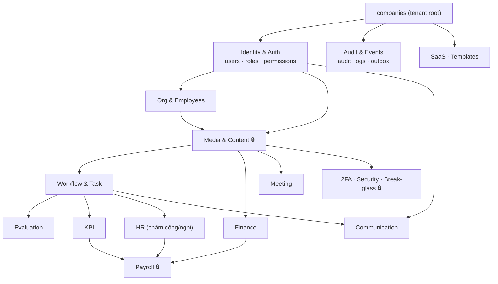
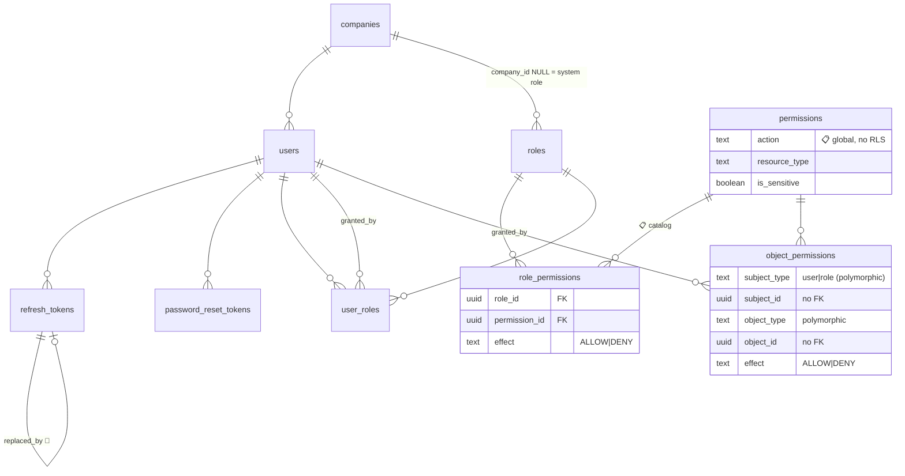
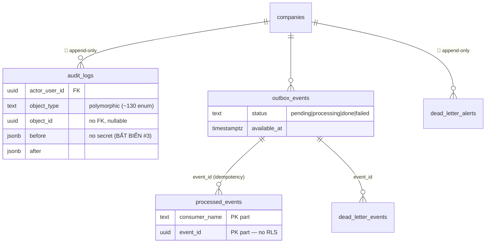
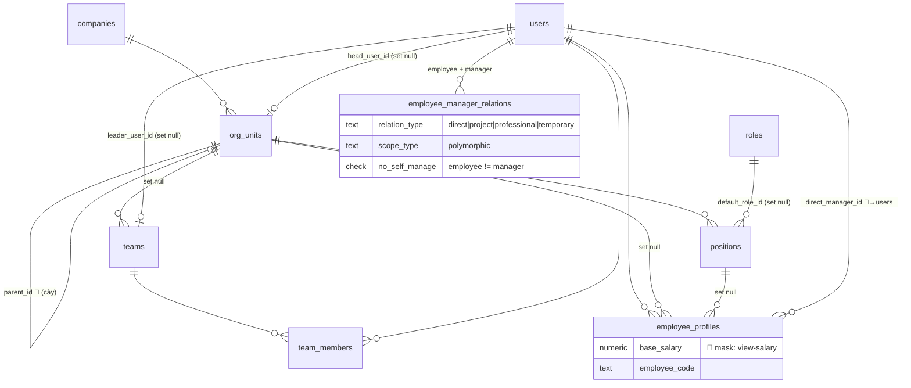
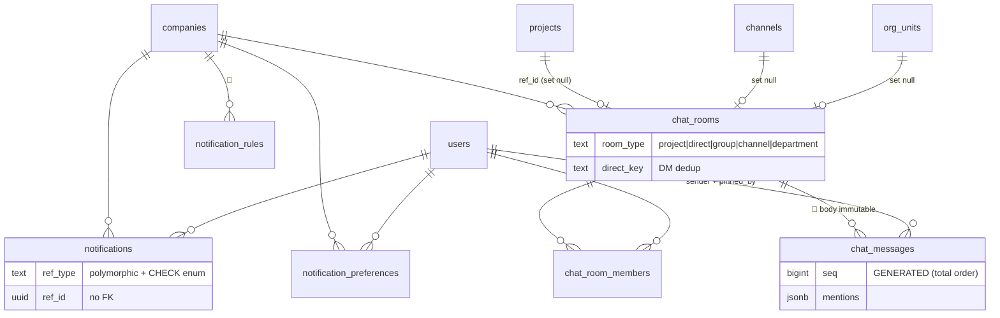
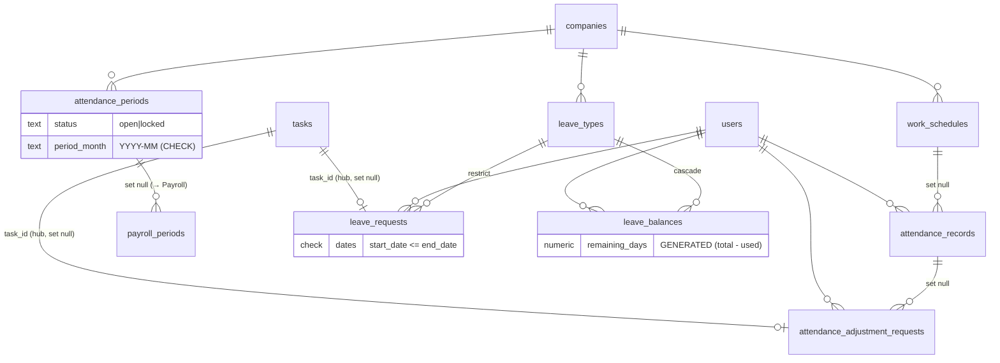
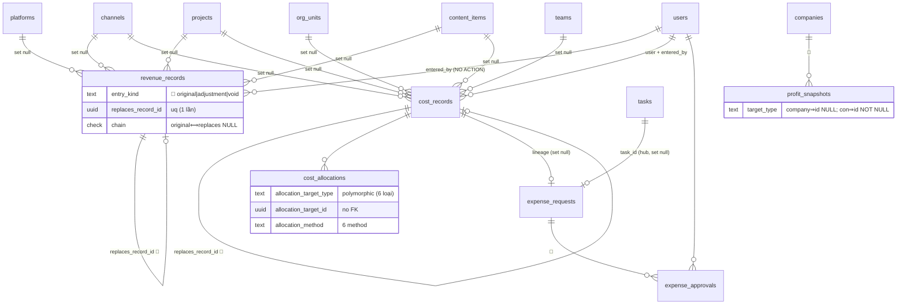
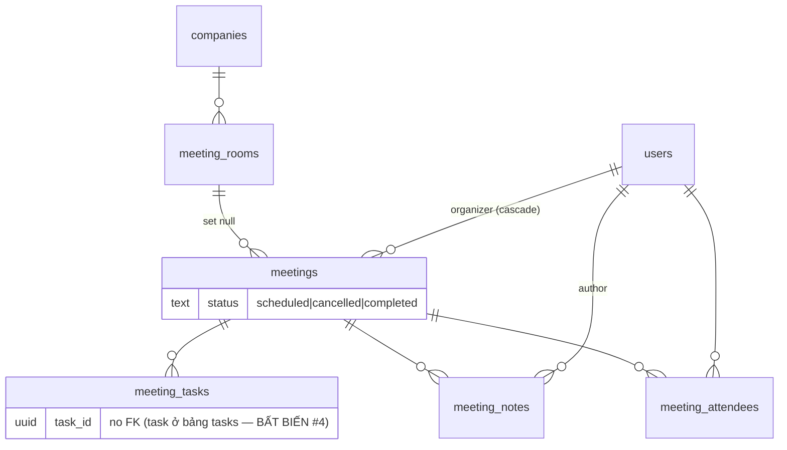
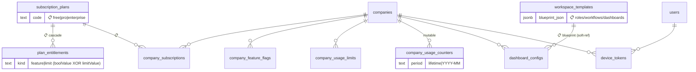

# MediaOS — ERD đầy đủ (theo code hiện tại)

> **Sơ đồ quan hệ dữ liệu ĐẦY ĐỦ** dựng trực tiếp từ 25 file schema Drizzle (`apps/api/src/db/schema/`).
> Bổ sung cho ERD "representative subset" ở [`SYSTEM-DESIGN.md §14`](./SYSTEM-DESIGN.md#14-mô-hình-dữ-liệu-erd).
> Mốc đối chiếu: git `040dd82`. Tách theo domain vì mermaid `erDiagram` không hỗ trợ subgraph.

## Quy ước đọc

- **`||--o{`** = 1‑nhiều (cha có 0..n con) · **`}o--||`** = nhiều‑1 · **`}o--o{`** = nhiều‑nhiều (qua bảng nối).
- **Mọi bảng tenant-scoped** đều có `company_id NOT NULL → companies(id)` + FORCE RLS. Để giảm nhiễu, cạnh `→ companies` **không vẽ lặp** trong từng domain (chỉ vẽ ở sơ đồ tổng).
- 🔒 = mã hóa envelope · 📋 = catalog global (no RLS) · 🔁 = append-only (app chỉ SELECT/INSERT) · 🔑 = self-FK.
- **Polymorphic** (`*_type` + `*_id`, KHÔNG FK DB) ghi bằng ghi chú, không vẽ cạnh cứng.

## Thống kê thực tế

| Domain | Số bảng | Domain | Số bảng |
|---|---|---|---|
| Foundation (companies) | 1 | Communication | 6 |
| Identity & Auth | 8 | HR (chấm công/nghỉ) | 7 |
| Audit & Events | 5 | Finance | 6 |
| Org & Employees | 6 | Payroll 🔒 | 6 |
| Media & Content | 14 | Evaluation | 4 |
| Workflow & Task | 17 | KPI | 2 |
| Meeting | 5 | 2FA & Security 🔒 | 3 |
| Break-glass | 2 | SaaS | 6 |
| Templates | 2 | Device tokens | 1 |
| **TỔNG** | | | **~101 bảng** |

> ⚠️ **Đính chính tài liệu:** SYSTEM-DESIGN.md ghi "~90 bảng" và erd-v2.md là bản kế hoạch cũ — số bảng thực tế đếm từ code là **~101**.

---

## 0. Sơ đồ tổng — phụ thuộc giữa các domain



---

## 1. Identity & Auth (8 bảng)



- `permissions` 📋 **global catalog** (không `company_id`, không RLS). `role_permissions` RLS qua JOIN `roles`.
- `roles.company_id` **nullable** — NULL = system role (seed, app không ghi được).
- `object_permissions`: subject/object là **polymorphic** (không FK DB) — deny-overrides ở app layer.

---

## 2. Audit & Events (5 bảng)



- `audit_logs` 🔁 + polymorphic `object_type/object_id` (lưới an toàn = CHECK enum + composite index).
- `processed_events` là **infra** (no `company_id`, no RLS) — idempotency `(consumer_name, event_id)`.

---

## 3. Org & Employees (6 bảng)



---

## 4. Media & Content (14 bảng) 🔒

```mermaid
erDiagram
    platforms ||--o{ channels : "📋 restrict"
    companies ||--o{ channels : ""
    channels ||--o{ channel_members : ""
    users ||--o{ channel_members : ""
    platforms ||--o{ platform_accounts : "📋 restrict"
    channels }o--o{ platform_accounts : "via channel_accounts (M:N)"
    channels ||--o{ channel_accounts : ""
    platform_accounts ||--o{ channel_accounts : "cascade"
    companies ||--o{ projects : ""
    org_units ||--o{ projects : "set null"
    projects ||--o{ project_channels : ""
    channels ||--o{ project_channels : ""
    projects ||--o{ project_teams : ""
    teams ||--o{ project_teams : ""
    projects ||--o{ project_members : ""
    users ||--o{ project_members : ""
    companies ||--o{ content_types : ""
    projects ||--o{ content_items : ""
    content_types ||--o{ content_items : "set null"
    channels ||--o{ content_items : "main_channel_id (set null)"
    content_items ||--o{ content_channels : ""
    channels ||--o{ content_channels : ""
    platforms ||--o{ content_channels : "restrict"
    content_items ||--o{ content_assets : "version chain"

    platform_accounts {
        bytea secret_ciphertext "🔒 envelope"
        bytea encrypted_dek "🔒"
        bytea iv_nonce "len=12"
        bytea auth_tag "len=16"
        text recovery_email "🔐 PII, no DTO"
    }
    channel_accounts {
        text relation_type "immutable, hard-DELETE"
        uniqueIndex "company+channel+account+relation_type"
    }
    content_assets {
        uuid version_group_id "🔑 chain"
        uuid parent_asset_id "🔑 nullable"
        boolean is_current "one-current uq"
        uuid superseded_by
    }
```

- **Đính chính ERD chính:** `platform_accounts ↔ channels` là **M:N qua `channel_accounts`**, KHÔNG phải FK trực tiếp.
- `encryption_keys` 📋 (global KEK registry) đứng riêng — xem domain Security.
- `content_assets`: chuỗi version (`version_group_id` + `parent_asset_id` + `is_current` + `superseded_by`), unique 1‑current.

---

## 5. Workflow & Task (17 bảng)

```mermaid
erDiagram
    companies ||--o{ workflow_definitions : ""
    workflow_definitions ||--o{ workflow_definition_steps : ""
    workflow_definition_steps ||--o| checklists : "default_checklist_id 🔁circular"
    checklists ||--o| workflow_definition_steps : "wf_def_step_id 🔁circular"
    checklists ||--o{ checklist_items : ""
    workflow_definitions ||--o{ workflow_step_dependencies : "DAG edges"
    workflow_definition_steps ||--o{ workflow_step_dependencies : "from + to (no self-loop)"
    workflow_definitions ||--o{ step_transitions : "FSM"
    workflow_definitions ||--o{ workflow_instances : ""
    content_items ||--o{ workflow_instances : "cascade"
    projects ||--o{ workflow_instances : "cascade (XOR content_item)"
    workflow_instances ||--o{ workflow_steps : ""
    users ||--o{ workflow_steps : "assignee + reviewer (set null)"
    workflow_steps ||--o{ workflow_step_checklist_states : ""
    checklist_items ||--o{ workflow_step_checklist_states : ""
    workflow_steps ||--o{ workflow_step_instance_locks : "locked + caused_by"
    workflow_steps ||--o{ approval_requests : ""
    approval_requests ||--o{ approval_steps : "🔁 append-only"
    workflow_steps ||--o{ approval_rules : "level → approver"
    workflow_steps ||--o{ defects : "🔁"
    approval_steps ||--o| defects : "caused_by (set null)"
    workflow_steps ||--o{ tasks : "set null (hub)"
    workflow_instances ||--o{ tasks : "set null"
    content_items ||--o{ tasks : "set null"
    projects ||--o{ tasks : "set null"
    tasks ||--o{ task_comments : "🔁"
    tasks ||--o{ task_attachments : "🔁 soft-del"

    workflow_instances {
        check target "content_item XOR project = 1"
    }
    workflow_steps {
        text status "ADR-0016: consumer ghi approved/revision"
    }
    tasks {
        text task_type "8 loại (hub BẤT BIẾN #4)"
        uniqueIndex dedup_key "company+step+revision_round"
    }
    approval_steps {
        text decision "approved|revision_requested"
        uniqueIndex "request + level"
    }
```

- `workflow_definition_steps ⇄ checklists`: **FK vòng** (Drizzle lazy-thunk).
- `workflow_instances`: **exactly-one** target `content_item_id XOR project_id`.
- ADR-0016: `approval_requests/steps` = nguồn sự thật; `workflow_steps.status` là projection.
- `tasks` = hub thống nhất (FK thật tới workflow_step/instance/content/project, đều `set null`).

---

## 6. Communication (6 bảng)



- `chat_rooms`: scope **exactly-one** trong {ref_id(project), channel_id, org_unit_id, direct_key} (partial unique).
- `chat_messages` 🔁: chỉ `pinned_at/pinned_by` được UPDATE (column-grant); body/sender bất biến.

---

## 7. HR — Chấm công & Nghỉ phép (7 bảng)



- `attendance_adjustment_requests` & `leave_requests` đều phát **task** vào hub (`task_type='hr'`).
- `attendance_periods → payroll_periods`: kỳ chấm công khóa trước khi chạy lương.

---

## 8. Finance (6 bảng)



- `revenue_records` · `cost_records` · `profit_snapshots` · `expense_approvals` đều 🔁 (chuỗi `entry_kind`/`replaces`).
- `cost_allocations` dùng **polymorphic** target (channel/project/content/team/org_unit/employee) + CHECK enum.
- Vòng đời chi phí: `expense_requests → (duyệt) → cost_records` (lineage 2 chiều, FK set ở mig 0073).

---

## 9. Payroll (6 bảng) 🔒 crown-jewel

```mermaid
erDiagram
    companies ||--o{ salary_profiles : ""
    users ||--o{ salary_profiles : ""
    companies ||--o{ payroll_periods : ""
    attendance_periods ||--o| payroll_periods : "set null"
    users ||--o{ payroll_periods : "created/approved/published_by"
    payroll_periods ||--o{ payslips : "🔁"
    salary_profiles ||--o{ payslips : ""
    users ||--o{ payslips : ""
    payslips ||--o{ payslip_items : "🔁"
    payslips ||--o| payslips : "replaces_payslip_id 🔑"
    payslips ||--o{ payslip_acknowledgements : ""
    users ||--o{ payslip_acknowledgements : ""
    users ||--o{ bonus_penalties : "NO ACTION"
    tasks ||--o| bonus_penalties : "restrict"
    defects ||--o| bonus_penalties : "restrict"
    kpi_results ||--o| bonus_penalties : "restrict"
    payroll_periods ||--o{ bonus_penalties : "set null (consume)"

    salary_profiles {
        numeric base_salary "🔐 mask view-salary"
        jsonb allowances "🔐"
    }
    payroll_periods {
        text status "FSM: draft→approved→published"
        boolean kpi_locked
    }
    payslips {
        text entry_kind "🔁 original|adjustment|void"
        uniqueIndex "company+period+user WHERE original"
    }
    bonus_penalties {
        text reference_type "task|defect|kpi_result (exactly-one CHECK)"
        text status "draft|approved|rejected (FSM)"
    }
```

- `payslips` 🔁: chuỗi `entry_kind` + `replaces_payslip_id`; unique theo `original`.
- `bonus_penalties`: **exactly-one** reference {task/defect/kpi_result}; consume vào `payroll_period` chỉ khi `approved`.
- Lương (`base_salary`, `allowances`) 🔐 mask theo quyền `view-salary`; payslip có re-auth gate.

---

## 10. Evaluation + KPI (6 bảng)

```mermaid
erDiagram
    companies ||--o{ evaluation_templates : ""
    evaluation_templates ||--o{ evaluation_criteria : ""
    evaluation_templates ||--o{ evaluation_results : "🔁"
    workflow_steps ||--o{ evaluation_results : ""
    users ||--o{ evaluation_results : "subject + evaluator"
    evaluation_results ||--o{ evaluation_scores : "🔁"
    evaluation_criteria ||--o{ evaluation_scores : ""
    companies ||--o{ kpi_definitions : ""
    kpi_definitions ||--o{ kpi_results : "🔁 snapshot"
    users ||--o{ kpi_results : "subject_user (XOR team)"
    teams ||--o{ kpi_results : "subject_team"

    evaluation_criteria {
        numeric weight "0<w<=100"
        check "max_score > min_score"
    }
    kpi_definitions {
        jsonb weights "5 thành phần, sum=100 (CHECK)"
    }
    kpi_results {
        check subject "user XOR team"
        numeric total_score "0-100"
        timestamptz confirmed_at "NULL = tham chiếu"
    }
```

- `kpi_results` 🔁 snapshot: **exactly-one** subject (user XOR team); `confirmed_at` NULL = chưa khóa.
- `evaluation_results` không có unique → cho phép chấm lại (mỗi lần 1 row mới).

---

## 11. Meeting (5 bảng)



- `meeting_tasks.task_id` là **uuid trần** (không FK) — action item sống ở bảng `tasks` (hub).

---

## 12. 2FA · Security · Break-glass (5 bảng) 🔒

```mermaid
erDiagram
    encryption_keys ||..o{ user_totp : "📋 KEK registry (no FK)"
    encryption_keys ||..o{ platform_accounts : "📋 (no FK)"
    users ||--o| user_totp : ""
    users ||--o{ user_recovery_codes : ""
    users ||--o{ security_alerts : "🔁 subject"
    companies ||--o{ break_glass_grants : ""
    platform_accounts ||--o{ break_glass_grants : "cascade"
    users ||--o{ break_glass_grants : "requester + revoked_by"
    break_glass_grants ||--o{ break_glass_approvals : "🔁 SoD>=2"
    users ||--o{ break_glass_approvals : "approver"

    user_totp {
        bytea secret_ciphertext "🔒 envelope"
        bytea encrypted_dek "🔒"
        timestamptz enabled_at "NULL = chưa confirm"
    }
    user_recovery_codes {
        text code_hash "SHA-256, không plaintext"
    }
    break_glass_grants {
        int required_approvals ">=2 (SoD)"
        text status "pending|active|revoked"
    }
    break_glass_approvals {
        check no_self_approve "approver != requester"
        uniqueIndex "company+grant+approver"
    }
```

- `encryption_keys` 📋 global (no `company_id`, no RLS) — `kms_key_id` = đường dẫn Vault, KHÔNG phải key material. Liên kết tới `user_totp`/`platform_accounts` qua `kms_key_id`/`dek_key_version` (logic, không FK).
- `break_glass`: SoD ép 3 tầng (UNIQUE + CHECK no-self-approve + COUNT DISTINCT ≥2). Grant chỉ giữ con trỏ `platform_account_id`, KHÔNG chứa secret.

---

## 13. SaaS + Templates + Device (9 bảng)



- `subscription_plans`, `plan_entitlements`, `workspace_templates` đều 📋 **global catalog**.
- `dashboard_configs.role_code` là **soft-ref** (text, không FK tới roles).

---

## 14. Tổng hợp phân loại bảng

### 📋 Catalog global (6 — KHÔNG company_id, KHÔNG RLS)
`permissions` · `platforms` · `encryption_keys` · `subscription_plans` · `plan_entitlements` · `workspace_templates`
*(`processed_events` cũng no-RLS nhưng là infra, không phải catalog.)*

### 🔁 Append-only (16 — app chỉ SELECT/INSERT)
`audit_logs` · `outbox_events` · `dead_letter_events` · `dead_letter_alerts` · `approval_steps` · `defects` · `task_comments` · `task_attachments`(soft-del) · `chat_messages`(trừ pin) · `revenue_records` · `cost_records` · `profit_snapshots` · `expense_approvals` · `payslips` · `payslip_items` · `evaluation_results` · `evaluation_scores` · `kpi_results` · `security_alerts` · `break_glass_approvals`

### 🔒 Mã hóa envelope (2) + hash (1)
`platform_accounts.secret_ciphertext` · `user_totp.secret_ciphertext` (AES-256-GCM, DEK/KEK) · `user_recovery_codes.code_hash` (SHA-256).

### 🔑 Self-FK / chuỗi
`refresh_tokens.replaced_by` · `org_units.parent_id` · `employee_profiles.direct_manager_id` · `content_assets.parent_asset_id` · `revenue_records`/`cost_records`/`payslips.replaces_*`.

### Polymorphic (no FK DB — CHECK enum + composite index)
`audit_logs`(object) · `object_permissions`(subject+object) · `notifications`(ref) · `cost_allocations`(target) · `bonus_penalties`(reference) · `employee_manager_relations`(scope) · `meeting_tasks.task_id`.

### Ràng buộc toàn vẹn tiêu biểu
- **Exactly-one:** `workflow_instances`(content XOR project) · `kpi_results`(user XOR team) · `bonus_penalties`(task/defect/kpi) · `chat_rooms`(4 scope) · `profit_snapshots`(company⇒id NULL).
- **No-self:** `employee_manager_relations` · `workflow_step_dependencies` · `break_glass_approvals`.
- **Append-only chain:** `revenue/cost_records` + `payslips` (`entry_kind` + `replaces_*` + CHECK + unique-replaces).
- **Soft-delete unique:** partial index `WHERE deleted_at IS NULL` (users/channels/projects/roles…).

---

> Sinh từ code tại git `040dd82`. Cập nhật khi schema đổi. Nguồn: `apps/api/src/db/schema/*.ts`.
