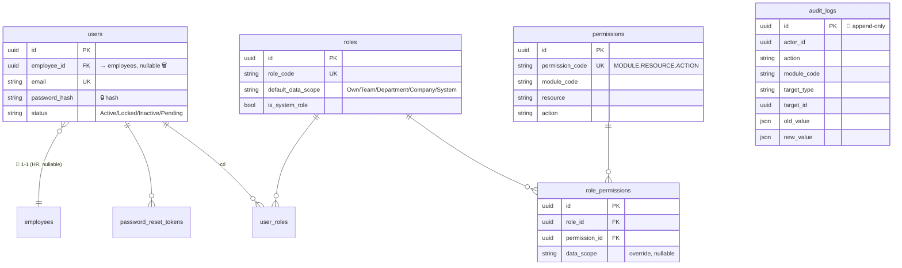
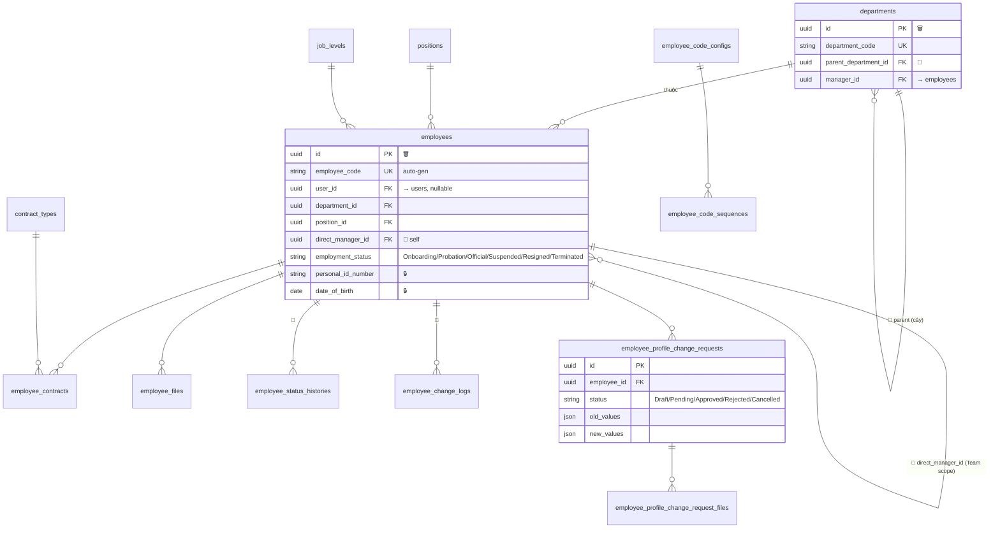
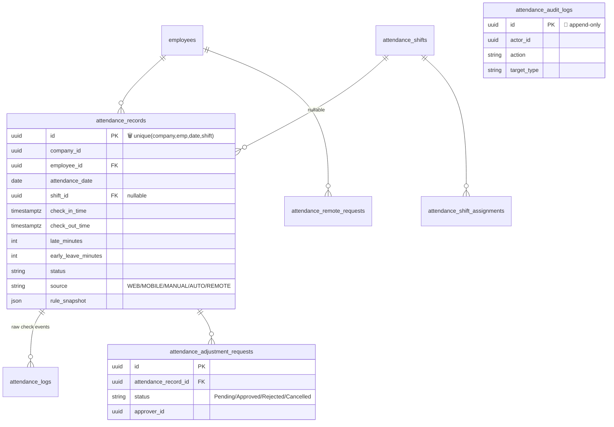
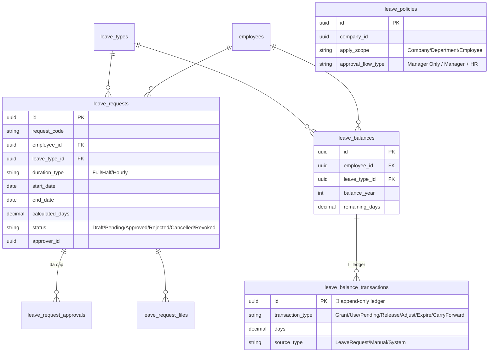
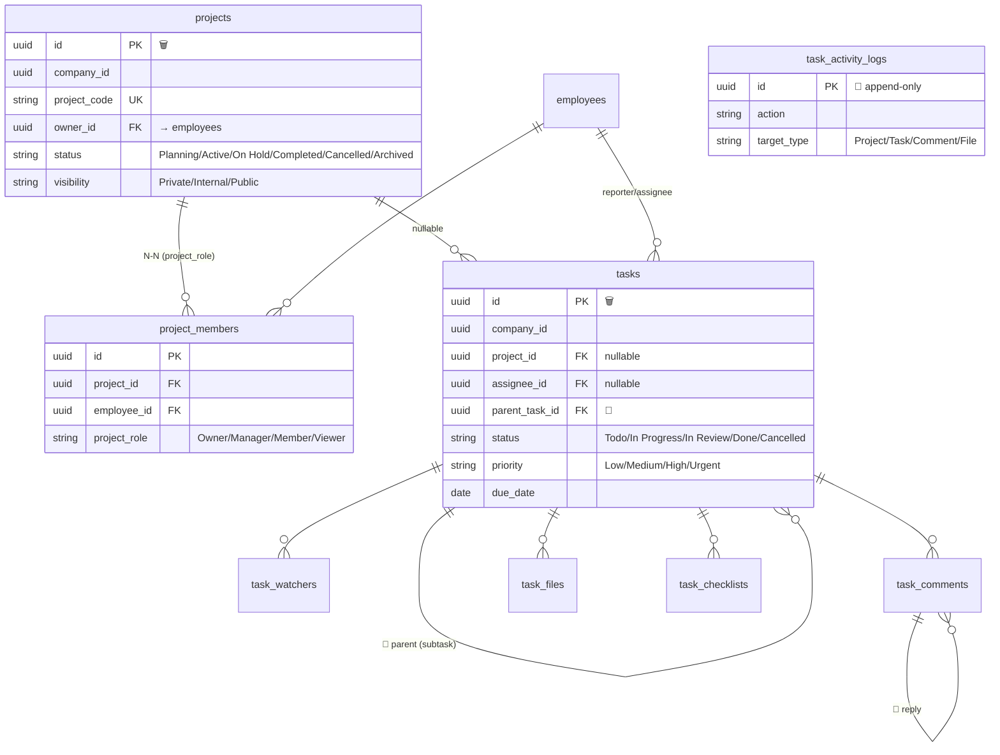
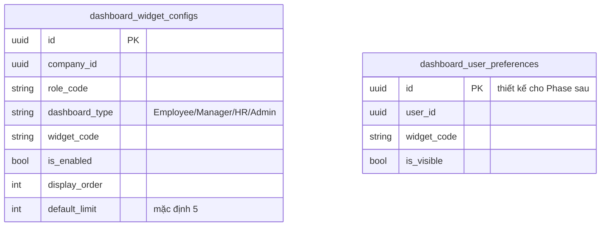
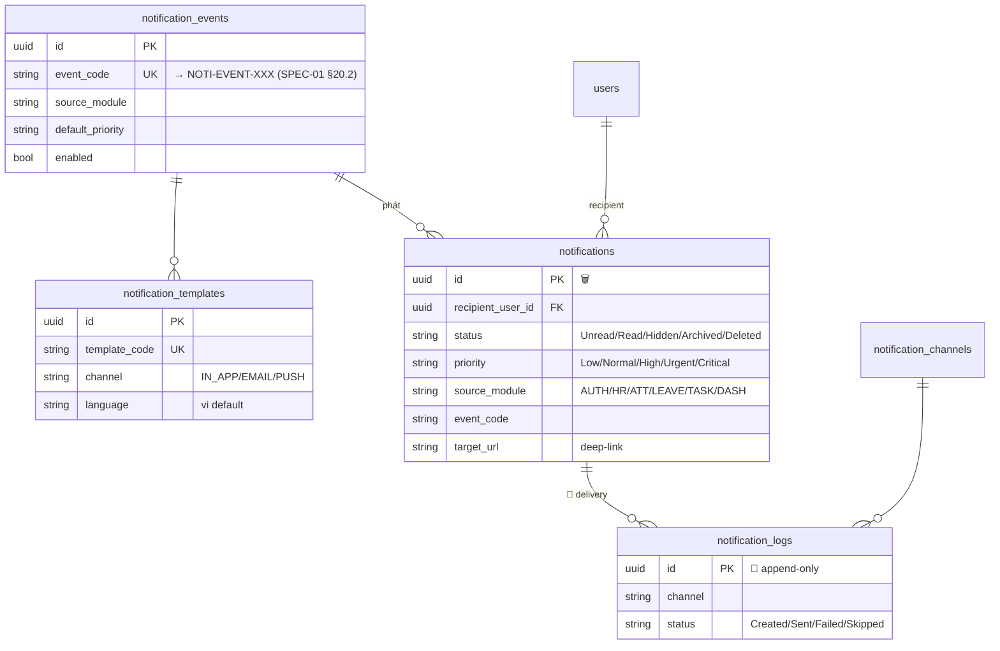
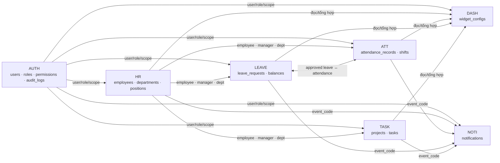

# ERD — Hệ thống Quản lý Doanh nghiệp (theo `docs/spec/`)

> **Sơ đồ quan hệ dữ liệu** của 7 module MVP, dựng từ phần **"Dữ liệu cần lưu"** của bộ SPEC-02…08.
> Nguồn sự thật field đầy đủ: từng SPEC §"Dữ liệu cần lưu". Tài liệu này chỉ vẽ thực thể + quan hệ tầng-trên.
> ⚠️ De-media-fy 2026-06-20: ERD media/finance/payroll/SaaS cũ đã bỏ. Bảng của các subsystem **parked** (xem [`SYSTEM-DESIGN.md §14`](./SYSTEM-DESIGN.md#14-subsystem-parked-hướng-cũ)) không vẽ ở đây.

## Quy ước đọc

- **`||--o{`** = 1‑nhiều · **`}o--||`** = nhiều‑1 · **`}o--o{`** = nhiều‑nhiều (qua bảng nối) · 🔑 = self-FK (cây/đệ quy).
- 🔁 = **append-only** (app chỉ SELECT/INSERT, không UPDATE/DELETE) · 🗑️ = có `deleted_at` (soft-delete) · 🔒 = field nhạy cảm mask theo quyền.
- **Đa-công-ty:** `company_id` xuất hiện trên bảng nghiệp vụ ATT/LEAVE/TASK/DASH/NOTI + cấu hình (`leave_policies`, `employee_code_configs`…). Bảng lõi AUTH/HR (`users`, `employees`, `roles`…) ở khung đơn-công-ty (N=1) chưa mang `company_id` cứng — sẽ thêm khi bật multi-company. Cạnh `→ companies` không vẽ lặp để giảm nhiễu.
- Mã chuẩn quyền/lỗi/event theo SPEC-01 §9.

## Thống kê thực thể MVP

| Module | Bảng | Module | Bảng |
|---|---|---|---|
| AUTH (foundation) | 7 | TASK | 8 |
| HR | 13 | DASH | 3 |
| ATT | 8 | NOTI | 6 |
| LEAVE | 7 | **TỔNG** | **~52 bảng MVP** |

---

## 1. AUTH — Tài khoản, vai trò, phân quyền, audit (SPEC-02)

Module nền tảng: cung cấp RBAC + audit cho mọi module. `users.employee_id ↔ employees.user_id` là link 1‑1 tài khoản ↔ hồ sơ HR.

- **Role hệ thống mặc định:** `SUPER_ADMIN, COMPANY_ADMIN, HR, MANAGER, EMPLOYEE`. Scope mặc định: SA=System · ADM/HR=Company · MGR=Team · EMP=Own.
- **`audit_logs`** 🔁 dùng chung cho toàn hệ thống (SPEC-01 §16.3). HR change-log có thể tái dùng bảng này.
- 2FA TOTP (login challenge) mô tả ở SPEC-02; secret TOTP lưu mã hóa, recovery code lưu hash.

---

## 2. HR — Nhân sự, tổ chức, hợp đồng (SPEC-03)

- **Thực thể khác:** `positions` (chức vụ, `default_level_id`), `job_levels` (cấp bậc, `order_index`), `contract_types` (loại HĐ), `employee_code_configs` + `employee_code_sequences` (sinh mã NV tự động theo rule).
- **Nhạy cảm 🔒** (mask theo quyền `HR.EMPLOYEE.VIEW_SENSITIVE`): CCCD, ngày sinh, lương cơ bản, tài khoản ngân hàng, file `is_sensitive`.
- **Self-service:** nhân viên gửi `employee_profile_change_requests` → HR duyệt/từ chối (workflow phê duyệt nhẹ trong module).

---

## 3. ATT — Chấm công (SPEC-04)

- **`attendance_logs`** 🔁: sự kiện check-in/out thô (device, IP, GPS). **`attendance_rules`** + **`attendance_shift_assignments`**: cấu hình theo độ ưu tiên Employee → Department → Company → mặc định.
- **`attendance_remote_requests`**: remote/công tác thuộc **ATT** (KHÔNG phải LEAVE).
- **Liên kết LEAVE:** đơn nghỉ được duyệt → ghi/đè `attendance_records` (status `Leave`).

---

## 4. LEAVE — Nghỉ phép (SPEC-05)

- **`leave_balance_transactions`** 🔁 là ledger bất biến — số dư `leave_balances.remaining_days` là kết quả cộng dồn transaction. **`leave_policies`** ưu tiên Employee → Department → Company → mặc định.
- **Đồng bộ ATT:** duyệt → ghi `attendance_records`; hủy/thu hồi (`Revoked`) → ATT tính lại. Approver resolve qua HR `direct_manager_id`.

---

## 5. TASK — Công việc & dự án (SPEC-06)

- **Vai trò cấp-dự-án** (`project_members.project_role`: Owner/Manager/Member/Viewer) chồng lên role hệ thống — thêm scope **Project** (member-of). `Overdue` là trạng thái **dẫn xuất** từ `due_date`, không lưu cứng (SPEC-01 §17.7).

---

## 6. DASH — Dashboard (SPEC-07)

DASH **chỉ đọc/tổng hợp** từ ATT/TASK/LEAVE/HR/NOTI/AUTH + deep-link; module nguồn ép data scope. Chỉ sở hữu bảng cấu hình widget.

- Tùy chọn: bảng `dashboard_summary/cache` (`scope_type`, `metric_code`, `metric_value`, `expired_at`) cho cache số liệu — có thể chưa dùng trong MVP.

---

## 7. NOTI — Thông báo (SPEC-08)

Sink cho event từ mọi module; gửi tới user theo `recipient_user_id`.

- **`notification_channels`** (IN_APP bắt buộc MVP; EMAIL/PUSH Phase sau). **`notification_user_preferences`** thiết kế cho Phase sau. `event_code` ánh xạ bộ chuẩn SPEC-01 §20.2.

---

## 8. Bản đồ liên-module (tổng)

**Bảng append-only 🔁 (Bất biến #2):** `audit_logs` · `attendance_audit_logs` · `task_activity_logs` · `leave_balance_transactions` · `notification_logs` · `employee_status_histories` · `employee_change_logs` — app role không UPDATE/DELETE.

> Field đầy đủ + ràng buộc CHECK/UNIQUE: xem từng SPEC §"Dữ liệu cần lưu" trong [`docs/spec/`](./spec/).
