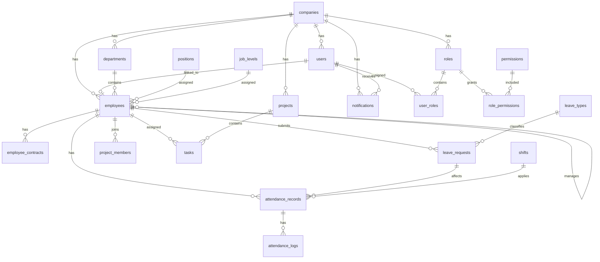
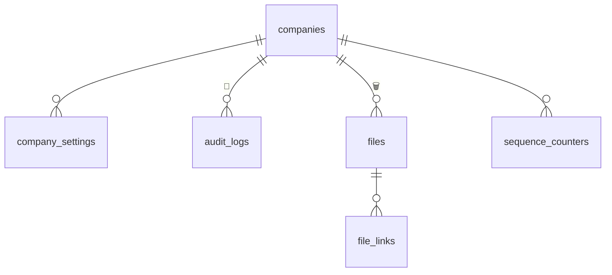
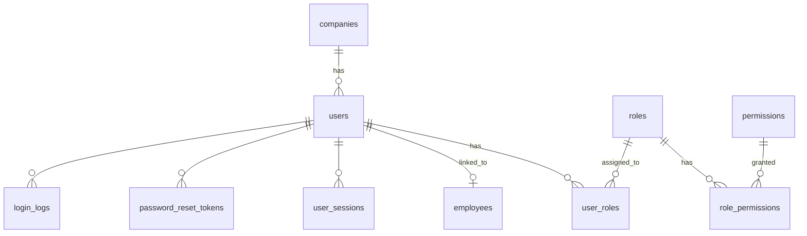
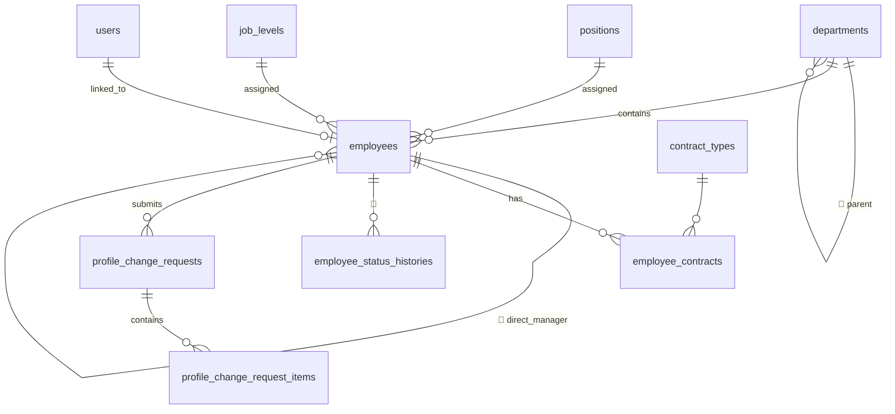
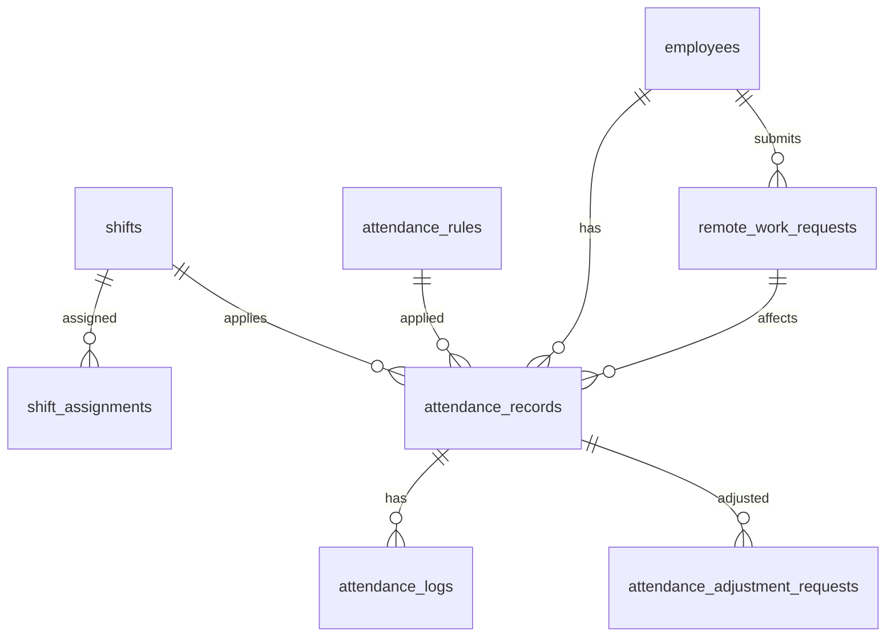
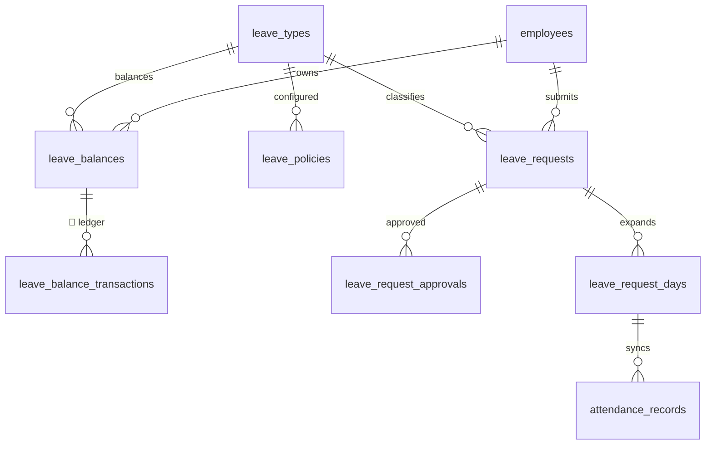
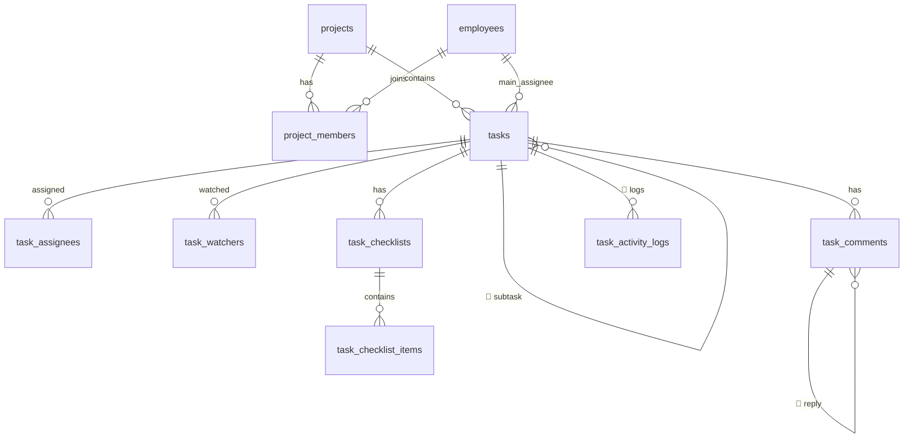
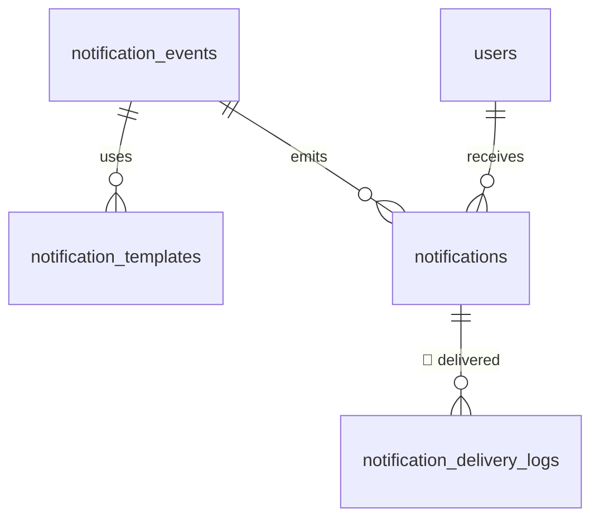

# ERD — Thiết kế DB hiện tại (theo `docs/DB`) — MediaOS

> **Nguồn sự thật = bộ thiết kế `docs/DB/DB-01…10`** (gold-standard). Đây là **thiết kế CHUẨN** cho 7 module MVP + Foundation: AUTH · HR · ATT · LEAVE · TASK · DASH · NOTI. Tài liệu này tổng hợp ERD + bảng/cột/quan hệ cấp trên; field/constraint chi tiết từng module: xem DB-02…08.
> ⚠️ **Code hiện thực hoá đang LỆCH & LẪN bảng hướng cũ** (media/finance/payroll…). Phần đối chiếu code↔thiết kế: **[§Phụ lục A](#phụ-lục-a--trạng-thái-hiện-thực-hoá-code--thiết-kế)**. Liệt kê bảng thật trong DB (gồm parked): xem lịch sử git của file này hoặc đọc thẳng `apps/api/src/db/schema/`.
> **Cập nhật:** 2026-06-26.

## Bất biến DB (DECISIONS-02 §2–3)

1. Mọi bảng có `company_id` PHẢI bật **RLS + FORCE** (BẤT BIẾN #1) — cô lập tenant ở tầng DB.
2. `audit_logs` (và bảng snapshot) **append-only**: app role REVOKE UPDATE/DELETE (BẤT BIẾN #2).
3. Secret/mật khẩu **hash/encrypt**, không plaintext (BẤT BIẾN #3).
4. Audit/event ghi qua **outbox** trong cùng transaction nghiệp vụ.
5. **Soft-delete** (`deleted_at`/`deleted_by`) cho dữ liệu quan trọng — KHÔNG hard-delete.

## Quy ước

- PK = khoá chính (`id` UUID) · FK = khoá ngoại `{table_singular}_id` · UK = unique · 🔑 self-FK (cây/đệ quy) · 🔒 nhạy cảm (mask theo quyền) · 🗑️ soft-delete · 🔁 append-only.
- Bảng nghiệp vụ có **bộ cột audit chuẩn**: `created_at/created_by/updated_at/updated_by/deleted_at/deleted_by` (DB-01 §5.4) — bảng dưới chỉ ghi cột đặc thù, ngầm hiểu có audit cols.
- `company_id` trên hầu hết bảng nghiệp vụ (multi-tenant); bảng global (`permissions`, `modules`, `system_settings`) có thể không có hoặc nullable.
- Mã nghiệp vụ ở cột `code` (employee_code, project_code, permission_code…). Status = text + CHECK (DB-01 §6.5).

## Thống kê (thiết kế MVP)

| Nhóm | Bảng | Nhóm | Bảng |
| --- | --- | --- | --- |
| Foundation/System | 9 | LEAVE | 7 |
| AUTH/RBAC | 8 | TASK | 11 |
| HR | 11 | NOTI | 5 |
| ATT | 9 | DASH | 3 |
| | | **TỔNG** | **63 bảng MVP** |

---

## 0. ERD cấp cao — toàn hệ thống (DB-01 §16)

> **Nguyên tắc liên-module:** AUTH = nền phân quyền · **HR (employees) = trung tâm dữ liệu nhân sự**; ATT/LEAVE/TASK gắn trực tiếp `employee_id` · NOTI = sink event dùng chung · DASH chỉ tổng hợp (không sở hữu dữ liệu gốc).

---

## 1. Foundation / System (DB-01 §7.1, §8 · DB-08)

| Bảng | Mô tả | Cột đặc thù chính |
| --- | --- | --- |
| **companies** 🗑️ | Công ty/tenant (gốc) | `company_code` UK · name · legal_name · tax_code · email · phone · address · timezone · status (Active/Inactive/Suspended) |
| **modules** | Danh mục module | `module_code` (AUTH/HR/ATT/LEAVE/TASK/DASH/NOTI) · name · is_active · sort_order |
| **company_settings** | Cấu hình theo công ty | company_id · setting_key · setting_value · (override system_settings) |
| **system_settings** 🌐 | Cấu hình global/default | setting_key · setting_value (global, no company_id) |
| **audit_logs** 🔁 | Nhật ký thao tác toàn hệ thống | company_id · actor_user_id · actor_employee_id · module_code · action (CREATE/UPDATE/DELETE/APPROVE/REJECT/LOGIN/EXPORT) · entity_type · entity_id · old_values jsonb · new_values jsonb · metadata jsonb(ip/ua/request_id) · created_at |
| **files** 🗑️ | Metadata file (binary ở storage) | company_id · original_name · stored_name · mime_type · file_size · storage_provider(local/s3/gcs/minio) · storage_path · checksum · uploaded_by · is_private 🔒 |
| **file_links** | File ↔ entity nghiệp vụ (polymorphic) | file_id · module_code · entity_type · entity_id · link_type(attachment/avatar/contract/document) |
| **sequence_counters** | Sinh mã tự động | sequence_key(EMPLOYEE_CODE/LEAVE_REQUEST_CODE/PROJECT_CODE) · prefix · current_value · padding_length · reset_policy(NEVER/YEARLY/MONTHLY) |
| **public_holidays** | Ngày lễ/ngày không làm | holiday_date · name · is_paid · affects_attendance · affects_leave |

---

## 2. AUTH / RBAC (DB-01 §7.2, §9 · DB-02)

### users 🗑️

| Cột | Kiểu | Ghi chú |
| --- | --- | --- |
| id | UUID | PK |
| company_id | UUID | FK→companies.id |
| email | VARCHAR | UK (company_id, email) |
| password_hash | VARCHAR | 🔒 hash (BẤT BIẾN #3) |
| display_name | VARCHAR | tên hiển thị |
| avatar_file_id | UUID | FK→files.id, nullable |
| status | VARCHAR | Pending Activation/Active/Inactive/Locked/Deleted |
| last_login_at · password_changed_at | TIMESTAMP | nullable |
| + audit cols | | created/updated/deleted_* |

### roles 🗑️

`id` PK · `company_id` (NULL=global) · `role_code` UK(company_id,role_code) **SUPER_ADMIN/COMPANY_ADMIN/HR/MANAGER/EMPLOYEE** · name · description · is_system_role · status(Active/Inactive).

### permissions 🌐

`id` PK · `module_code` · `permission_code` UK (vd `HR.EMPLOYEE.VIEW`) · `resource` · `action`(VIEW/CREATE/UPDATE/DELETE/APPROVE) · is_active. (Global — không company_id.)

### user_roles

`id` PK · company_id · user_id FK→users · role_id FK→roles · assigned_by · assigned_at · expired_at(nullable) · is_active. **UK (user_id, role_id)**.

### role_permissions

`id` PK · company_id(nullable) · role_id FK→roles · permission_id FK→permissions · `data_scope`(Own/Team/Department/Project/Company/System) · conditions jsonb. **UK (role_id, permission_id, data_scope)**.

### user_sessions

`id` PK · user_id FK→users · `refresh_token_hash` 🔒 · ip_address · user_agent · device_id · expired_at · revoked_at · created_at.

### password_reset_tokens

`id` PK · user_id FK→users · `token_hash` 🔒 · purpose(ResetPassword/ActivateAccount) · expires_at · used_at.

### login_logs 🔁

`id` PK · company_id(nullable, pre-auth) · user_id(nullable) · email · login_status(Success/Failed/Blocked) · failure_reason · ip_address · user_agent · created_at.

---

## 3. HR (DB-01 §7.3, §10 · DB-03)

### employees 🗑️ (trung tâm dữ liệu nhân sự)

| Cột | Kiểu | Ghi chú |
| --- | --- | --- |
| id | UUID | PK |
| company_id | UUID | FK→companies.id |
| user_id | UUID | FK→users.id (nullable — employee không bắt buộc có account) |
| employee_code | VARCHAR | UK (company_id, employee_code) |
| full_name · first_name · last_name | VARCHAR | |
| gender · date_of_birth | | 🔒 |
| personal_email · phone · address | | 🔒 |
| company_email | VARCHAR | UK (company_id, company_email) |
| department_id · position_id · job_level_id | UUID | FK |
| direct_manager_id | UUID | 🔑 FK→employees.id, nullable |
| joined_date · official_date · resigned_date | DATE | |
| employment_status | VARCHAR | Probation/Official/Temporarily Suspended/Resigned/Terminated |
| avatar_file_id | UUID | FK→files.id |
| + audit cols | | |

### departments 🗑️

`id` PK · company_id · `parent_department_id` 🔑 FK→departments · department_code · name · manager_employee_id FK→employees · status(Active/Inactive) · sort_order.

### positions 🗑️

`id` PK · company_id · position_code · name · description · status.

### job_levels 🗑️

`id` PK · company_id · level_code(INTERN/JUNIOR/SENIOR/MANAGER) · name · rank_order · status.

### contract_types

`id` PK · company_id · code · name · (loại hợp đồng).

### employee_contracts ✅ (mig 0462, S2-HR-BE-6)

`id` PK · company_id (RLS+FORCE) · employee_id FK→**employee_profiles** ON DELETE CASCADE · contract_type_id FK→contract_types · contract_code (unique/company khi có + chưa xoá) · title · start_date · end_date · signed_date · status(Draft/Active/Expired/Terminated/Cancelled) · is_primary (≤1 primary+Active/employee) · file_id FK→files (SET NULL, link qua FileService entity 'contract') 🔒 · note · metadata · created_by/updated_by/deleted_by (soft-delete). Perm pair (view,contract)+(manage,contract) scope=Company hr/company-admin (mig 0462). audit object_type='employee_contract'.

### employee_files

Liên kết file hồ sơ nhân viên (qua `file_links` hoặc bảng riêng) · 🔒 file is_sensitive.

### employee_status_histories 🔁

`id` PK · company_id · employee_id FK→employees · old_status · new_status · reason · changed_by · changed_at.

### profile_change_requests

`id` PK · company_id · employee_id FK→employees · requested_by FK→users · status(Pending/Approved/Rejected/Cancelled) · reason · reviewed_by · reviewed_at · review_note.

### profile_change_request_items

`id` PK · request_id FK→profile_change_requests · field_name · old_value 🔒 · new_value · value_type.

### employee_code_configs

`id` PK · company_id · config_name · prefix_pattern(EMP/{DEPT}/{YEAR}-EMP) · number_length · reset_policy · allow_manual_override · is_active.

---

## 4. ATT — Chấm công (DB-01 §7.4, §11 · DB-04)

### attendance_records 🗑️ (bản ghi công tổng hợp theo ngày/ca)

`id` PK · company_id · `employee_id` FK→employees · work_date · shift_id FK→shifts(nullable) · check_in_at · check_out_at · total_working_minutes · required_working_minutes · late_minutes · early_leave_minutes · missing_minutes · status(Present/Late/Absent/Leave/Remote Work/…) · source(WEB/MOBILE/MANUAL/AUTO/REMOTE/DEVICE) · leave_request_id FK→leave_requests(nullable) · remote_work_request_id · applied_rule_id · note · + audit. **UK (company_id, employee_id, work_date, shift_id)**.

| Bảng | Mô tả | Cột chính |
| --- | --- | --- |
| **shifts** 🗑️ | Ca làm việc | shift_code · start_time · end_time · break_*_time · required_working_minutes · allowed_late_minutes · allowed_early_leave_minutes · is_flexible · flexible_checkin_from/to |
| **shift_assignments** | Gán ca (company/dept/employee) | shift_id · assignment_type(Company/Department/Employee) · department_id · employee_id · effective_from/to · priority |
| **attendance_rules** | Rule chấm công | rule_name · scope_type · require_check_in/out · require_gps · allow_remote_checkin · allow_auto_attendance · allow_adjustment_request · rule_config jsonb · priority |
| **attendance_logs** 🔁 | Log check-in/out thô | attendance_record_id · employee_id · log_type(CHECK_IN/CHECK_OUT) · log_time · source · ip_address · device_info jsonb · latitude · longitude |
| **attendance_adjustment_requests** | Yêu cầu điều chỉnh công | employee_id · attendance_record_id · request_type(Missing Check-in/out/Remote/Fix Time) · reason · status(Pending/Approved/Rejected/Cancelled) · submitted_by · reviewed_by |
| **attendance_adjustment_items** | Chi tiết điều chỉnh | (field/old/new theo từng đơn) |
| **remote_work_requests** | Remote/công tác (thuộc ATT) | employee_id · request_code · work_type(Remote/Business Trip/Outside Office) · start_date/end_date · reason · status · rule_mode(AUTO_ATTENDANCE/SELF_CHECK_IN) |
| **remote_work_request_approvals** | Lịch sử duyệt remote | request_id · approver · action · acted_at |

---

## 5. LEAVE — Nghỉ phép (DB-01 §7.5, §12 · DB-05)

### leave_requests 🗑️

`id` PK · company_id · `leave_request_code` · `employee_id` FK→employees · leave_type_id FK→leave_types · duration_type(Full Day/Half Day/Hourly/Multiple Days) · start_date · end_date · start_time · end_time · total_days · total_hours · reason · status(Draft/Pending/Approved/Rejected/Cancelled/Revoked) · current_approver_id · submitted_at/approved_at/rejected_at/cancelled_at · + audit.

| Bảng | Mô tả | Cột chính |
| --- | --- | --- |
| **leave_types** 🗑️ | Loại nghỉ | leave_type_code(ANNUAL/SICK/UNPAID) · is_paid · deduct_balance · require_attachment |
| **leave_policies** | Chính sách nghỉ | leave_type_id · scope_type(Company/Department/Employee/JobLevel) · annual_quota_days · allow_negative_balance · carry_forward_allowed · max_carry_forward_days · policy_config jsonb |
| **leave_balances** | Số dư phép NV | employee_id · leave_type_id · year · granted_days · used_days · pending_days · adjusted_days · carried_forward_days · remaining_days. **UK (company_id, employee_id, leave_type_id, year)** |
| **leave_balance_transactions** 🔁 | Ledger biến động phép | leave_balance_id · transaction_type(GRANT/USE/REFUND/ADJUST/EXPIRE/CARRY_OVER) · days · reference_type(LeaveRequest/Manual/System) · reference_id |
| **leave_request_approvals** | Lịch sử duyệt đơn | leave_request_id · approver_user_id · action(APPROVE/REJECT/CANCEL/REVOKE) · acted_at |
| **leave_request_days** | Chi tiết từng ngày nghỉ | leave_request_id · employee_id · leave_date · duration_type · leave_minutes · attendance_record_id FK→attendance_records (đồng bộ ATT) |

---

## 6. TASK — Công việc & dự án (DB-01 §7.6, §13 · DB-06)

### tasks 🗑️

`id` PK · company_id · project_id FK→projects(nullable) · `task_code` · title · description · creator_user_id · reporter_employee_id · `main_assignee_employee_id` FK→employees · `parent_task_id` 🔑 FK→tasks · `sort_order` · priority(Low/Medium/High/Urgent) · status(Todo/In Progress/In Review/Done/Cancelled) · due_date · start_date · completed_at · + audit. *(Overdue = dẫn xuất từ due_date, KHÔNG lưu cứng.)*

> **Cây việc con (S5-TASK-SUBTASK-1, mig 0503 — DECISIONS-05):** `parent_task_id` nay là đường sống (subtask THẬT, sâu ĐÚNG 1 cấp), `sort_order` dùng cho thứ tự việc con.
> - `tasks_id_company_uq UNIQUE (id, company_id)` + `tasks_parent_same_company_fk FOREIGN KEY (parent_task_id, company_id) → (id, company_id) ON DELETE SET NULL (parent_task_id)` — **backstop tenant ở tầng DB**: RI-check của Postgres BỎ QUA RLS nên FK thường không chặn được cha cross-tenant. **Danh sách cột trong `SET NULL` là bắt buộc** (thiếu nó Postgres null hoá cả `company_id`, vốn NOT NULL ⇒ hard-delete nổ).
> - `tasks_parent_active_idx (company_id, parent_task_id) WHERE deleted_at IS NULL AND parent_task_id IS NOT NULL` — phục vụ vị từ "lá" và aggregate tiến độ.
> - `mv_dashboard_task_status` từ 0503 **đếm LÁ**: bỏ qua task còn việc con chưa huỷ (task có con thì chỉ đếm con). Định nghĩa chuẩn của ACTIVE_CHILD vs COUNTABLE_CHILD: DB-06 §4.16.

| Bảng | Mô tả | Cột chính |
| --- | --- | --- |
| **projects** 🗑️ | Dự án | project_code · name · owner_employee_id · manager_employee_id · start/end_date · status(Planning/Active/On Hold/Completed/Cancelled/Archived) · priority |
| **project_members** | Thành viên dự án | project_id · employee_id · project_role(Owner/Manager/Member/Watcher) · status. **UK (project_id, employee_id)** |
| **project_files** | File dự án | project_id · file_id |
| **task_assignees** | Nhiều người phụ trách | task_id · employee_id · role(Main/Co-assignee) |
| **task_watchers** | Người theo dõi | task_id · employee_id |
| **task_comments** 🗑️ | Bình luận (có reply) | task_id · author_user_id · parent_comment_id 🔑 · content · mentioned_user_ids jsonb |
| **task_checklists** | Checklist | task_id · title · sort_order |
| **task_checklist_items** | Item checklist | checklist_id · content · is_done · done_by · done_at |
| **task_files** | File task | task_id · file_id |
| **task_activity_logs** 🔁 | Log hoạt động | project_id · task_id · actor_user_id · action(CREATED/UPDATED/ASSIGNED/STATUS_CHANGED/COMMENTED) · old/new_values jsonb |

---

## 7. NOTI — Thông báo (DB-01 §7.7, §14 · DB-07)

| Bảng | Mô tả | Cột chính |
| --- | --- | --- |
| **notification_events** | Danh mục event | event_code(LEAVE_REQUEST_SUBMITTED/TASK_ASSIGNED…) · module_code · default_priority(Low/Normal/High/Urgent/Critical) · is_active |
| **notification_templates** | Template | company_id(NULL=global) · event_id · channel(IN_APP/EMAIL/PUSH) · title_template · body_template · variables_schema jsonb |
| **notifications** 🗑️ | Thông báo tới user | company_id · recipient_user_id · recipient_employee_id · module_code · event_code · title · body · priority · status(Unread/Read/Hidden/Archived/Deleted) · target_type/target_id/target_url(deep-link) · payload jsonb · read_at |
| **notification_delivery_logs** 🔁 | Log gửi theo kênh | notification_id · channel(IN_APP/EMAIL/PUSH/REALTIME) · status(Pending/Sent/Failed) · provider · provider_response jsonb · error_message · sent_at |
| **notification_preferences** | Cấu hình nhận (phase sau) | user_id · event/channel · enabled |

---

## 8. DASH — Dashboard (DB-01 §7.8, §15 · DB-07)

> DASH **không sở hữu dữ liệu nghiệp vụ gốc** — chỉ cấu hình widget + cache; module nguồn ép data scope.

| Bảng | Mô tả | Cột chính |
| --- | --- | --- |
| **dashboard_widgets** | Danh mục widget | widget_code(DASH-WIDGET-001) · module_code · required_permission_code · default_data_scope(Own/Team/Company/System) · component_key |
| **dashboard_widget_configs** | Cấu hình theo company/role/user | company_id · widget_id · role_id(nullable) · user_id(nullable) · is_enabled · sort_order · config jsonb |
| **dashboard_widget_cache** | Cache số liệu (nếu cần) | company_id · widget_id · cache_key · data jsonb · expired_at |

---

## 9. Quan hệ liên-module quan trọng (DB-01 §20)

| Cạnh | Khoá | Ý nghĩa |
| --- | --- | --- |
| AUTH→HR | `users.id → employees.user_id` (1-1, nullable) | employee cần user để đăng nhập/chấm công/xin nghỉ/nhận task |
| HR→ATT | `employees.id → attendance_records.employee_id` | chấm công luôn gắn employee; NV nghỉ việc không chấm công |
| HR→LEAVE | `employees.id → leave_requests/leave_balances.employee_id` | đơn nghỉ + số dư gắn employee |
| LEAVE↔ATT | `leave_requests.id → attendance_records.leave_request_id` · `leave_request_days.attendance_record_id` | đơn Approved tạo/sửa bản ghi công (status=Leave); hủy/thu hồi → ATT tính lại |
| HR→TASK | `employees.id → projects.owner/ tasks.main_assignee_employee_id` | owner/assignee là employee; manager scope dựa `direct_manager_id` |
| *→NOTI | `event → notification_events → notifications` | mọi module phát event → NOTI |
| *→DASH | query/tổng hợp | DASH chỉ đọc, ép permission + data scope |

**Bảng append-only 🔁:** `audit_logs` · `login_logs` · `attendance_logs` · `leave_balance_transactions` · `employee_status_histories` · `task_activity_logs` · `notification_delivery_logs`.
**Không cascade-delete** dữ liệu nghiệp vụ (DB-01 §22.4) — dùng soft-delete giữ lịch sử.

---

## Phụ lục A — Trạng thái hiện thực hoá (code ↔ thiết kế)

> ⚠️ Code thật trong `apps/api/src/db/schema/` **CHƯA khớp 100%** thiết kế trên và **còn lẫn bảng hướng cũ (media OS)**. Bảng dưới là bản đối chiếu để reconcile dần (đừng coi code là chuẩn).

### A1. Đã build & khớp (gần) đúng thiết kế

`companies` · `users` · `roles` · `permissions` · `user_roles` · `role_permissions` · `user_sessions` · `password_reset_tokens` · `login_logs` · `audit_logs` · `files` · `file_links` · `system_settings` · `company_settings` · `sequence_counters` (→ `sequence_counters`) · `public_holidays` · `modules` · `positions` · `profile_change_requests` (+ `employee_code_configs`).

### A2. Lệch TÊN (code khác thiết kế — cần biết khi tra cứu)

| Thiết kế (docs/DB) | Code thật |
| --- | --- |
| `departments` | **`org_units`** (+ `teams`, `team_members` — code thêm) |
| `employees` | **`employee_profiles`** |
| `shifts` | **`work_schedules`** |
| `job_levels`, `contract_types` | giữ tên, nằm ở `hr-master.ts` |
| `permissions.permission_code` | cặp **`(action, resource_type)`** (không có permission_code) |
| `profile_change_request_items` | gộp vào `profile_change_requests.changed_fields` (jsonb) + `employee_profile_change_histories` |

### A3. Lệch CẤU TRÚC (cần reconcile)

- **ATT/LEAVE/TASK code dùng `user_id`** thay vì `employee_id` như thiết kế → khác mô hình "employee là trung tâm". (Bảng `attendance_records`/`leave_requests`/`tasks` trong code FK→`users`.)
- **`roles`/`permissions` tối giản:** thiếu `role_code`/`role_type`/`status`/`metadata` (roles) và `permission_code`/`module_code`/`is_active` (permissions).
- **`users`:** code dùng `full_name` + `status` chữ thường (`active`/`suspended`); thiếu `display_name`/`email_verified_at`/`password_changed_at`/`avatar_file_id`.

### A4. Thiết kế CÓ nhưng code CHƯA build

`employee_files` · `shift_assignments` · `attendance_rules` · `remote_work_requests`(+approvals) · `leave_policies` · `leave_balance_transactions` · `leave_request_approvals` · `leave_request_days` · `notification_events` · `notification_templates` · `notification_delivery_logs` · toàn bộ **DASH** (`dashboard_widgets`/`_configs`/`_cache`). *(ATT/LEAVE/TASK/NOTI ở code mới là bản rút gọn hướng cũ, chưa reconcile.)* — `employee_contracts` ĐÃ build (mig 0462, S2-HR-BE-6).

### A5. Code CÒN bảng HƯỚNG CŨ — out-of-scope, cần DỌN (de-media-fy, CLAUDE.md §1)

KHÔNG thuộc thiết kế MVP, còn sót trong DB:

- **media** (`media.ts`): platforms · channels · channel_members · platform_accounts · encryption_keys · channel_accounts · projects(media) · project_channels/teams/members · content_types · content_items · content_channels · content_assets.
- **finance** (`finance.ts`): revenue_records · cost_records · cost_allocations · profit_snapshots · expense_requests · expense_approvals.
- **payroll** (`payroll.ts`, Phase 2): salary_profiles · payroll_periods · payslips · payslip_items · bonus_penalties · payslip_acknowledgements.
- **kpi/evaluation/meeting/chat/workflow** (`kpi.ts`/`evaluation.ts`/`meeting.ts`/`communication.ts` chat · `workflow.ts`/`approval.ts` engine) + **break-glass** (`break-glass.ts`).

> Reconcile-first (CLAUDE.md §STATUS): giữ phần A1, đổi tên/bổ sung theo A2–A4 khi build từng module, **park/dọn** A5. Khi có mâu thuẫn → **`docs/DB` + `docs/spec` là chuẩn**, không phải code.

---

> Field/CHECK/index đầy đủ từng module: **DB-02** (AUTH) · **DB-03** (HR) · **DB-04** (ATT) · **DB-05** (LEAVE) · **DB-06** (TASK) · **DB-07** (NOTI/DASH) · **DB-08** (Foundation) · **DB-09** (index/hiệu năng) · **DB-10** (migration/seed). Nghiệp vụ: `docs/spec/`.
