# MediaOS — Workflow & Task: Phân tích kiến trúc theo chuẩn UML

> **Mục tiêu:** Hiểu **tất tần tật** domain *Workflow & Task* — từ **mô hình dữ liệu** (data), **cách thức hoạt động** (behavior), tới **kiến trúc** (structure) — diễn giải bằng các sơ đồ UML chuẩn.
> Nguồn sự thật: `apps/api/src/db/schema/workflow.ts` · `schema/approval.ts` · module `apps/api/src/workflow`, `apps/api/src/approval`, `apps/api/src/defect`, `apps/api/src/tasks`.
> Bổ trợ cho [`erd-current.md §5`](./erd-current.md) (cấu trúc dữ liệu) và [`SYSTEM-DESIGN.md`](./SYSTEM-DESIGN.md) (kiến trúc tổng).
> Quyết định nền: **ADR-0016** (event-sourcing nhẹ: service ghi `in_progress/waiting_review`, **chỉ consumer** ghi `approved/revision`) · **ADR-0024** (task hub thống nhất).

---

## 0. Bản đồ khái niệm (Conceptual Map)

Domain chia làm **4 tầng khái niệm**, ánh xạ trực tiếp ra 17 bảng:

| Tầng | Vai trò | Bảng chính | Ẩn dụ |
|---|---|---|---|
| **A. TEMPLATE (Định nghĩa)** | "Quy trình *nên* chạy thế nào" — thiết kế tái dùng, có version | `workflow_definitions` · `workflow_definition_steps` · `workflow_step_dependencies` · `step_transitions` · `checklists` · `checklist_items` | Bản thiết kế (blueprint) |
| **B. INSTANCE (Thực thi)** | "Quy trình *đang* chạy cho 1 video/project cụ thể" | `workflow_instances` · `workflow_steps` · `workflow_step_checklist_states` · `workflow_step_instance_locks` | Dây chuyền sản xuất đang chạy |
| **C. APPROVAL (Phê duyệt)** | Vòng đời quyết định duyệt/trả-sửa (nguồn sự thật trạng thái) | `approval_requests` · `approval_steps` · `approval_rules` · `defects` | Hội đồng kiểm duyệt |
| **D. TASK HUB (Việc)** | Mặt phẳng công việc thống nhất cho *mọi* loại việc | `tasks` · `task_comments` · `task_attachments` | Bảng việc (Kanban) chung |

**Nguyên lý xuyên suốt:** Template là **lớp bất biến khi published**; Instance **pin `definition_version`** để đọc DAG đúng phiên bản; Approval là **nguồn sự thật** còn `workflow_steps.status` chỉ là **projection**; Task Hub là **điểm hội tụ** mọi việc (workflow, HR, finance, meeting…).

---

## 1. CLASS DIAGRAM — Mô hình miền (Domain Model)

### 1.1. Tầng A — TEMPLATE (định nghĩa quy trình)

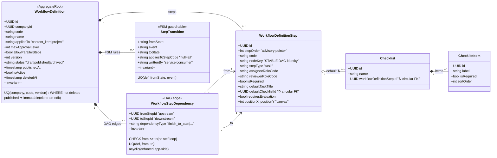

**Điểm thiết kế cốt lõi:**
- `nodeKey` = **danh tính bền vững** của một bước trong DAG (tách khỏi `stepOrder` vốn chỉ còn là con trỏ advisory). Dependency và canvas tham chiếu `nodeKey`, nên instance đọc DAG đúng dù template clone sang version mới.
- **FK vòng** `WorkflowDefinitionStep.defaultChecklistId ⇄ Checklist.workflowDefinitionStepId` — Drizzle giải bằng lazy thunk (`AnyPgColumn`).
- `step_transitions` = **FSM dữ-liệu-hóa**: engine từ chối mọi cặp `(from_state, event)` không có trong bảng → có thể tùy biến luồng theo từng company mà không sửa code.

### 1.2. Tầng B + C — INSTANCE & APPROVAL (thực thi + phê duyệt)

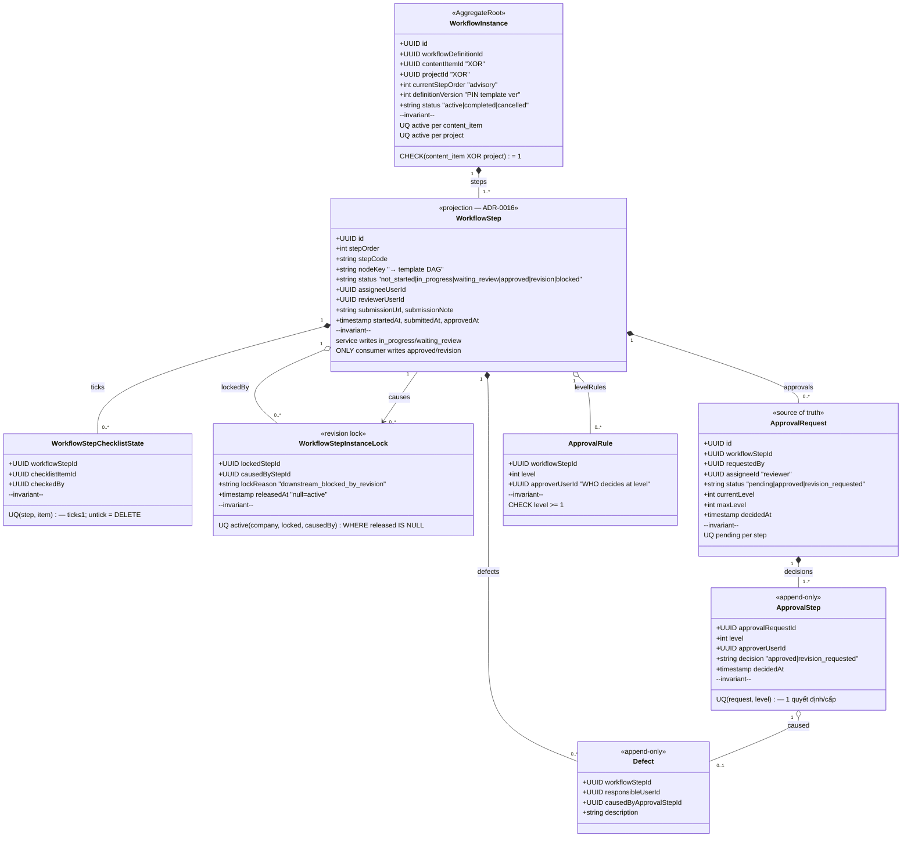

### 1.3. Tầng D — TASK HUB (việc thống nhất, BẤT BIẾN #4)

```mermaid
classDiagram
    direction LR
    class Task {
        <<unified hub>>
        +UUID id
        +string taskType "workflow_step|production|review|revision|meeting_action|office|finance|hr"
        +UUID workflowStepId "FK set null"
        +UUID workflowInstanceId "FK set null"
        +UUID contentItemId "FK set null"
        +UUID projectId "FK set null"
        +string title
        +UUID assigneeUserId
        +string status "not_started|in_progress|waiting_review|revision|approved|completed"
        +string origin "initial|revision"
        +int revisionRound
        +timestamp dueDate
        +timestamp deletedAt "soft delete"
        --invariant--
        UQ dedup(company, step, revisionRound) WHERE step NOT NULL & not deleted
    }
    class TaskComment {
        <<append-only>>
        +UUID taskId
        +UUID userId
        +string body
    }
    class TaskAttachment {
        <<append-only / soft-del>>
        +UUID taskId
        +UUID uploadedBy
        +string storageKey "SERVER-derived {co}/tasks/{task}/{uuid}"
        +string fileName, contentType
        +bigint sizeBytes
        +timestamp deletedAt
        --invariant--
        no signed URL stored (BẤT BIẾN #3)
    }

    Task "1" *-- "0..*" TaskComment : thread
    Task "1" *-- "0..*" TaskAttachment : files
    Task "0..*" ..> "0..1" WorkflowStep : workflow_step (hub link)
    Task "0..*" ..> "0..1" WorkflowInstance : context
```

> **`tasks` là HUB**: có FK thật (đều `ON DELETE SET NULL`) tới `workflow_step / workflow_instance / content_item / project`, đồng thời nhận **task polymorphic** từ HR (`leave_requests`, `attendance_adjustment_requests`), Finance (`expense_requests`), Meeting (`meeting_tasks.task_id` — uuid trần). Một bảng việc duy nhất cho toàn hệ thống.

---

## 2. PACKAGE / COMPONENT DIAGRAM — Kiến trúc tầng

Kiến trúc **Modular Monolith** kiểu **Controller → Service → Repository**, với 4 service hạt nhân **thuần logic** (pure, không chạm DB) để dễ test và tách biệt nghiệp vụ khỏi I/O.

```mermaid
flowchart TB
    subgraph API["REST API Layer (NestJS Controllers)"]
        WTC["WorkflowTemplatesController<br/>/workflow-templates/*"]
        WC["WorkflowController<br/>/workflow/*"]
        AIC["ApprovalInboxController<br/>/approvals/*"]
        DC["DefectController<br/>/defects/*"]
        TC["TasksController<br/>/tasks/*"]
        TAC["TaskAttachmentsController"]
    end

    subgraph SVC["Service Layer (business logic)"]
        WTS["WorkflowTemplatesService<br/>(publish, clone, versioning)"]
        WS["WorkflowService<br/>(start, apply, step start/submit)"]
        AS["ApprovalService<br/>(approve/revision fan-out)"]
        AMS["ApprovalMultilevelService<br/>(level progression)"]
        DS["DefectService"]
        TS["TasksService (hub)"]
        HTS["HrTasksService (stateless tx-bridge)"]
        TAS["TaskAttachmentsService"]
    end

    subgraph PURE["Pure Domain Logic (NO DB — highly testable)"]
        FSM["WorkflowFsmService<br/>validateService/ConsumerTransition"]
        DAGV["DagValidatorService<br/>Kahn cycle + BFS reachability"]
        DAGU["workflow-dag.ts<br/>deps-approved, newly-unblocked"]
        LPS["LockPropagationService<br/>transitive descendant locks"]
        ADP["DagResultAdapter<br/>rows↔nodeKey, code map"]
    end

    subgraph REPO["Repository Layer (Drizzle + withTenant/RLS)"]
        WTR["WorkflowTemplatesRepository"]
        WR["WorkflowRepository"]
        ARR["ApprovalRulesRepository"]
        DR["DefectRepository"]
        TR["TasksRepository"]
    end

    subgraph INFRA["Cross-cutting Infrastructure"]
        OUT["OutboxService<br/>(transactional events)"]
        WORK["OutboxWorker<br/>(FOR UPDATE SKIP LOCKED)"]
        AUD["AuditService (append-only)"]
        PERM["PermissionService (can/RLS)"]
        DB[("PostgreSQL 16<br/>RLS + FORCE")]
    end

    WTC --> WTS --> WTR
    WC --> WS --> WR
    WC --> AS --> WR
    AIC --> AMS --> ARR
    DC --> DS --> DR
    TC --> TS --> TR
    TAC --> TAS --> TR

    WS --> FSM
    WS --> DAGU
    AS --> DAGU
    AS --> LPS
    AMS --> AS
    WTS --> DAGV
    WTS --> ADP
    DS --> TS

    SVC --> OUT
    SVC --> AUD
    SVC -.guard.-> PERM
    REPO --> DB
    OUT --> DB
    WORK --> DB
    WORK -.dispatch.-> SVC
```

**Quy ước phụ thuộc (luật tầng):**
1. Controller chỉ gọi Service; **không** chạm Repository/DB.
2. Service chứa **toàn bộ nghiệp vụ**; ủy thác tính toán thuần cho tầng PURE; ủy thác I/O cho Repository.
3. **Tầng PURE không có DB** → service tự resolve dữ liệu *trong transaction của mình* rồi **truyền kết quả vào** (vd `dependenciesApproved`, `stepLocked`, `checklistComplete` cho FSM). Điều này giữ FSM/DAG **kiểm thử được 100% bằng unit test**.
4. Mọi Repository đi qua `withTenant(companyId, fn)` → `set_config('app.current_company_id')` → **RLS + FORCE** ép cô lập tenant ở tầng DB (BẤT BIẾN #1).
5. **Transactional Outbox**: event ghi cùng transaction với mutation nghiệp vụ → không mất event, không "ghi DB xong mới publish".

---

## 3. STATE MACHINE DIAGRAMS — Vòng đời

### 3.1. Step FSM (trái tim của hệ thống) — `MVP0_TRANSITIONS`

Bảng chuyển trạng thái dữ-liệu-hóa (7 transition), phân biệt **ai được ghi** (`writtenBy`):

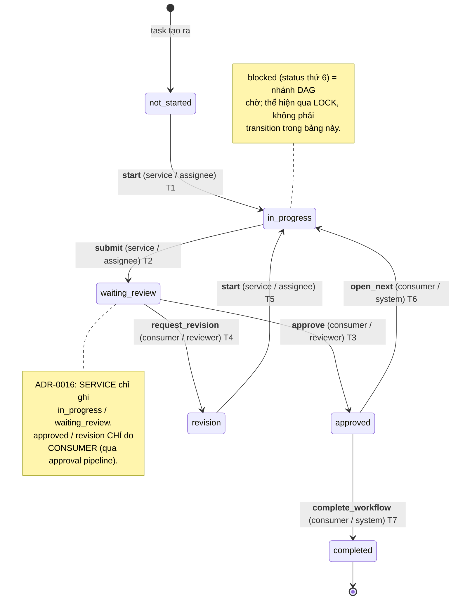

**Thứ tự 7 guard khi `validateServiceTransition` (start/submit)** — *fail-closed, kiểm trước khi tra bảng*:

| # | Guard | Lỗi ném | Mục đích |
|---|---|---|---|
| 1 | `instance.status === 'active'` | `WorkflowInactiveError` | Không thao tác trên instance đã đóng |
| 2 | `step.instanceId === instance.id` | `WorkflowNotFoundError` | Chống nhầm/giả mạo step |
| 3a | `stepLocked !== true` | `StepLockedError` | Bị khóa do upstream đang revision (BR-006) |
| 3b | `dependenciesApproved !== false` | `DependenciesNotMetError` | Mọi DAG dep upstream phải approved (thay guard tuyến tính cũ) |
| 4 | `actor === step.assigneeUserId` | `NotStepActorError` | Chỉ người được giao mới start/submit |
| 5 | `(status, event)` có trong bảng | `IllegalTransitionError` | FSM hợp lệ |
| 6 | `(status:event)` ∈ `SERVICE_EVENTS` | `IllegalTransitionError` | Chặn service ghi event consumer-only |
| 7 | `checklistComplete !== false` (chỉ submit) | `ChecklistIncompleteError` | Mọi checklist *required* đã tick |

**`validateConsumerTransition` (approve/request_revision)** thêm guard **reviewer fail-closed**: `reviewerUserId === null` → từ chối (chống bất kỳ ai self-approve khi PM chưa gán reviewer); `reviewerUserId !== actorId` → `NotReviewerError`.

### 3.2. Approval Request — phê duyệt đa cấp (multilevel)

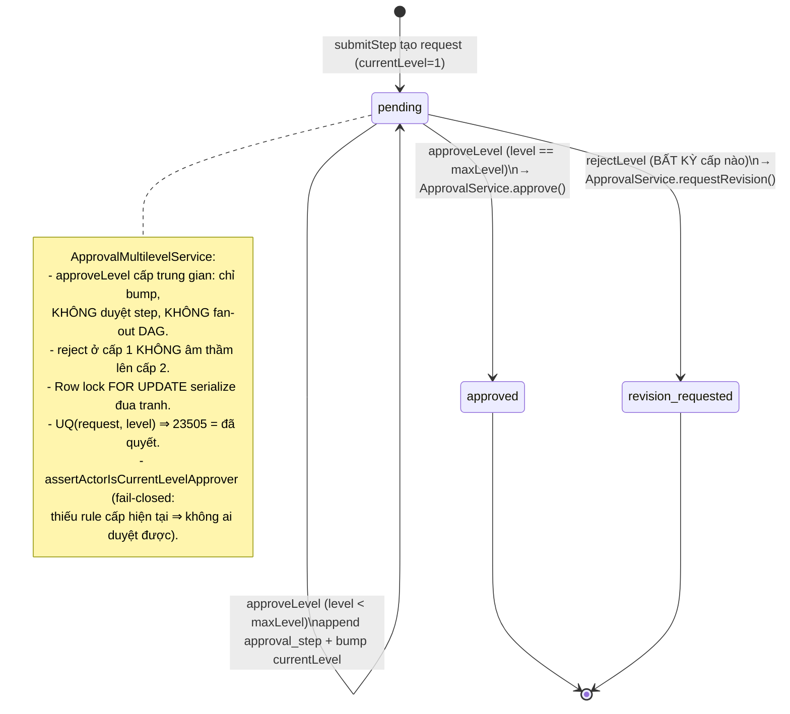

### 3.3. Workflow Instance & Definition lifecycle

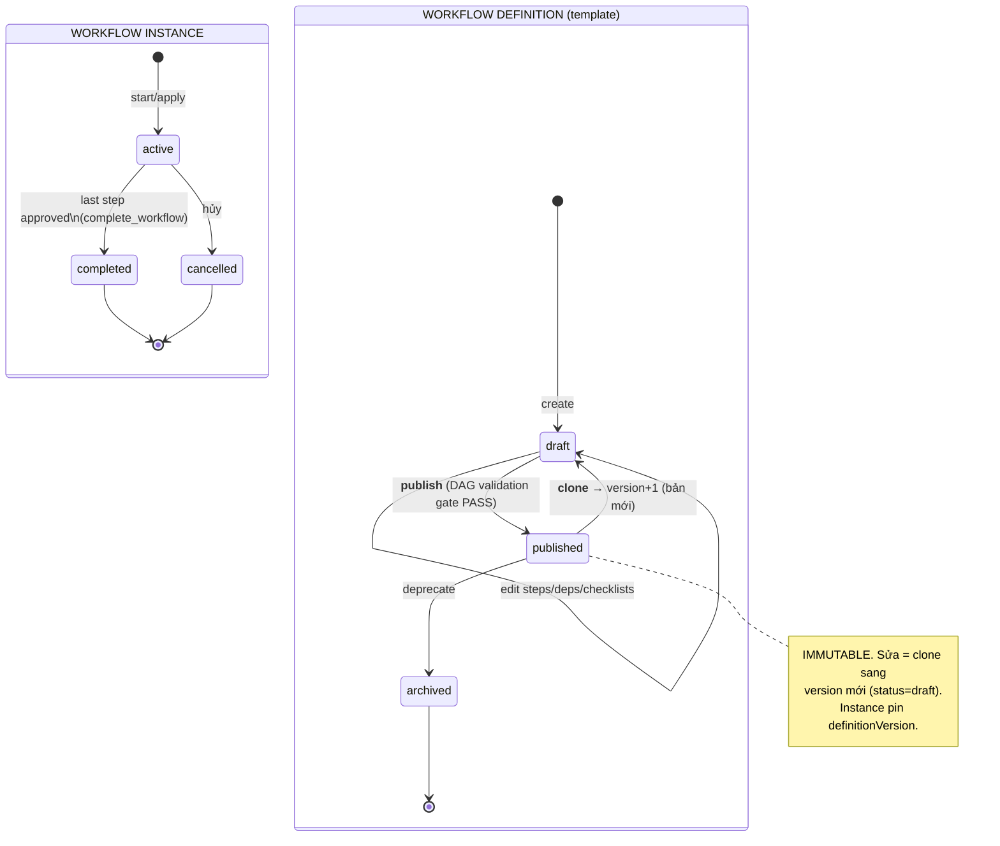

### 3.4. Task lifecycle — phân nhánh theo `task_type`

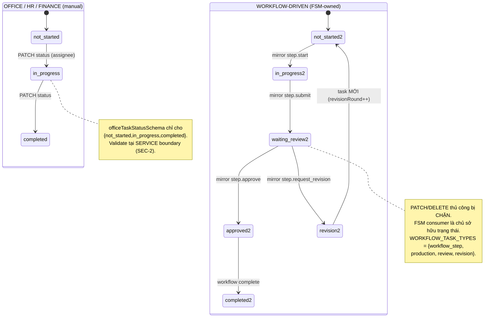

---

## 4. SEQUENCE DIAGRAMS — Các luồng hoạt động chính

### 4.1. Áp template → tạo Instance + Task gốc

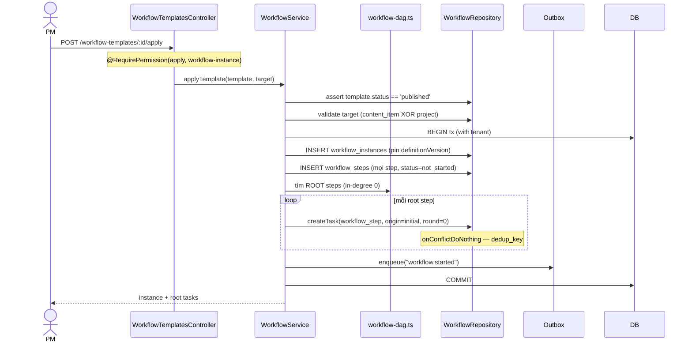

### 4.2. Start → Submit step (service-side FSM)

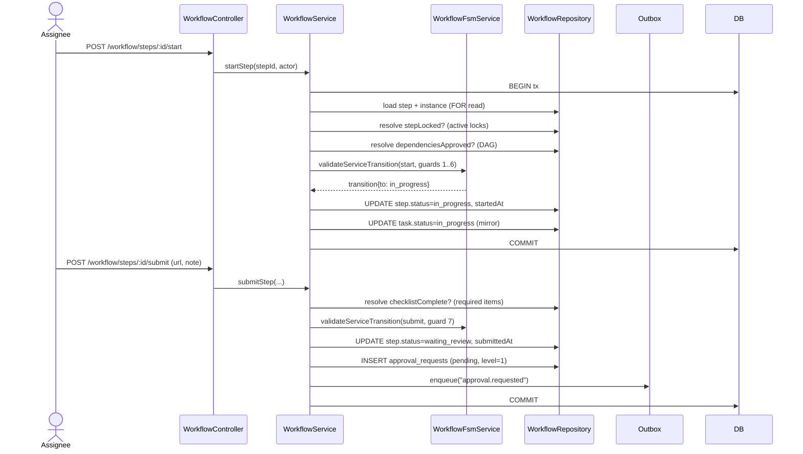

### 4.3. Approve → DAG fan-out (mở bước kế / hoàn tất)

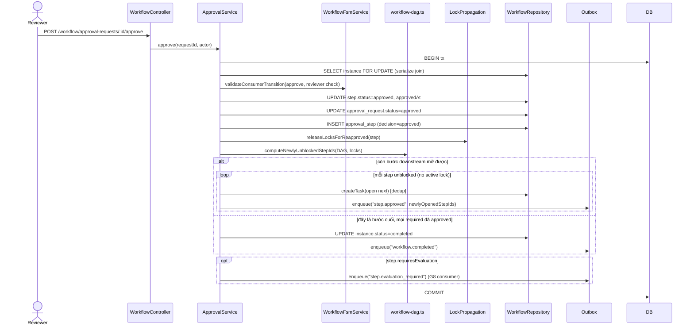

### 4.4. Request revision → Defect + lan truyền khóa (lock propagation)

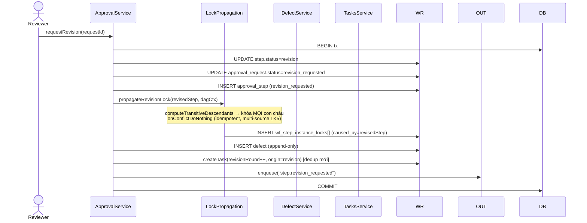

> Bước downstream bị khóa **chỉ mở lại** khi **mọi** nguồn khóa (caused_by) được re-approve (`releaseLocksForReapproved` xóa lock theo nguồn; join-point đa nguồn — LK5 — vẫn khóa tới khi nguồn cuối cùng được duyệt).

---

## 5. ACTIVITY DIAGRAM — Cổng kiểm DAG khi publish

```mermaid
flowchart TD
    A["POST /workflow-templates/:id/publish"] --> B{status == draft?}
    B -- no --> X1["TemplatePublishedImmutableError"]
    B -- yes --> C["load steps + deps trong tx"]
    C --> D["DagResultAdapter.buildDagInput<br/>(rows → nodeKey, FK integrity)"]
    D --> E["DagValidatorService.validateDag()"]
    E --> F1{trùng nodeKey?}
    F1 -- yes --> XR["aggregate errors"]
    E --> F2{self-dependency?}
    F2 -- yes --> XR
    E --> F3{endpoint không tồn tại?}
    F3 -- yes --> XR
    E --> F4{có ROOT (in-degree 0)?}
    F4 -- no --> XR
    E --> F5{chu trình? (Kahn topo-sort)}
    F5 -- yes --> XR
    E --> F6{node mồ côi? (BFS reachability)}
    F6 -- yes --> XR
    XR --> X2["TemplateDagInvalidError → HTTP 422 + list lỗi"]
    F1 & F2 & F3 & F4 & F5 & F6 -- tất cả PASS --> G["UPDATE status=published, publishedAt<br/>WHERE status=draft (atomic)"]
    G --> H["audit + return"]
```

**Thuật toán kiểm DAG** (`DagValidatorService`, thuần, gộp mọi lỗi — không early-return):
- **Chu trình:** Kahn topological sort — node còn dư sau khi rút hết in-degree-0 = node trong chu trình.
- **Khả đạt:** BFS từ tập root; node không thăm được = mồ côi (`UNREACHABLE_NODE`).
- **Cấu trúc:** trùng `nodeKey`, self-loop, endpoint lạ, thiếu root.

---

## 6. Mẫu thiết kế & bất biến (Design Patterns / Invariants)

| Pattern | Áp dụng | Cơ chế |
|---|---|---|
| **Transactional Outbox** | Mọi event nghiệp vụ | `outbox.enqueue(tx, …)` cùng tx với mutation → `OutboxWorker` đọc `FOR UPDATE SKIP LOCKED`, idempotent qua `processed_events(consumer, event_id)`, dead-letter sau 5 lần. |
| **Event-sourcing nhẹ / CQRS-projection (ADR-0016)** | `workflow_steps.status` | Approval (request/steps) = **write model / source of truth**; `workflow_steps.status` = **read projection**. Service ghi `in_progress/waiting_review`; **chỉ** consumer ghi `approved/revision`. |
| **Data-driven FSM** | `step_transitions` | Engine từ chối cặp `(from,event)` không khai báo → tùy biến luồng không cần đổi code. |
| **DAG (thay luồng tuyến tính)** | `workflow_step_dependencies` + `nodeKey` | Step mở khi *mọi* upstream approved; cho phép song song (`allow_parallel_steps`). `stepOrder` chỉ còn advisory. |
| **Idempotency / Dedup** | `tasks_dedup_key_uq(company, step, revisionRound)` | `onConflictDoNothing` chống sinh trùng task khi replay outbox. |
| **Append-only** | `approval_steps`, `defects`, `task_comments`, `task_attachments` | App role chỉ `SELECT/INSERT` (+`UPDATE(deleted_at)` cho attachment) — bảo toàn audit (BẤT BIẾN #2). |
| **Separation of Duties (SoD) đa cấp** | `approval_rules` + `approval_steps` | 1 quyết định/cấp (UQ), actor phải khớp approver cấp hiện tại, reject bất kỳ cấp → revision (không leo cấp ngầm). |
| **Exactly-one (XOR)** | `workflow_instances` | CHECK `(content_item XOR project) = 1`; UQ active per target. |
| **Optimistic immutability** | Template published | Clone-on-edit sang `version+1`; instance pin `definition_version`. |
| **Pure core, impure shell** | FSM / DAG / Lock / Adapter | Logic thuần không DB; service resolve dữ liệu trong tx rồi truyền vào → unit-test 100%. |
| **Hub thống nhất (ADR-0024)** | `tasks` | Một bảng việc cho workflow + HR + finance + meeting; FK `SET NULL` giữ task sống độc lập với nguồn. |

---

## 7. Use-Case View (tác nhân & quyền)

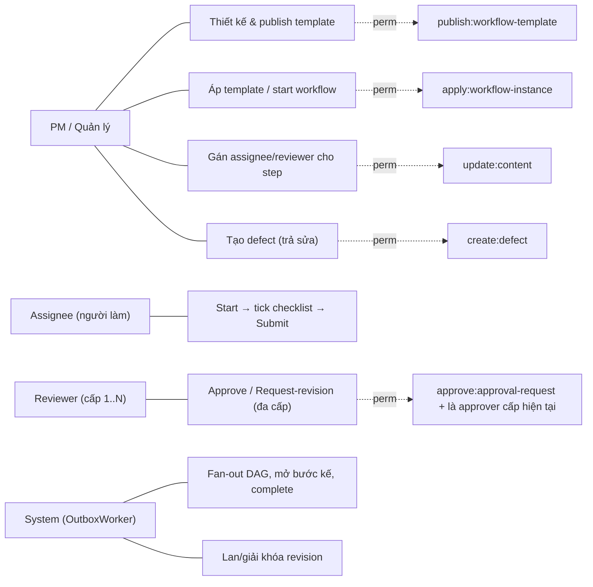

| Endpoint tiêu biểu | Verb | Quyền |
|---|---|---|
| `/workflow-templates` | POST | `create:workflow-template` |
| `/workflow-templates/:id/publish` | POST | `publish:workflow-template` (cổng DAG) |
| `/workflow-templates/:id/clone` | POST | `create:workflow-template` |
| `/workflow-templates/:id/apply` | POST | `apply:workflow-instance` |
| `/workflow/steps/:id/assign` | POST | `update:content` + PermissionGuard |
| `/workflow/steps/:id/start` · `/submit` | POST | RLS + FSM (actor = assignee) |
| `/workflow/approval-requests/:id/approve` · `/request-revision` | POST | RLS + FSM (actor = reviewer cấp hiện tại) |
| `/defects` | POST | `create:defect` (fail-closed trước tx) |
| `/tasks` (board) | GET | `read:task` |
| `/tasks` (tạo office) | POST | `create:task` |
| `/tasks/:id/status` | PATCH | `update:task` (chặn task workflow-driven) |
| `/tasks/:id/attachments` | POST | `create:task` **OR** là assignee (OR-gate) |

---

## 8. Tổng kết — "đọc" domain này thế nào

1. **Template** vẽ ra DAG các bước + FSM + checklist; **published là bất biến**, sửa thì clone version mới.
2. **Apply** một template lên 1 content_item *hoặc* project → sinh **instance** + **step projection** + **task gốc** cho các bước root.
3. **Assignee** start → tick required checklist → submit; FSM kiểm **7 guard fail-closed** rồi tạo **approval_request**.
4. **Reviewer** approve/reject; approval đa cấp leo cấp (`approval_rules`); chỉ **approve cấp cuối** mới chạm step.
5. **Consumer** (ADR-0016) ghi `approved/revision` lên projection, **fan-out DAG** mở bước kế hoặc **hoàn tất** instance; `requiresEvaluation` bắn event sang KPI/Evaluation (G8).
6. **Revision** sinh **defect** (append-only) + **task trả-sửa** (revisionRound++) + **lan khóa** mọi con cháu DAG; chỉ mở lại khi mọi nguồn re-approve.
7. Mọi việc đổ về **Task Hub** — một bảng `tasks` cho toàn hệ thống, với comment & attachment append-only.

> Sinh từ code tại nhánh `feat/web-ui-redesign-foundation` (đối chiếu schema `040dd82`). Cập nhật khi `workflow.ts` / module workflow đổi.
