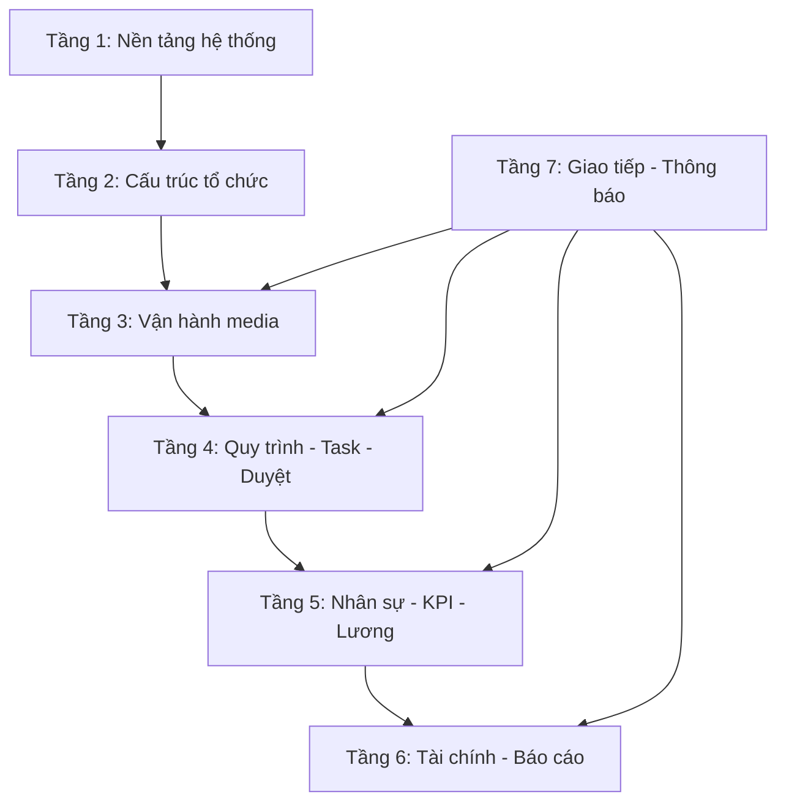
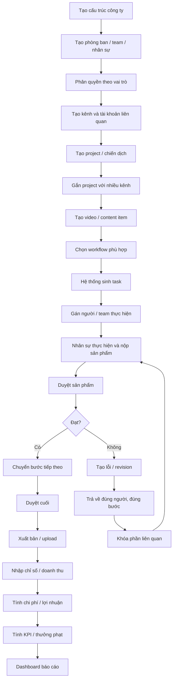
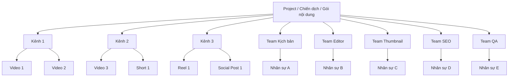
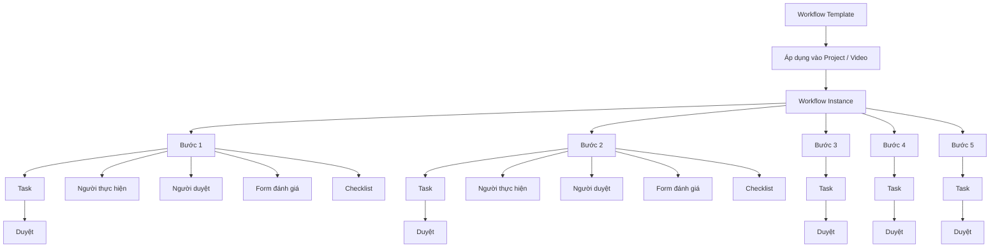
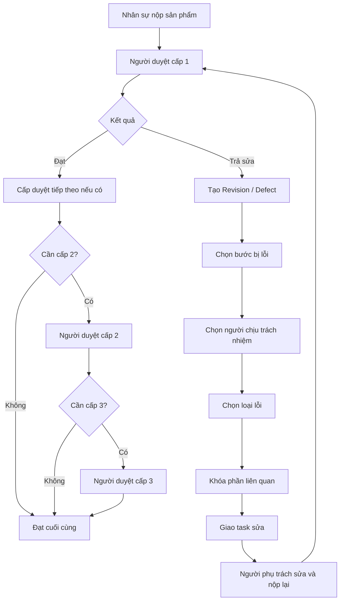
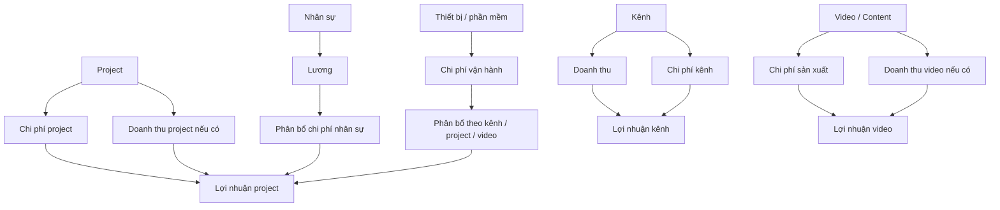
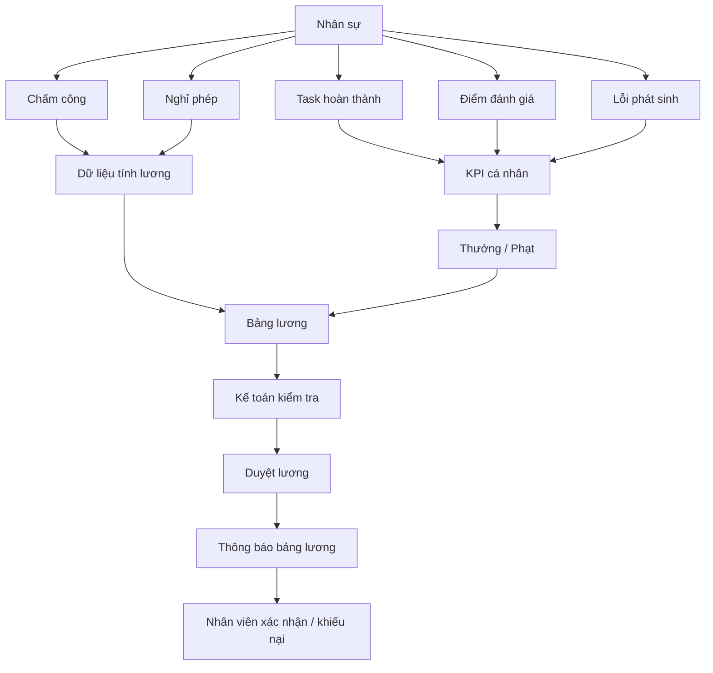
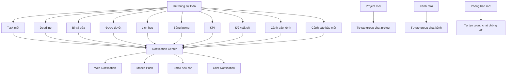

**sơ đồ module tổng thể MVP v1** 
# 1. Sơ đồ tổng thể cấp cao

```mermaid
flowchart TB
    A[Media Company Operating System]

    A --> B[Core Platform]
    A --> C[Media Operation]
    A --> D[Workflow & Task]
    A --> E[HR & Payroll]
    A --> F[Finance]
    A --> G[Communication]
    A --> H[Analytics & Dashboard]
    A --> I[Admin & Security]

    B --> B1[Company / Workspace]
    B --> B2[Phòng ban / Khối]
    B --> B3[Team / Ekip]
    B --> B4[Nhân sự]
    B --> B5[Chức vụ]

    C --> C1[Quản lý kênh]
    C --> C2[Quản lý tài khoản nền tảng]
    C --> C3[Project / Chiến dịch]
    C --> C4[Video / Content Item]
    C --> C5[Content Type / Thể loại]
    C --> C6[Channel Health]

    D --> D1[Workflow Builder]
    D --> D2[Workflow Instance]
    D --> D3[Task Management]
    D --> D4[Approval 3 cấp]
    D --> D5[Revision / Defect]
    D --> D6[Evaluation Form]

    E --> E1[Chấm công]
    E --> E2[Nghỉ phép]
    E --> E3[KPI cá nhân]
    E --> E4[Lương]
    E --> E5[Thưởng / Phạt]
    E --> E6[Bảng lương]

    F --> F1[Doanh thu]
    F --> F2[Chi phí]
    F --> F3[Phân bổ chi phí]
    F --> F4[Lợi nhuận]
    F --> F5[Đề xuất chi]
    F --> F6[Duyệt chi]

    G --> G1[Chat realtime]
    G --> G2[Nhóm chat tự động]
    G --> G3[Thông báo]
    G --> G4[Lịch họp]
    G --> G5[Biên bản họp]
    G --> G6[Task sau họp]

    H --> H1[Dashboard lãnh đạo]
    H --> H2[Dashboard quản lý]
    H --> H3[Dashboard nhân viên]
    H --> H4[Dashboard HR]
    H --> H5[Dashboard kế toán]
    H --> H6[Báo cáo kênh / project]

    I --> I1[Role & Permission]
    I --> I2[Audit Log]
    I --> I3[Notification Rule]
    I --> I4[System Config]
    I --> I5[Data Security]
```



---

# 2. Sơ đồ module theo tầng hệ thống

Hệ thống nên chia thành **7 tầng chính**.



Ý nghĩa:

```text
Tầng nền tảng tạo ra công ty, quyền, bảo mật.
Tầng tổ chức tạo ra phòng ban, team, nhân sự.
Tầng media quản lý kênh, project, video.
Tầng workflow điều phối quy trình, task, duyệt, trả sửa.
Tầng HR/KPI/Lương lấy dữ liệu từ task, lỗi, đánh giá.
Tầng tài chính tính doanh thu, chi phí, lợi nhuận.
Tầng chat/thông báo kết nối toàn bộ hệ thống.
```

---

# 3. Sơ đồ module chi tiết theo nghiệp vụ

```mermaid
flowchart LR
    subgraph ORG[1. Tổ chức & nhân sự]
        ORG1[Công ty]
        ORG2[Phòng ban / Khối]
        ORG3[Team / Ekip]
        ORG4[Chức vụ]
        ORG5[Nhân sự]
        ORG6[Quản lý trực tiếp]
    end

    subgraph MEDIA[2. Media Operation]
        M1[Kênh]
        M2[Tài khoản nền tảng]
        M3[Project / Chiến dịch]
        M4[Video / Content]
        M5[Thể loại nội dung]
        M6[Sức khỏe kênh]
    end

    subgraph WORK[3. Workflow & Task]
        W1[Workflow Template]
        W2[Workflow Instance]
        W3[Task]
        W4[Checklist]
        W5[Duyệt 3 cấp]
        W6[Trả sửa / Lỗi]
        W7[Đánh giá sản phẩm]
    end

    subgraph HR[4. HR & Payroll]
        H1[Chấm công]
        H2[Nghỉ phép]
        H3[KPI]
        H4[Đánh giá nhân sự]
        H5[Lương]
        H6[Thưởng / Phạt]
    end

    subgraph FIN[5. Finance]
        F1[Doanh thu]
        F2[Chi phí]
        F3[Phân bổ chi phí]
        F4[Lợi nhuận]
        F5[Đề xuất chi]
        F6[Duyệt chi]
    end

    subgraph COM[6. Communication]
        C1[Chat realtime]
        C2[Group chat tự động]
        C3[Thông báo]
        C4[Lịch họp]
        C5[Biên bản họp]
        C6[Task sau họp]
    end

    subgraph DASH[7. Dashboard & Report]
        D1[Dashboard lãnh đạo]
        D2[Dashboard quản lý]
        D3[Dashboard nhân viên]
        D4[Dashboard HR]
        D5[Dashboard kế toán]
        D6[Báo cáo kênh/project]
    end

    ORG --> MEDIA
    MEDIA --> WORK
    WORK --> HR
    WORK --> FIN
    HR --> FIN
    COM --> WORK
    COM --> HR
    COM --> MEDIA
    MEDIA --> DASH
    WORK --> DASH
    HR --> DASH
    FIN --> DASH
```



---

# 4. Sơ đồ luồng vận hành chính

Đây là luồng xương sống của toàn bộ hệ thống.



---

# 5. Sơ đồ quan hệ giữa Project, Kênh, Video, Team

Vì bạn nói **một project có thể gồm nhiều kênh, nhiều video, nhiều ekip**, nên quan hệ nên như sau:



Cách hiểu:

```text
Project là cấp quản lý lớn.
Kênh là nơi project triển khai.
Video/content là sản phẩm cụ thể.
Team/ekip là nhóm thực hiện.
Nhân sự có thể tham gia nhiều project khác nhau.
```

---

# 6. Sơ đồ workflow linh hoạt



Workflow cần hỗ trợ 2 kiểu:

```text
1. Tuần tự:
Script → Voice → Dựng → QA → Upload

2. Song song:
Tạo voice + Tạo hình ảnh + Thumbnail + SEO có thể chạy cùng lúc,
nhưng Upload chỉ mở khi tất cả phần bắt buộc đã được duyệt.
```

---

# 7. Sơ đồ duyệt và trả sửa



---

# 8. Sơ đồ tài chính liên kết với vận hành



Trong MVP v1:

```text
Doanh thu: nhập tay.
Chi phí: nhập tay + phân bổ tự động cơ bản.
Lợi nhuận: tính theo công thức doanh thu - chi phí.
```

---

# 9. Sơ đồ HR, KPI, lương thưởng



---

# 10. Sơ đồ chat và notification



---

# 11. Sơ đồ menu tổng thể trên Web App

```text
Dashboard
├── Tổng quan công ty
├── Sản xuất
├── Kênh
├── Tài chính
├── Nhân sự
└── KPI

Tổ chức
├── Công ty
├── Phòng ban / Khối
├── Team / Ekip
├── Chức vụ
├── Nhân sự
└── Sơ đồ tổ chức

Kênh & Nền tảng
├── Danh sách kênh
├── Tài khoản nền tảng
├── Sức khỏe kênh
├── Doanh thu kênh
├── Chi phí kênh
└── Lịch đăng

Project & Nội dung
├── Project
├── Chiến dịch
├── Video / Content
├── Content Type
├── Lịch sản xuất
└── File / Link liên quan

Workflow
├── Workflow Template
├── Workflow đang chạy
├── Step
├── Checklist
├── Approval Rule
└── Evaluation Form

Task   ← đơn vị công việc DÙNG CHUNG toàn hệ thống (7 nguồn: sản xuất/duyệt/sửa/họp/văn phòng/tài chính/HR), KHÔNG riêng video
├── Việc của tôi      (gộp tất cả nguồn)
├── Task team
├── Task project      (việc sản xuất gắn video)
├── Task văn phòng    (việc không liên quan sản xuất)
├── Task quá hạn
├── Task chờ duyệt    (gồm cả duyệt chi, nghỉ phép...)
└── Task sau họp

Duyệt & Trả sửa
├── Hàng chờ duyệt
├── Sản phẩm bị trả sửa
├── Lỗi loại 1
├── Lỗi loại 2
└── Lịch sử duyệt

HR & Chấm công
├── Hồ sơ nhân sự
├── Chấm công
├── Nghỉ phép
├── Lịch làm việc
└── Đơn từ

KPI & Đánh giá
├── KPI cá nhân
├── KPI team
├── KPI phòng ban
├── KPI kênh
├── Đánh giá sản phẩm
└── Đánh giá hiệu suất

Lương & Thưởng phạt
├── Bảng lương
├── Thưởng
├── Phạt
├── Phụ cấp
├── Khấu trừ
└── Khiếu nại lương

Tài chính
├── Doanh thu
├── Chi phí
├── Phân bổ chi phí
├── Lợi nhuận
├── Đề xuất chi
└── Duyệt chi

Giao tiếp
├── Chat
├── Nhóm chat
├── Thông báo
├── Lịch họp
├── Biên bản họp
└── Task sau họp

Cài đặt
├── Role & Permission
├── Notification Rule
├── Workflow Config
├── Payroll Config
├── Finance Config
├── Audit Log
└── System Config
```

---

# 12. Sơ đồ menu Mobile App

Mobile không nên ôm toàn bộ web. Mobile nên tập trung vào thao tác nhanh.

```text
Trang chủ
├── Task hôm nay
├── Thông báo quan trọng
├── Lịch họp
└── Chấm công nhanh

Task
├── Việc của tôi
├── Việc sắp hết hạn
├── Việc bị trả sửa
├── Việc chờ duyệt
└── Nộp sản phẩm

Chat
├── Chat cá nhân
├── Chat nhóm
├── Chat project
├── Chat kênh
└── Chat phòng ban

Thông báo
├── Công việc
├── Họp
├── Chấm công
├── Lương thưởng
├── KPI
└── Cảnh báo bắt buộc

Duyệt
├── Chờ tôi duyệt
├── Duyệt nhanh
├── Trả sửa
└── Xem lịch sử

HR cá nhân
├── Chấm công
├── Xin nghỉ phép
├── Lịch làm việc
├── Bảng lương
└── KPI cá nhân

Lịch
├── Lịch họp
├── Lịch deadline
├── Lịch nghỉ
└── Lịch sản xuất liên quan
```

---

# 13. Bản rút gọn sơ đồ module tổng thể

Nếu cần trình bày nhanh cho đội dev, dùng bản này:

```text
MEDIA OS MVP v1
│
├── 1. Core Platform
│   ├── Company
│   ├── User
│   ├── Department
│   ├── Team
│   ├── Position
│   └── Role & Permission
│
├── 2. Media Management
│   ├── Channel
│   ├── Platform Account
│   ├── Project
│   ├── Content / Video
│   ├── Content Type
│   └── Channel Health
│
├── 3. Workflow Operation
│   ├── Workflow Builder
│   ├── Task
│   ├── Checklist
│   ├── Approval
│   ├── Revision / Defect
│   └── Evaluation
│
├── 4. HR & Performance
│   ├── Attendance
│   ├── Leave
│   ├── KPI
│   ├── Performance Review
│   ├── Payroll
│   └── Bonus / Penalty
│
├── 5. Finance
│   ├── Revenue
│   ├── Cost
│   ├── Cost Allocation
│   ├── Profit
│   ├── Expense Request
│   └── Finance Report
│
├── 6. Communication
│   ├── Realtime Chat
│   ├── Auto Group Chat
│   ├── Notification Center
│   ├── Meeting
│   └── Meeting Task
│
├── 7. Dashboard & Report
│   ├── Leadership Dashboard
│   ├── Manager Dashboard
│   ├── Employee Dashboard
│   ├── HR Dashboard
│   └── Finance Dashboard
│
└── 8. System Admin
    ├── Audit Log
    ├── Notification Rule
    ├── Workflow Config
    ├── Payroll Config
    └── Security Config
```

---

# 14. Thứ tự nên thiết kế UI theo module

Tôi khuyên không thiết kế UI theo thứ tự menu, mà theo thứ tự vận hành:

```text
1. Đăng nhập / phân quyền
2. Công ty / phòng ban / team / nhân sự
3. Kênh
4. Project
5. Video / content
6. Workflow
7. Task
8. Duyệt / trả sửa
9. KPI
10. Chấm công / nghỉ phép
11. Lương / thưởng / phạt
12. Tài chính
13. Chat / notification
14. Dashboard
15. Cài đặt hệ thống
```